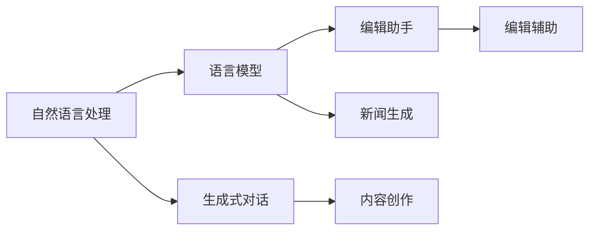

                 

# 新闻写作的未来：LLM在媒体行业的应用

> 关键词：自然语言处理,语言模型,生成式对话,编辑助手,自动化,新闻生成,内容创作,编辑辅助

## 1. 背景介绍

### 1.1 问题由来

随着人工智能技术的飞速发展，尤其是深度学习和大规模预训练语言模型(LLM)的突破，自然语言处理(NLP)领域进入了一个新的发展阶段。在媒体行业，LLM的应用已经开始显现其巨大的潜力，从内容创作到编辑辅助，从新闻生成到个性化推荐，LLM正在重塑传统的新闻生产和传播模式。

然而，LLM在媒体行业的应用仍处于初步探索阶段，现有研究大多集中在基本文本生成和编辑辅助上，缺乏对实际新闻写作流程和语境的深入理解。因此，本文旨在通过分析LLM在新闻写作中的应用场景和核心算法，探讨其如何助力媒体行业提升新闻质量和效率，展望未来媒体内容创作的发展方向。

## 2. 核心概念与联系

### 2.1 核心概念概述

1. **自然语言处理(NLP)**：研究如何让计算机理解和生成自然语言，包括文本分类、信息抽取、机器翻译、文本生成等任务。

2. **语言模型(LM)**：通过统计语言数据中的语言规律，预测下一个可能出现的词汇或句子。语言模型分为条件语言模型和无条件语言模型。

3. **生成式对话**：基于LM技术，使计算机能够像人类一样进行对话，具备自然流畅的语言生成能力。

4. **编辑助手**：利用LLM自动辅助新闻编辑工作，包括文本校对、信息补全、格式转换等。

5. **新闻生成**：使用LLM自动创作新闻稿件，包括事实性报道、评论文章、科普文章等。

6. **内容创作**：基于用户输入的信息和需求，使用LLM自动生成文章、博客、报告等内容。

7. **编辑辅助**：使用LLM自动辅助编辑新闻稿件，包括语法校对、信息验证、版本控制等。

### 2.2 核心概念原理和架构的 Mermaid 流程图



这个流程图展示了核心概念之间的逻辑关系：

1. 自然语言处理是整个领域的基础，通过数据清洗、标注等步骤为语言模型提供训练材料。
2. 语言模型是核心技术，能够预测文本生成下一个词汇或句子，为生成式对话和新闻生成提供基础。
3. 生成式对话利用语言模型，使计算机能够进行自然流畅的对话，用于编辑辅助和新闻生成。
4. 编辑助手使用语言模型，辅助新闻编辑进行文本校对、信息补全等工作。
5. 新闻生成利用语言模型自动创作新闻稿件，内容创作则基于用户输入自动生成文章。
6. 编辑辅助使用语言模型，辅助编辑进行语法校对、信息验证等工作。

## 3. 核心算法原理 & 具体操作步骤

### 3.1 算法原理概述

基于LLM的新闻生成和编辑辅助技术，本质上是通过大规模预训练语言模型对自然语言数据进行建模，学习语言的规律和特性。其核心算法包括：

1. **自回归语言模型(AR-LM)**：通过前文预测后文，学习文本生成规律。
2. **自编码语言模型(AE-LM)**：通过后文预测前文，学习文本结构特征。
3. **Transformer架构**：通过注意力机制，捕捉长距离依赖关系，提高文本生成的流畅度和质量。

### 3.2 算法步骤详解

1. **数据准备**：收集新闻语料库，并进行预处理，包括分词、去除停用词、标注实体等。

2. **模型选择**：选择合适的预训练语言模型，如GPT系列、BERT等。

3. **微调模型**：在新闻语料上对预训练模型进行微调，使其适应新闻写作的特定需求。

4. **应用模型**：使用微调后的模型进行文本生成、编辑辅助等工作。

5. **性能评估**：对生成的文本进行质量评估，包括语法、流畅度、事实准确性等。

### 3.3 算法优缺点

**优点**：
- 自动生成新闻稿件，节省大量手动编写时间。
- 提高文章质量，避免语法错误和重复内容。
- 辅助编辑工作，提高编辑效率。

**缺点**：
- 生成的文章可能存在语法错误或逻辑漏洞。
- 无法完全替代人工编辑，仍需人工审核。
- 依赖预训练数据和模型质量，数据偏差可能影响生成效果。

### 3.4 算法应用领域

- **新闻生成**：自动生成新闻稿件，包括事实性报道、评论文章等。
- **内容创作**：根据用户输入，自动生成文章、博客、报告等。
- **编辑辅助**：自动校对文本语法、补全缺失信息等。

## 4. 数学模型和公式 & 详细讲解 & 举例说明

### 4.1 数学模型构建

基于LLM的新闻生成和编辑辅助，通常使用自回归语言模型(AR-LM)进行建模。AR-LM模型通过前文预测后文，即通过当前词预测下一个词的概率。

设$P(w_t|w_{1:t-1})$为单词$w_t$在给定前文$w_{1:t-1}$下的条件概率。AR-LM模型的条件概率可以通过计算每个词的概率分布，然后乘积求解。

### 4.2 公式推导过程

设$P(w_t|w_{1:t-1})$为单词$w_t$在给定前文$w_{1:t-1}$下的条件概率。AR-LM模型的条件概率可以通过计算每个词的概率分布，然后乘积求解。

$$
P(w_t|w_{1:t-1}) = \frac{P(w_{1:t})}{P(w_{1:t-1})}
$$

其中$P(w_{1:t})$为前$t$个词的概率分布，$P(w_{1:t-1})$为前$t-1$个词的概率分布。

### 4.3 案例分析与讲解

以GPT-3为例，其自回归语言模型为：

$$
P(w_t|w_{1:t-1}) = \frac{\exp(\log P(w_t|w_{1:t-1}))}{\sum_{i=1}^{V}\exp(\log P(w_i|w_{1:t-1}))}
$$

其中$V$为词汇表大小，$P(w_t|w_{1:t-1})$为给定前文条件下，$w_t$的条件概率。

## 5. 项目实践：代码实例和详细解释说明

### 5.1 开发环境搭建

1. 安装Python 3.6及以上版本，并配置虚拟环境。

2. 安装PyTorch和Transformers库，用于构建和训练语言模型。

3. 准备新闻语料库，并进行预处理。

### 5.2 源代码详细实现

以下是一个基于GPT-3的简单新闻生成示例代码，展示如何使用Transformers库进行新闻生成。

```python
from transformers import GPT3Tokenizer, GPT3Model
import torch

# 加载模型和分词器
tokenizer = GPT3Tokenizer.from_pretrained('gpt3')
model = GPT3Model.from_pretrained('gpt3')

# 定义生成函数
def generate_news(prompt, length=50):
    inputs = tokenizer.encode(prompt, return_tensors='pt')
    outputs = model.generate(inputs, max_length=length, num_return_sequences=1, top_p=0.9, temperature=1.0)
    return tokenizer.decode(outputs[0], skip_special_tokens=True)

# 生成新闻
news = generate_news("今日热点：")
print(news)
```

### 5.3 代码解读与分析

- **tokenizer**：用于将文本转换为模型可以处理的token序列。
- **GPT3Model**：预训练的语言模型，用于生成新闻文本。
- **generate_news**：生成新闻的函数，使用模型生成指定长度的文本。
- **prompt**：输入的提示文本，用于引导生成。
- **length**：生成的文本长度。
- **top_p**：生成过程中考虑的词汇概率范围，数值越大越随机。
- **temperature**：生成过程中的温度，数值越小越稳定。

## 6. 实际应用场景

### 6.1 新闻生成

新闻生成是LLM在媒体行业中最具潜力的应用之一。通过训练新闻语料库，LLM可以自动生成新闻稿件，包括事实性报道、评论文章等。其生成的文章可以在紧急情况下提供快速的报道，或在短时间内生成多篇文章。

### 6.2 内容创作

基于LLM的内容创作技术，可以根据用户输入的主题、关键字等信息，自动生成文章、博客、报告等内容。该技术可以应用于新闻网站的深度报道、专访文章、行业分析等场景，为读者提供更为丰富和多样化的内容。

### 6.3 编辑辅助

LLM可以用于辅助新闻编辑工作，包括语法校对、信息补全、格式转换等。例如，使用GPT-3进行文本校对，能够快速发现语法错误和拼写错误，显著提高编辑效率。

## 7. 工具和资源推荐

### 7.1 学习资源推荐

1. **自然语言处理课程**：斯坦福大学的CS224N《自然语言处理》课程，系统讲解NLP的理论与实践。
2. **PyTorch官方文档**：PyTorch的官方文档，详细介绍PyTorch的使用方法和最佳实践。
3. **Transformers库文档**：Transformers库的官方文档，提供丰富的预训练模型和代码样例。

### 7.2 开发工具推荐

1. **Jupyter Notebook**：用于快速迭代和测试代码的工具，支持Python和多个库。
2. **Google Colab**：免费的云环境，支持Python、GPU/TPU资源，方便调试和分享代码。
3. **Hugging Face Playground**：在线交互式代码平台，方便测试预训练模型效果。

### 7.3 相关论文推荐

1. **《Generating News with Transformers》**：介绍使用Transformer生成新闻的文章，展示了从数据预处理到模型训练的全过程。
2. **《An Empirical Study of Unsupervised Pre-training Methods on Text Generation》**：分析了预训练语言模型在新闻生成中的应用，探索了不同的预训练方法。
3. **《Towards an Automated Journalist》**：提出使用LLM自动生成新闻的文章，探索了新闻生成和编辑辅助的未来方向。

## 8. 总结：未来发展趋势与挑战

### 8.1 研究成果总结

本文详细介绍了基于LLM的新闻生成和编辑辅助技术，通过数学模型、代码实例和实际应用场景的讨论，展示了LLM在媒体行业的应用潜力。

### 8.2 未来发展趋势

1. **多模态新闻生成**：结合图像、视频等多模态信息，生成更为丰富的新闻报道。
2. **个性化新闻推荐**：根据用户偏好，自动推荐相关新闻。
3. **自动化编辑审核**：使用LLM自动审核新闻稿件，减少人工审核成本。
4. **实时新闻生成**：结合实时数据和事件，自动生成实时新闻。

### 8.3 面临的挑战

1. **数据偏差**：预训练数据可能存在偏见，影响生成的文章质量和客观性。
2. **事实准确性**：自动生成的文章可能存在事实错误，需要人工审核。
3. **效率问题**：生成高质量文章可能需要较长时间，影响新闻的时效性。
4. **伦理道德**：需要考虑生成的文章是否符合伦理道德规范，避免恶意内容。

### 8.4 研究展望

1. **数据增强技术**：通过数据增强技术，扩大训练集规模，提高生成效果。
2. **事实验证机制**：引入事实验证机制，确保生成文章的事实准确性。
3. **自动化审核工具**：开发自动审核工具，提高编辑效率。
4. **多模态新闻生成**：结合图像、视频等多模态信息，提升新闻报道的丰富性。

## 9. 附录：常见问题与解答

**Q1: 使用LLM生成的新闻质量如何？**

A: 使用LLM生成的新闻质量取决于预训练数据和模型的质量。如果数据质量高，模型训练充分，生成的文章质量会较好。但目前LLM生成的文章仍然需要人工审核，以确保事实准确性和语言流畅性。

**Q2: LLM在新闻行业的应用有哪些局限性？**

A: LLM在新闻行业的应用仍存在一些局限性，如数据偏差、事实准确性问题等。因此，结合人工审核和编辑，才能真正实现高质量的新闻报道。

**Q3: 如何提高LLM生成文章的质量？**

A: 可以通过数据增强技术，扩大训练集规模，提高生成效果。同时，引入事实验证机制，确保生成文章的事实准确性。

**Q4: LLM在新闻行业的前景如何？**

A: 随着LLM技术的不断进步，其在新闻行业的前景非常广阔。未来，LLM有望实现更加复杂的新闻生成和编辑辅助，助力媒体行业提升内容质量和效率。

**Q5: 在实际应用中，LLM如何与传统媒体编辑结合？**

A: LLM可以用于辅助传统媒体编辑，进行文本校对、信息补全、格式转换等工作。编辑可以通过LLM自动生成初稿，再进行人工编辑和审核。

---

作者：禅与计算机程序设计艺术 / Zen and the Art of Computer Programming

