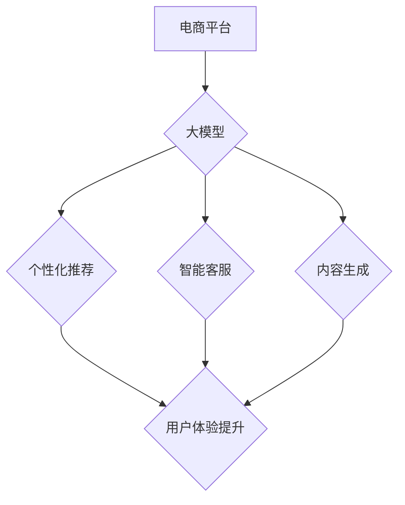

                 

## 大模型如何提升电商平台的全渠道用户体验一致性

> 关键词：大模型、电商平台、用户体验、全渠道、一致性、自然语言处理、个性化推荐、对话系统

## 1. 背景介绍

在当今数字化时代，电商平台已成为人们购物的首选方式。用户期望能够在任何时间、任何地点、任何设备上获得流畅、一致的购物体验。然而，传统的电商平台架构往往难以满足这一需求，用户在不同渠道（例如网站、移动应用、社交媒体）上的体验差异较大，导致用户体验不佳，甚至流失。

大模型技术的出现为解决这一问题提供了新的思路。大模型，指的是拥有大量参数、训练数据和计算资源的深度学习模型，能够学习和理解复杂的语言模式，并生成高质量的文本、图像和音频内容。

## 2. 核心概念与联系

### 2.1 全渠道用户体验

全渠道用户体验是指用户在与品牌互动的所有渠道（线上、线下、移动端、社交媒体等）上获得的整体体验。 

### 2.2 大模型

大模型是一种基于深度学习的强大人工智能模型，拥有数亿甚至数十亿个参数。通过训练海量文本数据，大模型能够学习语言的复杂结构和语义，并具备强大的文本生成、理解、翻译、问答等能力。

### 2.3 提升一致性

提升用户体验一致性意味着在所有渠道上提供相同的品牌形象、产品信息、服务标准和交互方式，从而使用户无论从哪个渠道访问，都能获得相同的、流畅的体验。

**大模型与电商平台全渠道用户体验一致性的关系**



## 3. 核心算法原理 & 具体操作步骤

### 3.1 算法原理概述

大模型在提升电商平台全渠道用户体验一致性方面主要通过以下算法原理实现：

* **自然语言处理 (NLP):** 大模型可以理解和处理用户自然语言输入，例如搜索词、评论、聊天记录等，从而更精准地理解用户需求。
* **机器学习 (ML):** 大模型可以学习用户行为模式、偏好和购买历史，并根据这些信息提供个性化推荐、内容和服务。
* **深度学习 (DL):** 大模型通过多层神经网络结构，能够学习更复杂的模式和关系，从而实现更精准的预测和理解。

### 3.2 算法步骤详解

1. **数据收集和预处理:** 收集用户行为数据、产品信息、市场趋势等数据，并进行清洗、格式化和标注等预处理工作。
2. **模型训练:** 使用收集到的数据训练大模型，例如BERT、GPT-3等，使其能够理解语言、识别模式和生成文本。
3. **模型部署:** 将训练好的大模型部署到电商平台的各个渠道，例如网站、移动应用、社交媒体等。
4. **用户交互:** 用户在不同渠道与电商平台进行交互，例如搜索商品、浏览产品、添加购物车、咨询客服等。
5. **模型响应:** 大模型根据用户交互数据，提供个性化推荐、智能客服回复、内容生成等服务，从而提升用户体验一致性。

### 3.3 算法优缺点

**优点:**

* **个性化推荐:** 大模型可以根据用户的兴趣、偏好和购买历史提供更精准的商品推荐，提升用户购物体验。
* **智能客服:** 大模型可以理解用户自然语言问题，并提供快速、准确的回复，提升用户服务体验。
* **内容生成:** 大模型可以自动生成产品描述、促销文案、新闻资讯等内容，节省人工成本，提升内容质量。

**缺点:**

* **数据依赖:** 大模型需要海量数据进行训练，数据质量和数量直接影响模型性能。
* **计算资源:** 训练和部署大模型需要大量的计算资源，成本较高。
* **模型解释性:** 大模型的决策过程较为复杂，难以解释其背后的逻辑，这可能导致用户对模型结果缺乏信任。

### 3.4 算法应用领域

大模型在电商平台以外的领域也具有广泛的应用前景，例如：

* **金融科技:** 欺诈检测、风险评估、个性化理财建议等。
* **医疗健康:** 疾病诊断、药物研发、患者管理等。
* **教育科技:** 智能辅导、个性化学习、自动批改作业等。

## 4. 数学模型和公式 & 详细讲解 & 举例说明

### 4.1 数学模型构建

大模型的训练过程本质上是一个优化问题，目标是找到模型参数，使得模型在训练数据上的预测性能达到最大。常用的数学模型包括：

* **交叉熵损失函数:** 用于衡量模型预测结果与真实标签之间的差异。

$$
Loss = - \sum_{i=1}^{N} y_i \log(\hat{y}_i)
$$

其中：

* $N$ 是样本数量
* $y_i$ 是真实标签
* $\hat{y}_i$ 是模型预测结果

* **梯度下降算法:** 用于更新模型参数，使得损失函数值不断减小。

### 4.2 公式推导过程

梯度下降算法的核心思想是沿着损失函数的负梯度方向更新模型参数。

$$
\theta = \theta - \alpha \nabla Loss(\theta)
$$

其中：

* $\theta$ 是模型参数
* $\alpha$ 是学习率
* $\nabla Loss(\theta)$ 是损失函数关于模型参数的梯度

### 4.3 案例分析与讲解

假设我们训练一个商品推荐模型，目标是预测用户是否会点击某个商品。我们可以使用交叉熵损失函数和梯度下降算法来训练模型。

在训练过程中，模型会不断更新参数，使得预测结果与真实点击情况的差异最小化。最终，训练好的模型能够根据用户的历史行为和商品信息，预测用户是否会点击某个商品。

## 5. 项目实践：代码实例和详细解释说明

### 5.1 开发环境搭建

* **操作系统:** Linux/macOS
* **编程语言:** Python
* **深度学习框架:** TensorFlow/PyTorch
* **硬件环境:** GPU

### 5.2 源代码详细实现

```python
# 导入必要的库
import tensorflow as tf

# 定义模型结构
model = tf.keras.Sequential([
    tf.keras.layers.Embedding(input_dim=vocab_size, output_dim=embedding_dim),
    tf.keras.layers.LSTM(units=128),
    tf.keras.layers.Dense(units=1, activation='sigmoid')
])

# 编译模型
model.compile(optimizer='adam', loss='binary_crossentropy', metrics=['accuracy'])

# 训练模型
model.fit(x_train, y_train, epochs=10, batch_size=32)

# 评估模型
loss, accuracy = model.evaluate(x_test, y_test)
print('Loss:', loss)
print('Accuracy:', accuracy)
```

### 5.3 代码解读与分析

* **Embedding层:** 将用户行为和商品信息转化为向量表示。
* **LSTM层:** 学习用户行为序列的长期依赖关系。
* **Dense层:** 输出预测结果，表示用户是否会点击商品。
* **Adam优化器:** 用于更新模型参数。
* **Binary Crossentropy损失函数:** 用于衡量模型预测结果与真实点击情况的差异。
* **Accuracy指标:** 用于评估模型的预测准确率。

### 5.4 运行结果展示

训练完成后，我们可以使用测试数据评估模型的性能。

## 6. 实际应用场景

### 6.1 个性化推荐

大模型可以根据用户的兴趣、偏好和购买历史，提供个性化的商品推荐，提升用户购物体验。例如，电商平台可以利用大模型分析用户的浏览记录、购物车内容和购买历史，推荐用户可能感兴趣的商品。

### 6.2 智能客服

大模型可以理解用户自然语言问题，并提供快速、准确的回复，提升用户服务体验。例如，电商平台可以利用大模型构建智能客服系统，帮助用户解决购物过程中的问题，例如商品信息查询、订单跟踪、退换货流程等。

### 6.3 内容生成

大模型可以自动生成产品描述、促销文案、新闻资讯等内容，节省人工成本，提升内容质量。例如，电商平台可以利用大模型自动生成商品描述，并根据不同的用户群体和场景，生成个性化的促销文案。

### 6.4 未来应用展望

随着大模型技术的不断发展，其在电商平台全渠道用户体验一致性方面的应用场景将更加广泛。例如：

* **多模态交互:** 大模型可以理解文本、图像、音频等多模态数据，提供更加丰富的用户交互体验。
* **个性化营销:** 大模型可以根据用户的行为和偏好，进行精准的营销推送，提升营销效果。
* **虚拟试衣间:** 大模型可以利用图像识别和生成技术，实现虚拟试衣间功能，提升用户购物体验。

## 7. 工具和资源推荐

### 7.1 学习资源推荐

* **书籍:**
    * 《深度学习》
    * 《自然语言处理》
* **在线课程:**
    * Coursera
    * edX
    * fast.ai

### 7.2 开发工具推荐

* **深度学习框架:** TensorFlow, PyTorch
* **自然语言处理库:** NLTK, spaCy
* **云计算平台:** AWS, Azure, GCP

### 7.3 相关论文推荐

* BERT: Pre-training of Deep Bidirectional Transformers for Language Understanding
* GPT-3: Language Models are Few-Shot Learners
* Transformer: Attention Is All You Need

## 8. 总结：未来发展趋势与挑战

### 8.1 研究成果总结

大模型技术在提升电商平台全渠道用户体验一致性方面取得了显著成果，例如个性化推荐、智能客服、内容生成等应用场景得到了广泛应用。

### 8.2 未来发展趋势

* **模型规模和能力提升:** 未来大模型的规模和能力将进一步提升，能够处理更复杂的任务，提供更精准的预测和理解。
* **多模态交互:** 大模型将支持多模态交互，例如文本、图像、音频等，提供更加丰富的用户体验。
* **边缘计算:** 大模型将部署到边缘设备，实现更快速的响应和更低的延迟。

### 8.3 面临的挑战

* **数据安全和隐私:** 大模型训练需要海量数据，如何保证数据安全和用户隐私是一个重要挑战。
* **模型解释性和可信度:** 大模型的决策过程较为复杂，难以解释其背后的逻辑，这可能导致用户对模型结果缺乏信任。
* **伦理和社会影响:** 大模型的应用可能带来一些伦理和社会问题，例如算法偏见、信息操控等，需要引起重视和关注。

### 8.4 研究展望

未来研究将重点关注以下几个方面：

* **开发更安全、更可靠的大模型算法。**
* **提高模型的解释性和可信度。**
* **研究大模型的伦理和社会影响，并制定相应的规范和政策。**


## 9. 附录：常见问题与解答

**Q1: 大模型训练需要多少数据？**

A1: 大模型训练需要海量数据，通常需要百万甚至数十亿条数据。

**Q2: 大模型训练需要多少计算资源？**

A2: 大模型训练需要大量的计算资源，通常需要使用高性能GPU集群。

**Q3: 如何保证大模型的公平性和公正性？**

A3: 

* 使用多样化的训练数据，避免算法偏见。
* 定期评估模型的公平性，并进行调整。
* 制定相应的规范和政策，引导大模型的良性发展。


作者：禅与计算机程序设计艺术 / Zen and the Art of Computer Programming 
<end_of_turn>

