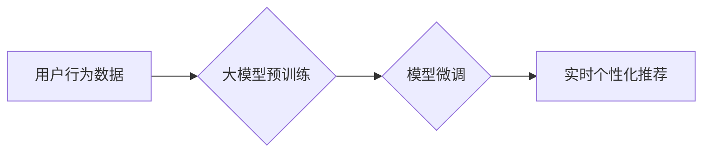

                 

## 大模型对推荐系统实时个性化的提升

> 关键词：大模型、推荐系统、实时个性化、Transformer、微调、冷启动、用户画像

## 1. 背景介绍

推荐系统作为互联网时代的核心技术之一，旨在根据用户的历史行为、偏好和上下文信息，精准推荐用户感兴趣的内容，从而提升用户体验和商业价值。传统的推荐系统主要依赖于协同过滤、内容过滤和基于知识图谱的方法，但这些方法在面对海量数据、用户多样性和内容更新快速等挑战时，存在一定的局限性。

近年来，大模型技术蓬勃发展，其强大的学习能力和泛化能力为推荐系统带来了新的机遇。大模型能够学习到更深层的用户和内容特征，并生成更精准、更个性化的推荐结果。

## 2. 核心概念与联系

### 2.1 大模型

大模型是指参数规模庞大、训练数据海量的人工智能模型，通常拥有数十亿甚至数千亿个参数。大模型通过深度学习技术，能够学习到复杂的模式和关系，并应用于各种自然语言处理、计算机视觉、语音识别等领域。

### 2.2 推荐系统

推荐系统旨在根据用户的历史行为、偏好和上下文信息，预测用户对特定内容的兴趣，并推荐用户可能感兴趣的内容。推荐系统可以分为基于内容的推荐、基于协同过滤的推荐和基于知识图谱的推荐等多种类型。

### 2.3 实时个性化

实时个性化是指根据用户的实时行为和上下文信息，动态调整推荐结果，提供更加个性化和精准的推荐体验。

**大模型与推荐系统实时个性化的关系：**

大模型可以为推荐系统提供更强大的学习能力和泛化能力，从而提升推荐系统的实时个性化水平。

**Mermaid 流程图：**



## 3. 核心算法原理 & 具体操作步骤

### 3.1 算法原理概述

大模型在推荐系统中的应用主要基于以下核心算法原理：

* **Transformer模型:** Transformer模型是一种基于注意力机制的深度学习模型，能够有效学习到用户和内容之间的复杂关系。
* **微调:** 将预训练的大模型在特定推荐任务上进行微调，可以提升模型的推荐性能。
* **实时特征融合:** 将用户的实时行为和上下文信息与大模型的推荐结果进行融合，实现实时个性化推荐。

### 3.2 算法步骤详解

1. **数据预处理:** 收集用户行为数据、内容特征数据等，并进行清洗、转换和特征工程等操作。
2. **大模型预训练:** 使用海量文本数据对Transformer模型进行预训练，学习到语言模型的通用知识和表示能力。
3. **模型微调:** 将预训练的大模型在推荐任务上进行微调，使用用户行为数据和内容特征数据进行训练，优化模型的推荐性能。
4. **实时特征融合:** 在推荐时，收集用户的实时行为和上下文信息，例如用户的浏览历史、搜索关键词、地理位置等，并将这些信息与大模型的推荐结果进行融合，生成更加个性化的推荐结果。

### 3.3 算法优缺点

**优点:**

* **强大的学习能力:** 大模型能够学习到更深层的用户和内容特征，提升推荐精准度。
* **泛化能力强:** 预训练的大模型能够应用于不同的推荐任务，降低开发成本。
* **实时个性化:** 可以根据用户的实时行为和上下文信息进行动态调整推荐结果。

**缺点:**

* **计算资源需求高:** 大模型训练和推理需要大量的计算资源。
* **数据依赖性强:** 大模型的性能依赖于训练数据的质量和规模。
* **可解释性差:** 大模型的决策过程较为复杂，难以解释推荐结果背后的逻辑。

### 3.4 算法应用领域

大模型在推荐系统中的应用领域广泛，包括：

* **电商推荐:** 推荐商品、优惠券、促销活动等。
* **内容推荐:** 推荐新闻、视频、音乐、书籍等。
* **社交推荐:** 推荐好友、群组、话题等。
* **广告推荐:** 推荐精准广告，提升广告效果。

## 4. 数学模型和公式 & 详细讲解 & 举例说明

### 4.1 数学模型构建

大模型在推荐系统中的应用通常基于以下数学模型：

* **用户-物品交互矩阵:** 用来表示用户对物品的评分或偏好，其中每个元素表示用户对物品的交互行为。
* **嵌入向量:** 将用户和物品映射到低维向量空间，方便模型学习用户和物品之间的关系。
* **注意力机制:** 用于学习用户对不同物品的关注程度，并权衡不同物品的贡献。

### 4.2 公式推导过程

Transformer模型的注意力机制公式如下：

$$
Attention(Q, K, V) = softmax(\frac{QK^T}{\sqrt{d_k}})V
$$

其中：

* $Q$：查询向量
* $K$：键向量
* $V$：值向量
* $d_k$：键向量的维度
* $softmax$：softmax函数，用于归一化注意力权重

### 4.3 案例分析与讲解

假设有一个用户对电影的评分数据，我们可以构建一个用户-物品交互矩阵，其中用户作为行，电影作为列，每个元素表示用户对电影的评分。

然后，我们可以使用Transformer模型将用户和电影映射到嵌入向量空间，并使用注意力机制学习用户对不同电影的关注程度。

通过训练模型，我们可以得到一个能够预测用户对电影评分的模型，并根据用户的历史评分和电影信息，推荐用户可能感兴趣的电影。

## 5. 项目实践：代码实例和详细解释说明

### 5.1 开发环境搭建

* Python 3.7+
* TensorFlow 2.0+
* PyTorch 1.0+
* CUDA Toolkit 10.2+

### 5.2 源代码详细实现

```python
# 导入必要的库
import tensorflow as tf

# 定义Transformer模型
class Transformer(tf.keras.Model):
    def __init__(self, vocab_size, embedding_dim, num_heads, num_layers):
        super(Transformer, self).__init__()
        self.embedding = tf.keras.layers.Embedding(vocab_size, embedding_dim)
        self.transformer_layers = tf.keras.layers.StackedRNNCells([
            tf.keras.layers.MultiHeadAttention(num_heads=num_heads, key_dim=embedding_dim)
            for _ in range(num_layers)
        ])

    def call(self, inputs):
        # 将输入序列嵌入到向量空间
        embedded_inputs = self.embedding(inputs)
        # 通过Transformer层进行编码
        encoded_outputs = self.transformer_layers(embedded_inputs)
        return encoded_outputs

# 实例化Transformer模型
model = Transformer(vocab_size=10000, embedding_dim=128, num_heads=8, num_layers=6)

# 训练模型
model.compile(optimizer='adam', loss='mse')
model.fit(x_train, y_train, epochs=10)

# 推理模型
predictions = model.predict(x_test)
```

### 5.3 代码解读与分析

* 代码首先定义了一个Transformer模型，包含嵌入层、多头注意力层和堆叠的RNN层。
* 然后，实例化模型并使用Adam优化器和均方误差损失函数进行训练。
* 最后，使用训练好的模型对测试数据进行预测。

### 5.4 运行结果展示

训练完成后，可以评估模型的性能，例如使用均方误差、准确率等指标。

## 6. 实际应用场景

### 6.1 电商推荐

大模型可以用于推荐商品、优惠券、促销活动等，提升用户购物体验和转化率。例如，阿里巴巴的淘宝平台使用大模型进行商品推荐，能够根据用户的历史购买记录、浏览记录和搜索关键词，推荐用户可能感兴趣的商品。

### 6.2 内容推荐

大模型可以用于推荐新闻、视频、音乐、书籍等内容，满足用户的个性化需求。例如，Netflix使用大模型进行影视内容推荐，能够根据用户的观看历史、评分和偏好，推荐用户可能感兴趣的电影和电视剧。

### 6.3 社交推荐

大模型可以用于推荐好友、群组、话题等，帮助用户发现新的兴趣和社交圈。例如，Facebook使用大模型进行社交推荐，能够根据用户的兴趣爱好、好友关系和社交行为，推荐用户可能感兴趣的朋友和群组。

### 6.4 未来应用展望

大模型在推荐系统中的应用前景广阔，未来可能在以下方面得到进一步发展：

* **更精准的个性化推荐:** 通过更深入的用户画像和行为分析，实现更加精准的个性化推荐。
* **跨模态推荐:** 将文本、图像、音频等多种模态信息融合，实现更丰富的推荐体验。
* **解释性推荐:** 提升大模型的可解释性，帮助用户理解推荐结果背后的逻辑。
* **联邦学习推荐:** 保护用户隐私，实现安全可靠的推荐服务。

## 7. 工具和资源推荐

### 7.1 学习资源推荐

* **书籍:**
    * Deep Learning by Ian Goodfellow, Yoshua Bengio, and Aaron Courville
    * Attention Is All You Need by Ashish Vaswani et al.
* **课程:**
    * Stanford CS224N: Natural Language Processing with Deep Learning
    * DeepLearning.AI TensorFlow Specialization

### 7.2 开发工具推荐

* **TensorFlow:** 开源深度学习框架，支持大模型训练和推理。
* **PyTorch:** 开源深度学习框架，灵活易用，适合研究和开发。
* **Hugging Face Transformers:** 提供预训练的大模型和工具，方便用户快速应用大模型。

### 7.3 相关论文推荐

* **Attention Is All You Need:** https://arxiv.org/abs/1706.03762
* **BERT: Pre-training of Deep Bidirectional Transformers for Language Understanding:** https://arxiv.org/abs/1810.04805
* **T5: Text-to-Text Transfer Transformer:** https://arxiv.org/abs/1910.10683

## 8. 总结：未来发展趋势与挑战

### 8.1 研究成果总结

大模型在推荐系统中的应用取得了显著的成果，能够提升推荐精准度、个性化程度和实时性。

### 8.2 未来发展趋势

未来，大模型在推荐系统中的应用将朝着以下方向发展：

* **模型规模更大、能力更强:** 随着计算资源的不断提升，大模型的规模将进一步扩大，学习能力和泛化能力将得到进一步提升。
* **多模态融合:** 将文本、图像、音频等多种模态信息融合，实现更丰富的推荐体验。
* **解释性推荐:** 提升大模型的可解释性，帮助用户理解推荐结果背后的逻辑。
* **联邦学习推荐:** 保护用户隐私，实现安全可靠的推荐服务。

### 8.3 面临的挑战

大模型在推荐系统中的应用也面临一些挑战：

* **计算资源需求高:** 大模型训练和推理需要大量的计算资源，成本较高。
* **数据依赖性强:** 大模型的性能依赖于训练数据的质量和规模，数据获取和处理成本较高。
* **可解释性差:** 大模型的决策过程较为复杂，难以解释推荐结果背后的逻辑。
* **公平性与偏见:** 大模型可能存在公平性与偏见问题，需要进行相应的调优和监控。

### 8.4 研究展望

未来，需要进一步研究大模型在推荐系统中的应用，解决上述挑战，并探索新的应用场景。

## 9. 附录：常见问题与解答

**Q1: 大模型训练需要多少计算资源？**

A1: 大模型训练需要大量的计算资源，例如数百甚至数千个GPU。

**Q2: 如何评估大模型的推荐性能？**

A2: 可以使用均方误差、准确率、召回率等指标评估大模型的推荐性能。

**Q3: 如何解决大模型的可解释性问题？**

A3: 可以使用注意力机制、集成学习等方法提升大模型的可解释性。


作者：禅与计算机程序设计艺术 / Zen and the Art of Computer Programming 
<end_of_turn>

