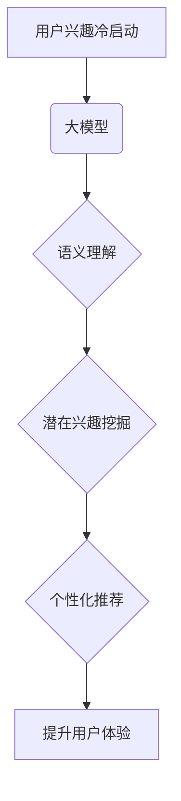

                 

## 大模型技术在电商平台用户兴趣冷启动问题中的创新

> 关键词：大模型、用户兴趣冷启动、电商平台、推荐系统、个性化推荐、Transformer、预训练模型、微调

## 1. 背景介绍

电商平台作为现代商业的重要组成部分，其核心竞争力之一在于精准的商品推荐。然而，用户兴趣冷启动问题一直是电商平台推荐系统面临的重大挑战。用户兴趣冷启动是指新用户或用户对新商品缺乏历史行为数据的情况，导致推荐系统难以准确预测用户兴趣，从而影响用户体验和转化率。

传统推荐系统主要依赖于用户的历史行为数据，例如浏览记录、购买记录、评分等，但对于新用户或新商品，这些数据缺失，导致推荐效果不佳。随着大模型技术的快速发展，其强大的学习能力和泛化能力为解决用户兴趣冷启动问题提供了新的思路。

## 2. 核心概念与联系

### 2.1 大模型

大模型是指参数量达到亿级甚至万亿级的深度学习模型，通常基于Transformer架构，拥有强大的语义理解和文本生成能力。

### 2.2 用户兴趣冷启动

用户兴趣冷启动是指用户在电商平台上缺乏历史行为数据，导致推荐系统难以准确预测用户兴趣的情况。

### 2.3 关系

大模型可以利用其强大的语义理解能力和文本生成能力，从用户提供的有限信息，例如用户画像、商品描述、用户评论等，挖掘用户潜在兴趣，并生成个性化的商品推荐。

**核心概念与联系流程图**



## 3. 核心算法原理 & 具体操作步骤

### 3.1 算法原理概述

大模型在解决用户兴趣冷启动问题中的核心算法原理是基于预训练模型的微调。预训练模型是指在海量文本数据上进行预训练的深度学习模型，已经具备了强大的语义理解和文本生成能力。微调是指将预训练模型应用于特定任务，例如用户兴趣预测，通过在少量标记数据上进行训练，进一步提升模型的性能。

### 3.2 算法步骤详解

1. **选择预训练模型:** 选择合适的预训练模型，例如BERT、RoBERTa、GPT等，这些模型在自然语言处理任务上表现出色。

2. **数据预处理:** 对用户数据和商品数据进行预处理，例如文本清洗、词向量化等，使其能够被模型理解。

3. **模型微调:** 将预训练模型加载到训练环境中，并根据特定任务进行微调。微调过程通常包括以下步骤：
    * **定义损失函数:** 选择合适的损失函数，例如交叉熵损失函数，用于衡量模型预测结果与真实标签之间的差异。
    * **设置优化器:** 选择合适的优化器，例如Adam优化器，用于更新模型参数。
    * **训练模型:** 将预处理后的数据输入模型进行训练，并根据损失函数和优化器进行参数更新。

4. **模型评估:** 在测试集上评估模型性能，例如准确率、召回率、F1-score等，并根据评估结果进行模型调优。

5. **部署模型:** 将训练好的模型部署到线上环境中，用于实时预测用户兴趣并生成商品推荐。

### 3.3 算法优缺点

**优点:**

* **强大的泛化能力:** 预训练模型已经具备了强大的语义理解能力，可以有效地处理用户兴趣冷启动问题。
* **高效的训练速度:** 微调过程只需要在少量标记数据上进行训练，训练速度比从头训练模型快得多。
* **个性化推荐:** 大模型可以根据用户的个性化特征，例如年龄、性别、兴趣爱好等，生成更精准的商品推荐。

**缺点:**

* **模型参数量大:** 大模型的参数量较大，需要较大的计算资源进行训练和部署。
* **数据依赖性:** 大模型的性能依赖于训练数据的质量和数量，如果训练数据不足或质量较差，模型性能会下降。
* **可解释性差:** 大模型的决策过程较为复杂，难以解释模型的推荐结果。

### 3.4 算法应用领域

大模型技术在电商平台用户兴趣冷启动问题中的应用，不仅限于商品推荐，还可以应用于其他领域，例如：

* **用户画像构建:** 利用大模型分析用户的行为数据和文本数据，构建更精准的用户画像。
* **内容推荐:** 根据用户的兴趣偏好，推荐相关的文章、视频、图片等内容。
* **搜索结果优化:** 利用大模型理解用户的搜索意图，优化搜索结果的排序和展示。

## 4. 数学模型和公式 & 详细讲解 & 举例说明

### 4.1 数学模型构建

大模型在解决用户兴趣冷启动问题中的核心数学模型是基于Transformer架构的序列模型。该模型将用户行为数据和商品数据表示为序列，并利用注意力机制学习用户兴趣和商品特征之间的关系。

### 4.2 公式推导过程

Transformer模型的核心是注意力机制，其计算公式如下：

$$
Attention(Q, K, V) = softmax(\frac{QK^T}{\sqrt{d_k}})V
$$

其中：

* $Q$：查询矩阵
* $K$：键矩阵
* $V$：值矩阵
* $d_k$：键向量的维度
* $softmax$：softmax函数

注意力机制可以学习到用户兴趣和商品特征之间的相关性，并赋予不同特征不同的权重。

### 4.3 案例分析与讲解

假设用户A浏览了商品A1和A2，商品A1的描述为“高品质运动鞋”，商品A2的描述为“时尚休闲服”。

利用Transformer模型，可以将用户A的浏览历史和商品描述表示为序列，并通过注意力机制学习到用户A对运动鞋和休闲服的兴趣偏好。

例如，注意力机制可能赋予“运动鞋”这个词更高的权重，表明用户A对运动鞋更感兴趣。

## 5. 项目实践：代码实例和详细解释说明

### 5.1 开发环境搭建

* Python 3.7+
* PyTorch 1.7+
* CUDA 10.2+

### 5.2 源代码详细实现

```python
import torch
import torch.nn as nn

class Transformer(nn.Module):
    def __init__(self, input_size, hidden_size, num_layers, num_heads):
        super(Transformer, self).__init__()
        self.embedding = nn.Embedding(input_size, hidden_size)
        self.transformer_encoder = nn.TransformerEncoder(
            nn.TransformerEncoderLayer(hidden_size, num_heads), num_layers
        )

    def forward(self, x):
        x = self.embedding(x)
        x = self.transformer_encoder(x)
        return x

# 实例化模型
model = Transformer(input_size=10000, hidden_size=512, num_layers=6, num_heads=8)

# 定义损失函数和优化器
criterion = nn.CrossEntropyLoss()
optimizer = torch.optim.Adam(model.parameters(), lr=0.001)

# 训练模型
for epoch in range(10):
    # ... 训练代码 ...
```

### 5.3 代码解读与分析

* `Transformer`类定义了Transformer模型的结构，包括嵌入层、Transformer编码器等。
* `embedding`层将输入的整数索引转换为对应的向量表示。
* `transformer_encoder`层利用Transformer编码器结构学习用户兴趣和商品特征之间的关系。
* `forward`方法定义了模型的输入和输出流程。
* `criterion`和`optimizer`分别定义了损失函数和优化器，用于训练模型。

### 5.4 运行结果展示

训练完成后，可以将模型部署到线上环境中，并根据用户的行为数据和商品数据生成个性化的商品推荐。

## 6. 实际应用场景

大模型技术在电商平台用户兴趣冷启动问题中的应用场景广泛，例如：

* **新用户推荐:** 对于新注册的用户，由于缺乏历史行为数据，大模型可以根据用户的基本信息，例如年龄、性别、兴趣爱好等，进行个性化推荐。
* **新商品推荐:** 对于新上架的商品，大模型可以根据商品的描述、图片、用户评论等信息，挖掘商品的潜在兴趣，并推荐给潜在用户。
* **跨界推荐:** 大模型可以学习用户跨界兴趣，例如用户喜欢运动鞋，也可能喜欢运动服、运动耳机等相关商品。

### 6.4 未来应用展望

未来，大模型技术在电商平台用户兴趣冷启动问题中的应用将更加深入，例如：

* **多模态推荐:** 将文本、图片、视频等多模态数据融合，构建更全面的用户兴趣模型。
* **实时个性化推荐:** 利用大模型的实时推理能力，根据用户的实时行为数据，动态调整商品推荐。
* **个性化营销:** 利用大模型分析用户的兴趣偏好，进行个性化的营销推广。

## 7. 工具和资源推荐

### 7.1 学习资源推荐

* **论文:**
    * Vaswani, A., Shazeer, N., Parmar, N., Uszkoreit, J., Jones, L., Gomez, A. N., ... & Polosukhin, I. (2017). Attention is all you need. In Advances in neural information processing systems (pp. 5998-6008).
    * Devlin, J., Chang, M. W., Lee, K., & Toutanova, K. (2018). BERT: Pre-training of deep bidirectional transformers for language understanding. arXiv preprint arXiv:1810.04805.
* **博客:**
    * Jay Alammar's Blog: https://jalammar.github.io/
    * The Gradient: https://thegradient.pub/

### 7.2 开发工具推荐

* **PyTorch:** https://pytorch.org/
* **TensorFlow:** https://www.tensorflow.org/

### 7.3 相关论文推荐

* **BERT for Recommender Systems:** https://arxiv.org/abs/1908.03818
* **Transformer-based Recommendation Models:** https://arxiv.org/abs/2003.07967

## 8. 总结：未来发展趋势与挑战

### 8.1 研究成果总结

大模型技术在电商平台用户兴趣冷启动问题中的应用取得了显著成果，能够有效提升推荐系统的精准度和个性化程度。

### 8.2 未来发展趋势

未来，大模型技术在电商平台用户兴趣冷启动问题中的应用将朝着以下方向发展：

* **模型规模和能力的提升:** 随着计算资源的不断发展，大模型的规模和能力将进一步提升，能够学习更复杂的用户兴趣模式。
* **多模态融合:** 将文本、图片、视频等多模态数据融合，构建更全面的用户兴趣模型。
* **实时个性化推荐:** 利用大模型的实时推理能力，根据用户的实时行为数据，动态调整商品推荐。

### 8.3 面临的挑战

大模型技术在电商平台用户兴趣冷启动问题中的应用也面临一些挑战：

* **数据隐私和安全:** 大模型的训练需要大量用户数据，如何保护用户数据隐私和安全是一个重要问题。
* **模型解释性和可控性:** 大模型的决策过程较为复杂，难以解释模型的推荐结果，如何提升模型的解释性和可控性是一个重要的研究方向。
* **计算资源和成本:** 大模型的训练和部署需要大量的计算资源和成本，如何降低模型的计算资源消耗是一个重要的挑战。

### 8.4 研究展望

未来，我们需要继续深入研究大模型技术在电商平台用户兴趣冷启动问题中的应用，解决上述挑战，并探索更有效的应用场景，为用户提供更精准、个性化的商品推荐服务。

## 9. 附录：常见问题与解答

* **Q1: 大模型的训练需要多少数据？**

A1: 大模型的训练需要海量数据，通常需要百万甚至亿级别的文本数据。

* **Q2: 如何评估大模型的性能？**

A2: 大模型的性能可以评估指标，例如准确率、召回率、F1-score等。

* **Q3: 如何部署大模型？**

A3: 大模型可以部署到云端服务器、边缘设备等平台。

作者：禅与计算机程序设计艺术 / Zen and the Art of Computer Programming


<end_of_turn>

