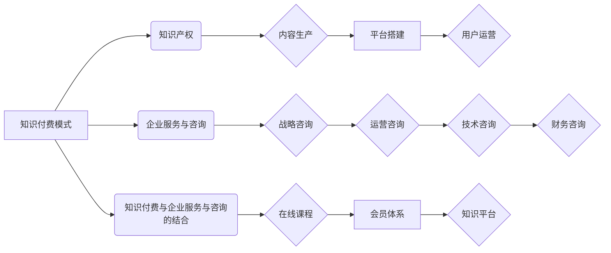

                 

## 如何利用知识付费实现企业服务与咨询？

> 关键词：知识付费、企业服务、咨询、在线课程、会员体系、内容营销、技术赋能、数据分析、商业模式

## 1. 背景介绍

在当今数字化时代，知识已成为企业发展最宝贵的资源。企业服务和咨询行业也迎来了前所未有的机遇。知识付费模式的兴起，为企业服务和咨询提供了新的商业模式和发展路径。

知识付费是指通过付费的方式获取知识、技能和服务的商业模式。它以内容为核心，通过线上平台提供各种形式的知识产品，如在线课程、付费文章、直播讲座等，满足用户对知识的需求。

企业服务和咨询行业的核心价值在于为企业提供专业知识和解决方案，帮助企业解决实际问题，提升效率和效益。知识付费模式可以帮助企业服务和咨询机构：

* **拓展服务范围:** 通过线上平台，企业服务和咨询机构可以覆盖更广泛的客户群体，提供更多元的服务内容。
* **提升服务效率:** 在线课程和知识库可以帮助企业快速获取所需知识，提高服务效率。
* **建立品牌影响力:** 通过优质的知识产品，企业服务和咨询机构可以建立品牌影响力，提升客户信任度。
* **实现持续收入:** 知识付费模式可以帮助企业服务和咨询机构实现持续收入，降低对单次项目收入的依赖。

## 2. 核心概念与联系

**2.1 知识付费模式**

知识付费模式的核心是将知识和技能转化为有价值的产品，并通过付费的方式提供给用户。它包括以下几个关键要素：

* **知识产权:** 知识付费模式的核心是知识产权，需要企业服务和咨询机构拥有独创的知识和技能。
* **内容生产:** 需要企业服务和咨询机构具备内容生产能力，能够创作高质量的知识产品。
* **平台搭建:** 需要搭建线上平台，提供知识产品发布、销售和用户管理等功能。
* **用户运营:** 需要企业服务和咨询机构进行用户运营，吸引用户付费购买知识产品。

**2.2 企业服务与咨询**

企业服务和咨询是指为企业提供专业知识和解决方案，帮助企业解决实际问题，提升效率和效益的行业。它包括以下几个主要服务类型：

* **战略咨询:** 为企业制定战略规划，帮助企业实现长远目标。
* **运营咨询:** 为企业优化运营流程，提高效率和效益。
* **技术咨询:** 为企业提供技术解决方案，帮助企业解决技术难题。
* **财务咨询:** 为企业提供财务规划和管理咨询，帮助企业提高财务效益。

**2.3 知识付费与企业服务与咨询的结合**

知识付费模式可以与企业服务和咨询相结合，形成新的商业模式。企业服务和咨询机构可以利用知识付费模式：

* **提供在线课程:** 为企业提供在线课程，帮助企业员工提升技能和知识。
* **建立会员体系:** 为企业用户提供会员服务，提供专属的知识产品和咨询服务。
* **打造知识平台:** 建立知识平台，提供企业服务和咨询相关的知识库和资源。

**2.4  核心概念关系流程图**



## 3. 核心算法原理 & 具体操作步骤

**3.1 算法原理概述**

知识付费模式的成功关键在于算法的应用，它可以帮助企业服务和咨询机构进行用户画像、内容推荐、付费转化等环节的优化。

* **用户画像算法:** 通过分析用户行为数据，构建用户画像，了解用户的兴趣、需求和付费意愿。
* **内容推荐算法:** 根据用户的兴趣和需求，推荐相关的知识产品，提高用户粘性和付费转化率。
* **付费转化算法:** 通过分析用户行为数据，优化付费流程，提高用户付费转化率。

**3.2 算法步骤详解**

**3.2.1 用户画像算法**

1. **数据收集:** 收集用户行为数据，包括用户浏览记录、购买记录、评论记录等。
2. **数据清洗:** 对收集到的数据进行清洗，去除无效数据和重复数据。
3. **特征提取:** 从用户行为数据中提取特征，如用户年龄、性别、职业、兴趣爱好、购买频率等。
4. **模型训练:** 使用机器学习算法，训练用户画像模型，将用户特征与用户行为数据关联起来。
5. **用户画像生成:** 根据训练好的模型，生成用户的画像，包括用户的兴趣、需求和付费意愿等。

**3.2.2 内容推荐算法**

1. **数据收集:** 收集用户行为数据和知识产品数据，包括用户浏览记录、购买记录、知识产品标签、知识产品评分等。
2. **数据预处理:** 对收集到的数据进行预处理，如文本处理、数据转换等。
3. **模型选择:** 选择合适的推荐算法，如协同过滤、内容过滤、混合推荐等。
4. **模型训练:** 使用训练数据，训练推荐模型，学习用户和知识产品的关联关系。
5. **内容推荐:** 根据用户的兴趣和需求，推荐相关的知识产品。

**3.2.3 付费转化算法**

1. **数据收集:** 收集用户行为数据，包括用户浏览记录、加入购物车记录、支付记录等。
2. **数据分析:** 分析用户行为数据，找出影响付费转化的因素，如用户停留时间、浏览页面数量、产品价格等。
3. **模型构建:** 使用机器学习算法，构建付费转化模型，预测用户的付费意愿。
4. **优化策略:** 根据模型预测结果，优化付费流程，提高用户付费转化率。

**3.3 算法优缺点**

* **优点:** 算法可以帮助企业服务和咨询机构进行数据化运营，提高效率和精准度。
* **缺点:** 算法需要大量的数据支持，并且需要不断进行模型优化和更新。

**3.4 算法应用领域**

* **用户画像:** 帮助企业服务和咨询机构了解用户的兴趣、需求和付费意愿。
* **内容推荐:** 帮助企业服务和咨询机构推荐相关的知识产品，提高用户粘性和付费转化率。
* **付费转化:** 帮助企业服务和咨询机构优化付费流程，提高用户付费转化率。
* **个性化服务:** 帮助企业服务和咨询机构提供个性化的服务，满足用户的不同需求。

## 4. 数学模型和公式 & 详细讲解 & 举例说明

**4.1 数学模型构建**

知识付费模式的成功可以看作是一个优化问题，目标是最大化知识产品的收益，同时满足用户的需求。我们可以构建一个数学模型来描述这个过程。

假设：

* $N$ 是用户数量
* $C_i$ 是用户 $i$ 的付费意愿
* $P_j$ 是知识产品 $j$ 的价格
* $S_ij$ 是用户 $i$ 对知识产品 $j$ 的需求

那么，知识产品的收益可以表示为：

$$
\text{收益} = \sum_{i=1}^{N} \sum_{j=1}^{M} C_i \cdot S_{ij} \cdot P_j
$$

其中，$M$ 是知识产品数量。

**4.2 公式推导过程**

为了最大化收益，我们需要优化 $P_j$ 和 $S_{ij}$。

* **价格优化:** 我们可以使用需求弹性来优化价格。需求弹性是指价格变化对需求量变化的敏感度。如果需求弹性较大，则价格变化对收益的影响较大。因此，我们需要找到一个价格点，既能满足用户的需求，又能最大化收益。
* **需求优化:** 我们可以使用用户画像和内容推荐算法来优化需求。通过了解用户的兴趣和需求，我们可以推荐更符合用户需求的知识产品，从而提高用户的购买意愿。

**4.3 案例分析与讲解**

假设一家企业服务和咨询机构提供两种知识产品：

* 产品 A：价格为 $100$ 元，用户对该产品的需求为 $S_{1A} = 100$，$S_{2A} = 50$
* 产品 B：价格为 $200$ 元，用户对该产品的需求为 $S_{1B} = 50$，$S_{2B} = 20$

我们可以使用上述公式计算两种知识产品的收益。

* 产品 A 的收益：$100 \cdot (100 \cdot 100 + 50 \cdot 100) = 15000$ 元
* 产品 B 的收益：$200 \cdot (50 \cdot 200 + 20 \cdot 200) = 28000$ 元

从计算结果可以看出，产品 B 的收益高于产品 A。

## 5. 项目实践：代码实例和详细解释说明

**5.1 开发环境搭建**

* **操作系统:** Linux 或 Windows
* **编程语言:** Python
* **框架:** Django 或 Flask
* **数据库:** MySQL 或 PostgreSQL

**5.2 源代码详细实现**

```python
# 知识付费平台的简单示例代码

from django.shortcuts import render
from django.http import HttpResponse

def index(request):
    return render(request, 'index.html')

def course_list(request):
    # 获取所有课程列表
    courses = Course.objects.all()
    return render(request, 'course_list.html', {'courses': courses})

def course_detail(request, course_id):
    # 获取指定课程的详细信息
    course = Course.objects.get(id=course_id)
    return render(request, 'course_detail.html', {'course': course})

def purchase(request, course_id):
    # 处理用户购买课程的请求
    course = Course.objects.get(id=course_id)
    # ... 支付处理逻辑 ...
    return HttpResponse('购买成功！')
```

**5.3 代码解读与分析**

* **index() 函数:** 渲染首页模板。
* **course_list() 函数:** 获取所有课程列表，并渲染课程列表模板。
* **course_detail() 函数:** 获取指定课程的详细信息，并渲染课程详情模板。
* **purchase() 函数:** 处理用户购买课程的请求，包括支付处理逻辑。

**5.4 运行结果展示**

运行上述代码后，可以访问知识付费平台的首页，浏览课程列表，查看课程详情，并进行购买操作。

## 6. 实际应用场景

**6.1 在线课程平台**

知识付费模式可以应用于在线课程平台，提供各种类型的在线课程，如编程、设计、营销等。

**6.2 会员体系**

企业服务和咨询机构可以建立会员体系，为会员提供专属的知识产品和咨询服务。

**6.3 知识平台**

企业服务和咨询机构可以建立知识平台，提供企业服务和咨询相关的知识库和资源。

**6.4 未来应用展望**

* **人工智能驱动的个性化学习:** 利用人工智能技术，为用户提供个性化的学习路径和内容推荐。
* **虚拟现实和增强现实的沉浸式学习:** 利用虚拟现实和增强现实技术，打造更加沉浸式的学习体验。
* **区块链技术的知识版权保护:** 利用区块链技术，保障知识产权，防止知识盗版。

## 7. 工具和资源推荐

**7.1 学习资源推荐**

* **书籍:** 《知识付费时代》、《互联网思维》、《商业模式创新》
* **在线课程:** Coursera、Udemy、edX
* **博客:** 36氪、TechCrunch、Hacker News

**7.2 开发工具推荐**

* **Python:** Django、Flask
* **数据库:** MySQL、PostgreSQL
* **云平台:** AWS、Azure、GCP

**7.3 相关论文推荐**

* **知识付费模式的商业模式创新研究**
* **人工智能在知识付费领域的应用研究**
* **区块链技术在知识版权保护中的应用研究**

## 8. 总结：未来发展趋势与挑战

**8.1 研究成果总结**

知识付费模式为企业服务和咨询行业提供了新的发展路径，可以帮助企业服务和咨询机构拓展服务范围、提升服务效率、建立品牌影响力、实现持续收入。

**8.2 未来发展趋势**

* **个性化定制:** 利用人工智能技术，为用户提供个性化的知识产品和服务。
* **多元化内容:** 提供更多元的知识产品，如视频课程、音频课程、直播讲座等。
* **社区化运营:** 建立知识付费平台的社区，促进用户之间的交流和互动。

**8.3 面临的挑战**

* **内容质量:** 需要不断提升知识产品的质量，才能满足用户的需求。
* **用户粘性:** 需要不断创新，提高用户粘性和付费转化率。
* **版权保护:** 需要加强知识产权保护，防止知识盗版。

**8.4 研究展望**

未来，我们需要进一步研究知识付费模式的商业模式创新、人工智能技术在知识付费领域的应用、区块链技术在知识版权保护中的应用等方面，推动知识付费模式的健康发展。

## 9. 附录：常见问题与解答

**9.1 如何选择合适的知识付费平台？**

选择知识付费平台需要考虑以下因素：

* 平台的规模和用户群体
* 平台的功能和服务
* 平台的收费标准
* 平台的安全性

**9.2 如何提高知识付费产品的质量？**

提高知识付费产品的质量需要以下几点：

* 内容原创性
* 内容深度和实用性
* 内容的呈现形式
* 用户体验

**9.3 如何进行知识付费平台的运营推广？**

知识付费平台的运营推广需要以下策略：

* 内容营销
* 社交媒体营销
* 搜索引擎优化
* 合作推广

作者：禅与计算机程序设计艺术 / Zen and the Art of Computer Programming


<end_of_turn>

