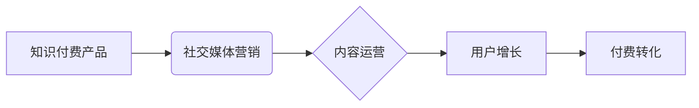

                 

## 如何利用社交媒体推广知识付费产品

> 关键词：知识付费、社交媒体营销、内容运营、用户增长、付费转化

## 1. 背景介绍

知识付费行业近年来蓬勃发展，越来越多的专家学者和创作者通过线上平台分享专业知识和技能，并通过付费课程、会员体系等模式获得收益。然而，在竞争激烈的市场环境下，如何有效地推广知识付费产品，吸引目标用户并实现付费转化，成为众多创作者面临的挑战。

社交媒体作为信息传播和用户互动的重要平台，为知识付费产品推广提供了广阔的机遇。通过精心策划的内容运营策略，以及对社交媒体平台规则和用户行为的深入理解，创作者可以利用社交媒体的力量，提升品牌知名度，建立用户信任，最终实现知识付费产品的成功推广。

## 2. 核心概念与联系

### 2.1  知识付费产品

知识付费产品是指以知识、技能、经验等为核心内容，通过付费的方式获取的数字化产品。常见的知识付费产品包括：

* 在线课程：涵盖各个领域，从专业技能培训到兴趣爱好学习，形式多样，包括视频课程、音频课程、直播课程等。
* 会员体系：提供持续更新的知识内容、专属社区、线下活动等权益，用户通过付费订阅获得长期学习和交流的机会。
* 电子书、电子笔记：提供深度解析、案例分析、实用技巧等内容，方便用户随时随地学习和复习。

### 2.2  社交媒体营销

社交媒体营销是指利用社交媒体平台进行品牌推广、用户互动、内容传播等营销活动。其核心目标是通过与用户建立连接，提升品牌知名度和用户参与度，最终实现销售转化。

### 2.3  内容运营

内容运营是指围绕目标用户需求，创作、发布、传播和管理高质量内容，以吸引用户关注、建立用户粘性，并最终实现营销目标。

**核心概念关系图:**



## 3. 核心算法原理 & 具体操作步骤

### 3.1  算法原理概述

社交媒体推广知识付费产品的核心算法原理在于利用平台的推荐算法和用户行为数据，精准定位目标用户，并通过内容运营策略，吸引用户关注，建立信任，最终实现付费转化。

### 3.2  算法步骤详解

1. **用户画像分析:** 通过分析目标用户的年龄、性别、兴趣爱好、行为习惯等数据，构建精准的用户画像。
2. **内容策略制定:** 根据用户画像，制定符合用户需求的内容策略，包括内容主题、内容形式、内容频率等。
3. **平台选择:** 根据目标用户群体和产品特点，选择合适的社交媒体平台进行推广。
4. **内容创作:** 创作高质量、有价值、引人入胜的内容，吸引用户关注和互动。
5. **内容推广:** 利用平台的推广工具和策略，扩大内容的传播范围，提高曝光率。
6. **用户互动:** 及时回复用户评论和私信，建立用户信任和互动关系。
7. **付费转化引导:** 通过内容引导，将用户引向付费购买页面，并提供优惠活动和促销信息，提高付费转化率。

### 3.3  算法优缺点

**优点:**

* 精准定位目标用户
* 提升品牌知名度和用户参与度
* 成本相对较低
* 数据可追踪，方便评估效果

**缺点:**

* 需要持续投入时间和精力进行内容运营
* 平台算法不断变化，需要及时调整推广策略
* 竞争激烈，需要不断创新内容和推广方式

### 3.4  算法应用领域

* 在线教育
* 咨询服务
* 技能培训
* 个人品牌建设

## 4. 数学模型和公式 & 详细讲解 & 举例说明

### 4.1  数学模型构建

社交媒体推广知识付费产品的数学模型可以简化为一个用户增长模型，其核心指标包括用户数量、用户活跃度、付费转化率等。

**用户增长模型:**

$$
\frac{dU}{dt} = rU(1-\frac{U}{C})
$$

其中:

* $U$：用户数量
* $t$：时间
* $r$：用户增长率
* $C$：平台承载能力

### 4.2  公式推导过程

该模型基于Logistic增长模型，假设用户增长率与当前用户数量成正比，但随着用户数量的增加，增长率会逐渐减缓，最终趋于稳定。

### 4.3  案例分析与讲解

假设一个知识付费平台的目标用户数量为10000人，用户增长率为0.1，平台承载能力为20000人。根据公式，我们可以计算出用户数量随时间的变化趋势。

当用户数量较少时，增长率较高，用户数量增长迅速。随着用户数量的增加，增长率逐渐减缓，最终趋于稳定。

## 5. 项目实践：代码实例和详细解释说明

### 5.1  开发环境搭建

* 操作系统：Windows/macOS/Linux
* 编程语言：Python
* 开发工具：VS Code/PyCharm

### 5.2  源代码详细实现

```python
import matplotlib.pyplot as plt
import numpy as np

def logistic_growth(U0, r, C, t):
  """
  Logistic growth model

  Args:
    U0: Initial user count
    r: Growth rate
    C: Carrying capacity
    t: Time

  Returns:
    User count at time t
  """
  return C / (1 + np.exp(-r * (t - t0)))

# Parameters
U0 = 1000
r = 0.1
C = 20000
t = np.linspace(0, 10, 100)

# Calculate user count
U = logistic_growth(U0, r, C, t)

# Plot the results
plt.plot(t, U)
plt.xlabel('Time')
plt.ylabel('User Count')
plt.title('Logistic Growth Model')
plt.show()
```

### 5.3  代码解读与分析

该代码实现了一个Logistic增长模型，模拟了用户数量随时间的变化趋势。

* `logistic_growth()` 函数计算了用户数量在特定时间点的值。
* `np.linspace()` 函数生成了一个时间序列。
* `plt.plot()` 函数绘制了用户数量随时间的变化曲线。

### 5.4  运行结果展示

运行该代码后，会生成一个用户数量随时间的变化曲线，展示了用户增长模型的趋势。

## 6. 实际应用场景

### 6.1  在线教育平台

在线教育平台可以利用社交媒体平台，推广其在线课程，吸引目标用户报名学习。

* 通过发布课程预告、课程内容介绍、学员分享等内容，提高课程曝光率和用户兴趣。
* 利用平台的直播功能，举办线上课程答疑、互动交流等活动，增强用户粘性。
* 通过社交媒体广告，精准定位目标用户，提高付费转化率。

### 6.2  咨询服务机构

咨询服务机构可以利用社交媒体平台，建立品牌形象，提升用户信任，并吸引用户咨询服务。

* 通过发布行业资讯、案例分析、专家观点等内容，展示专业能力和行业经验。
* 利用平台的互动功能，与用户进行在线交流，解答用户疑问，建立信任关系。
* 通过社交媒体广告，精准定位目标用户，推广咨询服务。

### 6.3  技能培训机构

技能培训机构可以利用社交媒体平台，推广其技能培训课程，吸引目标用户报名学习。

* 通过发布课程预告、课程内容介绍、学员分享等内容，提高课程曝光率和用户兴趣。
* 利用平台的直播功能，举办线上课程答疑、互动交流等活动，增强用户粘性。
* 通过社交媒体广告，精准定位目标用户，提高付费转化率。

### 6.4  未来应用展望

随着社交媒体平台的不断发展，其在知识付费产品推广中的应用场景将更加广泛。未来，我们可以期待以下应用趋势：

* 更智能化的内容推荐算法，能够更精准地匹配用户需求。
* 更丰富的互动功能，能够增强用户参与度和粘性。
* 更个性化的营销策略，能够满足不同用户群体的需求。

## 7. 工具和资源推荐

### 7.1  学习资源推荐

* **社交媒体营销书籍:** 《Jab, Jab, Jab, Right Hook》 by Gary Vaynerchuk, 《Influence: The Psychology of Persuasion》 by Robert Cialdini
* **内容运营课程:** Udemy, Coursera, Skillshare

### 7.2  开发工具推荐

* **社交媒体管理工具:** Hootsuite, Buffer, SproutSocial
* **数据分析工具:** Google Analytics, Facebook Insights

### 7.3  相关论文推荐

* **社交媒体营销论文:** "The Impact of Social Media Marketing on Brand Awareness and Customer Engagement"
* **内容运营论文:** "The Role of Content Marketing in Driving Customer Acquisition and Retention"

## 8. 总结：未来发展趋势与挑战

### 8.1  研究成果总结

通过对社交媒体推广知识付费产品的分析，我们可以得出以下结论:

* 社交媒体为知识付费产品推广提供了广阔的机遇。
* 精准定位目标用户、内容运营策略、平台选择和数据分析是成功的关键。
* 未来，社交媒体推广知识付费产品将更加智能化、个性化和互动化。

### 8.2  未来发展趋势

* **人工智能驱动的个性化推荐:** 利用人工智能技术，更精准地匹配用户需求，推荐个性化的知识付费产品。
* **沉浸式体验的互动内容:** 通过VR/AR等技术，打造沉浸式体验的互动内容，增强用户参与度和学习效果。
* **社区化学习模式:** 建立线上线下结合的社区化学习模式，促进用户之间的交流和互动，提升学习效果。

### 8.3  面临的挑战

* **平台算法变化:** 社交媒体平台算法不断变化，需要持续调整推广策略。
* **用户注意力分散:** 用户注意力分散，需要不断创新内容和推广方式，吸引用户关注。
* **数据隐私保护:** 需要重视用户数据隐私保护，确保用户数据安全。

### 8.4  研究展望

未来，我们将继续研究社交媒体推广知识付费产品的相关技术和策略，探索更有效、更智能的推广模式，帮助创作者更好地推广知识付费产品，实现知识价值的传播和共享。

## 9. 附录：常见问题与解答

**Q1: 如何选择合适的社交媒体平台进行推广？**

**A1:** 选择合适的社交媒体平台需要根据目标用户群体和产品特点进行分析。例如，对于年轻用户群体，可以选择抖音、快手等短视频平台；对于专业人士，可以选择LinkedIn、知乎等专业社交平台。

**Q2: 如何提高社交媒体内容的曝光率？**

**A2:** 提高社交媒体内容的曝光率可以通过以下方式实现：

* 发布高质量、有价值、引人入胜的内容。
* 利用平台的推广工具和策略，例如付费广告、话题标签等。
* 与其他用户互动，例如评论、点赞、转发等。

**Q3: 如何引导用户付费转化？**

**A3:** 引导用户付费转化可以通过以下方式实现：

* 在内容中突出产品价值，并提供优惠活动和促销信息。
* 利用社交媒体平台的电商功能，方便用户直接购买产品。
* 建立用户信任关系，并提供优质的售后服务。


作者：禅与计算机程序设计艺术 / Zen and the Art of Computer Programming 
<end_of_turn>

