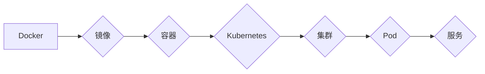

                 

## 容器化技术：Docker与Kubernetes实践

> 关键词：容器化、Docker、Kubernetes、微服务、部署、自动化、云原生

## 1. 背景介绍

随着软件开发模式的演变，传统的单体架构逐渐被轻量、可扩展的微服务架构所取代。微服务架构将应用程序拆分成多个独立的服务，每个服务负责特定的功能，并通过API进行通信。这种架构模式带来了许多优势，例如：

* **提高开发效率:**  每个服务可以独立开发和部署，缩短开发周期。
* **增强可维护性:**  单个服务出现问题不会影响整个应用程序的运行。
* **提升弹性:**  根据需求动态地增加或减少服务的实例数量。

然而，微服务架构也带来了新的挑战，例如服务部署、管理和监控的复杂性。容器化技术应运而生，为微服务架构提供了高效的解决方案。

容器化技术将应用程序及其依赖项打包成一个独立的单元，称为容器。容器可以运行在任何支持容器运行时环境的机器上，从而实现了应用程序的跨平台部署和运行。Docker和Kubernetes是容器化技术领域的领军者，它们分别提供了容器编排和管理的解决方案。

## 2. 核心概念与联系

### 2.1 Docker

Docker是一个开源的容器化平台，它提供了一个构建、运行和管理容器的工具集。Docker的核心概念包括：

* **镜像:**  容器的模板，包含应用程序代码、运行时环境和依赖项。
* **容器:**  基于镜像创建的运行实例，可以独立运行应用程序。
* **Docker Hub:**  一个公共镜像仓库，用户可以共享和下载镜像。

### 2.2 Kubernetes

Kubernetes是一个开源的容器编排平台，它提供了一个自动化部署、管理和扩展容器化应用程序的解决方案。Kubernetes的核心概念包括：

* **集群:**  由多个节点组成的系统，用于运行容器。
* **Pod:**  容器的最小部署单元，一个Pod可以包含多个容器。
* **服务:**  用于暴露Pod的接口，方便其他服务访问。
* **部署:**  用于定义和管理Pod的部署策略。

**Docker与Kubernetes的关系:**

Docker提供容器的构建和运行环境，而Kubernetes则负责管理和调度这些容器。Kubernetes可以利用Docker镜像来创建和运行Pod，从而实现容器化应用程序的自动化部署和管理。

**Mermaid 流程图:**



## 3. 核心算法原理 & 具体操作步骤

### 3.1 算法原理概述

Kubernetes的核心算法原理包括：

* **调度算法:**  Kubernetes使用调度算法将Pod分配到合适的节点上，以确保资源利用率最大化。
* **状态管理算法:**  Kubernetes使用状态管理算法跟踪Pod的状态，并根据状态进行相应的操作，例如重启失败的Pod。
* **自 healing 算法:**  Kubernetes使用自 healing 算法自动检测和修复故障，例如节点故障或Pod崩溃。

### 3.2 算法步骤详解

**调度算法:**

1. 收集节点资源信息，包括CPU、内存、磁盘空间等。
2. 收集Pod资源需求信息，包括CPU、内存、磁盘空间等。
3. 根据节点资源和Pod资源需求，选择合适的节点运行Pod。
4. 将Pod部署到选定的节点上。

**状态管理算法:**

1. 定期检查Pod的状态，例如运行状态、网络状态等。
2. 根据Pod的状态，执行相应的操作，例如重启失败的Pod、更新Pod的资源配置等。
3. 记录Pod的状态变化历史，以便进行故障分析和恢复。

**自 healing 算法:**

1. 定期检查节点的健康状态，例如网络连接、磁盘可用性等。
2. 如果检测到节点故障，则将节点从集群中移除。
3. 将运行在故障节点上的Pod迁移到其他节点上。
4. 重新启动故障节点，并将其加入集群。

### 3.3 算法优缺点

**优点:**

* **自动化:**  Kubernetes可以自动化部署、管理和扩展容器化应用程序。
* **弹性:**  Kubernetes可以根据需求动态地增加或减少服务的实例数量。
* **可靠性:**  Kubernetes的 self healing 算法可以自动检测和修复故障。

**缺点:**

* **复杂性:**  Kubernetes是一个复杂的系统，需要一定的学习成本。
* **资源消耗:**  Kubernetes需要消耗一定的资源，例如CPU和内存。

### 3.4 算法应用领域

Kubernetes的应用领域非常广泛，包括：

* **Web 应用:**  部署和管理Web应用程序，例如电商平台、社交媒体平台等。
* **数据处理:**  部署和管理数据处理应用程序，例如大数据分析平台、机器学习平台等。
* **物联网:**  部署和管理物联网应用程序，例如智能家居、智能交通等。

## 4. 数学模型和公式 & 详细讲解 & 举例说明

### 4.1 数学模型构建

Kubernetes的调度算法通常基于资源分配和节点可用性的数学模型。

**资源分配模型:**

* **资源需求:**  每个Pod都有一个资源需求向量，表示其所需的CPU、内存等资源。
* **资源可用性:**  每个节点都有一个资源可用性向量，表示其可供分配的CPU、内存等资源。
* **资源分配:**  调度算法的目标是找到一个资源分配方案，使得每个Pod都能获得其所需的资源，同时最大化资源利用率。

**节点可用性模型:**

* **节点状态:**  每个节点的状态可以表示为一个状态向量，例如运行状态、网络连接状态等。
* **节点可用性:**  节点可用性模型根据节点状态向量计算节点的可用性分数。
* **节点选择:**  调度算法会根据节点可用性分数选择合适的节点运行Pod。

### 4.2 公式推导过程

**资源分配优化问题:**

目标函数:  最大化资源利用率

约束条件:  每个Pod的资源需求必须得到满足

**节点可用性分数计算公式:**

```latex
可用性分数 = \sum_{i=1}^{n} w_i * s_i
```

其中:

* $w_i$ 是节点状态指标 $i$ 的权重
* $s_i$ 是节点状态指标 $i$ 的值

### 4.3 案例分析与讲解

假设有两个节点，节点 A 和节点 B，它们分别拥有 4 核 CPU 和 8GB 内存，以及 2 核 CPU 和 4GB 内存。

有两个 Pod 需要部署，Pod 1 需要 2 核 CPU 和 4GB 内存，Pod 2 需要 1 核 CPU 和 2GB 内存。

根据资源分配模型，我们可以计算出每个节点可以运行的 Pod 的数量。

节点 A 可以运行 Pod 1 和 Pod 2，节点 B 可以运行 Pod 2。

根据节点可用性模型，我们可以计算出每个节点的可用性分数。

假设节点 A 的网络连接状态良好，节点 B 的网络连接状态较差。

我们可以设置网络连接状态的权重为 0.5，其他状态指标的权重为 0.25。

节点 A 的可用性分数为 0.5 * 1 + 0.25 * 1 + 0.25 * 1 = 0.75

节点 B 的可用性分数为 0.5 * 0.5 + 0.25 * 1 + 0.25 * 1 = 0.5

因此，调度算法会将 Pod 1 部署到节点 A，将 Pod 2 部署到节点 B。

## 5. 项目实践：代码实例和详细解释说明

### 5.1 开发环境搭建

* 安装 Docker 和 Docker Compose
* 安装 Kubernetes 集群管理工具，例如 kubectl

### 5.2 源代码详细实现

* 创建一个 Dockerfile，定义应用程序的镜像构建过程。
* 创建一个 Kubernetes 部署文件，定义应用程序的部署策略。

### 5.3 代码解读与分析

* Dockerfile 中定义了应用程序的运行环境和依赖项。
* Kubernetes 部署文件定义了应用程序的 Pod、服务和部署策略。

### 5.4 运行结果展示

* 使用 Docker Compose 部署应用程序的容器。
* 使用 kubectl 部署应用程序到 Kubernetes 集群。
* 使用浏览器访问应用程序的 URL。

## 6. 实际应用场景

### 6.1 电商平台

* 使用微服务架构构建电商平台，每个服务负责特定的功能，例如商品展示、购物车、订单处理等。
* 使用 Docker 和 Kubernetes 部署和管理电商平台的微服务。
* 利用 Kubernetes 的自动伸缩功能，根据流量变化动态调整服务的实例数量。

### 6.2 数据分析平台

* 使用微服务架构构建数据分析平台，每个服务负责特定的数据处理任务，例如数据采集、数据清洗、数据分析等。
* 使用 Docker 和 Kubernetes 部署和管理数据分析平台的微服务。
* 利用 Kubernetes 的资源调度功能，将数据处理任务分配到合适的节点上。

### 6.3 物联网平台

* 使用微服务架构构建物联网平台，每个服务负责特定的物联网设备管理任务，例如设备注册、设备监控、设备控制等。
* 使用 Docker 和 Kubernetes 部署和管理物联网平台的微服务。
* 利用 Kubernetes 的自 healing 功能，自动检测和修复物联网设备的故障。

### 6.4 未来应用展望

* 随着云计算和容器技术的不断发展，Kubernetes 将在更多领域得到应用，例如边缘计算、Serverless 计算等。
* Kubernetes 的生态系统也将不断完善，提供更多功能和工具，例如服务网格、监控和日志分析等。

## 7. 工具和资源推荐

### 7.1 学习资源推荐

* Kubernetes 官方文档: https://kubernetes.io/docs/home/
* Kubernetes 中文文档: https://kubernetes.io/zh/docs/home/
* Kubernetes 入门教程: https://kubernetes.io/docs/tutorials/

### 7.2 开发工具推荐

* kubectl: Kubernetes 命令行工具
* Helm: Kubernetes 应用部署工具
* Minikube: 本地 Kubernetes 集群

### 7.3 相关论文推荐

* Kubernetes: Container Orchestration at Scale
* The Case for Container Orchestration

## 8. 总结：未来发展趋势与挑战

### 8.1 研究成果总结

* Kubernetes 已经成为容器化编排领域的领先解决方案，提供了自动化部署、管理和扩展容器化应用程序的强大功能。
* Kubernetes 的生态系统不断完善，提供了丰富的工具和资源，支持开发者快速上手和高效开发。

### 8.2 未来发展趋势

* Kubernetes 将继续朝着更自动化、更智能、更安全的方向发展。
* Kubernetes 将与其他云原生技术，例如服务网格、Serverless 计算等，更加紧密地集成。
* Kubernetes 将在更多领域得到应用，例如边缘计算、物联网等。

### 8.3 面临的挑战

* Kubernetes 的复杂性仍然是一个挑战，需要开发者投入时间和精力学习和掌握。
* Kubernetes 的安全性和可靠性仍然需要不断提升。
* Kubernetes 的生态系统仍然需要不断完善，提供更多功能和工具。

### 8.4 研究展望

* 研究更智能的 Kubernetes 调度算法，提高资源利用率和应用程序性能。
* 研究更安全的 Kubernetes 安全机制，保护应用程序和数据安全。
* 研究 Kubernetes 与其他云原生技术的集成，构建更完整的云原生应用生态系统。

## 9. 附录：常见问题与解答

* **Q: 如何部署 Kubernetes 集群？**

* **A:** 可以使用 kubeadm、kind 或 Minikube 等工具部署 Kubernetes 集群。

* **Q: 如何使用 kubectl 管理 Kubernetes 集群？**

* **A:** 可以使用 kubectl 命令行工具执行各种操作，例如部署应用程序、查看节点状态、管理服务等。

* **Q: 如何监控 Kubernetes 集群？**

* **A:** 可以使用 Prometheus、Grafana 等工具监控 Kubernetes 集群的资源使用情况、应用程序性能等。


作者：禅与计算机程序设计艺术 / Zen and the Art of Computer Programming 
<end_of_turn>

