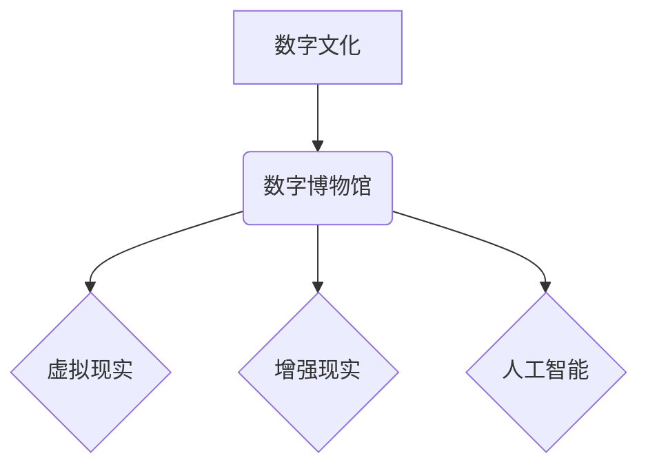

                 

## 2050年的数字文化：从数字博物馆到虚拟现实体验的文化传播

> 关键词：数字文化、虚拟现实、增强现实、数字博物馆、文化传播、人工智能、元宇宙、区块链

### 1. 背景介绍

2050年，数字技术将深刻地改变我们与文化的互动方式。数字博物馆不再是冰冷的陈列室，而是充满活力的虚拟空间，虚拟现实（VR）和增强现实（AR）技术将为我们提供身临其境的文化体验，而人工智能（AI）将成为文化传播的强大引擎。

传统博物馆面临着诸多挑战：空间限制、参观者数量、文物保护等。数字文化的发展为博物馆提供了突破性的解决方案。数字博物馆可以打破物理空间的限制，将文物和艺术作品数字化，并通过网络平台进行展示和传播。

VR和AR技术则将为博物馆带来全新的体验。参观者可以身临其境地探索古埃及金字塔，感受文艺复兴时期的艺术氛围，或者与历史人物进行虚拟对话。AI技术可以为博物馆提供个性化的导览服务，根据用户的兴趣爱好推荐相关展品，并提供深入的文物解读。

### 2. 核心概念与联系

数字文化融合了数字技术和文化元素，其核心概念包括：

* **数字博物馆：** 利用数字技术构建的虚拟博物馆，可以展示文物、艺术作品、历史资料等，并提供丰富的互动体验。
* **虚拟现实（VR）：** 通过头戴式设备模拟沉浸式的虚拟环境，让用户身临其境地体验虚拟世界。
* **增强现实（AR）：** 在现实世界中叠加虚拟信息，例如将文物模型叠加在博物馆展厅中，为参观者提供更直观的了解。
* **人工智能（AI）：** 利用机器学习等算法，赋予数字博物馆智能化功能，例如个性化推荐、智能导览、文物识别等。

**核心概念架构图：**



### 3. 核心算法原理 & 具体操作步骤

#### 3.1  算法原理概述

数字博物馆的构建和运营需要多种算法的支持，例如：

* **3D建模算法：** 将文物和艺术作品数字化，构建虚拟模型。
* **纹理贴图算法：** 为虚拟模型添加材质和纹理，使其更加逼真。
* **光照渲染算法：** 模拟光线照射效果，使虚拟场景更加真实。
* **路径规划算法：** 为用户规划虚拟博物馆的参观路线，避免拥堵和迷路。
* **推荐算法：** 根据用户的兴趣爱好推荐相关展品和内容。

#### 3.2  算法步骤详解

以3D建模算法为例，其具体操作步骤如下：

1. **数据采集：** 使用3D扫描仪或照片采集文物和艺术作品的几何形状和纹理信息。
2. **数据处理：** 对采集到的数据进行处理，例如去除噪声、修复缺失部分等。
3. **模型构建：** 使用3D建模软件根据处理后的数据构建虚拟模型。
4. **纹理贴图：** 为虚拟模型添加材质和纹理，使其更加逼真。
5. **光照渲染：** 模拟光线照射效果，使虚拟场景更加真实。

#### 3.3  算法优缺点

**优点：**

* 可以精确地捕捉文物和艺术作品的细节。
* 可以创建逼真的虚拟场景，为用户提供身临其境的体验。
* 可以方便地进行文物和艺术作品的展示和传播。

**缺点：**

* 数据采集和处理需要专业的技术和设备。
* 3D建模软件和渲染引擎的性能要求较高。
* 虚拟模型的体积较大，需要较大的存储空间。

#### 3.4  算法应用领域

3D建模算法广泛应用于数字博物馆、游戏开发、电影制作、建筑设计等领域。

### 4. 数学模型和公式 & 详细讲解 & 举例说明

#### 4.1  数学模型构建

数字博物馆的虚拟场景构建可以利用三维空间几何模型和数学公式进行描述。例如，可以使用向量和矩阵来表示物体的位置、方向和姿态，可以使用光线追踪算法来模拟光线照射效果。

#### 4.2  公式推导过程

以光线追踪算法为例，其核心公式为：

$$
L(p) = \sum_{i} \rho_i \cdot I_i \cdot \frac{d_i \cdot cos(\theta_i)}{d_i^2}
$$

其中：

* $L(p)$：点 $p$ 的亮度
* $\rho_i$：物体 $i$ 的反射率
* $I_i$：光源 $i$ 的强度
* $d_i$：光线从光源 $i$ 到点 $p$ 的距离
* $\theta_i$：光线与物体表面的法线之间的夹角

#### 4.3  案例分析与讲解

假设有一条光线从光源照射到一个物体上，物体表面反射了部分光线。我们可以使用上述公式计算反射光线的亮度。

### 5. 项目实践：代码实例和详细解释说明

#### 5.1  开发环境搭建

数字博物馆的开发环境通常包括：

* 操作系统：Windows、macOS、Linux
* 编程语言：C++、Python、Java
* 3D建模软件：Blender、Maya、3ds Max
* 渲染引擎：Unity、Unreal Engine
* 网络服务器：Apache、Nginx

#### 5.2  源代码详细实现

以下是一个简单的Python代码示例，用于展示虚拟文物模型：

```python
import pyvista as pv

# 加载3D模型
model = pv.read('model.obj')

# 创建显示窗口
plotter = pv.Plotter()

# 显示模型
plotter.add_mesh(model)

# 显示窗口
plotter.show()
```

#### 5.3  代码解读与分析

这段代码首先使用pyvista库加载一个名为“model.obj”的3D模型。然后，创建一个显示窗口，并将模型添加到窗口中。最后，显示窗口，用户可以观察到虚拟文物模型。

#### 5.4  运行结果展示

运行这段代码后，用户将在窗口中看到虚拟文物模型的展示。

### 6. 实际应用场景

数字博物馆的应用场景非常广泛，例如：

* **文物保护：** 将文物数字化，可以避免文物因人为因素或自然灾害而损坏。
* **文化传播：** 数字博物馆可以打破地域限制，将文化资源传播到全球各地。
* **教育教学：** 数字博物馆可以为学生提供身临其境的学习体验，提高学习兴趣和效果。
* **旅游景点：** 数字博物馆可以成为旅游景点的增值服务，吸引更多游客。

### 6.4  未来应用展望

未来，数字博物馆将更加智能化、交互化和沉浸式。例如：

* **AI导览：** AI导览系统可以根据用户的兴趣爱好推荐相关展品，并提供深入的文物解读。
* **虚拟现实体验：** 用户可以身临其境地探索古埃及金字塔，感受文艺复兴时期的艺术氛围，或者与历史人物进行虚拟对话。
* **元宇宙融合：** 数字博物馆将与元宇宙相融合，为用户提供更加丰富的虚拟体验。

### 7. 工具和资源推荐

#### 7.1  学习资源推荐

* **书籍：** 《数字博物馆：理论与实践》、《虚拟现实技术入门》、《增强现实技术入门》
* **在线课程：** Coursera、edX、Udemy等平台提供相关的数字博物馆、VR/AR技术、AI技术等课程。
* **网站：** 数字博物馆联盟、VR/AR协会、AI研究机构等网站提供相关的资讯和资源。

#### 7.2  开发工具推荐

* **3D建模软件：** Blender、Maya、3ds Max
* **渲染引擎：** Unity、Unreal Engine
* **编程语言：** C++、Python、Java
* **网络服务器：** Apache、Nginx

#### 7.3  相关论文推荐

* **数字博物馆：** “数字博物馆的构建与发展”，“数字博物馆的未来趋势”
* **虚拟现实：** “虚拟现实技术在博物馆中的应用”，“虚拟现实技术的发展现状与展望”
* **增强现实：** “增强现实技术在博物馆中的应用”，“增强现实技术的发展现状与展望”

### 8. 总结：未来发展趋势与挑战

#### 8.1  研究成果总结

数字文化的发展为博物馆带来了全新的机遇和挑战。数字博物馆可以打破物理空间的限制，为用户提供更加丰富、互动和沉浸式的文化体验。VR/AR技术和AI技术将成为数字博物馆发展的重要驱动力。

#### 8.2  未来发展趋势

未来，数字博物馆将更加智能化、交互化和沉浸式。AI导览系统、虚拟现实体验、元宇宙融合等技术将成为数字博物馆发展的重要趋势。

#### 8.3  面临的挑战

数字博物馆的发展也面临着一些挑战，例如：

* **技术难题：** 3D建模、光线追踪、虚拟现实等技术的复杂性需要不断突破。
* **数据安全：** 数字博物馆需要保护文物和用户数据的安全。
* **成本问题：** 数字博物馆的建设和运营需要投入大量的资金。

#### 8.4  研究展望

未来，我们需要继续加强对数字博物馆技术的研发，探索新的应用场景，并解决数字博物馆发展面临的挑战。


### 9. 附录：常见问题与解答

**常见问题：**

* 数字博物馆和传统博物馆有什么区别？
* 数字博物馆的建设需要哪些技术？
* 数字博物馆的未来发展趋势是什么？

**解答：**

* 数字博物馆利用数字技术构建虚拟空间，可以打破物理空间的限制，为用户提供更加丰富、互动和沉浸式的文化体验。传统博物馆则以实体展厅为主，参观者需要亲自前往才能体验。
* 数字博物馆的建设需要3D建模、光线追踪、虚拟现实、增强现实、人工智能等技术的支持。
* 数字博物馆的未来发展趋势是更加智能化、交互化和沉浸式。AI导览系统、虚拟现实体验、元宇宙融合等技术将成为数字博物馆发展的重要趋势。


作者：禅与计算机程序设计艺术 / Zen and the Art of Computer Programming 
<end_of_turn>

