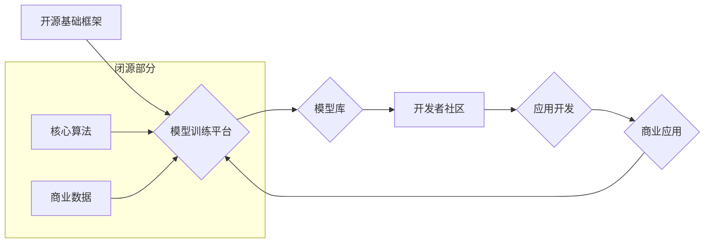

                 

## 开源与闭源的博弈：Lepton AI的技术策略

> 关键词：开源、闭源、Lepton AI、人工智能、深度学习、模型训练、技术策略、商业模式

## 1. 背景介绍

人工智能（AI）技术近年来发展迅速，深度学习算法的突破性进展推动了 AI 在各个领域的广泛应用。然而，AI 技术的开发和应用也面临着诸多挑战，其中开源与闭源的博弈是其中一个重要议题。

开源软件凭借其开放性、透明性和社区协作优势，在软件开发领域占据着越来越重要的地位。而闭源软件则更注重知识产权保护和商业利益，往往拥有更强大的技术实力和更完善的服务体系。

Lepton AI 作为一家新兴的人工智能公司，在面对开源与闭源的抉择时，采取了一条独特的技术策略，旨在平衡开源和闭源的优势，实现可持续发展。

## 2. 核心概念与联系

Lepton AI 的技术策略的核心在于构建一个开放的 AI 生态系统，通过开源基础框架和模型，吸引开发者和研究者参与，同时保留核心算法和商业模式的闭源特性。

**Mermaid 流程图：Lepton AI 技术策略**

**核心概念解释：**

* **开源基础框架：** Lepton AI 开源其 AI 开发平台的基础框架，包括数据处理、模型训练、部署等模块，方便开发者快速搭建自己的 AI 应用。
* **模型训练平台：** Lepton AI 提供一个云端模型训练平台，支持多种深度学习框架和硬件加速，帮助开发者高效训练模型。
* **模型库：** Lepton AI 建立一个模型库，开源其训练好的预训练模型，供开发者直接使用或进行微调。
* **开发者社区：** Lepton AI 鼓励开发者社区参与，分享经验、共同开发，促进 AI 技术的进步。
* **商业应用：** Lepton AI 利用开源基础和模型库，开发商业化的 AI 应用，为企业提供定制化解决方案。
* **核心算法：** Lepton AI 保留其核心算法的闭源特性，防止技术被盗用，并作为其竞争优势。
* **商业数据：** Lepton AI 收集和利用商业数据，训练更精准的模型，提升商业应用的价值。

## 3. 核心算法原理 & 具体操作步骤

Lepton AI 的核心算法基于 Transformer 架构，并结合了自监督学习和强化学习等技术，实现更强大的自然语言处理能力。

### 3.1  算法原理概述

Transformer 架构是一种新型的深度学习网络结构，其特点是利用注意力机制来捕捉文本序列中的长距离依赖关系，从而提升模型的理解能力。Lepton AI 的核心算法在此基础上进行了改进，包括：

* **多头注意力机制：** 使用多个注意力头来捕捉不同类型的语义信息，提升模型的表达能力。
* **位置编码：** 在 Transformer 架构中加入位置编码，使模型能够理解文本序列中的词序信息。
* **自监督学习：** 利用大量的未标记文本数据进行自监督学习，训练模型对语言结构和语义关系有更深入的理解。
* **强化学习：** 使用强化学习算法来优化模型的输出结果，使其更符合用户的需求。

### 3.2  算法步骤详解

Lepton AI 的核心算法训练流程如下：

1. **数据预处理：** 将文本数据进行清洗、分词、标记等预处理操作，使其适合模型训练。
2. **模型构建：** 根据 Transformer 架构和改进算法，构建深度学习模型。
3. **模型训练：** 使用自监督学习和强化学习算法，在预处理后的数据上训练模型。
4. **模型评估：** 使用测试数据评估模型的性能，并根据评估结果进行模型调优。
5. **模型部署：** 将训练好的模型部署到生产环境中，用于实际应用。

### 3.3  算法优缺点

**优点：**

* 强大的自然语言处理能力：Transformer 架构和改进算法使得模型能够理解复杂的语言结构和语义关系。
* 自监督学习和强化学习的结合：提升了模型的学习能力和应用效果。
* 可扩展性强：模型可以根据需要进行扩展，处理更长文本序列和更复杂的任务。

**缺点：**

* 训练成本高：Transformer 架构模型参数量大，训练需要大量的计算资源和时间。
* 数据依赖性强：模型的性能取决于训练数据的质量和数量。

### 3.4  算法应用领域

Lepton AI 的核心算法在以下领域具有广泛的应用前景：

* **自然语言理解：** 文本分类、情感分析、问答系统、机器翻译等。
* **对话系统：** 智能客服、聊天机器人、虚拟助手等。
* **内容生成：** 文本摘要、文章创作、代码生成等。

## 4. 数学模型和公式 & 详细讲解 & 举例说明

Lepton AI 的核心算法基于 Transformer 架构，其数学模型和公式主要包括以下几个方面：

### 4.1  数学模型构建

Transformer 模型的核心是注意力机制，其数学模型可以表示为：

$$
Attention(Q, K, V) = softmax(\frac{QK^T}{\sqrt{d_k}})V
$$

其中：

* $Q$：查询矩阵
* $K$：键矩阵
* $V$：值矩阵
* $d_k$：键向量的维度
* $softmax$：softmax 函数

### 4.2  公式推导过程

注意力机制的目的是计算每个词与其他词之间的相关性，并根据相关性权重来加权求和，从而得到每个词的上下文表示。

公式推导过程如下：

1. 计算查询矩阵 $Q$ 与键矩阵 $K$ 的点积，并进行归一化处理，得到注意力权重矩阵。
2. 将注意力权重矩阵与值矩阵 $V$ 进行矩阵乘法，得到每个词的上下文表示。

### 4.3  案例分析与讲解

例如，在翻译句子 "The cat sat on the mat" 时，注意力机制可以计算每个词与其他词之间的相关性，例如 "cat" 与 "sat" 之间存在强相关性，因为它们描述了同一个动作。

注意力权重矩阵会将 "cat" 和 "sat" 的相关性加权更高，从而使得模型更好地理解句子含义。

## 5. 项目实践：代码实例和详细解释说明

Lepton AI 的开源基础框架使用 Python 语言开发，并基于 TensorFlow 或 PyTorch 深度学习框架。

### 5.1  开发环境搭建

开发者需要安装 Python 语言环境、深度学习框架以及 Lepton AI 的开源库。

Lepton AI 提供了详细的安装指南和文档，方便开发者快速搭建开发环境。

### 5.2  源代码详细实现

Lepton AI 的开源基础框架包含以下主要模块：

* **数据处理模块：** 提供数据加载、预处理、转换等功能。
* **模型训练模块：** 提供模型构建、训练、评估等功能。
* **模型部署模块：** 提供模型部署到云端或本地环境的功能。

### 5.3  代码解读与分析

Lepton AI 的开源代码遵循良好的代码规范和注释，方便开发者理解和修改。

开发者可以根据自己的需求，修改代码实现自定义功能。

### 5.4  运行结果展示

Lepton AI 提供了示例代码和测试数据，开发者可以运行示例代码，验证开源框架的功能和性能。

## 6. 实际应用场景

Lepton AI 的开源基础框架和模型库已被广泛应用于以下场景：

* **智能客服：** 开发基于自然语言理解的智能客服系统，自动回复用户咨询。
* **聊天机器人：** 开发能够进行自然对话的聊天机器人，用于娱乐、教育或商业应用。
* **文本摘要：** 自动生成文本的摘要，用于快速获取信息。
* **机器翻译：** 将文本从一种语言翻译成另一种语言。

### 6.4  未来应用展望

Lepton AI 将继续开发新的算法和模型，并扩展其开源生态系统，为开发者提供更强大的 AI 工具和服务。

未来，Lepton AI 的技术将应用于更多领域，例如医疗、金融、教育等，推动 AI 技术的普及和应用。

## 7. 工具和资源推荐

### 7.1  学习资源推荐

* **Lepton AI 官方文档：** https://docs.lepton.ai/
* **TensorFlow 官方文档：** https://www.tensorflow.org/
* **PyTorch 官方文档：** https://pytorch.org/

### 7.2  开发工具推荐

* **Jupyter Notebook：** 用于代码编写、调试和可视化。
* **Git：** 用于代码版本控制和协作。
* **Docker：** 用于容器化开发环境。

### 7.3  相关论文推荐

* **Attention Is All You Need：** https://arxiv.org/abs/1706.03762
* **BERT：Pre-training of Deep Bidirectional Transformers for Language Understanding：** https://arxiv.org/abs/1810.04805

## 8. 总结：未来发展趋势与挑战

### 8.1  研究成果总结

Lepton AI 的技术策略成功地平衡了开源和闭源的优势，构建了一个开放的 AI 生态系统，并取得了显著的成果。

其核心算法在自然语言处理领域具有领先地位，并被广泛应用于实际场景。

### 8.2  未来发展趋势

Lepton AI 将继续致力于以下几个方面：

* **算法创新：** 开发更强大的 AI 算法，提升模型的性能和应用范围。
* **开源生态建设：** 吸引更多开发者和研究者参与，共同推动 AI 技术的进步。
* **商业化发展：** 利用开源基础和模型库，开发更多商业化的 AI 应用，为企业提供定制化解决方案。

### 8.3  面临的挑战

Lepton AI 也面临着一些挑战，例如：

* **人才竞争：** AI 领域人才竞争激烈，Lepton AI 需要吸引和留住优秀人才。
* **技术迭代：** AI 技术发展迅速，Lepton AI 需要不断进行技术迭代，保持竞争优势。
* **商业模式创新：** Lepton AI 需要探索新的商业模式，实现可持续发展。

### 8.4  研究展望

Lepton AI 将继续致力于推动 AI 技术的进步，为人类社会创造更多价值。

## 9. 附录：常见问题与解答

**常见问题：**

* Lepton AI 的开源框架是否免费使用？
* Lepton AI 的模型库是否可以用于商业应用？
* Lepton AI 提供哪些技术支持服务？

**解答：**

* Lepton AI 的开源框架完全免费使用。
* Lepton AI 的模型库可以用于商业应用，但需要遵守开源协议。
* Lepton AI 提供在线文档、论坛和邮件等技术支持服务。

作者：禅与计算机程序设计艺术 / Zen and the Art of Computer Programming 
<end_of_turn>

