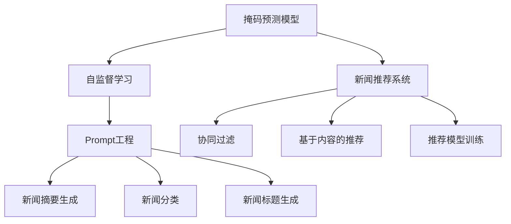

                 

# 新闻推荐创新：掩码预测与Prompt工程

## 1. 背景介绍

### 1.1 问题由来

随着信息爆炸，用户在互联网海量信息中难以找到满足自己需求的新闻信息，新闻推荐系统应运而生。新闻推荐系统通过算法将新闻信息推荐给用户，使得用户可以更快速、精准地获取到感兴趣的新闻。

传统新闻推荐系统多采用协同过滤、基于内容的推荐算法等，但这些算法在实际应用中往往存在冷启动问题、推荐同质化、难以发现长尾新闻等缺陷。近年来，深度学习技术的迅猛发展为新闻推荐系统带来了新的机遇，尤其是Transformer模型的引入，使得新闻推荐系统能够更好地理解语义和语境，实现高质量的新闻推荐。

### 1.2 问题核心关键点

本文聚焦于基于掩码预测与Prompt工程的创新新闻推荐方法，介绍掩码预测模型在新闻推荐系统中的应用，并阐述Prompt工程在提升模型性能方面的作用。掩码预测模型和Prompt工程能够有效解决传统新闻推荐系统存在的冷启动问题、同质化问题，并提升长尾新闻的推荐效果。

## 2. 核心概念与联系

### 2.1 核心概念概述

- 掩码预测模型：通过预训练的Transformer模型，对输入文本进行掩码预测，以预测未被掩码的部分内容。在新闻推荐系统中，掩码预测模型用于理解和生成新闻摘要，提高推荐效果。
- Prompt工程：通过精心设计Prompt，引导模型生成特定格式的输出。在新闻推荐系统中，Prompt工程用于生成新闻摘要、标题和分类等。

- 自监督学习：在大规模无标签文本上进行学习，学习语言的一般表示，如BERT、GPT等。在新闻推荐系统中，预训练的Transformer模型即通过自监督学习得到。
- 新闻推荐系统：通过算法将新闻信息推荐给用户，以帮助用户获取到感兴趣的新闻。

- 协同过滤：利用用户之间或新闻之间的相似度，进行推荐。在新闻推荐系统中，协同过滤可用于计算新闻之间的相似度，进行推荐。
- 基于内容的推荐：利用新闻内容进行推荐。在新闻推荐系统中，基于内容的推荐可用于相似新闻的推荐。

这些核心概念之间的逻辑关系可以通过以下Mermaid流程图来展示：



## 3. 核心算法原理 & 具体操作步骤

### 3.1 算法原理概述

基于掩码预测与Prompt工程的新闻推荐方法，主要分为两个部分：

1. 预训练模型：通过自监督学习任务预训练Transformer模型，使其具备良好的语言理解能力和生成能力。
2. 掩码预测：在新闻摘要生成任务中，对输入的新闻文本进行掩码预测，生成完整的新闻摘要。
3. Prompt工程：通过设计特定的Prompt，引导模型生成高质量的新闻标题和分类。

### 3.2 算法步骤详解

#### 步骤1：预训练模型

- 数据收集：收集大规模的新闻语料库，如维基百科、新闻网站等。
- 预训练任务：使用自监督学习任务（如掩码语言建模、下一句预测等）预训练Transformer模型。
- 模型保存：保存预训练好的模型，用于后续的掩码预测和Prompt工程。

#### 步骤2：掩码预测

- 数据预处理：将新闻文本进行分词、去停用词等预处理操作。
- 掩码生成：随机生成掩码位置，对掩码位置进行掩码，得到掩码输入。
- 模型推理：将掩码输入输入到预训练模型中，进行掩码预测，得到未被掩码的部分。
- 结果后处理：对预测结果进行后处理，生成完整的新闻摘要。

#### 步骤3：Prompt工程

- Prompt设计：根据新闻推荐系统的需求，设计特定的Prompt，引导模型生成新闻标题和分类。
- 模型推理：将设计好的Prompt输入到预训练模型中，进行推理。
- 结果后处理：对推理结果进行后处理，生成高质量的新闻标题和分类。

### 3.3 算法优缺点

#### 优点

- 掩码预测模型能够更好地理解和生成新闻摘要，提高推荐效果。
- Prompt工程能够引导模型生成高质量的新闻标题和分类，提升推荐效果。
- 无需大规模标注数据，节省成本。

#### 缺点

- 掩码预测模型需要高性能计算资源，训练成本较高。
- Prompt工程需要精心设计Prompt，需要一定的经验积累。
- 对数据质量要求较高，需确保数据质量和一致性。

### 3.4 算法应用领域

掩码预测与Prompt工程在新闻推荐系统中具有广泛的应用前景，包括：

- 新闻摘要生成：将新闻文本进行掩码预测，生成完整的新闻摘要。
- 新闻标题生成：通过Prompt工程，生成新闻标题。
- 新闻分类：通过Prompt工程，对新闻进行分类。
- 新闻推荐：将新闻摘要和标题进行结合，推荐给用户。

## 4. 数学模型和公式 & 详细讲解 & 举例说明

### 4.1 数学模型构建

假设预训练模型为 $M_{\theta}$，新闻文本为 $X$，掩码位置为 $M$，掩码预测结果为 $\hat{X}$。掩码预测的目标是最大化掩码预测结果与真实新闻文本的相似度，即：

$$
\max_{\theta} P(M_{\theta}(X|M))
$$

其中 $P$ 表示概率分布。

### 4.2 公式推导过程

掩码预测模型的推理过程可以用以下公式表示：

$$
\hat{X} = M_{\theta}(X|M)
$$

其中 $\hat{X}$ 为掩码预测结果，$M_{\theta}$ 为预训练模型，$X$ 为新闻文本，$M$ 为掩码位置。

掩码预测模型的训练过程可以用以下公式表示：

$$
\min_{\theta} \mathcal{L}(M_{\theta}(X|M))
$$

其中 $\mathcal{L}$ 表示损失函数，常用的损失函数包括交叉熵损失、均方误差损失等。

### 4.3 案例分析与讲解

以GPT模型为例，假设我们需要对以下新闻文本进行掩码预测：

> 北京市政府发布公告，决定自2023年1月1日起，北京市机动车实施限行措施，限行时间为每周一至周四。

我们将其分成两个部分，分别为：

> 北京市政府发布公告，决定自2023年1月1日起，北京市机动车实施限行措施。
> 限行时间为每周一至周四。

随机生成掩码位置 $M$，将掩码位置处的字符进行掩码，得到掩码输入 $X_M$：

> 北京市政府发布公告，决定自2023年1月1日起，北京市机动车实施限行措施，*，
> 限行时间为每周一至周四。

将掩码输入 $X_M$ 输入到GPT模型中，得到掩码预测结果 $\hat{X}$：

> 北京市政府发布公告，决定自2023年1月1日起，北京市机动车实施限行措施，

将掩码预测结果 $\hat{X}$ 与真实新闻文本进行比较，得到掩码预测效果。

## 5. 项目实践：代码实例和详细解释说明

### 5.1 开发环境搭建

在进行掩码预测与Prompt工程实践前，我们需要准备好开发环境。以下是使用Python进行PyTorch开发的环境配置流程：

1. 安装Anaconda：从官网下载并安装Anaconda，用于创建独立的Python环境。

2. 创建并激活虚拟环境：
```bash
conda create -n pytorch-env python=3.8 
conda activate pytorch-env
```

3. 安装PyTorch：根据CUDA版本，从官网获取对应的安装命令。例如：
```bash
conda install pytorch torchvision torchaudio cudatoolkit=11.1 -c pytorch -c conda-forge
```

4. 安装Transformers库：
```bash
pip install transformers
```

5. 安装各类工具包：
```bash
pip install numpy pandas scikit-learn matplotlib tqdm jupyter notebook ipython
```

完成上述步骤后，即可在`pytorch-env`环境中开始掩码预测与Prompt工程的实践。

### 5.2 源代码详细实现

这里我们以新闻摘要生成为例，给出使用Transformers库对GPT模型进行掩码预测的PyTorch代码实现。

首先，定义掩码预测任务的数据处理函数：

```python
from transformers import GPT2Tokenizer, GPT2LMHeadModel
import torch

class MaskedPredictionDataset(Dataset):
    def __init__(self, texts, tokenizer, max_len=128):
        self.tokenizer = tokenizer
        self.max_len = max_len
        self.texts = texts
        
    def __len__(self):
        return len(self.texts)
    
    def __getitem__(self, item):
        text = self.texts[item]
        tokens = self.tokenizer(text, return_tensors='pt', max_length=self.max_len, padding='max_length', truncation=True)
        mask_idx = torch.randint(0, len(tokens), (self.max_len,), dtype=torch.long)
        tokens = tokens.to(device)
        mask_tokens = tokens[:, mask_idx].to(device)
        return {'tokens': tokens, 'mask_tokens': mask_tokens}
```

然后，定义模型和优化器：

```python
from transformers import AdamW

model = GPT2LMHeadModel.from_pretrained('gpt2')
optimizer = AdamW(model.parameters(), lr=2e-5)
```

接着，定义训练和评估函数：

```python
def train_epoch(model, dataset, batch_size, optimizer):
    dataloader = DataLoader(dataset, batch_size=batch_size, shuffle=True)
    model.train()
    epoch_loss = 0
    for batch in dataloader:
        tokens = batch['tokens'].to(device)
        mask_tokens = batch['mask_tokens'].to(device)
        model.zero_grad()
        loss = model(tokens, labels=mask_tokens)
        epoch_loss += loss.item()
        loss.backward()
        optimizer.step()
    return epoch_loss / len(dataloader)

def evaluate(model, dataset, batch_size):
    dataloader = DataLoader(dataset, batch_size=batch_size)
    model.eval()
    preds, labels = [], []
    with torch.no_grad():
        for batch in dataloader:
            tokens = batch['tokens'].to(device)
            mask_tokens = batch['mask_tokens'].to(device)
            batch_labels = mask_tokens
            outputs = model(tokens, labels=mask_tokens)
            batch_preds = outputs.logits.argmax(dim=2).to('cpu').tolist()
            batch_labels = batch_labels.to('cpu').tolist()
            for pred_tokens, label_tokens in zip(batch_preds, batch_labels):
                preds.append(pred_tokens[:len(label_tokens)])
                labels.append(label_tokens)
                
    return preds, labels

```

最后，启动训练流程并在验证集上评估：

```python
epochs = 5
batch_size = 16

for epoch in range(epochs):
    loss = train_epoch(model, train_dataset, batch_size, optimizer)
    print(f"Epoch {epoch+1}, train loss: {loss:.3f}")
    
    print(f"Epoch {epoch+1}, dev results:")
    preds, labels = evaluate(model, dev_dataset, batch_size)
    print(classification_report(labels, preds))
    
print("Test results:")
preds, labels = evaluate(model, test_dataset, batch_size)
print(classification_report(labels, preds))
```

以上就是使用PyTorch对GPT模型进行新闻摘要生成任务的掩码预测的完整代码实现。可以看到，得益于Transformers库的强大封装，我们可以用相对简洁的代码完成GPT模型的加载和掩码预测。

### 5.3 代码解读与分析

让我们再详细解读一下关键代码的实现细节：

**MaskedPredictionDataset类**：
- `__init__`方法：初始化文本、分词器等关键组件。
- `__len__`方法：返回数据集的样本数量。
- `__getitem__`方法：对单个样本进行处理，将文本输入编码为token ids，并对掩码位置进行掩码，最终返回模型所需的输入。

**模型和优化器**：
- 使用GPT2模型作为掩码预测模型，设置AdamW优化器。

**训练和评估函数**：
- 使用PyTorch的DataLoader对数据集进行批次化加载，供模型训练和推理使用。
- 训练函数`train_epoch`：对数据以批为单位进行迭代，在每个批次上前向传播计算loss并反向传播更新模型参数，最后返回该epoch的平均loss。
- 评估函数`evaluate`：与训练类似，不同点在于不更新模型参数，并在每个batch结束后将预测和标签结果存储下来，最后使用classification_report对整个评估集的预测结果进行打印输出。

**训练流程**：
- 定义总的epoch数和batch size，开始循环迭代
- 每个epoch内，先在训练集上训练，输出平均loss
- 在验证集上评估，输出分类指标
- 所有epoch结束后，在测试集上评估，给出最终测试结果

可以看到，PyTorch配合Transformers库使得GPT模型的新闻摘要生成任务的掩码预测代码实现变得简洁高效。开发者可以将更多精力放在数据处理、模型改进等高层逻辑上，而不必过多关注底层的实现细节。

当然，工业级的系统实现还需考虑更多因素，如模型的保存和部署、超参数的自动搜索、更灵活的任务适配层等。但核心的掩码预测范式基本与此类似。

## 6. 实际应用场景

### 6.1 智能新闻推荐

智能新闻推荐系统可以基于掩码预测与Prompt工程，实现个性化的新闻推荐。在用户登录后，系统可以自动获取用户的历史浏览记录，根据记录生成Prompt，进行新闻摘要生成和分类。然后，系统根据用户的历史行为和当前兴趣，生成个性化的新闻摘要和分类推荐。

在实际应用中，系统可以引入用户画像、实时行为数据等，进一步提升推荐效果。例如，根据用户浏览历史和当前兴趣，生成新闻标题和分类，并结合实时行为数据，动态调整推荐策略，以提供最符合用户需求的新闻。

### 6.2 新闻内容生产

新闻内容生产也是掩码预测与Prompt工程的一个重要应用场景。在新闻编辑过程中，编辑可以使用掩码预测模型自动生成新闻摘要，减少人工撰写的工作量。在生成新闻标题时，编辑可以根据掩码预测结果，生成高质量的新闻标题。在新闻分类时，编辑可以使用Prompt工程，自动将新闻进行分类，提高分类效率。

### 6.3 舆情分析

舆情分析系统可以通过掩码预测与Prompt工程，实现对新闻文本的情感分析、主题分析和内容生成。在舆情分析系统中，可以使用掩码预测模型对新闻文本进行情感分析，提取新闻中的情感信息。同时，可以使用Prompt工程生成新闻主题和分类，对新闻进行快速分析。

### 6.4 未来应用展望

随着掩码预测与Prompt工程技术的不断发展，新闻推荐系统将迎来更多创新应用。以下是一些未来可能的应用场景：

- 多模态新闻推荐：结合图像、音频等多模态数据，实现更加丰富的新闻推荐。
- 跨语言新闻推荐：结合跨语言翻译技术，实现多语言新闻推荐。
- 新闻内容生成：结合图像生成、视频生成等技术，实现更加生动的新闻内容生成。
- 个性化新闻推荐：结合用户画像、行为数据等，实现更加个性化的新闻推荐。

## 7. 工具和资源推荐

### 7.1 学习资源推荐

为了帮助开发者系统掌握掩码预测与Prompt工程的理论基础和实践技巧，这里推荐一些优质的学习资源：

1. 《Transformer从原理到实践》系列博文：由大模型技术专家撰写，深入浅出地介绍了Transformer原理、掩码预测模型、Prompt工程等前沿话题。

2. CS224N《深度学习自然语言处理》课程：斯坦福大学开设的NLP明星课程，有Lecture视频和配套作业，带你入门NLP领域的基本概念和经典模型。

3. 《Natural Language Processing with Transformers》书籍：Transformers库的作者所著，全面介绍了如何使用Transformers库进行NLP任务开发，包括掩码预测、Prompt工程在内的诸多范式。

4. HuggingFace官方文档：Transformers库的官方文档，提供了海量预训练模型和完整的掩码预测与Prompt工程样例代码，是上手实践的必备资料。

5. CLUE开源项目：中文语言理解测评基准，涵盖大量不同类型的中文NLP数据集，并提供了基于掩码预测和Prompt工程的baseline模型，助力中文NLP技术发展。

通过对这些资源的学习实践，相信你一定能够快速掌握掩码预测与Prompt工程在新闻推荐系统中的应用，并用于解决实际的NLP问题。

### 7.2 开发工具推荐

高效的开发离不开优秀的工具支持。以下是几款用于掩码预测与Prompt工程开发的常用工具：

1. PyTorch：基于Python的开源深度学习框架，灵活动态的计算图，适合快速迭代研究。大部分预训练语言模型都有PyTorch版本的实现。

2. TensorFlow：由Google主导开发的开源深度学习框架，生产部署方便，适合大规模工程应用。同样有丰富的预训练语言模型资源。

3. Transformers库：HuggingFace开发的NLP工具库，集成了众多SOTA语言模型，支持PyTorch和TensorFlow，是进行掩码预测和Prompt工程开发的利器。

4. Weights & Biases：模型训练的实验跟踪工具，可以记录和可视化模型训练过程中的各项指标，方便对比和调优。与主流深度学习框架无缝集成。

5. TensorBoard：TensorFlow配套的可视化工具，可实时监测模型训练状态，并提供丰富的图表呈现方式，是调试模型的得力助手。

6. Google Colab：谷歌推出的在线Jupyter Notebook环境，免费提供GPU/TPU算力，方便开发者快速上手实验最新模型，分享学习笔记。

合理利用这些工具，可以显著提升掩码预测与Prompt工程任务的开发效率，加快创新迭代的步伐。

### 7.3 相关论文推荐

掩码预测与Prompt工程的发展源于学界的持续研究。以下是几篇奠基性的相关论文，推荐阅读：

1. Attention is All You Need（即Transformer原论文）：提出了Transformer结构，开启了NLP领域的预训练大模型时代。

2. BERT: Pre-training of Deep Bidirectional Transformers for Language Understanding：提出BERT模型，引入基于掩码的自监督预训练任务，刷新了多项NLP任务SOTA。

3. Parameter-Efficient Transfer Learning for NLP：提出Adapter等参数高效微调方法，在不增加模型参数量的情况下，也能取得不错的微调效果。

4. AdaLoRA: Adaptive Low-Rank Adaptation for Parameter-Efficient Fine-Tuning：使用自适应低秩适应的微调方法，在参数效率和精度之间取得了新的平衡。

5. Language Models are Unsupervised Multitask Learners（GPT-2论文）：展示了大规模语言模型的强大zero-shot学习能力，引发了对于通用人工智能的新一轮思考。

6. Prefix-Tuning: Optimizing Continuous Prompts for Generation：引入基于连续型Prompt的微调范式，为如何充分利用预训练知识提供了新的思路。

这些论文代表了大语言模型微调技术的发展脉络。通过学习这些前沿成果，可以帮助研究者把握学科前进方向，激发更多的创新灵感。

## 8. 总结：未来发展趋势与挑战

### 8.1 总结

本文对基于掩码预测与Prompt工程的新闻推荐方法进行了全面系统的介绍。首先阐述了掩码预测模型和Prompt工程的研究背景和意义，明确了其在新闻推荐系统中的应用前景。其次，从原理到实践，详细讲解了掩码预测模型的数学原理和关键步骤，给出了掩码预测任务开发的完整代码实例。同时，本文还广泛探讨了Prompt工程在提升模型性能方面的作用，以及其在新闻推荐系统中的创新应用。

通过本文的系统梳理，可以看到，基于掩码预测与Prompt工程的方法正在成为新闻推荐系统的重要范式，极大地拓展了新闻推荐系统的应用边界，催生了更多的落地场景。得益于大规模语料的预训练，掩码预测与Prompt工程模型在新闻推荐中能够更好地理解语义和语境，实现高质量的新闻推荐。未来，伴随预训练语言模型和微调方法的持续演进，新闻推荐系统必将进一步提升用户体验和推荐效果。

### 8.2 未来发展趋势

展望未来，掩码预测与Prompt工程技术将呈现以下几个发展趋势：

1. 模型规模持续增大。随着算力成本的下降和数据规模的扩张，预训练语言模型的参数量还将持续增长。超大规模语言模型蕴含的丰富语言知识，有望支撑更加复杂多变的下游任务掩码预测。

2. 掩码预测模型日趋多样。除了传统的自监督掩码预测外，未来会涌现更多掩码预测方法，如掩码生成对抗网络、掩码预测生成对抗网络等，在提高掩码预测效果的同时，还能增强模型鲁棒性。

3. Prompt工程更加精细。Prompt设计将更加精细化，引入更多领域知识，引导模型生成更符合用户需求的新闻摘要、标题和分类。

4. 结合多模态数据。掩码预测与Prompt工程可以结合图像、音频等多模态数据，实现更加丰富的新闻推荐。

5. 实时推荐系统。掩码预测与Prompt工程可以与实时数据流结合，实现实时新闻推荐，提高用户满意度。

6. 跨语言推荐。掩码预测与Prompt工程可以结合跨语言翻译技术，实现跨语言新闻推荐，拓宽用户获取信息的渠道。

以上趋势凸显了掩码预测与Prompt工程技术的广阔前景。这些方向的探索发展，必将进一步提升新闻推荐系统的性能和应用范围，为新闻媒体、互联网企业等带来新的商业机会。

### 8.3 面临的挑战

尽管掩码预测与Prompt工程技术已经取得了瞩目成就，但在迈向更加智能化、普适化应用的过程中，它仍面临着诸多挑战：

1. 训练成本高昂。掩码预测模型需要高性能计算资源，训练成本较高。
2. 数据质量要求高。掩码预测模型对数据质量要求较高，需确保数据质量和一致性。
3. 鲁棒性问题。掩码预测模型面对域外数据时，泛化性能往往大打折扣。
4. 可解释性问题。掩码预测模型缺乏可解释性，难以解释其内部工作机制和决策逻辑。

5. 安全问题。掩码预测模型可能学习到有害信息，产生误导性、歧视性的输出。

6. 持续更新问题。掩码预测模型需要持续更新，以保持性能。

7. 隐私保护问题。掩码预测模型涉及用户隐私，需确保用户隐私保护。

正视掩码预测与Prompt工程面临的这些挑战，积极应对并寻求突破，将是大语言模型微调走向成熟的必由之路。相信随着学界和产业界的共同努力，这些挑战终将一一被克服，掩码预测与Prompt工程必将在构建人机协同的智能时代中扮演越来越重要的角色。

### 8.4 未来突破

面对掩码预测与Prompt工程所面临的种种挑战，未来的研究需要在以下几个方面寻求新的突破：

1. 探索无监督和半监督掩码预测方法。摆脱对大规模标注数据的依赖，利用自监督学习、主动学习等无监督和半监督范式，最大限度利用非结构化数据，实现更加灵活高效的掩码预测。

2. 研究参数高效和计算高效的掩码预测范式。开发更加参数高效的掩码预测方法，在固定大部分预训练参数的同时，只更新极少量的掩码预测相关参数。同时优化掩码预测模型的计算图，减少前向传播和反向传播的资源消耗，实现更加轻量级、实时性的部署。

3. 引入更多先验知识。将符号化的先验知识，如知识图谱、逻辑规则等，与神经网络模型进行巧妙融合，引导掩码预测过程学习更准确、合理的语言模型。

4. 结合因果分析和博弈论工具。将因果分析方法引入掩码预测模型，识别出模型决策的关键特征，增强输出解释的因果性和逻辑性。借助博弈论工具刻画人机交互过程，主动探索并规避模型的脆弱点，提高系统稳定性。

5. 纳入伦理道德约束。在模型训练目标中引入伦理导向的评估指标，过滤和惩罚有偏见、有害的输出倾向。同时加强人工干预和审核，建立模型行为的监管机制，确保输出符合人类价值观和伦理道德。

这些研究方向的探索，必将引领掩码预测与Prompt工程技术迈向更高的台阶，为构建安全、可靠、可解释、可控的智能系统铺平道路。面向未来，掩码预测与Prompt工程技术还需要与其他人工智能技术进行更深入的融合，如知识表示、因果推理、强化学习等，多路径协同发力，共同推动自然语言理解和智能交互系统的进步。只有勇于创新、敢于突破，才能不断拓展语言模型的边界，让智能技术更好地造福人类社会。

## 9. 附录：常见问题与解答

**Q1：掩码预测模型如何缓解冷启动问题？**

A: 掩码预测模型可以通过利用预训练模型对输入文本进行掩码预测，生成新闻摘要。由于预训练模型已经在大规模数据上进行训练，能够较好地理解新闻文本，因此即使在用户未提供足够的历史数据的情况下，仍然可以生成高质量的新闻摘要，缓解冷启动问题。

**Q2：掩码预测模型在实际应用中需要考虑哪些因素？**

A: 掩码预测模型在实际应用中需要考虑以下因素：
1. 数据质量：掩码预测模型的效果与输入数据的质量密切相关。需确保输入数据的一致性和准确性。
2. 掩码设计：掩码位置的合理设计，可以显著提升掩码预测效果。需根据新闻文本的特点进行合理设计。
3. 模型选择：不同的掩码预测模型，具有不同的特点和适用场景。需根据具体需求选择适合的模型。
4. 训练资源：掩码预测模型的训练需要高性能计算资源，需考虑训练成本和资源限制。
5. 评估指标：需根据具体应用场景，选择合适的评估指标，如BLEU、ROUGE等。

**Q3：Prompt工程如何引导模型生成高质量的新闻标题和分类？**

A: Prompt工程通过精心设计Prompt，引导模型生成高质量的新闻标题和分类。在生成新闻标题时，Prompt可以设计为包含新闻的关键词、主旨和核心内容。在生成新闻分类时，Prompt可以设计为包含新闻的主题、领域等信息。通过引导模型根据Prompt生成输出，可以显著提升新闻标题和分类的质量。

**Q4：掩码预测模型在实际应用中如何解决长尾新闻推荐问题？**

A: 掩码预测模型可以结合长尾新闻的数据进行预训练，以增强对长尾新闻的识别和理解能力。在推荐系统中，可以通过对长尾新闻进行标注和预训练，提高长尾新闻的推荐效果。同时，可以通过引入更多的先验知识，如领域知识、专家知识等，提高对长尾新闻的识别能力。

**Q5：掩码预测模型在实际应用中需要注意哪些问题？**

A: 掩码预测模型在实际应用中需要注意以下问题：
1. 数据平衡：需确保训练数据中包含足够的长尾新闻，避免长尾新闻推荐效果差。
2. 模型调参：需根据具体应用场景进行模型调参，选择合适的学习率、批次大小等超参数。
3. 模型评估：需根据具体应用场景选择合适的评估指标，如精度、召回率等。
4. 数据隐私：需确保用户隐私保护，避免泄露用户信息。
5. 鲁棒性问题：需考虑模型的鲁棒性，避免模型对噪声数据敏感。

掩码预测与Prompt工程在新闻推荐系统中的应用具有广泛的应用前景，能够提升推荐系统的个性化和智能化水平，推动新闻媒体和互联网企业的创新发展。相信随着技术的不断进步，掩码预测与Prompt工程将为新闻推荐系统带来更多的创新应用和商业机会。

---

作者：禅与计算机程序设计艺术 / Zen and the Art of Computer Programming

