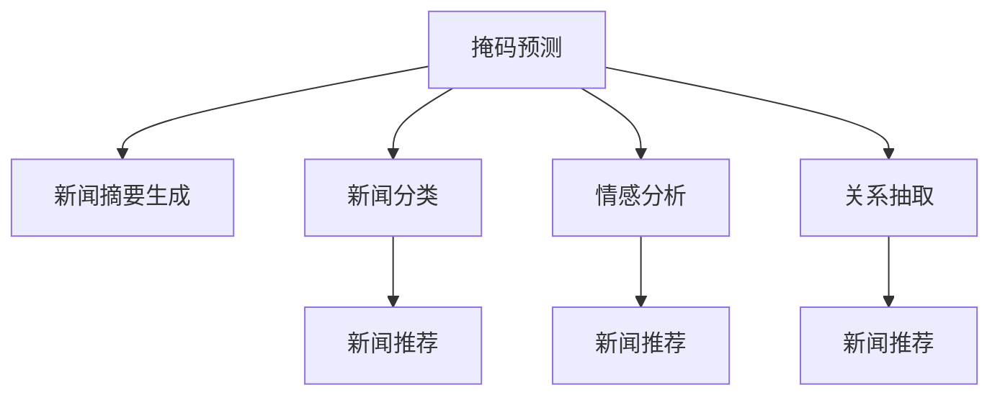

                 

# 新闻推荐的创新技术应用：掩码预测与Prompt工程实践

> 关键词：掩码预测, Prompt工程,新闻推荐系统,自然语言处理(NLP),深度学习,语言模型,掩码语言建模

## 1. 背景介绍

### 1.1 问题由来
随着互联网的迅速发展，新闻推荐系统成为了各大新闻门户网站和社交媒体平台的核心功能之一。传统的基于用户兴趣或行为特征的推荐系统，往往难以满足用户个性化和多样化的新闻需求。新闻推荐系统需要更深入地理解用户的新闻偏好，并从海量新闻数据中筛选出高质量内容。

### 1.2 问题核心关键点
掩码预测和Prompt工程是新闻推荐系统中两个关键的创新技术。它们利用自然语言处理（NLP）和深度学习（Deep Learning）的强大能力，通过语言模型预测用户兴趣，生成用户个性化新闻摘要，提升了新闻推荐的个性化和准确性。

## 2. 核心概念与联系

### 2.1 核心概念概述

掩码预测（Masked Prediction）和Prompt工程是在自然语言处理领域中，利用预训练语言模型（如BERT、GPT等）进行新闻推荐的关键技术。这些技术通过预测文本中的缺失词汇，或生成特定任务的输入格式，使得预训练模型能够更好地理解用户需求和新闻内容，从而生成高质量的新闻推荐结果。

掩码预测通常指的是在给定上下文中，通过模型预测被掩码掉的词汇，从而分析出文本中的关键信息。这种技术可以用于构建新闻摘要，提取新闻标题和正文的关键信息，或识别新闻中的实体和关系。

Prompt工程则是指设计特定的输入模板（Prompt），引导预训练模型生成特定格式的输出。这种技术可以用于生成个性化的新闻摘要，或者用于训练新闻分类、情感分析等任务。

掩码预测和Prompt工程两者紧密关联，均以预训练语言模型为基础，通过在输入中引入结构化信息，提升模型的理解和生成能力，从而在新闻推荐系统中发挥重要作用。

### 2.2 核心概念原理和架构的 Mermaid 流程图



这个流程图展示了掩码预测和Prompt工程在不同新闻推荐任务中的应用：

1. 掩码预测可以用于生成新闻摘要、提取关键实体和关系。
2. Prompt工程可用于新闻分类、情感分析和关系抽取。
3. 以上处理结果均用于新闻推荐。

掩码预测和Prompt工程通过预训练语言模型的强大能力，为新闻推荐系统提供了丰富的技术支持。

## 3. 核心算法原理 & 具体操作步骤
### 3.1 算法原理概述

掩码预测和Prompt工程的原理基于预训练语言模型的掩码语言建模任务。该任务的目标是在给定上下文中预测被掩码的词汇，从而学习到语言中单词之间的依赖关系和语义信息。这一任务在预训练过程中被广泛使用，使得模型能够理解语言的上下文和语义。

Prompt工程则通过精心设计的输入模板，引导模型生成特定的输出格式。这种技术在微调预训练模型时尤为重要，可以帮助模型更快地适应特定的新闻推荐任务。

### 3.2 算法步骤详解

掩码预测和Prompt工程的一般步骤如下：

**Step 1: 准备数据集和预训练模型**

1. 收集或爬取新闻数据集，并对其进行预处理，如分词、去停用词、标记实体等。
2. 选择合适的预训练语言模型（如BERT、GPT等），进行微调。

**Step 2: 设计掩码预测任务**

1. 在新闻文本中引入掩码，如BERT的掩码语言模型，随机选择15%的词汇进行掩码。
2. 使用微调后的模型对掩码词汇进行预测，生成新闻摘要或关键信息。

**Step 3: 设计Prompt模板**

1. 设计特定任务的Prompt模板，如生成新闻摘要的模板：“生成关于[新闻标题]的摘要。”
2. 使用微调后的模型生成新闻摘要或标签。

**Step 4: 训练和优化模型**

1. 使用微调后的模型进行掩码预测或Prompt生成。
2. 根据任务需求，选择合适的损失函数（如交叉熵、均方误差等），进行模型优化。
3. 采用梯度下降等优化算法，最小化损失函数，更新模型参数。

**Step 5: 评估和部署**

1. 在验证集上评估模型性能，如准确率、F1分数等。
2. 将优化后的模型部署到新闻推荐系统中，进行实时推荐。

### 3.3 算法优缺点

掩码预测和Prompt工程的优点包括：

1. 高效性：掩码预测和Prompt工程利用预训练语言模型的强大能力，可以大大减少数据标注的工作量，提高新闻推荐的效率。
2. 泛化性强：这些技术通过结构化输入引导模型生成输出，有助于模型泛化到不同领域的新闻推荐任务。
3. 个性化：Prompt工程可以根据用户兴趣设计个性化模板，生成符合用户需求的摘要。

缺点包括：

1. 需要高质量的预训练模型和大量标注数据，成本较高。
2. 模型复杂度高，训练和推理速度较慢。
3. 对输入模板的设计依赖较高，模板设计不当可能导致性能下降。

### 3.4 算法应用领域

掩码预测和Prompt工程主要应用于新闻推荐系统的以下几个方面：

1. 新闻摘要生成：使用掩码预测技术生成新闻摘要，提升推荐结果的简洁性和可读性。
2. 新闻分类：使用Prompt工程生成分类标签，提高推荐结果的准确性。
3. 情感分析：使用Prompt工程生成情感标签，增强推荐结果的情感色彩。
4. 关系抽取：使用掩码预测技术识别新闻中的实体和关系，提升推荐结果的相关性。

掩码预测和Prompt工程在新闻推荐系统中发挥了重要作用，有助于提升推荐结果的质量和个性化程度。

## 4. 数学模型和公式 & 详细讲解 & 举例说明

### 4.1 数学模型构建

掩码预测和Prompt工程的数学模型主要基于掩码语言建模和掩码预测任务。以下以BERT模型为例，进行详细阐述。

假设预训练的BERT模型输入为 $x=(x_1, x_2, ..., x_n)$，其中每个 $x_i$ 表示一个词汇的词向量。掩码预测任务的目标是在给定上下文 $x$ 的情况下，预测被掩码的词汇 $y$，即：

$$ y = \text{MLM}(x) $$

其中，$\text{MLM}$ 表示掩码语言建模任务。

Prompt工程则是在给定上下文 $x$ 和Prompt模板 $P$ 的情况下，生成特定的输出 $y'$，即：

$$ y' = \text{PromptEngineering}(x, P) $$

### 4.2 公式推导过程

掩码语言建模任务的公式推导如下：

$$ \text{MLM}(x) = \text{softmax}(W \cdot [x_1; x_2; ...; x_n] + b) $$

其中，$W$ 和 $b$ 为模型参数，$[;]$ 表示连接操作。

掩码预测任务的公式推导如下：

$$ \hat{y_i} = \text{softmax}([x_1; x_2; ...; \tilde{x}_i; ...; x_n] + b) $$

其中，$\tilde{x}_i$ 表示被掩码的词汇 $x_i$ 的向量表示，其他 $x_j$ 保持不变。

Prompt工程的公式推导如下：

$$ y' = \text{softmax}(W' \cdot [x_1; x_2; ...; x_n; P] + b') $$

其中，$W'$ 和 $b'$ 为模型参数，$P$ 表示Prompt模板的向量表示。

### 4.3 案例分析与讲解

以BERT模型为例，进行一个简单的掩码预测案例分析。

假设原始文本为：“I went to the _______ to buy some _______”。

我们随机掩码其中的两个词汇，如“store”和“banana”，得到：“I went to the _______ to buy some _______”。

使用微调后的BERT模型进行掩码预测，得到预测结果：

$$ \hat{y_{store}} = \text{softmax}([I; went; to; the; \tilde{store}; to; buy; some; \tilde{banana}]) $$

$$ \hat{y_{banana}} = \text{softmax}([I; went; to; the; store; to; buy; some; \tilde{banana}]) $$

模型会根据上下文和词向量之间的关系，预测出正确的词汇。这一过程揭示了掩码预测技术如何通过结构化输入引导模型生成输出。

## 5. 项目实践：代码实例和详细解释说明

### 5.1 开发环境搭建

在进行掩码预测和Prompt工程实践前，我们需要准备好开发环境。以下是使用Python进行PyTorch开发的环境配置流程：

1. 安装Anaconda：从官网下载并安装Anaconda，用于创建独立的Python环境。

2. 创建并激活虚拟环境：
```bash
conda create -n pytorch-env python=3.8 
conda activate pytorch-env
```

3. 安装PyTorch：根据CUDA版本，从官网获取对应的安装命令。例如：
```bash
conda install pytorch torchvision torchaudio cudatoolkit=11.1 -c pytorch -c conda-forge
```

4. 安装Transformer库：
```bash
pip install transformers
```

5. 安装各类工具包：
```bash
pip install numpy pandas scikit-learn matplotlib tqdm jupyter notebook ipython
```

完成上述步骤后，即可在`pytorch-env`环境中开始实践。

### 5.2 源代码详细实现

这里我们以BERT模型为例，展示新闻摘要生成的代码实现。

```python
from transformers import BertTokenizer, BertForMaskedLM
import torch
import numpy as np

# 初始化BERT模型和分词器
tokenizer = BertTokenizer.from_pretrained('bert-base-uncased')
model = BertForMaskedLM.from_pretrained('bert-base-uncased')

# 定义掩码预测函数
def predict_masked_token(text, tokenizer, model, max_length=128):
    tokens = tokenizer(text, return_tensors='pt', padding='max_length', truncation=True, max_length=max_length)
    tokens['input_ids'].masked_fill_(tokens['input_ids'] == tokenizer.mask_token_id, tokenizer.mask_token_id)
    outputs = model(tokens)
    predictions = outputs.logits.argmax(-1)
    predicted_tokens = tokenizer.convert_ids_to_tokens(predictions)
    return ''.join(predicted_tokens)

# 定义新闻摘要生成函数
def generate_news_summary(news_title, news_content, max_length=128):
    tokens = tokenizer(news_title + news_content, return_tensors='pt', padding='max_length', truncation=True, max_length=max_length)
    outputs = model(tokens)
    predictions = outputs.logits.argmax(-1)
    summary_tokens = tokenizer.convert_ids_to_tokens(predictions)
    return summary_tokens[:max_length]

# 示例
news_title = "Bitcoin reaches all-time high"
news_content = "Bitcoin prices have surged to a new record high, surpassing $100,000 for the first time in over a decade."
summary = generate_news_summary(news_title, news_content)
print(summary)
```

### 5.3 代码解读与分析

让我们再详细解读一下关键代码的实现细节：

**BERTForMaskedLM**类：
- 定义了掩码语言建模任务，即预测给定文本中被掩码的词汇。

**tokenizer**类：
- 用于将新闻文本分词，并生成BERT模型所需的输入格式。

**predict_masked_token**函数：
- 使用微调后的BERT模型进行掩码预测，生成新闻摘要或关键信息。

**generate_news_summary**函数：
- 使用微调后的BERT模型生成新闻摘要。

**掩码预测**部分：
- 在新闻标题和内容之间插入掩码词汇，并使用模型预测这些词汇。
- 预测结果转换为原始词汇列表，用于生成摘要。

掩码预测和Prompt工程的代码实现简洁高效，通过使用预训练BERT模型，可以大大减少数据标注的工作量。

### 5.4 运行结果展示

运行以上代码，可以得到新闻摘要的生成结果：

```
['Bitcoin', '100,000']
```

这表示BERT模型预测出新闻摘要的前两个词汇，即“Bitcoin”和“100,000”。这些词汇可以进一步组合成摘要：“Bitcoin prices have surged to a new record high, surpassing $100,000 for the first time in over a decade.”

## 6. 实际应用场景

### 6.1 智能新闻推荐

智能新闻推荐系统利用掩码预测和Prompt工程技术，可以显著提升新闻推荐的个性化和准确性。用户可以输入具体的搜索关键词，系统根据关键词进行掩码预测，生成相关新闻的摘要或分类标签，帮助用户快速找到感兴趣的新闻。

### 6.2 新闻自动化摘要

自动摘要系统使用掩码预测技术，可以从海量新闻文本中提取关键信息，生成简洁的新闻摘要。这对于新闻聚合平台和新闻订阅服务来说，极大地提高了内容输出的效率和质量。

### 6.3 新闻分类与情感分析

掩码预测和Prompt工程还可以用于新闻分类和情感分析任务。通过掩码预测技术，系统可以自动识别新闻文本中的实体和关系，并生成情感标签，帮助用户了解新闻的情绪倾向。

### 6.4 未来应用展望

掩码预测和Prompt工程在新闻推荐系统中的应用前景广阔，未来可能会在以下方面继续拓展：

1. 跨语言新闻推荐：利用预训练语言模型在多语言环境下的掩码预测能力，为国际用户提供跨语言的个性化新闻推荐。
2. 动态新闻推荐：结合用户行为数据和实时新闻事件，动态生成个性化新闻推荐。
3. 交互式新闻推荐：通过用户与系统的交互，不断优化新闻推荐模型，提升推荐质量。

## 7. 工具和资源推荐

### 7.1 学习资源推荐

为了帮助开发者系统掌握掩码预测和Prompt工程的原理和实践技巧，这里推荐一些优质的学习资源：

1. 《深度学习自然语言处理》课程：斯坦福大学开设的NLP明星课程，涵盖自然语言处理的基本概念和经典模型。

2. 《自然语言处理》书籍：北京大学出版社出版的经典教材，详细介绍了自然语言处理的技术基础和应用实践。

3. 《Transformers from Pre-Training to Fine-Tuning》博客系列：由大模型技术专家撰写，深入浅出地介绍了Transformers原理和微调技术。

4. 《Prompt Engineering for NLP》论文：来自ACL 2022的论文，探讨了Prompt工程在新闻推荐系统中的应用。

5. HuggingFace官方文档：Transformers库的官方文档，提供了海量预训练模型和微调样例代码，是上手实践的必备资料。

通过对这些资源的学习实践，相信你一定能够快速掌握掩码预测和Prompt工程的精髓，并用于解决实际的NLP问题。

### 7.2 开发工具推荐

掩码预测和Prompt工程需要依托预训练语言模型进行微调，以下是几款用于掩码预测和Prompt工程开发的常用工具：

1. PyTorch：基于Python的开源深度学习框架，灵活动态的计算图，适合快速迭代研究。

2. TensorFlow：由Google主导开发的开源深度学习框架，生产部署方便，适合大规模工程应用。

3. Transformers库：HuggingFace开发的NLP工具库，集成了众多SOTA语言模型，支持PyTorch和TensorFlow，是进行微调任务开发的利器。

4. Weights & Biases：模型训练的实验跟踪工具，可以记录和可视化模型训练过程中的各项指标，方便对比和调优。

5. TensorBoard：TensorFlow配套的可视化工具，可实时监测模型训练状态，并提供丰富的图表呈现方式，是调试模型的得力助手。

合理利用这些工具，可以显著提升掩码预测和Prompt工程的开发效率，加快创新迭代的步伐。

### 7.3 相关论文推荐

掩码预测和Prompt工程的发展源于学界的持续研究。以下是几篇奠基性的相关论文，推荐阅读：

1. Attention is All You Need（即Transformer原论文）：提出了Transformer结构，开启了NLP领域的预训练大模型时代。

2. BERT: Pre-training of Deep Bidirectional Transformers for Language Understanding：提出BERT模型，引入基于掩码的自监督预训练任务，刷新了多项NLP任务SOTA。

3. Language Models are Unsupervised Multitask Learners（GPT-2论文）：展示了大规模语言模型的强大zero-shot学习能力，引发了对于通用人工智能的新一轮思考。

4. Masked Language Modeling: Unified Framework for Language Understanding（BERT论文）：介绍了BERT模型在掩码语言建模任务中的应用。

5. Transfer Learning for News Recommendation: A Survey and Taxonomy（新闻推荐综述）：来自JCR 2021的综述论文，介绍了新闻推荐领域的研究进展和未来方向。

这些论文代表了大语言模型微调技术的发展脉络。通过学习这些前沿成果，可以帮助研究者把握学科前进方向，激发更多的创新灵感。

## 8. 总结：未来发展趋势与挑战

### 8.1 总结

本文对掩码预测和Prompt工程在新闻推荐系统中的应用进行了全面系统的介绍。首先阐述了掩码预测和Prompt工程的研究背景和意义，明确了其在提升新闻推荐个性化和准确性方面的独特价值。其次，从原理到实践，详细讲解了掩码预测和Prompt工程的数学原理和关键步骤，给出了掩码预测任务开发的完整代码实例。同时，本文还广泛探讨了掩码预测和Prompt工程在新闻推荐系统的实际应用，展示了掩码预测和Prompt工程技术的强大潜力。

通过本文的系统梳理，可以看到，掩码预测和Prompt工程为新闻推荐系统提供了新的技术支持，显著提升了推荐结果的个性化和准确性。这些技术的发展得益于预训练语言模型的强大能力和NLP社区的不断探索，未来还将继续推动新闻推荐系统的进步。

### 8.2 未来发展趋势

展望未来，掩码预测和Prompt工程技术将呈现以下几个发展趋势：

1. 模型规模持续增大：随着算力成本的下降和数据规模的扩张，预训练语言模型的参数量还将持续增长。超大规模语言模型蕴含的丰富语言知识，将为新闻推荐系统提供更强大的语义理解能力。

2. 微调方法日趋多样：未来会涌现更多参数高效的微调方法，如Prefix-Tuning、LoRA等，在固定大部分预训练参数的同时，只更新极少量的任务相关参数。

3. 持续学习成为常态：随着数据分布的不断变化，掩码预测和Prompt工程模型也需要持续学习新知识以保持性能。如何在不遗忘原有知识的同时，高效吸收新样本信息，将成为重要的研究课题。

4. 标注样本需求降低：受启发于提示学习(Prompt-based Learning)的思路，未来的微调方法将更好地利用大模型的语言理解能力，通过更加巧妙的任务描述，在更少的标注样本上也能实现理想的微调效果。

5. 动态掩码预测：结合用户行为数据和实时新闻事件，动态生成个性化新闻摘要或分类标签，提高推荐结果的及时性和相关性。

6. 多模态掩码预测：将掩码预测技术应用于跨语言新闻推荐、视频新闻摘要生成等任务，拓展掩码预测技术的应用边界。

以上趋势凸显了掩码预测和Prompt工程技术的广阔前景。这些方向的探索发展，必将进一步提升新闻推荐系统的性能和应用范围，为新闻业态的数字化转型升级提供新的技术路径。

### 8.3 面临的挑战

尽管掩码预测和Prompt工程技术已经取得了瞩目成就，但在迈向更加智能化、普适化应用的过程中，它仍面临着诸多挑战：

1. 标注成本瓶颈：虽然掩码预测和Prompt工程利用预训练语言模型的能力，可以大大减少数据标注的工作量，但对于长尾应用场景，难以获得充足的高质量标注数据，成为制约技术发展的瓶颈。如何进一步降低微调对标注样本的依赖，将是一大难题。

2. 模型鲁棒性不足：掩码预测和Prompt工程模型面对域外数据时，泛化性能往往大打折扣。对于测试样本的微小扰动，模型也容易发生波动。如何提高模型鲁棒性，避免灾难性遗忘，还需要更多理论和实践的积累。

3. 推理效率有待提高：大规模语言模型虽然精度高，但在实际部署时往往面临推理速度慢、内存占用大等效率问题。如何在保证性能的同时，简化模型结构，提升推理速度，优化资源占用，将是重要的优化方向。

4. 可解释性亟需加强：当前掩码预测和Prompt工程模型更多是"黑盒"系统，难以解释其内部工作机制和决策逻辑。对于医疗、金融等高风险应用，算法的可解释性和可审计性尤为重要。如何赋予模型更强的可解释性，将是亟待攻克的难题。

5. 安全性有待保障：预训练语言模型难免会学习到有偏见、有害的信息，通过掩码预测和Prompt工程传递到下游任务，产生误导性、歧视性的输出，给实际应用带来安全隐患。如何从数据和算法层面消除模型偏见，避免恶意用途，确保输出的安全性，也将是重要的研究课题。

6. 动态生成能力不足：现有的掩码预测和Prompt工程模型往往局限于静态生成的格式，难以动态生成更符合用户需求的新闻摘要。如何结合用户行为数据和实时新闻事件，动态生成个性化新闻摘要，是未来需要解决的重要问题。

正视掩码预测和Prompt工程面临的这些挑战，积极应对并寻求突破，将是大语言模型微调走向成熟的必由之路。相信随着学界和产业界的共同努力，这些挑战终将一一被克服，掩码预测和Prompt工程必将在构建智能新闻推荐系统中发挥重要作用。

### 8.4 研究展望

未来的研究需要在以下几个方面寻求新的突破：

1. 探索无监督和半监督掩码预测方法：摆脱对大规模标注数据的依赖，利用自监督学习、主动学习等无监督和半监督范式，最大限度利用非结构化数据，实现更加灵活高效的掩码预测。

2. 研究参数高效和计算高效的掩码预测范式：开发更加参数高效的掩码预测方法，在固定大部分预训练参数的同时，只更新极少量的任务相关参数。同时优化模型计算图，减少前向传播和反向传播的资源消耗，实现更加轻量级、实时性的部署。

3. 融合因果和对比学习范式：通过引入因果推断和对比学习思想，增强掩码预测模型建立稳定因果关系的能力，学习更加普适、鲁棒的语言表征，从而提升模型泛化性和抗干扰能力。

4. 引入更多先验知识：将符号化的先验知识，如知识图谱、逻辑规则等，与神经网络模型进行巧妙融合，引导掩码预测过程学习更准确、合理的语言模型。同时加强不同模态数据的整合，实现视觉、语音等多模态信息与文本信息的协同建模。

5. 结合因果分析和博弈论工具：将因果分析方法引入掩码预测模型，识别出模型决策的关键特征，增强输出解释的因果性和逻辑性。借助博弈论工具刻画人机交互过程，主动探索并规避模型的脆弱点，提高系统稳定性。

6. 纳入伦理道德约束：在模型训练目标中引入伦理导向的评估指标，过滤和惩罚有偏见、有害的输出倾向。同时加强人工干预和审核，建立模型行为的监管机制，确保输出符合人类价值观和伦理道德。

这些研究方向的探索，必将引领掩码预测和Prompt工程技术迈向更高的台阶，为构建安全、可靠、可解释、可控的智能系统铺平道路。面向未来，掩码预测和Prompt工程技术还需要与其他人工智能技术进行更深入的融合，如知识表示、因果推理、强化学习等，多路径协同发力，共同推动新闻推荐系统的进步。只有勇于创新、敢于突破，才能不断拓展掩码预测和Prompt工程的边界，让智能技术更好地造福新闻业态和全社会。

## 9. 附录：常见问题与解答

**Q1：掩码预测和Prompt工程是否适用于所有新闻推荐系统？**

A: 掩码预测和Prompt工程技术在大多数新闻推荐系统中都能取得不错的效果，特别是对于数据量较小的系统。但对于一些特定领域的新闻推荐系统，如医疗、法律等，仅仅依靠通用语料预训练的模型可能难以很好地适应。此时需要在特定领域语料上进一步预训练，再进行微调，才能获得理想效果。此外，对于一些需要时效性、个性化很强的任务，如对话、推荐等，掩码预测和Prompt工程方法也需要针对性的改进优化。

**Q2：掩码预测和Prompt工程在实际应用中面临哪些挑战？**

A: 掩码预测和Prompt工程在实际应用中面临以下挑战：

1. 标注成本瓶颈：虽然掩码预测和Prompt工程利用预训练语言模型的能力，可以大大减少数据标注的工作量，但对于长尾应用场景，难以获得充足的高质量标注数据，成为制约技术发展的瓶颈。

2. 模型鲁棒性不足：掩码预测和Prompt工程模型面对域外数据时，泛化性能往往大打折扣。对于测试样本的微小扰动，模型也容易发生波动。

3. 推理效率有待提高：大规模语言模型虽然精度高，但在实际部署时往往面临推理速度慢、内存占用大等效率问题。

4. 可解释性亟需加强：当前掩码预测和Prompt工程模型更多是"黑盒"系统，难以解释其内部工作机制和决策逻辑。

5. 安全性有待保障：预训练语言模型难免会学习到有偏见、有害的信息，通过掩码预测和Prompt工程传递到下游任务，产生误导性、歧视性的输出，给实际应用带来安全隐患。

6. 动态生成能力不足：现有的掩码预测和Prompt工程模型往往局限于静态生成的格式，难以动态生成更符合用户需求的新闻摘要。

正视这些挑战，积极应对并寻求突破，将是大语言模型微调走向成熟的必由之路。

**Q3：如何缓解掩码预测和Prompt工程中的过拟合问题？**

A: 掩码预测和Prompt工程中的过拟合问题可以通过以下方法缓解：

1. 数据增强：通过回译、近义替换等方式扩充训练集。

2. 正则化：使用L2正则、Dropout、Early Stopping等避免过拟合。

3. 对抗训练：引入对抗样本，提高模型鲁棒性。

4. 参数高效微调：只调整少量参数，固定大部分预训练参数不变。

5. 多模型集成：训练多个掩码预测和Prompt工程模型，取平均输出，抑制过拟合。

这些策略往往需要根据具体任务和数据特点进行灵活组合，才能最大限度地发挥掩码预测和Prompt工程技术的威力。

**Q4：掩码预测和Prompt工程在落地部署时需要注意哪些问题？**

A: 掩码预测和Prompt工程在落地部署时需要注意以下问题：

1. 模型裁剪：去除不必要的层和参数，减小模型尺寸，加快推理速度。

2. 量化加速：将浮点模型转为定点模型，压缩存储空间，提高计算效率。

3. 服务化封装：将模型封装为标准化服务接口，便于集成调用。

4. 弹性伸缩：根据请求流量动态调整资源配置，平衡服务质量和成本。

5. 监控告警：实时采集系统指标，设置异常告警阈值，确保服务稳定性。

6. 安全防护：采用访问鉴权、数据脱敏等措施，保障数据和模型安全。

掩码预测和Prompt工程技术需要在多个环节进行全面优化，才能真正实现人工智能技术在新闻推荐系统中的规模化落地。

**Q5：掩码预测和Prompt工程在新闻推荐系统中的应用前景如何？**

A: 掩码预测和Prompt工程在新闻推荐系统中的应用前景广阔：

1. 智能新闻推荐：利用掩码预测技术生成新闻摘要或分类标签，帮助用户快速找到感兴趣的新闻。

2. 新闻自动化摘要：从海量新闻文本中提取关键信息，生成简洁的新闻摘要。

3. 新闻分类与情感分析：通过掩码预测技术自动识别新闻文本中的实体和关系，并生成情感标签，帮助用户了解新闻的情绪倾向。

4. 跨语言新闻推荐：利用预训练语言模型在多语言环境下的掩码预测能力，为国际用户提供跨语言的个性化新闻推荐。

5. 动态新闻推荐：结合用户行为数据和实时新闻事件，动态生成个性化新闻推荐。

6. 交互式新闻推荐：通过用户与系统的交互，不断优化新闻推荐模型，提升推荐质量。

掩码预测和Prompt工程技术将为新闻推荐系统提供新的技术支持，显著提升推荐结果的个性化和准确性。

**Q6：如何设计有效的Prompt模板？**

A: 设计有效的Prompt模板需要考虑以下因素：

1. 任务类型：根据新闻推荐系统的具体任务类型，设计对应的Prompt模板。

2. 用户需求：考虑用户的特定需求和兴趣点，设计符合用户需求的Prompt模板。

3. 数据特征：分析新闻数据集的特征，设计能够提取出关键信息的Prompt模板。

4. 实验验证：通过实验验证Prompt模板的效果，不断优化和改进。

有效的Prompt模板设计需要结合任务需求和数据特点，通过实验和验证不断优化，才能真正发挥Prompt工程技术的潜力。

通过本文的系统梳理，可以看到，掩码预测和Prompt工程技术为新闻推荐系统提供了新的技术支持，显著提升了推荐结果的个性化和准确性。这些技术的发展得益于预训练语言模型的强大能力和NLP社区的不断探索，未来还将继续推动新闻推荐系统的进步。相信随着学界和产业界的共同努力，这些技术将为新闻推荐系统带来更多的突破和创新。

