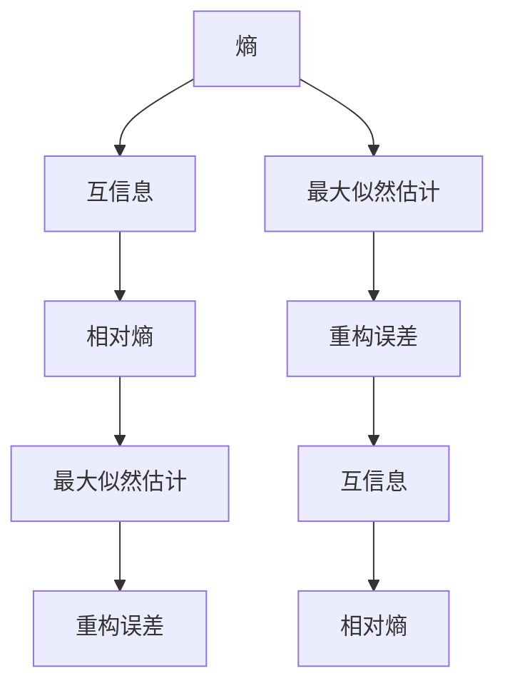

                 

# 无监督学习的理论基础:信息论和统计学习理论

## 1. 背景介绍

### 1.1 问题由来
在人工智能和机器学习的众多任务中，无监督学习（Unsupervised Learning）作为与监督学习（Supervised Learning）、强化学习（Reinforcement Learning）并列的三大基本学习方式，其重要性不容忽视。无监督学习旨在从数据中自动发现内在结构，无需标签数据。然而，相较于监督学习，无监督学习的理论和应用都面临着一定的挑战。信息论和统计学习理论作为无监督学习的重要理论基础，其内涵和应用具有重要意义。本文将详细探讨信息论和统计学习理论，并通过实际案例分析，深入理解其应用价值。

### 1.2 问题核心关键点
无监督学习的研究核心在于如何从未标记数据中提取出有意义的结构和模式。信息论和统计学习理论为此提供了理论支持，主要涉及以下几个关键点：
- 信息论的基本概念：熵、互信息、相对熵等。
- 统计学习理论的基本框架：包括最大似然估计（Maximum Likelihood Estimation,MLE）、贝叶斯学习、重构误差（Reconstruction Error）等。
- 信息论与统计学习理论的联系：如何将信息论原理应用于统计学习，进行无监督模式发现。
- 无监督学习的实际应用：如图像去噪、聚类、降维、生成模型等。

本文将通过以上核心关键点的详细阐述，从理论到实践，全方位解读无监督学习背后的数学和统计原理。

## 2. 核心概念与联系

### 2.1 核心概念概述

在深入研究信息论和统计学习理论之前，我们先概述以下几个核心概念：

- **熵（Entropy）**：衡量数据随机性的一个指标，信息论的基石。熵越高，数据的不确定性越大。
- **互信息（Mutual Information）**：衡量两个随机变量之间关联性的度量。互信息越大，两个变量的相关性越强。
- **相对熵（Kullback-Leibler Divergence, KL Divergence）**：衡量两个概率分布之间差异的度量，常用于度量模型复杂度。
- **最大似然估计（MLE）**：通过最大化观测数据出现的概率来估计模型参数。
- **重构误差（Reconstruction Error）**：数据压缩重建过程中引入的误差，常用于衡量数据的信息量和模型复杂度。

以上概念构成了无监督学习理论的核心框架，理解和应用这些概念是实现无监督学习的基础。

### 2.2 核心概念原理和架构的 Mermaid 流程图



该流程图展示了信息论和统计学习理论中的主要概念和它们之间的联系。从熵到互信息，再到相对熵和最大似然估计、重构误差，这些概念相互交织，共同构成了无监督学习的理论基础。

## 3. 核心算法原理 & 具体操作步骤
### 3.1 算法原理概述

信息论和统计学习理论的核心思想是通过数据的信息量来揭示数据的内在结构和模式。以下将详细介绍这两大理论在无监督学习中的应用：

- **信息论原理**：熵和互信息是信息论的基本概念，可用于衡量数据集的信息量和数据之间的相关性。例如，香农-范诺编码（Shannon-Fano Coding）和哈夫曼编码（Huffman Coding）都是基于熵的概念，用于数据压缩，但本文重点在于如何将这些概念应用于无监督学习中。
- **统计学习理论**：最大似然估计、重构误差等概念，可用于估计模型参数和优化模型复杂度。重构误差可用于衡量数据压缩过程中的信息损失，在自编码器（Autoencoder）等无监督学习模型中被广泛应用。

### 3.2 算法步骤详解

**Step 1: 数据预处理**
- 收集未标记的数据集。
- 数据归一化、标准化等预处理。

**Step 2: 构建模型**
- 根据任务需求选择合适的无监督学习模型，如自编码器、变分自编码器、聚类模型等。
- 定义模型参数，包括编码器、解码器、损失函数等。

**Step 3: 模型训练**
- 使用最大似然估计等优化算法，最小化损失函数。
- 监控重构误差等指标，评估模型效果。
- 不断迭代训练，直至模型收敛。

**Step 4: 模型评估**
- 使用交叉验证等方法评估模型泛化能力。
- 分析模型输出的特征和结构。

### 3.3 算法优缺点
- **优点**：
  - 数据驱动，无需标记数据。
  - 模型具有较强的泛化能力，适合大数据场景。
  - 算法实现相对简单，计算复杂度较低。

- **缺点**：
  - 模型效果受数据质量影响较大，数据噪声可能导致误判。
  - 模型的理论支持相对薄弱，部分算法难以解释。
  - 在特定任务上，可能不如有监督学习方法效果显著。

### 3.4 算法应用领域

信息论和统计学习理论在多个领域都有广泛应用，以下是几个典型领域：

- **图像处理**：图像去噪、图像分割、图像生成等。
- **信号处理**：音频信号处理、语音识别等。
- **自然语言处理**：文本聚类、主题模型、异常检测等。
- **生物信息学**：基因序列分析、蛋白质结构预测等。

## 4. 数学模型和公式 & 详细讲解 & 举例说明
### 4.1 数学模型构建

本节将使用数学语言详细阐述信息论和统计学习理论的基本数学模型，并给出公式推导过程。

- **熵（Entropy）**：信息熵 $H(X)$ 定义为随机变量 $X$ 的不确定性，数学公式为：
  $$
  H(X) = -\sum_{x} p(x) \log p(x)
  $$
  其中 $p(x)$ 为随机变量 $X$ 取值 $x$ 的概率。

- **互信息（Mutual Information）**：随机变量 $X$ 和 $Y$ 的互信息 $I(X;Y)$ 定义为两者之间的关联性，数学公式为：
  $$
  I(X;Y) = H(X) + H(Y) - H(X, Y)
  $$
  其中 $H(X, Y)$ 为 $X$ 和 $Y$ 的联合熵。

- **相对熵（KL Divergence）**：衡量两个概率分布 $p(x)$ 和 $q(x)$ 之间的差异，数学公式为：
  $$
  D_{KL}(p||q) = \sum_x p(x) \log \frac{p(x)}{q(x)}
  $$

### 4.2 公式推导过程

以**自编码器（Autoencoder）**为例，详细推导其数学模型和损失函数。

自编码器是一种常见的无监督学习模型，其主要目标是将输入数据 $x$ 通过编码器 $f(x)$ 映射为潜在表示 $z$，再通过解码器 $g(z)$ 重构回输入数据 $x'$。其损失函数通常使用重构误差（Reconstruction Error）：
$$
L(x', x) = \frac{1}{2} \| x - x' \|^2
$$
其中 $\| \cdot \|$ 表示欧几里得范数。

重构误差损失函数的目标是最小化模型输出 $x'$ 和输入 $x$ 之间的距离。通过最小化损失函数，自编码器可以学习到数据的潜在表示，并通过解码器重构回输入数据，实现数据的压缩和重建。

### 4.3 案例分析与讲解

以**聚类（Clustering）**为例，分析聚类算法的信息论和统计学习理论基础。

聚类算法是一种常见的无监督学习任务，其目标是将数据点划分为若干个簇，使得簇内的数据点相似度最高，簇间的相似度最低。常用的聚类算法包括K-means、DBSCAN、层次聚类等。

**K-means算法**的基本思想是最大化样本与中心点的相似度，最小化样本与中心点的距离。其数学公式为：
$$
\min_{\mu} \sum_k \sum_{i \in C_k} \| x_i - \mu_k \|^2
$$
其中 $C_k$ 表示第 $k$ 个簇，$\mu_k$ 表示簇 $C_k$ 的中心点。

该算法可以看作是一个优化问题，通过迭代更新中心点和样本分配，实现数据点的聚类。从信息论的角度来看，K-means算法通过最小化数据点与中心点的距离，实现了对数据分布的建模和压缩，从而揭示了数据的内在结构。

## 5. 项目实践：代码实例和详细解释说明
### 5.1 开发环境搭建

在进行无监督学习实践前，我们需要准备好开发环境。以下是使用Python进行PyTorch开发的环境配置流程：

1. 安装Anaconda：从官网下载并安装Anaconda，用于创建独立的Python环境。

2. 创建并激活虚拟环境：
```bash
conda create -n pytorch-env python=3.8 
conda activate pytorch-env
```

3. 安装PyTorch：根据CUDA版本，从官网获取对应的安装命令。例如：
```bash
conda install pytorch torchvision torchaudio cudatoolkit=11.1 -c pytorch -c conda-forge
```

4. 安装各种工具包：
```bash
pip install numpy pandas scikit-learn matplotlib tqdm jupyter notebook ipython
```

完成上述步骤后，即可在`pytorch-env`环境中开始无监督学习实践。

### 5.2 源代码详细实现

以下是一个简单的K-means聚类算法示例，使用PyTorch实现。

```python
import torch
import torch.nn as nn
from sklearn.datasets import make_blobs
from sklearn.metrics import silhouette_score

class KMeans(nn.Module):
    def __init__(self, num_clusters):
        super(KMeans, self).__init__()
        self.num_clusters = num_clusters
        self.centroids = nn.Parameter(torch.randn(num_clusters, 2))
        self.register_buffer('assignments', torch.zeros(100, num_clusters))
    
    def forward(self, x):
        return self.assign_centroids(x)
    
    def assign_centroids(self, x):
        # 计算距离
        distances = torch.linalg.norm(x.unsqueeze(1) - self.centroids, dim=2)
        # 分配聚类
        self.assignments = torch.argmin(distances, dim=1)
        return self.centroids[self.assignments]
    
    def update_centroids(self, x):
        for i in range(self.num_clusters):
            self.centroids[i] = torch.mean(x[self.assignments == i], dim=0)
    
def kmeans(x, num_clusters=3, max_iters=100):
    model = KMeans(num_clusters)
    criterion = nn.MSELoss()
    optimizer = torch.optim.Adam(model.parameters(), lr=1e-3)
    
    for i in range(max_iters):
        optimizer.zero_grad()
        output = model(x)
        loss = criterion(output, x)
        loss.backward()
        optimizer.step()
        model.update_centroids(x)
    
    return model, model.centroids, model.assignments

# 加载数据集
x, y = make_blobs(n_samples=100, centers=3, random_state=42, cluster_std=0.6)
x = torch.from_numpy(x).float()

# 聚类
model, centroids, assignments = kmeans(x, max_iters=100)

# 可视化结果
import matplotlib.pyplot as plt
plt.scatter(x[:, 0], x[:, 1], c=assignments)
plt.scatter(centroids[:, 0], centroids[:, 1], s=200, c='r', marker='x')
plt.title('K-means Clustering')
plt.show()

# 计算轮廓系数
print(f'Silhouette Score: {silhouette_score(x, assignments)}')
```

该代码实现了K-means聚类算法，使用PyTorch框架进行开发。具体步骤包括：
- 定义聚类模型 `KMeans`，包含聚类中心、样本分配和聚类更新等步骤。
- 加载数据集 `make_blobs`，构建随机生成的二维数据集。
- 通过前向传播计算聚类中心和样本分配，并使用均方误差损失进行训练。
- 可视化聚类结果，并计算轮廓系数。

### 5.3 代码解读与分析

让我们再详细解读一下关键代码的实现细节：

**KMeans类定义**：
- `__init__`方法：初始化聚类中心和样本分配。
- `forward`方法：将输入数据分配到最近的聚类中心。
- `assign_centroids`方法：计算数据与聚类中心的距离，并分配样本到最近的聚类。
- `update_centroids`方法：根据分配结果更新聚类中心。

**模型训练**：
- 定义损失函数、优化器等训练相关组件。
- 使用前向传播和反向传播更新模型参数。
- 迭代训练，直到收敛。

**可视化结果**：
- 使用Matplotlib绘制聚类结果。
- 显示聚类中心和分配结果。

**性能评估**：
- 使用轮廓系数评估聚类质量。

可以看到，使用PyTorch进行无监督学习实践，可以方便地构建和训练模型，同时利用第三方库进行结果可视化。

## 6. 实际应用场景
### 6.1 图像去噪

图像去噪是无监督学习的一个重要应用场景。通过无监督学习，可以从大量噪声图像中学习到图像的潜在特征，从而去除噪声。自编码器（Autoencoder）是图像去噪的一种常见方法，其核心思想是通过编码器将图像压缩成潜在表示，再通过解码器重构回原始图像。自编码器在图像去噪中取得了较好的效果，常用于处理医学、遥感等领域的图像数据。

### 6.2 聚类

聚类是无监督学习的基础应用之一，可以用于数据预处理、特征提取等任务。例如，在市场分析中，可以通过聚类算法分析客户群体，提取潜在客户特征，进行市场细分和精准营销。在生物信息学中，聚类算法可以用于基因序列分析，识别基因簇和基因表达模式。

### 6.3 降维

降维是无监督学习的另一个重要应用，旨在将高维数据压缩到低维空间，保留重要信息。常见的降维算法包括PCA（Principal Component Analysis）、t-SNE（t-Distributed Stochastic Neighbor Embedding）等。PCA通过特征值分解，将数据映射到低维空间，保留最重要的信息；t-SNE通过非线性变换，将数据映射到二维或三维空间，可视化数据分布。降维算法在数据可视化和数据压缩中具有重要应用。

### 6.4 生成模型

生成模型是无监督学习的高级应用，可以用于生成新的数据样本，模拟数据的分布特性。例如，在图像生成中，生成对抗网络（GAN）可以生成逼真的图像；在文本生成中，变分自编码器（VAE）可以生成自然流畅的文本。生成模型在数据增强、虚拟现实等领域具有重要应用。

## 7. 工具和资源推荐
### 7.1 学习资源推荐

为了帮助开发者系统掌握无监督学习理论基础和实践技巧，这里推荐一些优质的学习资源：

1. **《机器学习》课程**：由斯坦福大学Andrew Ng教授开设的Coursera课程，系统讲解了机器学习的理论和算法，包括无监督学习的部分。

2. **《深度学习》教材**：Ian Goodfellow等人合著的《深度学习》教材，详细介绍了深度学习的理论和应用，包括无监督学习的部分。

3. **《无监督学习》书籍**：Sparse inverse covariance estimation for non-Gaussian data的作者Bhaskar Chaudhuri等人合著的《无监督学习》书籍，深入探讨了无监督学习的理论和算法。

4. **HuggingFace官方文档**：TensorFlow、PyTorch等深度学习框架的官方文档，提供了丰富的无监督学习算法实现。

5. **Kaggle平台**：Kaggle是一个数据科学竞赛平台，提供大量的无监督学习竞赛和数据集，适合实践学习。

通过对这些资源的学习实践，相信你一定能够快速掌握无监督学习的精髓，并用于解决实际的机器学习问题。

### 7.2 开发工具推荐

高效的开发离不开优秀的工具支持。以下是几款用于无监督学习开发的常用工具：

1. **PyTorch**：基于Python的开源深度学习框架，灵活动态的计算图，适合快速迭代研究。

2. **TensorFlow**：由Google主导开发的开源深度学习框架，生产部署方便，适合大规模工程应用。

3. **Scikit-learn**：Python的机器学习库，提供了多种无监督学习算法实现，易于上手。

4. **Matplotlib**：Python的数据可视化库，支持多种数据类型和图表形式。

5. **Seaborn**：基于Matplotlib的高级数据可视化库，支持更复杂的图表形式。

6. **Jupyter Notebook**：Python的交互式编程环境，适合做数据分析和模型调试。

合理利用这些工具，可以显著提升无监督学习任务的开发效率，加快创新迭代的步伐。

### 7.3 相关论文推荐

无监督学习的研究源于学界的持续研究。以下是几篇奠基性的相关论文，推荐阅读：

1. **信息论基础**：
   - Claude Shannon, "A Mathematical Theory of Communication," Bell System Technical Journal, 1948
   - Robert M. Gray, "From Information Theory to Data Compression," Foundations and Trends in Communications and Information Theory, 2005

2. **统计学习理论基础**：
   - Peter L. Bartlett and Miroslav Kearns and Thomas Richard, "Empirical Learning and the Vapnik-Chervonenkis Dimension," IEEE Transactions on Information Theory, 1993
   - Christopher M. Bishop, "Pattern Recognition and Machine Learning," 2006

3. **无监督学习算法**：
   - Mikhail Belkin and Piotr Niyogi, "Laplacian Eigenmaps and Kernel PCA," Neural Computation, 2003
   - Yann LeCun, "The Geometry of Deep Learning," Science, 2015

4. **无监督学习应用**：
   - Yanqing Hu and Chen Change Loy and Saining Xie and Xiaoou Tang, "Deep Feature Robust Histograms for Image Recognition," IEEE Transactions on Pattern Analysis and Machine Intelligence, 2014
   - Erkki Oja, "Subspace Significance Testing for Independent Subspace Analysis," IEEE Transactions on Signal Processing, 2012

这些论文代表了大数据时代无监督学习的最新进展，深入探讨了信息论和统计学习理论的数学原理和算法实现。通过学习这些前沿成果，可以帮助研究者把握学科前进方向，激发更多的创新灵感。

## 8. 总结：未来发展趋势与挑战
### 8.1 总结

本文对无监督学习的理论基础进行了系统介绍。从信息论和统计学习理论入手，详细阐述了熵、互信息、相对熵等基本概念，以及最大似然估计、重构误差等重要算法。同时，通过实际案例分析，展示了无监督学习在图像去噪、聚类、降维、生成模型等领域的广泛应用。

通过本文的系统梳理，可以看到，无监督学习在大数据时代具有广泛的应用前景。未来，伴随深度学习模型的不断进步，无监督学习技术也将不断演进，为人工智能技术的进一步发展提供新的动力。

### 8.2 未来发展趋势

展望未来，无监督学习将呈现以下几个发展趋势：

1. **深度学习模型的进步**：随着深度学习模型的不断进步，无监督学习算法也将变得更加强大。神经网络的结构和训练方法不断优化，无监督学习算法也将从中受益。

2. **自动化的优化**：未来，无监督学习算法将更加自动化，能够在没有人工干预的情况下，自动调整模型参数和训练流程，提升模型效果。

3. **多模态学习的崛起**：未来，无监督学习将更加注重多模态数据的融合，将图像、文本、语音等多模态数据进行协同建模，提升模型的综合能力。

4. **泛化能力的提升**：未来，无监督学习算法将更加注重泛化能力，能够在不同领域和数据分布上取得一致的性能表现。

5. **理论研究的新突破**：未来，无监督学习的理论研究将更加深入，更多关于信息论、统计学习的新理论将被引入，推动无监督学习技术的不断发展。

6. **跨领域应用**：未来，无监督学习技术将进一步应用于更多领域，如智能制造、医疗健康、环境保护等，推动人工智能技术的产业化应用。

以上趋势凸显了无监督学习技术的广阔前景。这些方向的探索发展，必将进一步提升无监督学习算法的性能和应用范围，为人工智能技术的发展注入新的活力。

### 8.3 面临的挑战

尽管无监督学习技术已经取得了显著进展，但在迈向更加智能化、普适化应用的过程中，仍面临以下挑战：

1. **数据噪声的影响**：无监督学习算法对数据噪声较为敏感，需要更多的数据清洗和预处理。

2. **模型的泛化能力**：虽然无监督学习算法在特定任务上取得了较好效果，但在泛化能力和鲁棒性上仍需进一步提升。

3. **计算资源的限制**：无监督学习算法通常需要较大的计算资源，如何在有限的计算资源下，实现高效的无监督学习，是一个重要问题。

4. **算法可解释性**：无监督学习算法的决策过程通常缺乏可解释性，难以对其内部机制进行解释和调试。

5. **模型的复杂度**：无监督学习算法通常需要较复杂的模型结构，模型的参数量和计算复杂度较大。

6. **算法的不稳定性**：无监督学习算法在训练过程中容易受到超参数、数据分布等因素的影响，导致算法不稳定。

7. **模型的可扩展性**：无监督学习算法在大规模数据上的扩展性较差，难以处理海量数据。

### 8.4 研究展望

面对无监督学习所面临的挑战，未来的研究需要在以下几个方面寻求新的突破：

1. **数据增强和预处理**：开发更多的数据增强方法和预处理技术，提高数据质量，降低噪声影响。

2. **高效的无监督学习算法**：开发更高效的无监督学习算法，减少计算资源消耗，提升算法效率。

3. **可解释的无监督学习**：开发可解释的无监督学习算法，提升算法的可解释性和可审计性。

4. **多模态无监督学习**：开发多模态无监督学习算法，将不同模态的数据进行融合，提升模型的综合能力。

5. **大尺度无监督学习**：开发适用于大规模数据集的无监督学习算法，提升算法的可扩展性。

6. **无监督学习与强化学习结合**：将无监督学习和强化学习结合，实现更加智能化的无监督学习系统。

这些研究方向将进一步推动无监督学习技术的进步，为人工智能技术的全面发展提供有力支持。

## 9. 附录：常见问题与解答

**Q1: 无监督学习与监督学习有何区别？**

A: 无监督学习和监督学习的区别主要在于是否有标签数据。无监督学习使用未标记的数据进行模型训练，旨在从未标记数据中自动发现内在结构；而监督学习使用标记数据进行模型训练，目标是预测新的标记数据。

**Q2: 无监督学习算法有哪些？**

A: 常见的无监督学习算法包括：聚类（如K-means、DBSCAN）、降维（如PCA、t-SNE）、生成模型（如GAN、VAE）、自编码器（Autoencoder）、独立成分分析（ICA）等。这些算法各有特点，适用于不同的应用场景。

**Q3: 无监督学习的评价指标有哪些？**

A: 无监督学习的评价指标主要包括聚类算法中的轮廓系数（Silhouette Coefficient）、降维算法中的重构误差（Reconstruction Error）、生成模型中的FID（Fréchet Inception Distance）等。这些指标用于评估模型的性能和泛化能力。

**Q4: 如何选择合适的无监督学习算法？**

A: 选择合适的无监督学习算法需要考虑数据类型、任务需求、计算资源等因素。例如，对于高维数据，降维算法（如PCA）更为适用；对于聚类问题，聚类算法（如K-means）更为适用；对于生成模型，生成对抗网络（GAN）更为适用。

**Q5: 无监督学习在实际应用中有哪些典型案例？**

A: 无监督学习在实际应用中有很多典型案例，如：
- 图像去噪：使用自编码器（Autoencoder）进行图像去噪，提高图像质量。
- 聚类分析：使用K-means算法进行客户细分，提升市场营销效果。
- 降维处理：使用PCA算法进行特征提取，提高数据处理效率。
- 生成模型：使用GAN生成逼真的图像，应用于虚拟现实、图像合成等领域。

通过对这些问题的回答，可以帮助读者更全面地理解无监督学习的原理和应用，掌握其核心技术和实际应用技巧。

