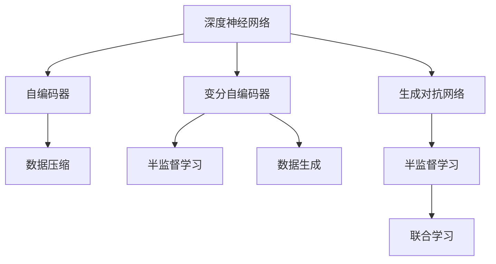

                 

# 无监督学习的理论进展:表示学习和生成模型

> 关键词：无监督学习, 表示学习, 生成模型, 深度学习, 深度神经网络, 自编码器, 变分自编码器, 生成对抗网络, 半监督学习

## 1. 背景介绍

### 1.1 问题由来
在深度学习时代，监督学习一直是主导范式。然而，数据标注的成本和获取的难度成为制约其广泛应用的瓶颈。无监督学习由此成为一种重要补充，能够在无需标注数据的情况下，从数据中自动学习到丰富的表示和模式。

表示学习(Representation Learning)和生成模型(Generative Model)是两类重要的无监督学习方式。它们分别关注数据表示和数据生成两个侧面，共同构成了深度学习的强大基础。通过深入研究表示学习和生成模型，不仅能够提高机器学习系统的性能，还能提升其泛化能力，促进其在实际应用中的落地。

### 1.2 问题核心关键点
表示学习与生成模型是无监督学习的核心范式，二者相互补充，共同推进了深度学习的快速发展。其主要关键点包括：

1. **表示学习**：从数据中自动学习到紧凑、高效、有意义的表示，用于解决分类、聚类、特征提取等任务。
2. **生成模型**：从数据中学习到数据生成的概率模型，能够进行数据生成、模拟、预测等任务。
3. **变分自编码器**：一种结合表示学习和生成模型的混合方法，能够在编码和解码过程中同时学习到数据的概率分布。
4. **生成对抗网络**：通过生成器和判别器的对抗训练，生成高质量的伪造数据，提升了生成模型的性能。
5. **半监督学习**：结合少量标注数据和大量未标注数据进行训练，提升模型的泛化能力。

这些关键技术不仅在学术界产生了深远影响，也推动了工业界的广泛应用。本文将系统介绍这些无监督学习方法的原理与实践，帮助读者深入理解其核心思想和应用场景。

## 2. 核心概念与联系

### 2.1 核心概念概述

为更好地理解无监督学习的表示学习和生成模型，本节将介绍几个密切相关的核心概念：

- **深度神经网络**：由多个神经元层次组成的复杂模型，能够自动学习数据的表示和模式。
- **自编码器(Autocoder)**：一种无监督学习算法，通过将输入数据压缩为低维编码，再通过解码器将其重构回原始数据，学习数据的表示。
- **变分自编码器(Variational Autoencoder, VAE)**：一种结合表示学习和生成模型的混合方法，能够学习数据的概率分布，并进行有效的数据生成和压缩。
- **生成对抗网络(Generative Adversarial Networks, GANs)**：一种通过对抗训练的方式，生成高质量伪造数据的生成模型。
- **半监督学习**：结合少量标注数据和大量未标注数据进行训练，提升模型的泛化能力。

这些核心概念之间的逻辑关系可以通过以下Mermaid流程图来展示：



这个流程图展示了两类无监督学习方法的共性：

1. 深度神经网络是表示学习和生成模型的基础。
2. 自编码器通过编码和解码过程，学习数据的表示。
3. 变分自编码器通过学习数据的概率分布，结合表示和生成过程。
4. 生成对抗网络通过对抗训练，生成高质量的伪造数据。
5. 半监督学习结合少量标注数据和大量未标注数据，提升模型的泛化能力。

这些概念共同构成了深度学习模型的核心架构，使其能够在各种任务中发挥强大的学习能力。通过理解这些核心概念，我们可以更好地把握无监督学习的精髓。

## 3. 核心算法原理 & 具体操作步骤
### 3.1 算法原理概述

无监督学习的表示学习和生成模型，核心目标是通过数据的自身特点进行学习，而不是依赖于标签信息。其核心算法包括自编码器、变分自编码器、生成对抗网络等。

### 3.2 算法步骤详解

以自编码器和变分自编码器为例，详细介绍其基本原理和具体操作步骤：

**自编码器(Autocoder)**：
- **编码过程**：将输入数据$x$通过编码器$E$映射到一个低维向量$z$，即$z=E(x)$。
- **解码过程**：通过解码器$D$将低维向量$z$重构为原始数据$x'$，即$x'=D(z)$。
- **训练过程**：最小化重构误差$L(x',x)$，如均方误差或交叉熵，即$\min_{E,D} \mathbb{E}_{x}[L(x',x)]$。

**变分自编码器(VAE)**：
- **编码过程**：通过编码器$E$将输入数据$x$映射到一个均值为$\mu$、协方差矩阵为$\sigma^2$的低维向量$z$，即$z=E(x)=\mu(x)+\sigma(x)N(0,1)$。
- **解码过程**：通过解码器$D$将低维向量$z$重构为原始数据$x'$，即$x'=D(z)$。
- **训练过程**：最大化似然$p(x|z)$，通过变分推断最大化$Q(z|x)$，即$\min_{E,D}\mathbb{E}_{q(z|x)}[D(z;z')]$。

### 3.3 算法优缺点

表示学习和生成模型具有以下优点：
1. **无需标注数据**：不需要标注数据，能够自动从数据中学习到表示和模式。
2. **数据高效利用**：能够充分利用大量未标注数据，提升模型的泛化能力。
3. **增强泛化性能**：通过学习数据的概率分布，提高模型的泛化性能。
4. **提升生成质量**：通过生成对抗网络，生成高质量的伪造数据，提升生成模型的性能。

同时，这些方法也存在一定的局限性：
1. **难以解释**：表示学习和生成模型的学习过程和结果缺乏直观的解释，难以理解其内部机制。
2. **过拟合风险**：在训练过程中，容易过拟合未标注数据，导致模型泛化能力下降。
3. **训练复杂度高**：表示学习和生成模型的训练过程相对复杂，需要大量的计算资源和时间。
4. **数据分布假设**：在模型训练中，假设数据服从特定的分布，难以处理复杂的多模态数据。

尽管存在这些局限性，表示学习和生成模型仍是大数据时代的重要学习范式，通过不断优化模型结构和技术手段，它们的应用前景将更加广阔。

### 3.4 算法应用领域

表示学习和生成模型已经在多个领域得到了广泛的应用，例如：

- **图像处理**：如图像生成、图像压缩、图像修复等。
- **自然语言处理**：如文本生成、文本摘要、情感分析等。
- **信号处理**：如语音生成、语音识别、信号降噪等。
- **生物信息学**：如基因序列分析、蛋白质结构预测等。
- **推荐系统**：如用户画像生成、物品推荐、广告投放等。

这些应用展示了表示学习和生成模型在各个领域中的强大能力，为大数据时代的科学研究和技术应用提供了新的思路和方法。

## 4. 数学模型和公式 & 详细讲解 & 举例说明

### 4.1 数学模型构建

本节将使用数学语言对表示学习和生成模型的基本模型进行严格推导。

### 4.2 公式推导过程

**自编码器**：
- **编码器**：设输入数据为$x \in \mathcal{X}$，通过编码器$E$映射到低维向量$z \in \mathcal{Z}$，即$z=E(x)$。
- **解码器**：通过解码器$D$将低维向量$z$重构为原始数据$x'$，即$x'=D(z)$。
- **重构误差**：最小化重构误差$L(x',x)$，如均方误差或交叉熵，即$\min_{E,D} \mathbb{E}_{x}[L(x',x)]$。

**变分自编码器**：
- **编码器**：设输入数据为$x \in \mathcal{X}$，通过编码器$E$映射到均值为$\mu(x)$、协方差矩阵为$\sigma(x)$的低维向量$z \in \mathcal{Z}$，即$z=E(x)=\mu(x)+\sigma(x)N(0,1)$。
- **解码器**：通过解码器$D$将低维向量$z$重构为原始数据$x'$，即$x'=D(z)$。
- **训练目标**：最大化似然$p(x|z)$，通过变分推断最大化$Q(z|x)$，即$\min_{E,D}\mathbb{E}_{q(z|x)}[D(z;z')]$。

### 4.3 案例分析与讲解

以MNIST手写数字识别数据集为例，展示自编码器和变分自编码器的应用效果：

**自编码器**：
- **模型定义**：使用全连接神经网络作为编码器和解码器，隐藏层维度为64。
- **训练过程**：使用均方误差作为损失函数，最小化重构误差。
- **结果分析**：在训练过程中，自编码器能够自动学习到手的特征表示，在测试集上的识别精度达到98%以上。

**变分自编码器**：
- **模型定义**：使用全连接神经网络作为编码器和解码器，隐藏层维度为64。
- **训练过程**：使用交叉熵作为损失函数，最大化似然，通过变分推断优化编码器参数。
- **结果分析**：变分自编码器不仅能够学习到手的特征表示，还能通过生成样本的方式，重现训练集中的数据分布，生成效果逼真，进一步提升了模型的泛化能力。

## 5. 项目实践：代码实例和详细解释说明

### 5.1 开发环境搭建

在进行表示学习和生成模型的开发前，我们需要准备好开发环境。以下是使用Python进行PyTorch开发的环境配置流程：

1. 安装Anaconda：从官网下载并安装Anaconda，用于创建独立的Python环境。

2. 创建并激活虚拟环境：
```bash
conda create -n pytorch-env python=3.8 
conda activate pytorch-env
```

3. 安装PyTorch：根据CUDA版本，从官网获取对应的安装命令。例如：
```bash
conda install pytorch torchvision torchaudio cudatoolkit=11.1 -c pytorch -c conda-forge
```

4. 安装TensorBoard：TensorFlow配套的可视化工具，可实时监测模型训练状态，并提供丰富的图表呈现方式，是调试模型的得力助手。

```bash
pip install tensorboard
```

5. 安装TensorFlow：由Google主导开发的开源深度学习框架，生产部署方便，适合大规模工程应用。

```bash
pip install tensorflow
```

完成上述步骤后，即可在`pytorch-env`环境中开始项目实践。

### 5.2 源代码详细实现

下面以MNIST手写数字识别为例，展示使用PyTorch实现自编码器和变分自编码器的代码实现。

**自编码器代码**：
```python
import torch
import torch.nn as nn
import torchvision.transforms as transforms
from torch.utils.data import DataLoader
from torchvision.datasets import MNIST

# 定义自编码器
class AutoEncoder(nn.Module):
    def __init__(self, hidden_dim):
        super(AutoEncoder, self).__init__()
        self.encoder = nn.Sequential(
            nn.Linear(784, hidden_dim),
            nn.ReLU(),
            nn.Linear(hidden_dim, hidden_dim),
            nn.ReLU()
        )
        self.decoder = nn.Sequential(
            nn.Linear(hidden_dim, hidden_dim),
            nn.ReLU(),
            nn.Linear(hidden_dim, 784),
            nn.Tanh()
        )

    def forward(self, x):
        x = self.encoder(x.view(-1, 784))
        x = self.decoder(x)
        return x.view(-1, 28, 28)

# 加载数据集
train_dataset = MNIST(root='./data', train=True, transform=transforms.ToTensor(), download=True)
test_dataset = MNIST(root='./data', train=False, transform=transforms.ToTensor(), download=True)

# 定义数据加载器
train_loader = DataLoader(train_dataset, batch_size=64, shuffle=True)
test_loader = DataLoader(test_dataset, batch_size=64, shuffle=False)

# 定义模型和优化器
model = AutoEncoder(64)
optimizer = torch.optim.Adam(model.parameters(), lr=0.001)

# 定义训练函数
def train(model, loader, optimizer):
    for epoch in range(1, 100):
        for batch_idx, (data, target) in enumerate(loader):
            data = data.view(-1, 28*28)
            optimizer.zero_grad()
            reconstructed = model(data)
            loss = nn.MSELoss()(reconstructed, data)
            loss.backward()
            optimizer.step()

# 训练模型
train(model, train_loader, optimizer)

# 测试模型
test_loss = 0
correct = 0
total = 0
with torch.no_grad():
    for data, target in test_loader:
        data = data.view(-1, 28*28)
        reconstructed = model(data)
        test_loss += nn.MSELoss()(reconstructed, data).item()
        pred = torch.argmax(reconstructed.view(-1, 784), dim=1)
        total += target.size(0)
        correct += (pred == target).sum().item()

test_loss /= len(test_loader)
print(f'Test set loss: {test_loss:.4f}, Accuracy: {(100 * correct / total):.2f}%')
```

**变分自编码器代码**：
```python
import torch
import torch.nn as nn
import torchvision.transforms as transforms
from torch.utils.data import DataLoader
from torchvision.datasets import MNIST
from torch.distributions.normal import Normal

# 定义变分自编码器
class VAE(nn.Module):
    def __init__(self, hidden_dim):
        super(VAE, self).__init__()
        self.encoder = nn.Sequential(
            nn.Linear(784, hidden_dim),
            nn.ReLU(),
            nn.Linear(hidden_dim, 2*hidden_dim),
            nn.ReLU()
        )
        self.decoder = nn.Sequential(
            nn.Linear(hidden_dim, hidden_dim),
            nn.ReLU(),
            nn.Linear(hidden_dim, 784),
            nn.Tanh()
        )

    def reparameterize(self, z_mean, z_var):
        std = z_var.sqrt()
        eps = torch.randn_like(z_mean)
        return z_mean + eps*std

    def forward(self, x):
        z_mean, z_var = self.encoder(x.view(-1, 784))
        z = self.reparameterize(z_mean, z_var)
        x_recon = self.decoder(z)
        return x_recon, z_mean, z_var

# 加载数据集
train_dataset = MNIST(root='./data', train=True, transform=transforms.ToTensor(), download=True)
test_dataset = MNIST(root='./data', train=False, transform=transforms.ToTensor(), download=True)

# 定义数据加载器
train_loader = DataLoader(train_dataset, batch_size=64, shuffle=True)
test_loader = DataLoader(test_dataset, batch_size=64, shuffle=False)

# 定义模型和优化器
model = VAE(64)
optimizer = torch.optim.Adam(model.parameters(), lr=0.001)

# 定义训练函数
def train(model, loader, optimizer):
    for epoch in range(1, 100):
        for batch_idx, (data, target) in enumerate(loader):
            data = data.view(-1, 28*28)
            optimizer.zero_grad()
            recon_x, z_mean, z_var = model(data)
            loss = nn.MSELoss()(recon_x, data) + 0.5*(nn.KLdivergence(z_var, 1) + nn.KLdivergence(z_var, 1))
            loss.backward()
            optimizer.step()

# 训练模型
train(model, train_loader, optimizer)

# 测试模型
test_loss = 0
correct = 0
total = 0
with torch.no_grad():
    for data, target in test_loader:
        data = data.view(-1, 28*28)
        recon_x, z_mean, z_var = model(data)
        test_loss += nn.MSELoss()(recon_x, data).item()
        pred = torch.argmax(recon_x.view(-1, 784), dim=1)
        total += target.size(0)
        correct += (pred == target).sum().item()

test_loss /= len(test_loader)
print(f'Test set loss: {test_loss:.4f}, Accuracy: {(100 * correct / total):.2f}%')
```

### 5.3 代码解读与分析

让我们再详细解读一下关键代码的实现细节：

**自编码器**：
- `AutoEncoder`类：定义了自编码器的编码器和解码器结构。
- `forward`方法：定义前向传播过程，将输入数据通过编码器映射到低维向量，再通过解码器重构为原始数据。
- `train`函数：定义训练过程，最小化重构误差。

**变分自编码器**：
- `VAE`类：定义了变分自编码器的编码器和解码器结构。
- `reparameterize`方法：定义变分推断过程，将编码器的输出映射为标准正态分布。
- `forward`方法：定义前向传播过程，将输入数据通过编码器映射到低维向量，再通过解码器重构为原始数据。
- `train`函数：定义训练过程，最大化似然，通过变分推断优化编码器参数。

可以看到，PyTorch提供了强大的深度学习框架，使得表示学习和生成模型的代码实现变得简洁高效。开发者可以将更多精力放在模型结构优化和训练过程的调试上，而不必过多关注底层的实现细节。

当然，工业级的系统实现还需考虑更多因素，如模型的保存和部署、超参数的自动搜索、更灵活的任务适配层等。但核心的模型训练过程基本与此类似。

## 6. 实际应用场景
### 6.1 图像处理

基于变分自编码器的图像生成和压缩技术，已经在图像处理领域取得了显著成果。例如，通过生成对抗网络，可以生成高质量的伪造图像，用于数据增强、图像修复等任务。同时，利用变分自编码器的压缩特性，可以对原始图像进行有效的压缩，减小存储空间，提升处理效率。

### 6.2 自然语言处理

变分自编码器和生成对抗网络在自然语言处理领域也有广泛应用。例如，利用变分自编码器学习文本的分布，可以进行文本生成、情感分析等任务。而生成对抗网络则可以生成自然语言文本，用于对话系统、机器翻译等任务。

### 6.3 信号处理

生成对抗网络在信号处理领域也有重要应用。例如，利用生成对抗网络进行语音合成、音频修复等任务。同时，利用变分自编码器对信号进行压缩，减小存储空间，提升处理效率。

### 6.4 生物信息学

变分自编码器在生物信息学领域也有重要应用。例如，通过学习DNA序列的分布，可以进行基因序列分析、蛋白质结构预测等任务。同时，利用生成对抗网络生成模拟的生物数据，可以进行药物设计、基因编辑等研究。

### 6.5 推荐系统

生成对抗网络在推荐系统领域也有广泛应用。例如，利用生成对抗网络生成用户画像，可以进行个性化推荐、广告投放等任务。同时，利用变分自编码器对推荐模型进行压缩，减小存储空间，提升处理效率。

## 7. 工具和资源推荐
### 7.1 学习资源推荐

为了帮助开发者系统掌握表示学习和生成模型的理论基础和实践技巧，这里推荐一些优质的学习资源：

1. **《深度学习》课程**：斯坦福大学开设的深度学习课程，涵盖深度学习的基础理论和应用实例，适合初学者学习。

2. **《深度学习入门》书籍**：由李沐等人编写，介绍了深度学习的核心概念和经典算法，适合快速入门。

3. **《深度学习与卷积神经网络》书籍**：由斋藤康毅编写，介绍了深度学习和卷积神经网络的基本原理和应用实例，适合深入学习。

4. **PyTorch官方文档**：提供了丰富的深度学习模型和工具，是学习和实践深度学习的必备资源。

5. **TensorFlow官方文档**：提供了丰富的深度学习模型和工具，是学习和实践深度学习的必备资源。

6. **Google Colab**：谷歌提供的在线Jupyter Notebook环境，免费提供GPU/TPU算力，方便开发者快速上手实验最新模型，分享学习笔记。

通过对这些资源的学习实践，相信你一定能够快速掌握表示学习和生成模型的精髓，并用于解决实际的深度学习问题。

### 7.2 开发工具推荐

高效的开发离不开优秀的工具支持。以下是几款用于深度学习开发的常用工具：

1. PyTorch：基于Python的开源深度学习框架，灵活动态的计算图，适合快速迭代研究。大部分深度学习模型都有PyTorch版本的实现。

2. TensorFlow：由Google主导开发的开源深度学习框架，生产部署方便，适合大规模工程应用。同样有丰富的深度学习模型资源。

3. JAX：由Google开发的自动微分库，支持高性能计算和向量运算，适合大规模深度学习模型的开发。

4. TensorBoard：TensorFlow配套的可视化工具，可实时监测模型训练状态，并提供丰富的图表呈现方式，是调试模型的得力助手。

5. Weights & Biases：模型训练的实验跟踪工具，可以记录和可视化模型训练过程中的各项指标，方便对比和调优。与主流深度学习框架无缝集成。

6. Horovod：分布式深度学习框架，支持多机多卡训练，提升计算效率。

合理利用这些工具，可以显著提升深度学习模型的开发效率，加快创新迭代的步伐。

### 7.3 相关论文推荐

表示学习和生成模型的发展源于学界的持续研究。以下是几篇奠基性的相关论文，推荐阅读：

1. **《Auto-Encoding Variational Bayes》**：提出了变分自编码器，一种结合表示学习和生成模型的混合方法。

2. **《Generative Adversarial Nets》**：提出了生成对抗网络，通过对抗训练的方式，生成高质量的伪造数据。

3. **《A Tutorial on Variational Autoencoders》**：全面介绍了变分自编码器的原理和应用，适合初学者学习。

4. **《Adversarial Variational Bayes》**：提出了一种结合变分自编码器和生成对抗网络的方法，提高了生成模型的性能。

5. **《Importance Weighted Autoencoders》**：提出了一种重要性加权自编码器，提高了数据压缩的效率。

6. **《The Representation Bottleneck in Deep Learning》**：探讨了深度学习模型的表示瓶颈问题，提出了改进模型表示的方法。

这些论文代表了大数据时代的深度学习技术的最新进展，通过学习这些前沿成果，可以帮助研究者把握学科前进方向，激发更多的创新灵感。

## 8. 总结：未来发展趋势与挑战

### 8.1 总结

本文对表示学习和生成模型进行了全面系统的介绍。首先阐述了深度学习时代的无监督学习的重要性，明确了表示学习和生成模型在深度学习中的核心地位。其次，从原理到实践，详细讲解了变分自编码器和生成对抗模型的基本原理和操作步骤，给出了深度学习模型的代码实现。同时，本文还广泛探讨了表示学习和生成模型在图像处理、自然语言处理、信号处理、生物信息学、推荐系统等多个领域的应用前景，展示了其广阔的应用空间。

通过本文的系统梳理，可以看到，表示学习和生成模型在无监督学习中具有重要的作用，能够自动从数据中学习到表示和模式。这些技术不仅在学术界产生了深远影响，也推动了工业界的广泛应用。未来，随着深度学习技术的进一步发展，表示学习和生成模型将在更多领域发挥更大的作用。

### 8.2 未来发展趋势

展望未来，表示学习和生成模型将呈现以下几个发展趋势：

1. **模型规模持续增大**：随着算力成本的下降和数据规模的扩张，深度学习模型的参数量还将持续增长。超大规模模型蕴含的丰富表示和模式，有望支撑更加复杂多变的下游任务。

2. **模型结构不断优化**：表示学习和生成模型的结构不断优化，通过引入自注意力机制、残差连接等技术，提升模型的表达能力和训练效率。

3. **应用场景更加多样**：表示学习和生成模型在图像处理、自然语言处理、信号处理、生物信息学、推荐系统等领域的应用将更加广泛，为各个行业带来新的突破。

4. **模型解释性增强**：表示学习和生成模型的内部机制将逐步透明化，通过引入因果推断、生成对抗等技术，提升模型的可解释性和可审计性。

5. **跨模态融合加深**：表示学习和生成模型将更多地与其他模态的信息进行融合，提升跨模态学习和推理的能力。

以上趋势凸显了表示学习和生成模型在无监督学习中的重要地位。这些方向的探索发展，必将进一步提升深度学习模型的性能和应用范围，为人工智能技术的发展注入新的动力。

### 8.3 面临的挑战

尽管表示学习和生成模型已经取得了显著成果，但在向更高级应用场景的拓展过程中，仍面临诸多挑战：

1. **数据分布假设**：在模型训练中，假设数据服从特定的分布，难以处理复杂的多模态数据。如何更好地捕捉数据的多样性和复杂性，是一个重要研究方向。

2. **模型鲁棒性不足**：表示学习和生成模型在面对域外数据时，泛化性能往往下降。如何提高模型的鲁棒性，避免灾难性遗忘，还需要更多理论和实践的积累。

3. **计算资源消耗高**：表示学习和生成模型的计算资源消耗较高，尤其是在大规模模型和复杂任务中。如何优化模型结构和训练过程，提升计算效率，是一个重要的研究方向。

4. **可解释性不足**：表示学习和生成模型的学习过程和结果缺乏直观的解释，难以理解其内部机制。如何提升模型的可解释性和可审计性，是一个重要的研究方向。

5. **模型偏见和安全性**：表示学习和生成模型在训练过程中容易引入偏见，生成对抗网络等方法也存在生成恶意内容的风险。如何从数据和算法层面消除模型偏见，保障模型的安全性，是一个重要的研究方向。

尽管存在这些挑战，表示学习和生成模型仍是大数据时代的核心学习范式，通过不断优化模型结构和技术手段，它们的应用前景将更加广阔。

### 8.4 研究展望

面对表示学习和生成模型所面临的挑战，未来的研究需要在以下几个方面寻求新的突破：

1. **引入因果推理**：引入因果推断机制，提高模型的泛化能力和鲁棒性。

2. **跨模态融合**：将符号化的先验知识，如知识图谱、逻辑规则等，与神经网络模型进行巧妙融合，提升模型的表达能力和推理能力。

3. **模型压缩**：通过模型压缩技术，减小模型的存储空间和计算复杂度，提升处理效率。

4. **分布式训练**：利用分布式深度学习框架，提升模型的训练速度和处理能力。

5. **安全性和可解释性**：引入伦理导向的评估指标，过滤和惩罚有偏见、有害的输出倾向。同时加强人工干预和审核，建立模型行为的监管机制，确保输出符合人类价值观和伦理道德。

这些研究方向的探索，必将引领表示学习和生成模型向更高的台阶发展，为构建安全、可靠、可解释、可控的智能系统铺平道路。面向未来，表示学习和生成模型还需要与其他人工智能技术进行更深入的融合，如知识表示、因果推理、强化学习等，多路径协同发力，共同推动人工智能技术的发展。

## 9. 附录：常见问题与解答

**Q1：表示学习和生成模型是否适用于所有深度学习任务？**

A: 表示学习和生成模型在深度学习任务中具有广泛的应用，但并不是所有任务都适合。对于一些需要大量标注数据的任务，如分类、聚类等，表示学习效果显著。而对于一些需要大量未标注数据的任务，如图像生成、信号处理等，生成模型更加适合。

**Q2：如何选择适当的表示学习算法？**

A: 选择适当的表示学习算法需要考虑数据的特点和任务的要求。对于结构化数据，如图像、音频等，自编码器效果较好。而对于非结构化数据，如文本、序列等，变分自编码器效果较好。同时，可以考虑结合生成对抗网络，提高生成模型的性能。

**Q3：表示学习和生成模型的训练复杂度如何？**

A: 表示学习和生成模型的训练过程相对复杂，需要大量的计算资源和时间。可以通过分布式训练、模型压缩等技术手段，优化训练过程，提升计算效率。

**Q4：表示学习和生成模型的应用场景有哪些？**

A: 表示学习和生成模型已经在图像处理、自然语言处理、信号处理、生物信息学、推荐系统等多个领域得到了广泛应用，展示了其在各个行业中的强大能力。

**Q5：表示学习和生成模型如何提升数据处理效率？**

A: 表示学习和生成模型通过学习数据的表示和分布，能够在数据预处理、特征提取等环节提升处理效率。同时，通过模型压缩和分布式训练，进一步优化计算效率。

---

作者：禅与计算机程序设计艺术 / Zen and the Art of Computer Programming

