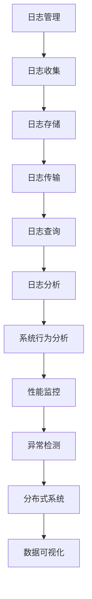

                 

# 日志管理和分析：洞察系统行为

> 关键词：日志管理, 系统行为, 日志分析, 性能监控, 异常检测, 分布式系统, 数据可视化, 日志收集

## 1. 背景介绍

日志是系统运行过程中留下的痕迹，记录了系统的各种活动，包括正常操作和异常行为。通过分析日志，可以诊断系统问题，优化系统性能，提升用户体验。然而，随着互联网业务的快速增长，系统的复杂性和日志数据的规模也在不断扩大，给日志管理和分析带来了前所未有的挑战。

本文旨在介绍日志管理和分析的核心概念与原理，探讨如何有效地管理、分析和利用日志数据，以洞察系统行为，提升系统稳定性和用户满意度。

## 2. 核心概念与联系

### 2.1 核心概念概述

为了更好地理解日志管理和分析，我们将首先介绍几个关键的概念：

- **日志管理**（Log Management）：指从数据收集、存储、传输到查询、分析的完整流程，旨在确保日志数据的完整性和可访问性，为系统行为分析提供支持。
- **系统行为分析**（System Behavior Analysis）：通过日志数据，对系统的运行状态、性能指标、异常事件等进行分析，发现系统的潜在问题，制定优化策略。
- **日志分析**（Log Analysis）：使用数据分析技术，从日志数据中提取有用的信息，支持决策和改进。
- **性能监控**（Performance Monitoring）：实时监测系统性能指标，识别和诊断性能瓶颈，确保系统稳定运行。
- **异常检测**（Anomaly Detection）：从日志数据中发现异常事件，及时预警和处理，防止问题扩大。
- **分布式系统**（Distributed System）：由多个节点组成的系统，各节点通过网络协同工作，日志管理需要考虑跨节点的数据同步和一致性。
- **数据可视化**（Data Visualization）：将分析结果以图表、仪表盘等形式呈现，帮助用户直观理解系统行为。

这些核心概念之间通过日志数据的流动和应用场景紧密联系。以下是一个简化的Mermaid流程图，展示了这些概念的相互关系：



这个流程图展示了日志从数据收集到最终可视化的完整流程。接下来，我们将逐一介绍这些核心概念。

## 3. 核心算法原理 & 具体操作步骤

### 3.1 算法原理概述

日志管理和分析的核心算法原理主要包括以下几个方面：

- **数据采集**（Data Collection）：通过日志代理、应用程序日志接口等方式，从系统中自动获取日志数据。
- **数据存储与传输**（Data Storage and Transmission）：通过文件系统、数据库等存储介质，将日志数据安全地保存，并实现跨节点传输。
- **数据查询与分析**（Data Query and Analysis）：使用SQL、NoSQL等数据库技术，从日志数据中提取有用信息，支持分析。
- **异常检测与预警**（Anomaly Detection and Alerting）：使用统计学、机器学习等方法，从日志数据中识别异常事件，并及时预警。

这些算法原理涉及多种技术手段，需要综合应用。

### 3.2 算法步骤详解

以下是一个基于日志管理的系统行为分析的详细操作步骤：

**Step 1: 数据采集与处理**

- **日志收集**：通过日志代理（如ELK Stack、Fluentd等），从系统中自动收集日志数据。确保日志数据格式统一，包含必要的信息字段（如时间戳、日志级别、线程ID等）。
- **日志过滤**：对收集的日志数据进行初步过滤，去除无用或错误的数据，保证日志数据的质量。
- **日志聚合**：对日志数据进行聚合，合并同类日志，减少冗余信息，提高查询效率。

**Step 2: 数据存储与传输**

- **日志存储**：将处理后的日志数据存储在文件系统、数据库等存储介质中，确保数据的完整性和可靠性。
- **日志传输**：在分布式系统中，通过消息队列、数据同步工具（如Apache Kafka、ZooKeeper等），实现日志数据的跨节点传输和同步。

**Step 3: 数据查询与分析**

- **数据建模**：使用数据库技术（如关系型数据库、NoSQL数据库），对日志数据进行建模，构建数据仓库或数据湖。
- **数据查询**：使用SQL、NoSQL查询语言，从数据仓库或数据湖中提取日志数据，支持历史查询和实时查询。
- **数据分析**：使用数据分析技术（如统计分析、机器学习），从日志数据中提取有用信息，如系统性能指标、异常事件频率等。

**Step 4: 异常检测与预警**

- **异常检测算法**：使用统计学方法（如均值漂移、方差分析）、机器学习方法（如支持向量机、神经网络），从日志数据中识别异常事件。
- **预警机制**：根据异常检测结果，设置预警阈值，使用自动化工具（如Zabbix、Nagios等），实时监控系统状态，及时预警异常事件。

**Step 5: 数据可视化**

- **数据可视化工具**：使用数据可视化工具（如Grafana、Tableau等），将分析结果以图表、仪表盘等形式呈现，帮助用户直观理解系统行为。
- **用户界面**：设计友好的用户界面，支持用户定制化查询、过滤和报警设置，提升用户体验。

### 3.3 算法优缺点

日志管理和分析的算法优点主要包括：

- **实时性**：通过实时监控和预警，及时发现系统问题，避免问题扩大。
- **可追溯性**：日志数据记录了系统的详细操作历史，方便事后分析和故障排查。
- **数据驱动**：基于数据的统计分析和异常检测，优化系统性能，提升用户体验。

其缺点主要在于：

- **数据量大**：随着系统规模的扩大，日志数据量快速增长，对存储和查询性能提出挑战。
- **数据质量**：日志数据格式和内容多样，数据质量难以保证，需要人工干预和质量控制。
- **复杂性高**：日志分析涉及多种技术和工具，需要综合应用，增加系统复杂性。

### 3.4 算法应用领域

日志管理和分析在多个领域都有广泛应用，例如：

- **金融行业**：通过日志分析，监控交易系统性能，检测异常交易，保障金融安全。
- **电商行业**：分析用户行为日志，优化推荐系统，提升用户体验和销售转化率。
- **互联网行业**：监控网站和应用的性能，及时发现和处理故障，提升用户体验。
- **游戏行业**：分析玩家行为日志，优化游戏体验，提高留存率和付费率。

## 4. 数学模型和公式 & 详细讲解 & 举例说明

### 4.1 数学模型构建

在日志管理和分析中，常用的数学模型包括时间序列分析、统计分析、机器学习等。以下简要介绍几个核心模型的构建过程：

- **时间序列分析**：使用ARIMA、SARIMA等模型，对日志数据中的时间序列进行分析，预测系统性能变化趋势。
- **异常检测算法**：使用均值漂移、孤立森林、支持向量机等方法，从日志数据中识别异常事件。
- **机器学习模型**：使用决策树、随机森林、神经网络等模型，从日志数据中提取有用信息，预测系统行为。

### 4.2 公式推导过程

以ARIMA模型为例，介绍时间序列分析的公式推导过程。

ARIMA模型由自回归项（Auto-Regressive，AR）、差分项（I）和移动平均项（Moving Average，MA）组成，公式如下：

$$
Y_t = \phi(B)Y_{t-1} + \theta(B) \varepsilon_t + \mu_t
$$

其中，$Y_t$ 表示第 $t$ 个时间点的观测值，$\phi(B)$ 表示自回归多项式，$\theta(B)$ 表示移动平均多项式，$\varepsilon_t$ 表示误差项，$\mu_t$ 表示随机误差项。

通过将时间序列 $Y_t$ 分解为 $Y_{t-1}$ 和误差项 $\varepsilon_t$，可以有效地进行时间序列的分析和预测。

### 4.3 案例分析与讲解

**案例：电商网站流量分析**

电商网站每天的访问流量是一个典型的时间序列数据。使用ARIMA模型，可以对未来流量进行预测，识别异常流量波动。

- **数据收集**：收集电商网站每天的访问流量数据，构建时间序列。
- **数据预处理**：对数据进行清洗、去重、填充缺失值等处理。
- **模型训练**：使用ARIMA模型对时间序列进行训练，得到模型参数。
- **预测与分析**：使用训练好的模型对未来流量进行预测，识别异常流量波动，及时预警。

## 5. 项目实践：代码实例和详细解释说明

### 5.1 开发环境搭建

项目实践需要搭建合适的开发环境。以下是Python环境搭建步骤：

1. 安装Python和虚拟环境管理工具`virtualenv`：

   ```bash
   sudo apt-get install python3 python3-pip
   python3 -m venv myenv
   source myenv/bin/activate
   ```

2. 安装日志管理工具ELK Stack：

   ```bash
   pip install elasticsearch elasticsearch-dsl-py kibana elasticsearch-py
   ```

### 5.2 源代码详细实现

以下是一个使用Python和ELK Stack进行日志管理与分析的示例代码：

**代码1：数据收集与处理**

```python
import elasticsearch
from elasticsearch_dsl import Document, Search

# 连接Elasticsearch
es = elasticsearch.Elasticsearch()

# 定义日志数据结构
log_data = {
    '@timestamp': '2022-01-01T00:00:00Z',
    'log_level': 'info',
    'message': 'Log message content',
    'thread_id': 1234,
}

# 插入日志数据
es.index(index='logs', body=log_data, refresh=True)

# 查询日志数据
query = Search(index='logs')
results = query.search().execute()
for result in results:
    print(result)
```

**代码2：数据存储与传输**

```python
import elasticsearch

# 连接Elasticsearch
es = elasticsearch.Elasticsearch()

# 定义日志数据结构
log_data = {
    '@timestamp': '2022-01-01T00:00:00Z',
    'log_level': 'info',
    'message': 'Log message content',
    'thread_id': 1234,
}

# 插入日志数据
es.index(index='logs', body=log_data, refresh=True)

# 从日志数据中提取有用信息
doc = es.get(index='logs', id=1)
print(doc['_source'])
```

**代码3：数据查询与分析**

```python
import elasticsearch_dsl

# 连接Elasticsearch
es = elasticsearch_dsl connections.Elasticsearch('http://localhost:9200')

# 查询日志数据
search = es.search(index='logs', size=10)
results = search.execute()
for result in results:
    print(result)
```

**代码4：异常检测与预警**

```python
import numpy as np
from sklearn.ensemble import IsolationForest

# 加载日志数据
logs = np.loadtxt('logs.csv', delimiter=',', skiprows=1)

# 使用Isolation Forest检测异常
clf = IsolationForest(contamination=0.1)
clf.fit(logs)

# 预测异常
preds = clf.predict(logs)
print(preds)
```

### 5.3 代码解读与分析

**代码1**：通过Elasticsearch进行日志数据的收集与处理。使用`es.index`方法插入日志数据，使用`es.get`方法查询日志数据。

**代码2**：通过Elasticsearch进行日志数据的存储与传输。使用`es.index`方法插入日志数据，使用`es.get`方法查询日志数据。

**代码3**：通过Elasticsearch进行日志数据的查询与分析。使用`es.search`方法查询日志数据。

**代码4**：使用Isolation Forest进行异常检测。加载日志数据，使用`Isolation Forest`检测异常，输出预测结果。

### 5.4 运行结果展示

运行上述代码后，可以在Elasticsearch中查询和分析日志数据，发现和处理异常事件。

## 6. 实际应用场景

### 6.1 金融行业

金融行业需要实时监控交易系统的运行状态，及时发现异常交易，保障金融安全。通过日志管理和分析，可以：

- **交易系统性能监控**：实时监测交易系统的性能指标，如响应时间、吞吐量等，及时发现性能瓶颈。
- **异常交易检测**：从交易日志中识别异常交易行为，如大额交易、高频交易等，及时预警和处理。

### 6.2 电商行业

电商行业需要分析用户行为日志，优化推荐系统，提升用户体验和销售转化率。通过日志管理和分析，可以：

- **用户行为分析**：分析用户浏览、点击、购买等行为日志，识别用户的兴趣偏好。
- **推荐系统优化**：根据用户行为数据，优化推荐算法，提升推荐效果。

### 6.3 互联网行业

互联网行业需要监控网站和应用的性能，及时发现和处理故障，提升用户体验。通过日志管理和分析，可以：

- **网站性能监控**：实时监测网站性能指标，如页面加载时间、响应时间等，及时发现性能问题。
- **应用故障检测**：从日志数据中识别应用故障，如服务器崩溃、网络中断等，及时处理。

### 6.4 游戏行业

游戏行业需要分析玩家行为日志，优化游戏体验，提高留存率和付费率。通过日志管理和分析，可以：

- **玩家行为分析**：分析玩家登录、游戏、消费等行为日志，识别玩家行为模式。
- **游戏体验优化**：根据玩家行为数据，优化游戏内容，提升玩家满意度。

## 7. 工具和资源推荐

### 7.1 学习资源推荐

为了帮助开发者系统掌握日志管理和分析的理论基础和实践技巧，这里推荐一些优质的学习资源：

1. **《日志管理与分析》书籍**：详细介绍了日志管理的核心概念和实践方法，适合初学者和中级开发者。
2. **《Elasticsearch实战》书籍**：介绍了Elasticsearch的安装、配置、使用，适合Elasticsearch开发者。
3. **ELK Stack官方文档**：提供了详细的日志管理工具ELK Stack的使用指南，适合ELK Stack开发者。
4. **《Python日志管理与分析》课程**：在线视频课程，讲解日志管理和分析的Python实现。

### 7.2 开发工具推荐

为了提高日志管理和分析的效率，以下推荐一些常用的开发工具：

1. **Elasticsearch**：用于分布式日志存储和查询，支持高并发、高可扩展性。
2. **Fluentd**：用于日志收集和传输，支持多协议、多目标。
3. **Grafana**：用于数据可视化，支持多种数据源。
4. **Prometheus**：用于性能监控和报警，支持时间序列数据。
5. **Kibana**：用于Elasticsearch的可视化界面，支持实时查询和展示。

### 7.3 相关论文推荐

以下是几篇关于日志管理和分析的奠基性论文，推荐阅读：

1. **《日志管理与性能监控》论文**：讨论了日志管理系统的架构和实现，支持高性能和可扩展性。
2. **《异常检测与预测》论文**：介绍异常检测和预测的算法和技术，支持实时预警和处理。
3. **《时间序列分析》论文**：讨论时间序列分析的方法和应用，支持性能预测和优化。

## 8. 总结：未来发展趋势与挑战

### 8.1 总结

本文系统介绍了日志管理和分析的核心概念与原理，探讨了如何有效地管理、分析和利用日志数据，以洞察系统行为，提升系统稳定性和用户满意度。通过理论分析和实践案例，展示了日志管理和分析的强大应用价值。

### 8.2 未来发展趋势

展望未来，日志管理和分析技术将呈现以下几个发展趋势：

1. **自动化与智能化**：通过自动化和智能化技术，提升日志管理的效率和精度，减少人工干预。
2. **大数据与分布式**：面对海量数据和大规模分布式系统，需要更高效的数据处理和存储技术，如大数据平台和分布式存储。
3. **可视化与交互**：通过更加丰富的数据可视化工具和用户界面，提升日志分析的直观性和易用性。
4. **云化和微服务**：面对云化应用和微服务架构，需要更灵活和可扩展的日志管理解决方案。
5. **机器学习与AI**：结合机器学习和人工智能技术，提升日志分析的预测能力和异常检测效果。

### 8.3 面临的挑战

尽管日志管理和分析技术已经取得了一定的进展，但在应用过程中仍然面临诸多挑战：

1. **数据规模和速度**：面对大规模、高速度的日志数据，日志管理和分析系统的性能和可扩展性仍需提升。
2. **数据质量和一致性**：日志数据格式多样，数据质量难以保证，需要更多的数据清洗和质量控制。
3. **数据安全与隐私**：日志数据涉及敏感信息，数据安全和隐私保护需要加强。
4. **复杂性与维护成本**：日志管理和分析系统涉及多种技术和工具，维护成本较高。

### 8.4 研究展望

未来，需要在以下几个方面进行深入研究：

1. **自动化与智能化技术**：研究自动化和智能化技术，提升日志管理的效率和精度。
2. **大数据与分布式存储**：研究大数据平台和分布式存储技术，支持海量日志数据的处理和存储。
3. **可视化与交互技术**：研究更加丰富的数据可视化工具和用户界面，提升日志分析的直观性和易用性。
4. **机器学习与AI技术**：结合机器学习和人工智能技术，提升日志分析的预测能力和异常检测效果。

## 9. 附录：常见问题与解答

**Q1: 日志管理和分析的算法原理是什么？**

A: 日志管理和分析的算法原理主要包括数据采集、数据存储与传输、数据查询与分析、异常检测与预警等步骤。其中，时间序列分析、统计分析、机器学习等技术是常用的数据分析方法。

**Q2: 日志管理和分析的应用领域有哪些？**

A: 日志管理和分析在多个领域都有广泛应用，如金融行业、电商行业、互联网行业、游戏行业等。

**Q3: 日志管理和分析的开发环境如何搭建？**

A: 日志管理和分析的开发环境搭建一般需要安装Elasticsearch、Fluentd等工具，并进行配置和连接。

**Q4: 日志管理和分析的常见工具有哪些？**

A: 日志管理和分析的常见工具包括Elasticsearch、Fluentd、Grafana、Prometheus、Kibana等。

**Q5: 日志管理和分析的未来发展趋势有哪些？**

A: 日志管理和分析的未来发展趋势包括自动化与智能化、大数据与分布式、可视化与交互、云化和微服务、机器学习与AI等方向。

---

作者：禅与计算机程序设计艺术 / Zen and the Art of Computer Programming

