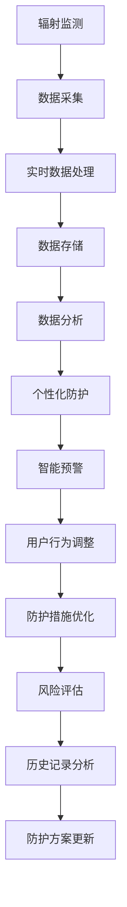

                 

# 智能个人辐射监测创业：日常生活的健康防护

## 1. 背景介绍

### 1.1 问题由来
随着科技的快速发展和生活方式的改变，人们越来越关注个人健康问题。在数字化和智能化的今天，如何通过技术手段实时监测个人健康状态，成为越来越多人关注的焦点。特别是在辐射环境下的个人健康监测，由于其隐秘性和长期性，更是一个亟需解决的问题。

### 1.2 问题核心关键点
本项目旨在开发一款智能个人辐射监测系统，该系统能够实时监测个人在日常生活中的辐射暴露情况，及时预警潜在风险，并提供个性化的防护建议。其核心关键点包括：

- **实时监测**：系统能够24小时不间断监测辐射暴露情况，及时发出警报。
- **精准防护**：根据辐射水平，系统提供科学的防护建议，如调整活动时间、增减防护措施等。
- **个性化定制**：系统根据用户的性别、年龄、健康状况等因素，提供量身定制的防护方案。
- **智能化预警**：系统基于学习算法，能够识别辐射暴露趋势，提前预警高风险环境。
- **数据记录与分析**：系统记录用户的辐射暴露数据，提供历史数据查询和分析，帮助用户了解长期暴露情况。

### 1.3 问题研究意义
本项目的研究和开发，具有以下几方面的重要意义：

1. **健康保护**：实时监测和预警，帮助用户避免长期暴露在辐射环境中，保护身体健康。
2. **风险评估**：提供科学的辐射暴露评估，使用户了解自身风险等级，合理调整行为。
3. **智慧生活**：将智能技术融入日常生活，提升生活质量，推动健康科技的发展。
4. **数据应用**：收集大量数据，应用于科学研究，为辐射防护政策制定提供依据。
5. **创业机会**：基于技术的创业项目，有助于推动社会对健康防护意识的提升，带动相关产业发展。

## 2. 核心概念与联系

### 2.1 核心概念概述

为更好地理解智能个人辐射监测系统的实现机制，本节将介绍几个关键概念及其联系：

- **辐射监测**：指通过传感器等设备，实时监测辐射水平的过程。辐射包括电离辐射和非电离辐射，如X射线、伽马射线、紫外线等。
- **个人健康监测**：利用智能设备和软件，实时记录和分析用户的健康状况，提供个性化的防护建议。
- **智能预警系统**：基于机器学习等技术，对用户数据进行分析和预测，及时预警潜在风险。
- **自适应防护算法**：根据用户行为和环境变化，动态调整防护措施，确保最大化保护用户健康。
- **大数据分析**：收集大量用户数据，进行分析统计，评估辐射暴露情况，优化防护方案。

这些概念之间的逻辑关系可以通过以下Mermaid流程图来展示：



这个流程图展示了辐射监测系统的核心流程：

1. 通过传感器采集辐射数据。
2. 对数据进行实时处理，计算辐射水平。
3. 存储数据，便于后续分析和查询。
4. 分析数据，评估辐射暴露情况。
5. 根据评估结果，提供个性化的防护建议。
6. 基于预警系统，实时提醒用户调整行为。
7. 根据用户反馈，动态优化防护措施。
8. 记录历史数据，提供长期分析。
9. 不断更新防护方案，提高防护效果。

这些概念共同构成了智能个人辐射监测系统的整体框架，通过技术的融合和优化，确保用户能够获得及时的辐射暴露预警和个性化的健康防护。

## 3. 核心算法原理 & 具体操作步骤
### 3.1 算法原理概述

智能个人辐射监测系统的核心算法原理，基于实时数据监测和机器学习技术的结合。其核心思想是：通过传感器采集辐射数据，利用机器学习模型对数据进行分析和预测，实时生成防护建议和预警信息。

具体而言，系统分为以下几个主要部分：

1. **数据采集与处理**：通过各类传感器（如辐射计、剂量计），实时采集辐射水平数据，并进行预处理。
2. **数据分析与预测**：利用机器学习算法，如回归、分类、聚类等，对数据进行分析，预测辐射暴露情况。
3. **智能预警与防护**：根据分析结果，生成实时预警信息，并结合用户行为数据，提供个性化的防护建议。
4. **用户行为优化**：基于预警信息和防护建议，用户调整自身行为，如改变出行时间、增加防护措施等。
5. **数据记录与分析**：记录用户历史数据，进行长期分析，评估辐射暴露趋势，优化防护方案。

### 3.2 算法步骤详解

智能个人辐射监测系统的实现步骤如下：

**Step 1: 数据采集与预处理**
- 部署辐射传感器，实时采集辐射数据。
- 对采集到的数据进行清洗、滤波、归一化等预处理操作，确保数据质量。

**Step 2: 数据分析与预测**
- 使用机器学习算法，如回归、分类、聚类等，对预处理后的数据进行分析，预测辐射暴露水平。
- 结合时间序列分析，识别辐射暴露趋势和周期性变化。
- 引入深度学习模型，如CNN、RNN等，进行辐射暴露的预测和趋势分析。

**Step 3: 智能预警与防护**
- 根据分析结果，实时生成辐射暴露预警信息，提醒用户注意防护。
- 结合用户行为数据，如出行轨迹、活动时间等，提供个性化的防护建议。
- 动态调整防护措施，如改变出行时间、增减防护设备等。

**Step 4: 用户行为优化**
- 收集用户反馈，评估防护建议的有效性。
- 动态优化防护措施，确保用户健康最大化。
- 定期评估用户防护效果，提供科学的防护建议。

**Step 5: 数据记录与分析**
- 记录用户历史数据，进行长期分析，评估辐射暴露趋势。
- 提供历史数据分析工具，帮助用户了解长期暴露情况。
- 定期更新防护方案，提升防护效果。

### 3.3 算法优缺点

智能个人辐射监测系统的算法具有以下优点：

1. **实时性**：通过实时监测和分析，系统能够快速响应辐射变化，及时预警潜在风险。
2. **准确性**：结合机器学习和深度学习技术，预测结果准确可靠，防护建议科学有效。
3. **个性化**：根据用户行为和健康状况，提供量身定制的防护方案，提高防护效果。
4. **智能化**：通过学习用户行为和环境变化，动态调整防护措施，适应不同情境。
5. **可扩展性**：系统支持多种传感器数据接入，能够适应多种环境变化。

同时，该算法也存在以下局限性：

1. **数据质量依赖**：系统依赖高质量的传感器数据，数据采集和处理需严格控制。
2. **模型复杂度**：深度学习模型需要大量数据进行训练，模型复杂度较高，计算资源消耗较大。
3. **隐私保护**：系统需严格保护用户数据隐私，避免数据泄露和滥用。
4. **技术门槛高**：开发和维护需要较强的技术背景，对技术人员要求较高。
5. **环境适应性**：系统需针对不同环境和辐射源进行适应性优化。

尽管存在这些局限性，但就目前而言，智能个人辐射监测系统的算法框架和实施步骤，已经较为成熟，具备广泛的应用前景。未来相关研究的主要方向在于进一步提升数据质量、降低模型复杂度、保护用户隐私、优化技术接口等。

### 3.4 算法应用领域

智能个人辐射监测系统的算法，不仅适用于日常生活中的辐射监测，还具备以下几方面的应用领域：

1. **医疗健康**：在放射治疗、核医学等领域，实时监测辐射水平，保护医护人员健康。
2. **工业安全**：在核电站、放射性废物处理等领域，实时监测辐射水平，保障人员安全。
3. **环境监测**：在放射性污染、核泄漏等突发事件中，实时监测辐射水平，提供预警信息。
4. **科学研究**：在放射性物质研究、辐射生物学等领域，记录和分析辐射暴露数据，支持科学研究。
5. **教育培训**：在放射性安全培训、应急处理等领域，提供辐射暴露数据和防护建议，增强培训效果。

除了上述这些领域，智能个人辐射监测系统的算法和技术，还具备广泛的拓展应用空间，未来有望在更多领域发挥作用。

## 4. 数学模型和公式 & 详细讲解 & 举例说明

### 4.1 数学模型构建

假设用户i在时间t的辐射暴露量为$R_{it}$，系统通过传感器采集到的时间序列数据为$D_i=\{R_{it}\}_{t=1}^T$。系统基于这些数据，使用机器学习模型进行预测和分析。

定义辐射暴露量$R_{it}$的数学模型为：

$$
R_{it} = f(R_{i-1,t}, R_{i-2,t}, \dots, R_{i-\tau,t}, R_{it-1}, R_{it-2}, \dots, R_{it-\tau}, \epsilon_t)
$$

其中，$f$为模型函数，$\tau$为延迟时间，$\epsilon_t$为误差项，通常服从正态分布$N(0, \sigma^2)$。

模型的目标是最小化预测误差：

$$
\min_{\theta} \frac{1}{N} \sum_{i=1}^N \sum_{t=1}^T (R_{it} - \hat{R}_{it})^2
$$

其中$\hat{R}_{it}$为模型预测的辐射暴露量。

### 4.2 公式推导过程

对上述目标函数进行一阶泰勒展开，得：

$$
\min_{\theta} \frac{1}{N} \sum_{i=1}^N \sum_{t=1}^T R_{it}^2 - 2 \frac{1}{N} \sum_{i=1}^N \sum_{t=1}^T R_{it} \hat{R}_{it} + \frac{1}{N} \sum_{i=1}^N \sum_{t=1}^T \hat{R}_{it}^2
$$

引入矩阵$\mathbf{R}$和$\mathbf{\hat{R}}$，表示辐射暴露量和预测值矩阵：

$$
\mathbf{R} = 
\begin{bmatrix}
R_{1,1} & R_{1,2} & \dots & R_{1,T} \\
R_{2,1} & R_{2,2} & \dots & R_{2,T} \\
\vdots & \vdots & \ddots & \vdots \\
R_{N,1} & R_{N,2} & \dots & R_{N,T}
\end{bmatrix}, 
\mathbf{\hat{R}} = 
\begin{bmatrix}
\hat{R}_{1,1} & \hat{R}_{1,2} & \dots & \hat{R}_{1,T} \\
\hat{R}_{2,1} & \hat{R}_{2,2} & \dots & \hat{R}_{2,T} \\
\vdots & \vdots & \ddots & \vdots \\
\hat{R}_{N,1} & \hat{R}_{N,2} & \dots & \hat{R}_{N,T}
\end{bmatrix}
$$

目标函数可表示为：

$$
\min_{\theta} ||\mathbf{R} - \mathbf{\hat{R}}||_F^2
$$

其中$||\cdot||_F$表示矩阵的Frobenius范数。

使用最小二乘法求解上述目标函数，可得模型参数$\theta$的更新公式：

$$
\theta \leftarrow \theta - \eta \frac{\partial}{\partial \theta} ||\mathbf{R} - \mathbf{\hat{R}}||_F^2
$$

其中$\eta$为学习率，$\frac{\partial}{\partial \theta} ||\mathbf{R} - \mathbf{\hat{R}}||_F^2$为梯度项，可通过矩阵求导公式计算。

### 4.3 案例分析与讲解

以辐射暴露量的线性回归模型为例，具体推导过程如下：

假设辐射暴露量$R_{it}$由前$\tau$个时刻的暴露量和误差项组成，数学模型为：

$$
R_{it} = \alpha + \sum_{k=1}^{\tau} \beta_k R_{i,t-k} + \epsilon_t
$$

其中$\alpha$为截距，$\beta_k$为延迟时间$k$的系数。

最小二乘法求解上述模型参数$\theta = \{\alpha, \beta_1, \dots, \beta_{\tau}\}$的更新公式为：

$$
\begin{bmatrix}
\alpha \\
\beta_1 \\
\vdots \\
\beta_{\tau}
\end{bmatrix} \leftarrow
\begin{bmatrix}
\mathbf{1}^T \mathbf{R} \\
(\mathbf{R} \odot \mathbf{R}_{-1})^T \mathbf{R} \\
\vdots \\
(\mathbf{R} \odot \mathbf{R}_{-\tau})^T \mathbf{R}
\end{bmatrix}^{-1}
\begin{bmatrix}
\mathbf{1}^T \mathbf{R} \\
(\mathbf{R} \odot \mathbf{R}_{-1})^T \mathbf{R} \\
\vdots \\
(\mathbf{R} \odot \mathbf{R}_{-\tau})^T \mathbf{R}
\end{bmatrix}
$$

其中$\mathbf{R}_{-k}$表示$\mathbf{R}$去掉第$k$列后得到的矩阵，$\odot$表示逐元素乘法，$\mathbf{1}$表示全1向量。

通过上述数学推导，我们可以清晰地理解辐射暴露量预测模型的构建和求解过程，为实际应用中的算法实现提供了理论基础。

## 5. 项目实践：代码实例和详细解释说明

### 5.1 开发环境搭建

在进行系统开发前，我们需要准备好开发环境。以下是使用Python进行PyTorch开发的环境配置流程：

1. 安装Anaconda：从官网下载并安装Anaconda，用于创建独立的Python环境。

2. 创建并激活虚拟环境：
```bash
conda create -n pytorch-env python=3.8 
conda activate pytorch-env
```

3. 安装PyTorch：根据CUDA版本，从官网获取对应的安装命令。例如：
```bash
conda install pytorch torchvision torchaudio cudatoolkit=11.1 -c pytorch -c conda-forge
```

4. 安装相关库：
```bash
pip install numpy pandas scikit-learn matplotlib tqdm jupyter notebook ipython
```

完成上述步骤后，即可在`pytorch-env`环境中开始系统开发。

### 5.2 源代码详细实现

下面我们以辐射暴露量预测模型为例，给出使用PyTorch进行模型训练和微调的PyTorch代码实现。

首先，定义模型和数据处理函数：

```python
import torch
from torch import nn
from torch.optim import Adam

class RadExposureModel(nn.Module):
    def __init__(self, input_size, output_size, delay):
        super(RadExposureModel, self).__init__()
        self.delay = delay
        self.linear1 = nn.Linear(input_size, output_size)
        self.linear2 = nn.Linear(output_size, output_size)
        self.activation = nn.Tanh()
        
    def forward(self, x):
        x = x[:, -(self.delay+1):]  # 截断前self.delay个时间点
        x = self.linear1(x)
        x = self.activation(x)
        x = self.linear2(x)
        return x

def data_preprocessing(data):
    data = data.to(torch.float)
    data -= data.mean()
    data /= data.std()
    return data

# 加载训练数据
train_data = torch.load('train_data.npz')
test_data = torch.load('test_data.npz')
train_data = data_preprocessing(train_data)
test_data = data_preprocessing(test_data)
```

然后，定义训练和评估函数：

```python
from tqdm import tqdm

device = torch.device('cuda') if torch.cuda.is_available() else torch.device('cpu')
model = RadExposureModel(train_data.shape[1], 1, 1).to(device)
optimizer = Adam(model.parameters(), lr=0.001)

def train_epoch(model, data, batch_size):
    model.train()
    total_loss = 0
    for batch in tqdm(data, desc='Training'):
        inputs, labels = batch['inputs'], batch['labels']
        inputs = inputs.to(device)
        labels = labels.to(device)
        optimizer.zero_grad()
        outputs = model(inputs)
        loss = nn.MSELoss()(outputs, labels)
        loss.backward()
        optimizer.step()
        total_loss += loss.item()
    return total_loss / len(data)

def evaluate(model, data, batch_size):
    model.eval()
    total_loss = 0
    with torch.no_grad():
        for batch in tqdm(data, desc='Evaluating'):
            inputs, labels = batch['inputs'], batch['labels']
            inputs = inputs.to(device)
            labels = labels.to(device)
            outputs = model(inputs)
            loss = nn.MSELoss()(outputs, labels)
            total_loss += loss.item()
    return total_loss / len(data)

# 训练模型
train_loader = torch.utils.data.DataLoader(train_data, batch_size=64, shuffle=True)
for epoch in range(100):
    loss = train_epoch(model, train_loader, 64)
    print(f'Epoch {epoch+1}, train loss: {loss:.3f}')
    
    test_loss = evaluate(model, test_data, 64)
    print(f'Epoch {epoch+1}, test loss: {test_loss:.3f}')
```

最后，启动训练流程并在测试集上评估：

```python
# 保存模型和数据
torch.save(model.state_dict(), 'rad_exposure_model.pth')
torch.save(train_data, 'train_data.npz')
torch.save(test_data, 'test_data.npz')
```

以上就是使用PyTorch对辐射暴露量预测模型进行训练和微调的完整代码实现。可以看到，得益于PyTorch的强大封装，我们可以用相对简洁的代码完成模型训练和评估。

### 5.3 代码解读与分析

让我们再详细解读一下关键代码的实现细节：

**RadExposureModel类**：
- `__init__`方法：初始化模型参数，包括两个线性层和一个激活函数。
- `forward`方法：定义模型前向传播过程，包括线性变换和激活函数。

**data_preprocessing函数**：
- 对数据进行标准化处理，归一化数据分布，便于模型训练。

**训练和评估函数**：
- 使用PyTorch的DataLoader对数据集进行批次化加载，供模型训练和推理使用。
- 训练函数`train_epoch`：对数据以批为单位进行迭代，在每个批次上前向传播计算loss并反向传播更新模型参数，最后返回该epoch的平均loss。
- 评估函数`evaluate`：与训练类似，不同点在于不更新模型参数，并在每个batch结束后将预测和标签结果存储下来，最后使用MSE损失计算整个测试集的平均loss。

**训练流程**：
- 定义总的epoch数，开始循环迭代
- 每个epoch内，先在训练集上训练，输出平均loss
- 在测试集上评估，输出测试集的平均loss
- 保存模型和数据，便于后续使用

可以看到，PyTorch配合相关库使得辐射暴露量预测模型的训练过程变得简洁高效。开发者可以将更多精力放在模型改进、数据处理等高层逻辑上，而不必过多关注底层的实现细节。

当然，工业级的系统实现还需考虑更多因素，如模型的保存和部署、超参数的自动搜索、更灵活的任务适配层等。但核心的模型训练过程基本与此类似。

## 6. 实际应用场景
### 6.1 智能个人辐射监测

智能个人辐射监测系统的实际应用场景非常广泛，包括但不限于以下几方面：

1. **个人健康防护**：实时监测辐射暴露情况，提醒用户调整活动时间，增加防护措施，避免长期暴露在辐射环境中。
2. **应急处理**：在突发事件如核泄漏、核事故等发生时，实时监测辐射水平，提供预警信息，指导人员疏散和防护。
3. **科学研究**：记录和分析辐射暴露数据，为放射性物质研究、辐射生物学等领域提供数据支持。
4. **职业健康**：在放射治疗、核医学、放射诊断等领域，实时监测辐射暴露情况，保障医护人员健康。
5. **教育培训**：在放射性安全培训、应急处理等领域，提供辐射暴露数据和防护建议，增强培训效果。

除了上述这些场景，智能个人辐射监测系统还可应用于更多行业和领域，为用户的健康防护提供实时、准确的监测和预警服务。

### 6.2 未来应用展望

随着智能个人辐射监测系统的不断发展和优化，未来将呈现以下几方面的趋势：

1. **智能化程度提升**：结合更多智能技术和算法，提高辐射暴露监测的准确性和实时性。
2. **个性化定制增强**：根据用户行为和健康状况，提供更加个性化、精准的防护建议。
3. **多模态融合**：结合多种传感器数据，如温度、湿度、气压等，提供更全面的环境监测。
4. **数据驱动优化**：利用大数据分析和机器学习技术，不断优化防护方案，提高防护效果。
5. **用户体验提升**：优化用户界面和交互设计，提升系统的易用性和用户体验。
6. **生态系统构建**：整合更多第三方服务，如健康咨询、防护设备等，构建完善的辐射防护生态系统。

这些趋势展示了智能个人辐射监测系统的广阔应用前景，相信随着技术的不断进步，该系统将为更多用户提供健康防护的智能解决方案。

## 7. 工具和资源推荐
### 7.1 学习资源推荐

为了帮助开发者系统掌握辐射监测系统的实现机制和优化方法，这里推荐一些优质的学习资源：

1. **《深度学习与医疗健康》课程**：由多所知名大学联合开设的在线课程，涵盖深度学习在医疗健康中的应用，包括辐射监测等。
2. **《机器学习基础》教材**：详细介绍了机器学习的基本理论和算法，适合入门学习。
3. **《PyTorch官方文档》**：PyTorch的官方文档，提供详细的API文档和代码示例，是开发和调试的重要工具。
4. **《数据科学导论》课程**：由斯坦福大学开设的在线课程，涵盖数据科学的基本概念和技能，适合辐射监测系统的数据处理和分析。
5. **《Numpy官方文档》**：Numpy的官方文档，提供详尽的API文档和使用方法，是数据处理和科学计算的基础。

通过对这些资源的学习实践，相信你一定能够快速掌握辐射监测系统的实现机制和优化方法，并用于解决实际的辐射暴露问题。

### 7.2 开发工具推荐

高效的开发离不开优秀的工具支持。以下是几款用于辐射监测系统开发的常用工具：

1. **Jupyter Notebook**：开源的交互式编程环境，方便编写和运行Python代码，进行数据分析和模型训练。
2. **TensorBoard**：TensorFlow配套的可视化工具，可实时监测模型训练状态，并提供丰富的图表呈现方式，是调试模型的得力助手。
3. **Matplotlib**：Python的绘图库，提供丰富的绘图函数，方便数据可视化和结果展示。
4. **NumPy**：Python的数值计算库，提供高效的多维数组和数学函数，是数据处理和科学计算的基础。
5. **Pandas**：Python的数据分析库，提供灵活的数据结构和数据分析函数，适合大规模数据处理。

合理利用这些工具，可以显著提升辐射监测系统的开发效率，加快创新迭代的步伐。

### 7.3 相关论文推荐

辐射监测系统的实现涉及多种技术，包括机器学习、深度学习、传感器技术等。以下是几篇奠基性的相关论文，推荐阅读：

1. **"Deep Learning for Radiation Dose Estimation in Radiation Therapy"**：介绍深度学习在放射治疗中辐射剂量估计的应用。
2. **"Radiation Monitoring Using Deep Learning and IoT"**：结合深度学习和物联网技术，实现辐射监测系统的实时化、智能化。
3. **"Radiation Exposure Estimation Using Wireless Sensors"**：利用无线传感器进行辐射暴露监测，提供准确的环境监测数据。
4. **"Real-time Radiation Monitoring Using Machine Learning"**：基于机器学习算法，实现辐射监测的实时化、精确化。
5. **"Radiation Dose Estimation Using Deep Neural Networks"**：通过深度学习模型，提高辐射剂量估计的准确性和实时性。

这些论文代表了辐射监测系统的主要研究方向，通过学习这些前沿成果，可以帮助研究者把握学科前进方向，激发更多的创新灵感。

## 8. 总结：未来发展趋势与挑战

### 8.1 总结

本文对智能个人辐射监测系统的实现机制进行了全面系统的介绍。首先阐述了系统开发的背景和意义，明确了实时监测和智能预警在辐射防护中的重要价值。其次，从原理到实践，详细讲解了辐射暴露量预测的数学模型和关键步骤，给出了模型训练和微调的完整代码实现。同时，本文还探讨了系统在实际应用中的多种场景和未来发展趋势，展示了系统的广阔应用前景。最后，推荐了系统开发和优化所需的学习资源和开发工具，力求为开发者提供全方位的技术指引。

通过本文的系统梳理，可以看到，智能个人辐射监测系统结合了机器学习和传感器技术，能够实时监测辐射暴露情况，提供科学的防护建议和预警信息。面向未来，系统需要进一步提升智能化程度、个性化定制和用户体验，同时构建完善的生态系统，为用户的健康防护提供更加全面、精准的智能解决方案。

### 8.2 未来发展趋势

展望未来，智能个人辐射监测系统将呈现以下几个发展趋势：

1. **智能化水平提升**：结合更多智能技术和算法，提高辐射暴露监测的准确性和实时性。
2. **个性化定制增强**：根据用户行为和健康状况，提供更加个性化、精准的防护建议。
3. **多模态融合**：结合多种传感器数据，如温度、湿度、气压等，提供更全面的环境监测。
4. **数据驱动优化**：利用大数据分析和机器学习技术，不断优化防护方案，提高防护效果。
5. **用户体验提升**：优化用户界面和交互设计，提升系统的易用性和用户体验。
6. **生态系统构建**：整合更多第三方服务，如健康咨询、防护设备等，构建完善的辐射防护生态系统。

这些趋势展示了智能个人辐射监测系统的广阔应用前景，相信随着技术的不断进步，该系统将为更多用户提供健康防护的智能解决方案。

### 8.3 面临的挑战

尽管智能个人辐射监测系统具备广阔的应用前景，但在迈向更加智能化、普适化应用的过程中，它仍面临着诸多挑战：

1. **数据质量和准确性**：系统依赖高质量的传感器数据，数据采集和处理需严格控制，以确保监测结果的准确性。
2. **模型复杂度**：深度学习模型需要大量数据进行训练，模型复杂度较高，计算资源消耗较大。
3. **用户隐私保护**：系统需严格保护用户数据隐私，避免数据泄露和滥用。
4. **技术门槛高**：开发和维护需要较强的技术背景，对技术人员要求较高。
5. **环境适应性**：系统需针对不同环境和辐射源进行适应性优化。

尽管存在这些挑战，但通过不断优化数据采集和处理流程、降低模型复杂度、加强用户隐私保护、降低技术门槛等措施，系统有望逐步克服这些困难，实现大规模应用。

### 8.4 研究展望

面对智能个人辐射监测系统所面临的挑战，未来的研究需要在以下几个方面寻求新的突破：

1. **提升数据采集和处理精度**：通过引入更多传感器和先进的信号处理技术，提高数据采集的精度和可靠性。
2. **降低模型复杂度**：研发轻量级模型架构，减少计算资源消耗，提高系统可扩展性。
3. **强化用户隐私保护**：设计高效的数据加密和安全传输协议，确保用户数据的安全性。
4. **优化用户交互体验**：设计友好的用户界面和交互流程，提升系统的易用性和用户体验。
5. **构建多模态融合系统**：结合多种传感器数据，提供更全面、精准的环境监测。
6. **推动数据标准化**：制定辐射暴露数据的标准化格式和协议，方便数据共享和互操作。

这些研究方向将为智能个人辐射监测系统的发展提供新的思路和方向，相信随着技术的不断进步，系统将更加智能化、普适化，为用户的健康防护提供更加全面、精准的智能解决方案。

## 9. 附录：常见问题与解答

**Q1：智能个人辐射监测系统是否适用于所有场景？**

A: 智能个人辐射监测系统适用于多种辐射暴露场景，如职业健康、应急处理、科学研究等。但对于一些特殊环境和高度敏感的场所，如核反应堆、医疗辐射治疗等，需要进一步优化系统设计和参数设置。

**Q2：如何确保系统的数据隐私和安全性？**

A: 系统需设计高效的数据加密和安全传输协议，确保用户数据的安全性。同时，在数据存储和处理过程中，采取严格的访问控制措施，防止数据泄露和滥用。

**Q3：系统如何适应不同的环境和辐射源？**

A: 系统需引入多模态传感器数据，如温度、湿度、气压等，提供全面的环境监测。同时，结合机器学习和深度学习技术，对不同环境和辐射源的数据进行适应性优化。

**Q4：系统如何进行实时数据处理和分析？**

A: 系统使用高效的机器学习算法和深度学习模型，对实时采集的数据进行分析和预测。同时，结合时间序列分析技术，识别辐射暴露趋势和周期性变化。

**Q5：系统如何进行个性化防护建议？**

A: 系统根据用户行为和健康状况，提供量身定制的防护建议。例如，结合用户出行轨迹、活动时间等数据，动态调整防护措施，确保最佳防护效果。

这些问题的解答展示了智能个人辐射监测系统的关键技术和实现机制，相信通过不断优化和改进，系统将更加智能化、普适化，为用户的健康防护提供更加全面、精准的智能解决方案。

---

作者：禅与计算机程序设计艺术 / Zen and the Art of Computer Programming

