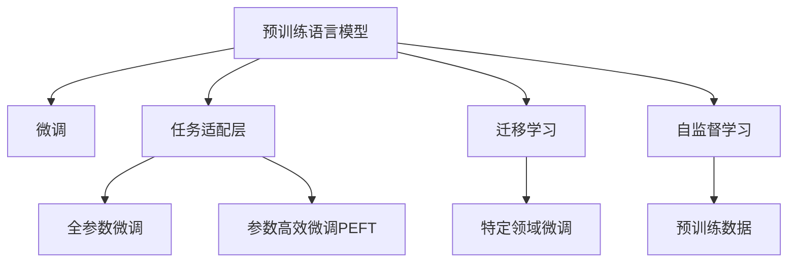

                 

# 智能内容审核：LLM在社交平台管理中的作用

## 1. 背景介绍

### 1.1 问题由来

社交媒体平台的崛起，极大地改变了人们的信息获取和传播方式。然而，社交平台上充斥着大量的虚假信息、仇恨言论、色情暴力内容等，对社会秩序和公众心理健康造成了严重威胁。如何构建健康有序的社交环境，成为平台运营的重要任务。

内容审核是社交平台管理中不可或缺的一环。通过审核平台用户发布的内容，可以有效过滤有害信息，提升用户体验，营造良好的社交氛围。传统的审核方式主要依赖人工审核，成本高、效率低，且易受主观因素影响。因此，使用先进的技术手段，构建高效、精准的内容审核系统，迫在眉睫。

### 1.2 问题核心关键点

内容审核系统需要具备以下核心功能：

- **内容分类**：将用户发布内容自动分类为合法、违规、低质等不同等级。
- **有害内容检测**：识别包含暴力、色情、仇恨等有害内容。
- **低质内容过滤**：过滤拼写错误、语法错误、不完整信息等低质量内容。
- **动态调整策略**：根据用户反馈和数据动态调整审核策略，提升审核效果。
- **规则扩展和维护**：快速响应平台变化和用户需求，及时更新审核规则。

## 2. 核心概念与联系

### 2.1 核心概念概述

为更好地理解LLM在社交平台内容审核中的应用，本节将介绍几个关键概念：

- **语言模型（Language Model, LM）**：通过训练，可以预测一段文本接下来会出现哪些词的模型。常见的语言模型包括n-gram、RNN、Transformer等。
- **预训练语言模型（Pre-trained Language Model, PLM）**：在无标签文本数据上进行大规模预训练，学习丰富的语言知识。常见预训练模型包括BERT、GPT、XLNet等。
- **微调（Fine-tuning）**：在大规模预训练模型基础上，通过有标签数据微调模型，适应特定任务。
- **迁移学习（Transfer Learning）**：在某个领域学习到的知识，迁移到另一个领域的学习过程。LLM在大规模预训练后，可以通过微调迁移到特定领域，提升任务效果。
- **自监督学习（Self-supervised Learning）**：使用无标签数据，通过自监督任务学习模型的能力。预训练过程就是一种自监督学习。

这些核心概念之间的逻辑关系可以通过以下Mermaid流程图来展示：



这个流程图展示了预训练语言模型在大规模无标签数据上进行预训练，然后通过微调适配特定任务，迁移到特定领域的过程。

## 3. 核心算法原理 & 具体操作步骤

### 3.1 算法原理概述

基于预训练语言模型的社交平台内容审核，其核心思想是利用预训练语言模型的语言理解能力，对用户发布内容进行分类和有害内容检测。具体来说，包括以下步骤：

1. **预训练语言模型加载**：加载预训练的BERT、GPT等语言模型，作为初始化的特征提取器。
2. **特征提取与编码**：将用户发布的内容转换为模型可以接受的向量表示。
3. **分类与检测**：利用微调后的分类器对向量进行分类，检测是否包含有害内容。
4. **决策与反馈**：根据分类结果，决定是否删除或降级处理内容，同时收集用户反馈，不断优化模型。

### 3.2 算法步骤详解

以下是基于预训练语言模型进行社交平台内容审核的具体操作步骤：

**Step 1: 预训练模型选择与加载**

根据任务需求选择合适的预训练语言模型，如BERT、GPT等。使用以下代码在Python中加载模型：

```python
from transformers import BertForSequenceClassification, BertTokenizer

model = BertForSequenceClassification.from_pretrained('bert-base-uncased')
tokenizer = BertTokenizer.from_pretrained('bert-base-uncased')
```

**Step 2: 数据预处理**

对用户发布的内容进行预处理，包括文本分词、去停用词、统一格式等。使用以下代码实现：

```python
def preprocess_text(text):
    tokens = tokenizer.tokenize(text)
    tokens = [token.lower() for token in tokens if token.isalpha()]
    return tokenizer.convert_tokens_to_ids(tokens)
```

**Step 3: 特征提取与编码**

将预处理后的文本转换为模型可以接受的向量表示，并利用模型提取特征。使用以下代码实现：

```python
def extract_features(text):
    inputs = tokenizer(text, padding='max_length', truncation=True, max_length=512)
    features = model(**inputs).last_hidden_state
    return features
```

**Step 4: 分类与检测**

使用微调后的分类器对特征向量进行分类，检测是否包含有害内容。使用以下代码实现：

```python
def classify(text):
    features = extract_features(text)
    labels = model(**inputs).logits
    preds = labels.argmax(dim=1)
    return preds
```

**Step 5: 决策与反馈**

根据分类结果，决定是否删除或降级处理内容，并收集用户反馈。使用以下代码实现：

```python
def review_content(text):
    preds = classify(text)
    if preds[0] == 1:  # 有害内容，删除或降级处理
        return 'Remove'
    elif preds[0] == 0:  # 合法内容
        return 'Keep'
    else:  # 低质内容，提示用户改进
        return 'Improvement Required'
```

### 3.3 算法优缺点

基于预训练语言模型的社交平台内容审核方法具有以下优点：

- **高效性**：预训练语言模型可以快速加载并处理大规模文本数据，适合实时内容审核。
- **准确性**：经过微调的分类器，能够准确判断内容是否合法、是否含有有害内容，提升审核效果。
- **可扩展性**：预训练语言模型可以迁移到其他任务，快速适应新领域的审核需求。
- **鲁棒性**：预训练语言模型通过大规模数据预训练，具备较好的泛化能力，抗噪声干扰能力强。

同时，该方法也存在以下局限性：

- **数据依赖**：预训练语言模型依赖大规模无标签数据进行预训练，需要收集和处理大量数据。
- **模型复杂度**：预训练语言模型的参数量较大，对计算资源要求高。
- **黑盒问题**：预训练语言模型通常是黑盒系统，难以解释其内部决策逻辑，可能影响用户信任。
- **高成本**：大规模预训练和微调需要高昂的计算资源和时间成本，维护成本较高。

尽管存在这些局限性，但基于预训练语言模型的内容审核方法，在处理海量文本数据、提升审核效果方面具有显著优势。

### 3.4 算法应用领域

基于预训练语言模型的社交平台内容审核方法，在多个领域具有广泛应用：

- **社交平台**：如微博、Facebook、Twitter等，构建健康有序的社交环境。
- **电商平台**：如淘宝、京东等，提升商品描述质量，规范用户行为。
- **新闻媒体**：如新闻网站、播客等，保障新闻真实性，打击虚假信息。
- **教育平台**：如在线教育平台，过滤不当言论，保护学生安全。
- **政府网站**：如政府服务平台，规范言论行为，保障公共秩序。

## 4. 数学模型和公式 & 详细讲解

### 4.1 数学模型构建

基于预训练语言模型的内容审核方法，其数学模型如下：

**输入**：用户发布的内容 $x$。

**特征提取**：将 $x$ 转换为模型可接受的向量表示 $h(x)$。

**分类器**：微调后的分类器 $f(h(x))$，将 $h(x)$ 映射到分类标签 $y$。

**损失函数**：$L(f(h(x)), y)$，衡量分类器输出与真实标签之间的差异。

**优化目标**：最小化损失函数 $L$，使分类器准确预测内容是否合法、是否含有有害内容。

### 4.2 公式推导过程

以二分类任务为例，推导分类器的损失函数和优化目标。

**输入与特征提取**：
$$
h(x) = [h_1, h_2, \dots, h_D]
$$

**分类器**：
$$
f(h(x)) = W h(x) + b
$$

**真实标签**：
$$
y = \begin{cases}
1, & \text{内容合法} \\
0, & \text{内容违规}
\end{cases}
$$

**损失函数**：
$$
L(f(h(x)), y) = -\log f(h(x)) \cdot y + \log (1 - f(h(x))) \cdot (1 - y)
$$

**优化目标**：
$$
\min_{W, b} \frac{1}{N} \sum_{i=1}^N L(f(h(x_i)), y_i)
$$

### 4.3 案例分析与讲解

以社交平台上的仇恨言论检测为例，分析基于预训练语言模型的应用：

**数据集**：收集社交平台上的仇恨言论和正常言论数据，标记为含有和不含仇恨言论。

**预训练语言模型**：使用大规模无标签文本数据进行预训练，如维基百科、新闻网站等。

**微调**：在仇恨言论数据集上进行微调，训练一个二分类器，能够准确检测出仇恨言论。

**特征提取与编码**：将用户发布的内容转换为BERT模型可接受的向量表示，输入分类器。

**分类与检测**：使用微调后的分类器对向量进行分类，判断是否含有仇恨言论。

**决策与反馈**：根据分类结果，删除含有仇恨言论的内容，并收集用户反馈，优化模型。

## 5. 项目实践：代码实例和详细解释说明

### 5.1 开发环境搭建

在进行社交平台内容审核的开发前，需要准备好开发环境。以下是使用Python进行PyTorch开发的环境配置流程：

1. 安装Anaconda：从官网下载并安装Anaconda，用于创建独立的Python环境。

2. 创建并激活虚拟环境：
```bash
conda create -n pytorch-env python=3.8 
conda activate pytorch-env
```

3. 安装PyTorch：根据CUDA版本，从官网获取对应的安装命令。例如：
```bash
conda install pytorch torchvision torchaudio cudatoolkit=11.1 -c pytorch -c conda-forge
```

4. 安装Transformers库：
```bash
pip install transformers
```

5. 安装各类工具包：
```bash
pip install numpy pandas scikit-learn matplotlib tqdm jupyter notebook ipython
```

完成上述步骤后，即可在`pytorch-env`环境中开始内容审核项目的开发。

### 5.2 源代码详细实现

下面我们以社交平台上的仇恨言论检测为例，给出使用Transformers库进行BERT模型微调的PyTorch代码实现。

首先，定义仇恨言论检测任务的数据处理函数：

```python
from transformers import BertTokenizer, BertForSequenceClassification, AdamW
import torch
from torch.utils.data import Dataset, DataLoader

class HateSpeechDataset(Dataset):
    def __init__(self, texts, labels, tokenizer, max_len=128):
        self.texts = texts
        self.labels = labels
        self.tokenizer = tokenizer
        self.max_len = max_len
        
    def __len__(self):
        return len(self.texts)
    
    def __getitem__(self, item):
        text = self.texts[item]
        label = self.labels[item]
        
        encoding = self.tokenizer(text, return_tensors='pt', max_length=self.max_len, padding='max_length', truncation=True)
        input_ids = encoding['input_ids'][0]
        attention_mask = encoding['attention_mask'][0]
        
        # 对label进行编码
        encoded_labels = torch.tensor(label, dtype=torch.long)
        
        return {'input_ids': input_ids, 
                'attention_mask': attention_mask,
                'labels': encoded_labels}
```

然后，定义模型和优化器：

```python
model = BertForSequenceClassification.from_pretrained('bert-base-uncased', num_labels=2)

optimizer = AdamW(model.parameters(), lr=2e-5)
```

接着，定义训练和评估函数：

```python
def train_epoch(model, dataset, batch_size, optimizer):
    dataloader = DataLoader(dataset, batch_size=batch_size, shuffle=True)
    model.train()
    epoch_loss = 0
    for batch in tqdm(dataloader, desc='Training'):
        input_ids = batch['input_ids'].to(device)
        attention_mask = batch['attention_mask'].to(device)
        labels = batch['labels'].to(device)
        model.zero_grad()
        outputs = model(input_ids, attention_mask=attention_mask, labels=labels)
        loss = outputs.loss
        epoch_loss += loss.item()
        loss.backward()
        optimizer.step()
    return epoch_loss / len(dataloader)

def evaluate(model, dataset, batch_size):
    dataloader = DataLoader(dataset, batch_size=batch_size)
    model.eval()
    preds, labels = [], []
    with torch.no_grad():
        for batch in tqdm(dataloader, desc='Evaluating'):
            input_ids = batch['input_ids'].to(device)
            attention_mask = batch['attention_mask'].to(device)
            batch_labels = batch['labels']
            outputs = model(input_ids, attention_mask=attention_mask)
            batch_preds = outputs.logits.argmax(dim=1).to('cpu').tolist()
            batch_labels = batch_labels.to('cpu').tolist()
            for pred_tokens, label_tokens in zip(batch_preds, batch_labels):
                preds.append(pred_tokens[:len(label_tokens)])
                labels.append(label_tokens)
                
    print(classification_report(labels, preds))
```

最后，启动训练流程并在测试集上评估：

```python
epochs = 5
batch_size = 16

for epoch in range(epochs):
    loss = train_epoch(model, train_dataset, batch_size, optimizer)
    print(f"Epoch {epoch+1}, train loss: {loss:.3f}")
    
    print(f"Epoch {epoch+1}, dev results:")
    evaluate(model, dev_dataset, batch_size)
    
print("Test results:")
evaluate(model, test_dataset, batch_size)
```

以上就是使用PyTorch对BERT进行仇恨言论检测任务微调的完整代码实现。可以看到，得益于Transformers库的强大封装，我们可以用相对简洁的代码完成BERT模型的加载和微调。

### 5.3 代码解读与分析

让我们再详细解读一下关键代码的实现细节：

**HateSpeechDataset类**：
- `__init__`方法：初始化文本、标签、分词器等关键组件。
- `__len__`方法：返回数据集的样本数量。
- `__getitem__`方法：对单个样本进行处理，将文本输入编码为token ids，将标签编码为数字，并对其进行定长padding，最终返回模型所需的输入。

**训练和评估函数**：
- 使用PyTorch的DataLoader对数据集进行批次化加载，供模型训练和推理使用。
- 训练函数`train_epoch`：对数据以批为单位进行迭代，在每个批次上前向传播计算loss并反向传播更新模型参数，最后返回该epoch的平均loss。
- 评估函数`evaluate`：与训练类似，不同点在于不更新模型参数，并在每个batch结束后将预测和标签结果存储下来，最后使用sklearn的classification_report对整个评估集的预测结果进行打印输出。

**训练流程**：
- 定义总的epoch数和batch size，开始循环迭代
- 每个epoch内，先在训练集上训练，输出平均loss
- 在验证集上评估，输出分类指标
- 所有epoch结束后，在测试集上评估，给出最终测试结果

可以看到，PyTorch配合Transformers库使得BERT微调的代码实现变得简洁高效。开发者可以将更多精力放在数据处理、模型改进等高层逻辑上，而不必过多关注底层的实现细节。

当然，工业级的系统实现还需考虑更多因素，如模型的保存和部署、超参数的自动搜索、更灵活的任务适配层等。但核心的微调范式基本与此类似。

## 6. 实际应用场景

### 6.1 智能客服系统

基于预训练语言模型的社交平台内容审核方法，可以广泛应用于智能客服系统的构建。传统客服往往需要配备大量人力，高峰期响应缓慢，且一致性和专业性难以保证。使用预训练语言模型的审核方法，可以7x24小时不间断服务，快速响应客户咨询，用自然流畅的语言解答各类常见问题。

在技术实现上，可以收集企业内部的历史客服对话记录，将问题和最佳答复构建成监督数据，在此基础上对预训练语言模型进行微调。微调后的语言模型能够自动理解用户意图，匹配最合适的答案模板进行回复。对于客户提出的新问题，还可以接入检索系统实时搜索相关内容，动态组织生成回答。如此构建的智能客服系统，能大幅提升客户咨询体验和问题解决效率。

### 6.2 金融舆情监测

金融机构需要实时监测市场舆论动向，以便及时应对负面信息传播，规避金融风险。传统的人工监测方式成本高、效率低，难以应对网络时代海量信息爆发的挑战。基于预训练语言模型的文本分类和情感分析技术，为金融舆情监测提供了新的解决方案。

具体而言，可以收集金融领域相关的新闻、报道、评论等文本数据，并对其进行主题标注和情感标注。在此基础上对预训练语言模型进行微调，使其能够自动判断文本属于何种主题，情感倾向是正面、中性还是负面。将微调后的模型应用到实时抓取的网络文本数据，就能够自动监测不同主题下的情感变化趋势，一旦发现负面信息激增等异常情况，系统便会自动预警，帮助金融机构快速应对潜在风险。

### 6.3 个性化推荐系统

当前的推荐系统往往只依赖用户的历史行为数据进行物品推荐，无法深入理解用户的真实兴趣偏好。基于预训练语言模型的推荐系统可以更好地挖掘用户行为背后的语义信息，从而提供更精准、多样的推荐内容。

在实践中，可以收集用户浏览、点击、评论、分享等行为数据，提取和用户交互的物品标题、描述、标签等文本内容。将文本内容作为模型输入，用户的后续行为（如是否点击、购买等）作为监督信号，在此基础上微调预训练语言模型。微调后的模型能够从文本内容中准确把握用户的兴趣点。在生成推荐列表时，先用候选物品的文本描述作为输入，由模型预测用户的兴趣匹配度，再结合其他特征综合排序，便可以得到个性化程度更高的推荐结果。

### 6.4 未来应用展望

随着预训练语言模型和微调方法的不断发展，基于预训练语言模型的内容审核方法将在更多领域得到应用，为传统行业数字化转型升级提供新的技术路径。

在智慧医疗领域，基于预训练语言模型的内容审核方法可以用于构建健康信息平台，保障医疗信息的安全性和准确性，提升医疗服务的智能化水平。

在智能教育领域，预训练语言模型的审核方法可以用于自动检测学生提交的作业和论文，保护知识产权，提升教育质量。

在智慧城市治理中，预训练语言模型的审核方法可以用于构建智能监控系统，实时监测网络舆情，维护城市秩序，提升公共安全。

此外，在企业生产、社会治理、文娱传媒等众多领域，基于预训练语言模型的审核方法也将不断涌现，为NLP技术带来新的突破。相信随着预训练语言模型和微调方法的持续演进，基于预训练语言模型的内容审核技术必将在构建安全、可靠、可解释、可控的智能系统方面发挥更大的作用。

## 7. 工具和资源推荐

### 7.1 学习资源推荐

为了帮助开发者系统掌握预训练语言模型微调的理论基础和实践技巧，这里推荐一些优质的学习资源：

1. 《Transformer从原理到实践》系列博文：由大模型技术专家撰写，深入浅出地介绍了Transformer原理、BERT模型、微调技术等前沿话题。

2. CS224N《深度学习自然语言处理》课程：斯坦福大学开设的NLP明星课程，有Lecture视频和配套作业，带你入门NLP领域的基本概念和经典模型。

3. 《Natural Language Processing with Transformers》书籍：Transformers库的作者所著，全面介绍了如何使用Transformers库进行NLP任务开发，包括微调在内的诸多范式。

4. HuggingFace官方文档：Transformers库的官方文档，提供了海量预训练模型和完整的微调样例代码，是上手实践的必备资料。

5. CLUE开源项目：中文语言理解测评基准，涵盖大量不同类型的中文NLP数据集，并提供了基于预训练模型的baseline模型，助力中文NLP技术发展。

通过对这些资源的学习实践，相信你一定能够快速掌握预训练语言模型微调的精髓，并用于解决实际的NLP问题。

### 7.2 开发工具推荐

高效的开发离不开优秀的工具支持。以下是几款用于预训练语言模型微调开发的常用工具：

1. PyTorch：基于Python的开源深度学习框架，灵活动态的计算图，适合快速迭代研究。大部分预训练语言模型都有PyTorch版本的实现。

2. TensorFlow：由Google主导开发的开源深度学习框架，生产部署方便，适合大规模工程应用。同样有丰富的预训练语言模型资源。

3. Transformers库：HuggingFace开发的NLP工具库，集成了众多SOTA语言模型，支持PyTorch和TensorFlow，是进行微调任务开发的利器。

4. Weights & Biases：模型训练的实验跟踪工具，可以记录和可视化模型训练过程中的各项指标，方便对比和调优。与主流深度学习框架无缝集成。

5. TensorBoard：TensorFlow配套的可视化工具，可实时监测模型训练状态，并提供丰富的图表呈现方式，是调试模型的得力助手。

6. Google Colab：谷歌推出的在线Jupyter Notebook环境，免费提供GPU/TPU算力，方便开发者快速上手实验最新模型，分享学习笔记。

合理利用这些工具，可以显著提升预训练语言模型微调的开发效率，加快创新迭代的步伐。

### 7.3 相关论文推荐

预训练语言模型和微调技术的发展源于学界的持续研究。以下是几篇奠基性的相关论文，推荐阅读：

1. Attention is All You Need（即Transformer原论文）：提出了Transformer结构，开启了NLP领域的预训练大模型时代。

2. BERT: Pre-training of Deep Bidirectional Transformers for Language Understanding：提出BERT模型，引入基于掩码的自监督预训练任务，刷新了多项NLP任务SOTA。

3. Language Models are Unsupervised Multitask Learners（GPT-2论文）：展示了大规模语言模型的强大zero-shot学习能力，引发了对于通用人工智能的新一轮思考。

4. Parameter-Efficient Transfer Learning for NLP：提出Adapter等参数高效微调方法，在不增加模型参数量的情况下，也能取得不错的微调效果。

5. Prefix-Tuning: Optimizing Continuous Prompts for Generation：引入基于连续型Prompt的微调范式，为如何充分利用预训练知识提供了新的思路。

6. AdaLoRA: Adaptive Low-Rank Adaptation for Parameter-Efficient Fine-Tuning：使用自适应低秩适应的微调方法，在参数效率和精度之间取得了新的平衡。

这些论文代表了大语言模型微调技术的发展脉络。通过学习这些前沿成果，可以帮助研究者把握学科前进方向，激发更多的创新灵感。

## 8. 总结：未来发展趋势与挑战

### 8.1 总结

本文对基于预训练语言模型的社交平台内容审核方法进行了全面系统的介绍。首先阐述了预训练语言模型和微调技术的研究背景和意义，明确了预训练语言模型在大规模预训练和微调中的关键作用。其次，从原理到实践，详细讲解了预训练语言模型在内容审核任务中的具体应用，提供了完整的代码实例和优化建议。同时，本文还广泛探讨了预训练语言模型在多个行业领域的应用前景，展示了其在智能客服、金融舆情监测、个性化推荐等方面的广阔应用。最后，本文精选了预训练语言模型微调的学习资源、开发工具和相关论文，力求为开发者提供全方位的技术指引。

通过本文的系统梳理，可以看到，基于预训练语言模型的内容审核方法正在成为NLP领域的重要范式，极大地拓展了预训练语言模型的应用边界，催生了更多的落地场景。得益于大规模预训练语言模型的强大能力，基于预训练语言模型的内容审核方法能够在短时间内快速构建高效、精准的审核系统，为社交平台管理带来了显著的提升。未来，伴随预训练语言模型和微调方法的持续演进，基于预训练语言模型的内容审核技术必将进一步提升智能系统的性能和应用范围，为人类认知智能的进化带来深远影响。

### 8.2 未来发展趋势

展望未来，预训练语言模型在内容审核领域将呈现以下几个发展趋势：

1. **模型规模持续增大**：随着算力成本的下降和数据规模的扩张，预训练语言模型的参数量还将持续增长。超大规模语言模型蕴含的丰富语言知识，有望支撑更加复杂多变的审核任务。

2. **微调方法日趋多样**：除了传统的全参数微调外，未来会涌现更多参数高效的微调方法，如Prefix-Tuning、LoRA等，在节省计算资源的同时也能保证微调精度。

3. **持续学习成为常态**：随着数据分布的不断变化，预训练语言模型也需要持续学习新知识以保持性能。如何在不遗忘原有知识的同时，高效吸收新样本信息，将成为重要的研究课题。

4. **标注样本需求降低**：受启发于提示学习(Prompt-based Learning)的思路，未来的微调方法将更好地利用预训练语言模型的语言理解能力，通过更加巧妙的任务描述，在更少的标注样本上也能实现理想的微调效果。

5. **多模态微调崛起**：当前的预训练语言模型主要用于处理文本数据，未来会进一步拓展到图像、视频、语音等多模态数据微调。多模态信息的融合，将显著提升语言模型对现实世界的理解和建模能力。

6. **模型通用性增强**：经过海量数据的预训练和多领域任务的微调，未来的预训练语言模型将具备更强大的常识推理和跨领域迁移能力，逐步迈向通用人工智能(AGI)的目标。

以上趋势凸显了预训练语言模型微调技术的广阔前景。这些方向的探索发展，必将进一步提升预训练语言模型微调技术在智能系统中的应用效果，推动NLP技术向更高级阶段演进。

### 8.3 面临的挑战

尽管预训练语言模型微调技术已经取得了瞩目成就，但在迈向更加智能化、普适化应用的过程中，它仍面临着诸多挑战：

1. **标注成本瓶颈**：预训练语言模型微调依赖大规模标注数据，标注成本较高。如何降低微调对标注样本的依赖，将是一大难题。

2. **模型鲁棒性不足**：预训练语言模型面对域外数据时，泛化性能往往大打折扣。对于测试样本的微小扰动，预训练语言模型容易产生波动。如何提高预训练语言模型的鲁棒性，避免灾难性遗忘，还需要更多理论和实践的积累。

3. **推理效率有待提高**：大规模语言模型虽然精度高，但在实际部署时往往面临推理速度慢、内存占用大等效率问题。如何在保证性能的同时，简化模型结构，提升推理速度，优化资源占用，将是重要的优化方向。

4. **可解释性亟需加强**：预训练语言模型通常是黑盒系统，难以解释其内部决策逻辑，可能影响用户信任。如何赋予预训练语言模型更强的可解释性，将是亟待攻克的难题。

5. **安全性有待保障**：预训练语言模型难免会学习到有偏见、有害的信息，通过微调传递到审核任务，产生误导性、歧视性的输出，给实际应用带来安全隐患。如何从数据和算法层面消除模型偏见，避免恶意用途，确保输出的安全性，也将是重要的研究课题。

6. **知识整合能力不足**：现有的预训练语言模型往往局限于任务内数据，难以灵活吸收和运用更广泛的先验知识。如何让预训练过程更好地与外部知识库、规则库等专家知识结合，形成更加全面、准确的信息整合能力，还有很大的想象空间。

正视预训练语言模型微调面临的这些挑战，积极应对并寻求突破，将是大语言模型微调走向成熟的必由之路。相信随着学界和产业界的共同努力，这些挑战终将一一被克服，预训练语言模型微调必将在构建安全、可靠、可解释、可控的智能系统方面发挥更大的作用。

### 8.4 研究展望

面对预训练语言模型微调所面临的种种挑战，未来的研究需要在以下几个方面寻求新的突破：

1. **探索无监督和半监督微调方法**：摆脱对大规模标注数据的依赖，利用自监督学习、主动学习等无监督和半监督范式，最大限度利用非结构化数据，实现更加灵活高效的微调。

2. **研究参数高效和计算高效的微调范式**：开发更加参数高效的微调方法，在固定大部分预训练参数的同时，只更新极少量的任务相关参数。同时优化预训练语言模型的计算图，减少前向传播和反向传播的资源消耗，实现更加轻量级、实时性的部署。

3. **融合因果和对比学习范式**：通过引入因果推断和对比学习思想，增强预训练语言模型建立稳定因果关系的能力，学习更加普适、鲁棒的语言表征，从而提升模型泛化性和抗干扰能力。

4. **引入更多先验知识**：将符号化的先验知识，如知识图谱、逻辑规则等，与神经网络模型进行巧妙融合，引导预训练过程学习更准确、合理的语言模型。同时加强不同模态数据的整合，实现视觉、语音等多模态信息与文本信息的协同建模。

5. **结合因果分析和博弈论工具**：将因果分析方法引入预训练语言模型，识别出模型决策的关键特征，增强输出解释的因果性和逻辑性。借助博弈论工具刻画人机交互过程，主动探索并规避模型的脆弱点，提高系统稳定性。

6. **纳入伦理道德约束**：在预训练语言模型的训练目标中引入伦理导向的评估指标，过滤和惩罚有偏见、有害的输出倾向。同时加强人工干预和审核，建立模型行为的监管机制，确保输出符合人类价值观和伦理道德。

这些研究方向的探索，必将引领预训练语言模型微调技术迈向更高的台阶，为构建安全、可靠、可解释、可控的智能系统铺平道路。面向未来，预训练语言模型微调技术还需要与其他人工智能技术进行更深入的融合，如知识表示、因果推理、强化学习等，多路径协同发力，共同推动自然语言理解和智能交互系统的进步。只有勇于创新、敢于突破，才能不断拓展语言模型的边界，让智能技术更好地造福人类社会。

## 9. 附录：常见问题与解答

**Q1：预训练语言模型在审核任务中的主要优势是什么？**

A: 预训练语言模型在审核任务中的主要优势包括：

1. **高效性**：预训练语言模型可以快速加载并处理大规模文本数据，适合实时内容审核。
2. **准确性**：经过微调的分类器，能够准确判断内容是否合法、是否含有有害内容，提升审核效果。
3. **可扩展性**：预训练语言模型可以迁移到其他任务，快速适应新领域的审核需求。
4. **鲁棒性**：预训练语言模型通过大规模数据预训练，具备较好的泛化能力，抗噪声干扰能力强。

**Q2：预训练语言模型在微调过程中需要注意哪些问题？**

A: 预训练语言模型在微调过程中需要注意以下问题：

1. **学习率**：微调的初始学习率一般要比预训练时小1-2个数量级，避免破坏预训练权重。
2. **数据增强**：通过回译、近义替换等方式扩充训练集，增强模型的泛化能力。
3. **正则化**：使用L2正则、Dropout、Early Stopping等防止模型过度拟合。
4. **动态调整策略**：根据用户反馈和数据动态调整审核策略，提升模型效果。
5. **知识整合**：将外部知识库、规则库等专家知识与预训练语言模型结合，提升模型的准确性和鲁棒性。

**Q3：预训练语言模型在微调过程中如何避免过拟合？**

A: 预训练语言模型在微调过程中避免过拟合的策略包括：

1. **数据增强**：通过回译、近义替换等方式扩充训练集。
2. **正则化**：使用L2正则、Dropout、Early Stopping等防止模型过度拟合。
3. **参数高效微调**：只更新极少量的任务相关参数，减小过拟合风险。
4. **对抗训练**：引入对抗样本，提高模型鲁棒性。

**Q4：预训练语言模型在审核任务中的部署需要注意哪些问题？**

A: 预训练语言模型在审核任务中的部署需要注意以下问题：

1. **模型裁剪**：去除不必要的层和参数，减小模型尺寸，加快推理速度。
2. **量化加速**：将浮点模型转为定点模型，压缩存储空间，提高计算效率。
3. **服务化封装**：将模型封装为标准化服务接口，便于集成调用。
4. **弹性伸缩**：根据请求流量动态调整资源配置，平衡服务质量和成本。
5. **监控告警**：实时采集系统指标，设置异常告警阈值，确保服务稳定性。

**Q5：预训练语言模型在微调过程中如何提高模型鲁棒性？**

A: 预训练语言模型在微调过程中提高模型鲁棒性的策略包括：

1. **对抗训练**：引入对抗样本，提高模型鲁棒性。
2. **参数高效微调**：只更新极少量的任务相关参数，减小过拟合风险。
3. **正则化**：使用L2正则、Dropout、Early Stopping等防止模型过度拟合。
4. **数据增强**：通过回译、近义替换等方式扩充训练集。

**Q6：预训练语言模型在审核任务中如何处理长尾应用场景？**

A: 预训练语言模型在审核任务中处理长尾应用场景的策略包括：

1. **微调**：在特定领域语料上进一步预训练，再进行微调，适应长尾应用场景。
2. **动态调整策略**：根据用户反馈和数据动态调整审核策略，提升模型效果。
3. **知识整合**：将外部知识库、规则库等专家知识与预训练语言模型结合，提升模型的准确性和鲁棒性。

这些策略可以根据具体任务和数据特点进行灵活组合。只有在数据、模型、训练、推理等各环节进行全面优化，才能最大限度地发挥预训练语言模型的审核能力。

