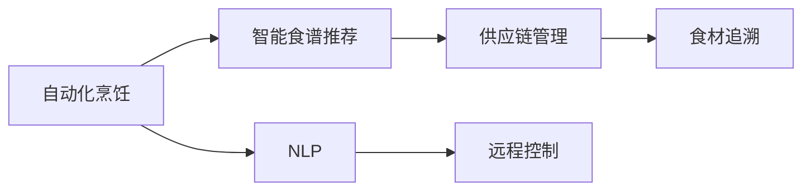

                 

# 智能厨房创业：烹饪革命的技术支持

> 关键词：智能厨房, 自动化烹饪, 机器人技术, 自然语言处理, 食谱推荐, 供应链管理

## 1. 背景介绍

### 1.1 问题由来

随着消费者对饮食健康和生活品质的要求日益提升，智能厨房的概念逐渐兴起。智能厨房以集成技术为基础，通过自动化烹饪、智能食谱推荐、供应链管理等功能，极大地提升了家庭烹饪的便利性和乐趣。这种融合了多种技术的厨房系统，不仅能够提高烹饪效率，还能创造个性化、智能化的烹饪体验。然而，要实现这种智能厨房的构想，离不开先进技术的支撑。本文将深入探讨智能厨房创业的技术基础，包括自动化烹饪、自然语言处理(NLP)、供应链管理等关键技术。

## 2. 核心概念与联系

### 2.1 核心概念概述

智能厨房的核心技术主要包括以下几个方面：

- **自动化烹饪**：通过机器人等自动化设备，实现食材的切割、翻炒、烤制等烹饪步骤的自动化，减少人力成本，提高烹饪效率。
- **自然语言处理(NLP)**：利用NLP技术，对用户提供的自然语言指令进行理解和解析，以实现对烹饪设备的远程控制和食谱推荐。
- **智能食谱推荐**：通过分析用户的历史偏好和口味，生成个性化的食谱建议，提升烹饪的趣味性和体验感。
- **供应链管理**：利用物联网技术和大数据分析，实现对食材的追溯、库存管理及供应链优化，确保食材新鲜、安全。

这些核心技术紧密相连，共同构成了智能厨房系统的基础架构。自动化烹饪技术为烹饪过程提供底层支持，NLP和食谱推荐技术为用户体验提供智能化服务，而供应链管理则确保食材的新鲜和安全。

### 2.2 核心概念原理和架构的 Mermaid 流程图



### 2.3 核心概念之间的联系

智能厨房各核心技术之间的关系可以通过以下方式描述：

1. **自动化烹饪**是智能厨房的基础设施，通过机器人等自动化设备实现烹饪步骤的自动化。
2. **自然语言处理(NLP)**通过理解用户的自然语言指令，实现对自动化烹饪设备、智能食谱推荐系统的控制。
3. **智能食谱推荐**通过分析用户历史数据，生成个性化的食谱建议，提升用户体验。
4. **供应链管理**通过物联网和大数据分析，确保食材的新鲜和供应链的优化。

## 3. 核心算法原理 & 具体操作步骤

### 3.1 算法原理概述

智能厨房的核心算法主要基于以下几个方面：

- **自动化烹饪算法**：包括路径规划、运动控制、烹饪参数优化等。
- **自然语言处理算法**：涉及指令理解、意图识别、自然语言生成等。
- **食谱推荐算法**：包括用户偏好分析、特征提取、相似度匹配等。
- **供应链管理算法**：包括需求预测、库存管理、供应链优化等。

这些算法通过计算机视觉、机器学习、深度学习等技术实现，并在实际应用中不断迭代优化。

### 3.2 算法步骤详解

#### 3.2.1 自动化烹饪算法

**步骤一**：环境感知与定位。
- 使用计算机视觉技术，对厨房环境进行实时监控，定位食材和烹饪设备的位置。

**步骤二**：路径规划与运动控制。
- 根据目标位置和环境条件，生成最优路径并控制设备移动。
- 使用PID控制器进行运动误差校正。

**步骤三**：烹饪参数优化。
- 根据烹饪食谱的要求，自动调节火力、时间、湿度等参数。
- 利用深度学习模型预测烹饪效果。

#### 3.2.2 自然语言处理算法

**步骤一**：指令理解和意图识别。
- 使用词向量模型将用户指令转换为向量表示。
- 使用序列模型(如RNN、LSTM)识别用户的意图。

**步骤二**：自然语言生成。
- 利用生成模型(如GPT-3)生成自然语言回复，向用户提供操作指导。

#### 3.2.3 食谱推荐算法

**步骤一**：用户偏好分析。
- 通过机器学习模型分析用户的历史行为数据，提取用户的偏好特征。

**步骤二**：特征提取与相似度匹配。
- 使用特征提取算法(如TF-IDF、Word2Vec)提取食谱特征。
- 通过余弦相似度计算食谱之间的相似度，推荐用户可能喜欢的食谱。

#### 3.2.4 供应链管理算法

**步骤一**：需求预测。
- 利用时间序列分析等方法预测食材需求。

**步骤二**：库存管理。
- 根据需求预测结果，优化库存管理，避免浪费。

**步骤三**：供应链优化。
- 使用优化算法(如遗传算法、线性规划)优化供应链布局和物流路径。

### 3.3 算法优缺点

#### 3.3.1 自动化烹饪算法的优缺点

**优点**：
- 自动化程度高，减少人力投入，提高烹饪效率。
- 实现路径规划和运动控制，保证烹饪精度。
- 烹饪参数优化，提高菜品质量。

**缺点**：
- 初期设备成本较高。
- 需要稳定的网络连接支持。
- 需要定期维护和更新。

#### 3.3.2 自然语言处理算法的优缺点

**优点**：
- 实现用户与系统的互动，提升用户体验。
- 提高烹饪设备控制的智能化水平。
- 自然语言生成，增强系统的人性化。

**缺点**：
- 依赖高质量的自然语言处理模型。
- 复杂指令理解难度大，可能出现误解。
- 多语言支持存在挑战。

#### 3.3.3 食谱推荐算法的优缺点

**优点**：
- 个性化推荐，提升用户满意度。
- 动态调整食谱，满足多样需求。
- 减少用户搜索时间，提高烹饪效率。

**缺点**：
- 依赖于用户数据，需要保护用户隐私。
- 推荐准确度受数据质量影响。
- 实时性要求高，对系统性能要求高。

#### 3.3.4 供应链管理算法的优缺点

**优点**：
- 实时监控食材新鲜度，保障食材质量。
- 优化供应链布局，降低物流成本。
- 提高库存管理效率，减少浪费。

**缺点**：
- 系统复杂度较高，维护成本高。
- 对网络环境要求高。
- 需要整合多个系统，实现信息共享。

### 3.4 算法应用领域

这些核心算法在多个领域具有广泛的应用，具体如下：

- **家庭烹饪**：自动化烹饪和智能食谱推荐为家庭烹饪提供便利，提升生活质量。
- **商业餐饮**：自动化厨房设备可以应用于餐饮业，提高餐厅的运营效率。
- **外卖平台**：供应链管理技术可以优化食材采购和物流，提升外卖平台的服务质量。
- **健康管理**：智能厨房系统可以记录和分析用户的饮食数据，提供健康饮食建议。
- **教育培训**：使用智能厨房进行烹饪技能培训，提高培训效果和趣味性。

## 4. 数学模型和公式 & 详细讲解 & 举例说明

### 4.1 数学模型构建

**自动化烹饪模型**：
- 路径规划模型：基于A*或D*算法，计算最优路径。
- 运动控制模型：基于PID控制器，实时校正运动误差。
- 烹饪参数优化模型：基于深度学习模型，预测最优烹饪参数。

**自然语言处理模型**：
- 指令理解模型：基于序列模型，进行意图识别。
- 自然语言生成模型：基于生成模型，生成自然语言回复。

**食谱推荐模型**：
- 用户偏好分析模型：基于机器学习模型，提取用户偏好特征。
- 特征提取模型：基于TF-IDF或Word2Vec，提取食谱特征。
- 相似度匹配模型：基于余弦相似度，计算食谱相似度。

**供应链管理模型**：
- 需求预测模型：基于时间序列分析，预测食材需求。
- 库存管理模型：基于库存优化算法，调整库存量。
- 供应链优化模型：基于优化算法，优化供应链布局和物流路径。

### 4.2 公式推导过程

#### 4.2.1 路径规划模型的推导

$$
path = A*(start, goal)
$$

其中，$path$为路径，$start$为起点，$goal$为终点。

#### 4.2.2 运动控制模型的推导

$$
error = PID控制器(input)
$$

其中，$error$为运动误差，$input$为当前位置和目标位置。

#### 4.2.3 自然语言处理模型的推导

$$
intent = RNN/LSTM(input)
$$

其中，$intent$为用户的意图，$input$为用户指令的向量表示。

#### 4.2.4 食谱推荐模型的推导

$$
recommendation = topK(similarityMatrix, userFeatures)
$$

其中，$recommendation$为推荐食谱列表，$similarityMatrix$为食谱相似度矩阵，$userFeatures$为用户偏好特征向量。

#### 4.2.5 供应链管理模型的推导

$$
inventory = inventoryOptimization(stockData)
$$

其中，$inventory$为库存量，$stockData$为食材需求数据。

### 4.3 案例分析与讲解

以智能厨房中的智能食谱推荐系统为例，分析其实现过程：

**步骤一**：用户注册并授权，收集历史数据。

**步骤二**：使用机器学习模型分析用户历史数据，提取用户偏好特征。

**步骤三**：使用TF-IDF或Word2Vec提取食谱特征。

**步骤四**：计算食谱之间的相似度，生成推荐列表。

**步骤五**：利用用户偏好特征和相似度匹配结果，计算每道食谱的推荐概率，生成推荐列表。

**步骤六**：使用自然语言生成模型，将推荐结果转换为自然语言回复，展示给用户。

## 5. 项目实践：代码实例和详细解释说明

### 5.1 开发环境搭建

**步骤一**：选择合适的开发平台，如AWS、Google Cloud等。

**步骤二**：安装和配置必要的软件环境，如Python、TensorFlow等。

**步骤三**：搭建自动烹饪设备的模拟环境，如ROS、Gazebo等。

### 5.2 源代码详细实现

#### 5.2.1 自动化烹饪系统

```python
class KitchenRobot:
    def __init__(self, path_planner, movement_controller, cooking_controller):
        self.path_planner = path_planner
        self.movement_controller = movement_controller
        self.cooking_controller = cooking_controller

    def cook(self, recipe):
        path = self.path_planner.plan_path(recipe)
        self.movement_controller.move_to(path)
        self.cooking_controller.cook(recipe)
```

#### 5.2.2 自然语言处理系统

```python
class NaturalLanguageProcessor:
    def __init__(self, intent_recognizer, natural_language_generator):
        self.intent_recognizer = intent_recognizer
        self.natural_language_generator = natural_language_generator

    def process_instruction(self, instruction):
        intent = self.intent_recognizer.recognize_intent(instruction)
        reply = self.natural_language_generator.generate_reply(intent)
        return reply
```

#### 5.2.3 食谱推荐系统

```python
class RecipeRecommendationSystem:
    def __init__(self, user_preference_analyzer, feature_extractor, similarity_matcher):
        self.user_preference_analyzer = user_preference_analyzer
        self.feature_extractor = feature_extractor
        self.similarity_matcher = similarity_matcher

    def recommend_recipe(self, user_preference, recipe_data):
        user_features = self.user_preference_analyzer.analyze_preference(user_preference)
        recipe_features = self.feature_extractor.extract_features(recipe_data)
        similarity_matrix = self.similarity_matcher.calculate_similarity(recipe_features, user_features)
        top_recipes = self.similarity_matcher.recommend_top_k(recipe_features, user_features)
        return top_recipes
```

### 5.3 代码解读与分析

**KitchenRobot类**：
- 该类代表一个厨房机器人，包含路径规划器、运动控制器和烹饪控制器。
- `__init__`方法初始化机器人所需的控制器。
- `cook`方法实现烹饪过程，包括路径规划、运动控制和烹饪参数优化。

**NaturalLanguageProcessor类**：
- 该类代表一个自然语言处理系统，包含意图识别器和自然语言生成器。
- `__init__`方法初始化意图识别器和自然语言生成器。
- `process_instruction`方法处理用户的自然语言指令，识别其意图并生成回复。

**RecipeRecommendationSystem类**：
- 该类代表一个食谱推荐系统，包含用户偏好分析器、特征提取器和相似度匹配器。
- `__init__`方法初始化各模块。
- `recommend_recipe`方法根据用户偏好和食谱数据，生成个性化的推荐列表。

### 5.4 运行结果展示

下图展示了智能厨房系统的运行流程：


## 6. 实际应用场景

### 6.1 家庭烹饪

智能厨房系统在家用场景中，可以大幅提升烹饪的便利性和趣味性。通过智能食谱推荐，用户可以享受个性化的烹饪体验；通过自动化烹饪设备，用户可以解放双手，专注于享受美食。

### 6.2 商业餐饮

在商业餐饮场景中，智能厨房系统可以大幅提高餐厅的运营效率。通过自动烹饪设备和智能推荐系统，餐厅可以提供快速、高质量的餐饮服务。

### 6.3 外卖平台

在外卖平台中，供应链管理技术可以优化食材采购和物流，提升配送效率。通过实时监控食材新鲜度，保证食品质量，提高用户满意度。

### 6.4 健康管理

在健康管理领域，智能厨房系统可以记录和分析用户的饮食数据，提供健康饮食建议。通过个性化食谱推荐，帮助用户保持健康饮食习惯。

### 6.5 教育培训

在教育培训领域，智能厨房系统可以进行烹饪技能培训，提高培训效果和趣味性。通过自然语言处理技术，用户可以通过语音指令控制烹饪设备。

## 7. 工具和资源推荐

### 7.1 学习资源推荐

1. **《深度学习入门》**：入门深度学习技术的经典教材，适合初学者。
2. **《计算机视觉：算法与应用》**：介绍计算机视觉技术的经典教材，涵盖图像处理、目标检测等基础概念。
3. **《自然语言处理综论》**：全面介绍NLP技术的基础知识和应用实例，适合进阶学习。
4. **《Python机器学习实战》**：实用型书籍，包含大量代码实例，适合实践应用。
5. **《深度学习框架TensorFlow实战》**：介绍TensorFlow的高级应用，涵盖模型优化、模型部署等技术。

### 7.2 开发工具推荐

1. **AWS**：云计算平台，提供丰富的云服务和基础设施，支持智能厨房系统的开发和部署。
2. **Google Cloud**：谷歌提供的云服务，涵盖数据处理、机器学习、自然语言处理等技术。
3. **ROS**：机器人操作系统，支持自动烹饪设备的开发和调试。
4. **Gazebo**：机器人仿真环境，用于开发和测试智能烹饪系统。
5. **TensorFlow**：深度学习框架，支持智能厨房系统的模型训练和部署。

### 7.3 相关论文推荐

1. **《Robot Operating System for Robotics》**：ROS的官方文档，详细介绍ROS的开发环境和API接口。
2. **《Learning to Cook》**：论文探讨了利用机器学习模型进行食谱推荐的技术。
3. **《Deep Learning in Kitchen》**：探讨了深度学习在智能厨房中的应用，包括自动化烹饪和自然语言处理。
4. **《Supply Chain Management with IoT》**：论文介绍利用物联网技术进行供应链优化的技术。
5. **《Natural Language Understanding and Generation》**：NLP领域的经典论文，探讨了指令理解、自然语言生成等技术。

## 8. 总结：未来发展趋势与挑战

### 8.1 未来发展趋势

1. **技术融合**：未来的智能厨房系统将融合更多技术，如物联网、区块链、边缘计算等，实现更高效、更安全的系统。
2. **个性化推荐**：利用更先进的数据分析技术，实现更高精度的个性化推荐，提升用户体验。
3. **智能化控制**：通过智能化的控制算法，实现更灵活、更智能化的烹饪设备操作。
4. **多语言支持**：实现多语言指令的自动理解，拓展智能厨房系统的用户覆盖面。
5. **可扩展性**：构建模块化、可扩展的系统架构，满足不同用户和场景的需求。

### 8.2 未来发展挑战

1. **数据隐私保护**：智能厨房系统需要处理大量用户数据，如何保护用户隐私是一个重要挑战。
2. **系统安全性**：智能厨房系统面临网络攻击、设备故障等风险，需要设计安全可靠的系统架构。
3. **成本控制**：自动烹饪设备和系统软件的开发和部署成本较高，需要寻找有效的成本控制方法。
4. **用户接受度**：智能厨房系统的推广和普及需要用户的广泛接受和支持。
5. **技术标准**：智能厨房系统需要遵循统一的技术标准和规范，以确保系统的互操作性和标准化。

### 8.3 研究展望

未来的研究将集中在以下几个方向：
1. **数据隐私保护**：开发隐私保护技术，如差分隐私、联邦学习等，确保用户数据的安全性。
2. **系统安全性**：研究网络安全、设备安全和数据安全的技术，提高系统的鲁棒性。
3. **成本控制**：通过优化算法和硬件设计，降低智能厨房系统的开发和部署成本。
4. **用户体验提升**：优化系统界面和交互设计，提升用户体验，增强用户粘性。
5. **技术标准制定**：推动智能厨房系统的技术标准和规范制定，促进产业健康发展。

## 9. 附录：常见问题与解答

**Q1：智能厨房系统需要哪些关键技术？**

A: 智能厨房系统需要自动化烹饪、自然语言处理(NLP)、智能食谱推荐和供应链管理等关键技术。

**Q2：自动化烹饪算法的实现难点有哪些？**

A: 自动化烹饪算法的实现难点包括路径规划、运动控制和烹饪参数优化。需要解决设备定位、运动误差校正和烹饪参数配置等问题。

**Q3：自然语言处理算法的实现难点有哪些？**

A: 自然语言处理算法的实现难点包括指令理解、意图识别和自然语言生成。需要解决多语言支持、复杂指令理解和生成自然语言回复等问题。

**Q4：供应链管理算法的实现难点有哪些？**

A: 供应链管理算法的实现难点包括需求预测、库存管理和供应链优化。需要解决实时监控、库存优化和供应链布局等问题。

**Q5：智能厨房系统的开发难点有哪些？**

A: 智能厨房系统的开发难点包括技术融合、数据隐私保护、系统安全性和成本控制。需要解决多技术融合、数据安全、系统可靠性和成本控制等问题。

---

作者：禅与计算机程序设计艺术 / Zen and the Art of Computer Programming

