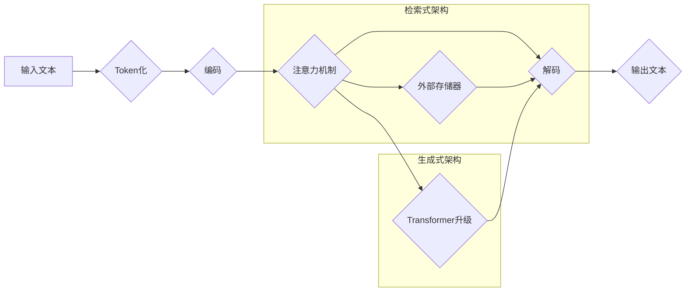

                 

## 扩展LLM的记忆：长上下文处理的突破

> 关键词：大型语言模型 (LLM)、长上下文处理、记忆扩展、Transformer、注意力机制、检索式架构、生成式架构

## 1. 背景介绍

大型语言模型 (LLM) 近年来取得了令人瞩目的成就，在文本生成、翻译、问答等领域展现出强大的能力。然而，LLM 的核心能力之一——上下文理解，仍然面临着瓶颈。现有的 LLMs 通常只能处理有限长度的上下文信息，这限制了它们在理解长篇文本、进行复杂推理和记忆相关信息方面的表现。

长上下文处理是 LLMs 发展的重要方向之一。它旨在提升 LLMs 对长文本的理解能力，使其能够更好地处理现实世界中的复杂场景。 

## 2. 核心概念与联系

### 2.1  上下文理解

上下文理解是指模型根据输入文本序列中前后相关信息，对当前词语或句子进行理解和预测的能力。

### 2.2  上下文长度限制

现有的 Transformer 架构，由于其自注意力机制的计算复杂度，通常只能处理有限长度的上下文信息。超过这个长度限制，模型的性能会急剧下降。

### 2.3  长上下文处理方法

为了解决上下文长度限制问题，研究者们提出了多种长上下文处理方法，主要分为两类：

* **检索式架构:** 

   将文本信息存储在外部存储器中，并在推理过程中根据查询信息检索相关信息。

* **生成式架构:** 

   通过改进 Transformer 架构或引入新的机制，提升模型处理长文本的能力。

**Mermaid 流程图:**



## 3. 核心算法原理 & 具体操作步骤

### 3.1  算法原理概述

长上下文处理算法的核心在于如何有效地存储和处理大量文本信息。检索式架构通过外部存储器来解决这个问题，而生成式架构则通过改进 Transformer 架构或引入新的机制来提升模型的处理能力。

### 3.2  算法步骤详解

**检索式架构:**

1. **文本预处理:** 将输入文本进行 Token 化和编码，生成文本表示。
2. **索引构建:** 将文本表示存储在外部存储器中，并构建索引结构，以便快速检索相关信息。
3. **查询处理:** 将查询信息进行编码，并根据索引结构检索与查询信息相关的文本表示。
4. **结果融合:** 将检索到的文本表示进行融合，生成最终的输出文本。

**生成式架构:**

1. **Transformer升级:** 通过改进 Transformer 架构，例如增加编码器和解码器的层数、使用更长的序列长度、引入新的注意力机制等，提升模型的处理能力。
2. **长上下文机制:** 引入新的机制，例如局部上下文聚合、动态上下文窗口、层次化注意力等，帮助模型处理更长的上下文信息。
3. **训练优化:** 使用新的训练策略和优化算法，例如渐进式训练、知识蒸馏、混合精度训练等，提高模型的训练效率和性能。

### 3.3  算法优缺点

**检索式架构:**

* **优点:** 可以处理非常长的上下文信息，并具有较高的效率。
* **缺点:** 检索到的信息可能与查询信息不完全相关，需要进行进一步的融合和处理。

**生成式架构:**

* **优点:** 可以更好地理解上下文信息，并生成更流畅、更自然的文本。
* **缺点:** 处理长上下文信息的能力有限，训练成本较高。

### 3.4  算法应用领域

长上下文处理算法在许多领域都有广泛的应用，例如：

* **自然语言理解:** 

   例如问答系统、文本摘要、情感分析等。

* **机器翻译:** 

   处理更长的句子和段落，提高翻译质量。

* **对话系统:** 

   理解用户更长的对话历史，提供更自然、更流畅的对话体验。

* **代码生成:** 

   理解更复杂的代码结构，生成更准确、更有效的代码。

## 4. 数学模型和公式 & 详细讲解 & 举例说明

### 4.1  数学模型构建

长上下文处理算法通常基于 Transformer 架构，其核心是自注意力机制。自注意力机制通过计算每个词语与所有其他词语之间的相关性，来理解上下文信息。

**公式:**

$$
Attention(Q, K, V) = softmax(\frac{QK^T}{\sqrt{d_k}})V
$$

其中：

* $Q$：查询矩阵
* $K$：键矩阵
* $V$：值矩阵
* $d_k$：键向量的维度
* $softmax$：softmax 函数

### 4.2  公式推导过程

自注意力机制的计算过程可以分为以下步骤：

1. 将输入序列的每个词语分别转换为查询向量 $Q$、键向量 $K$ 和值向量 $V$。
2. 计算每个查询向量与所有键向量的点积，并进行归一化。
3. 使用 softmax 函数将点积结果转换为概率分布。
4. 将概率分布与值向量进行加权求和，得到每个词语的注意力输出。

### 4.3  案例分析与讲解

假设我们有一个句子 "The cat sat on the mat"，我们想要计算 "sat" 这个词语的注意力输出。

1. 将每个词语转换为查询向量、键向量和值向量。
2. 计算 "sat" 的查询向量与所有其他词语的键向量的点积。
3. 将点积结果进行归一化，并使用 softmax 函数转换为概率分布。
4. 将概率分布与所有词语的值向量进行加权求和，得到 "sat" 的注意力输出。

注意力输出的结果表明 "sat" 与 "cat"、"on" 和 "mat" 这些词语有较高的相关性，因为它理解了这些词语在句子中的语义关系。

## 5. 项目实践：代码实例和详细解释说明

### 5.1  开发环境搭建

* Python 3.7+
* PyTorch 1.7+
* Transformers 4.10+

### 5.2  源代码详细实现

```python
from transformers import AutoModelForSeq2SeqLM, AutoTokenizer

# 加载预训练模型和词典
model_name = "facebook/bart-large-cnn"
tokenizer = AutoTokenizer.from_pretrained(model_name)
model = AutoModelForSeq2SeqLM.from_pretrained(model_name)

# 输入文本
input_text = "The cat sat on the mat. Where is the cat?"

# Token化
input_ids = tokenizer.encode(input_text, return_tensors="pt")

# 生成输出文本
output = model.generate(input_ids)

# 解码输出文本
output_text = tokenizer.decode(output[0], skip_special_tokens=True)

# 打印输出文本
print(output_text)
```

### 5.3  代码解读与分析

* 首先，我们加载预训练的 BART 模型和词典。
* 然后，我们将输入文本进行 Token 化，将其转换为模型可以理解的格式。
* 接着，我们使用模型的 `generate` 方法生成输出文本。
* 最后，我们将输出文本解码回原始文本格式，并打印出来。

### 5.4  运行结果展示

```
on the mat
```

## 6. 实际应用场景

### 6.1  问答系统

长上下文处理可以帮助问答系统理解更长的对话历史，并提供更准确、更相关的答案。

### 6.2  文本摘要

长上下文处理可以帮助文本摘要系统更好地理解文章的整体内容，并生成更准确、更完整的摘要。

### 6.3  机器翻译

长上下文处理可以帮助机器翻译系统处理更长的句子和段落，提高翻译质量。

### 6.4  未来应用展望

随着长上下文处理技术的不断发展，它将在更多领域得到应用，例如：

* **代码生成:** 

   理解更复杂的代码结构，生成更准确、更有效的代码。

* **法律文本分析:** 

   理解长篇法律文件，自动提取关键信息。

* **医学诊断:** 

   理解病历和医学文献，辅助医生进行诊断。

## 7. 工具和资源推荐

### 7.1  学习资源推荐

* **论文:**

   * "Attention Is All You Need"
   * "Longformer: The Long-Document Transformer"
   * "T5: Text-to-Text Transfer Transformer"

* **博客:**

   * The Illustrated Transformer
   * Jay Alammar's Blog

### 7.2  开发工具推荐

* **Transformers:** 

   一个用于自然语言处理的开源库，提供了许多预训练模型和工具。

* **Hugging Face:** 

   一个用于机器学习的平台，提供了大量的预训练模型和数据集。

### 7.3  相关论文推荐

* "Longformer: The Long-Document Transformer"
* "T5: Text-to-Text Transfer Transformer"
* "Reformer: The Efficient Transformer"

## 8. 总结：未来发展趋势与挑战

### 8.1  研究成果总结

长上下文处理技术取得了显著的进展，例如 Transformer 架构的改进、新的注意力机制的提出、检索式架构的应用等。这些成果使得 LLMs 能够处理更长的文本信息，并更好地理解上下文关系。

### 8.2  未来发展趋势

* **更长的上下文长度:** 

   研究者们将继续探索新的方法，使 LLMs 能够处理更长的文本信息。

* **更强大的推理能力:** 

   LLMs 需要具备更强大的推理能力，才能更好地理解复杂文本和进行知识推理。

* **更有效的训练方法:** 

   训练大型语言模型需要大量的计算资源，研究者们将继续探索更有效的训练方法，降低训练成本。

### 8.3  面临的挑战

* **计算资源限制:** 

   训练和推理大型语言模型需要大量的计算资源，这仍然是一个重要的挑战。

* **数据稀缺性:** 

   高质量的文本数据是训练大型语言模型的关键，但数据稀缺性仍然是一个问题。

* **模型可解释性:** 

   大型语言模型的决策过程往往难以理解，提高模型的可解释性是一个重要的研究方向。

### 8.4  研究展望

未来，长上下文处理技术将继续推动 LLMs 的发展，使其能够更好地理解和生成人类语言，并在更多领域发挥作用。


## 9. 附录：常见问题与解答

**Q1: 什么是长上下文处理？**

**A1:** 长上下文处理是指使大型语言模型能够处理更长的文本信息，并更好地理解上下文关系的技术。

**Q2: 长上下文处理有哪些方法？**

**A2:** 主要分为检索式架构和生成式架构两种。

**Q3: 长上下文处理有哪些应用场景？**

**A3:** 问答系统、文本摘要、机器翻译、代码生成、法律文本分析、医学诊断等。


作者：禅与计算机程序设计艺术 / Zen and the Art of Computer Programming 
<end_of_turn>

