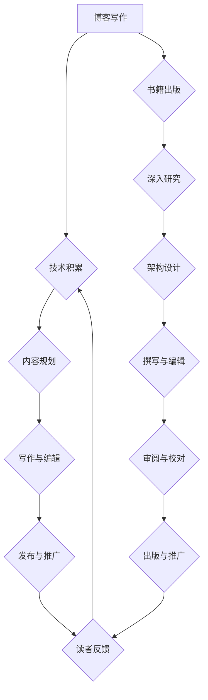

                 

## 技术写作：从博客到出版图书

> 关键词：技术写作，博客，书籍出版，技术内容，读者理解，结构清晰，代码示例，数学模型，项目实践，工具推荐

### 1. 背景介绍

在当今科技日新月异的时代，技术写作扮演着越来越重要的角色。无论是分享最新技术成果、记录开发经验还是普及科学知识，清晰、准确、易懂的技术写作都至关重要。从个人博客到专业书籍，技术写作的领域广阔，对技术人员、研究者和爱好者来说都是一项必备的技能。

随着互联网的普及，博客成为了技术人员分享知识和经验的平台。通过博客，技术人员可以与全球的读者交流，建立个人品牌，并获得认可和尊重。然而，仅仅拥有博客并不能保证成功。要想在技术写作领域脱颖而出，需要具备扎实的写作基础、专业的技术知识和对读者需求的深刻理解。

出版技术书籍则更具挑战性，它需要更系统的架构、更深入的理论分析和更完善的代码示例。一本优秀的技术书籍不仅要传授知识，更要引领读者思考，激发他们的学习兴趣。

### 2. 核心概念与联系

技术写作的核心概念包括：

* **清晰简洁:**  避免使用过于专业的术语，采用通俗易懂的语言，使读者能够轻松理解。
* **结构清晰:**  文章结构要合理，层次分明，使用标题、子标题、列表等方式引导读者阅读。
* **逻辑严谨:**  文章内容要逻辑严密，论证要充分，避免出现前后矛盾或逻辑跳跃的情况。
* **代码示例:**  对于技术性内容，要结合代码示例进行讲解，使读者能够更直观地理解。
* **数学模型:**  对于需要数学模型支撑的技术内容，要进行数学模型的构建和公式推导，并结合案例进行讲解。
* **项目实践:**  要结合实际项目进行讲解，使读者能够将理论知识应用到实践中。

**Mermaid 流程图:**

### 3. 核心算法原理 & 具体操作步骤

#### 3.1  算法原理概述

算法是解决特定问题的一系列步骤，是计算机程序的核心。技术写作中，需要对算法进行清晰的描述，使读者能够理解算法的原理和工作机制。

#### 3.2  算法步骤详解

算法步骤的描述要详细、准确、易懂。可以使用自然语言、流程图或伪代码等方式进行描述。

#### 3.3  算法优缺点

算法的优缺点需要进行分析，包括时间复杂度、空间复杂度、易实现性等方面。

#### 3.4  算法应用领域

算法的应用领域需要进行说明，例如，该算法可以应用于图像处理、数据分析、机器学习等领域。

### 4. 数学模型和公式 & 详细讲解 & 举例说明

#### 4.1  数学模型构建

数学模型是描述客观现象的抽象工具，在技术写作中，可以用来解释算法原理、分析数据结构或预测系统行为。

#### 4.2  公式推导过程

数学公式的推导过程需要清晰、严谨，并进行详细的解释，使读者能够理解公式的含义和应用。

#### 4.3  案例分析与讲解

通过具体的案例分析，可以更直观地展示数学模型的应用效果，并加深读者对公式的理解。

**例如：**

在机器学习领域，线性回归模型是一个常用的算法。其数学模型可以表示为：

$$
y = \theta_0 + \theta_1x_1 + \theta_2x_2 + ... + \theta_nx_n + \epsilon
$$

其中：

* $y$ 是预测值
* $\theta_0, \theta_1, ..., \theta_n$ 是模型参数
* $x_1, x_2, ..., x_n$ 是输入特征
* $\epsilon$ 是误差项

通过最小化误差函数，可以求解模型参数，从而建立一个能够预测输出值的线性模型。

### 5. 项目实践：代码实例和详细解释说明

#### 5.1  开发环境搭建

项目实践需要选择合适的开发环境，例如，Python环境、Java环境等。

#### 5.2  源代码详细实现

需要提供项目代码的详细实现，并进行注释，使读者能够理解代码的逻辑和功能。

#### 5.3  代码解读与分析

对代码进行解读和分析，解释代码的各个模块和函数的功能，并说明代码的优缺点。

#### 5.4  运行结果展示

展示项目运行的结果，例如，图表、数据分析等，并进行解释。

### 6. 实际应用场景

#### 6.1  案例分析

通过具体的案例分析，展示算法或技术的实际应用场景，并说明其带来的价值。

#### 6.2  未来应用展望

展望算法或技术的未来应用方向，并进行分析和预测。

### 7. 工具和资源推荐

#### 7.1  学习资源推荐

推荐一些相关的学习资源，例如，书籍、在线课程、博客等。

#### 7.2  开发工具推荐

推荐一些相关的开发工具，例如，IDE、版本控制工具、测试工具等。

#### 7.3  相关论文推荐

推荐一些相关的论文，以便读者进行更深入的研究。

### 8. 总结：未来发展趋势与挑战

#### 8.1  研究成果总结

总结文章的主要研究成果，并进行概括和分析。

#### 8.2  未来发展趋势

展望技术写作的未来发展趋势，例如，人工智能、虚拟现实等技术的应用。

#### 8.3  面临的挑战

分析技术写作面临的挑战，例如，信息爆炸、读者碎片化等。

#### 8.4  研究展望

提出未来的研究方向和展望，例如，如何提高技术写作的质量、如何更好地服务读者等。

### 9. 附录：常见问题与解答

解答一些常见的技术写作问题，例如，如何选择合适的写作风格、如何进行代码注释等。

## 作者：禅与计算机程序设计艺术 / Zen and the Art of Computer Programming

<end_of_turn>

