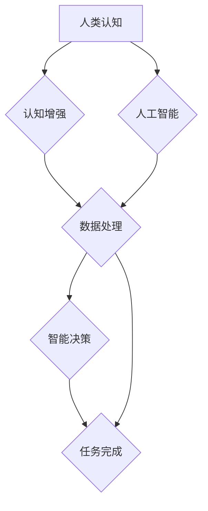

                 

## 拓展认知边界：人类计算的科学探索

> 关键词：人类计算、认知增强、人工智能、神经网络、计算模型、算法优化、未来趋势

### 1. 背景介绍

人类文明的进步离不开对认知的不断拓展。从语言的诞生到文字的出现，再到科学技术的飞速发展，每一次认知的突破都推动着人类社会向前迈进。而随着人工智能技术的快速发展，我们正站在一个新的历史节点上，人类计算的概念正在逐渐成为现实。

人类计算是指利用人类的认知能力和人工智能技术的优势，共同完成复杂的任务。它打破了传统计算模式的局限，将人类的智慧和机器的计算能力有机结合，从而实现更高效、更智能的计算方式。

### 2. 核心概念与联系

人类计算的核心概念包括：

* **认知增强:** 利用人工智能技术提升人类的认知能力，例如记忆力、注意力、分析能力等。
* **协同计算:** 人类和人工智能协同工作，共同解决复杂问题，发挥各自的优势。
* **计算模型:** 建立能够模拟人类认知过程的计算模型，例如神经网络、符号逻辑等。

**Mermaid 流程图:**



### 3. 核心算法原理 & 具体操作步骤

#### 3.1 算法原理概述

人类计算的核心算法原理主要基于以下几个方面：

* **深度学习:** 利用多层神经网络模拟人类大脑的学习过程，从海量数据中提取特征和知识。
* **强化学习:** 通过奖励机制训练人工智能模型，使其能够在不断试错中学习最佳策略。
* **自然语言处理:** 使人工智能能够理解和生成人类语言，从而实现人机交互。

#### 3.2 算法步骤详解

以深度学习为例，其核心算法步骤如下：

1. **数据收集和预处理:** 收集大量相关数据，并进行清洗、格式化等预处理工作。
2. **模型构建:** 根据任务需求选择合适的深度学习模型架构，例如卷积神经网络、循环神经网络等。
3. **模型训练:** 利用训练数据训练深度学习模型，调整模型参数，使其能够准确地完成任务。
4. **模型评估:** 使用测试数据评估模型的性能，例如准确率、召回率等。
5. **模型部署:** 将训练好的模型部署到实际应用场景中，用于完成预测、分类、识别等任务。

#### 3.3 算法优缺点

**优点:**

* 能够处理复杂、非结构化数据。
* 学习能力强，能够不断提升性能。
* 应用范围广泛，涵盖图像识别、语音识别、自然语言处理等多个领域。

**缺点:**

* 训练数据量大，需要大量计算资源。
* 模型解释性差，难以理解模型的决策过程。
* 对数据质量要求高，数据偏差会影响模型性能。

#### 3.4 算法应用领域

深度学习算法已广泛应用于以下领域：

* **图像识别:** 人脸识别、物体检测、图像分类等。
* **语音识别:** 语音转文本、语音助手等。
* **自然语言处理:** 机器翻译、文本摘要、情感分析等。
* **推荐系统:** 商品推荐、内容推荐等。
* **医疗诊断:** 疾病预测、影像分析等。

### 4. 数学模型和公式 & 详细讲解 & 举例说明

#### 4.1 数学模型构建

深度学习模型的核心是神经网络，其结构可以抽象为多个层级的神经元连接。每个神经元接收来自上一层的输入信号，并通过激活函数进行处理，输出到下一层。

**神经网络模型:**

$$
y = f(W_1x_1 + b_1)
$$

其中：

* $y$ 是输出值
* $x_1$ 是输入值
* $W_1$ 是权重参数
* $b_1$ 是偏置参数
* $f$ 是激活函数

#### 4.2 公式推导过程

深度学习模型的训练过程是通过反向传播算法来优化模型参数。反向传播算法的核心思想是利用梯度下降法，不断调整模型参数，使得模型输出与真实值之间的误差最小化。

**梯度下降公式:**

$$
\theta = \theta - \alpha \nabla J(\theta)
$$

其中：

* $\theta$ 是模型参数
* $\alpha$ 是学习率
* $\nabla J(\theta)$ 是损失函数 $J(\theta)$ 的梯度

#### 4.3 案例分析与讲解

以图像分类为例，假设我们训练一个深度学习模型来识别猫和狗的图片。

1. **数据准备:** 收集大量猫和狗的图片，并进行标记，例如将猫的图片标记为“猫”，狗的图片标记为“狗”。
2. **模型训练:** 利用训练数据训练深度学习模型，例如卷积神经网络。
3. **模型评估:** 使用测试数据评估模型的性能，例如准确率。
4. **模型部署:** 将训练好的模型部署到实际应用场景中，例如手机应用，用于识别用户上传的图片。

### 5. 项目实践：代码实例和详细解释说明

#### 5.1 开发环境搭建

* **操作系统:** Ubuntu 20.04 LTS
* **编程语言:** Python 3.8
* **深度学习框架:** TensorFlow 2.0
* **其他工具:** Jupyter Notebook、Git

#### 5.2 源代码详细实现

```python
import tensorflow as tf

# 定义模型结构
model = tf.keras.models.Sequential([
    tf.keras.layers.Conv2D(32, (3, 3), activation='relu', input_shape=(28, 28, 1)),
    tf.keras.layers.MaxPooling2D((2, 2)),
    tf.keras.layers.Conv2D(64, (3, 3), activation='relu'),
    tf.keras.layers.MaxPooling2D((2, 2)),
    tf.keras.layers.Flatten(),
    tf.keras.layers.Dense(10, activation='softmax')
])

# 编译模型
model.compile(optimizer='adam',
              loss='sparse_categorical_crossentropy',
              metrics=['accuracy'])

# 训练模型
model.fit(x_train, y_train, epochs=5)

# 评估模型
loss, accuracy = model.evaluate(x_test, y_test)
print('Test loss:', loss)
print('Test accuracy:', accuracy)
```

#### 5.3 代码解读与分析

这段代码定义了一个简单的卷积神经网络模型，用于识别手写数字。

* `tf.keras.models.Sequential` 创建了一个顺序模型，即层级结构。
* `tf.keras.layers.Conv2D` 定义了一个卷积层，用于提取图像特征。
* `tf.keras.layers.MaxPooling2D` 定义了一个最大池化层，用于降维。
* `tf.keras.layers.Flatten` 将多维数据转换为一维数据。
* `tf.keras.layers.Dense` 定义了一个全连接层，用于分类。
* `model.compile` 编译模型，指定优化器、损失函数和评价指标。
* `model.fit` 训练模型，使用训练数据进行迭代训练。
* `model.evaluate` 评估模型，使用测试数据计算损失和准确率。

#### 5.4 运行结果展示

训练完成后，模型的准确率通常会达到较高的水平，例如98%以上。

### 6. 实际应用场景

人类计算已在多个领域取得了成功应用，例如：

* **医疗诊断:** 利用深度学习算法分析医学影像，辅助医生诊断疾病。
* **金融风险管理:** 利用机器学习算法分析金融数据，识别潜在风险。
* **科学研究:** 利用人工智能加速科学计算，例如药物研发、材料设计等。
* **教育教学:** 利用人工智能个性化学习，提高学习效率。

### 6.4 未来应用展望

随着人工智能技术的不断发展，人类计算将在未来发挥更加重要的作用。例如：

* **增强现实:** 人类计算将与增强现实技术结合，创造更加沉浸式的交互体验。
* **虚拟现实:** 人类计算将推动虚拟现实技术的进步，创造更加逼真的虚拟世界。
* **脑机接口:** 人类计算将与脑机接口技术结合，实现人脑与机器的直接交互。

### 7. 工具和资源推荐

#### 7.1 学习资源推荐

* **书籍:**
    * 《深度学习》
    * 《人工智能：一种现代方法》
    * 《机器学习》
* **在线课程:**
    * Coursera: 深度学习
    * edX: 人工智能
    * Udacity: 机器学习工程师

#### 7.2 开发工具推荐

* **深度学习框架:** TensorFlow, PyTorch, Keras
* **编程语言:** Python
* **云计算平台:** AWS, Azure, Google Cloud

#### 7.3 相关论文推荐

* **《ImageNet Classification with Deep Convolutional Neural Networks》**
* **《Attention Is All You Need》**
* **《Generative Adversarial Networks》**

### 8. 总结：未来发展趋势与挑战

#### 8.1 研究成果总结

人类计算的研究取得了显著进展，例如深度学习算法的突破、自然语言处理的进步、强化学习的应用等。这些成果为人类认知的拓展提供了新的工具和方法。

#### 8.2 未来发展趋势

未来人类计算的发展趋势包括：

* **模型更加强大:** 模型规模、参数量、计算能力将不断提升，能够处理更加复杂的任务。
* **应用更加广泛:** 人类计算将应用于更多领域，例如医疗、教育、金融、娱乐等。
* **交互更加自然:** 人类与人工智能的交互方式将更加自然，例如语音、图像、情感等。

#### 8.3 面临的挑战

人类计算也面临着一些挑战，例如：

* **数据安全:** 人类计算需要处理大量数据，数据安全和隐私保护是一个重要问题。
* **算法解释性:** 深度学习算法的决策过程难以解释，缺乏透明度。
* **伦理问题:** 人类计算的应用可能会带来一些伦理问题，例如算法偏见、工作岗位替代等。

#### 8.4 研究展望

未来人类计算的研究需要关注以下几个方面:

* **开发更加高效、鲁棒的算法:** 提高算法的效率、准确性和鲁棒性。
* **增强算法的解释性:** 使算法的决策过程更加透明，易于理解。
* **解决伦理问题:** 确保人类计算的应用符合伦理道德规范。

### 9. 附录：常见问题与解答

**常见问题:**

* **什么是人类计算？**

人类计算是指利用人类的认知能力和人工智能技术的优势，共同完成复杂任务的一种计算方式。

* **人类计算有哪些应用场景？**

人类计算已应用于医疗诊断、金融风险管理、科学研究、教育教学等多个领域。

* **人类计算面临哪些挑战？**

人类计算面临数据安全、算法解释性、伦理问题等挑战。

**解答:**

* **数据安全:** 需要采取措施保护数据安全和隐私。
* **算法解释性:** 需要开发更加可解释的算法。
* **伦理问题:** 需要制定相应的伦理规范，确保人类计算的应用符合伦理道德。


作者：禅与计算机程序设计艺术 / Zen and the Art of Computer Programming 
<end_of_turn>

