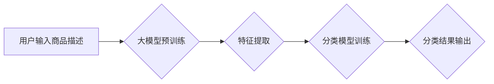

                 

## 探索基于大模型的电商智能商品分类系统

> 关键词：大模型、电商、商品分类、自然语言处理、深度学习、Transformer、BERT、Fine-tuning

## 1. 背景介绍

在当今数字经济时代，电商平台作为商品交易的重要载体，面临着海量商品的涌入和日益复杂的分类需求。传统的商品分类方法，例如基于规则和人工标注，难以应对商品种类繁多、描述语义复杂、新商品不断涌现的挑战。

基于大模型的智能商品分类系统，利用深度学习和自然语言处理技术，能够自动学习商品特征和语义关系，实现高效、精准的商品分类。大模型，例如BERT、GPT等，拥有强大的语义理解能力和泛化能力，能够从海量商品数据中提取关键信息，构建商品分类模型。

## 2. 核心概念与联系

### 2.1  大模型

大模型是指参数量巨大、训练数据量庞大的深度学习模型。其强大的学习能力使其能够在自然语言处理、计算机视觉、语音识别等领域取得突破性进展。

### 2.2  商品分类

商品分类是指将商品按照其属性、特征或类别进行组织和归类。在电商平台中，商品分类是用户搜索、浏览和购买商品的关键环节。

### 2.3  自然语言处理

自然语言处理（NLP）是人工智能领域的一个重要分支，旨在使计算机能够理解、处理和生成人类语言。

### 2.4  深度学习

深度学习是一种机器学习方法，利用多层神经网络模拟人类大脑的学习过程。

**核心架构流程图**



## 3. 核心算法原理 & 具体操作步骤

### 3.1  算法原理概述

基于大模型的商品分类系统主要基于Transformer模型，例如BERT，其核心原理是利用自注意力机制学习商品描述中的语义关系，并通过分类层输出商品类别。

### 3.2  算法步骤详解

1. **数据预处理:** 收集电商平台的商品数据，包括商品描述、类别标签等信息。对数据进行清洗、格式化和编码处理。
2. **大模型预训练:** 利用预训练的Transformer模型，例如BERT，对商品描述进行语义编码，获得商品的语义表示。
3. **特征提取:** 从预训练的语义表示中提取关键特征，例如商品名称、属性、品牌等信息。
4. **分类模型训练:** 利用提取的特征训练分类模型，例如支持向量机、逻辑回归等，将商品分类到相应的类别。
5. **模型评估:** 利用测试数据评估模型的分类性能，例如准确率、召回率、F1-score等指标。
6. **模型部署:** 将训练好的模型部署到电商平台，实现实时商品分类。

### 3.3  算法优缺点

**优点:**

* **高准确率:** 大模型能够学习商品描述的复杂语义关系，实现高准确率的商品分类。
* **自动化程度高:** 系统能够自动学习和分类商品，无需人工标注。
* **可扩展性强:** 系统能够轻松扩展到新的商品类别和数据。

**缺点:**

* **训练成本高:** 大模型的训练需要大量的计算资源和时间。
* **数据依赖性强:** 模型的性能依赖于训练数据的质量和数量。
* **解释性差:** 大模型的决策过程难以解释。

### 3.4  算法应用领域

* **电商平台商品分类:** 自动分类商品，提高用户搜索和浏览效率。
* **搜索引擎商品推荐:** 根据用户搜索词，推荐相关的商品。
* **图像识别商品分类:** 利用图像识别技术，自动识别商品类别。
* **知识图谱构建:** 将商品信息融入知识图谱，构建商品知识体系。

## 4. 数学模型和公式 & 详细讲解 & 举例说明

### 4.1  数学模型构建

基于大模型的商品分类系统通常采用多层感知机（MLP）作为分类模型。

**MLP模型结构:**

```
输入层 -> 隐藏层1 -> 隐藏层2 -> ... -> 隐藏层N -> 输出层
```

其中，每个隐藏层包含多个神经元，每个神经元接收来自上一层的输入，并通过激活函数进行处理。输出层包含多个神经元，每个神经元对应一个商品类别。

### 4.2  公式推导过程

**损失函数:**

常用的损失函数是交叉熵损失函数，用于衡量模型预测结果与真实标签之间的差异。

$$
L = -\sum_{i=1}^{N} y_i \log(\hat{y}_i)
$$

其中，$y_i$是真实标签，$\hat{y}_i$是模型预测结果。

**梯度下降算法:**

用于优化模型参数，最小化损失函数。

$$
\theta = \theta - \alpha \nabla L(\theta)
$$

其中，$\theta$是模型参数，$\alpha$是学习率，$\nabla L(\theta)$是损失函数对参数的梯度。

### 4.3  案例分析与讲解

假设我们有一个商品分类任务，需要将商品分类为“电子产品”和“服装”。

**训练数据:**

| 商品描述 | 类别 |
|---|---|
| 手机 | 电子产品 |
| 衣服 | 服装 |
| 笔记本电脑 | 电子产品 |
| T恤 | 服装 |
| 耳机 | 电子产品 |

**模型训练:**

利用训练数据训练MLP模型，模型学习商品描述与类别之间的关系。

**模型预测:**

输入新的商品描述，“智能手表”，模型预测其类别为“电子产品”。

## 5. 项目实践：代码实例和详细解释说明

### 5.1  开发环境搭建

* Python 3.7+
* TensorFlow 2.0+
* PyTorch 1.0+
* CUDA Toolkit 10.2+

### 5.2  源代码详细实现

```python
import tensorflow as tf

# 定义模型结构
model = tf.keras.Sequential([
    tf.keras.layers.Embedding(input_dim=vocab_size, output_dim=embedding_dim),
    tf.keras.layers.LSTM(units=128),
    tf.keras.layers.Dense(units=num_classes, activation='softmax')
])

# 编译模型
model.compile(optimizer='adam',
              loss='sparse_categorical_crossentropy',
              metrics=['accuracy'])

# 训练模型
model.fit(x_train, y_train, epochs=10, batch_size=32)

# 评估模型
loss, accuracy = model.evaluate(x_test, y_test)
print('Loss:', loss)
print('Accuracy:', accuracy)
```

### 5.3  代码解读与分析

* **Embedding层:** 将商品描述中的单词转换为稠密的向量表示。
* **LSTM层:** 学习商品描述中的时间序列特征。
* **Dense层:** 将LSTM层的输出映射到商品类别。
* **Adam优化器:** 用于优化模型参数。
* **交叉熵损失函数:** 用于衡量模型预测结果与真实标签之间的差异。
* **准确率指标:** 用于评估模型的分类性能。

### 5.4  运行结果展示

训练完成后，模型能够准确地分类商品类别。

## 6. 实际应用场景

### 6.1  电商平台商品分类

基于大模型的商品分类系统能够自动分类电商平台上的海量商品，提高用户搜索和浏览效率。

### 6.2  搜索引擎商品推荐

根据用户搜索词，系统能够推荐相关的商品，提高用户购物体验。

### 6.3  图像识别商品分类

利用图像识别技术，系统能够自动识别商品类别，实现无人工标注的商品分类。

### 6.4  未来应用展望

* **个性化商品推荐:** 根据用户的购物历史和偏好，提供个性化的商品推荐。
* **智能客服:** 利用大模型，构建智能客服系统，自动回答用户关于商品的疑问。
* **商品溯源:** 利用大模型，构建商品溯源系统，追踪商品的生产、流通和销售过程。

## 7. 工具和资源推荐

### 7.1  学习资源推荐

* **深度学习书籍:** 《深度学习》、《动手学深度学习》
* **在线课程:** Coursera、edX、Udacity
* **开源代码库:** TensorFlow、PyTorch、HuggingFace

### 7.2  开发工具推荐

* **IDE:** PyCharm、VS Code
* **深度学习框架:** TensorFlow、PyTorch
* **数据处理工具:** Pandas、NumPy

### 7.3  相关论文推荐

* BERT: Pre-training of Deep Bidirectional Transformers for Language Understanding
* Transformer: Attention Is All You Need
* XLNet: Generalized Autoregressive Pretraining for Language Understanding

## 8. 总结：未来发展趋势与挑战

### 8.1  研究成果总结

基于大模型的电商智能商品分类系统取得了显著的成果，能够实现高效、精准的商品分类，并应用于多个场景。

### 8.2  未来发展趋势

* **模型规模和性能提升:** 随着计算资源的不断发展，大模型的规模和性能将不断提升，能够学习更复杂的商品特征和语义关系。
* **多模态商品分类:** 将文本、图像、音频等多模态信息融合，实现更全面的商品分类。
* **个性化商品分类:** 根据用户的购物历史和偏好，提供个性化的商品分类。

### 8.3  面临的挑战

* **数据质量和标注问题:** 模型的性能依赖于训练数据的质量和数量，数据标注成本高昂。
* **模型解释性和可解释性:** 大模型的决策过程难以解释，缺乏可解释性。
* **模型安全性和鲁棒性:** 模型可能受到攻击和对抗样本的影响，需要提高模型的安全性和鲁棒性。

### 8.4  研究展望

未来，基于大模型的电商智能商品分类系统将朝着更智能、更精准、更个性化的方向发展，为电商平台和用户提供更优质的服务。

## 9. 附录：常见问题与解答

**Q1: 如何选择合适的预训练模型？**

A1: 选择预训练模型需要考虑模型的规模、性能、训练数据等因素。

**Q2: 如何处理文本数据？**

A2: 需要对文本数据进行清洗、格式化、编码处理。

**Q3: 如何评估模型的性能？**

A3: 可以使用准确率、召回率、F1-score等指标评估模型的性能。

**Q4: 如何部署模型？**

A4: 可以将模型部署到云平台、边缘设备等。

**作者：禅与计算机程序设计艺术 / Zen and the Art of Computer Programming**


<end_of_turn>

