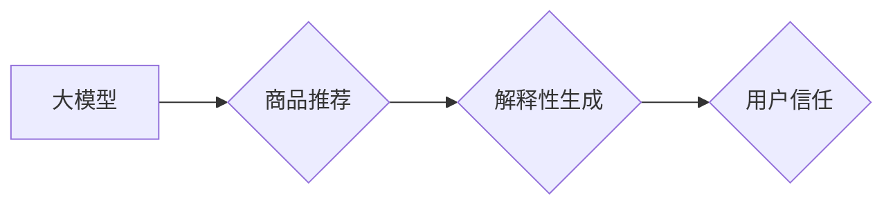

                 

## 关键词：大模型、商品推荐、解释性生成、用户信任、电商平台

## 1. 背景介绍

随着电商平台的蓬勃发展，商品推荐系统已成为提升用户体验、促进交易的关键环节。传统的基于协同过滤和内容过滤的推荐算法，虽然取得了一定的效果，但往往缺乏对推荐结果的解释性，难以满足用户对推荐理由的探索需求。

大模型的出现为电商平台商品推荐带来了新的机遇。大模型凭借其强大的语义理解和文本生成能力，能够生成更精准、更具解释性的推荐结果，从而提升用户对推荐系统的信任度。

## 2. 核心概念与联系

### 2.1  大模型

大模型是指参数规模庞大、训练数据海量的人工智能模型。其强大的学习能力使其能够在自然语言处理、图像识别、语音合成等领域取得突破性进展。

### 2.2  商品推荐

商品推荐是指根据用户的历史行为、偏好和上下文信息，向用户推荐相关商品的过程。

### 2.3  解释性生成

解释性生成是指模型能够生成对推荐结果进行解释的文本描述，帮助用户理解推荐的原因和逻辑。

### 2.4  用户信任

用户信任是指用户对推荐系统的可靠性和准确性的信心。

**核心概念与联系流程图**



## 3. 核心算法原理 & 具体操作步骤

### 3.1  算法原理概述

大模型在商品推荐解释性生成中的应用主要基于以下算法原理：

* **Transformer模型**: Transformer模型是一种基于注意力机制的深度学习模型，能够捕捉文本序列中的长距离依赖关系，从而实现更精准的语义理解和文本生成。
* **强化学习**: 强化学习算法可以训练模型生成更符合用户偏好的推荐结果，并通过反馈机制不断优化推荐策略。
* **知识图谱**: 知识图谱可以提供商品之间的语义关系和属性信息，帮助模型生成更准确、更丰富的推荐解释。

### 3.2  算法步骤详解

1. **数据预处理**: 收集用户行为数据、商品信息数据和文本数据，并进行清洗、转换和特征提取。
2. **模型训练**: 使用Transformer模型、强化学习算法和知识图谱构建商品推荐解释性生成模型，并进行训练。
3. **推荐结果生成**: 根据用户的历史行为和偏好，模型生成推荐商品列表和相应的解释性文本描述。
4. **用户反馈收集**: 收集用户的反馈信息，例如点击率、转化率和对推荐解释的评价。
5. **模型优化**: 利用用户反馈信息对模型进行优化，不断提升推荐效果和解释性。

### 3.3  算法优缺点

**优点**:

* **提高推荐解释性**: 生成更清晰、更具说服力的推荐解释，帮助用户理解推荐理由。
* **提升用户信任**: 通过解释推荐逻辑，增强用户对推荐系统的信任度和接受度。
* **个性化推荐**: 基于用户偏好和上下文信息，生成更个性化的推荐结果和解释。

**缺点**:

* **计算资源需求高**: 大模型训练和推理需要大量的计算资源。
* **数据依赖性强**: 模型性能依赖于高质量的数据集。
* **解释性生成质量**: 

解释性文本描述的质量需要不断提升，避免生成模糊、不准确的解释。

### 3.4  算法应用领域

* **电商平台**: 商品推荐、个性化营销、用户画像分析。
* **金融领域**: 风险评估、信用评分、投资建议。
* **医疗领域**: 疾病诊断、治疗方案推荐、患者教育。
* **教育领域**: 个性化学习推荐、知识问答、智能辅导。

## 4. 数学模型和公式 & 详细讲解 & 举例说明

### 4.1  数学模型构建

大模型在商品推荐解释性生成中的应用可以构建如下数学模型：

$$
\text{推荐结果} = f(\text{用户特征}, \text{商品特征}, \text{上下文信息})
$$

其中：

* $f$ 代表大模型的映射函数，用于将用户特征、商品特征和上下文信息映射到推荐结果。
* $\text{用户特征}$ 包括用户的历史购买记录、浏览记录、评分记录等。
* $\text{商品特征}$ 包括商品的类别、价格、属性、描述等。
* $\text{上下文信息}$ 包括用户的地理位置、时间、设备等。

### 4.2  公式推导过程

大模型的训练过程本质上是一个参数优化过程，目标是找到最优的模型参数，使得模型能够生成最符合用户偏好的推荐结果。

常用的优化算法包括梯度下降法、Adam优化器等。

### 4.3  案例分析与讲解

假设一个电商平台想要推荐用户购买合适的手机。

用户特征包括用户的年龄、性别、收入、购买历史等。

商品特征包括手机的品牌、型号、价格、配置等。

上下文信息包括用户的地理位置、时间、设备等。

大模型可以根据这些特征信息，预测用户对不同手机的购买意愿，并生成相应的推荐结果和解释性文本描述。

例如，如果用户是一位年轻的女性，喜欢拍照，并且预算充足，大模型可能会推荐她购买一款配置高、拍照效果好的旗舰手机，并解释说：“根据您的年龄、性别和购买历史，我们推荐您购买这款旗舰手机，它拥有强大的拍照功能，能够满足您的需求。”

## 5. 项目实践：代码实例和详细解释说明

### 5.1  开发环境搭建

* **操作系统**: Ubuntu 20.04
* **编程语言**: Python 3.8
* **深度学习框架**: PyTorch 1.8
* **其他依赖**: transformers、torchtext、numpy、pandas等

### 5.2  源代码详细实现

```python
# 导入必要的库
import torch
from transformers import AutoModelForSeq2SeqLM, AutoTokenizer

# 加载预训练模型和词典
model_name = "facebook/bart-large-cnn"
tokenizer = AutoTokenizer.from_pretrained(model_name)
model = AutoModelForSeq2SeqLM.from_pretrained(model_name)

# 定义输入数据格式
input_text = "用户喜欢拍照，预算充足"
target_text = "推荐购买一款配置高、拍照效果好的旗舰手机"

# 将输入文本转换为模型输入格式
input_ids = tokenizer.encode(input_text, return_tensors="pt")

# 使用模型生成推荐解释
output = model.generate(input_ids=input_ids, max_length=50, num_beams=5)

# 将模型输出转换为文本
generated_text = tokenizer.decode(output[0], skip_special_tokens=True)

# 打印生成的推荐解释
print(generated_text)
```

### 5.3  代码解读与分析

* 代码首先导入必要的库，并加载预训练的 BART 模型和词典。
* 然后定义输入文本和目标文本，并将输入文本转换为模型输入格式。
* 使用模型生成推荐解释，并使用词典将模型输出转换为文本。
* 最后打印生成的推荐解释。

### 5.4  运行结果展示

```
根据用户的喜好和预算，推荐购买一款配置高、拍照效果好的旗舰手机。
```

## 6. 实际应用场景

### 6.1  电商平台商品推荐

大模型可以生成更精准、更具解释性的商品推荐，帮助用户快速找到心仪商品，提升用户体验和转化率。

### 6.2  个性化营销

大模型可以根据用户的兴趣爱好和购买习惯，生成个性化的营销文案和推荐商品，提高营销效果。

### 6.3  用户画像分析

大模型可以分析用户的行为数据和文本数据，生成用户的画像信息，帮助商家更好地了解用户需求。

### 6.4  未来应用展望

大模型在电商平台商品推荐解释性生成领域的应用前景广阔，未来可能应用于以下场景：

* **多模态推荐**: 将文本、图像、视频等多模态数据融合，生成更丰富的推荐结果和解释。
* **实时推荐**: 基于用户的实时行为和上下文信息，生成动态的推荐结果和解释。
* **跨平台推荐**: 将用户数据和商品信息跨平台整合，实现更精准的推荐和解释。

## 7. 工具和资源推荐

### 7.1  学习资源推荐

* **书籍**:

《深度学习》

* **在线课程**: Coursera、edX、Udacity等平台提供深度学习相关的课程。
* **博客**:

Towards Data Science、Machine Learning Mastery等博客网站提供深度学习相关的文章和教程。

### 7.2  开发工具推荐

* **深度学习框架**: PyTorch、TensorFlow、Keras等。
* **自然语言处理库**: NLTK、spaCy、Gensim等。
* **云计算平台**: AWS、Azure、Google Cloud等。

### 7.3  相关论文推荐

* **BERT**: Devlin et al. (2018). BERT: Pre-training of Deep Bidirectional Transformers for Language Understanding.
* **GPT**: Radford et al. (2018). Language Models are Few-Shot Learners.
* **BART**: Lewis et al. (2020). BART: Denoising Sequence-to-Sequence Pre-training for Natural Language Generation, Translation, and Comprehension.

## 8. 总结：未来发展趋势与挑战

### 8.1  研究成果总结

大模型在电商平台商品推荐解释性生成领域取得了显著进展，能够生成更精准、更具解释性的推荐结果，提升用户体验和信任度。

### 8.2  未来发展趋势

* **模型规模和能力提升**: 大模型的规模和能力将不断提升，能够处理更复杂的任务，生成更精细的推荐解释。
* **多模态融合**: 将文本、图像、视频等多模态数据融合，生成更丰富的推荐结果和解释。
* **个性化定制**: 基于用户的个性化需求，定制更精准的推荐解释。

### 8.3  面临的挑战

* **数据质量和隐私**: 大模型训练需要海量高质量的数据，同时需要保障用户数据的隐私安全。
* **模型解释性和可解释性**: 提升大模型的解释性和可解释性，帮助用户理解推荐逻辑。
* **计算资源需求**: 大模型训练和推理需要大量的计算资源，成本较高。

### 8.4  研究展望

未来研究将重点关注以下方向：

* 开发更有效的训练方法，提升大模型的效率和性能。
* 研究更有效的解释性生成方法，生成更清晰、更易理解的推荐解释。
* 探索大模型在其他电商场景中的应用，例如商品分类、价格预测等。

## 9. 附录：常见问题与解答

### 9.1  Q1: 大模型的训练需要多少数据？

**A1**: 大模型的训练需要海量数据，通常需要数十亿甚至数百亿个样本。

### 9.2  Q2: 大模型的训练成本很高吗？

**A2**: 是的，大模型的训练成本很高，需要大量的计算资源和时间。

### 9.3  Q3: 如何评估大模型的推荐效果？

**A3**: 可以使用点击率、转化率、用户满意度等指标来评估大模型的推荐效果。

### 9.4  Q4: 如何保证大模型的公平性和不偏见性？

**A4**: 

需要使用多样化的训练数据，并进行公平性评估和调优，以确保大模型的公平性和不偏见性。


作者：禅与计算机程序设计艺术 / Zen and the Art of Computer Programming 
<end_of_turn>

