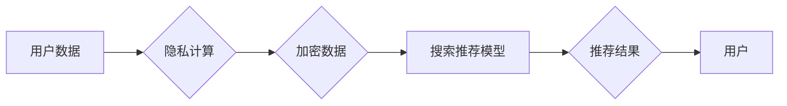

                 

## 1. 背景介绍

搜索推荐系统是互联网时代的核心技术之一，它通过分析用户行为和数据，为用户提供个性化的搜索结果和推荐内容。然而，随着大模型的兴起，搜索推荐系统面临着新的挑战：如何兼顾推荐精准度和用户隐私保护。

传统搜索推荐系统通常需要收集和分析大量用户数据，例如搜索历史、浏览记录、购买行为等，这些数据往往包含敏感个人信息。在数据隐私日益受到重视的今天，直接使用这些数据进行推荐可能会违反用户隐私，引发安全风险。

隐私计算技术应运而生，它旨在保护数据隐私的同时，仍然能够利用数据进行计算和分析。隐私计算通过加密、联邦学习等技术，使得数据在不泄露原始信息的情况下，能够被安全地共享和利用。

## 2. 核心概念与联系

### 2.1 隐私计算

隐私计算是指在不泄露原始数据的情况下，对数据进行计算和分析的技术。它通过多种技术手段，例如加密、联邦学习、差分隐私等，确保数据安全和隐私保护。

### 2.2 搜索推荐系统

搜索推荐系统是指通过分析用户行为和数据，为用户提供个性化搜索结果和推荐内容的系统。它通常包括以下几个模块：

* **数据采集:** 收集用户行为数据，例如搜索历史、浏览记录、购买行为等。
* **数据预处理:** 对收集到的数据进行清洗、转换和格式化。
* **模型训练:** 利用机器学习算法，训练推荐模型。
* **推荐生成:** 根据用户的特征和历史行为，生成个性化的推荐结果。

### 2.3 大模型

大模型是指参数量巨大、训练数据量庞大的深度学习模型。大模型通常具有强大的泛化能力和学习能力，能够在各种任务中取得优异的性能。

**Mermaid 流程图**



## 3. 核心算法原理 & 具体操作步骤

### 3.1 算法原理概述

隐私计算在搜索推荐系统中的应用主要基于以下几种算法原理：

* **联邦学习:** 将模型训练分散到多个数据持有者，每个数据持有者只训练自己的数据，并将模型参数上传到中央服务器进行聚合，最终得到全局模型。
* **差分隐私:** 通过添加噪声，对数据进行扰动，使得数据隐私得到保护，同时仍然能够进行统计分析。
* **同态加密:** 对数据进行加密，使得数据在加密状态下也能进行计算，保证数据隐私安全。

### 3.2 算法步骤详解

以联邦学习为例，其在搜索推荐系统中的具体操作步骤如下：

1. **数据分片:** 将原始用户数据进行分片，每个数据持有者负责训练自己的数据片段。
2. **模型初始化:** 在中央服务器上初始化一个全局模型。
3. **本地训练:** 每个数据持有者使用自己的数据片段，对全局模型进行本地训练，得到本地模型参数。
4. **参数聚合:** 每个数据持有者将本地模型参数上传到中央服务器，中央服务器对所有参数进行聚合，得到更新后的全局模型。
5. **模型更新:** 将更新后的全局模型返回给每个数据持有者，重复步骤3-4，直到模型收敛。

### 3.3 算法优缺点

**联邦学习**

* **优点:** 保护数据隐私，无需将原始数据共享。
* **缺点:** 训练效率较低，模型训练需要多次迭代。

**差分隐私**

* **优点:** 能够保证数据隐私，同时仍然能够进行统计分析。
* **缺点:** 可能会导致模型精度下降。

**同态加密**

* **优点:** 能够在加密状态下进行计算，保证数据隐私安全。
* **缺点:** 计算效率较低，对硬件资源要求较高。

### 3.4 算法应用领域

* **搜索推荐系统:** 为用户提供个性化推荐，同时保护用户隐私。
* **医疗健康:** 分析患者数据，进行疾病诊断和治疗方案推荐，保护患者隐私。
* **金融保险:** 分析用户财务数据，进行风险评估和个性化服务，保护用户隐私。

## 4. 数学模型和公式 & 详细讲解 & 举例说明

### 4.1 数学模型构建

联邦学习的数学模型可以概括为以下公式：

$$
\theta_t = \text{Agg}\left(\{w_i^t\}_{i=1}^n\right)
$$

其中：

* $\theta_t$ 表示第t轮迭代后的全局模型参数。
* $w_i^t$ 表示第i个数据持有者在第t轮迭代后的本地模型参数。
* $\text{Agg}$ 表示参数聚合函数，例如平均聚合。

### 4.2 公式推导过程

联邦学习的训练过程可以看作是一个迭代的过程，每个迭代轮次包含以下步骤：

1. **本地训练:** 每个数据持有者使用自己的数据片段，对全局模型参数进行本地训练，得到本地模型参数 $w_i^t$。
2. **参数聚合:** 每个数据持有者将本地模型参数 $w_i^t$ 上传到中央服务器，中央服务器对所有参数进行聚合，得到更新后的全局模型参数 $\theta_t$。

通过重复上述步骤，全局模型参数 $\theta_t$ 会逐渐收敛到最优解。

### 4.3 案例分析与讲解

假设有两个数据持有者，分别拥有用户数据A和用户数据B。

* 数据持有者A使用本地数据A训练模型，得到本地模型参数 $w_A^t$。
* 数据持有者B使用本地数据B训练模型，得到本地模型参数 $w_B^t$。
* 中央服务器将 $w_A^t$ 和 $w_B^t$ 进行平均聚合，得到更新后的全局模型参数 $\theta_t$。

$\theta_t = \frac{w_A^t + w_B^t}{2}$

## 5. 项目实践：代码实例和详细解释说明

### 5.1 开发环境搭建

* Python 3.7+
* TensorFlow 2.0+
* PyTorch 1.0+
* 虚拟环境

### 5.2 源代码详细实现

```python
# 联邦学习示例代码

import tensorflow as tf

# 定义模型
class RecommenderModel(tf.keras.Model):
    def __init__(self):
        super(RecommenderModel, self).__init__()
        self.dense1 = tf.keras.layers.Dense(64, activation='relu')
        self.dense2 = tf.keras.layers.Dense(32, activation='relu')
        self.output = tf.keras.layers.Dense(10)

    def call(self, inputs):
        x = self.dense1(inputs)
        x = self.dense2(x)
        return self.output(x)

# 定义联邦学习训练函数
def federated_train(models, data_splits, epochs):
    for epoch in range(epochs):
        for i, data_split in enumerate(data_splits):
            # 每个数据持有者本地训练
            model = models[i]
            model.fit(data_split['train'], epochs=1)
            # 将本地模型参数上传到中央服务器
            model_params = model.get_weights()
            # 中央服务器聚合模型参数
            # ...
        # 更新全局模型
        # ...

# 实例化模型和数据
model = RecommenderModel()
data_splits = [
    {'train': data_A},
    {'train': data_B}
]

# 训练模型
federated_train(models=[model], data_splits=data_splits, epochs=10)
```

### 5.3 代码解读与分析

* 代码首先定义了一个推荐模型 `RecommenderModel`，该模型使用深度学习架构进行训练。
* 然后定义了一个联邦学习训练函数 `federated_train`，该函数包含以下步骤：
    * 迭代训练多个轮次。
    * 每个轮次，每个数据持有者使用自己的数据片段进行本地训练。
    * 将本地模型参数上传到中央服务器进行聚合。
    * 更新全局模型参数。
* 最后，实例化模型和数据，并调用 `federated_train` 函数进行训练。

### 5.4 运行结果展示

训练完成后，可以评估全局模型的性能，例如准确率、召回率等。

## 6. 实际应用场景

### 6.1 搜索引擎推荐

搜索引擎可以利用隐私计算技术，对用户搜索历史和浏览记录进行分析，生成个性化的搜索结果推荐，同时保护用户隐私。

### 6.2 电商平台推荐

电商平台可以利用隐私计算技术，对用户购买历史和浏览记录进行分析，生成个性化的商品推荐，同时保护用户隐私。

### 6.3 内容平台推荐

内容平台可以利用隐私计算技术，对用户阅读历史和观看记录进行分析，生成个性化的内容推荐，同时保护用户隐私。

### 6.4 未来应用展望

随着隐私计算技术的不断发展，其在搜索推荐系统中的应用场景将会更加广泛，例如：

* **医疗健康:** 利用隐私计算技术，分析患者数据，进行疾病诊断和治疗方案推荐，同时保护患者隐私。
* **金融保险:** 利用隐私计算技术，分析用户财务数据，进行风险评估和个性化服务，同时保护用户隐私。
* **教育培训:** 利用隐私计算技术，分析学生学习数据，进行个性化学习推荐，同时保护学生隐私。

## 7. 工具和资源推荐

### 7.1 学习资源推荐

* **书籍:**
    * 《隐私计算》
    * 《联邦学习》
* **在线课程:**
    * Coursera: 隐私计算
    * edX: 联邦学习

### 7.2 开发工具推荐

* **TensorFlow Federated:** TensorFlow 的联邦学习框架
* **PySyft:** PyTorch 的隐私计算框架
* **OpenMined:** 开源隐私计算平台

### 7.3 相关论文推荐

* 《Federated Learning: Strategies for Improving Communication Efficiency》
* 《Differential Privacy》
* 《Secure Multi-Party Computation》

## 8. 总结：未来发展趋势与挑战

### 8.1 研究成果总结

隐私计算技术在搜索推荐系统中的应用取得了显著的成果，能够有效地保护用户隐私，同时仍然能够利用数据进行推荐。

### 8.2 未来发展趋势

* **模型效率提升:** 提高联邦学习和差分隐私等技术的效率，降低训练成本和时间。
* **隐私保护增强:** 研究更强大的隐私保护技术，例如同态加密和零知识证明，进一步增强数据隐私安全。
* **应用场景拓展:** 将隐私计算技术应用到更多搜索推荐场景，例如个性化广告推荐、内容推荐等。

### 8.3 面临的挑战

* **数据异构性:** 不同数据持有者的数据格式和结构可能不同，需要进行数据预处理和标准化。
* **模型训练效率:** 联邦学习和差分隐私等技术的训练效率较低，需要进一步优化。
* **隐私预算控制:** 差分隐私需要设置隐私预算，需要根据实际应用场景进行合理设置。

### 8.4 研究展望

未来，隐私计算技术将会继续发展，在搜索推荐系统中发挥越来越重要的作用。研究者需要继续探索更有效的隐私保护技术，提高模型训练效率，并将其应用到更多场景中。

## 9. 附录：常见问题与解答

### 9.1 Q1: 隐私计算和数据加密有什么区别？

**A1:** 隐私计算和数据加密都是为了保护数据隐私的技术，但它们的工作方式不同。数据加密将数据转换为不可读的形式，只有拥有解密密钥的人才能读取数据。而隐私计算则是在不泄露原始数据的情况下，对数据进行计算和分析。

### 9.2 Q2: 联邦学习的训练效率如何？

**A2:** 联邦学习的训练效率相对较低，因为需要多次迭代，每个迭代轮次都需要将模型参数上传和下载。但是，随着技术的不断发展，联邦学习的效率也在不断提高。

### 9.3 Q3: 差分隐私的隐私预算如何设置？

**A3:** 差分隐私的隐私预算需要根据实际应用场景进行合理设置。隐私预算越小，数据隐私保护越强，但模型精度可能会下降。


作者：禅与计算机程序设计艺术 / Zen and the Art of Computer Programming 
<end_of_turn>

