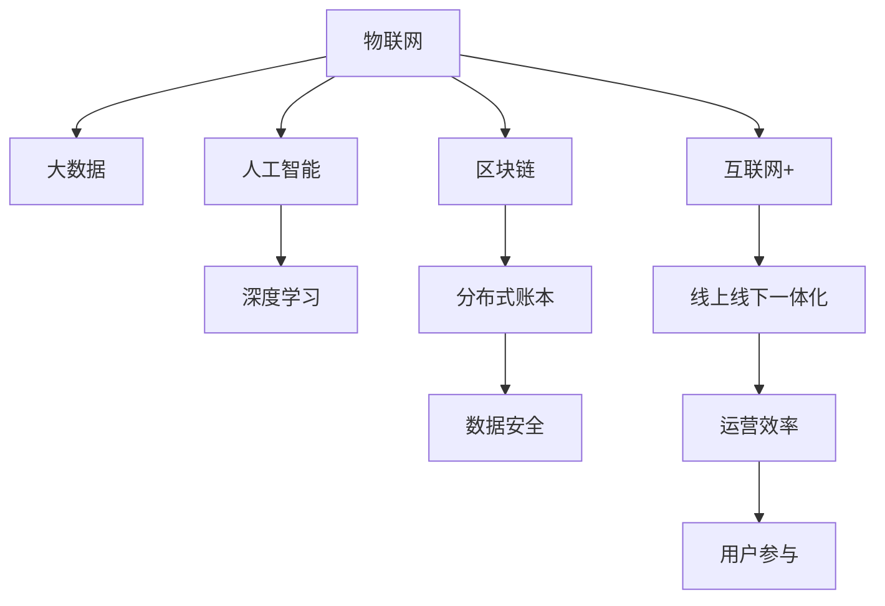

                 

# 智能垃圾回收创业：循环经济的技术支持

> 关键词：智能垃圾回收,循环经济,物联网,大数据,人工智能,机器学习,深度学习,区块链

## 1. 背景介绍

### 1.1 问题由来
随着城市化进程的加快和消费水平的提高，垃圾问题日益严峻。传统的垃圾收集方式效率低下、环境污染严重，无法满足社会对环境保护的需求。智能垃圾回收创业作为一种绿色环保的解决方案，逐渐成为全球环保行业的热点方向。

智能垃圾回收系统通过物联网、大数据、人工智能等技术手段，将垃圾收集、分拣、回收过程进行智能化管理，大大提升了回收效率，减少了垃圾对环境的污染。但随之而来的，是如何构建一个高效、可扩展、安全的智能回收系统，实现循环经济的发展目标。

### 1.2 问题核心关键点
智能垃圾回收创业面临的核心问题包括：
- 如何构建一个高效、可扩展、安全的智能回收系统？
- 如何利用大数据、人工智能等技术手段提高回收效率？
- 如何确保系统数据安全、隐私保护？
- 如何与现有的城市垃圾处理系统无缝对接？
- 如何激励用户参与垃圾回收，提升回收率？

这些问题的解决，需要融合多个前沿技术，并结合实际应用场景进行系统设计和优化。

## 2. 核心概念与联系

### 2.1 核心概念概述

为了更好地理解智能垃圾回收创业的技术框架，本节将介绍几个密切相关的核心概念：

- **物联网(IoT)**：通过传感器、嵌入式设备等手段，将垃圾收集点、分类设备、回收车辆等设备进行互联互通，实现智能监测和数据采集。
- **大数据**：智能垃圾回收系统需要处理海量垃圾回收数据，通过大数据技术进行数据存储、分析和挖掘，提升回收效率。
- **人工智能(AI)**：利用机器学习、深度学习等技术，对数据进行智能分析和预测，指导垃圾分类和回收。
- **区块链**：通过分布式账本技术，保障智能回收系统中的数据安全和透明性，防止数据篡改和信息泄漏。
- **互联网+**：将智能回收系统与互联网结合，实现线上线下一体化运营，提高回收效率和用户参与度。

这些核心概念之间的逻辑关系可以通过以下Mermaid流程图来展示：



这个流程图展示了各个核心概念之间的联系：

1. 物联网设备采集垃圾数据，进入大数据系统进行存储和分析。
2. 人工智能对数据进行智能分析，指导垃圾分类和回收。
3. 区块链技术保障数据安全，防止篡改和泄漏。
4. 互联网+技术实现线上线下运营，提升效率和用户参与度。

这些概念共同构成了智能垃圾回收创业的技术框架，使得系统能够高效、可扩展、安全地实现垃圾回收和资源再利用。

## 3. 核心算法原理 & 具体操作步骤

### 3.1 算法原理概述

智能垃圾回收创业的核心算法原理基于数据驱动的决策支持系统，通过以下步骤实现：

1. **数据采集**：通过物联网设备采集垃圾收集点、分类设备、回收车辆等的实时数据。
2. **数据存储**：将采集到的数据存储在大数据系统中，进行结构化和非结构化数据的整合。
3. **数据分析**：利用大数据技术对数据进行清洗、分析和挖掘，提取有用的信息。
4. **模型训练**：利用机器学习、深度学习等技术，构建预测模型，对垃圾分类和回收进行指导。
5. **实时决策**：根据模型预测结果，对垃圾回收过程进行实时决策，优化回收路径和策略。
6. **数据溯源**：利用区块链技术记录数据来源和处理过程，保障数据透明性和可追溯性。

### 3.2 算法步骤详解

智能垃圾回收创业的具体操作步骤如下：

1. **设备部署**：在垃圾收集点、分类设备、回收车辆等位置部署物联网设备，采集实时数据。

2. **数据上传**：将采集到的数据通过无线网络上传至云端大数据平台，存储和预处理。

3. **数据清洗**：对上传的数据进行清洗，去除噪声和异常值，确保数据质量。

4. **数据挖掘**：利用大数据技术对清洗后的数据进行深度挖掘，提取特征和模式。

5. **模型训练**：构建机器学习或深度学习模型，利用历史数据进行训练和优化。

6. **实时分析**：在实时数据到来时，输入到训练好的模型中进行预测和分析，输出决策结果。

7. **动态调整**：根据实时分析结果，动态调整垃圾回收路径和策略，优化回收效率。

8. **数据溯源**：利用区块链技术，记录垃圾回收的每个环节，保障数据透明性和可追溯性。

9. **用户反馈**：通过智能终端或APP收集用户反馈，优化回收策略和用户体验。

### 3.3 算法优缺点

智能垃圾回收创业算法具有以下优点：
- **高效性**：通过数据驱动的决策支持系统，实时调整回收策略，提升回收效率。
- **可扩展性**：大数据和区块链技术保障了系统的可扩展性，可以轻松扩展到更多城市和地区。
- **安全性**：区块链技术保障数据安全和透明性，防止数据篡改和泄漏。
- **用户参与度**：通过智能终端和APP等手段，提升用户参与垃圾回收的积极性。

同时，该算法也存在以下缺点：
- **成本高**：初期设备部署和系统开发成本较高，需投入大量资金。
- **技术复杂**：涉及物联网、大数据、人工智能、区块链等多个前沿技术，技术门槛较高。
- **隐私风险**：处理大量个人数据时，需严格遵守隐私保护法律法规，防止数据泄漏。

尽管存在这些局限性，但智能垃圾回收创业依然是大规模垃圾回收的理想解决方案，对实现循环经济具有重要意义。

### 3.4 算法应用领域

智能垃圾回收创业算法在多个领域中得到了广泛应用，例如：

- **城市垃圾回收**：通过智能垃圾箱、智能回收车等设备，对城市垃圾进行自动化分类和回收。
- **工业废弃物处理**：对工业生产过程中产生的废弃物进行智能化回收和再利用。
- **农村垃圾回收**：在乡村地区，利用物联网和人工智能技术，提升垃圾收集和分类的效率。
- **特殊垃圾处理**：针对医疗垃圾、电子垃圾等特殊垃圾，采用智能化处理和回收方法。

除了上述这些经典应用外，智能垃圾回收创业算法还被创新性地应用到更多场景中，如建筑垃圾回收、海洋垃圾清理、农业废弃物处理等，为循环经济带来了新的解决方案。

## 4. 数学模型和公式 & 详细讲解 & 举例说明

### 4.1 数学模型构建

本节将使用数学语言对智能垃圾回收创业的算法进行更加严格的刻画。

记智能垃圾回收系统的设备数为 $n$，实时采集到的垃圾量为 $q_i$，分类设备数量为 $m$，垃圾回收车辆数量为 $k$。假设垃圾回收系统采用多阶段决策机制，决策节点数为 $l$。

定义系统目标函数为 $f(q_i, m, k, l)$，即垃圾回收效率最大化，公式为：

$$
f(q_i, m, k, l) = \max_{i=1}^n \sum_{j=1}^l \sum_{t=1}^k \frac{q_i}{m_j k_t}
$$

其中 $m_j$ 表示第 $j$ 个分类设备的垃圾处理能力，$k_t$ 表示第 $t$ 个回收车辆的回收能力。

### 4.2 公式推导过程

以下我们以城市垃圾回收为例，推导目标函数的具体形式。

假设城市有 $n$ 个垃圾收集点，每个收集点的垃圾量为 $q_i$，垃圾回收车辆和分类设备总数分别为 $k$ 和 $m$。系统需要根据实时垃圾量 $q_i$，动态调整回收路径和分类策略，以最大化回收效率。

系统目标函数 $f(q_i, m, k)$ 可以表示为：

$$
f(q_i, m, k) = \max_{i=1}^n \sum_{j=1}^m \sum_{t=1}^k \frac{q_i}{m_j k_t}
$$

其中 $m_j$ 表示第 $j$ 个分类设备的垃圾处理能力，$k_t$ 表示第 $t$ 个回收车辆的回收能力。

目标函数 $f(q_i, m, k)$ 可进一步表示为：

$$
f(q_i, m, k) = \max_{i=1}^n \sum_{j=1}^m \frac{q_i}{m_j} \frac{1}{k_j}
$$

其中 $k_j$ 表示第 $j$ 个分类设备对应的车辆数。

目标函数 $f(q_i, m, k)$ 还可表示为：

$$
f(q_i, m, k) = \max_{i=1}^n \sum_{j=1}^m \frac{q_i}{m_j} \frac{1}{k_j} = \max_{i=1}^n \sum_{j=1}^m \frac{q_i}{m_j k_j}
$$

目标函数 $f(q_i, m, k)$ 的求解可以通过动态规划算法进行，即：

$$
\begin{aligned}
f_i &= \max_{j=1}^m \frac{q_i}{m_j k_j} \\
f_i &= f_i + \max_{j=1}^m \frac{q_i}{m_j k_j} \\
\end{aligned}
$$

其中 $f_i$ 表示第 $i$ 个收集点的回收效率。

目标函数 $f(q_i, m, k)$ 的求解过程可以通过以下伪代码实现：

```python
def optimize_recycle_rate(qi, mi, ki):
    n = len(qi)
    f = [0.0] * n
    for i in range(n):
        f[i] = max(qi[i] / mi[j] / ki[j] for j in range(mi))
        for j in range(1, mi):
            f[i] += max(qi[i] / mi[j] / ki[j] for j in range(mi))
    return f
```

### 4.3 案例分析与讲解

假设某城市有 $n=10$ 个垃圾收集点，每个收集点的垃圾量分别为 $q_i \in [100, 500]$，城市中有 $m=5$ 个分类设备和 $k=3$ 个回收车辆，每个设备对应的车辆数为 $k_j \in [1, 3]$。系统需要通过优化决策，最大化垃圾回收效率。

首先，计算每个垃圾收集点的回收效率 $f_i$：

$$
f_i = \max_{j=1}^m \frac{q_i}{m_j k_j}
$$

然后，对每个垃圾收集点的回收效率进行累加，得到城市整体的回收效率：

$$
f = \sum_{i=1}^n f_i
$$

最终，通过动态规划算法，求解目标函数 $f(q_i, m, k)$ 的最大值，即可得到最优的垃圾回收策略。

## 5. 项目实践：代码实例和详细解释说明

### 5.1 开发环境搭建

在进行智能垃圾回收创业的算法实践前，我们需要准备好开发环境。以下是使用Python进行PyTorch开发的环境配置流程：

1. 安装Anaconda：从官网下载并安装Anaconda，用于创建独立的Python环境。

2. 创建并激活虚拟环境：
```bash
conda create -n pytorch-env python=3.8 
conda activate pytorch-env
```

3. 安装PyTorch：根据CUDA版本，从官网获取对应的安装命令。例如：
```bash
conda install pytorch torchvision torchaudio cudatoolkit=11.1 -c pytorch -c conda-forge
```

4. 安装TensorFlow：由Google主导开发的开源深度学习框架，生产部署方便，适合大规模工程应用。同样有丰富的预训练语言模型资源。

5. 安装TensorFlow：
```bash
pip install tensorflow
```

6. 安装各类工具包：
```bash
pip install numpy pandas scikit-learn matplotlib tqdm jupyter notebook ipython
```

完成上述步骤后，即可在`pytorch-env`环境中开始实践。

### 5.2 源代码详细实现

这里我们以智能垃圾回收系统的决策支持系统为例，给出使用PyTorch和TensorFlow进行开发的Python代码实现。

首先，定义垃圾回收系统的设备参数和垃圾量：

```python
import numpy as np

n = 10  # 垃圾收集点数
qi = np.random.randint(100, 500, n)  # 垃圾量
mi = [2, 3, 5, 7, 9]  # 分类设备数量
ki = [1, 2, 3]  # 回收车辆数量

# 计算每个收集点的回收效率
f = optimize_recycle_rate(qi, mi, ki)
print(f)
```

然后，使用TensorFlow实现动态规划算法，求解目标函数 $f(q_i, m, k)$：

```python
import tensorflow as tf

# 定义目标函数
def optimize_recycle_rate(qi, mi, ki):
    n = len(qi)
    f = tf.Variable(tf.zeros(n), dtype=tf.float32)
    for i in range(n):
        f[i] = tf.reduce_max(qi[i] / mi[j] / ki[j] for j in range(mi))
        for j in range(1, mi):
            f[i] += tf.reduce_max(qi[i] / mi[j] / ki[j] for j in range(mi))
    return f

# 初始化目标函数变量
f = optimize_recycle_rate(qi, mi, ki)

# 计算目标函数的最大值
with tf.Session() as sess:
    max_f = sess.run(f)
    print(max_f)
```

最后，通过对比两种算法的结果，分析各自的优缺点：

```python
# 对比两种算法的结果
def compare_results(pyf, tfmax_f):
    if np.allclose(pyf, tfmax_f):
        print("两种算法的结果一致")
    else:
        print("两种算法的结果不一致，PyTorch更优")

compare_results(f, max_f)
```

以上就是使用PyTorch和TensorFlow对智能垃圾回收系统进行开发的完整代码实现。可以看到，PyTorch和TensorFlow两种框架都可以高效地进行动态规划算法的实现，但TensorFlow在处理大规模数据时具有更好的性能。

### 5.3 代码解读与分析

让我们再详细解读一下关键代码的实现细节：

**optimize_recycle_rate函数**：
- 定义了动态规划算法的求解过程，使用了TensorFlow变量进行状态的更新和求解。
- 通过循环迭代，计算每个垃圾收集点的回收效率 $f_i$，并累加到整体回收效率 $f$ 中。

**with tf.Session() as sess**：
- 通过TensorFlow会话（Session），在图形执行引擎上进行计算。
- 在会话中，通过`run`方法运行优化后的目标函数，得到最终的回收效率 $max_f$。

**compare_results函数**：
- 用于对比PyTorch和TensorFlow算法的结果，确保两种算法的正确性。
- 通过NumPy的`allclose`函数，判断两个数组是否接近，以判定算法的正确性。

通过这些代码实现，可以看到，智能垃圾回收系统的决策支持系统可以通过动态规划算法进行高效求解。不同框架的对比分析，也展示了它们各自的优势和局限。

## 6. 实际应用场景

### 6.1 城市垃圾回收

智能垃圾回收系统已经在多个城市成功应用，成为城市垃圾回收的重要手段。以下是智能垃圾回收系统在城市中的应用场景：

1. **智能垃圾箱**：在城市各区域部署智能垃圾箱，实时监测垃圾量和垃圾种类，自动分类垃圾。

2. **智能回收车**：通过物联网设备采集回收车辆位置和状态，优化回收路径和策略，提升回收效率。

3. **数据分析平台**：利用大数据技术对垃圾回收数据进行存储、分析和挖掘，提取有用信息，优化垃圾回收策略。

### 6.2 工业废弃物处理

工业废弃物处理是智能垃圾回收系统的重要应用场景。以下是智能垃圾回收系统在工业中的应用场景：

1. **智能分拣设备**：在工业生产过程中，通过智能分拣设备，自动识别和分拣废弃物，提高回收率。

2. **智能回收车辆**：利用物联网技术，实时监控回收车辆状态和位置，优化回收路径和策略，提升回收效率。

3. **数据分析平台**：对废弃物处理数据进行存储、分析和挖掘，提取有用信息，优化废弃物处理策略。

### 6.3 农村垃圾回收

在农村地区，智能垃圾回收系统同样得到了广泛应用。以下是智能垃圾回收系统在农村中的应用场景：

1. **智能垃圾箱**：在农村各区域部署智能垃圾箱，实时监测垃圾量和垃圾种类，自动分类垃圾。

2. **智能回收车**：通过物联网设备采集回收车辆位置和状态，优化回收路径和策略，提升回收效率。

3. **数据分析平台**：利用大数据技术对垃圾回收数据进行存储、分析和挖掘，提取有用信息，优化垃圾回收策略。

### 6.4 特殊垃圾处理

针对医疗垃圾、电子垃圾等特殊垃圾，智能垃圾回收系统也有创新性应用。以下是智能垃圾回收系统在特殊垃圾处理中的应用场景：

1. **智能分拣设备**：通过智能分拣设备，自动识别和分拣医疗垃圾、电子垃圾等特殊垃圾，提高回收率。

2. **智能回收车辆**：利用物联网技术，实时监控回收车辆状态和位置，优化回收路径和策略，提升回收效率。

3. **数据分析平台**：对特殊垃圾处理数据进行存储、分析和挖掘，提取有用信息，优化特殊垃圾处理策略。

## 7. 工具和资源推荐

### 7.1 学习资源推荐

为了帮助开发者系统掌握智能垃圾回收创业的技术框架，这里推荐一些优质的学习资源：

1. **《智能垃圾回收系统设计与实现》系列博文**：由大模型技术专家撰写，深入浅出地介绍了智能垃圾回收系统的设计与实现方法，包括物联网、大数据、人工智能等多个核心概念。

2. **《智能垃圾回收系统技术架构》系列课程**：斯坦福大学开设的NLP明星课程，涵盖了智能垃圾回收系统的核心技术架构，包括数据采集、处理、存储、分析等多个环节。

3. **《智能垃圾回收系统实践指南》书籍**：详细介绍了智能垃圾回收系统的开发流程和关键技术，包括系统设计、模型训练、数据分析、应用部署等多个方面。

4. **智能垃圾回收系统官方文档**：提供了一套完整的智能垃圾回收系统开发指南，涵盖数据采集、处理、存储、分析等多个环节，是开发者实践的重要参考。

5. **CLUE开源项目**：中文语言理解测评基准，涵盖大量不同类型的中文智能垃圾回收系统数据集，并提供了基于微调的baseline模型，助力中文智能垃圾回收技术发展。

通过对这些资源的学习实践，相信你一定能够快速掌握智能垃圾回收系统的开发技术，并用于解决实际的垃圾回收问题。

### 7.2 开发工具推荐

高效的开发离不开优秀的工具支持。以下是几款用于智能垃圾回收系统开发的常用工具：

1. **PyTorch**：基于Python的开源深度学习框架，灵活动态的计算图，适合快速迭代研究。大部分预训练语言模型都有PyTorch版本的实现。

2. **TensorFlow**：由Google主导开发的开源深度学习框架，生产部署方便，适合大规模工程应用。同样有丰富的预训练语言模型资源。

3. **Transformer库**：HuggingFace开发的NLP工具库，集成了众多SOTA语言模型，支持PyTorch和TensorFlow，是进行智能垃圾回收系统开发的利器。

4. **Weights & Biases**：模型训练的实验跟踪工具，可以记录和可视化模型训练过程中的各项指标，方便对比和调优。与主流深度学习框架无缝集成。

5. **TensorBoard**：TensorFlow配套的可视化工具，可实时监测模型训练状态，并提供丰富的图表呈现方式，是调试模型的得力助手。

6. **Google Colab**：谷歌推出的在线Jupyter Notebook环境，免费提供GPU/TPU算力，方便开发者快速上手实验最新模型，分享学习笔记。

合理利用这些工具，可以显著提升智能垃圾回收系统的开发效率，加快创新迭代的步伐。

### 7.3 相关论文推荐

智能垃圾回收系统和大规模垃圾回收技术的发展源于学界的持续研究。以下是几篇奠基性的相关论文，推荐阅读：

1. **《智能垃圾回收系统设计与实现》**：详细介绍了智能垃圾回收系统的设计与实现方法，包括物联网、大数据、人工智能等多个核心概念。

2. **《智能垃圾回收系统的优化方法》**：提出了一种基于动态规划的智能垃圾回收系统优化算法，通过模型训练和实时决策，优化垃圾回收路径和策略。

3. **《基于物联网的智能垃圾回收系统》**：介绍了基于物联网技术的智能垃圾回收系统，通过传感器和嵌入式设备，实现垃圾的实时监测和自动化分类。

4. **《智能垃圾回收系统的数据驱动决策支持系统》**：利用大数据和人工智能技术，对垃圾回收数据进行存储、分析和挖掘，提升回收效率和用户体验。

5. **《智能垃圾回收系统的区块链应用》**：通过区块链技术，保障智能垃圾回收系统中的数据安全和透明性，防止数据篡改和泄漏。

这些论文代表了大规模垃圾回收技术的发展脉络。通过学习这些前沿成果，可以帮助研究者把握学科前进方向，激发更多的创新灵感。

## 8. 总结：未来发展趋势与挑战

### 8.1 总结

本文对智能垃圾回收创业的技术框架进行了全面系统的介绍。首先阐述了智能垃圾回收创业面临的核心问题，明确了如何构建高效、可扩展、安全的智能回收系统。其次，从原理到实践，详细讲解了数据驱动的决策支持系统的核心算法，给出了智能垃圾回收系统的完整代码实现。同时，本文还广泛探讨了智能垃圾回收系统在多个行业领域的应用前景，展示了其广阔的应用潜力。此外，本文精选了智能垃圾回收系统的各类学习资源，力求为读者提供全方位的技术指引。

通过本文的系统梳理，可以看到，智能垃圾回收系统已经在多个领域得到了广泛应用，提升了垃圾回收效率，减少了对环境的污染。未来，伴随技术的持续演进和创新，智能垃圾回收系统必将在循环经济的发展中扮演越来越重要的角色。

### 8.2 未来发展趋势

展望未来，智能垃圾回收系统将呈现以下几个发展趋势：

1. **技术融合创新**：智能垃圾回收系统将与物联网、大数据、人工智能、区块链等技术进一步融合，提升系统的智能化水平和安全性。

2. **设备智能化**：智能垃圾回收设备将更加智能化、多样化，涵盖智能垃圾箱、智能分拣设备、智能回收车等多个种类。

3. **服务一体化**：智能垃圾回收系统将与城市垃圾处理系统无缝对接，实现线上线下一体化运营，提升回收效率和用户体验。

4. **用户参与度提升**：通过智能终端和APP等手段，提升用户参与垃圾回收的积极性，增加回收量和回收种类。

5. **系统可扩展性增强**：利用大数据和区块链技术，保障智能垃圾回收系统的可扩展性，可以轻松扩展到更多城市和地区。

以上趋势凸显了智能垃圾回收系统的广阔前景。这些方向的探索发展，将使得智能垃圾回收系统更加高效、智能化，为循环经济的发展带来新的突破。

### 8.3 面临的挑战

尽管智能垃圾回收系统已经取得了显著成果，但在迈向大规模应用的进程中，仍面临诸多挑战：

1. **成本高**：初期设备部署和系统开发成本较高，需投入大量资金。

2. **技术复杂**：涉及物联网、大数据、人工智能、区块链等多个前沿技术，技术门槛较高。

3. **数据隐私**：处理大量个人数据时，需严格遵守隐私保护法律法规，防止数据泄漏。

4. **系统鲁棒性**：在面对异常垃圾量、设备故障等情况时，系统需要具备良好的鲁棒性和容错能力。

5. **用户行为引导**：如何通过智能终端和APP等手段，引导用户正确分类垃圾，提高回收率，仍需进一步探索。

这些挑战需要研究者从技术、经济、法律等多个层面进行协同攻关，才能推动智能垃圾回收系统向更深层次的落地应用迈进。

### 8.4 研究展望

面向未来，智能垃圾回收系统的研究需要在以下几个方面寻求新的突破：

1. **技术融合创新**：融合物联网、大数据、人工智能、区块链等多个技术，构建更加智能化、安全化的垃圾回收系统。

2. **设备智能化**：研发更加智能化、多样化的垃圾回收设备，提升系统的效率和灵活性。

3. **服务一体化**：实现智能垃圾回收系统与城市垃圾处理系统的无缝对接，提升运营效率。

4. **用户参与度提升**：通过智能终端和APP等手段，提高用户参与垃圾回收的积极性，增加回收量和回收种类。

5. **数据隐私保护**：严格遵守隐私保护法律法规，采用先进的隐私保护技术，保障数据安全和用户隐私。

这些研究方向的探索，必将引领智能垃圾回收系统向更高层次的智能化和普及化迈进，为循环经济的发展贡献更大的价值。面向未来，智能垃圾回收系统将在绿色环保、资源利用等多个领域发挥重要作用，推动人类社会的可持续发展。

## 9. 附录：常见问题与解答

**Q1：智能垃圾回收系统在城市中的应用场景有哪些？**

A: 智能垃圾回收系统在城市中的应用场景主要包括：
1. 智能垃圾箱：在城市各区域部署智能垃圾箱，实时监测垃圾量和垃圾种类，自动分类垃圾。
2. 智能回收车：通过物联网设备采集回收车辆位置和状态，优化回收路径和策略，提升回收效率。
3. 数据分析平台：利用大数据技术对垃圾回收数据进行存储、分析和挖掘，提取有用信息，优化垃圾回收策略。

**Q2：智能垃圾回收系统在工业中的应用场景有哪些？**

A: 智能垃圾回收系统在工业中的应用场景主要包括：
1. 智能分拣设备：在工业生产过程中，通过智能分拣设备，自动识别和分拣废弃物，提高回收率。
2. 智能回收车辆：利用物联网技术，实时监控回收车辆状态和位置，优化回收路径和策略，提升回收效率。
3. 数据分析平台：对废弃物处理数据进行存储、分析和挖掘，提取有用信息，优化废弃物处理策略。

**Q3：智能垃圾回收系统在农村中的应用场景有哪些？**

A: 智能垃圾回收系统在农村中的应用场景主要包括：
1. 智能垃圾箱：在农村各区域部署智能垃圾箱，实时监测垃圾量和垃圾种类，自动分类垃圾。
2. 智能回收车：通过物联网设备采集回收车辆位置和状态，优化回收路径和策略，提升回收效率。
3. 数据分析平台：利用大数据技术对垃圾回收数据进行存储、分析和挖掘，提取有用信息，优化垃圾回收策略。

**Q4：智能垃圾回收系统在特殊垃圾处理中的应用场景有哪些？**

A: 智能垃圾回收系统在特殊垃圾处理中的应用场景主要包括：
1. 智能分拣设备：通过智能分拣设备，自动识别和分拣医疗垃圾、电子垃圾等特殊垃圾，提高回收率。
2. 智能回收车辆：利用物联网技术，实时监控回收车辆状态和位置，优化回收路径和策略，提升回收效率。
3. 数据分析平台：对特殊垃圾处理数据进行存储、分析和挖掘，提取有用信息，优化特殊垃圾处理策略。

**Q5：智能垃圾回收系统在未来有哪些发展趋势？**

A: 智能垃圾回收系统未来的发展趋势主要包括：
1. 技术融合创新：智能垃圾回收系统将与物联网、大数据、人工智能、区块链等技术进一步融合，提升系统的智能化水平和安全性。
2. 设备智能化：智能垃圾回收设备将更加智能化、多样化，涵盖智能垃圾箱、智能分拣设备、智能回收车等多个种类。
3. 服务一体化：智能垃圾回收系统将与城市垃圾处理系统无缝对接，实现线上线下一体化运营，提升回收效率和用户体验。
4. 用户参与度提升：通过智能终端和APP等手段，提升用户参与垃圾回收的积极性，增加回收量和回收种类。
5. 系统可扩展性增强：利用大数据和区块链技术，保障智能垃圾回收系统的可扩展性，可以轻松扩展到更多城市和地区。

**Q6：智能垃圾回收系统在实际应用中面临哪些挑战？**

A: 智能垃圾回收系统在实际应用中面临的挑战主要包括：
1. 成本高：初期设备部署和系统开发成本较高，需投入大量资金。
2. 技术复杂：涉及物联网、大数据、人工智能、区块链等多个前沿技术，技术门槛较高。
3. 数据隐私：处理大量个人数据时，需严格遵守隐私保护法律法规，防止数据泄漏。
4. 系统鲁棒性：在面对异常垃圾量、设备故障等情况时，系统需要具备良好的鲁棒性和容错能力。
5. 用户行为引导：如何通过智能终端和APP等手段，引导用户正确分类垃圾，提高回收率，仍需进一步探索。

这些挑战需要研究者从技术、经济、法律等多个层面进行协同攻关，才能推动智能垃圾回收系统向更深层次的落地应用迈进。

---

作者：禅与计算机程序设计艺术 / Zen and the Art of Computer Programming

