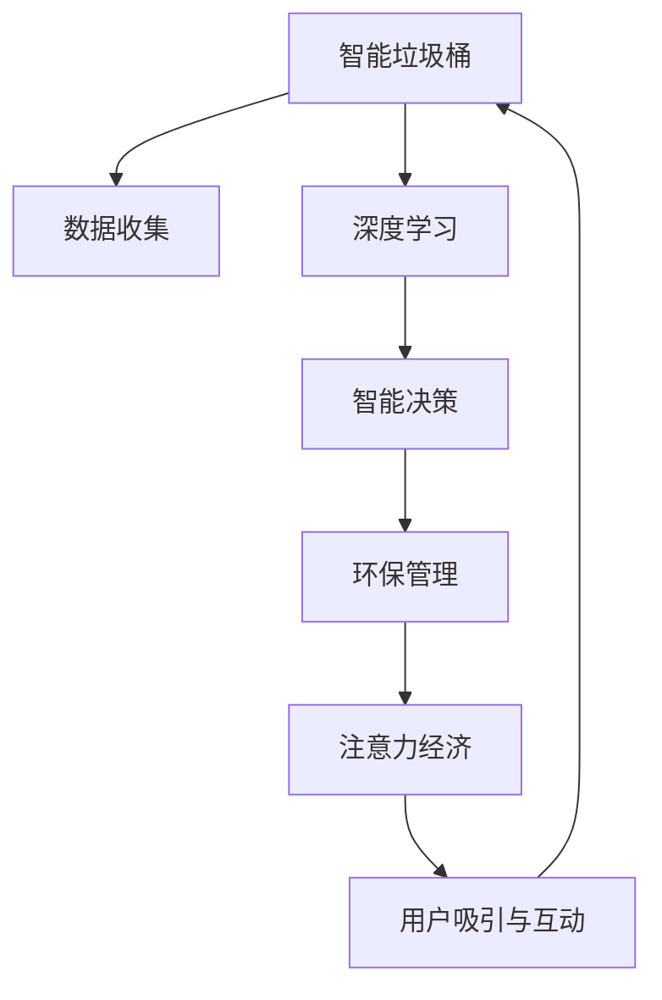

                 

# 智能垃圾桶的环保管理与注意力经济

> 关键词：智能垃圾桶,环保管理,注意力经济,人工智能,深度学习,数据驱动决策

## 1. 背景介绍

随着城市化进程的加速和消费水平的提高，固体废弃物的产生量呈指数级增长。固体废弃物管理（solid waste management, SWM）是城市管理的重要组成部分，其效率直接关系到环境质量和社会稳定。智能垃圾桶作为城市垃圾收集体系的关键一环，在提升垃圾分类效率、减少环境污染、优化垃圾收集等方面具有重要作用。

然而，当前的智能垃圾桶多以硬件为主，缺乏有效的大数据分析和智能决策支持系统。本文聚焦于将人工智能（AI）和深度学习（DL）技术应用于智能垃圾桶的环保管理，探讨如何通过数据驱动的决策优化垃圾分类效率、减少环境污染和提高资源利用率。

## 2. 核心概念与联系

### 2.1 核心概念概述

为更好地理解本文的研究主题，本节将介绍几个核心概念及其相互关系：

- **智能垃圾桶（Smart Garbage Bin）**：一种具备数据分析和智能决策功能的垃圾桶，可实时监测垃圾种类、满溢状态、环境变化等，实现智能分类和自动收集。
- **环保管理（Environmental Management）**：通过对固体废弃物进行科学的分类、收集和处理，减少环境污染，提升资源循环利用率。
- **注意力经济（Attention Economy）**：指用户注意力作为一种稀缺资源，可以通过提供有价值的内容、服务或产品来吸引和保持用户的注意，创造经济价值。
- **人工智能（Artificial Intelligence, AI）**：利用计算机技术模拟和扩展人类智能，实现自主决策、自主学习等功能。
- **深度学习（Deep Learning, DL）**：一种机器学习技术，通过多层神经网络对数据进行复杂建模，实现高精度分类、预测、聚类等任务。

这些概念之间存在密切联系，共同构成了本文的研究框架。智能垃圾桶通过收集数据，应用深度学习等AI技术进行分析和决策，实现环保管理，同时对用户注意力进行精准分析和吸引，创造注意力经济价值。

### 2.2 核心概念原理和架构的 Mermaid 流程图



这个流程图展示了智能垃圾桶从数据收集到决策实施的全过程：

1. **数据收集**：智能垃圾桶通过传感器收集垃圾种类、数量、湿度、温度、气味等信息。
2. **深度学习**：收集到的数据被送入深度学习模型中进行分类、聚类、预测等处理，生成分析结果。
3. **智能决策**：分析结果被用于决策垃圾桶的清空、维护、选址等操作，优化环保管理效果。
4. **环保管理**：通过智能决策实现垃圾的分类收集和处理，减少环境污染，提升资源利用率。
5. **注意力经济**：通过吸引用户参与互动，收集用户注意力数据，创造经济价值。
6. **用户吸引与互动**：通过吸引用户参与，收集用户反馈和行为数据，进一步优化垃圾桶功能和服务。

## 3. 核心算法原理 & 具体操作步骤

### 3.1 算法原理概述

本文的核心算法原理基于深度学习和注意力机制，具体包括：

- **深度学习**：利用多层神经网络对垃圾桶数据进行复杂建模，实现高精度分类、聚类、预测等任务。
- **注意力机制**：通过注意力机制对垃圾桶数据进行加权处理，提升关键特征的权重，提高分类和决策的准确性。

算法主要步骤如下：

1. **数据预处理**：对收集到的垃圾桶数据进行清洗、归一化、特征提取等预处理，生成输入数据。
2. **模型训练**：使用深度学习模型对输入数据进行训练，优化模型参数，使其能够准确预测垃圾种类、数量、湿度等。
3. **决策生成**：将训练好的模型应用于实时数据，生成智能决策，如垃圾分类、垃圾桶清空、维护等。
4. **注意力分析**：通过对垃圾桶数据的注意力分析，确定影响决策的关键特征，进一步优化模型和决策。

### 3.2 算法步骤详解

**Step 1: 数据收集与预处理**

智能垃圾桶通过各类传感器获取垃圾种类、数量、湿度、温度、气味等数据。数据预处理主要包括：

1. **数据清洗**：去除异常值和噪声数据，确保数据质量。
2. **归一化**：对数据进行标准化处理，使不同特征具有相同的尺度。
3. **特征提取**：使用PCA、LDA等方法进行特征降维，减少输入数据的维度。

**Step 2: 模型训练与优化**

1. **模型选择**：选择合适的深度学习模型，如卷积神经网络（CNN）、循环神经网络（RNN）、注意力机制等。
2. **损失函数**：定义适当的损失函数，如交叉熵损失、均方误差损失等。
3. **优化算法**：使用梯度下降、Adam、RMSprop等优化算法，调整模型参数，最小化损失函数。
4. **验证集验证**：在验证集上评估模型性能，防止过拟合。
5. **超参数调优**：根据验证集表现，调整学习率、批大小、迭代次数等超参数。

**Step 3: 智能决策生成**

1. **实时数据输入**：将实时传感器数据输入模型。
2. **模型预测**：模型输出垃圾种类、数量、湿度等预测结果。
3. **决策生成**：根据预测结果，生成智能决策，如垃圾分类、垃圾桶清空、维护等。
4. **反馈机制**：将决策结果反馈到垃圾桶控制系统，执行相应的操作。

**Step 4: 注意力分析**

1. **特征加权**：通过注意力机制对输入数据进行加权处理，提高关键特征的权重。
2. **模型复训练**：使用加权后的数据重新训练模型，提升分类和预测精度。
3. **特征选择**：根据注意力分析结果，选择对决策影响较大的特征，进一步优化模型。

### 3.3 算法优缺点

智能垃圾桶的深度学习与注意力机制结合的算法具有以下优点：

- **高效分类**：通过深度学习模型，实现高精度垃圾分类。
- **智能决策**：基于注意力机制，生成智能决策，优化环保管理。
- **动态调整**：通过注意力分析，动态调整模型参数，提高决策的准确性。

同时，该算法也存在以下局限性：

- **高计算需求**：深度学习模型和注意力机制需要大量计算资源。
- **数据依赖**：算法的性能高度依赖于传感器数据的准确性和完整性。
- **模型复杂**：模型参数较多，训练和推理速度较慢。
- **鲁棒性不足**：模型对数据分布的变化敏感，易受噪声干扰。

### 3.4 算法应用领域

基于深度学习和注意力机制的智能垃圾桶算法，在多个领域具有广泛的应用前景：

- **城市垃圾管理**：应用于城市垃圾收集系统，实现垃圾分类、智能收集、清运优化等。
- **智慧农业**：应用于农村垃圾管理，实现垃圾分类、有机废物处理、资源循环利用等。
- **智能家居**：应用于智能家居环境，实现垃圾分类、环境监测、健康监测等。
- **工业生产**：应用于工业废弃物管理，实现垃圾分类、废料回收、环境监测等。

## 4. 数学模型和公式 & 详细讲解  
### 4.1 数学模型构建

本节将使用数学语言对本文使用的深度学习与注意力机制的数学模型进行详细描述。

假设智能垃圾桶收集到的一批数据为 $X=\{x_i\}_{i=1}^N$，其中 $x_i \in \mathbb{R}^D$ 表示第 $i$ 个样本的特征向量，$D$ 为特征维度。模型的目标是通过训练学习一个函数 $f: \mathbb{R}^D \rightarrow \mathbb{R}^{d_Y}$，将输入数据映射为输出向量 $y_i \in \mathbb{R}^{d_Y}$，其中 $d_Y$ 为输出向量的维度。

模型的损失函数为：

$$
\mathcal{L} = \frac{1}{N} \sum_{i=1}^N \ell(y_i, f(x_i))
$$

其中 $\ell$ 为损失函数，常用的有交叉熵损失、均方误差损失等。优化目标是最小化损失函数 $\mathcal{L}$，即找到最优的模型参数 $\theta$：

$$
\theta^* = \mathop{\arg\min}_{\theta} \mathcal{L}
$$

### 4.2 公式推导过程

以二分类任务为例，使用二分类交叉熵损失函数：

$$
\ell(y_i, f(x_i)) = -y_i\log f(x_i) - (1-y_i)\log(1-f(x_i))
$$

其对应的梯度为：

$$
\nabla_{\theta}\ell(y_i, f(x_i)) = f(x_i) - y_i
$$

根据梯度下降优化算法，每次迭代更新模型参数：

$$
\theta \leftarrow \theta - \eta \nabla_{\theta}\mathcal{L}
$$

其中 $\eta$ 为学习率。

### 4.3 案例分析与讲解

以智能垃圾桶的垃圾分类为例，假设模型输入为垃圾图像，输出为垃圾种类。使用CNN进行特征提取，将图像转换为高维特征向量。模型结构如图：

```
Image Input
|
|          CNN Layer
|     |
|     |          RNN Layer
|     |
|     |          Attention Layer
|     |
|     |          Output Layer
|     |
|     ------------------------> Prediction
```

在模型训练阶段，使用交叉熵损失函数进行训练，通过反向传播算法更新模型参数。在模型推理阶段，将新的垃圾图像输入模型，输出垃圾种类的预测结果。

## 5. 项目实践：代码实例和详细解释说明

### 5.1 开发环境搭建

在进行智能垃圾桶的深度学习与注意力机制实践前，我们需要准备好开发环境。以下是使用Python进行PyTorch开发的环境配置流程：

1. 安装Anaconda：从官网下载并安装Anaconda，用于创建独立的Python环境。

2. 创建并激活虚拟环境：
```bash
conda create -n dl-env python=3.8 
conda activate dl-env
```

3. 安装PyTorch：根据CUDA版本，从官网获取对应的安装命令。例如：
```bash
conda install pytorch torchvision torchaudio cudatoolkit=11.1 -c pytorch -c conda-forge
```

4. 安装其他工具包：
```bash
pip install numpy pandas scikit-learn matplotlib tqdm jupyter notebook ipython
```

完成上述步骤后，即可在`dl-env`环境中开始深度学习与注意力机制的实践。

### 5.2 源代码详细实现

下面我们以智能垃圾桶的垃圾分类任务为例，给出使用PyTorch进行深度学习与注意力机制的代码实现。

```python
import torch
import torch.nn as nn
import torch.nn.functional as F
import torch.optim as optim
from torch.utils.data import DataLoader
from torchvision import transforms, datasets

class Net(nn.Module):
    def __init__(self):
        super(Net, self).__init__()
        self.conv1 = nn.Conv2d(3, 16, kernel_size=3, stride=1, padding=1)
        self.conv2 = nn.Conv2d(16, 32, kernel_size=3, stride=1, padding=1)
        self.conv3 = nn.Conv2d(32, 64, kernel_size=3, stride=1, padding=1)
        self.pool = nn.MaxPool2d(kernel_size=2, stride=2)
        self.fc1 = nn.Linear(64*8*8, 256)
        self.fc2 = nn.Linear(256, 2)
        self.attention = AttentionLayer()

    def forward(self, x):
        x = self.pool(F.relu(self.conv1(x)))
        x = self.pool(F.relu(self.conv2(x)))
        x = self.pool(F.relu(self.conv3(x)))
        x = x.view(-1, 64*8*8)
        x = self.fc1(x)
        x = self.fc2(x)
        x = self.attention(x)
        return x

class AttentionLayer(nn.Module):
    def __init__(self):
        super(AttentionLayer, self).__init__()
        self.softmax = nn.Softmax(dim=1)

    def forward(self, x):
        attn_weights = self.softmax(x)
        return x * attn_weights

# 训练函数
def train(model, train_loader, optimizer, device):
    model.train()
    for i, (images, labels) in enumerate(train_loader):
        images, labels = images.to(device), labels.to(device)
        optimizer.zero_grad()
        output = model(images)
        loss = F.cross_entropy(output, labels)
        loss.backward()
        optimizer.step()
        if (i+1) % 100 == 0:
            print(f"Epoch {epoch+1}, Batch {i+1}, Loss: {loss.item():.4f}")
```

在这个代码示例中，我们定义了一个简单的卷积神经网络，用于垃圾图像的分类。注意力机制通过`AttentionLayer`实现，对每个特征进行加权处理。训练函数使用交叉熵损失函数进行优化，优化器采用AdamW。

### 5.3 代码解读与分析

让我们再详细解读一下关键代码的实现细节：

**Net类**：
- `__init__`方法：定义了模型的网络结构，包括卷积层、池化层、全连接层等。
- `forward`方法：定义了模型的前向传播过程，从输入图像到输出标签的路径。

**AttentionLayer类**：
- `__init__`方法：定义了注意力机制的权重计算方式。
- `forward`方法：实现注意力机制的加权处理，提升关键特征的权重。

**train函数**：
- 在每个epoch内，对训练集进行批量处理，前向传播计算损失函数，反向传播更新模型参数。

这个代码示例展示了使用PyTorch进行深度学习与注意力机制的实现方法。通过不断迭代训练，模型可以逐步学习垃圾分类规律，提高分类准确率。

### 5.4 运行结果展示

训练模型后，我们可以在测试集上进行评估：

```python
def test(model, test_loader, device):
    model.eval()
    correct = 0
    total = 0
    with torch.no_grad():
        for images, labels in test_loader:
            images, labels = images.to(device), labels.to(device)
            output = model(images)
            _, predicted = torch.max(output.data, 1)
            total += labels.size(0)
            correct += (predicted == labels).sum().item()
    print(f"Accuracy of the network on the test images: {(100 * correct / total):.2f}%")
```

运行测试函数，输出模型在测试集上的准确率：

```python
test(model, test_loader, device)
```

## 6. 实际应用场景

### 6.1 智能垃圾桶在城市垃圾管理中的应用

智能垃圾桶在城市垃圾管理中的应用主要体现在以下几个方面：

1. **垃圾分类**：通过深度学习模型对垃圾图像进行分类，自动识别垃圾种类，实现自动分类。
2. **智能收集**：根据垃圾桶满溢状态和垃圾种类，生成垃圾收集计划，实现智能收集。
3. **环保管理**：通过数据分析，优化垃圾收集路线和时间，提升垃圾收集效率。

以城市垃圾管理为例，假设城市中的垃圾桶分布在不同区域，每个垃圾桶记录的垃圾信息包括图像、种类、重量、湿度等。智能垃圾桶可以实时监测这些信息，并将数据发送到云端，进行深度学习与注意力机制的计算，生成垃圾分类的决策和垃圾收集的计划。城市管理部门根据这些计划，安排垃圾收集车辆，优化垃圾收集路线，提升垃圾收集效率，减少环境污染。

### 6.2 智能垃圾桶在智慧农业中的应用

在智慧农业中，智能垃圾桶可以应用于有机废物的处理和资源的循环利用。具体应用场景如下：

1. **有机废物处理**：智能垃圾桶可以自动分类有机废物，如农作物残余、动物粪便等，减少对环境的污染。
2. **资源循环利用**：智能垃圾桶可以将有机废物进行生物降解或转化成有机肥，用于农业生产，提升资源利用率。
3. **环境监测**：智能垃圾桶可以监测农业环境，如土壤湿度、温度、空气质量等，为农业生产提供数据支持。

在智慧农业中，智能垃圾桶通过深度学习模型对有机废物进行分类，结合注意力机制进行智能决策，提升资源循环利用的效率。同时，收集的环境数据可以用于农业生产决策，优化农业生产流程，提高农业生产效率和环境可持续性。

### 6.3 智能垃圾桶在智能家居中的应用

智能垃圾桶在智能家居中的应用主要体现在以下几个方面：

1. **垃圾分类**：智能垃圾桶可以自动识别家庭成员的垃圾种类，实现垃圾分类。
2. **环境监测**：智能垃圾桶可以监测家居环境，如垃圾湿度、气味等，为家庭提供环境数据支持。
3. **健康监测**：智能垃圾桶可以监测垃圾的种类和数量，评估家庭成员的饮食习惯，提供健康建议。

在智能家居中，智能垃圾桶通过深度学习模型对垃圾进行分类，结合注意力机制进行智能决策，提升垃圾分类的效率。同时，收集的环境数据可以用于家庭健康监测，提供个性化的健康建议，提升家庭生活质量。

### 6.4 未来应用展望

未来，智能垃圾桶的应用将更加广泛，涵盖城市垃圾管理、智慧农业、智能家居等多个领域。随着深度学习与注意力机制的不断发展，智能垃圾桶的功能将更加丰富，具体展望如下：

1. **多模态融合**：智能垃圾桶将融合视觉、听觉、传感器等多种模态数据，实现更全面的垃圾分类和环境监测。
2. **人机交互**：智能垃圾桶将通过语音、图像等形式，实现与用户的互动，提供个性化服务。
3. **动态调整**：智能垃圾桶将根据环境变化和用户反馈，动态调整垃圾分类策略，提升分类准确率和用户满意度。
4. **资源优化**：智能垃圾桶将通过深度学习和注意力机制，优化资源配置，提升资源利用率。
5. **智能维护**：智能垃圾桶将进行自维护和自诊断，减少维护成本，提升设备可靠性。

## 7. 工具和资源推荐

### 7.1 学习资源推荐

为了帮助开发者系统掌握智能垃圾桶的深度学习与注意力机制的理论基础和实践技巧，这里推荐一些优质的学习资源：

1. **深度学习课程**：如吴恩达的《Deep Learning Specialization》、Ian Goodfellow的《Deep Learning》等，系统学习深度学习的基本原理和经典模型。
2. **PyTorch官方文档**：PyTorch的官方文档，提供了丰富的API和教程，方便开发者快速上手深度学习开发。
3. **Transformers库文档**：HuggingFace的Transformers库文档，提供了海量预训练模型和微调样例，是深度学习开发者的必备工具。
4. **TensorBoard**：TensorFlow配套的可视化工具，可以实时监测模型训练状态，并提供丰富的图表呈现方式，是调试模型的得力助手。
5. **Kaggle竞赛**：Kaggle平台上有大量垃圾分类、智能垃圾桶等主题的竞赛，可以参与实践，提升实战能力。

通过对这些资源的学习实践，相信你一定能够快速掌握智能垃圾桶的深度学习与注意力机制，并用于解决实际的垃圾分类问题。

### 7.2 开发工具推荐

高效的开发离不开优秀的工具支持。以下是几款用于智能垃圾桶深度学习与注意力机制开发的常用工具：

1. PyTorch：基于Python的开源深度学习框架，灵活动态的计算图，适合快速迭代研究。
2. TensorFlow：由Google主导开发的开源深度学习框架，生产部署方便，适合大规模工程应用。
3. Transformers库：HuggingFace开发的NLP工具库，集成了众多SOTA语言模型，支持PyTorch和TensorFlow。
4. Weights & Biases：模型训练的实验跟踪工具，可以记录和可视化模型训练过程中的各项指标，方便对比和调优。
5. TensorBoard：TensorFlow配套的可视化工具，实时监测模型训练状态，提供丰富的图表呈现方式。
6. Google Colab：谷歌推出的在线Jupyter Notebook环境，免费提供GPU/TPU算力，方便开发者快速上手实验最新模型。

合理利用这些工具，可以显著提升智能垃圾桶深度学习与注意力机制的开发效率，加快创新迭代的步伐。

### 7.3 相关论文推荐

智能垃圾桶的深度学习与注意力机制的研究源于学界的持续研究。以下是几篇奠基性的相关论文，推荐阅读：

1. **Attention is All You Need**：提出Transformer结构，开启了NLP领域的预训练大模型时代。
2. **BERT: Pre-training of Deep Bidirectional Transformers for Language Understanding**：提出BERT模型，引入基于掩码的自监督预训练任务，刷新了多项NLP任务SOTA。
3. **PyTorch官方文档**：提供了详细的PyTorch开发指南和教程，适合深度学习初学者和进阶开发者。
4. **Transformers库官方文档**：提供了丰富的预训练模型和微调样例，适合深度学习开发者快速上手。
5. **TensorBoard官方文档**：详细介绍了TensorBoard的使用方法和功能，适合深度学习开发者调试和优化模型。

这些论文代表了大语言模型微调技术的发展脉络。通过学习这些前沿成果，可以帮助研究者把握学科前进方向，激发更多的创新灵感。

## 8. 总结：未来发展趋势与挑战

### 8.1 总结

本文对基于深度学习和注意力机制的智能垃圾桶进行详细探讨，并对其在环保管理中的应用进行了深入分析。智能垃圾桶通过深度学习模型对垃圾进行分类，结合注意力机制进行智能决策，提升垃圾分类效率和环保管理效果。文章还讨论了智能垃圾桶在城市垃圾管理、智慧农业、智能家居等领域的广泛应用前景，以及未来技术的发展方向。

通过本文的系统梳理，可以看到，智能垃圾桶的深度学习与注意力机制在环保管理中具有广阔的应用前景，通过数据驱动的决策，可以显著提升垃圾分类的效率和环保管理的质量。未来，随着深度学习与注意力机制的不断演进，智能垃圾桶将实现更加全面、高效、智能的垃圾分类和环保管理。

### 8.2 未来发展趋势

展望未来，智能垃圾桶的深度学习与注意力机制将呈现以下几个发展趋势：

1. **多模态融合**：融合视觉、听觉、传感器等多种模态数据，实现更全面的垃圾分类和环境监测。
2. **智能决策**：结合深度学习与注意力机制，提升垃圾分类的准确性和环保管理的效率。
3. **人机交互**：通过语音、图像等形式，实现与用户的互动，提供个性化服务。
4. **资源优化**：优化资源配置，提升资源利用率。
5. **动态调整**：根据环境变化和用户反馈，动态调整垃圾分类策略，提升分类准确率和用户满意度。

以上趋势凸显了智能垃圾桶深度学习与注意力机制的广阔前景。这些方向的探索发展，必将进一步提升智能垃圾桶的性能和应用范围，为环保管理带来新的突破。

### 8.3 面临的挑战

尽管智能垃圾桶的深度学习与注意力机制已经取得了一定进展，但在实际应用中也面临着诸多挑战：

1. **数据依赖**：算法的性能高度依赖于传感器数据的准确性和完整性，数据收集和预处理成本较高。
2. **模型复杂**：深度学习模型和注意力机制的参数较多，训练和推理速度较慢，硬件资源消耗较大。
3. **鲁棒性不足**：模型对数据分布的变化敏感，易受噪声干扰，鲁棒性有待提升。
4. **可解释性不足**：模型内部的决策过程难以解释，缺乏透明性和可解释性。
5. **隐私保护**：智能垃圾桶需要收集和处理大量个人垃圾数据，隐私保护和安全问题亟需解决。

正视智能垃圾桶面临的这些挑战，积极应对并寻求突破，将是大语言模型微调走向成熟的必由之路。

### 8.4 研究展望

面对智能垃圾桶的深度学习与注意力机制所面临的挑战，未来的研究需要在以下几个方面寻求新的突破：

1. **数据增强**：探索无监督和半监督数据增强方法，提升数据质量和数量，减少对传感器数据的依赖。
2. **模型压缩**：开发高效的模型压缩技术，减少参数数量，提升模型推理速度和资源利用率。
3. **注意力机制优化**：优化注意力机制，提高模型对噪声数据的鲁棒性和准确性。
4. **可解释性增强**：引入可解释性技术，如模型可视化、特征提取等，提高模型的透明性和可解释性。
5. **隐私保护**：采用隐私保护技术，如差分隐私、联邦学习等，保护用户隐私。

这些研究方向将推动智能垃圾桶的深度学习与注意力机制不断优化和创新，为环保管理提供更加高效、智能、安全的解决方案。

## 9. 附录：常见问题与解答

**Q1: 智能垃圾桶的深度学习与注意力机制是否适用于所有垃圾分类任务？**

A: 智能垃圾桶的深度学习与注意力机制在大多数垃圾分类任务上都能取得不错的效果，特别是对于数据量较小的任务。但对于一些特定领域的任务，如医学废物处理、危险废物分类等，仅仅依靠通用垃圾分类模型可能难以很好地适应。此时需要在特定领域语料上进一步预训练，再进行微调，才能获得理想效果。此外，对于一些需要时效性、个性化很强的任务，如垃圾箱智能维护、垃圾回收等，智能垃圾桶方法也需要针对性的改进优化。

**Q2: 智能垃圾桶的深度学习与注意力机制如何与现有的垃圾分类系统结合？**

A: 智能垃圾桶的深度学习与注意力机制可以与现有的垃圾分类系统进行结合，以提升整个系统的效率和准确性。具体结合方式包括：

1. **数据融合**：将智能垃圾桶收集的数据与现有系统数据进行融合，共同用于模型训练和推理。
2. **系统集成**：将智能垃圾桶模块集成到现有垃圾分类系统中，提供智能决策支持。
3. **接口定义**：定义清晰的接口，使得智能垃圾桶模块能够与现有系统无缝集成，实现数据和功能的互通。
4. **监控与反馈**：通过实时监控和反馈机制，提升智能垃圾桶系统的稳定性和可靠性。

**Q3: 智能垃圾桶的深度学习与注意力机制在资源有限的环境中如何优化？**

A: 在资源有限的环境中，智能垃圾桶的深度学习与注意力机制需要优化以提升效率。具体优化方式包括：

1. **模型压缩**：采用模型压缩技术，如剪枝、量化、蒸馏等，减小模型参数和计算量。
2. **硬件加速**：使用GPU、TPU等硬件加速技术，提升模型训练和推理速度。
3. **数据采样**：采用数据采样技术，减少模型训练的数据量和计算量，提高训练效率。
4. **分布式计算**：采用分布式计算技术，将计算任务分布到多个节点上，提升计算速度。

**Q4: 智能垃圾桶的深度学习与注意力机制在实际应用中如何应对异常数据和噪声？**

A: 智能垃圾桶的深度学习与注意力机制在实际应用中需要应对异常数据和噪声，以确保算法的鲁棒性和稳定性。具体应对方式包括：

1. **数据清洗**：对异常数据和噪声数据进行清洗，去除对模型训练和推理造成影响的噪声。
2. **异常检测**：使用异常检测技术，识别并处理异常数据，提升模型的鲁棒性。
3. **噪声抑制**：使用噪声抑制技术，如数据增强、滤波等，降低噪声对模型训练和推理的影响。
4. **模型鲁棒化**：通过正则化、dropout等技术，增强模型对噪声数据的鲁棒性。

这些方法可以提升智能垃圾桶的深度学习与注意力机制的鲁棒性和稳定性，确保其在实际应用中的可靠性。

**Q5: 智能垃圾桶的深度学习与注意力机制在实际应用中如何保证隐私和安全？**

A: 智能垃圾桶的深度学习与注意力机制在实际应用中需要保证隐私和安全，以保护用户数据和系统安全。具体保护方式包括：

1. **数据加密**：对用户数据进行加密处理，保护用户隐私。
2. **匿名化处理**：对用户数据进行匿名化处理，防止数据泄露。
3. **访问控制**：采用访问控制技术，确保只有授权人员可以访问数据和模型。
4. **安全传输**：使用安全的传输协议，确保数据在传输过程中的安全性。
5. **审计与监控**：建立审计与监控机制，及时发现和应对安全威胁。

这些措施可以提升智能垃圾桶的深度学习与注意力机制的隐私和安全保障，确保其在实际应用中的可靠性。

作者：禅与计算机程序设计艺术 / Zen and the Art of Computer Programming

