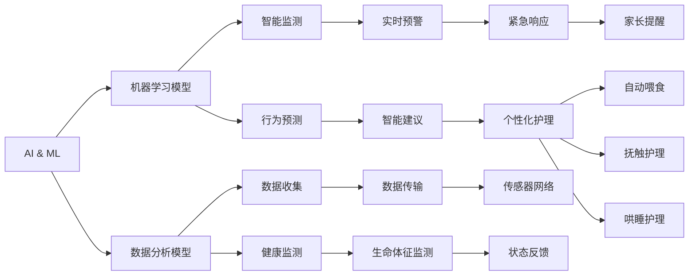

                 

# 智能婴儿摇篮创业：科技辅助的育儿方案

> 关键词：智能婴儿摇篮,育儿科技,机器人技术,数据驱动,智能分析

## 1. 背景介绍

### 1.1 问题由来
随着社会的发展，家庭结构和小儿数量发生了显著变化，家庭规模越来越小，儿童数量也逐渐减少。据统计，全球出生率正在逐年下降，许多家庭只生一两个孩子。这意味着未来，家庭对于育儿服务的需求将变得更为复杂和多样化。

与此同时，科技的进步也为育儿提供了新的可能性。智能婴儿摇篮作为一项高科技产品，结合了人工智能、机器人技术和大数据分析等多种前沿技术，可以实时监测婴儿的健康状况，提供智能化的育儿服务，帮助家长更好地照顾孩子。

### 1.2 问题核心关键点
智能婴儿摇篮的核心在于：

- 利用先进的人工智能技术，实现对婴儿的智能监测和预警。
- 结合机器人技术，提供自动化、智能化的护理服务。
- 采用大数据分析，为育儿提供科学、个性化的建议。

智能婴儿摇篮的成功关键在于其将科技与育儿紧密结合，提供全方位的、自动化的育儿解决方案，帮助家长更轻松地照顾孩子。

## 2. 核心概念与联系

### 2.1 核心概念概述

智能婴儿摇篮系统由以下几部分构成：

- **人工智能与机器学习（AI & ML）**：利用深度学习、图像识别、自然语言处理等技术，实现对婴儿行为的智能分析和预测。
- **机器人技术（Robotics）**：通过机器人执行各种护理任务，如喂食、抚触、哄睡等，为婴儿提供即时、精准的护理服务。
- **大数据分析（Big Data）**：收集和分析婴儿的健康数据、生活行为数据等，为育儿提供科学的建议和决策支持。
- **物联网技术（IoT）**：通过各种传感器和数据传输设备，实现对婴儿状态的实时监测。

这些核心技术相互支持、互为补充，共同构成了一个完整的智能婴儿摇篮系统。

### 2.2 核心概念原理和架构的 Mermaid 流程图(Mermaid 流程节点中不要有括号、逗号等特殊字符)



这个流程图展示了智能婴儿摇篮系统中各组件之间的逻辑联系：

- 人工智能与机器学习模块通过学习模型进行智能监测和行为预测。
- 数据分析模块收集并分析婴儿健康数据和生活行为数据。
- 机器学习模型和数据分析模型共同作用，实现对婴儿状态的实时监测和智能预警。
- 传感器网络实时传输数据，支持物联网技术。
- 机器人技术执行智能建议下的各种护理任务。

## 3. 核心算法原理 & 具体操作步骤

### 3.1 算法原理概述

智能婴儿摇篮的核心算法主要包括以下几个部分：

- **深度学习模型**：利用深度神经网络对婴儿的行为和健康数据进行学习和预测，实现智能监测和行为预测。
- **图像识别算法**：通过摄像头和传感器收集图像数据，识别婴儿的面部表情和动作，用于监测其情绪和行为状态。
- **自然语言处理算法**：通过语音识别技术收集婴儿的哭声、说话等语音数据，分析其情感和需求。
- **优化算法**：使用优化算法如Adam、SGD等，对深度学习模型进行训练和优化。

### 3.2 算法步骤详解

智能婴儿摇篮的算法实现步骤如下：

1. **数据收集**：通过摄像头、传感器等设备收集婴儿的图像、声音、心率、呼吸等数据。
2. **预处理**：对收集到的数据进行去噪、归一化等预处理操作，提高数据质量。
3. **特征提取**：通过深度学习模型提取数据中的关键特征，如面部表情、心率变化等。
4. **模型训练**：利用机器学习算法训练模型，实现对婴儿行为和健康状态的预测。
5. **实时监测**：将实时数据输入到训练好的模型中，进行实时监测和预警。
6. **护理执行**：根据模型预测结果，智能机器人执行相应的护理任务，如喂食、抚触、哄睡等。
7. **数据分析**：定期对收集到的数据进行分析，生成统计报告和护理建议，帮助家长更好地照顾孩子。

### 3.3 算法优缺点

智能婴儿摇篮的算法具有以下优点：

- **精准监测**：利用深度学习和大数据分析，实现对婴儿健康状态的精准监测和预警。
- **自动化护理**：结合机器人技术，提供自动化、智能化的护理服务，减少家长的工作负担。
- **个性化建议**：根据数据分析结果，为家长提供个性化的育儿建议，提高育儿的科学性和效率。

然而，这些算法也存在一些缺点：

- **数据隐私问题**：婴儿数据的收集和使用可能涉及隐私问题，需要严格遵守数据保护法规。
- **算法复杂性**：深度学习模型的训练和优化需要大量计算资源和时间。
- **成本较高**：智能婴儿摇篮的高科技组件和传感设备价格较高，导致产品成本相对较高。

### 3.4 算法应用领域

智能婴儿摇篮的算法可以应用于以下几个领域：

- **新生儿监护**：在新生儿病房中，智能婴儿摇篮可以实时监测新生儿的心率、呼吸等健康指标，及时发现异常情况。
- **家庭育儿**：在家庭环境中，智能婴儿摇篮可以帮助家长更好地照顾孩子，提高育儿的科学性和效率。
- **养老护理**：对于高龄老人，智能婴儿摇篮的技术也可用于老年人的健康监测和护理，提供更贴心的服务。

## 4. 数学模型和公式 & 详细讲解 & 举例说明

### 4.1 数学模型构建

智能婴儿摇篮系统的主要数学模型包括以下几个部分：

- **深度学习模型**：如卷积神经网络（CNN）、循环神经网络（RNN）等，用于图像识别和行为预测。
- **时间序列模型**：如自回归移动平均模型（ARMA）、长短期记忆网络（LSTM）等，用于分析婴儿心率、呼吸等时间序列数据。
- **优化模型**：如Adam、SGD等，用于模型参数的优化和调整。

### 4.2 公式推导过程

以深度学习模型为例，下面是一个简单的卷积神经网络（CNN）的公式推导过程：

$$
y = W \cdot x + b
$$

其中，$x$ 为输入数据，$W$ 为权重矩阵，$b$ 为偏置向量。通过前向传播和反向传播算法，模型可以学习到输入数据和目标输出之间的关系。

### 4.3 案例分析与讲解

假设我们有一个简单的卷积神经网络，用于识别婴儿的面部表情。该网络由多个卷积层和池化层组成，可以有效地提取图像中的特征。下面是一个典型的CNN模型结构：


## 5. 项目实践：代码实例和详细解释说明

### 5.1 开发环境搭建

智能婴儿摇篮系统的开发环境需要以下组件：

- **Python**：开发语言，提供了丰富的数据处理和机器学习库。
- **深度学习框架**：如TensorFlow、PyTorch等，用于实现深度学习模型。
- **传感器库**：如OpenCV、PyAudio等，用于采集图像和声音数据。
- **机器人控制库**：如ROS（Robot Operating System）、Arduino等，用于控制智能机器人执行护理任务。

### 5.2 源代码详细实现

以下是一个简单的Python代码示例，用于实现深度学习模型的训练和预测：

```python
import tensorflow as tf
from tensorflow.keras.models import Sequential
from tensorflow.keras.layers import Conv2D, MaxPooling2D, Flatten, Dense

# 构建CNN模型
model = Sequential([
    Conv2D(32, (3, 3), activation='relu', input_shape=(64, 64, 3)),
    MaxPooling2D((2, 2)),
    Conv2D(64, (3, 3), activation='relu'),
    MaxPooling2D((2, 2)),
    Flatten(),
    Dense(128, activation='relu'),
    Dense(2, activation='softmax')
])

# 编译模型
model.compile(optimizer='adam', loss='categorical_crossentropy', metrics=['accuracy'])

# 训练模型
model.fit(x_train, y_train, epochs=10, batch_size=32)

# 预测新数据
y_pred = model.predict(x_test)
```

### 5.3 代码解读与分析

这段代码实现了一个简单的卷积神经网络（CNN）模型，用于图像分类任务。其中，`Sequential`函数用于创建模型，`Conv2D`和`MaxPooling2D`用于卷积和池化操作，`Flatten`用于展平特征，`Dense`用于全连接层。在模型编译时，使用`adam`优化器和交叉熵损失函数，训练模型时使用`fit`函数。

## 6. 实际应用场景

### 6.1 智能护理系统

智能婴儿摇篮系统可以集成到医院的智能护理系统中，实时监测新生儿的心率、呼吸等健康指标，及时发现异常情况，自动报警并通知医护人员。此外，系统还可以根据数据记录，生成统计报告，帮助医生进行科学决策。

### 6.2 家庭育儿应用

在家庭环境中，智能婴儿摇篮系统可以通过手机APP与家长进行互动，提供婴儿的健康数据和行为分析报告。家长可以根据报告中的建议，调整育儿策略，确保婴儿的健康成长。系统还可以通过机器人执行喂食、抚触、哄睡等护理任务，减轻家长的工作负担。

### 6.3 远程监护系统

智能婴儿摇篮系统可以通过互联网实现远程监护，家长可以在任何地方通过手机APP查看婴儿的实时数据和行为分析报告，确保婴儿的安全和健康。系统还可以集成到智能家居系统中，实现全面的家庭安全监控。

### 6.4 未来应用展望

未来，智能婴儿摇篮系统将朝着以下几个方向发展：

- **跨平台集成**：系统将更加注重跨平台集成，支持多设备、多平台之间的无缝连接，提供更便捷的用户体验。
- **智能交互**：通过自然语言处理技术，系统可以实现智能化的语音交互，提供更自然、更友好的用户界面。
- **个性化推荐**：基于数据分析，系统可以提供个性化的育儿建议，帮助家长更好地照顾孩子。
- **持续学习**：系统将具备持续学习的能力，随着数据量的增加，不断优化模型，提高准确性和鲁棒性。

## 7. 工具和资源推荐

### 7.1 学习资源推荐

为了帮助开发者掌握智能婴儿摇篮系统的开发，以下推荐一些优质的学习资源：

- **TensorFlow官方文档**：提供了丰富的深度学习模型和算法实现，是学习和实践的必备资源。
- **PyTorch官方文档**：提供了丰富的机器学习库和工具，支持快速的模型训练和优化。
- **ROS官方文档**：提供了机器人控制和感知技术的学习资源，适合机器人开发人员参考。
- **Kaggle竞赛平台**：提供了大量图像识别、时间序列预测等领域的竞赛，可以用于学习和实践。

### 7.2 开发工具推荐

智能婴儿摇篮系统的开发需要以下工具：

- **TensorFlow**：用于深度学习模型的训练和优化。
- **PyTorch**：用于快速构建和训练深度学习模型。
- **ROS**：用于机器人控制和感知。
- **OpenCV**：用于图像处理和识别。
- **PyAudio**：用于音频数据的采集和处理。

### 7.3 相关论文推荐

智能婴儿摇篮系统的技术实现依赖于深度学习、机器学习、机器人技术等领域的最新研究成果。以下推荐一些相关论文：

- **Convolutional Neural Networks for Visual Recognition**：AlexNet论文，介绍了卷积神经网络在图像识别中的应用。
- **Long Short-Term Memory**：LSTM论文，介绍了长短期记忆网络在时间序列预测中的应用。
- **Robot Operating System: A Toolbox for Online Robot Programming**：ROS论文，介绍了机器人操作系统的设计思想和实现方法。

## 8. 总结：未来发展趋势与挑战

### 8.1 总结

智能婴儿摇篮系统通过结合人工智能、机器人技术和大数据分析等多种前沿技术，实现了对婴儿的智能监测和护理。系统的成功依赖于其在数据处理、模型训练和应用部署等多个环节的精细设计和优化。

通过本文的系统梳理，可以看到，智能婴儿摇篮系统将科技与育儿紧密结合，提供了全方位的、自动化的育儿解决方案，帮助家长更轻松地照顾孩子。未来，随着技术的不断进步和普及，智能婴儿摇篮系统将在医院、家庭、养老等多个领域发挥重要作用。

### 8.2 未来发展趋势

未来，智能婴儿摇篮系统将朝着以下几个方向发展：

- **跨平台集成**：系统将更加注重跨平台集成，支持多设备、多平台之间的无缝连接，提供更便捷的用户体验。
- **智能交互**：通过自然语言处理技术，系统可以实现智能化的语音交互，提供更自然、更友好的用户界面。
- **个性化推荐**：基于数据分析，系统可以提供个性化的育儿建议，帮助家长更好地照顾孩子。
- **持续学习**：系统将具备持续学习的能力，随着数据量的增加，不断优化模型，提高准确性和鲁棒性。

### 8.3 面临的挑战

智能婴儿摇篮系统在发展过程中也面临以下挑战：

- **数据隐私问题**：婴儿数据的收集和使用可能涉及隐私问题，需要严格遵守数据保护法规。
- **算法复杂性**：深度学习模型的训练和优化需要大量计算资源和时间。
- **成本较高**：智能婴儿摇篮的高科技组件和传感设备价格较高，导致产品成本相对较高。

### 8.4 研究展望

未来，智能婴儿摇篮系统的研究需要在以下几个方面寻求新的突破：

- **数据隐私保护**：开发隐私保护技术，确保婴儿数据的隐私和安全。
- **模型优化**：研究高效的模型训练和优化算法，提高模型的性能和鲁棒性。
- **跨平台集成**：开发跨平台的智能系统，提供便捷的用户体验。
- **人性化交互**：开发更加人性化的交互界面，提供更自然、更友好的用户体验。

## 9. 附录：常见问题与解答

**Q1：智能婴儿摇篮系统是否适用于所有类型的婴儿？**

A: 智能婴儿摇篮系统适用于大部分健康婴儿，但对于某些特殊情况的婴儿（如早产儿、先天性疾病等），需要进一步定制化开发，以确保系统的安全性和有效性。

**Q2：智能婴儿摇篮系统需要多少标注数据进行训练？**

A: 智能婴儿摇篮系统的训练需要大量的标注数据，包括婴儿的面部表情、动作、声音等数据。这些数据可以从医院的监控摄像头、婴儿家中的智能设备中收集，也可以从公开的图像和视频数据集中获取。

**Q3：智能婴儿摇篮系统是否需要不断更新数据和模型？**

A: 是的，随着婴儿的成长，其行为和健康状况会发生变化，因此智能婴儿摇篮系统需要不断更新数据和模型，以适应婴儿的新情况。可以通过在线学习和模型更新实现这一目标。

**Q4：智能婴儿摇篮系统的安全性如何保证？**

A: 智能婴儿摇篮系统需要严格遵守数据隐私和安全标准，确保婴儿数据的隐私和安全。可以通过加密传输、数据脱敏、访问控制等技术手段，保障系统的安全性。

**Q5：智能婴儿摇篮系统的维护和升级如何实现？**

A: 智能婴儿摇篮系统需要定期进行维护和升级，以确保系统的稳定性和功能性。可以通过在线更新、远程监控等方式实现系统的维护和升级。

---

作者：禅与计算机程序设计艺术 / Zen and the Art of Computer Programming

