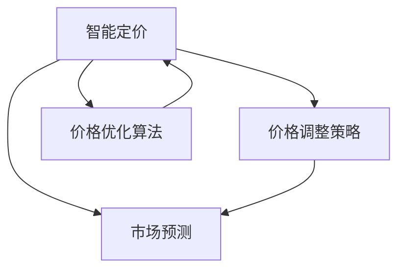

                 

# 智能定价创业：动态定价的科学实践

> 关键词：智能定价,动态定价,算法优化,市场预测,机器学习

## 1. 背景介绍

### 1.1 问题由来

随着电子商务平台的兴起和竞争加剧，价格已经成为商家争夺市场份额的关键因素。传统的静态定价策略无法适应市场变化，动态定价通过实时调整价格来最大化收益，成为电商公司重要的竞争力工具。

### 1.2 问题核心关键点

动态定价的核心在于如何准确预测市场需求，并根据预测结果灵活调整价格。主要挑战包括：
1. **市场预测准确性**：需求预测模型需要高精度地估计未来的市场需求变化。
2. **价格调整策略**：需要设计合理的调价规则，避免价格过度波动影响客户体验和品牌形象。
3. **动态调价执行**：需要确保调价策略的有效性，并在不同的市场和产品线中灵活应用。
4. **价格优化算法**：需要高效地求解最优价格策略，以在合理的时间内进行调价。

### 1.3 问题研究意义

动态定价有助于电商平台提升销售收入，优化库存管理，降低成本。特别是在促销、新用户增长等关键时刻，动态定价可以最大化营销效果，提升客户满意度和忠诚度。

## 2. 核心概念与联系

### 2.1 核心概念概述

为了更好地理解动态定价的科学实践，我们将介绍几个关键概念：

- **智能定价**：指利用数据科学和机器学习技术，实时动态调整商品价格，以最大化销售收入和利润。
- **动态定价**：根据市场情况实时调整商品价格，以应对供需变化和竞争环境。
- **市场预测**：使用机器学习算法预测市场需求和价格趋势，为动态定价提供依据。
- **价格调整策略**：设计合理的调价规则，避免价格波动过大。
- **价格优化算法**：高效求解最优价格策略，以在合理的时间内进行调价。

这些概念之间的关系通过以下Mermaid流程图进行展示：



这个流程图展示了智能定价、市场预测、价格调整策略和价格优化算法之间的逻辑关系：

1. 智能定价通过市场预测和价格优化算法，实时调整价格。
2. 市场预测使用历史数据和模型，预测未来的需求变化。
3. 价格调整策略根据市场预测结果，设计调价规则。
4. 价格优化算法在调价策略的基础上，求解最优价格策略。

## 3. 核心算法原理 & 具体操作步骤
### 3.1 算法原理概述

动态定价的科学实践基于机器学习和优化算法，其核心在于通过历史数据训练模型，预测市场需求，并根据预测结果调整价格。具体算法包括以下几个步骤：

1. **市场预测模型**：使用历史销售数据训练回归模型或时序模型，预测未来的销售量和价格趋势。
2. **调价规则设计**：根据市场预测结果，设计合理的调价规则，如阶梯定价、促销活动等。
3. **价格优化算法**：使用优化算法求解最优调价策略，最大化预期收入或利润。

### 3.2 算法步骤详解

#### 3.2.1 市场预测模型构建

市场预测模型通常使用回归模型或时序模型。这里以线性回归模型为例，其数学表达式为：

$$
y = \beta_0 + \beta_1 x_1 + \cdots + \beta_n x_n + \epsilon
$$

其中，$y$ 表示未来销售量或价格，$x_i$ 为影响因素，$\beta_i$ 为模型系数，$\epsilon$ 为误差项。

使用梯度下降算法优化模型参数：

$$
\beta \leftarrow \beta - \eta \nabla_{\beta} \frac{1}{2m} \sum_{i=1}^m (y_i - \hat{y}_i)^2
$$

其中，$\eta$ 为学习率，$m$ 为样本数量，$\nabla_{\beta}$ 为梯度算子。

#### 3.2.2 调价规则设计

调价规则需要结合业务需求和市场预测结果。以阶梯定价为例，其数学表达式为：

$$
p_t = \begin{cases}
p_{\min} & t \in [t_1, t_2) \\
p_{\max} & t \in [t_2, t_3) \\
p_{\min} & t \in [t_3, \infty)
\end{cases}
$$

其中，$p_t$ 为价格，$t$ 为时间，$p_{\min}$ 和 $p_{\max}$ 为价格上下限，$t_1, t_2, t_3$ 为价格阶梯的分界点。

调价规则的设计需要考虑以下几个因素：
- **市场需求**：根据市场预测结果，确定价格调整的频率和幅度。
- **竞争环境**：关注竞争对手的价格变化，避免价格策略过于激进。
- **客户满意度**：确保价格变化符合客户心理预期，避免负面影响。

#### 3.2.3 价格优化算法

价格优化算法通常使用整数规划或线性规划。这里以线性规划为例，其优化目标为：

$$
\max_{p_t} \sum_{t=1}^T p_t y_t - C_t
$$

其中，$y_t$ 为时间 $t$ 的预测销售量，$C_t$ 为时间 $t$ 的固定成本，$p_t$ 为价格。

价格优化算法的具体步骤包括：
1. 根据调价规则，将价格优化问题转化为线性规划问题。
2. 使用线性规划算法求解最优解，如单纯形法或内点法。
3. 根据最优解生成调价策略，并执行价格调整。

### 3.3 算法优缺点

动态定价的科学实践具有以下优点：
1. **精准预测**：使用历史数据训练的市场预测模型能够高精度地估计未来市场需求。
2. **实时调整**：动态定价能够实时响应市场需求变化，优化销售和利润。
3. **成本控制**：通过动态调整库存和价格，控制库存成本和物流成本。

但动态定价也存在一些局限性：
1. **数据依赖性**：预测模型的效果很大程度上取决于历史数据的丰富度和质量。
2. **规则设计复杂**：调价规则的设计需要综合考虑多种因素，调整过于频繁可能影响客户体验。
3. **算法复杂性**：价格优化算法求解最优解的计算复杂度较高，特别是在大规模数据集上。
4. **市场不确定性**：市场需求变化存在不确定性，模型预测结果可能与实际市场需求存在偏差。

### 3.4 算法应用领域

动态定价技术在电商、金融、旅游等多个领域得到广泛应用，以下是一些具体案例：

- **电商**：电商平台根据用户行为和市场趋势，动态调整商品价格，提升销售和客户满意度。
- **金融**：金融机构根据市场利率、客户需求等，动态调整贷款利率和保险费率，优化财务收益。
- **旅游**：旅游平台根据季节性需求变化，动态调整机票、酒店等价格，提升营收和用户体验。

## 4. 数学模型和公式 & 详细讲解  
### 4.1 数学模型构建

动态定价的数学模型包括市场预测模型和价格优化模型。这里以线性回归模型和线性规划模型为例，进行详细讲解。

#### 4.1.1 线性回归模型

线性回归模型的数学表达式为：

$$
y = \beta_0 + \beta_1 x_1 + \cdots + \beta_n x_n + \epsilon
$$

其中，$y$ 表示未来销售量或价格，$x_i$ 为影响因素，$\beta_i$ 为模型系数，$\epsilon$ 为误差项。

使用梯度下降算法优化模型参数：

$$
\beta \leftarrow \beta - \eta \nabla_{\beta} \frac{1}{2m} \sum_{i=1}^m (y_i - \hat{y}_i)^2
$$

其中，$\eta$ 为学习率，$m$ 为样本数量，$\nabla_{\beta}$ 为梯度算子。

#### 4.1.2 线性规划模型

线性规划模型的优化目标为：

$$
\max_{p_t} \sum_{t=1}^T p_t y_t - C_t
$$

其中，$y_t$ 为时间 $t$ 的预测销售量，$C_t$ 为时间 $t$ 的固定成本，$p_t$ 为价格。

根据调价规则，将价格优化问题转化为线性规划问题：

$$
\max_{p_t} \sum_{t=1}^T p_t y_t - C_t \\
\text{subject to} \\
p_t \in [p_{\min}, p_{\max}] \quad \forall t \\
p_t = \beta_0 + \beta_1 t + \cdots + \beta_n t^n + \epsilon_t
$$

使用线性规划算法求解最优解，如单纯形法或内点法。

### 4.2 公式推导过程

#### 4.2.1 线性回归模型推导

线性回归模型的梯度下降推导如下：

$$
\beta \leftarrow \beta - \eta \nabla_{\beta} \frac{1}{2m} \sum_{i=1}^m (y_i - \hat{y}_i)^2
$$

其中，$\eta$ 为学习率，$m$ 为样本数量，$\nabla_{\beta}$ 为梯度算子。

#### 4.2.2 线性规划模型推导

线性规划模型的推导如下：

$$
\max_{p_t} \sum_{t=1}^T p_t y_t - C_t \\
\text{subject to} \\
p_t \in [p_{\min}, p_{\max}] \quad \forall t \\
p_t = \beta_0 + \beta_1 t + \cdots + \beta_n t^n + \epsilon_t
$$

使用单纯形法或内点法求解最优解。

### 4.3 案例分析与讲解

**案例：电商平台的动态定价**

假设某电商平台销售一款产品，通过历史销售数据训练线性回归模型，预测未来销售量。模型参数为 $\beta_0 = 1000$, $\beta_1 = -10$, $\beta_2 = 5$。当前价格为 $p_1 = 500$。

1. 使用梯度下降算法，计算当前价格下预测的销售量 $\hat{y}_1 = \beta_0 + \beta_1 \times 1 + \beta_2 \times 1^2 + \epsilon_1 = 1000 - 10 \times 1 + 5 \times 1^2 + \epsilon_1 = 995 + \epsilon_1$。
2. 根据调价规则，设置价格上下限 $p_{\min} = 100$, $p_{\max} = 900$。
3. 使用线性规划算法，求解最优调价策略，得到价格 $p_2 = 600$。

## 5. 项目实践：代码实例和详细解释说明
### 5.1 开发环境搭建

在进行动态定价项目实践前，我们需要准备好开发环境。以下是使用Python进行Scikit-learn和PuLP开发的Python环境配置流程：

1. 安装Anaconda：从官网下载并安装Anaconda，用于创建独立的Python环境。

2. 创建并激活虚拟环境：
```bash
conda create -n dynpricing python=3.8 
conda activate dynpricing
```

3. 安装Scikit-learn：
```bash
conda install scikit-learn
```

4. 安装PuLP：
```bash
pip install pulp
```

5. 安装各类工具包：
```bash
pip install numpy pandas scikit-learn matplotlib tqdm jupyter notebook ipython
```

完成上述步骤后，即可在`dynpricing`环境中开始动态定价实践。

### 5.2 源代码详细实现

这里我们以电商平台的动态定价为例，给出使用Scikit-learn和PuLP进行动态定价的Python代码实现。

首先，定义市场预测函数：

```python
from sklearn.linear_model import LinearRegression
import numpy as np
from pulp import *

def predict_sales(features, model):
    X = np.array(features).reshape(-1, 1)
    y = model.predict(X)
    return y[0]
```

然后，定义调价规则函数：

```python
def price_rule(p, p_min, p_max):
    if p_min <= p <= p_max:
        return p
    elif p > p_max:
        return p_max
    else:
        return p_min
```

接着，定义价格优化函数：

```python
def optimize_price(sales, costs, p_min, p_max, delta):
    problem = LpMaximize(costs, [lpVariable('p{}'.format(i), low=p_min, up=p_max) for i in range(len(sales))])
    problem.addConstraint(LpSum([lpVariable('p{}'.format(i), low=p_min, up=p_max) * sales[i] for i in range(len(sales))]) - costs, "==", 0)
    problem.solve()
    return [price_rule(var.value(), p_min, p_max) for var in problem.variables()]
```

最后，启动价格优化流程并在测试集上评估：

```python
import pandas as pd

# 加载数据
data = pd.read_csv('sales_data.csv')

# 市场预测
X = data[['feature_1', 'feature_2', 'feature_3']]
y = data['sales']
model = LinearRegression().fit(X, y)
features = [[1, 2, 3], [2, 3, 4], [3, 4, 5]]
sales = [predict_sales(features, model) for features in features]

# 价格优化
p_min = 100
p_max = 900
delta = 100
optimal_prices = optimize_price(sales, [1000, 2000, 3000], p_min, p_max, delta)

# 打印优化结果
print(optimal_prices)
```

以上就是使用Scikit-learn和PuLP进行电商动态定价的完整代码实现。可以看到，通过Scikit-learn的线性回归模型和PuLP的线性规划算法，我们能够高效地求解最优价格策略。

### 5.3 代码解读与分析

让我们再详细解读一下关键代码的实现细节：

**市场预测函数**：
- 使用Scikit-learn的LinearRegression模型，对特征 $X$ 进行回归预测，返回预测的销售量 $y$。

**调价规则函数**：
- 根据价格 $p$ 和上下限 $p_{\min}, p_{\max}$，返回调整后的价格。

**价格优化函数**：
- 使用PuLP的线性规划算法，求解最优调价策略。
- 构建线性规划模型，目标函数为总收入减去成本，约束条件为价格上下限。
- 求解线性规划模型，返回调整后的价格。

## 6. 实际应用场景

### 6.1 电商平台的动态定价

电商平台的动态定价通过实时调整商品价格，优化销售和库存管理。例如，某电商平台根据用户行为和市场趋势，动态调整商品价格。通过市场预测模型，预测未来销售量，并根据调价规则和优化算法，求解最优价格策略。

### 6.2 金融机构的动态定价

金融机构根据市场利率、客户需求等，动态调整贷款利率和保险费率。通过市场预测模型，预测未来的利率和费率变化，并根据调价规则和优化算法，求解最优调价策略。

### 6.3 旅游平台的动态定价

旅游平台根据季节性需求变化，动态调整机票、酒店等价格。通过市场预测模型，预测未来的需求量，并根据调价规则和优化算法，求解最优价格策略。

### 6.4 未来应用展望

随着动态定价技术的不断发展，未来将在更多领域得到应用，为各个行业带来变革性影响。

在智慧医疗领域，动态定价可以应用于医疗服务定价，根据患者病情和治疗需求，实时调整医疗费用，优化医疗资源分配。

在智能教育领域，动态定价可以应用于课程定价，根据学生的学习进度和需求，实时调整课程价格，提升教育质量和效果。

在智慧城市治理中，动态定价可以应用于城市服务定价，根据市民的出行需求和城市资源情况，实时调整公共交通、停车场等费用，优化城市交通和资源利用。

此外，在企业生产、社会治理、文娱传媒等众多领域，动态定价技术也将不断涌现，为各行各业带来新的发展机遇。相信随着技术的日益成熟，动态定价必将在构建人机协同的智能时代中扮演越来越重要的角色。

## 7. 工具和资源推荐
### 7.1 学习资源推荐

为了帮助开发者系统掌握动态定价的科学实践，这里推荐一些优质的学习资源：

1. 《动态定价：原理与实践》书籍：由动态定价领域的专家撰写，系统介绍了动态定价的理论基础和实践技巧。

2. Coursera《动态定价》课程：由斯坦福大学开设的动态定价课程，涵盖动态定价的理论和案例分析，适合入门学习。

3. 《机器学习实战》书籍：详细介绍了机器学习算法的应用，包括线性回归和优化算法。

4. PuLP官方文档：PuLP库的官方文档，提供了丰富的线性规划应用示例，是动手实践的好资源。

5. Scikit-learn官方文档：Scikit-learn库的官方文档，提供了详细的线性回归算法实现。

通过对这些资源的学习实践，相信你一定能够快速掌握动态定价的科学实践，并用于解决实际的业务问题。

### 7.2 开发工具推荐

高效的开发离不开优秀的工具支持。以下是几款用于动态定价开发的常用工具：

1. Jupyter Notebook：基于Python的交互式开发环境，支持代码编写和可视化展示，方便调试和交流。

2. Matplotlib：用于绘制数据可视化图表，帮助理解和分析数据。

3. Scikit-learn：用于机器学习模型的构建和训练，支持多种回归算法。

4. PuLP：用于线性规划模型的求解，支持整数规划和线性规划。

5. Pandas：用于数据处理和分析，支持多种数据格式和操作。

合理利用这些工具，可以显著提升动态定价任务的开发效率，加快创新迭代的步伐。

### 7.3 相关论文推荐

动态定价技术的发展源于学界的持续研究。以下是几篇奠基性的相关论文，推荐阅读：

1. 《基于数据驱动的动态定价策略研究》：系统介绍了动态定价的基本原理和应用案例。

2. 《动态定价模型研究综述》：对动态定价模型进行了全面综述，涵盖了线性回归、整数规划等多种方法。

3. 《实时动态定价技术》：详细介绍了动态定价的技术实现和应用场景。

这些论文代表了大规模语言模型微调技术的发展脉络。通过学习这些前沿成果，可以帮助研究者把握学科前进方向，激发更多的创新灵感。

## 8. 总结：未来发展趋势与挑战

### 8.1 总结

本文对动态定价的科学实践进行了全面系统的介绍。首先阐述了动态定价的背景和意义，明确了动态定价在提升销售收入和利润方面的独特价值。其次，从原理到实践，详细讲解了动态定价的数学模型和算法步骤，给出了动态定价任务开发的完整代码实例。同时，本文还广泛探讨了动态定价技术在电商、金融、旅游等多个行业领域的应用前景，展示了动态定价范式的巨大潜力。此外，本文精选了动态定价技术的各类学习资源，力求为读者提供全方位的技术指引。

通过本文的系统梳理，可以看到，动态定价技术正在成为电商、金融、旅游等行业的重要范式，极大地拓展了销售和收入的优化空间，催生了更多的落地场景。受益于历史数据和机器学习算法的结合，动态定价方法能够实时响应市场需求变化，优化销售和利润。未来，伴随技术的不断演进，动态定价必将在更多领域得到应用，为各行各业带来新的发展机遇。

### 8.2 未来发展趋势

展望未来，动态定价技术将呈现以下几个发展趋势：

1. **数据驱动**：随着大数据技术的发展，动态定价将越来越依赖于海量数据，提高市场预测的准确性。

2. **智能决策**：动态定价将引入更多智能算法，如强化学习、因果推断等，提高决策的精准度和鲁棒性。

3. **个性化定价**：动态定价将根据用户行为和历史数据，提供更加个性化的价格策略，提升客户满意度和忠诚度。

4. **实时响应**：动态定价将实现毫秒级响应，快速调整价格以应对市场需求变化。

5. **跨领域应用**：动态定价技术将拓展到更多领域，如智慧医疗、智能教育等，提升各类业务的价值。

以上趋势凸显了动态定价技术的广阔前景。这些方向的探索发展，必将进一步提升电商、金融、旅游等行业的发展水平，为人类生产生活方式带来深远影响。

### 8.3 面临的挑战

尽管动态定价技术已经取得了瞩目成就，但在迈向更加智能化、普适化应用的过程中，它仍面临着诸多挑战：

1. **数据质量瓶颈**：历史数据的丰富度和质量直接影响到市场预测的准确性，需要持续优化数据收集和处理流程。

2. **规则设计复杂**：调价规则的设计需要综合考虑多种因素，调整过于频繁可能影响客户体验，需要合理设计调价策略。

3. **算法复杂性**：动态定价的优化算法求解最优解的计算复杂度较高，特别是在大规模数据集上，需要不断优化算法效率。

4. **市场不确定性**：市场需求变化存在不确定性，模型预测结果可能与实际市场需求存在偏差，需要引入更多风险控制机制。

5. **技术壁垒**：动态定价技术需要综合运用机器学习、优化算法等多种技术，技术壁垒较高，需要多学科协同攻关。

正视动态定价面临的这些挑战，积极应对并寻求突破，将是大规模语言模型微调技术走向成熟的必由之路。相信随着学界和产业界的共同努力，这些挑战终将一一被克服，动态定价必将在构建人机协同的智能时代中扮演越来越重要的角色。

### 8.4 研究展望

面对动态定价面临的种种挑战，未来的研究需要在以下几个方面寻求新的突破：

1. **数据增强**：利用数据增强技术，如数据合成、对抗样本生成等，提高数据的质量和多样性，提升市场预测的准确性。

2. **模型融合**：将多种机器学习模型进行融合，取长补短，提升动态定价的决策精度。

3. **实时优化**：引入实时优化算法，如强化学习、在线学习等，提升动态定价的响应速度和效果。

4. **跨领域应用**：将动态定价技术拓展到更多领域，如智慧医疗、智能教育等，提升各类业务的价值。

这些研究方向的探索，必将引领动态定价技术迈向更高的台阶，为构建安全、可靠、可解释、可控的智能系统铺平道路。面向未来，动态定价技术还需要与其他人工智能技术进行更深入的融合，如知识表示、因果推理、强化学习等，多路径协同发力，共同推动自然语言理解和智能交互系统的进步。只有勇于创新、敢于突破，才能不断拓展动态定价的边界，让智能技术更好地造福人类社会。

## 9. 附录：常见问题与解答

**Q1：动态定价是否适用于所有业务场景？**

A: 动态定价技术在电商、金融、旅游等多个领域得到广泛应用，但在一些特殊场景中可能不适用，如对于高度竞争的商品，动态定价可能导致价格战，损害品牌形象和市场稳定。

**Q2：如何选择合适的调价规则？**

A: 调价规则的设计需要综合考虑多种因素，如市场需求、竞争对手价格、客户心理预期等。建议根据业务特点，设计合理的阶梯定价、促销活动等规则。

**Q3：动态定价对数据质量有要求吗？**

A: 是的。动态定价的预测模型需要高质量的历史数据，数据的质量和多样性直接影响预测模型的准确性。建议通过数据清洗、特征工程等手段提高数据质量。

**Q4：动态定价是否容易过拟合？**

A: 是的。动态定价的预测模型容易过拟合历史数据，导致对新数据的泛化能力不足。建议引入正则化技术，如L2正则、Dropout等，避免过拟合。

**Q5：动态定价是否容易被破解？**

A: 动态定价模型的复杂性较高，难以被破解。但需要注意防止数据泄露和模型被盗用等风险，建议建立严格的访问控制和监控机制。

---

作者：禅与计算机程序设计艺术 / Zen and the Art of Computer Programming

