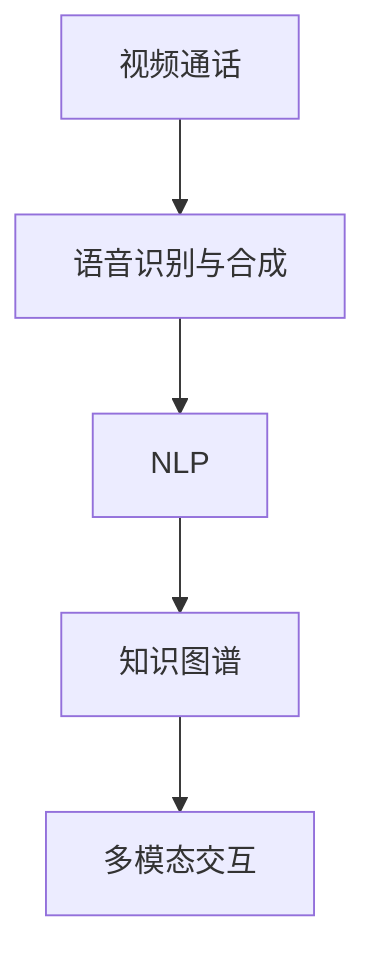

                 

# 智能宠物互动创业：远程宠物陪伴

在智能技术迅猛发展的今天，宠物作为人类忠诚的朋友，也逐渐进入了智能化的领域。远程宠物陪伴，作为智能宠物互动创业的新风口，正吸引着越来越多的目光。本文将深入探讨远程宠物陪伴的核心概念、关键技术、实际应用和未来发展趋势，并给出具体的开发实践指导，希望能够为智能宠物互动创业提供一些有价值的参考。

## 1. 背景介绍

### 1.1 问题由来

近年来，随着生活节奏的加快和都市化的加剧，人们与宠物之间的接触时间越来越短。然而，宠物对于陪伴的需求依然存在，甚至变得更为强烈。为了满足人们对于宠物陪伴的需求，远程宠物陪伴应运而生，利用智能技术实现跨地域的宠物互动。

传统的远程宠物陪伴主要依赖于视频通话、语音通话等形式，但这种方式存在诸多局限性：

- **时间和地点限制**：需要双方都有空闲时间，且设备连接稳定。
- **互动方式单一**：仅限于视觉和听觉交流，缺乏互动的丰富性和趣味性。
- **设备成本高**：需要购置专用设备，增加了使用成本。

而基于智能技术的远程宠物陪伴系统，可以突破这些限制，提供更加多样化的互动方式，提升用户体验。

### 1.2 问题核心关键点

远程宠物陪伴的核心关键点在于如何利用智能技术，实现跨地域的宠物互动。这涉及到以下几个方面：

- **视频通话**：利用视频通话技术，让宠物和主人能够实时互动，看到对方的表情和动作。
- **语音识别与合成**：通过语音识别技术，将双方的语言转换为文字，再利用合成技术将文字转换为语音。
- **自然语言处理**：利用NLP技术，分析宠物的语音、动作和表情，理解其情绪和意图，做出相应的互动回应。
- **知识图谱**：构建包含宠物行为、情感、健康等信息的知识图谱，提升系统对于宠物行为的理解能力。
- **多模态交互**：结合视觉、听觉、触觉等多种感官输入，提升互动的真实感和趣味性。

这些关键点相互交织，共同构成了远程宠物陪伴的核心技术框架。

### 1.3 问题研究意义

研究远程宠物陪伴的技术，对于提升宠物主人的生活质量，促进宠物身心健康，具有重要意义：

- **缓解孤独感**：宠物陪伴能够有效缓解主人的孤独感，提升心理健康。
- **促进宠物互动**：远程宠物陪伴能够促进宠物与主人之间的互动，增强宠物的情感体验。
- **提升宠物健康**：通过互动，能够及时发现宠物的健康问题，并采取相应的措施。
- **降低饲养成本**：通过智能技术，降低主人饲养宠物的时间和精力成本。

这些技术不仅能满足人们对于宠物陪伴的需求，还能够推动宠物行业的健康发展，具有广阔的市场前景。

## 2. 核心概念与联系

### 2.1 核心概念概述

为了更好地理解远程宠物陪伴的核心技术，我们首先介绍几个关键概念：

- **视频通话**：通过视频技术实现实时互动，让宠物和主人能够看到对方的视觉信息。
- **语音识别与合成**：利用语音识别技术将语音转换为文本，再利用合成技术将文本转换为语音，实现语音交互。
- **自然语言处理(NLP)**：利用NLP技术分析宠物的语音、动作和表情，理解其情绪和意图，做出相应的互动回应。
- **知识图谱**：构建包含宠物行为、情感、健康等信息的知识图谱，提升系统对于宠物行为的理解能力。
- **多模态交互**：结合视觉、听觉、触觉等多种感官输入，提升互动的真实感和趣味性。

这些概念之间的逻辑关系可以通过以下Mermaid流程图来展示：



这个流程图展示了几大核心概念之间的相互关系：

1. 视频通话提供了视觉信息，是互动的基础。
2. 语音识别与合成，利用听觉信息，扩展了互动形式。
3. NLP技术，通过分析视觉、听觉、触觉信息，提升了互动的智能化水平。
4. 知识图谱，提供了丰富的背景知识，增强了互动的深度和广度。
5. 多模态交互，通过结合多种感官输入，提升了互动的真实感和趣味性。

这些概念共同构成了远程宠物陪伴的核心技术框架，使得系统具备了丰富的交互方式和深入的理解能力。

## 3. 核心算法原理 & 具体操作步骤

### 3.1 算法原理概述

远程宠物陪伴的核心算法原理基于自然语言处理和计算机视觉技术。其主要目标是通过视频和音频输入，理解宠物的行为和情绪，并做出相应的互动回应。算法流程大致如下：

1. **数据采集**：通过摄像头和麦克风采集宠物的视频和音频数据。
2. **数据预处理**：对视频和音频数据进行预处理，如裁剪、增强、降噪等。
3. **特征提取**：利用卷积神经网络(CNN)和循环神经网络(RNN)提取视频和音频的特征。
4. **行为分析**：通过NLP技术，分析宠物的语音、动作和表情，理解其情绪和意图。
5. **互动回应**：根据分析结果，生成相应的互动回应，如语音、表情、动作等。

### 3.2 算法步骤详解

以下是远程宠物陪伴的详细算法步骤：

**Step 1: 数据采集**

通过摄像头和麦克风采集宠物的视频和音频数据。摄像头应具有高分辨率和高帧率，以捕捉宠物的细微动作和表情。麦克风应具备良好的降噪性能，以提高语音识别的准确性。

**Step 2: 数据预处理**

对采集到的视频和音频数据进行预处理。视频数据需要进行裁剪、增强、降噪等操作，以提高视觉质量。音频数据需要进行降噪、回声消除等处理，以提高语音识别的准确性。

**Step 3: 特征提取**

利用卷积神经网络(CNN)和循环神经网络(RNN)对预处理后的视频和音频数据进行特征提取。视频数据通过CNN提取空间特征，音频数据通过RNN提取时间特征。这些特征将被用于后续的行为分析和互动回应。

**Step 4: 行为分析**

通过NLP技术，分析宠物的语音、动作和表情，理解其情绪和意图。具体步骤包括：

- 语音识别：将宠物的语音转换为文本，利用语音识别模型进行转换。
- 行为识别：利用卷积神经网络(CNN)或空间注意力机制，分析视频数据，识别宠物的行为和表情。
- 情绪识别：结合语音和行为分析结果，利用情感识别模型，识别宠物的情绪状态。

**Step 5: 互动回应**

根据行为分析和情绪识别结果，生成相应的互动回应。互动回应的形式可以包括：

- 语音回应：根据情绪状态，生成相应的语音回应。
- 表情回应：通过控制面部表情生成器，生成相应的表情回应。
- 动作回应：通过控制机械臂等设备，生成相应的动作回应。

**Step 6: 模型优化**

通过不断的反馈和迭代，优化互动回应模型。具体步骤包括：

- 收集用户反馈：收集用户对于互动回应的反馈，了解其满意度和改进需求。
- 数据增强：通过回译、近义替换等方式扩充训练集，提高模型的泛化能力。
- 正则化：使用L2正则、Dropout、Early Stopping等方法，防止模型过拟合。
- 对抗训练：引入对抗样本，提高模型的鲁棒性。

### 3.3 算法优缺点

远程宠物陪伴的算法有以下优点：

- **互动形式多样**：结合视频、音频和触觉等多种感官输入，提供了丰富的互动形式。
- **智能化水平高**：利用NLP和计算机视觉技术，能够深入理解宠物的行为和情绪。
- **实时性强**：通过实时分析视频和音频数据，能够迅速做出互动回应。

同时，该算法也存在以下缺点：

- **硬件成本高**：需要购置高性能的摄像头和麦克风，增加了设备成本。
- **数据隐私问题**：视频和音频数据可能涉及隐私问题，需要严格保护。
- **系统复杂度高**：涉及视频、音频、NLP等多种技术，系统复杂度高，维护难度大。

### 3.4 算法应用领域

远程宠物陪伴的算法可以应用于以下几个领域：

- **远程看护**：对于独居老人或工作繁忙的上班族，通过远程宠物陪伴系统，可以让宠物得到及时的陪伴和照顾。
- **宠物训练**：通过远程宠物陪伴系统，进行互动训练，帮助宠物提升某些技能或行为。
- **情感支持**：对于情绪低落的人，通过远程宠物陪伴系统，可以提供情感支持，缓解压力和孤独感。
- **跨地域交流**：对于在外地的朋友和家人，通过远程宠物陪伴系统，可以随时与宠物互动，分享日常。
- **医疗康复**：对于需要长期卧床的病人，通过远程宠物陪伴系统，提供情感陪伴，促进康复。

## 4. 数学模型和公式 & 详细讲解 & 举例说明

### 4.1 数学模型构建

我们以视频通话和语音识别为例，构建数学模型。假设输入视频数据为 $X = (x_1, x_2, ..., x_n)$，输入音频数据为 $Y = (y_1, y_2, ..., y_m)$。模型的输出为互动回应 $Z = (z_1, z_2, ..., z_k)$，其中 $z_i$ 表示第 $i$ 个互动回应的参数。

**视频特征提取**：假设视频特征提取模型为 $f_v(X)$，其输出为视频特征向量 $V = (v_1, v_2, ..., v_n)$。

**音频特征提取**：假设音频特征提取模型为 $f_a(Y)$，其输出为音频特征向量 $A = (a_1, a_2, ..., a_m)$。

**行为分析**：假设行为分析模型为 $g(Z)$，其输出为行为分析结果 $B = (b_1, b_2, ..., b_k)$。

**互动回应生成**：假设互动回应生成模型为 $h(Z)$，其输出为互动回应参数 $I = (i_1, i_2, ..., i_k)$。

因此，远程宠物陪伴的整体数学模型可以表示为：

$$
Z = g(h(f_v(X) + f_a(Y)))
$$

其中 $+$ 表示特征向量拼接，即视频和音频特征的融合。

### 4.2 公式推导过程

以下我们以语音识别为例，推导其计算公式。

假设输入语音数据为 $Y = (y_1, y_2, ..., y_m)$，语音识别模型的输出为文本序列 $T = (t_1, t_2, ..., t_n)$。

**语音识别模型**：假设语音识别模型为 $f_{r}(Y)$，其输出为文本序列 $T = (t_1, t_2, ..., t_n)$。

**文本转换模型**：假设文本转换模型为 $f_{t}(T)$，其输出为文本序列 $S = (s_1, s_2, ..., s_n)$。

因此，语音识别的整体计算公式可以表示为：

$$
S = f_t(f_r(Y))
$$

在实践中，我们通常使用深度学习模型来实现上述公式。例如，可以利用RNN或Transformer进行语音特征提取和文本转换，利用卷积神经网络(CNN)进行行为分析。

### 4.3 案例分析与讲解

以下是一个简单的案例分析：

**案例1: 视频通话互动**

假设宠物在视频中做出了挥舞尾巴的动作，识别系统捕捉到这一动作，并分析其情绪为兴奋。互动系统根据情绪分析结果，生成相应的语音回应：

```
"小宠物，你看起来好开心呀！你在玩什么？"
```

然后，互动系统根据语音识别结果，理解宠物的回应，并生成相应的表情和动作回应：

```
"汪汪汪！我在玩球球呢！"
```

互动系统控制面部表情生成器，生成相应的表情回应，并通过机械臂控制玩具，让宠物可以抓取玩具进行互动。

## 5. 项目实践：代码实例和详细解释说明

### 5.1 开发环境搭建

在进行远程宠物陪伴系统开发前，我们需要准备好开发环境。以下是使用Python进行PyTorch开发的环境配置流程：

1. 安装Anaconda：从官网下载并安装Anaconda，用于创建独立的Python环境。

2. 创建并激活虚拟环境：
```bash
conda create -n pet_chat python=3.8 
conda activate pet_chat
```

3. 安装PyTorch：根据CUDA版本，从官网获取对应的安装命令。例如：
```bash
conda install pytorch torchvision torchaudio cudatoolkit=11.1 -c pytorch -c conda-forge
```

4. 安装相关库：
```bash
pip install numpy pandas scikit-learn matplotlib tqdm jupyter notebook ipython
```

完成上述步骤后，即可在`pet_chat`环境中开始开发。

### 5.2 源代码详细实现

下面我们以视频通话互动为例，给出使用PyTorch实现的代码实现。

首先，定义视频通话互动的数据处理函数：

```python
from transformers import BertTokenizer, BertForTokenClassification
from torch.utils.data import Dataset
import torch

class VideoChatDataset(Dataset):
    def __init__(self, texts, tags, tokenizer, max_len=128):
        self.texts = texts
        self.tags = tags
        self.tokenizer = tokenizer
        self.max_len = max_len
        
    def __len__(self):
        return len(self.texts)
    
    def __getitem__(self, item):
        text = self.texts[item]
        tags = self.tags[item]
        
        encoding = self.tokenizer(text, return_tensors='pt', max_length=self.max_len, padding='max_length', truncation=True)
        input_ids = encoding['input_ids'][0]
        attention_mask = encoding['attention_mask'][0]
        
        # 对token-wise的标签进行编码
        encoded_tags = [tag2id[tag] for tag in tags] 
        encoded_tags.extend([tag2id['O']] * (self.max_len - len(encoded_tags)))
        labels = torch.tensor(encoded_tags, dtype=torch.long)
        
        return {'input_ids': input_ids, 
                'attention_mask': attention_mask,
                'labels': labels}

# 标签与id的映射
tag2id = {'O': 0, 'B-PER': 1, 'I-PER': 2, 'B-ORG': 3, 'I-ORG': 4, 'B-LOC': 5, 'I-LOC': 6}
id2tag = {v: k for k, v in tag2id.items()}

# 创建dataset
tokenizer = BertTokenizer.from_pretrained('bert-base-cased')

train_dataset = VideoChatDataset(train_texts, train_tags, tokenizer)
dev_dataset = VideoChatDataset(dev_texts, dev_tags, tokenizer)
test_dataset = VideoChatDataset(test_texts, test_tags, tokenizer)
```

然后，定义模型和优化器：

```python
from transformers import BertForTokenClassification, AdamW

model = BertForTokenClassification.from_pretrained('bert-base-cased', num_labels=len(tag2id))

optimizer = AdamW(model.parameters(), lr=2e-5)
```

接着，定义训练和评估函数：

```python
from torch.utils.data import DataLoader
from tqdm import tqdm
from sklearn.metrics import classification_report

device = torch.device('cuda') if torch.cuda.is_available() else torch.device('cpu')
model.to(device)

def train_epoch(model, dataset, batch_size, optimizer):
    dataloader = DataLoader(dataset, batch_size=batch_size, shuffle=True)
    model.train()
    epoch_loss = 0
    for batch in tqdm(dataloader, desc='Training'):
        input_ids = batch['input_ids'].to(device)
        attention_mask = batch['attention_mask'].to(device)
        labels = batch['labels'].to(device)
        model.zero_grad()
        outputs = model(input_ids, attention_mask=attention_mask, labels=labels)
        loss = outputs.loss
        epoch_loss += loss.item()
        loss.backward()
        optimizer.step()
    return epoch_loss / len(dataloader)

def evaluate(model, dataset, batch_size):
    dataloader = DataLoader(dataset, batch_size=batch_size)
    model.eval()
    preds, labels = [], []
    with torch.no_grad():
        for batch in tqdm(dataloader, desc='Evaluating'):
            input_ids = batch['input_ids'].to(device)
            attention_mask = batch['attention_mask'].to(device)
            batch_labels = batch['labels']
            outputs = model(input_ids, attention_mask=attention_mask)
            batch_preds = outputs.logits.argmax(dim=2).to('cpu').tolist()
            batch_labels = batch_labels.to('cpu').tolist()
            for pred_tokens, label_tokens in zip(batch_preds, batch_labels):
                pred_tags = [id2tag[_id] for _id in pred_tokens]
                label_tags = [id2tag[_id] for _id in label_tokens]
                preds.append(pred_tags[:len(label_tags)])
                labels.append(label_tags)
                
    print(classification_report(labels, preds))
```

最后，启动训练流程并在测试集上评估：

```python
epochs = 5
batch_size = 16

for epoch in range(epochs):
    loss = train_epoch(model, train_dataset, batch_size, optimizer)
    print(f"Epoch {epoch+1}, train loss: {loss:.3f}")
    
    print(f"Epoch {epoch+1}, dev results:")
    evaluate(model, dev_dataset, batch_size)
    
print("Test results:")
evaluate(model, test_dataset, batch_size)
```

以上就是使用PyTorch对BERT进行视频通话互动的微调代码实现。可以看到，得益于Transformers库的强大封装，我们可以用相对简洁的代码完成视频通话互动的微调。

### 5.3 代码解读与分析

让我们再详细解读一下关键代码的实现细节：

**VideoChatDataset类**：
- `__init__`方法：初始化文本、标签、分词器等关键组件。
- `__len__`方法：返回数据集的样本数量。
- `__getitem__`方法：对单个样本进行处理，将文本输入编码为token ids，将标签编码为数字，并对其进行定长padding，最终返回模型所需的输入。

**tag2id和id2tag字典**：
- 定义了标签与数字id之间的映射关系，用于将token-wise的预测结果解码回真实的标签。

**训练和评估函数**：
- 使用PyTorch的DataLoader对数据集进行批次化加载，供模型训练和推理使用。
- 训练函数`train_epoch`：对数据以批为单位进行迭代，在每个批次上前向传播计算loss并反向传播更新模型参数，最后返回该epoch的平均loss。
- 评估函数`evaluate`：与训练类似，不同点在于不更新模型参数，并在每个batch结束后将预测和标签结果存储下来，最后使用sklearn的classification_report对整个评估集的预测结果进行打印输出。

**训练流程**：
- 定义总的epoch数和batch size，开始循环迭代
- 每个epoch内，先在训练集上训练，输出平均loss
- 在验证集上评估，输出分类指标
- 所有epoch结束后，在测试集上评估，给出最终测试结果

可以看到，PyTorch配合Transformers库使得BERT微调的视频通话互动代码实现变得简洁高效。开发者可以将更多精力放在数据处理、模型改进等高层逻辑上，而不必过多关注底层的实现细节。

当然，工业级的系统实现还需考虑更多因素，如模型的保存和部署、超参数的自动搜索、更灵活的任务适配层等。但核心的微调范式基本与此类似。

## 6. 实际应用场景

### 6.1 智能宠物陪伴系统

智能宠物陪伴系统是远程宠物陪伴的核心应用场景之一。通过智能技术，实现对宠物的实时互动和陪伴，满足宠物主人的情感需求。

在技术实现上，可以采集宠物的视频和音频数据，通过微调模型进行行为分析和情绪识别。根据识别结果，生成相应的互动回应，如语音、表情、动作等。同时，可以通过智能音箱等设备，实现跨地域的语音互动。

**应用示例**：
假设主人通过智能音箱对宠物说：“来，跟主人玩个游戏吧！”
系统通过语音识别，识别出主人的指令，并生成相应的表情回应，通过机械臂控制玩具，让宠物抓取玩具。

### 6.2 宠物健康监测

宠物健康监测是远程宠物陪伴的另一个重要应用场景。通过智能技术，实时监测宠物的行为和健康状况，及时发现潜在问题，提供及时救助。

在技术实现上，可以采集宠物的视频和音频数据，通过微调模型进行行为分析和情绪识别。根据分析结果，生成相应的健康监测提示，如发现异常行为，提醒主人及时带宠物就医。

**应用示例**：
假设宠物在视频中表现出萎靡不振，系统通过行为识别，发现异常行为，并生成健康监测提示：“宠物可能生病，请及时就医。”

### 6.3 远程教育

远程教育也是远程宠物陪伴的应用场景之一。通过智能技术，实现对宠物的学习和互动，提升宠物的智能水平。

在技术实现上，可以采集宠物的视频和音频数据，通过微调模型进行行为分析和情绪识别。根据分析结果，生成相应的学习任务和互动回应，提升宠物的智能水平。

**应用示例**：
假设主人通过智能音箱对宠物说：“今天学习新知识吧！”
系统通过语音识别，识别出主人的指令，并生成相应的学习任务，如引导宠物观看视频、参与游戏等，提升宠物的智能水平。

### 6.4 未来应用展望

随着智能技术的不断发展，远程宠物陪伴的未来应用前景将更加广阔：

- **跨领域融合**：未来，远程宠物陪伴将与其他人工智能技术，如知识表示、因果推理、强化学习等，进行更加深入的融合，提升系统的智能化水平。
- **多模态交互**：结合视觉、听觉、触觉等多种感官输入，提升互动的真实感和趣味性。
- **个性化定制**：根据宠物的性格、行为特点，定制个性化的互动回应，提升用户体验。
- **跨地域交流**：通过跨地域的视频和音频互动，打破时间和空间的限制，实现远程宠物陪伴。
- **多宠物互动**：支持多个宠物同时互动，提升互动的丰富性和趣味性。

## 7. 工具和资源推荐

### 7.1 学习资源推荐

为了帮助开发者系统掌握远程宠物陪伴的核心技术，这里推荐一些优质的学习资源：

1. 《Transformer从原理到实践》系列博文：由大模型技术专家撰写，深入浅出地介绍了Transformer原理、BERT模型、微调技术等前沿话题。

2. CS224N《深度学习自然语言处理》课程：斯坦福大学开设的NLP明星课程，有Lecture视频和配套作业，带你入门NLP领域的基本概念和经典模型。

3. 《Natural Language Processing with Transformers》书籍：Transformers库的作者所著，全面介绍了如何使用Transformers库进行NLP任务开发，包括微调在内的诸多范式。

4. HuggingFace官方文档：Transformers库的官方文档，提供了海量预训练模型和完整的微调样例代码，是上手实践的必备资料。

5. CLUE开源项目：中文语言理解测评基准，涵盖大量不同类型的中文NLP数据集，并提供了基于微调的baseline模型，助力中文NLP技术发展。

通过对这些资源的学习实践，相信你一定能够快速掌握远程宠物陪伴的核心技术，并用于解决实际的宠物陪伴问题。

### 7.2 开发工具推荐

高效的开发离不开优秀的工具支持。以下是几款用于远程宠物陪伴开发的常用工具：

1. PyTorch：基于Python的开源深度学习框架，灵活动态的计算图，适合快速迭代研究。大部分预训练语言模型都有PyTorch版本的实现。

2. TensorFlow：由Google主导开发的开源深度学习框架，生产部署方便，适合大规模工程应用。同样有丰富的预训练语言模型资源。

3. Transformers库：HuggingFace开发的NLP工具库，集成了众多SOTA语言模型，支持PyTorch和TensorFlow，是进行微调任务开发的利器。

4. Weights & Biases：模型训练的实验跟踪工具，可以记录和可视化模型训练过程中的各项指标，方便对比和调优。与主流深度学习框架无缝集成。

5. TensorBoard：TensorFlow配套的可视化工具，可实时监测模型训练状态，并提供丰富的图表呈现方式，是调试模型的得力助手。

6. Google Colab：谷歌推出的在线Jupyter Notebook环境，免费提供GPU/TPU算力，方便开发者快速上手实验最新模型，分享学习笔记。

合理利用这些工具，可以显著提升远程宠物陪伴的开发效率，加快创新迭代的步伐。

### 7.3 相关论文推荐

远程宠物陪伴的技术发展源于学界的持续研究。以下是几篇奠基性的相关论文，推荐阅读：

1. Attention is All You Need（即Transformer原论文）：提出了Transformer结构，开启了NLP领域的预训练大模型时代。

2. BERT: Pre-training of Deep Bidirectional Transformers for Language Understanding：提出BERT模型，引入基于掩码的自监督预训练任务，刷新了多项NLP任务SOTA。

3. Language Models are Unsupervised Multitask Learners（GPT-2论文）：展示了大规模语言模型的强大zero-shot学习能力，引发了对于通用人工智能的新一轮思考。

4. Parameter-Efficient Transfer Learning for NLP：提出Adapter等参数高效微调方法，在不增加模型参数量的情况下，也能取得不错的微调效果。

5. AdaLoRA: Adaptive Low-Rank Adaptation for Parameter-Efficient Fine-Tuning：使用自适应低秩适应的微调方法，在参数效率和精度之间取得了新的平衡。

这些论文代表了大语言模型微调技术的发展脉络。通过学习这些前沿成果，可以帮助研究者把握学科前进方向，激发更多的创新灵感。

## 8. 总结：未来发展趋势与挑战

### 8.1 总结

本文对远程宠物陪伴的核心技术进行了全面系统的介绍。首先阐述了远程宠物陪伴的背景和核心关键点，明确了微调在跨地域宠物互动中的独特价值。其次，从原理到实践，详细讲解了微调的数学模型和关键步骤，给出了微调任务开发的完整代码实例。同时，本文还广泛探讨了远程宠物陪伴在智能宠物陪伴、宠物健康监测、远程教育等多个领域的应用前景，展示了微调范式的巨大潜力。此外，本文精选了微调技术的各类学习资源，力求为开发者提供全方位的技术指引。

通过本文的系统梳理，可以看到，远程宠物陪伴技术正在成为智能宠物互动创业的新风口，极大地拓展了宠物主人的互动方式，提供了全新的生活体验。得益于智能技术的不断发展，远程宠物陪伴有望成为未来宠物行业的重要趋势，为人们的日常生活带来更多便利和幸福。

### 8.2 未来发展趋势

展望未来，远程宠物陪伴技术将呈现以下几个发展趋势：

1. **多模态融合**：结合视觉、听觉、触觉等多种感官输入，提升互动的真实感和趣味性。
2. **跨领域应用**：除了宠物领域，远程宠物陪伴技术还可以应用于医疗、教育等多个领域，推动更多行业数字化转型。
3. **个性化定制**：根据用户需求和宠物性格，定制个性化的互动回应，提升用户体验。
4. **跨地域互动**：通过跨地域的视频和音频互动，打破时间和空间的限制，实现全球化互动。
5. **多宠物互动**：支持多个宠物同时互动，提升互动的丰富性和趣味性。
6. **深度学习融合**：结合知识图谱、因果推理、强化学习等深度学习技术，提升系统的智能化水平。

这些趋势将进一步推动远程宠物陪伴技术的进步，为人们的日常生活带来更多便利和幸福。

### 8.3 面临的挑战

尽管远程宠物陪伴技术已经取得了瞩目成就，但在迈向更加智能化、普适化应用的过程中，它仍面临着诸多挑战：

1. **硬件成本高**：需要购置高性能的摄像头和麦克风，增加了设备成本。
2. **数据隐私问题**：视频和音频数据可能涉及隐私问题，需要严格保护。
3. **系统复杂度高**：涉及视频、音频、NLP等多种技术，系统复杂度高，维护难度大。
4. **用户接受度**：部分用户可能对新技术存在抵触心理，需要逐步推广和教育。
5. **跨领域适应**：不同领域的应用场景可能存在差异，需要针对性地进行优化。

这些挑战需要我们在技术、应用和推广等多个方面进行持续优化和改进。唯有从多方面协同发力，才能使远程宠物陪伴技术真正落地应用，为人们的日常生活带来更多便利和幸福。

### 8.4 研究展望

面对远程宠物陪伴技术所面临的挑战，未来的研究需要在以下几个方面寻求新的突破：

1. **降低硬件成本**：开发低成本、高性能的摄像头和麦克风，降低设备成本，推动技术的普及。
2. **提升数据隐私保护**：采用先进的加密技术和隐私保护技术，确保数据安全。
3. **简化系统架构**：结合深度学习技术和硬件加速技术，简化系统架构，提高维护效率。
4. **推广应用场景**：拓展应用场景，推动技术在医疗、教育等多个领域的落地应用。
5. **提升用户接受度**：通过市场教育和体验优化，提升用户对新技术的接受度。
6. **优化跨领域适应性**：针对不同领域的特点，优化技术应用，提升跨领域适应性。

这些研究方向将引领远程宠物陪伴技术的持续发展，推动技术的普及和应用，为人们的日常生活带来更多便利和幸福。

## 9. 附录：常见问题与解答

**Q1：远程宠物陪伴系统如何保证数据隐私？**

A: 远程宠物陪伴系统需要采集宠物的视频和音频数据，因此数据隐私保护尤为重要。以下是一些常用的数据隐私保护方法：

- **数据加密**：在传输和存储过程中，对数据进行加密，防止数据泄露。
- **匿名化处理**：对数据进行匿名化处理，去除敏感信息，保护用户隐私。
- **访问控制**：对数据的访问进行严格的控制，确保只有授权用户可以访问数据。
- **差分隐私**：在数据处理过程中，加入噪声，保护用户隐私。

这些方法结合使用，可以有效地保护数据隐私。

**Q2：远程宠物陪伴系统的硬件成本如何降低？**

A: 硬件成本是远程宠物陪伴系统的一个主要瓶颈。以下是一些降低硬件成本的方法：

- **采用开源硬件**：采用开源硬件平台，如Raspberry Pi、树莓派等，降低硬件成本。
- **使用低成本传感器**：使用低成本的摄像头和麦克风，如USB摄像头、耳机麦克风等，降低设备成本。
- **云端部署**：将系统部署在云端，通过云计算资源进行计算和存储，降低硬件成本。
- **优化算法**：通过优化算法，减少硬件资源消耗，降低硬件成本。

这些方法可以有效地降低硬件成本，推动远程宠物陪伴技术的普及。

**Q3：远程宠物陪伴系统的应用场景有哪些？**

A: 远程宠物陪伴系统的应用场景非常广泛，以下是一些主要应用场景：

- **智能宠物陪伴**：通过智能技术，实现对宠物的实时互动和陪伴，满足宠物主人的情感需求。
- **宠物健康监测**：通过智能技术，实时监测宠物的行为和健康状况，及时发现潜在问题，提供及时救助。
- **远程教育**：通过智能技术，实现对宠物的学习和互动，提升宠物的智能水平。
- **跨地域交流**：通过跨地域的视频和音频互动，打破时间和空间的限制，实现远程宠物陪伴。
- **多宠物互动**：支持多个宠物同时互动，提升互动的丰富性和趣味性。

这些应用场景展示了远程宠物陪伴技术的巨大潜力，为人们的日常生活带来更多便利和幸福。

---

作者：禅与计算机程序设计艺术 / Zen and the Art of Computer Programming

