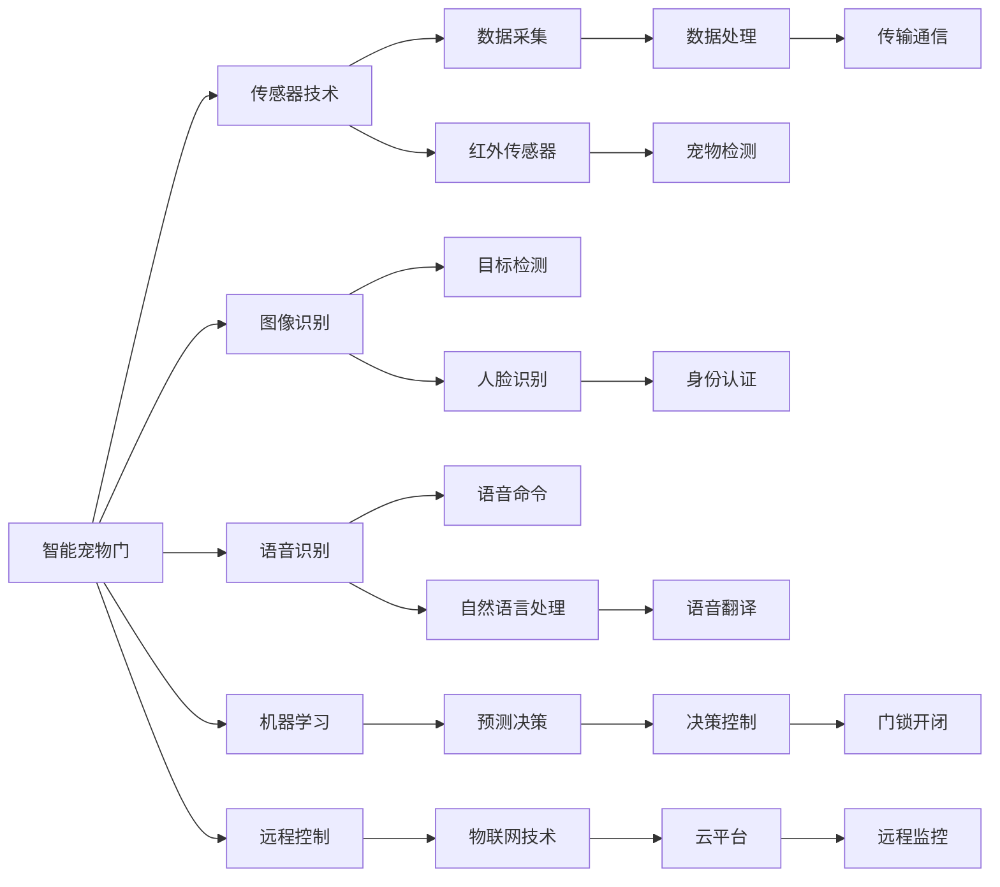

                 

# 智能宠物门创业：自动化宠物出入管理

## 1. 背景介绍

随着生活水平的提高和城市化进程的加快，越来越多的家庭开始饲养宠物。宠物门作为家与户外之间的重要门禁系统，保障宠物出入的便利性和安全性。但传统的机械或磁力宠物门存在诸多问题：机械故障、手动开启不便、用户体验差等。近年来，物联网技术和人工智能在家庭场景的应用不断深入，智能化宠物门应运而生。本博客将从智能宠物门的背景、核心概念和核心技术等角度深入剖析，探讨智能宠物门创业项目的技术实现和未来展望。

## 2. 核心概念与联系

### 2.1 核心概念概述

- **智能宠物门**：通过传感器、图像识别、语音识别等技术，实现宠物自动开闭功能的门系统。具备远程控制、预约通行、防误报、防盗等智能化特性。
- **物联网技术**：利用互联网协议将物体连接起来，实现数据传输、远程控制、状态监测等功能。
- **人工智能**：利用机器学习、计算机视觉、自然语言处理等技术，提升智能宠物门的智能化程度和用户体验。
- **机器学习**：通过训练算法模型，实现数据分类、预测和决策等功能。
- **计算机视觉**：通过图像识别技术，实现目标检测、人脸识别等。
- **自然语言处理**：通过文本分析、语音识别等技术，实现人机交互。

这些核心概念通过物联网技术、人工智能和机器学习等技术的融合，构成了一个功能全面、体验优秀的智能宠物门系统。

### 2.2 核心概念原理和架构的 Mermaid 流程图



该图展示了智能宠物门系统的各个核心组成部分及其关系：

- **传感器技术**：通过红外、超声波、微波等传感器，检测宠物的接近和离开，实现门锁的自动开闭。
- **图像识别**：利用计算机视觉技术，识别宠物的脸部特征，实现身份认证和防误报功能。
- **语音识别**：通过语音识别技术，实现远程控制和语音指令功能。
- **机器学习**：通过训练模型，预测宠物的出入行为，优化门锁控制策略。
- **远程控制**：通过物联网技术，实现远程监控和控制功能。
- **数据处理**：采集和处理传感器的数据，传输到云端进行分析。

## 3. 核心算法原理 & 具体操作步骤

### 3.1 算法原理概述

智能宠物门的核心算法原理主要包括以下几个方面：

- **传感器数据采集与处理**：通过各种传感器，采集宠物的接近和离开信息，并进行数据预处理，如去噪、归一化等。
- **图像识别与目标检测**：利用计算机视觉技术，识别宠物的脸部特征，实现身份认证和防误报功能。
- **语音识别与自然语言处理**：通过语音识别技术，实现远程控制和语音指令功能，通过自然语言处理技术，实现语音翻译和命令解析。
- **机器学习与预测决策**：利用机器学习算法，对宠物的出入行为进行预测和决策，优化门锁控制策略。

### 3.2 算法步骤详解

**Step 1: 传感器数据采集**

智能宠物门通过红外线传感器、超声波传感器、微波传感器等，实时监测宠物的接近和离开。传感器采集的数据需要经过预处理，如去噪、归一化等，以提高数据质量。

**Step 2: 图像识别与目标检测**

采集到的视频数据输入到图像识别模型中，识别出宠物的脸部特征，并进行目标检测。目标检测模型需要经过训练，以识别不同品种和大小的宠物。

**Step 3: 语音识别与自然语言处理**

用户可以通过语音指令控制智能宠物门的开关。语音识别模型需要将用户的语音转换为文本，并解析出具体的命令。自然语言处理模型需要将命令翻译成门锁的开关指令。

**Step 4: 机器学习与预测决策**

智能宠物门可以通过机器学习模型，对宠物的出入行为进行预测和决策。模型需要经过训练，以学习宠物的行为模式和习惯，优化门锁控制策略。

**Step 5: 远程控制与物联网技术**

智能宠物门可以通过物联网技术，实现远程监控和控制功能。用户可以通过手机APP或互联网，实时查看宠物的出入状态，并进行远程控制。

### 3.3 算法优缺点

智能宠物门具有以下优点：

- **智能化程度高**：通过传感器、图像识别、语音识别和机器学习等技术，实现自动开闭和智能决策。
- **用户体验好**：支持远程控制和语音指令，使用方便。
- **安全性高**：通过身份认证和防误报功能，保障宠物和家庭安全。

但智能宠物门也存在一些缺点：

- **技术复杂**：涉及传感器、计算机视觉、语音识别、机器学习等多个技术领域，开发难度大。
- **成本较高**：设备价格和维护成本相对较高。
- **依赖网络**：远程控制和物联网技术需要稳定的网络连接，且网络故障可能导致功能失效。

### 3.4 算法应用领域

智能宠物门作为物联网技术和人工智能的典型应用，在宠物管理、家庭安全、智慧家居等多个领域具有广泛的应用前景。

- **宠物管理**：通过智能宠物门，实现宠物的自动出入管理，保障宠物安全和健康。
- **家庭安全**：智能宠物门可以与家庭监控系统结合，实现全面的安全监控和管理。
- **智慧家居**：智能宠物门可以通过物联网技术，与智能音箱、智能灯等设备结合，实现全场景的智能家居控制。

## 4. 数学模型和公式 & 详细讲解 & 举例说明

### 4.1 数学模型构建

智能宠物门的核心算法模型包括：

- **传感器数据模型**：采集到的数据 $X$，经过预处理后得到 $X_{\text{processed}}$。
- **图像识别模型**：输入为视频数据 $V$，输出为宠物的脸部特征 $F$。
- **语音识别模型**：输入为语音信号 $A$，输出为文本命令 $T$。
- **机器学习模型**：输入为传感器和图像数据 $D$，输出为门锁开关指令 $I$。

### 4.2 公式推导过程

**传感器数据模型**：

$$
X_{\text{processed}} = \text{preprocess}(X)
$$

**图像识别模型**：

$$
F = \text{CNN}(V)
$$

**语音识别模型**：

$$
T = \text{ASR}(A)
$$

**机器学习模型**：

$$
I = \text{ML}(D)
$$

### 4.3 案例分析与讲解

以智能宠物门为例，以下是一个简单的模型推导过程：

- **传感器数据模型**：采集到宠物接近和离开的数据 $X$，经过去噪和归一化等预处理后，得到 $X_{\text{processed}}$。
- **图像识别模型**：输入为处理后的数据 $X_{\text{processed}}$，经过卷积神经网络 (CNN) 处理，得到宠物的脸部特征 $F$。
- **语音识别模型**：输入为用户的语音信号 $A$，经过自动语音识别 (ASR) 处理，得到文本命令 $T$。
- **机器学习模型**：输入为传感器和图像数据 $D$，经过机器学习模型训练，得到门锁开关指令 $I$。

## 5. 项目实践：代码实例和详细解释说明

### 5.1 开发环境搭建

开发智能宠物门需要以下开发环境：

- **Python**：选择Python 3.8及以上版本，作为开发语言。
- **PyTorch**：用于机器学习和深度学习模型的实现。
- **OpenCV**：用于图像处理和目标检测。
- **SpeechRecognition**：用于语音识别和自然语言处理。
- **Flask**：用于开发API接口，实现远程控制。

### 5.2 源代码详细实现

以下是一个基于PyTorch和OpenCV的智能宠物门实现示例：

```python
import torch
import torch.nn as nn
import torchvision.transforms as transforms
import torchvision.models as models
from PIL import Image
from SpeechRecognition import SpeechRecognition
from Flask import Flask

# 加载预训练模型
model = models.resnet50(pretrained=True)
model.fc = nn.Linear(2048, 2)  # 输出门锁开关指令
model.load_state_dict(torch.load('model.pth'))

# 定义模型预处理
transform = transforms.Compose([
    transforms.Resize((224, 224)),
    transforms.ToTensor(),
    transforms.Normalize(mean=[0.485, 0.456, 0.406], std=[0.229, 0.224, 0.225])
])

# 加载图像数据
image = Image.open('pet.jpg')
input_tensor = transform(image).unsqueeze(0)

# 前向传播计算输出
output = model(input_tensor)
print(output)

# 语音识别和命令解析
speech_recognizer = SpeechRecognition()
command = speech_recognizer.listen()
text = speech_recognizer.recognize_google(command)
if text == 'open':
    output = 1
elif text == 'close':
    output = 0
else:
    output = 1

# 远程控制API接口
app = Flask(__name__)

@app.route('/open')
def open_door():
    output = 1
    print('门锁已打开')
    return '门锁已打开'

@app.route('/close')
def close_door():
    output = 0
    print('门锁已关闭')
    return '门锁已关闭'

if __name__ == '__main__':
    app.run(debug=True)
```

### 5.3 代码解读与分析

以上代码实现了以下功能：

- **加载预训练模型**：使用预训练的ResNet模型，并将最后一层全连接层替换为新的2分类输出层。
- **图像预处理**：将输入的图像进行预处理，包括调整大小和归一化。
- **前向传播计算**：将处理后的图像输入模型，计算门锁开关指令。
- **语音识别和命令解析**：使用SpeechRecognition库进行语音识别，将识别结果转换为门锁开关指令。
- **远程控制API接口**：使用Flask库开发API接口，实现远程控制功能。

## 6. 实际应用场景

### 6.1 宠物管理

智能宠物门可以用于家庭宠物的自动出入管理，实现智能门锁的自动开闭和身份认证，保障宠物安全和健康。

**实际应用**：用户通过手机APP控制智能宠物门，实现宠物的自动进出管理，支持远程控制和语音指令。

### 6.2 家庭安全

智能宠物门可以与家庭监控系统结合，实现全面的安全监控和管理。

**实际应用**：智能宠物门可以与监控摄像头、烟雾报警器等设备结合，实现全面的家庭安全监控。

### 6.3 智慧家居

智能宠物门可以通过物联网技术，与智能音箱、智能灯等设备结合，实现全场景的智能家居控制。

**实际应用**：用户通过智能音箱控制智能宠物门，实现全场景的智慧家居控制，支持语音指令和远程控制。

## 7. 工具和资源推荐

### 7.1 学习资源推荐

- **《深度学习》**：Ian Goodfellow等著，全面介绍了深度学习的基本概念和算法。
- **《计算机视觉：算法与应用》**：Richard Szeliski著，详细介绍了计算机视觉的基础知识和应用。
- **《Python深度学习》**：Francois Chollet著，介绍了如何使用TensorFlow和Keras实现深度学习模型。
- **Coursera深度学习课程**：由Andrew Ng教授讲授，介绍了深度学习的基本概念和实践。
- **PyTorch官方文档**：详细介绍了PyTorch库的使用方法，包括模型训练和推理。

### 7.2 开发工具推荐

- **PyTorch**：用于深度学习模型的实现和训练。
- **OpenCV**：用于图像处理和目标检测。
- **SpeechRecognition**：用于语音识别和自然语言处理。
- **Flask**：用于开发API接口，实现远程控制。
- **TensorFlow**：用于深度学习模型的实现和训练。

### 7.3 相关论文推荐

- **"Deep Residual Learning for Image Recognition"**：He等，提出ResNet模型，在图像识别任务中取得了优异的性能。
- **"Convolutional Neural Networks for Sentence Classification"**：Kim，提出使用CNN模型进行句子分类，取得了显著的效果。
- **"Attention is All You Need"**：Vaswani等，提出Transformer模型，在机器翻译任务中取得了突破性进展。

## 8. 总结：未来发展趋势与挑战

### 8.1 总结

智能宠物门作为物联网技术和人工智能的典型应用，已经初步实现了自动化宠物出入管理功能，提升了用户体验和安全性。未来，智能宠物门将继续在宠物管理、家庭安全和智慧家居等领域发挥重要作用。

### 8.2 未来发展趋势

未来，智能宠物门将继续朝着智能化、安全化和普及化方向发展，具有以下几个趋势：

- **智能化程度提升**：通过引入更多传感器和智能算法，提升智能宠物门的智能化程度，实现更智能化的宠物管理。
- **安全性增强**：通过更多身份认证和防误报技术，提升智能宠物门的安全性，保障宠物和家庭的安全。
- **普及化发展**：通过降低成本和提高性能，推动智能宠物门的普及应用，进入更多家庭和场景。
- **多模态融合**：通过融合多种传感器和智能算法，实现多模态融合，提升智能宠物门的感知和决策能力。

### 8.3 面临的挑战

智能宠物门在发展过程中，仍面临一些挑战：

- **技术复杂性高**：涉及传感器、计算机视觉、语音识别和机器学习等多个技术领域，开发难度大。
- **成本高昂**：设备价格和维护成本相对较高，影响普及率。
- **依赖网络**：远程控制和物联网技术需要稳定的网络连接，且网络故障可能导致功能失效。

### 8.4 研究展望

未来，智能宠物门的研究方向可以集中在以下几个方面：

- **多模态融合**：通过融合多种传感器和智能算法，实现多模态融合，提升智能宠物门的感知和决策能力。
- **端到端训练**：通过端到端的训练方式，提升模型的集成度和性能。
- **边缘计算**：通过引入边缘计算技术，实现本地数据处理和决策，提升智能宠物门的实时性和安全性。
- **数据隐私保护**：通过隐私保护技术，保障用户的隐私安全，防止数据泄露和滥用。

## 9. 附录：常见问题与解答

**Q1: 智能宠物门的成本是否过高？**

A: 初期智能宠物门的成本较高，但随着技术进步和规模化生产，成本会逐步降低。同时，智能宠物门可以带来更安全、便捷的宠物管理体验，具有较高的性价比。

**Q2: 智能宠物门是否需要稳定的网络连接？**

A: 智能宠物门依赖远程控制和物联网技术，需要稳定的网络连接。建议部署在网络覆盖良好的家庭环境中，或使用WiFi等无线网络。

**Q3: 智能宠物门是否适合所有宠物？**

A: 智能宠物门主要通过脸部特征进行识别，适合大多数品种的宠物。但面对宠物发型变化或宠物大小差异较大时，可能需要进一步优化模型。

**Q4: 智能宠物门的算法是否容易过拟合？**

A: 智能宠物门的算法容易过拟合，特别是在训练数据不足的情况下。建议采用数据增强、正则化和参数高效微调等技术，减少过拟合风险。

通过以上分析，可以看出智能宠物门在宠物管理、家庭安全和智慧家居等领域具有广泛的应用前景，其技术实现和未来发展值得深入探讨。希望本文对智能宠物门创业项目的开发和应用提供了有益的参考和指导。

---

作者：禅与计算机程序设计艺术 / Zen and the Art of Computer Programming

