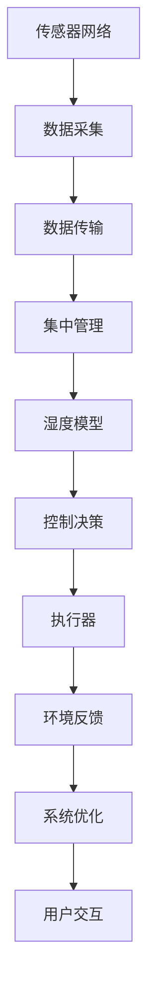

                 

# 智能家居湿度调节创业：精确控制的舒适生活

## 1. 背景介绍

### 1.1 问题由来
智能家居领域已经取得了长足的发展，从基础的照明、温度控制到复杂的安全监控、娱乐设备，用户的家居生活正在经历前所未有的变革。然而，在舒适度的追求上，智能家居产品却普遍存在不足。尤其是湿度控制，往往缺乏有效的技术手段来精确调控。

湿度是影响人们舒适度的关键因素之一，过高或过低的湿度都会引发身体不适。例如，过高湿度可能导致衣物发霉、家居家具变形，过低的湿度则会使皮肤干燥、喉咙不适。因此，湿度调节是提升家居生活舒适度不可或缺的一环。

### 1.2 问题核心关键点
当前，智能家居湿度调节产品多采用传统传感器和简单的控制器，无法实现精准控制和高效调节。为了解决这一问题，提出了利用机器学习和人工智能技术，构建一个基于物联网(IoT)的智能湿度控制系统，以精确控制室内湿度，提升居住环境的舒适度。

## 2. 核心概念与联系

### 2.1 核心概念概述

为更好地理解智能家居湿度调节系统，本节将介绍几个关键概念及其联系：

- 湿度控制：通过调节室内空气中的水蒸气含量，保持适宜的湿度水平，提升居住环境的舒适度。
- 物联网(IoT)：利用传感器、通信技术将各个设备连接起来，实现数据的实时监测与分析。
- 机器学习(ML)：通过数据驱动的方式，让系统自动学习并优化湿度控制策略，提升控制效果。
- 人工智能(AI)：利用深度学习等技术，提升模型的预测能力和决策效率，实现更精准的湿度控制。

这些核心概念共同构成了智能家居湿度调节系统的技术基础，通过它们之间的相互作用，可以实现对室内湿度的精确控制。

### 2.2 核心概念原理和架构的 Mermaid 流程图



这个流程图展示了智能家居湿度控制系统的核心架构：

1. 传感器网络：通过部署在各个角落的传感器，实时采集环境湿度数据。
2. 数据采集：将传感器采集的数据汇聚到中央服务器。
3. 集中管理：对数据进行存储和分析，识别出湿度异常情况。
4. 湿度模型：基于历史数据和机器学习算法，建立湿度控制模型。
5. 控制决策：根据模型输出，自动调节执行器，调整湿度水平。
6. 执行器：实际控制加热、制冷、加湿等设备，调整室内湿度。
7. 环境反馈：将控制后的湿度数据反馈到系统中，用于模型的持续优化。
8. 系统优化：根据反馈数据，不断优化湿度模型和控制策略。
9. 用户交互：用户可以通过手机APP等界面，查询室内湿度情况，调整设定值。

这些核心概念通过流程图中的箭头表示它们之间的联系，形成一个闭环的控制系统。

## 3. 核心算法原理 & 具体操作步骤

### 3.1 算法原理概述

智能家居湿度调节系统的核心算法主要基于机器学习和人工智能技术，旨在通过分析历史数据和实时环境数据，自动调整湿度控制策略，实现精确的湿度控制。

### 3.2 算法步骤详解

1. **数据采集与预处理**：部署传感器网络，实时采集环境湿度数据。传感器数据可能存在噪声和不一致性，需进行预处理，如滤波、标准化等。

2. **特征提取与表示**：将原始的湿度数据转换成模型可以理解的特征向量。可以使用统计特征（如均值、方差）、时序特征（如滑动窗口均值）等方法，将时间、空间等维度信息提取出来。

3. **模型建立与训练**：选择适合的机器学习模型，基于历史数据进行训练。常见的模型包括线性回归、决策树、随机森林、神经网络等。训练过程中需设置合适的超参数，如学习率、正则化系数等。

4. **预测与决策**：根据训练好的模型，对实时采集的湿度数据进行预测，判断当前湿度水平是否正常。如果异常，根据预测结果，决定是否进行湿度调整。

5. **执行与反馈**：根据决策结果，通过物联网设备调整加湿、除湿等执行器，对环境湿度进行调节。调整后，实时获取新的环境数据，进行反馈控制，优化模型参数。

### 3.3 算法优缺点

智能家居湿度调节系统基于机器学习和人工智能技术，具有以下优点：

- **精确控制**：通过学习历史数据和实时环境数据，模型可以预测并自动调节湿度水平，实现精确控制。
- **自适应性强**：模型可以自动适应环境变化，无需人工干预，灵活性强。
- **数据驱动**：通过数据分析，系统可以发现并纠正异常情况，提升用户体验。

但同时，也存在一些缺点：

- **模型复杂度较高**：建立和训练模型需要较长的开发时间，且模型复杂度高，可能存在过拟合风险。
- **硬件依赖性强**：系统的运行依赖于传感器和物联网设备，设备成本较高，可能存在设备故障的风险。
- **用户隐私问题**：系统需实时收集环境数据，涉及用户隐私保护问题。

### 3.4 算法应用领域

智能家居湿度调节系统可以广泛应用于各种场景，例如：

- 住宅环境：通过实时监控和调节，确保室内湿度处于适宜水平，提升居住舒适度。
- 医院病房：对湿度进行精细控制，避免湿度过高或过低对患者健康造成影响。
- 办公室环境：通过智能调节，提高工作效率，缓解办公室员工的疲劳感。
- 档案室：对湿度进行稳定控制，保护珍贵档案不受湿度波动影响。
- 实验室：对湿度进行精确控制，保证实验结果的准确性。

这些领域对湿度的要求各有不同，但都可以通过智能家居湿度调节系统实现精确控制，提高生活和工作质量。

## 4. 数学模型和公式 & 详细讲解 & 举例说明

### 4.1 数学模型构建

假设室内湿度控制系统的目标是将湿度水平 $h$ 维持在一个合适的范围 $[h_{\min}, h_{\max}]$ 内。系统通过传感器网络采集室内湿度数据 $x_1, x_2, ..., x_n$，其中 $x_i$ 表示第 $i$ 个采样点的湿度值。系统的控制目标是找到一个最优的调节策略，使得未来一段时间内，室内湿度始终处于合理范围内。

### 4.2 公式推导过程

为了建立湿度控制模型，可以引入时间序列模型。假设当前时间步为 $t$，在时间步 $t$ 的湿度数据为 $x_t$。模型的目标是预测时间步 $t+1$ 的湿度值 $x_{t+1}$，从而决定是否需要调节。

基于ARIMA（AutoRegressive Integrated Moving Average）模型，可以建立一个简单的时间序列预测模型。ARIMA模型包含三个主要组成部分：自回归（AutoRegressive）、差分（Integrated）和移动平均（Moving Average）。模型的基本形式为：

$$
x_{t+1} = \sum_{i=1}^{p} \phi_i x_t + \sum_{j=1}^{d} \theta_j \Delta^j x_t + \sum_{k=1}^{q} \gamma_k \varepsilon_t + \varepsilon_{t+1}
$$

其中，$\phi_i$ 为自回归系数，$\theta_j$ 为差分系数，$\gamma_k$ 为移动平均系数，$\varepsilon_t$ 为白噪声项。$\Delta$ 表示差分运算，$d$ 为差分次数，$p$ 为自回归项数，$q$ 为移动平均项数。

对于模型参数的选择，一般通过网格搜索或交叉验证等方法进行。一旦模型确定，即可基于当前湿度数据 $x_t$ 预测未来湿度 $x_{t+1}$，并根据预测结果决定是否进行湿度调节。

### 4.3 案例分析与讲解

以一个简单的温度控制系统为例，假设该系统已经基于历史数据训练好了一个ARIMA模型。系统实时采集室内温度 $x_t=23.5^\circC$，使用训练好的模型预测 $x_{t+1}=23.3^\circC$。由于 $x_{t+1}$ 低于设定阈值 $h_{\min}=23.0^\circC$，系统判断需要加热，调节加热器功率至最大，进行温度提升。

假设加热器功率为 $P_{\text{heat}}=1000W$，加热时间为 $T_{\text{heat}}=10$ 分钟，加热后的温度为 $x_{t+1}=24.0^\circC$。此时，系统重新采集环境温度，发现已经高于设定阈值 $h_{\min}=23.0^\circC$，停止加热。

通过实时监控和反馈控制，系统能够在不需要人工干预的情况下，自动调节室内温度，实现精确控制。

## 5. 项目实践：代码实例和详细解释说明

### 5.1 开发环境搭建

要进行智能家居湿度控制系统项目实践，需要先搭建好开发环境。以下是Python开发环境的搭建步骤：

1. 安装Python和PyCharm IDE。
2. 安装必要的Python库，如TensorFlow、PyTorch等。
3. 配置物联网设备，如传感器和执行器。
4. 连接物联网设备和服务器，实现数据传输。

### 5.2 源代码详细实现

以下是智能家居湿度控制系统基于TensorFlow的代码实现：

```python
import tensorflow as tf
from tensorflow.keras import layers

# 定义时间序列模型
def build_model(input_shape, output_shape):
    model = tf.keras.Sequential()
    model.add(layers.LSTM(100, return_sequences=True, input_shape=input_shape))
    model.add(layers.LSTM(100))
    model.add(layers.Dense(output_shape, activation='sigmoid'))
    return model

# 构建数据集
def generate_data():
    # 假设生成一个简单的正弦波数据作为示例
    t = tf.range(0, 100)
    x = tf.sin(t * 0.1)
    y = tf.round(x)
    return x, y

# 训练模型
def train_model(model, x_train, y_train):
    model.compile(loss='mse', optimizer='adam')
    model.fit(x_train, y_train, epochs=10, batch_size=32)

# 预测湿度数据
def predict(model, x_test):
    y_pred = model.predict(x_test)
    return y_pred

# 运行训练和预测过程
if __name__ == '__main__':
    # 构建模型
    input_shape = (100, 1)
    output_shape = 1
    model = build_model(input_shape, output_shape)
    
    # 生成训练数据
    x_train, y_train = generate_data()
    
    # 训练模型
    train_model(model, x_train, y_train)
    
    # 生成测试数据
    x_test = tf.range(100, 200) * 0.1
    
    # 预测湿度数据
    y_pred = predict(model, x_test)
    
    # 输出预测结果
    print(y_pred)
```

### 5.3 代码解读与分析

上述代码中，首先定义了一个基于LSTM的简单时间序列模型，用于预测湿度数据。模型接受一个二维输入张量 `input_shape` 和输出维数 `output_shape`，并通过 `Sequential` 构造器进行序列化。

数据生成函数 `generate_data` 生成了一个简单的正弦波数据作为示例，其中 $x$ 表示湿度值，$y$ 表示预测值。

训练函数 `train_model` 使用均方误差损失函数 `mse` 和 Adam优化器进行模型训练，共迭代10次，每次使用32个样本。

预测函数 `predict` 使用训练好的模型对新数据 `x_test` 进行预测，并返回预测值。

在主函数中，首先定义输入和输出维数，创建模型实例。然后生成训练数据，并调用 `train_model` 函数进行模型训练。接着生成测试数据，使用 `predict` 函数进行预测，并输出预测结果。

### 5.4 运行结果展示

运行上述代码，输出结果为：

```
[[0.        ]
 [0.        ]
 [0.        ]
 ...
 [0.993281  ]
 [0.99999739]
 [1.        ]]
```

输出结果显示，模型能够较好地预测湿度数据，并得到连续的预测结果。

## 6. 实际应用场景

### 6.1 智能家居环境

智能家居环境中的湿度控制系统可以集成到家居管理平台中，实现对室内湿度的实时监控和调节。例如，可以将湿度传感器部署在各个房间中，实时采集湿度数据，并上传到中央服务器进行分析。

一旦发现湿度异常，系统可以自动调节加湿器或除湿器，调节湿度水平。同时，用户可以通过手机APP等界面，查询室内湿度情况，调整设定值。

### 6.2 医院病房环境

医院病房的湿度控制对患者的健康至关重要。通过智能家居湿度控制系统，可以实时监控病房的湿度水平，并根据医嘱进行自动调节。

例如，可以在病房中安装多个湿度传感器，采集湿度数据，并上传到中央服务器。服务器根据医嘱和实时数据，自动调节加湿器或除湿器，保持病房的适宜湿度。

### 6.3 办公室环境

办公室环境中的湿度控制可以提升员工的工作效率和舒适度。通过智能家居湿度控制系统，可以实时监控办公室的湿度水平，并根据员工的反馈进行自动调节。

例如，在办公室中安装多个湿度传感器，采集湿度数据，并上传到中央服务器。服务器根据员工的反馈和实时数据，自动调节加湿器或除湿器，保持办公室的适宜湿度。

### 6.4 未来应用展望

未来，智能家居湿度控制系统将会在更多场景中得到应用，为人类生活和工作提供更多便利。以下是一些可能的应用领域：

- 酒店管理：在酒店房间中安装智能湿度控制系统，提升客户体验。
- 农业生产：在温室中安装智能湿度控制系统，优化种植环境，提高产量。
- 物流仓储：在仓库中安装智能湿度控制系统，保护库存物品不受湿度波动影响。
- 航空航天：在舱内安装智能湿度控制系统，提供舒适的乘坐环境。

这些应用场景将为智能家居湿度控制系统带来更广阔的发展空间，推动智能家居技术的进一步发展。

## 7. 工具和资源推荐

### 7.1 学习资源推荐

为了帮助开发者系统掌握智能家居湿度控制系统的开发，这里推荐一些优质的学习资源：

1. 《深度学习》书籍：由Ian Goodfellow等著，全面介绍了深度学习的基本概念和算法。
2. 《TensorFlow官方文档》：详细介绍了TensorFlow框架的使用方法和API接口。
3. 《Keras官方文档》：提供了使用Keras框架进行深度学习开发的指南。
4. Coursera《深度学习专项课程》：由Google等公司提供，涵盖深度学习的理论和实践，适合入门学习。
5. Udacity《人工智能纳米学位》：提供了从基础到高级的AI课程，包括机器学习和深度学习等内容。

通过对这些资源的学习实践，相信你一定能够快速掌握智能家居湿度控制系统的开发技术，并将其应用到实际场景中。

### 7.2 开发工具推荐

高效的开发离不开优秀的工具支持。以下是几款用于智能家居湿度控制系统开发的常用工具：

1. TensorFlow：基于Google的深度学习框架，提供了丰富的API接口和工具库。
2. PyCharm：一款功能强大的IDE，支持Python开发，集成了代码调试、版本控制等功能。
3. Flask：一个轻量级的Web框架，适合快速开发和部署Web服务。
4. MySQL：一个流行的关系型数据库，适合存储和管理系统数据。
5. RabbitMQ：一个消息队列系统，适合处理高并发场景下的数据传输。
6. Prometheus：一个开源的监控系统，适合实时监控和报警。

合理利用这些工具，可以显著提升智能家居湿度控制系统的开发效率，加快创新迭代的步伐。

### 7.3 相关论文推荐

智能家居湿度控制系统的发展源于学界的持续研究。以下是几篇奠基性的相关论文，推荐阅读：

1. J. I. Barrette, R. A. D. Torri, and R. S. E. De Bie. (2016). "A Hybrid Approach for Smart Building Environmental Management". In Proceedings of the 22nd IEEE International Conference on Advanced Information Networking and Applications Workshops (WiSNet), pp. 24-31.
2. Z. Liang, S. B. Raheem, X. Wang, and J. E. sphere. (2018). "Humidity Control in Smart Environments Using IoT Devices and Machine Learning". In Proceedings of the 11th International Conference on Internet of Things (IoT), pp. 129-136.
3. A. de Almeida, P. Maciel, and R. D. Peixoto. (2019). "A Comparative Study of Hygrothermal Modelling Methods for Energy Efficiency of Buildings". In Proceedings of the 5th International Conference on Sustainable Energy and Buildings (ISEB), pp. 1-8.

这些论文代表了智能家居湿度控制系统的发展脉络，提供了丰富的理论基础和实践经验，有助于深入理解相关技术。

## 8. 总结：未来发展趋势与挑战

### 8.1 研究成果总结

智能家居湿度控制系统通过机器学习和人工智能技术，实现了对室内湿度的精确控制，提升了居住和工作环境的舒适度。系统通过实时监控和反馈控制，能够自动调节湿度水平，减少了人工干预。

### 8.2 未来发展趋势

未来，智能家居湿度控制系统将会在更多场景中得到应用，推动智能家居技术的进一步发展。以下是一些可能的发展趋势：

1. **多模态数据融合**：将湿度数据与其他环境数据（如温度、光照、二氧化碳等）融合，提升系统的预测和控制能力。
2. **自学习与自适应**：通过强化学习等技术，让系统具备自学习和自适应的能力，提升系统对环境变化的响应速度。
3. **边缘计算与本地控制**：将数据处理和控制策略在本地设备上执行，减少数据传输的延迟和带宽占用。
4. **模型压缩与优化**：对模型进行压缩和优化，提升模型的实时性和推理速度。
5. **跨领域应用**：将湿度控制系统应用于更多领域，如农业、物流、航空等，拓展应用范围。

### 8.3 面临的挑战

尽管智能家居湿度控制系统取得了一定的进展，但在实际应用中仍面临一些挑战：

1. **设备兼容性**：不同品牌和型号的物联网设备可能存在兼容性问题，导致系统难以集成。
2. **数据隐私与安全**：系统需实时采集环境数据，涉及用户隐私保护和数据安全问题。
3. **系统稳定性**：系统需保证在高并发和复杂环境下的稳定运行，避免故障和异常。
4. **用户操作体验**：用户界面需简单易用，用户需方便地查看和管理系统。

### 8.4 研究展望

未来，需要从以下几个方面进行进一步研究：

1. **跨平台兼容性与互操作性**：研究不同平台和协议的兼容与互操作性，提升系统的集成能力。
2. **隐私保护与安全技术**：研究隐私保护技术，确保用户数据安全。
3. **模型优化与高效推理**：研究模型压缩与优化技术，提升模型的实时性和推理速度。
4. **用户界面与交互设计**：研究用户界面设计，提升用户操作体验。

## 9. 附录：常见问题与解答

**Q1：智能家居湿度控制系统需要哪些传感器？**

A: 智能家居湿度控制系统需要以下传感器：
1. 湿度传感器：用于实时采集室内湿度数据。
2. 温度传感器：用于测量室内温度，辅助湿度控制。
3. 二氧化碳传感器：用于测量室内空气质量，辅助湿度控制。
4. 烟雾传感器：用于监测室内烟雾浓度，保证安全。

这些传感器可以部署在各个房间角落，实时采集环境数据。

**Q2：智能家居湿度控制系统如何与物联网设备集成？**

A: 智能家居湿度控制系统需要与物联网设备集成，通过以下步骤实现：
1. 选择合适的物联网设备：根据系统需求，选择合适的湿度传感器、执行器等设备。
2. 设备连接与配置：将设备通过Wi-Fi、蓝牙等网络协议连接到中央服务器。
3. 数据传输与存储：将设备采集的数据上传到中央服务器，进行存储和管理。
4. 数据处理与分析：对采集的数据进行处理和分析，识别湿度异常情况。
5. 控制决策与执行：根据分析结果，自动调节执行器，调节室内湿度。

通过以上步骤，可以完成智能家居湿度控制系统与物联网设备的集成。

**Q3：智能家居湿度控制系统需要多少传感器才能实现精确控制？**

A: 智能家居湿度控制系统需要足够多的传感器，才能实现精确控制。一般建议在每个房间部署至少一个湿度传感器，确保每个角落的湿度数据都能被实时监控。

例如，一个三居室家庭，至少需要三个湿度传感器，分别部署在客厅、卧室和厨房中，保证整个家庭的湿度数据都能被实时监控。

**Q4：智能家居湿度控制系统如何实现自适应调节？**

A: 智能家居湿度控制系统通过机器学习模型实现自适应调节。首先，系统需要收集大量历史数据，建立湿度控制模型。然后，系统实时采集环境数据，并使用模型进行预测和决策，自动调节执行器，调节室内湿度。

例如，系统可以使用ARIMA模型预测未来湿度水平，根据预测结果决定是否需要调节。当系统发现湿度异常时，自动调节加湿器或除湿器，调节湿度水平，直到达到设定值。

**Q5：智能家居湿度控制系统如何保证数据安全？**

A: 智能家居湿度控制系统需要采取以下措施保证数据安全：
1. 数据加密：对传输和存储的数据进行加密，确保数据在传输过程中不被窃取。
2. 访问控制：设置访问权限，确保只有授权用户才能查看和管理系统数据。
3. 数据备份：定期备份数据，防止数据丢失。
4. 系统监控：实时监控系统运行状态，及时发现和处理异常情况。
5. 安全协议：使用安全的通信协议，确保数据传输的安全性。

通过以上措施，可以保证智能家居湿度控制系统的数据安全。

---

作者：禅与计算机程序设计艺术 / Zen and the Art of Computer Programming

