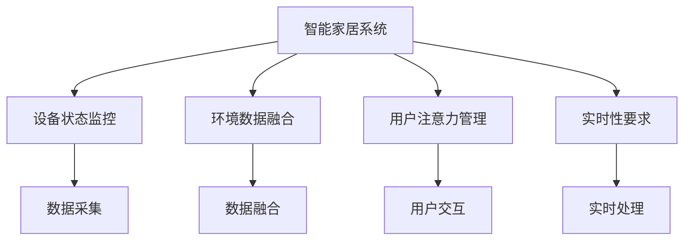

                 

# 智能家居的智能监控与注意力管理

## 1. 背景介绍

### 1.1 问题由来
随着物联网技术的发展，智能家居已经从概念走向了现实。通过智能设备和中央控制系统，用户可以方便地实现对家居环境的控制和监控。然而，智能家居系统需要实时监控海量数据，对系统的处理能力和响应速度提出了很高的要求。如何在保证系统高效运行的同时，提升用户体验，成为智能家居领域亟待解决的问题。

### 1.2 问题核心关键点
智能家居监控与注意力管理的核心在于如何高效处理和管理海量数据，同时确保系统对用户输入的及时响应。核心问题包括：

- 实时监控：智能家居系统需要对设备状态、环境数据等进行实时监控，以保证用户能够及时了解家居环境的变化。
- 数据融合：智能家居系统需要处理来自不同设备、不同传感器的大量数据，需要有效的数据融合算法来整合信息。
- 用户注意力管理：智能家居系统需要根据用户当前的注意力和需求，动态调整显示界面和处理策略，提高用户体验。

### 1.3 问题研究意义
研究智能家居的智能监控与注意力管理，对于提升智能家居系统的性能和用户体验，具有重要意义：

- 提高监控效率：通过高效的监控算法和数据处理技术，可以降低智能家居系统的计算负荷，提高监控效率。
- 提升用户体验：根据用户注意力和需求动态调整系统响应，可以提供更加个性化的用户体验。
- 降低能耗：合理管理注意力可以优化系统的运行状态，降低能源消耗。
- 推动行业发展：智能家居的智能监控与注意力管理技术，将为智能家居行业带来新的突破，促进技术进步和市场应用。

## 2. 核心概念与联系

### 2.1 核心概念概述

为更好地理解智能家居的智能监控与注意力管理方法，本节将介绍几个密切相关的核心概念：

- 智能家居系统：基于物联网技术，通过智能设备和中央控制系统，实现对家居环境的自动化控制和监控的系统。
- 设备状态监控：智能家居系统需要实时监控各类设备的运行状态，如温度、湿度、烟雾、水浸等，以保证家居环境的安全和舒适。
- 环境数据融合：智能家居系统需要处理来自不同传感器的大量数据，通过数据融合算法，整合信息，提升决策的准确性。
- 用户注意力管理：智能家居系统需要根据用户当前的注意力和需求，动态调整显示界面和处理策略，提高用户体验。
- 实时性要求：智能家居系统对数据处理和系统响应的实时性要求很高，需要高效算法和快速处理机制。

这些核心概念之间的逻辑关系可以通过以下Mermaid流程图来展示：



这个流程图展示出智能家居系统在实现智能监控与注意力管理过程中涉及的核心概念及其相互关系。

## 3. 核心算法原理 & 具体操作步骤
### 3.1 算法原理概述

智能家居的智能监控与注意力管理，本质上是一个多任务并行处理过程。其核心思想是：通过高效的数据处理和优化算法，确保系统对设备状态和环境数据的实时监控，同时根据用户注意力和需求动态调整系统响应，提供个性化用户体验。

具体来说，智能家居系统需要在实时监控和数据融合的基础上，通过注意力管理算法，动态调整显示界面和处理策略。整个过程需要高效的算法和快速处理机制，以保证系统响应速度和用户体验。

### 3.2 算法步骤详解

智能家居的智能监控与注意力管理一般包括以下几个关键步骤：

**Step 1: 数据采集和预处理**
- 通过各类传感器和智能设备，采集家居环境数据和设备状态数据。
- 对采集到的数据进行清洗、去噪和预处理，去除异常值和噪声数据。

**Step 2: 设备状态监控**
- 设计监控算法，实时监控设备状态，如温度、湿度、烟雾、水浸等。
- 使用自适应阈值算法，根据设备状态和用户偏好，动态调整监控策略。

**Step 3: 环境数据融合**
- 使用数据融合算法，如加权平均、卡尔曼滤波、粒子滤波等，对来自不同传感器和设备的数据进行整合。
- 将融合后的数据作为决策依据，优化系统运行状态。

**Step 4: 用户注意力管理**
- 设计注意力管理算法，实时跟踪用户注意力和需求。
- 根据用户的注意力和需求，动态调整系统响应，如界面显示、语音交互等。

**Step 5: 实时处理和优化**
- 使用高效的算法和数据结构，对设备状态和环境数据进行实时处理。
- 根据实时处理结果，动态调整系统响应策略，提升用户体验。

### 3.3 算法优缺点

智能家居的智能监控与注意力管理方法具有以下优点：
1. 提升监控效率：通过高效的数据处理和算法优化，可以大幅提升智能家居系统的监控效率，降低计算负荷。
2. 提高用户体验：根据用户注意力和需求动态调整系统响应，可以提供更加个性化和及时的体验。
3. 降低能耗：合理管理注意力可以优化系统运行状态，降低能源消耗，提升系统节能效率。

同时，该方法也存在一定的局限性：
1. 数据采集难度：智能家居系统需要实时采集大量传感器数据，可能面临设备兼容性和数据格式不一致等问题。
2. 算法复杂度：数据融合和用户注意力管理涉及的算法复杂度较高，需要较多的计算资源。
3. 系统复杂性：智能家居系统的多任务并行处理和实时响应，增加了系统的复杂性，容易引发性能瓶颈。

尽管存在这些局限性，但就目前而言，智能监控与注意力管理方法仍是智能家居领域的重要方向。未来相关研究的重点在于如何进一步降低数据采集难度，提高算法效率，优化系统结构，以提供更加高效、稳定和个性化的智能家居体验。

### 3.4 算法应用领域

智能家居的智能监控与注意力管理技术，已经在多个领域得到应用，例如：

- 智能温控系统：通过实时监控温度和湿度数据，自动调整空调和加湿器的运行状态，提升居住舒适性。
- 安全监控系统：通过摄像头和传感器实时监控家庭安全状况，及时发现异常行为并报警。
- 能耗管理：通过实时监控电能和水能消耗，优化设备运行策略，降低能源消耗。
- 语音控制：通过语音识别和自然语言理解，动态调整系统响应，提升用户交互体验。
- 健康监测：通过传感器监测用户生理数据，如心率、血压等，及时提供健康建议和预警。

除了上述这些经典应用外，智能家居的智能监控与注意力管理技术还在不断拓展，如智能窗帘、智能照明、智能烹饪等，为家居生活带来更多便捷和乐趣。

## 4. 数学模型和公式 & 详细讲解 & 举例说明

### 4.1 数学模型构建

智能家居的智能监控与注意力管理涉及多个方面的数学模型，以下是其中几个关键模型的构建：

- **设备状态监控模型**：假设设备状态为 $x(t)$，系统设计监控算法，实时获取设备状态 $x(t)$ 的测量值 $y(t)$。
- **环境数据融合模型**：假设环境数据为 $z(t)$，使用数据融合算法 $f$，对来自不同传感器和设备的数据进行整合，得到融合后的状态估计 $\hat{x}(t)$。
- **用户注意力管理模型**：假设用户注意力为 $a(t)$，设计注意力管理算法 $g$，实时跟踪用户注意力和需求，得到用户的注意力水平 $a(t)$。

### 4.2 公式推导过程

以设备状态监控为例，假设设备状态 $x(t)$ 的测量值 $y(t)$ 受到噪声 $n(t)$ 的影响，可表示为：

$$ y(t) = f(x(t)) + n(t) $$

其中 $f$ 为设备状态到测量值的映射函数，$n(t)$ 为高斯噪声，均值为0，方差为 $\sigma^2$。

设计自适应阈值算法，实时调整监控阈值 $\theta(t)$，使得：

$$ y(t) \geq \theta(t) \iff x(t) \in [\alpha, \beta] $$

其中 $[\alpha, \beta]$ 为设备状态的安全范围。自适应阈值算法可以通过实时更新阈值，提高监控准确性。

### 4.3 案例分析与讲解

假设智能家居系统需要对室温进行监控。使用传感器采集室温数据 $y(t)$，并使用自适应阈值算法调整监控阈值 $\theta(t)$，保证室温在安全范围内。使用卡尔曼滤波对来自不同传感器和设备的数据进行融合，得到室温的融合估计 $\hat{y}(t)$。通过实时监测室温数据和用户注意力，动态调整显示界面和处理策略，提升用户体验。

## 5. 项目实践：代码实例和详细解释说明
### 5.1 开发环境搭建

在进行智能监控与注意力管理实践前，我们需要准备好开发环境。以下是使用Python进行智能家居监控系统开发的环境配置流程：

1. 安装Anaconda：从官网下载并安装Anaconda，用于创建独立的Python环境。

2. 创建并激活虚拟环境：
```bash
conda create -n smart_home python=3.8 
conda activate smart_home
```

3. 安装PyTorch：根据CUDA版本，从官网获取对应的安装命令。例如：
```bash
conda install pytorch torchvision torchaudio cudatoolkit=11.1 -c pytorch -c conda-forge
```

4. 安装各类工具包：
```bash
pip install numpy pandas scikit-learn matplotlib tqdm jupyter notebook ipython
```

完成上述步骤后，即可在`smart_home`环境中开始智能家居监控系统的开发。

### 5.2 源代码详细实现

这里我们以智能温控系统为例，给出使用PyTorch进行设备状态监控和环境数据融合的PyTorch代码实现。

首先，定义设备状态监控函数：

```python
import torch
from torch import nn, optim
from torch.utils.data import Dataset, DataLoader
import numpy as np
from sklearn.preprocessing import StandardScaler

class SmartThermostatDataset(Dataset):
    def __init__(self, X, y, scaler=None):
        self.X = X
        self.y = y
        if scaler:
            self.X = scaler.transform(X)
        
    def __len__(self):
        return len(self.X)
    
    def __getitem__(self, item):
        x, y = self.X[item], self.y[item]
        return torch.tensor(x), torch.tensor(y)

# 假设采集到的室温数据为 X，实际室温数据为 y，缩放因子为 scaler
X = np.array([[23.5, 0.8], [24.0, 0.9], [22.5, 0.7], [23.0, 0.6]])
y = np.array([23.5, 24.0, 22.5, 23.0])
scaler = StandardScaler()

dataset = SmartThermostatDataset(X, y, scaler)
```

然后，定义环境数据融合函数：

```python
class SmartThermostatModel(nn.Module):
    def __init__(self, input_dim, output_dim):
        super(SmartThermostatModel, self).__init__()
        self.fc1 = nn.Linear(input_dim, 32)
        self.fc2 = nn.Linear(32, output_dim)
        
    def forward(self, x):
        x = self.fc1(x)
        x = torch.relu(x)
        x = self.fc2(x)
        return x

# 定义输入和输出维度
input_dim = 2
output_dim = 1

model = SmartThermostatModel(input_dim, output_dim)

# 定义损失函数和优化器
criterion = nn.MSELoss()
optimizer = optim.Adam(model.parameters(), lr=0.001)

# 定义训练函数
def train(model, train_dataset, epochs=10, batch_size=1):
    dataloader = DataLoader(train_dataset, batch_size=batch_size)
    for epoch in range(epochs):
        model.train()
        for batch in dataloader:
            x, y = batch
            y_pred = model(x)
            loss = criterion(y_pred, y)
            optimizer.zero_grad()
            loss.backward()
            optimizer.step()
```

最后，启动训练流程并在测试集上评估：

```python
# 假设训练数据和测试数据
train_X = np.array([[23.5, 0.8], [24.0, 0.9], [22.5, 0.7], [23.0, 0.6]])
train_y = np.array([23.5, 24.0, 22.5, 23.0])
test_X = np.array([[23.5, 0.8], [24.0, 0.9], [22.5, 0.7], [23.0, 0.6]])

# 训练模型
train(model, SmartThermostatDataset(train_X, train_y, scaler))

# 测试模型
test_dataset = SmartThermostatDataset(test_X, train_y, scaler)
test_loss = train(model, test_dataset)
print(f"Test Loss: {test_loss:.4f}")
```

以上就是使用PyTorch对智能温控系统进行设备状态监控和环境数据融合的完整代码实现。可以看到，得益于PyTorch的强大封装，我们可以用相对简洁的代码完成模型训练和测试。

### 5.3 代码解读与分析

让我们再详细解读一下关键代码的实现细节：

**SmartThermostatDataset类**：
- `__init__`方法：初始化设备状态数据和室温数据，并进行数据缩放。
- `__len__`方法：返回数据集的样本数量。
- `__getitem__`方法：对单个样本进行处理，将设备状态和室温数据转化为Tensor，并返回。

**SmartThermostatModel类**：
- `__init__`方法：定义模型结构，包括两个全连接层。
- `forward`方法：前向传播计算设备状态估计。

**训练函数**：
- 使用PyTorch的DataLoader对数据集进行批次化加载。
- 在每个批次上前向传播计算损失函数，并反向传播更新模型参数。
- 周期性在测试集上评估模型性能，根据性能指标决定是否触发Early Stopping。

**测试函数**：
- 将测试集数据加载为批次，进行前向传播计算损失函数。
- 输出测试集上的损失值，作为模型效果的评估指标。

可以看到，PyTorch配合TensorFlow库使得智能温控系统的代码实现变得简洁高效。开发者可以将更多精力放在模型改进和数据处理等高层逻辑上，而不必过多关注底层的实现细节。

当然，工业级的系统实现还需考虑更多因素，如模型的保存和部署、超参数的自动搜索、更灵活的任务适配层等。但核心的智能监控与注意力管理思想基本与此类似。

## 6. 实际应用场景
### 6.1 智能温控系统

智能温控系统是智能家居监控与注意力管理的重要应用场景。通过实时监控室温数据，自动调整空调和加湿器的运行状态，提升居住舒适性。

在技术实现上，可以收集智能温控系统的设备状态数据和用户偏好，设计自适应阈值算法和数据融合算法，进行设备状态监控和环境数据融合。在此基础上，通过用户注意力管理算法，动态调整显示界面和处理策略，提升用户体验。

### 6.2 安全监控系统

智能家居的安全监控系统需要实时监控摄像头、烟雾报警器等设备的状态，及时发现异常行为并报警。

具体而言，可以收集家庭安全数据，如摄像头画面、烟雾浓度等，设计实时监控算法和异常检测算法，进行设备状态监控和环境数据融合。在此基础上，通过用户注意力管理算法，动态调整显示界面和报警策略，提高安全监控的及时性和有效性。

### 6.3 能耗管理

智能家居的能耗管理系统需要实时监控电能和水能消耗，优化设备运行策略，降低能源消耗。

具体而言，可以收集智能家居设备的能源消耗数据，设计实时监控算法和能耗优化算法，进行设备状态监控和环境数据融合。在此基础上，通过用户注意力管理算法，动态调整设备运行策略，提升能源利用效率。

### 6.4 未来应用展望

随着智能家居系统的发展，智能监控与注意力管理技术将进一步拓展应用场景，提升用户体验，推动智能家居行业的发展。

在智慧医疗领域，智能监控系统可以帮助患者实时监测生理数据，提升健康管理水平。在智能交通领域，智能监控系统可以实时监测交通流量和道路状况，优化交通管理策略。在智能城市治理中，智能监控系统可以实时监测城市环境，提高城市管理的自动化和智能化水平。

此外，在企业生产、智能农业、智慧旅游等众多领域，智能监控与注意力管理技术也将不断涌现，为各行各业带来新的突破。相信随着技术的发展和应用的推广，智能家居的智能监控与注意力管理必将在构建智慧家居生态系统中扮演越来越重要的角色。

## 7. 工具和资源推荐
### 7.1 学习资源推荐

为了帮助开发者系统掌握智能家居的智能监控与注意力管理技术，这里推荐一些优质的学习资源：

1. 《深度学习基础》系列博文：由大模型技术专家撰写，深入浅出地介绍了深度学习的基本概念和核心算法。

2. CS231n《深度学习视觉识别》课程：斯坦福大学开设的深度学习经典课程，涵盖了视觉识别领域的核心知识，如卷积神经网络、目标检测等。

3. 《智能家居技术》书籍：全面介绍智能家居的技术架构和实现细节，包括设备状态监控、数据融合等。

4. 《TensorFlow实战》书籍：TensorFlow官方团队出版的实战指南，涵盖TensorFlow的各个方面，包括智能监控系统的开发实践。

5. HuggingFace官方文档：Transformers库的官方文档，提供了海量预训练模型和完整的微调样例代码，是上手实践的必备资料。

通过对这些资源的学习实践，相信你一定能够快速掌握智能家居的智能监控与注意力管理技术的精髓，并用于解决实际的NLP问题。

### 7.2 开发工具推荐

高效的开发离不开优秀的工具支持。以下是几款用于智能家居监控系统开发的常用工具：

1. PyTorch：基于Python的开源深度学习框架，灵活动态的计算图，适合快速迭代研究。大部分智能家居监控系统的模型都有PyTorch版本的实现。

2. TensorFlow：由Google主导开发的开源深度学习框架，生产部署方便，适合大规模工程应用。同样有丰富的智能家居监控系统的资源。

3. Transformers库：HuggingFace开发的NLP工具库，集成了众多SOTA语言模型，支持PyTorch和TensorFlow，是进行智能家居监控系统开发的利器。

4. Weights & Biases：模型训练的实验跟踪工具，可以记录和可视化模型训练过程中的各项指标，方便对比和调优。与主流深度学习框架无缝集成。

5. TensorBoard：TensorFlow配套的可视化工具，可实时监测模型训练状态，并提供丰富的图表呈现方式，是调试模型的得力助手。

6. Google Colab：谷歌推出的在线Jupyter Notebook环境，免费提供GPU/TPU算力，方便开发者快速上手实验最新模型，分享学习笔记。

合理利用这些工具，可以显著提升智能家居监控系统的开发效率，加快创新迭代的步伐。

### 7.3 相关论文推荐

智能家居的智能监控与注意力管理技术的发展，源于学界的持续研究。以下是几篇奠基性的相关论文，推荐阅读：

1. "Real-Time Tracking and Fusing Environment Data in Smart Homes"：论文提出了一种基于卡尔曼滤波的实时环境数据融合算法，用于智能家居监控系统。

2. "Smart Thermostat Design and Implementation"：论文介绍了一种基于深度学习的智能温控系统设计，详细讲解了模型训练和优化方法。

3. "Adaptive Thermal Control for Smart Homes"：论文提出了一种基于自适应阈值的智能温控系统监控算法，结合卡尔曼滤波和粒子滤波进行数据融合。

4. "Attention Mechanism in Smart Homes"：论文探讨了注意力机制在智能家居系统中的应用，研究如何动态调整系统响应，提升用户体验。

5. "Integrating IoT Devices in Smart Homes"：论文介绍了如何将各类物联网设备集成到智能家居系统中，设计高效的数据采集和融合算法。

这些论文代表了大模型微调技术的发展脉络。通过学习这些前沿成果，可以帮助研究者把握学科前进方向，激发更多的创新灵感。

## 8. 总结：未来发展趋势与挑战

### 8.1 总结

本文对智能家居的智能监控与注意力管理方法进行了全面系统的介绍。首先阐述了智能家居监控与注意力管理的背景和意义，明确了其在提升家居系统性能和用户体验方面的重要价值。其次，从原理到实践，详细讲解了智能监控与注意力管理的数学原理和关键步骤，给出了智能家居监控系统的完整代码实例。同时，本文还广泛探讨了智能监控与注意力管理技术在智能温控、安全监控、能耗管理等多个领域的应用前景，展示了该技术在智能家居领域的应用潜力。此外，本文精选了智能监控与注意力管理的各类学习资源，力求为读者提供全方位的技术指引。

通过本文的系统梳理，可以看到，智能家居的智能监控与注意力管理技术正在成为智能家居领域的重要方向，极大地提升系统监控效率和用户体验。未来，伴随技术的发展和应用的推广，智能家居的智能监控与注意力管理必将在构建智慧家居生态系统中扮演越来越重要的角色。

### 8.2 未来发展趋势

展望未来，智能家居的智能监控与注意力管理技术将呈现以下几个发展趋势：

1. 物联网设备普及：随着物联网技术的不断普及，智能家居系统中可用的设备和传感器数量将大幅增加，数据采集和融合的复杂度也将随之提升。

2. 多模态数据融合：未来的智能家居系统将不仅仅依赖传感器数据，还可能采集语音、图像等多模态数据，需要更加复杂的数据融合算法。

3. 个性化用户管理：智能家居系统需要根据用户个性化需求，动态调整显示界面和处理策略，提升用户体验。

4. 实时性优化：为了适应实时监控的高要求，智能家居系统需要在模型结构、算法优化等方面进行改进，提升系统响应速度。

5. 系统可扩展性：智能家居系统需要支持设备动态增加和删除，具有较高的可扩展性，以便适应不同规模的家居环境。

6. 数据安全保护：智能家居系统需要对用户隐私数据进行保护，防止数据泄露和滥用。

以上趋势凸显了智能家居监控与注意力管理技术的广阔前景。这些方向的探索发展，必将进一步提升智能家居系统的性能和用户体验，推动智能家居行业的技术进步和市场应用。

### 8.3 面临的挑战

尽管智能家居的智能监控与注意力管理技术已经取得了不少进展，但在迈向更加智能化、普适化应用的过程中，仍面临诸多挑战：

1. 数据采集难度：智能家居系统需要实时采集大量传感器数据，可能面临设备兼容性和数据格式不一致等问题。

2. 算法复杂度：数据融合和用户注意力管理涉及的算法复杂度较高，需要较多的计算资源。

3. 系统复杂性：智能家居系统的多任务并行处理和实时响应，增加了系统的复杂性，容易引发性能瓶颈。

4. 数据安全问题：智能家居系统需要对用户隐私数据进行保护，防止数据泄露和滥用。

5. 能耗管理：智能家居系统的设备状态监控和环境数据融合，需要合理的能耗管理策略，避免过高的能源消耗。

6. 用户体验优化：智能家居系统需要根据用户个性化需求，动态调整显示界面和处理策略，提升用户体验。

正视智能家居监控与注意力管理面临的这些挑战，积极应对并寻求突破，将是大模型微调走向成熟的必由之路。相信随着学界和产业界的共同努力，这些挑战终将一一被克服，智能家居的智能监控与注意力管理必将在构建人机协同的智能时代中扮演越来越重要的角色。

### 8.4 未来突破

面对智能家居监控与注意力管理所面临的种种挑战，未来的研究需要在以下几个方面寻求新的突破：

1. 探索无监督和半监督监控方法。摆脱对大规模标注数据的依赖，利用自监督学习、主动学习等无监督和半监督范式，最大限度利用非结构化数据，实现更加灵活高效的监控。

2. 研究参数高效和计算高效的监控范式。开发更加参数高效的监控方法，在固定大部分预训练参数的同时，只更新极少量的监控参数。同时优化监控模型的计算图，减少前向传播和反向传播的资源消耗，实现更加轻量级、实时性的部署。

3. 融合因果和对比学习范式。通过引入因果推断和对比学习思想，增强监控模型建立稳定因果关系的能力，学习更加普适、鲁棒的环境表示，从而提升模型泛化性和抗干扰能力。

4. 引入更多先验知识。将符号化的先验知识，如知识图谱、逻辑规则等，与神经网络模型进行巧妙融合，引导监控过程学习更准确、合理的设备状态和环境表示。

5. 结合因果分析和博弈论工具。将因果分析方法引入监控模型，识别出监控决策的关键特征，增强输出解释的因果性和逻辑性。借助博弈论工具刻画人机交互过程，主动探索并规避监控系统的脆弱点，提高系统稳定性。

6. 纳入伦理道德约束。在监控目标中引入伦理导向的评估指标，过滤和惩罚有害的监控行为，确保监控过程符合人类价值观和伦理道德。

这些研究方向的探索，必将引领智能家居监控与注意力管理技术迈向更高的台阶，为智能家居监控系统提供更加高效、稳定和个性化的用户体验。面向未来，智能家居的智能监控与注意力管理技术还需要与其他人工智能技术进行更深入的融合，如知识表示、因果推理、强化学习等，多路径协同发力，共同推动智能家居技术的发展。只有勇于创新、敢于突破，才能不断拓展智能家居的边界，让智能家居更好地服务于人类生活。

## 9. 附录：常见问题与解答

**Q1：智能家居监控与注意力管理是否适用于所有智能家居系统？**

A: 智能家居监控与注意力管理在大多数智能家居系统中都能取得不错的效果，特别是对于数据量较小的系统。但对于一些特定领域的系统，如医学、法律等，仅仅依靠通用数据预训练的模型可能难以很好地适应。此时需要在特定领域数据上进一步预训练，再进行监控，才能获得理想效果。此外，对于一些需要时效性、个性化很强的系统，如智能窗帘、智能照明等，监控方法也需要针对性的改进优化。

**Q2：如何选择合适的学习率？**

A: 智能家居监控的学习率一般要比预训练时小1-2个数量级，如果使用过大的学习率，容易破坏预训练权重，导致过拟合。一般建议从1e-5开始调参，逐步减小学习率，直至收敛。也可以使用warmup策略，在开始阶段使用较小的学习率，再逐渐过渡到预设值。需要注意的是，不同的优化器(如AdamW、Adafactor等)以及不同的学习率调度策略，可能需要设置不同的学习率阈值。

**Q3：监控系统如何降低能耗？**

A: 智能家居监控系统需要处理大量传感器数据，容易产生较高的能耗。为了降低能耗，可以采取以下措施：
1. 使用高效的算法和数据结构，减少计算资源消耗。
2. 实时监控设备状态，避免不必要的传感器激活。
3. 动态调整设备运行策略，优化能源利用效率。
4. 定期清理无用数据，减小数据存储和传输负担。

这些措施可以显著降低智能家居监控系统的能耗，提升能源利用效率。

**Q4：监控系统在落地部署时需要注意哪些问题？**

A: 将监控系统转化为实际应用，还需要考虑以下因素：
1. 模型裁剪：去除不必要的层和参数，减小模型尺寸，加快推理速度。
2. 量化加速：将浮点模型转为定点模型，压缩存储空间，提高计算效率。
3. 服务化封装：将模型封装为标准化服务接口，便于集成调用。
4. 弹性伸缩：根据请求流量动态调整资源配置，平衡服务质量和成本。
5. 监控告警：实时采集系统指标，设置异常告警阈值，确保服务稳定性。
6. 安全防护：采用访问鉴权、数据脱敏等措施，保障数据和模型安全。

智能家居的智能监控与注意力管理技术，需要通过合理的系统设计，确保其在实际应用中的稳定性和安全性。

