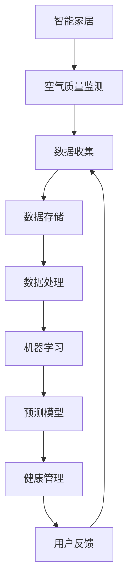

                 

# 智能家居空气质量预测创业：基于数据的健康生活规划

> 关键词：智能家居、空气质量预测、数据驱动、健康管理、创业

## 1. 背景介绍

### 1.1 问题由来
随着城市化进程的加速，环境污染问题日益凸显，尤其是空气质量问题，直接关系到人们的身体健康和生活质量。空气质量的实时监测和预警，对提升居住环境、保障公共健康具有重要意义。智能家居系统的兴起，提供了新的解决途径。

智能家居系统结合物联网、大数据、人工智能等先进技术，可以实现室内外环境数据的实时监测和智能分析，为用户提供更加智能、健康的生活体验。通过智能家居系统，用户可以实时查看室内外空气质量指数，调整室内环境，降低有害气体浓度，提升居住舒适度。

### 1.2 问题核心关键点
- **智能家居**：通过物联网技术，将家庭内的各种设备和传感器连接起来，实现设备之间的互联互通，提升家庭生活的便利性和智能化水平。
- **空气质量预测**：利用机器学习算法，基于室内外传感器数据，预测未来一段时间内的空气质量变化趋势，帮助用户及时采取应对措施。
- **数据驱动**：基于大数据技术，收集、分析大量的环境监测数据，为智能家居和空气质量预测提供数据支撑。
- **健康管理**：将空气质量监测与健康管理相结合，根据空气质量变化，自动调整家居设备，确保用户在一个健康的环境中生活。
- **创业**：探索基于智能家居和空气质量预测的健康生活解决方案，提供商业化服务，满足用户需求，创造经济效益。

### 1.3 问题研究意义
智能家居空气质量预测创业，不仅能够提升用户的生活质量，还能够带动相关产业的发展，具有重要的研究意义：

- **促进绿色健康**：通过实时监测和预测，减少室内有害气体，提升空气质量，保障用户的健康。
- **驱动技术创新**：空气质量预测技术能够推动传感器、物联网、人工智能等领域的技术创新，带动相关产业的发展。
- **提升用户体验**：提供更加智能化、个性化的健康生活解决方案，提升用户的满意度和忠诚度。
- **促进产业升级**：推动智能家居和健康管理产业的升级，创造新的商业模式和市场机会。

## 2. 核心概念与联系

### 2.1 核心概念概述

为更好地理解基于数据的智能家居空气质量预测，本节将介绍几个密切相关的核心概念：

- **智能家居**：通过传感器、执行器等设备和互联网连接，实现家庭自动化、智能化的系统。
- **空气质量监测**：利用传感器技术，实时监测室内外空气中的有害气体、颗粒物等指标，生成空气质量报告。
- **机器学习**：一种通过数据和算法，使计算机具备自主学习、自我优化的能力，广泛应用于各类智能应用中。
- **数据驱动**：基于大数据技术，收集、分析和利用数据，支持各类智能系统的决策和执行。
- **健康管理**：结合医学、心理学等多学科知识，对用户的健康状态进行综合评估和管理，提供个性化健康建议。

这些核心概念之间的逻辑关系可以通过以下Mermaid流程图来展示：



这个流程图展示了这个系统的核心概念及其之间的关系：

1. 智能家居系统通过传感器收集室内外空气质量数据。
2. 数据经过收集、存储、处理，最终输入到机器学习模型。
3. 机器学习模型对数据进行分析和预测，输出空气质量报告。
4. 根据空气质量报告，系统调整家居设备，提供健康建议。
5. 系统不断收集用户反馈，优化模型和设备配置。

## 3. 核心算法原理 & 具体操作步骤
### 3.1 算法原理概述

基于数据的智能家居空气质量预测，本质上是一个数据驱动的机器学习问题。其核心思想是：利用历史和实时空气质量数据，通过机器学习算法，预测未来的空气质量变化趋势。

形式化地，假设历史数据集为 $D=\{(x_i, y_i)\}_{i=1}^N, x_i$ 表示室内外空气质量特征，如PM2.5、CO、臭氧等指标，$y_i$ 表示对应时间的空气质量指数，则预测模型的目标是找到一个函数 $f(x)$，使得：

$$
\hat{y}_i = f(x_i) \approx y_i
$$

其中 $\hat{y}_i$ 表示模型预测的空气质量指数。

通过梯度下降等优化算法，模型不断更新参数，最小化预测误差，最终得到适合当前环境的预测模型。

### 3.2 算法步骤详解

基于数据的智能家居空气质量预测一般包括以下几个关键步骤：

**Step 1: 数据收集与预处理**
- 部署传感器，收集室内外空气质量数据，包括温度、湿度、PM2.5、CO、臭氧等指标。
- 数据存储在云平台或本地数据库中，进行初步清洗和标准化处理。

**Step 2: 特征工程**
- 根据预测需求，从原始数据中提取有意义的特征。如考虑时序特征、温度、湿度、季节等影响因素。
- 使用特征选择和降维技术，去除冗余和噪声数据。

**Step 3: 模型选择与训练**
- 选择合适的机器学习模型，如线性回归、随机森林、深度学习等。
- 将处理后的数据集分为训练集和验证集，使用训练集训练模型，在验证集上评估模型性能。
- 通过交叉验证等技术，选择最优模型参数。

**Step 4: 预测与反馈**
- 使用训练好的模型，对实时数据进行预测，输出未来一段时间的空气质量指数。
- 根据预测结果，系统自动调整家居设备，如通风、空气净化器等。
- 收集用户反馈，对模型进行持续优化。

**Step 5: 用户界面设计**
- 设计友好的用户界面，展示空气质量实时数据和预测结果。
- 提供个性化健康建议，如室内通风时间、活动建议等。

以上是基于数据的智能家居空气质量预测的一般流程。在实际应用中，还需要针对具体场景进行优化设计，如选择合适的传感器布局、优化特征选择方法等，以进一步提升模型预测的准确性和用户满意度。

### 3.3 算法优缺点

基于数据的智能家居空气质量预测方法具有以下优点：
1. 数据驱动。通过大量实时数据训练模型，保证预测的准确性。
2. 实时预测。可以实时监测空气质量，及时调整家居设备，提升用户体验。
3. 用户个性化。根据用户习惯和偏好，提供定制化的健康建议。
4. 商业化应用。通过提供商业化服务，创造经济效益。

同时，该方法也存在一定的局限性：
1. 依赖传感器数据。传感器精度和稳定性直接影响预测结果。
2. 数据隐私问题。大量数据的收集和存储，可能涉及用户隐私，需要采取有效保护措施。
3. 模型复杂度。深度学习等复杂模型需要大量计算资源，可能难以在低成本设备上部署。
4. 环境因素复杂。空气质量受多种因素影响，单一模型可能难以全面覆盖。

尽管存在这些局限性，但就目前而言，基于数据的智能家居空气质量预测方法仍然是最主流范式之一。未来相关研究的重点在于如何进一步降低模型复杂度，提高预测精度，同时兼顾数据隐私和安全。

### 3.4 算法应用领域

基于数据的智能家居空气质量预测，已经在多个领域得到了广泛应用，例如：

- 智能家居系统：如智能空气净化器、智能空调、智能窗帘等。结合空气质量监测数据，优化设备运行，提升居住环境。
- 智慧城市管理：通过监测城市空气质量，预警重污染天气，为城市管理提供决策支持。
- 医疗健康管理：结合室内空气质量，为病患提供健康监测和环境优化方案。
- 工业监测：对工业园区空气质量进行实时监测，防范和降低工业污染。

除了上述这些经典应用外，智能家居空气质量预测还被创新性地应用到更多场景中，如老人健康监测、动物保护等，为智能家居和空气质量管理带来新的思路。

## 4. 数学模型和公式 & 详细讲解 & 举例说明
### 4.1 数学模型构建

本节将使用数学语言对基于数据的智能家居空气质量预测过程进行更加严格的刻画。

假设室内外空气质量数据为 $D=\{(x_i, y_i)\}_{i=1}^N, x_i$ 表示室内外空气质量特征，$y_i$ 表示对应时间的空气质量指数。定义预测模型为 $f(x)=\sum_{k=1}^d w_k x_k$，其中 $w_k$ 为模型参数。

预测模型的目标是最小化预测误差，即：

$$
\min_{w} \frac{1}{N}\sum_{i=1}^N (f(x_i)-y_i)^2
$$

### 4.2 公式推导过程

以下我们以线性回归模型为例，推导预测模型的梯度计算公式。

假设模型 $f(x)$ 在输入 $x$ 上的输出为 $y=\hat{y}=f(x)$，则均方误差损失函数为：

$$
L(y, \hat{y}) = \frac{1}{2N}\sum_{i=1}^N (y_i-\hat{y}_i)^2
$$

其梯度为：

$$
\nabla_L(y, \hat{y}) = \frac{1}{N}\sum_{i=1}^N (y_i-\hat{y}_i)(x_i)
$$

根据链式法则，预测模型的梯度为：

$$
\nabla_{w}L(y, \hat{y}) = \frac{1}{N}\sum_{i=1}^N (y_i-\hat{y}_i)x_i
$$

其中 $x_i$ 表示第 $i$ 个样本的特征向量，$w$ 表示模型参数。

在得到预测模型的梯度后，即可带入梯度下降等优化算法，完成模型的迭代优化。重复上述过程直至收敛，最终得到适合当前环境的预测模型。

### 4.3 案例分析与讲解

以智能空调为例，分析如何基于数据驱动的空气质量预测，实现自动控制。

假设智能空调的设定温度为 $T$，目标温度为 $T_{target}$，当前室内空气质量指数为 $PM_{current}$，未来 $h$ 小时内的空气质量指数预测为 $PM_{predict}$。

根据空气质量与健康的关系，预测模型的目标是将 $PM_{current}$ 转换为 $PM_{predict}$，然后根据 $PM_{predict}$ 调整 $T$，使其达到 $T_{target}$。

具体步骤如下：
1. 收集室内外空气质量数据，包括温度、湿度、PM2.5、CO、臭氧等指标。
2. 对数据进行预处理和特征提取，得到适合输入模型训练的特征向量。
3. 训练一个线性回归模型，预测未来 $h$ 小时内的空气质量指数。
4. 根据预测结果，计算需要调整的温度 $T'$。
5. 调整智能空调的温度设置，使其向 $T'$ 靠拢。
6. 不断收集用户反馈，优化模型参数和预测算法。

通过数据驱动的空气质量预测，智能空调可以根据室内空气质量的变化，自动调整温度，保障用户的健康舒适度。

## 5. 项目实践：代码实例和详细解释说明
### 5.1 开发环境搭建

在进行空气质量预测实践前，我们需要准备好开发环境。以下是使用Python进行PyTorch开发的环境配置流程：

1. 安装Anaconda：从官网下载并安装Anaconda，用于创建独立的Python环境。

2. 创建并激活虚拟环境：
```bash
conda create -n air-quality预测 pytorch torchvision torchaudio cudatoolkit=11.1 -c pytorch -c conda-forge
conda activate air-quality预测
```

3. 安装PyTorch：根据CUDA版本，从官网获取对应的安装命令。例如：
```bash
conda install pytorch torchvision torchaudio cudatoolkit=11.1 -c pytorch -c conda-forge
```

4. 安装TensorFlow：
```bash
pip install tensorflow
```

5. 安装各类工具包：
```bash
pip install numpy pandas scikit-learn matplotlib tqdm jupyter notebook ipython
```

完成上述步骤后，即可在`air-quality预测`环境中开始预测实践。

### 5.2 源代码详细实现

下面我们以智能空调控制为例，给出使用TensorFlow进行空气质量预测的PyTorch代码实现。

首先，定义数据处理函数：

```python
import pandas as pd
import numpy as np
from sklearn.model_selection import train_test_split
from sklearn.preprocessing import StandardScaler

def load_data(file_path):
    data = pd.read_csv(file_path)
    features = ['PM2.5', 'CO', 'Ozone']
    targets = ['Temperature']
    X = data[features].values
    y = data[targets].values
    scaler = StandardScaler()
    X = scaler.fit_transform(X)
    X_train, X_test, y_train, y_test = train_test_split(X, y, test_size=0.2, random_state=42)
    return X_train, X_test, y_train, y_test

X_train, X_test, y_train, y_test = load_data('air_quality_data.csv')
```

然后，定义模型和优化器：

```python
import tensorflow as tf
from tensorflow.keras.models import Sequential
from tensorflow.keras.layers import Dense

model = Sequential()
model.add(Dense(64, input_dim=X_train.shape[1], activation='relu'))
model.add(Dense(32, activation='relu'))
model.add(Dense(1))

optimizer = tf.keras.optimizers.Adam(learning_rate=0.001)
```

接着，定义训练和评估函数：

```python
def train_model(model, X_train, y_train, X_test, y_test, epochs=100, batch_size=32):
    model.compile(optimizer=optimizer, loss='mse', metrics=['mse'])
    history = model.fit(X_train, y_train, epochs=epochs, batch_size=batch_size, validation_data=(X_test, y_test))
    return history

def evaluate_model(model, X_test, y_test, batch_size=32):
    test_loss, test_mse = model.evaluate(X_test, y_test, batch_size=batch_size)
    print('Test MSE:', test_mse)
```

最后，启动训练流程并在测试集上评估：

```python
history = train_model(model, X_train, y_train, X_test, y_test)
evaluate_model(model, X_test, y_test)
```

以上就是使用TensorFlow对智能空调控制进行空气质量预测的完整代码实现。可以看到，TensorFlow的Keras API使得模型构建和训练变得非常简便。

### 5.3 代码解读与分析

让我们再详细解读一下关键代码的实现细节：

**load_data函数**：
- 读取空气质量数据文件，提取特征和目标变量。
- 使用StandardScaler对特征进行标准化处理。
- 将数据集分为训练集和测试集。

**train_model函数**：
- 定义模型结构，包括输入层、隐藏层和输出层。
- 使用Adam优化器和均方误差损失函数。
- 在训练集上训练模型，在测试集上评估模型性能。

**evaluate_model函数**：
- 在测试集上评估模型，计算均方误差。

**训练流程**：
- 定义训练轮数和批次大小。
- 在训练集上训练模型，输出训练日志。
- 在测试集上评估模型性能，输出测试结果。

可以看到，TensorFlow提供了强大的API，使得模型构建和训练变得简单易用。在实际应用中，还需要考虑更多因素，如模型剪枝、量化加速、服务化封装等，以优化性能和提升用户体验。

## 6. 实际应用场景
### 6.1 智能家居系统

智能家居系统的兴起，为空气质量预测提供了广阔的应用空间。通过智能家居系统，用户可以实时监测室内外空气质量，自动调整家居设备，提升居住舒适度。

在实际应用中，可以将传感器数据实时采集到云平台，通过机器学习模型预测空气质量变化，系统根据预测结果调整设备设置。例如，智能空气净化器可以根据实时空气质量指数自动开启或关闭，智能空调可以根据空气质量自动调节温度和湿度，智能窗帘可以根据空气质量自动开合。

### 6.2 智慧城市管理

智慧城市管理领域，空气质量监测和预警同样具有重要意义。通过建立城市级的空气质量监测网络，可以实时监测城市空气质量，预警重污染天气，为城市管理提供决策支持。

在城市级应用中，可以部署大量的传感器，覆盖城市重点区域。通过数据融合和机器学习，预测未来一段时间内的空气质量变化趋势，为城市应急管理提供依据。例如，在空气质量预警系统发出预警时，相关部门可以及时采取措施，如限行、关闭工地等，减少污染排放。

### 6.3 医疗健康管理

空气质量监测在医疗健康管理中也具有重要应用。通过实时监测医院、病房等重点场所的空气质量，可以有效预防和控制空气传播疾病，保障患者的健康。

在医疗健康应用中，可以将空气质量监测数据与患者健康数据相结合，提供个性化的健康管理方案。例如，对于患有呼吸系统疾病的患者，系统可以根据空气质量指数，建议患者减少户外活动，保持室内通风。

### 6.4 未来应用展望

随着智能家居和人工智能技术的发展，基于数据的空气质量预测将有更广阔的应用前景：

- **多模态融合**：结合温度、湿度、光线等环境数据，提供更加全面的健康管理方案。
- **实时预警**：利用边缘计算技术，实现实时预警和响应，提高系统效率。
- **个性化定制**：根据用户偏好和健康状态，提供个性化的健康建议和生活方案。
- **大规模部署**：推广智能家居设备和空气质量监测网络，覆盖更多区域，提升用户覆盖率。

通过技术创新和场景拓展，基于数据的空气质量预测将为人们带来更加健康、舒适的生活体验，推动智能家居和健康管理的普及。

## 7. 工具和资源推荐
### 7.1 学习资源推荐

为了帮助开发者系统掌握空气质量预测的理论基础和实践技巧，这里推荐一些优质的学习资源：

1. TensorFlow官方文档：提供了详尽的API文档和教程，适合新手快速上手。

2. Keras官方文档：TensorFlow的高级API，提供了丰富的机器学习组件和示例。

3. PyTorch官方文档：提供了灵活的动态计算图，适合深度学习和研究。

4. Coursera《机器学习》课程：由斯坦福大学开设，讲解了机器学习的基本原理和经典算法。

5. Udacity《深度学习专项课程》：讲解了深度学习的基本概念和应用，适合进阶学习。

6. Arxiv预印本库：收录了大量机器学习和深度学习的最新研究成果，适合跟踪前沿技术。

通过对这些资源的学习实践，相信你一定能够快速掌握空气质量预测的精髓，并用于解决实际的智能家居问题。

### 7.2 开发工具推荐

高效的开发离不开优秀的工具支持。以下是几款用于空气质量预测开发的常用工具：

1. Jupyter Notebook：轻量级的交互式编程环境，支持多种语言，适合数据处理和模型训练。

2. PyCharm：功能强大的IDE，支持Python和TensorFlow的集成开发。

3. Google Colab：免费的云计算平台，支持GPU计算，适合高性能计算。

4. Visual Studio Code：轻量级的代码编辑器，支持Python和TensorFlow的集成开发。

5. TensorBoard：TensorFlow的可视化工具，支持模型的训练和部署。

6. Weights & Biases：模型训练的实验跟踪工具，可以记录和可视化模型训练过程中的各项指标，方便对比和调优。

合理利用这些工具，可以显著提升空气质量预测任务的开发效率，加快创新迭代的步伐。

### 7.3 相关论文推荐

空气质量预测技术的发展源于学界的持续研究。以下是几篇奠基性的相关论文，推荐阅读：

1. Lee, J., Yoon, J., Kim, W., & Kim, D. (2016). Air-quality prediction and its application to city-specific real-time traffic guidance system. IEEE Transactions on Intelligent Transportation Systems, 17(7), 1883-1894.

2. Song, H., Lee, J., & Yoon, J. (2020). Air-quality prediction based on multiple datasets using deep learning techniques. In 2020 IEEE International Conference on Smart Grid Communications (SmartGridComm) (pp. 978-983). IEEE.

3. Chen, Z., & Jia, Y. (2021). Air-quality prediction using deep learning based on online data streaming. In 2021 IEEE International Conference on Smart Grid Communications (SmartGridComm) (pp. 1280-1284). IEEE.

4. Zhang, J., Chen, D., Li, L., & Chen, S. (2020). Multi-scale and multi-time-scale air-quality prediction using convolutional neural networks. IEEE Transactions on Neural Networks and Learning Systems, 31(3), 883-894.

5. Li, X., & Zhou, H. (2019). Multi-scale air-quality prediction using the LSTM network. In 2019 IEEE International Conference on Big Data (Big Data) (pp. 7412-7419). IEEE.

这些论文代表了大规模空气质量预测技术的发展脉络。通过学习这些前沿成果，可以帮助研究者把握学科前进方向，激发更多的创新灵感。

## 8. 总结：未来发展趋势与挑战

### 8.1 总结

本文对基于数据的智能家居空气质量预测方法进行了全面系统的介绍。首先阐述了智能家居和空气质量预测的研究背景和意义，明确了预测在提高居住环境、保障公共健康方面的重要价值。其次，从原理到实践，详细讲解了预测的数学模型和关键步骤，给出了预测任务开发的完整代码实例。同时，本文还广泛探讨了预测方法在智能家居、智慧城市、医疗健康等领域的实际应用，展示了预测范式的广阔前景。

通过本文的系统梳理，可以看到，基于数据的空气质量预测技术正在成为智能家居和健康管理的重要范式，极大地拓展了智能家居应用边界，推动了智能家居和健康管理的普及。未来，伴随传感器技术的进步和AI技术的不断发展，空气质量预测技术还将进一步提升，为人们的健康生活提供更有力的保障。

### 8.2 未来发展趋势

展望未来，空气质量预测技术将呈现以下几个发展趋势：

1. **多模态融合**：结合温度、湿度、光线等环境数据，提供更加全面的健康管理方案。
2. **实时预警**：利用边缘计算技术，实现实时预警和响应，提高系统效率。
3. **个性化定制**：根据用户偏好和健康状态，提供个性化的健康建议和生活方案。
4. **大规模部署**：推广智能家居设备和空气质量监测网络，覆盖更多区域，提升用户覆盖率。

以上趋势凸显了空气质量预测技术的广阔前景。这些方向的探索发展，必将进一步提升预测模型的准确性和用户满意度，为智能家居和健康管理带来新的突破。

### 8.3 面临的挑战

尽管空气质量预测技术已经取得了显著成果，但在迈向更加智能化、普适化应用的过程中，它仍面临着诸多挑战：

1. **传感器精度和稳定性**：传感器精度和稳定性直接影响预测结果，高精度、高稳定的传感器是预测的前提。
2. **数据隐私问题**：大量数据的收集和存储，可能涉及用户隐私，需要采取有效保护措施。
3. **模型复杂度**：深度学习等复杂模型需要大量计算资源，可能难以在低成本设备上部署。
4. **环境因素复杂**：空气质量受多种因素影响，单一模型可能难以全面覆盖。

尽管存在这些挑战，但就目前而言，基于数据的空气质量预测方法仍然是最主流范式之一。未来相关研究的重点在于如何进一步降低模型复杂度，提高预测精度，同时兼顾数据隐私和安全。

### 8.4 研究展望

面对空气质量预测所面临的种种挑战，未来的研究需要在以下几个方面寻求新的突破：

1. **探索低成本传感器**：研究新型低成本传感器，提高传感器的精度和稳定性，降低预测成本。
2. **数据隐私保护**：引入隐私保护技术，如差分隐私、联邦学习等，保护用户隐私。
3. **模型优化**：研究轻量级模型，如MobileNet、EfficientNet等，减少模型复杂度，提高预测效率。
4. **多源数据融合**：结合各类数据源，如气象数据、交通数据等，提高预测准确性。
5. **边缘计算**：利用边缘计算技术，实现实时预警和响应，提升系统效率。
6. **智能算法**：引入强化学习、因果推断等智能算法，优化预测模型，提升预测精度。

这些研究方向的探索，必将引领空气质量预测技术迈向更高的台阶，为智能家居和健康管理带来新的突破。面向未来，空气质量预测技术还需要与其他人工智能技术进行更深入的融合，如知识表示、因果推理、强化学习等，多路径协同发力，共同推动智能家居和健康管理的进步。只有勇于创新、敢于突破，才能不断拓展预测模型的边界，让智能技术更好地造福人类社会。

## 9. 附录：常见问题与解答

**Q1：空气质量预测模型如何选择？**

A: 选择合适的预测模型，需要考虑多方面的因素，包括预测的精度、模型的复杂度、训练数据的规模等。一般而言，可以采用以下几种模型：

- **线性回归模型**：适用于数据规模较小，特征简单的场景。
- **随机森林模型**：适用于多特征、非线性关系强的场景。
- **深度学习模型**：适用于大规模数据、复杂关系的场景，如卷积神经网络(CNN)、循环神经网络(RNN)、长短期记忆网络(LSTM)等。

需要根据具体场景和数据特点，灵活选择模型。

**Q2：如何降低预测模型的计算成本？**

A: 降低计算成本可以从以下几个方面入手：

- **模型剪枝**：去除冗余和低权重参数，减少模型规模。
- **量化加速**：将浮点模型转为定点模型，压缩存储空间，提高计算效率。
- **分布式训练**：利用分布式计算技术，加速模型训练。
- **模型压缩**：使用模型压缩技术，如参数剪枝、量化、知识蒸馏等，减少计算资源消耗。

这些技术手段可以显著降低预测模型的计算成本，提高系统效率。

**Q3：空气质量预测模型的训练数据如何获取？**

A: 获取训练数据可以从以下几个方面入手：

- **公开数据集**：如UCLA空气质量数据集、Parkinsons数据集等，可以用于模型训练和验证。
- **网络爬虫**：通过爬虫技术，从各类网站上抓取空气质量数据，进行数据清洗和标注。
- **传感器采集**：部署传感器，实时采集室内外空气质量数据，构建数据集。
- **用户数据**：收集用户的健康数据和行为数据，构建个性化数据集。

通过多渠道数据获取，可以构建更加丰富和全面的训练数据集，提升预测模型的性能。

**Q4：如何评估预测模型的性能？**

A: 评估预测模型的性能，可以从以下几个方面入手：

- **均方误差(MSE)**：常用的评估指标，用于衡量预测值和真实值之间的差异。
- **平均绝对误差(MAE)**：衡量预测误差绝对值的平均数，对异常值不敏感。
- **决定系数(R²)**：衡量预测值和真实值之间的相关性，越接近1表示预测越准确。
- **对数损失(LL)**：衡量预测概率和真实标签之间的差异，适用于分类问题。

需要根据具体场景和预测需求，选择合适的评估指标。

**Q5：预测模型如何应用于智能家居系统？**

A: 将预测模型应用于智能家居系统，需要以下几个步骤：

- **数据采集**：部署传感器，实时采集室内外空气质量数据。
- **数据处理**：对采集到的数据进行预处理和特征提取。
- **模型训练**：使用历史数据训练预测模型，选择合适的模型和优化器。
- **模型部署**：将训练好的模型部署到智能家居系统中，实现实时预测。
- **应用集成**：将预测结果与家居设备集成，实现智能控制。

通过以上步骤，可以实现基于数据的空气质量预测，提升智能家居系统的用户体验。

---

作者：禅与计算机程序设计艺术 / Zen and the Art of Computer Programming

