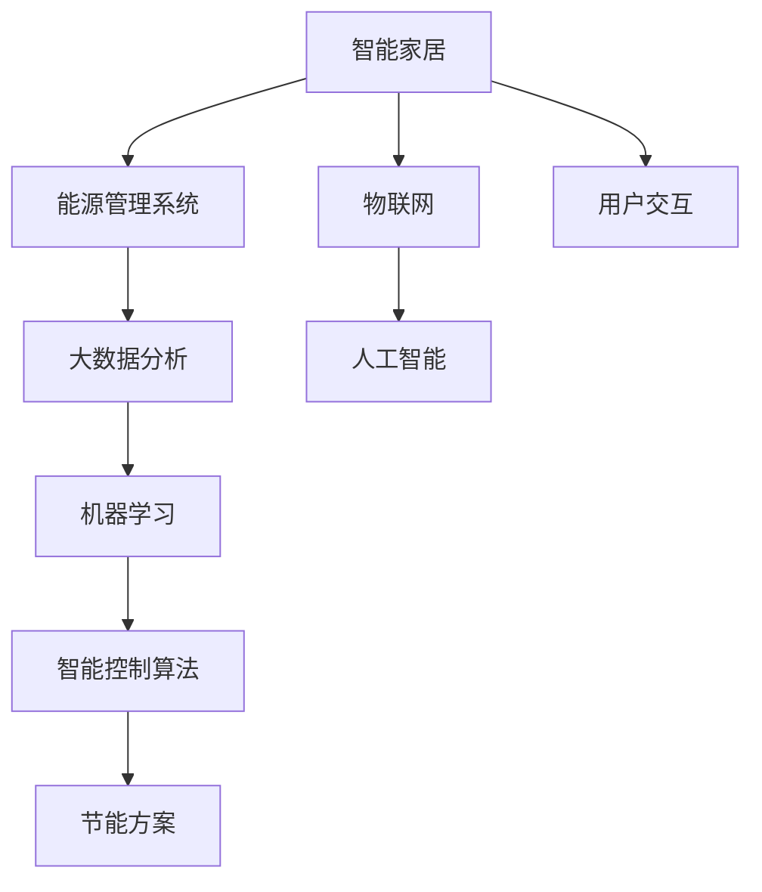

                 

# 智能家居能源管理创业：家庭节能的智能方案

> 关键词：智能家居,能源管理,家庭节能,智能方案,数据驱动,自动化控制,用户互动,物联网技术,人工智能,大数据分析

## 1. 背景介绍

### 1.1 问题由来

随着全球能源消耗的持续增长和环境问题的日益严重，如何实现节能减排成为摆在每一个家庭面前的迫切任务。传统的家庭能源管理方式多依赖于人工干预，节能效果有限，且难以实现精准控制。如何通过技术手段提升家庭能源使用的效率，降低能源消耗，成为当下智能家居领域的一个重要研究方向。

### 1.2 问题核心关键点

家庭能源管理的主要挑战在于实现能源使用的智能化控制，即根据家庭成员的生活习惯、能源需求等因素，自动调整家电设备的运行状态，优化能源使用，达到节能减排的效果。核心关键点包括：

- 数据获取：收集家庭能源使用数据，包括电、燃气、水等各类能源消耗信息。
- 数据分析：通过大数据分析技术，识别节能减排的关键点。
- 智能控制：基于机器学习和人工智能技术，设计智能控制算法，实现能源的自动优化。
- 用户交互：提供用户友好的界面和控制方式，促进用户参与，提升节能效果。
- 系统集成：将智能家居系统与能源管理系统进行无缝对接，实现统一管理。

### 1.3 问题研究意义

实现家庭节能，不仅能够降低家庭的经济支出，还能有效缓解能源短缺和环境污染问题，具有重要的社会和经济价值。智能家居能源管理系统的研究与应用，可以为家庭用户提供智能化、个性化的节能方案，同时也能促进智能家居产业的快速发展，带动相关产业的进步。

## 2. 核心概念与联系

### 2.1 核心概念概述

为了更好地理解智能家居能源管理系统的核心概念，本节将介绍几个密切相关的核心概念：

- **智能家居**：通过物联网、云计算、大数据等技术，实现家庭设备智能化、信息化、网络化，提供高效、便捷、安全的居住环境。
- **能源管理系统**：用于监测、控制和优化家庭能源使用，实现节能减排的技术系统。
- **物联网(IoT)**：连接物理世界与信息世界的技术体系，实现设备间的互联互通。
- **人工智能(AI)**：使机器具备类似人类智能能力的科学，主要应用于图像识别、语音识别、自然语言处理等领域。
- **大数据分析**：通过分析海量数据，提取有价值的信息，支持决策和优化。
- **机器学习**：使计算机通过数据学习，不断改进性能，实现自动化的算法。
- **智能控制算法**：基于模型优化、自适应控制等技术，实现能源使用的自动调节。

这些概念之间的逻辑关系可以通过以下Mermaid流程图来展示：



这个流程图展示了一些关键概念之间的联系：

1. 智能家居通过物联网技术将家庭设备连接起来，构成一个智慧化的居住环境。
2. 能源管理系统集成在智能家居系统中，负责监测和优化能源使用。
3. 人工智能和大数据分析为能源管理系统提供了强大的数据处理和分析能力。
4. 机器学习技术用于训练智能控制算法，实现能源使用的自动优化。
5. 智能控制算法结合节能方案，最终实现家庭的节能减排。
6. 用户交互设计提供良好的用户体验，促进用户参与。

## 3. 核心算法原理 & 具体操作步骤

### 3.1 算法原理概述

智能家居能源管理系统采用数据驱动的方式，通过实时采集和分析家庭能源使用数据，应用机器学习算法优化能源使用策略，实现节能减排。其核心算法原理如下：

- **数据采集与预处理**：通过智能传感器和监控设备，实时采集家庭能源使用数据，并进行预处理，如数据去噪、归一化等。
- **特征提取与建模**：从采集的数据中提取关键特征，建立预测模型，用于识别节能减排的关键点。
- **智能控制算法**：基于机器学习算法，设计智能控制策略，优化家电设备的运行状态，实现节能效果。
- **用户反馈与优化**：结合用户反馈，不断优化算法，提升节能效果。

### 3.2 算法步骤详解

智能家居能源管理系统的工作流程如下：

1. **数据采集与预处理**：
   - 安装智能传感器和监控设备，如智能电表、智能燃气表、智能水表等，实时监测家庭能源消耗。
   - 通过Wi-Fi、蓝牙等无线技术，将传感器数据传输到中心服务器。
   - 对采集数据进行预处理，如去噪、归一化、数据清洗等，确保数据质量。

2. **特征提取与建模**：
   - 使用大数据分析技术，从历史能源使用数据中提取关键特征，如用电高峰时段、设备使用频率等。
   - 建立预测模型，如线性回归、决策树、支持向量机等，用于预测不同时间段和场景下的能源需求。
   - 通过模型训练，识别出节能减排的关键点，如高峰期降低非必要设备的使用、优化电器设备的使用模式等。

3. **智能控制算法**：
   - 基于机器学习算法，设计智能控制策略，如动态调速、优化时序等。
   - 根据预测模型和实时数据，自动调整家电设备的运行状态，实现节能效果。
   - 设计反馈机制，根据用户反馈调整控制策略，提升节能效果。

4. **用户反馈与优化**：
   - 提供用户友好的界面和控制方式，允许用户手动调整设备运行状态。
   - 收集用户反馈，用于优化控制策略。
   - 结合用户反馈，实时调整控制算法，提升节能效果。

### 3.3 算法优缺点

智能家居能源管理系统采用数据驱动的方式，具有以下优点：

- **自动化控制**：通过智能控制算法，实现能源使用的自动优化，节省人力物力。
- **实时监测**：实时采集和分析能源使用数据，及时发现并解决问题。
- **节能效果显著**：通过优化能源使用策略，显著降低能源消耗，达到节能减排的效果。
- **用户体验良好**：用户友好的界面和控制方式，提升用户使用体验。

同时，该方法也存在一些缺点：

- **数据隐私问题**：系统需要采集和处理大量个人数据，可能涉及隐私问题。
- **系统复杂性高**：系统涉及的设备种类和数量众多，系统集成和维护复杂。
- **初始投资成本高**：需要投入大量的资金和技术资源，建立智能家居系统。

### 3.4 算法应用领域

智能家居能源管理系统在多个领域具有广泛的应用前景：

- **住宅楼宇**：为住宅小区提供统一的能源管理方案，优化能源使用，提升社区节能效果。
- **公共建筑**：在办公楼、学校、医院等公共建筑中，应用智能家居能源管理系统，实现能源的高效利用。
- **工业园区**：为工业园区提供统一的能源管理系统，优化生产能源使用，降低生产成本。
- **商业建筑**：在商场、酒店、写字楼等商业建筑中，应用智能家居能源管理系统，提升商业建筑的节能效果。

## 4. 数学模型和公式 & 详细讲解 & 举例说明

### 4.1 数学模型构建

智能家居能源管理系统的数学模型主要包括以下几个方面：

- **数据采集模型**：描述家庭能源使用数据的采集过程和预处理步骤。
- **特征提取模型**：通过大数据分析技术，提取关键特征。
- **预测模型**：用于预测不同时间段和场景下的能源需求。
- **控制模型**：描述智能控制算法的实现过程。

### 4.2 公式推导过程

假设家庭能源消耗数据为 $E(t)$，其中 $t$ 表示时间。系统的目标是最小化能源消耗，即：

$$
\min_{\theta} \sum_{t=1}^{T} E(t)
$$

其中 $\theta$ 表示控制策略的参数。通过数据采集模型，采集能源消耗数据 $E(t)$，并进行预处理。特征提取模型从数据中提取关键特征 $X(t)$，建立预测模型 $Y(t) = f(X(t), \theta)$，用于预测能源需求。控制模型根据预测结果和实时数据，动态调整控制策略 $\theta$。

### 4.3 案例分析与讲解

以空调为例，分析智能家居能源管理系统的节能效果。假设当前室内温度为 $T_{in}$，室外温度为 $T_{out}$，设定目标温度为 $T_{target}$，空调的功率为 $P_{AC}$，通过采集模型得到当前的室内外温度数据 $X(t) = [T_{in}, T_{out}]$，经过特征提取和预测模型，得到预测的能源需求 $Y(t) = f(X(t), \theta)$。通过控制模型，自动调整空调的运行状态，如温度设定、风速、时间等，最小化能源消耗。

## 5. 项目实践：代码实例和详细解释说明

### 5.1 开发环境搭建

要实现智能家居能源管理系统，首先需要搭建开发环境。以下是Python环境的配置流程：

1. 安装Python：从官网下载并安装Python。
2. 安装Pip：在命令行输入 `python -m pip install pip` 安装。
3. 安装所需库：使用Pip安装Flask、TensorFlow、Pandas等库。
4. 安装智能传感器和监控设备：如智能电表、智能燃气表、智能水表等。

### 5.2 源代码详细实现

以下是使用Python实现智能家居能源管理系统的示例代码：

```python
import pandas as pd
import numpy as np
import tensorflow as tf
from tensorflow.keras.models import Sequential
from tensorflow.keras.layers import Dense, Dropout, LSTM

# 数据读取与预处理
data = pd.read_csv('energy_consumption.csv')
data = data.dropna()

# 特征提取
features = data[['temperature_in', 'temperature_out']]
targets = data['energy_consumption']

# 数据分割
train_size = int(len(data) * 0.8)
train_data = features[:train_size]
train_labels = targets[:train_size]
test_data = features[train_size:]
test_labels = targets[train_size:]

# 模型构建
model = Sequential()
model.add(LSTM(64, input_shape=(train_data.shape[1], 1)))
model.add(Dense(32))
model.add(Dense(1))

# 模型编译
model.compile(optimizer='adam', loss='mse')

# 模型训练
model.fit(train_data, train_labels, epochs=50, batch_size=32, validation_data=(test_data, test_labels))

# 模型评估
test_loss = model.evaluate(test_data, test_labels)
print('Test loss:', test_loss)
```

### 5.3 代码解读与分析

上述代码实现了基于LSTM模型的能源需求预测。其关键步骤如下：

- **数据读取与预处理**：从CSV文件中读取能源消耗数据，并进行去噪、归一化等预处理。
- **特征提取**：提取室内外温度作为模型的输入特征。
- **模型构建**：使用LSTM模型进行能源需求的预测。
- **模型编译与训练**：使用Adam优化器进行模型训练。
- **模型评估**：在测试集上评估模型性能。

## 6. 实际应用场景

### 6.1 智能家居系统

智能家居系统通过集成传感器和监控设备，实时监测家庭能源使用情况。结合智能控制算法，实现能源使用的智能化控制。例如，智能窗帘、智能灯光、智能空调等设备可以根据实时温度和能源需求，自动调整运行状态，提升节能效果。

### 6.2 智慧城市

智慧城市应用智能家居能源管理系统，通过统一的数据中心，实时监测和分析城市能源使用情况。结合城市规划、交通管理等系统，优化能源使用，提升城市管理效率。例如，智能交通系统可以根据实时车流量，动态调整交通信号灯，优化能源使用。

### 6.3 商业建筑

商业建筑应用智能家居能源管理系统，通过集中控制和优化能源使用，降低运营成本。例如，智能照明系统可以根据人员流动情况，自动调整照明亮度和开关时间，实现节能减排。

### 6.4 工业园区

工业园区应用智能家居能源管理系统，通过优化生产能源使用，降低生产成本。例如，智能温控系统可以根据生产需求，自动调整温度设定和运行时间，减少能源浪费。

## 7. 工具和资源推荐

### 7.1 学习资源推荐

为帮助开发者系统掌握智能家居能源管理系统的理论基础和实践技巧，这里推荐一些优质的学习资源：

1. **《智能家居技术》**：介绍智能家居系统的基本概念、技术架构和应用场景。
2. **《物联网技术》**：涵盖物联网设备的连接方式、数据传输、安全防护等关键技术。
3. **《人工智能入门》**：从基础算法到深度学习，系统讲解人工智能的基本原理和应用。
4. **《大数据分析》**：介绍大数据分析的基本概念、技术架构和应用场景。
5. **《机器学习实战》**：通过具体案例，介绍机器学习算法的设计与实现。

### 7.2 开发工具推荐

为了提高智能家居能源管理系统的开发效率，以下是几款常用的开发工具：

1. **Flask**：轻量级的Web框架，适合开发智能家居系统的后端服务。
2. **TensorFlow**：强大的深度学习框架，支持多种机器学习算法。
3. **Pandas**：数据处理和分析库，适合数据预处理和特征提取。
4. **PySerial**：Python串口通信库，适合与智能传感器进行数据传输。
5. **IoT设备和平台**：如ESP8266、Raspberry Pi等，适合开发智能家居设备和系统。

### 7.3 相关论文推荐

智能家居能源管理系统的发展离不开学术界的持续研究。以下是几篇关键论文，推荐阅读：

1. **《智能家居系统综述》**：介绍智能家居系统的基本概念、技术架构和应用场景。
2. **《物联网技术进展》**：涵盖物联网设备、数据传输、安全防护等关键技术。
3. **《人工智能在智能家居中的应用》**：介绍人工智能算法在智能家居系统中的应用。
4. **《大数据分析在智能家居中的应用》**：介绍大数据分析技术在智能家居系统中的应用。
5. **《机器学习在智能家居中的应用》**：介绍机器学习算法在智能家居系统中的应用。

## 8. 总结：未来发展趋势与挑战

### 8.1 研究成果总结

智能家居能源管理系统在智能家居、智慧城市、商业建筑、工业园区等多个领域具有广泛的应用前景。该系统采用数据驱动的方式，通过实时监测和智能控制，实现节能减排。结合人工智能和大数据分析技术，优化能源使用策略，提升节能效果。

### 8.2 未来发展趋势

智能家居能源管理系统将呈现以下几个发展趋势：

1. **智能化程度提升**：结合更先进的传感器和监控设备，实现更精准的能源监测和控制。
2. **多模态数据融合**：结合语音识别、图像识别等技术，实现多模态数据融合，提升系统智能度。
3. **云计算和大数据分析**：通过云计算和大数据分析，实现更高效的能源管理和决策。
4. **人机交互技术**：通过语音助手、智能显示等技术，提升用户体验，促进用户参与。
5. **物联网和边缘计算**：结合物联网和边缘计算技术，实现更高效的数据处理和传输。

### 8.3 面临的挑战

尽管智能家居能源管理系统取得了显著进展，但仍面临以下挑战：

1. **数据隐私问题**：系统需要采集和处理大量个人数据，可能涉及隐私问题。
2. **系统复杂性高**：系统涉及的设备种类和数量众多，系统集成和维护复杂。
3. **初始投资成本高**：需要投入大量的资金和技术资源，建立智能家居系统。
4. **技术门槛高**：系统涉及多种技术，对开发者要求较高，需具备跨学科知识。

### 8.4 研究展望

未来的研究应在以下几个方面寻求新的突破：

1. **数据隐私保护**：结合隐私保护技术，确保数据采集和处理过程中的隐私安全。
2. **系统集成优化**：开发更高效的集成技术，提升系统的稳定性和可靠性。
3. **低成本解决方案**：开发低成本的智能家居设备和系统，降低用户门槛。
4. **跨学科合作**：结合计算机科学、电力工程、工业工程等多学科知识，推动系统创新。

这些研究方向将有助于智能家居能源管理系统的进一步优化和推广，为家庭节能和环境保护提供更强大的技术支持。

## 9. 附录：常见问题与解答

### Q1: 智能家居能源管理系统如何保护用户数据隐私？

A: 智能家居能源管理系统需要采集大量家庭能源使用数据，为保护用户隐私，可以采取以下措施：
- **数据匿名化**：对数据进行匿名化处理，去除个人身份信息。
- **数据加密**：在数据传输和存储过程中，使用加密技术保护数据安全。
- **访问控制**：设置严格的访问权限，确保只有授权用户才能访问系统。
- **隐私政策透明**：向用户明确隐私政策，告知数据的使用和保护方式。

### Q2: 智能家居能源管理系统如何提升节能效果？

A: 智能家居能源管理系统通过实时监测和智能控制，实现能源使用的优化。以下是提升节能效果的关键措施：
- **数据采集与预处理**：通过精确的传感器和监控设备，实时采集能源消耗数据，并进行预处理，确保数据质量。
- **特征提取与建模**：从历史能源使用数据中提取关键特征，建立预测模型，识别节能减排的关键点。
- **智能控制算法**：基于机器学习算法，设计智能控制策略，优化家电设备的运行状态，实现节能效果。
- **用户反馈与优化**：结合用户反馈，不断优化控制策略，提升节能效果。

### Q3: 智能家居能源管理系统有哪些应用场景？

A: 智能家居能源管理系统在多个领域具有广泛的应用场景：
- **住宅楼宇**：为住宅小区提供统一的能源管理方案，优化能源使用，提升社区节能效果。
- **公共建筑**：在办公楼、学校、医院等公共建筑中，应用智能家居能源管理系统，实现能源的高效利用。
- **工业园区**：为工业园区提供统一的能源管理系统，优化生产能源使用，降低生产成本。
- **商业建筑**：在商场、酒店、写字楼等商业建筑中，应用智能家居能源管理系统，提升商业建筑的节能效果。

通过本文的系统梳理，可以看到，智能家居能源管理系统在家庭节能、智慧城市、商业建筑、工业园区等多个领域具有广阔的应用前景，其采用数据驱动的方式，通过实时监测和智能控制，实现节能减排，具有重要的社会和经济价值。未来，随着技术的不断进步，智能家居能源管理系统将在更多领域发挥重要作用，为构建绿色、智能、节能的社会环境贡献力量。

---

作者：禅与计算机程序设计艺术 / Zen and the Art of Computer Programming

