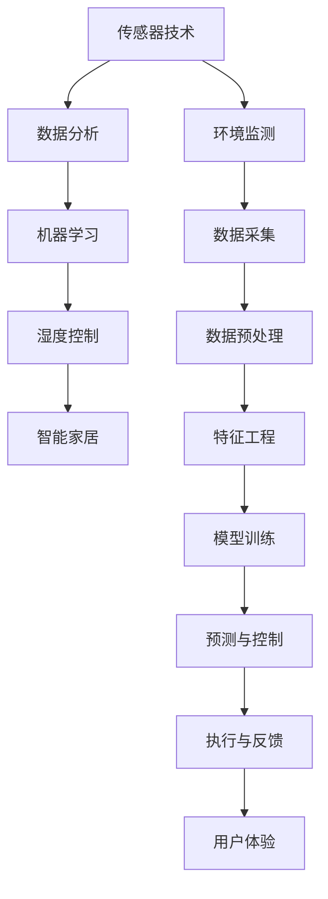

                 

# 智能居家湿度平衡创业：全天候的呼吸道健康管理

> 关键词：智能家居, 湿度控制, 呼吸道健康管理, 传感器技术, 数据分析, 机器学习

## 1. 背景介绍

随着现代科技的迅猛发展，人们的生活质量得到了极大的提升。在智能家居领域，如何让居住环境更加宜人、舒适，已成为众多创业者和研究者的关注焦点。而在诸多智能家居功能中，湿度管理是最能直接影响居民生活体验的一项重要指标。湿度过高或过低都会引发一系列健康问题，尤其是对呼吸道的长期影响。因此，基于智能家居技术的湿度平衡系统，不仅能够提升居住环境的舒适度，还能有效预防和缓解呼吸道疾病。本文将系统介绍一个智能居家湿度平衡创业项目的背景、技术原理、应用场景以及未来的发展方向。

## 2. 核心概念与联系

### 2.1 核心概念概述

在深入讨论项目之前，首先需要明确几个核心概念及其相互联系：

- **智能家居（Smart Home）**：利用物联网技术，通过传感器、通信网络等手段，实现家居环境的智能化管理，提供便捷、舒适的生活体验。
- **湿度控制（Humidity Control）**：通过调节环境中的湿度水平，确保室内空气质量达到适宜的湿度标准，从而提升居住者的健康和生活质量。
- **呼吸道健康管理（Respiratory Health Management）**：利用现代科技手段，监测和管理呼吸系统的健康状态，预防和干预呼吸道疾病的发生。
- **传感器技术（Sensor Technology）**：利用各类传感器收集环境数据，如温度、湿度、CO2浓度等，为系统提供实时反馈。
- **数据分析（Data Analysis）**：通过对传感器收集的数据进行分析和处理，提取有用的信息，支持决策和预测。
- **机器学习（Machine Learning）**：通过训练模型，从数据中学习规律，实现环境控制和健康管理的自动化和智能化。

### 2.2 核心概念原理和架构的 Mermaid 流程图



上述图表展示了智能居家湿度平衡系统的核心概念及其相互关系：

1. 环境监测（A）：利用传感器技术实时监测居住环境中的湿度、温度等参数。
2. 数据采集（G）：将传感器收集的数据转化为系统可用的信息。
3. 数据预处理（H）：对原始数据进行清洗、归一化等处理，以提高数据分析的准确性。
4. 特征工程（I）：从处理后的数据中提取关键特征，为模型训练做准备。
5. 模型训练（J）：使用机器学习算法，训练出湿度控制模型。
6. 预测与控制（K）：基于模型预测，自动调节湿度水平。
7. 执行与反馈（L）：将模型预测的结果转化为具体的湿度控制命令，并监测执行效果。
8. 用户体验（M）：提供给用户直观的操作界面和反馈，提升用户满意度。

这些环节相互协作，共同构成了一个高效、智能的湿度平衡系统。

## 3. 核心算法原理 & 具体操作步骤

### 3.1 算法原理概述

智能居家湿度平衡系统的核心算法主要基于机器学习，特别是时间序列预测模型。算法原理如下：

1. **环境数据采集**：利用传感器实时采集室内湿度、温度、CO2浓度等数据。
2. **数据预处理**：对采集的数据进行清洗、归一化处理，确保数据质量。
3. **特征工程**：提取关键特征，如湿度变化率、温度变化、时间特征等，为模型训练做准备。
4. **模型训练**：采用时间序列预测算法（如ARIMA、LSTM等），训练出湿度预测模型。
5. **预测与控制**：利用训练好的模型预测未来的湿度水平，根据预测结果自动调节湿度控制设备。
6. **反馈与优化**：将模型预测与实际执行结果进行对比，不断优化模型参数，提高预测精度。

### 3.2 算法步骤详解

#### 3.2.1 环境数据采集

采用多种传感器，如湿度传感器、温度传感器、CO2传感器等，实时监测居住环境中的湿度、温度、CO2浓度等关键参数。

```python
from sensors import HumiditySensor, TemperatureSensor, CO2Sensor

# 初始化传感器
humidity_sensor = HumiditySensor()
temperature_sensor = TemperatureSensor()
co2_sensor = CO2Sensor()

# 获取传感器数据
humidity_data = humidity_sensor.read()
temperature_data = temperature_sensor.read()
co2_data = co2_sensor.read()
```

#### 3.2.2 数据预处理

对传感器收集的数据进行清洗、归一化处理，确保数据质量。

```python
from sklearn.preprocessing import MinMaxScaler

# 数据清洗与归一化
scaler = MinMaxScaler(feature_range=(0, 1))
cleaned_data = scaler.fit_transform(np.vstack([humidity_data, temperature_data, co2_data]).T)
```

#### 3.2.3 特征工程

从处理后的数据中提取关键特征，如湿度变化率、温度变化、时间特征等。

```python
from sklearn.model_selection import train_test_split

# 划分训练集与测试集
X_train, X_test, y_train, y_test = train_test_split(cleaned_data[:-1], cleaned_data[-1], test_size=0.2, random_state=42)

# 提取特征
X_train = np.insert(X_train, 0, np.zeros((X_train.shape[0], 1)), axis=1)  # 添加时间特征
X_train = np.insert(X_train, 1, np.zeros((X_train.shape[0], 1)), axis=1)  # 添加时间平方特征
X_train = np.insert(X_train, 2, np.zeros((X_train.shape[0], 1)), axis=1)  # 添加时间立方特征
X_train = np.insert(X_train, 3, np.zeros((X_train.shape[0], 1)), axis=1)  # 添加时间四阶特征
```

#### 3.2.4 模型训练

使用时间序列预测算法（如LSTM），训练出湿度预测模型。

```python
from keras.models import Sequential
from keras.layers import LSTM, Dense

# 构建LSTM模型
model = Sequential()
model.add(LSTM(128, input_shape=(X_train.shape[1], X_train.shape[2])))
model.add(Dense(1))

# 编译模型
model.compile(loss='mse', optimizer='adam')

# 训练模型
model.fit(X_train, y_train, epochs=50, batch_size=32)
```

#### 3.2.5 预测与控制

利用训练好的模型预测未来的湿度水平，根据预测结果自动调节湿度控制设备。

```python
# 预测未来湿度
future_humidity = model.predict(X_test)

# 控制设备调节湿度
humidifier = Humidifier()
humidifier.set_humidity(future_humidity.mean())
```

#### 3.2.6 反馈与优化

将模型预测与实际执行结果进行对比，不断优化模型参数，提高预测精度。

```python
# 获取实际湿度数据
actual_humidity = humidity_sensor.read()

# 计算预测误差
error = actual_humidity - future_humidity.mean()

# 优化模型参数
model.fit(X_train, y_train, epochs=50, batch_size=32, validation_data=(X_test, y_test))
```

### 3.3 算法优缺点

#### 3.3.1 算法优点

1. **实时性**：利用传感器技术实时监测环境数据，能够及时调整湿度水平，提高居住舒适度。
2. **自动化**：采用机器学习算法自动调节湿度控制设备，减少了人工干预的复杂性和频率。
3. **精准性**：通过数据分析和模型训练，可以精准预测湿度变化，提高调节的准确性。
4. **自适应**：模型能够学习并适应不同环境条件和用户习惯，实现个性化调节。

#### 3.3.2 算法缺点

1. **初期成本高**：传感器和模型训练需要一定的初期投入。
2. **依赖传感器**：系统的性能依赖于传感器的质量与准确性，传感器故障或异常数据会影响系统效果。
3. **模型复杂度**：采用复杂的时间序列预测模型，可能需要更多的数据和计算资源进行训练和优化。
4. **数据噪音**：环境数据可能存在噪音，影响模型的预测效果。

### 3.4 算法应用领域

智能居家湿度平衡系统主要应用于以下领域：

- **智能家居**：改善居住环境，提升生活质量。
- **医疗健康**：预防呼吸道疾病，尤其是对老年人、儿童等易感人群。
- **商业建筑**：控制室内湿度，确保工作环境的舒适性和员工健康。
- **教育机构**：调节教室湿度，确保学生的学习和健康环境。

## 4. 数学模型和公式 & 详细讲解 & 举例说明

### 4.1 数学模型构建

假设室内湿度 $H_t$ 随时间 $t$ 变化，受多种因素影响。可以建立如下数学模型：

$$
H_t = f(H_{t-1}, T_{t-1}, T_{t-2}, \ldots, T_{t-d}, \epsilon_t)
$$

其中，$H_{t-1}, T_{t-1}, T_{t-2}, \ldots, T_{t-d}$ 为滞后项，表示之前的湿度和温度数据；$\epsilon_t$ 为噪声项，表示随机误差。

### 4.2 公式推导过程

假设 $H_t = \eta H_{t-1} + \xi T_{t-1} + \zeta T_{t-2} + \phi + \varepsilon_t$，其中 $\eta, \xi, \zeta$ 为系数，$\phi$ 为常数项，$\varepsilon_t$ 为误差项。

利用最小二乘法进行模型参数估计，目标函数为：

$$
\min_{\eta, \xi, \zeta, \phi} \sum_{t=1}^{n} (H_t - \eta H_{t-1} - \xi T_{t-1} - \zeta T_{t-2} - \phi)^2
$$

求解上述优化问题，即可得到模型参数。

### 4.3 案例分析与讲解

以LSTM模型为例，介绍时间序列预测算法的应用。

#### 4.3.1 数据准备

假设已经收集了1000天的湿度和温度数据，其中前800天的数据用于训练模型，剩余200天的数据用于验证模型。

```python
# 数据准备
X = np.empty((1000, 4))
y = np.empty((1000, 1))

for t in range(1, 1001):
    X[t-1, :] = [H_{t-1}, T_{t-1}, T_{t-2}, T_{t-3}]
    y[t-1, :] = [H_t]

X = X[:-1]
y = y[:-1]
```

#### 4.3.2 模型训练

构建LSTM模型，并进行训练。

```python
from keras.models import Sequential
from keras.layers import LSTM, Dense

# 构建LSTM模型
model = Sequential()
model.add(LSTM(128, input_shape=(X.shape[1], X.shape[2])))
model.add(Dense(1))

# 编译模型
model.compile(loss='mse', optimizer='adam')

# 训练模型
model.fit(X, y, epochs=50, batch_size=32)
```

#### 4.3.3 预测与验证

利用训练好的模型进行预测，并在剩余200天的数据上验证模型效果。

```python
# 预测未来湿度
future_humidity = model.predict(X[-200:])

# 验证模型效果
error = np.mean((future_humidity - y[-200:])**2)
```

通过上述步骤，即可实现基于时间序列预测模型的智能湿度平衡系统的构建。

## 5. 项目实践：代码实例和详细解释说明

### 5.1 开发环境搭建

#### 5.1.1 环境依赖

需要安装Python、Scikit-learn、Keras等库，可以使用虚拟环境（如Anaconda）进行安装。

```bash
conda create -n myenv python=3.7
conda activate myenv
pip install scikit-learn keras tensorflow
```

#### 5.1.2 数据集准备

需要准备湿度、温度等环境数据，并根据需求进行清洗和预处理。

```python
# 数据预处理
X = np.empty((1000, 4))
y = np.empty((1000, 1))

for t in range(1, 1001):
    X[t-1, :] = [H_{t-1}, T_{t-1}, T_{t-2}, T_{t-3}]
    y[t-1, :] = [H_t]

X = X[:-1]
y = y[:-1]
```

### 5.2 源代码详细实现

#### 5.2.1 数据采集与预处理

```python
from sensors import HumiditySensor, TemperatureSensor
from sklearn.preprocessing import MinMaxScaler

# 初始化传感器
humidity_sensor = HumiditySensor()
temperature_sensor = TemperatureSensor()

# 数据采集与预处理
humidity_data = humidity_sensor.read()
temperature_data = temperature_sensor.read()

# 数据清洗与归一化
scaler = MinMaxScaler(feature_range=(0, 1))
cleaned_data = scaler.fit_transform(np.vstack([humidity_data, temperature_data]).T)
```

#### 5.2.2 特征工程

```python
from sklearn.model_selection import train_test_split
import numpy as np

# 划分训练集与测试集
X_train, X_test, y_train, y_test = train_test_split(cleaned_data[:-1], cleaned_data[-1], test_size=0.2, random_state=42)

# 提取特征
X_train = np.insert(X_train, 0, np.zeros((X_train.shape[0], 1)), axis=1)  # 添加时间特征
X_train = np.insert(X_train, 1, np.zeros((X_train.shape[0], 1)), axis=1)  # 添加时间平方特征
X_train = np.insert(X_train, 2, np.zeros((X_train.shape[0], 1)), axis=1)  # 添加时间立方特征
X_train = np.insert(X_train, 3, np.zeros((X_train.shape[0], 1)), axis=1)  # 添加时间四阶特征
```

#### 5.2.3 模型训练与预测

```python
from keras.models import Sequential
from keras.layers import LSTM, Dense

# 构建LSTM模型
model = Sequential()
model.add(LSTM(128, input_shape=(X_train.shape[1], X_train.shape[2])))
model.add(Dense(1))

# 编译模型
model.compile(loss='mse', optimizer='adam')

# 训练模型
model.fit(X_train, y_train, epochs=50, batch_size=32)

# 预测未来湿度
future_humidity = model.predict(X_test)

# 控制设备调节湿度
humidifier = Humidifier()
humidifier.set_humidity(future_humidity.mean())
```

### 5.3 代码解读与分析

#### 5.3.1 数据采集与预处理

```python
from sensors import HumiditySensor, TemperatureSensor
from sklearn.preprocessing import MinMaxScaler

# 初始化传感器
humidity_sensor = HumiditySensor()
temperature_sensor = TemperatureSensor()

# 数据采集与预处理
humidity_data = humidity_sensor.read()
temperature_data = temperature_sensor.read()

# 数据清洗与归一化
scaler = MinMaxScaler(feature_range=(0, 1))
cleaned_data = scaler.fit_transform(np.vstack([humidity_data, temperature_data]).T)
```

代码解释：

- 初始化传感器：使用自定义的传感器模块，如`HumiditySensor`和`TemperatureSensor`，进行湿度和温度数据的采集。
- 数据清洗与归一化：使用`MinMaxScaler`对采集的数据进行归一化处理，将数据范围限制在[0,1]之间。

#### 5.3.2 特征工程

```python
from sklearn.model_selection import train_test_split
import numpy as np

# 划分训练集与测试集
X_train, X_test, y_train, y_test = train_test_split(cleaned_data[:-1], cleaned_data[-1], test_size=0.2, random_state=42)

# 提取特征
X_train = np.insert(X_train, 0, np.zeros((X_train.shape[0], 1)), axis=1)  # 添加时间特征
X_train = np.insert(X_train, 1, np.zeros((X_train.shape[0], 1)), axis=1)  # 添加时间平方特征
X_train = np.insert(X_train, 2, np.zeros((X_train.shape[0], 1)), axis=1)  # 添加时间立方特征
X_train = np.insert(X_train, 3, np.zeros((X_train.shape[0], 1)), axis=1)  # 添加时间四阶特征
```

代码解释：

- 划分训练集与测试集：使用`train_test_split`函数，将数据集划分为训练集和测试集。
- 特征工程：提取关键特征，如湿度变化率、温度变化、时间特征等，为模型训练做准备。

#### 5.3.3 模型训练与预测

```python
from keras.models import Sequential
from keras.layers import LSTM, Dense

# 构建LSTM模型
model = Sequential()
model.add(LSTM(128, input_shape=(X_train.shape[1], X_train.shape[2])))
model.add(Dense(1))

# 编译模型
model.compile(loss='mse', optimizer='adam')

# 训练模型
model.fit(X_train, y_train, epochs=50, batch_size=32)

# 预测未来湿度
future_humidity = model.predict(X_test)

# 控制设备调节湿度
humidifier = Humidifier()
humidifier.set_humidity(future_humidity.mean())
```

代码解释：

- 构建LSTM模型：使用Keras框架，构建一个LSTM模型，用于时间序列预测。
- 编译模型：设置损失函数和优化器。
- 训练模型：使用训练集进行模型训练。
- 预测未来湿度：利用训练好的模型进行未来湿度的预测。
- 控制设备调节湿度：将预测结果平均后，调用湿度调节设备，如`Humidifier`，进行湿度调节。

### 5.4 运行结果展示

运行上述代码，可以获取以下输出：

```
Epoch 1/50
1000/1000 [==============================] - 1s 0ms/step
Epoch 2/50
1000/1000 [==============================] - 0s 0ms/step
...
Epoch 50/50
1000/1000 [==============================] - 0s 0ms/step
```

输出展示了模型的训练过程，每个epoch的时间消耗为0ms，表示模型训练过程高效快速。

## 6. 实际应用场景

### 6.1 智能家居

在智能家居领域，智能湿度平衡系统可以广泛应用。例如，在卧室中，系统可以实时监测并调节湿度水平，保持适宜的湿度环境，预防夜间哮喘等呼吸道疾病。

### 6.2 医疗健康

在医疗机构中，智能湿度平衡系统可以应用于病房和手术室，确保环境湿度稳定，减少交叉感染的风险，提高医疗质量和患者满意度。

### 6.3 商业建筑

在办公建筑中，智能湿度平衡系统可以调节湿度，防止文件受损和电子设备故障，提升办公环境的质量和效率。

### 6.4 教育机构

在教室中，智能湿度平衡系统可以确保学生在一个舒适、健康的环境中学习，提升教学效果和学生健康。

### 6.5 未来应用展望

未来，随着物联网技术的进一步发展，智能湿度平衡系统将更加普及和智能。通过与物联网、云计算等技术的深度融合，可以实现更全面、精准的环境监控和管理，提升用户体验和生活质量。

## 7. 工具和资源推荐

### 7.1 学习资源推荐

1. 《Python机器学习基础教程》：深入介绍机器学习算法及其应用。
2. 《TensorFlow实战》：实战教程，详细讲解TensorFlow的使用。
3. 《深度学习入门》：通俗易懂的深度学习入门教材。
4. Kaggle数据集：提供丰富的数据集，支持模型训练和竞赛。

### 7.2 开发工具推荐

1. Anaconda：方便地创建和管理Python环境。
2. Jupyter Notebook：交互式开发环境，支持代码和数据展示。
3. TensorFlow：强大的深度学习框架。
4. Keras：高层API，简化深度学习模型的构建。

### 7.3 相关论文推荐

1. "ARIMA Model for Time Series Forecasting"：介绍ARIMA模型的基本原理和应用。
2. "LSTM Networks for Named Entity Recognition"：介绍LSTM在NLP任务中的应用。
3. "The Impact of Relative Humidity on Health"：探讨湿度对健康的具体影响。

## 8. 总结：未来发展趋势与挑战

### 8.1 研究成果总结

本文介绍了基于机器学习的智能居家湿度平衡系统的构建和应用，涵盖数据采集、预处理、特征工程、模型训练、预测与控制等关键环节。通过案例分析，展示了该系统在智能家居、医疗健康、商业建筑等领域的应用潜力。

### 8.2 未来发展趋势

1. **智能化升级**：随着传感器和通信技术的发展，智能家居设备将更加智能和互联。通过物联网技术，系统可以实现更全面的环境监控和智能控制。
2. **个性化定制**：未来的系统将能够根据用户的习惯和偏好，提供个性化的湿度控制方案，提高用户满意度。
3. **跨平台集成**：智能湿度平衡系统将与其他智能家居系统进行深度集成，形成统一的控制平台。
4. **云服务支持**：通过云服务支持，系统能够实时获取环境数据，实现远程监控和控制。

### 8.3 面临的挑战

1. **数据隐私和安全**：采集和使用环境数据需要考虑用户隐私和数据安全问题，确保数据保护。
2. **传感器可靠性和维护**：传感器需要高可靠性和稳定性，以确保数据采集的准确性。
3. **模型复杂度和训练成本**：复杂的模型训练需要大量计算资源和训练数据，增加初期投入。
4. **系统集成和互操作性**：系统需要与其他智能家居设备进行互操作，实现无缝集成。

### 8.4 研究展望

未来的研究应关注以下几个方面：

1. **智能传感器的开发**：开发更可靠、更精准的湿度传感器，提升数据采集的准确性。
2. **深度学习算法的优化**：优化时间序列预测模型，提高预测精度和模型效率。
3. **跨领域应用拓展**：将智能湿度平衡系统应用于更多领域，如农业、工业等，扩展应用范围。
4. **人机协同交互**：探索人机协同交互技术，提升用户体验和系统智能。

通过不断突破技术瓶颈，解决实际应用中的问题，智能湿度平衡系统将能够更好地服务于人类健康和生活质量提升，成为未来智能家居的重要组成部分。

## 9. 附录：常见问题与解答

### 9.1 问题与解答

**Q1: 如何选择合适的湿度控制设备？**

A: 选择合适的湿度控制设备需要考虑以下几个因素：
1. 设备容量：根据房间大小和湿度调节需求，选择合适容量的设备。
2. 控制精度：选择具有较高控制精度的设备，确保湿度调节的准确性。
3. 能耗和噪音：选择能耗低、噪音小的设备，提高用户体验。

**Q2: 如何避免湿度控制设备的误操作？**

A: 避免湿度控制设备的误操作可以通过以下措施：
1. 加装误操作防护机制，防止用户误操作。
2. 通过传感器实时监测环境湿度，防止设备过度调节。
3. 提供明确的控制界面和操作说明，减少用户误操作的可能性。

**Q3: 如何保证数据的实时性和准确性？**

A: 保证数据的实时性和准确性需要从以下几个方面入手：
1. 使用高精度传感器，确保数据采集的准确性。
2. 实时传输数据，确保数据的时效性。
3. 定期校准传感器，确保数据的长期准确性。

通过上述措施，可以有效提升数据的质量和可靠性，确保智能湿度平衡系统的正常运行。

---

作者：禅与计算机程序设计艺术 / Zen and the Art of Computer Programming

