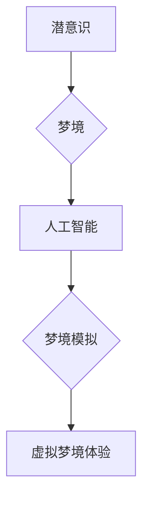

                 

## 数字化梦境编织：AI设计的潜意识探索

> 关键词：人工智能、潜意识、设计、算法、神经网络、深度学习、梦境模拟、虚拟现实

## 1. 背景介绍

人类文明自古以来就对梦境充满了好奇和探索。梦境作为我们潜意识的表达形式，承载着丰富的想象力和情感体验。近年来，随着人工智能技术的飞速发展，我们开始尝试用算法和数据来模拟和理解梦境。

传统的梦境研究主要依赖于心理学和神经科学，而人工智能为梦境研究提供了全新的视角和工具。通过深度学习算法，我们可以训练模型识别和生成梦境内容，并探索梦境背后的认知机制。

## 2. 核心概念与联系

### 2.1  潜意识与梦境

潜意识是指人类意识之外的思想、情感和记忆，它对我们的行为和决策产生着深远的影响。梦境被认为是潜意识的一种表达方式，它通过符号和图像来表达我们的内心世界。

### 2.2  人工智能与梦境模拟

人工智能，特别是深度学习算法，能够学习和模拟人类的认知能力，包括语言理解、图像识别和情感分析。通过训练模型识别和生成梦境内容，我们可以探索梦境的本质，并尝试用人工智能技术来创造虚拟梦境体验。

**核心概念与联系流程图**



## 3. 核心算法原理 & 具体操作步骤

### 3.1  算法原理概述

梦境模拟的核心算法是基于深度学习的生成对抗网络（GAN）。GAN由两个网络组成：生成网络（Generator）和判别网络（Discriminator）。

* 生成网络负责生成梦境内容，例如图像、文本和声音。
* 判别网络负责判断生成的内容是否真实，即是否来自真实梦境数据。

这两个网络在对抗游戏中相互竞争，生成网络试图生成越来越逼真的梦境内容，而判别网络则试图识别出伪造的内容。

### 3.2  算法步骤详解

1. **数据收集和预处理:** 收集大量真实梦境数据，例如梦境日记、脑电图数据和睡眠监测数据。对数据进行预处理，例如文本清洗、图像增强和数据标注。
2. **模型训练:** 使用深度学习框架，例如TensorFlow或PyTorch，训练生成对抗网络。
3. **生成梦境内容:** 将训练好的生成网络输入随机噪声，即可生成新的梦境内容。
4. **评估梦境质量:** 使用判别网络或其他评估指标，评估生成梦境内容的真实性和质量。

### 3.3  算法优缺点

**优点:**

* 可以生成逼真的梦境内容，例如图像、文本和声音。
* 可以探索梦境的本质，并理解潜意识的运作机制。

**缺点:**

* 需要大量的真实梦境数据进行训练。
* 训练过程复杂，需要强大的计算资源。
* 生成的梦境内容可能存在偏差或不真实。

### 3.4  算法应用领域

* **虚拟现实体验:** 创建沉浸式的虚拟梦境体验，例如治疗创伤后应激障碍（PTSD）或帮助人们探索潜意识。
* **艺术创作:** 利用人工智能生成梦境内容，创作新的艺术作品，例如绘画、音乐和文学。
* **科学研究:** 研究梦境的认知机制，探索人类潜意识的运作方式。

## 4. 数学模型和公式 & 详细讲解 & 举例说明

### 4.1  数学模型构建

生成对抗网络（GAN）的数学模型可以概括为以下两个部分：

* **生成网络 (G):** 
    * 输入：随机噪声向量 $z \in R^n$
    * 输出：生成梦境内容 $x' \in R^m$
    * 参数：$\theta_G$
* **判别网络 (D):**
    * 输入：梦境内容 $x \in R^m$
    * 输出：真实性概率 $p(x)$
    * 参数：$\theta_D$

### 4.2  公式推导过程

GAN的训练目标是使生成网络生成越来越逼真的梦境内容，而判别网络则试图识别出真实和伪造的内容。

* **生成网络的损失函数:** 
    * $L_G(G, D) = E_{z \sim p_z(z)}[ -log(D(G(z)))]$
    * 目标：最大化判别网络对生成内容的判断错误率。

* **判别网络的损失函数:**
    * $L_D(G, D) = E_{x \sim p_{data}(x)}[ -log(D(x))] + E_{z \sim p_z(z)}[ -log(1 - D(G(z)))]$
    * 目标：最小化对真实和伪造内容的判断错误率。

### 4.3  案例分析与讲解

假设我们训练一个生成梦境图像的GAN模型。

* **训练过程:** 
    * 生成网络会随机生成噪声向量，并将其转换为图像。
    * 判别网络会判断这些图像是否来自真实梦境数据集。
    * 根据判别网络的判断结果，更新生成网络和判别网络的参数。
* **结果:** 
    * 随着训练的进行，生成网络会逐渐生成越来越逼真的梦境图像。
    * 判别网络也会变得越来越难以区分真实和伪造的图像。

## 5. 项目实践：代码实例和详细解释说明

### 5.1  开发环境搭建

* **操作系统:** Ubuntu 18.04 或更高版本
* **编程语言:** Python 3.6 或更高版本
* **深度学习框架:** TensorFlow 或 PyTorch
* **其他依赖:** NumPy、Scikit-learn、Matplotlib 等

### 5.2  源代码详细实现

```python
# 使用 TensorFlow 实现 GAN 模型

import tensorflow as tf

# 定义生成网络
def generator(z):
    # ... 生成网络结构代码 ...

# 定义判别网络
def discriminator(x):
    # ... 判别网络结构代码 ...

# 定义损失函数和优化器
optimizer_G = tf.keras.optimizers.Adam(learning_rate=0.0002, beta_1=0.5)
optimizer_D = tf.keras.optimizers.Adam(learning_rate=0.0002, beta_1=0.5)
loss_fn = tf.keras.losses.BinaryCrossentropy()

# 训练循环
for epoch in range(num_epochs):
    for batch in dataset:
        # 训练判别网络
        with tf.GradientTape() as tape_D:
            real_output = discriminator(real_images)
            fake_output = discriminator(generated_images)
            d_loss_real = loss_fn(tf.ones_like(real_output), real_output)
            d_loss_fake = loss_fn(tf.zeros_like(fake_output), fake_output)
            d_loss = d_loss_real + d_loss_fake
        gradients_D = tape_D.gradient(d_loss, discriminator.trainable_variables)
        optimizer_D.apply_gradients(zip(gradients_D, discriminator.trainable_variables))

        # 训练生成网络
        with tf.GradientTape() as tape_G:
            fake_output = discriminator(generated_images)
            g_loss = loss_fn(tf.ones_like(fake_output), fake_output)
        gradients_G = tape_G.gradient(g_loss, generator.trainable_variables)
        optimizer_G.apply_gradients(zip(gradients_G, generator.trainable_variables))

    # 打印训练进度
    print(f"Epoch {epoch+1}/{num_epochs}, D loss: {d_loss.numpy()}, G loss: {g_loss.numpy()}")

```

### 5.3  代码解读与分析

* **生成网络和判别网络:** 代码中定义了生成网络和判别网络的结构，可以使用不同的神经网络架构，例如卷积神经网络（CNN）或循环神经网络（RNN）。
* **损失函数和优化器:** 使用了二元交叉熵损失函数和Adam优化器来训练模型。
* **训练循环:** 训练循环中，首先训练判别网络，然后训练生成网络。

### 5.4  运行结果展示

训练完成后，可以使用生成网络生成新的梦境图像，并将其与真实梦境图像进行比较。

## 6. 实际应用场景

### 6.1  虚拟现实体验

梦境模拟技术可以用于创建沉浸式的虚拟梦境体验，例如治疗创伤后应激障碍（PTSD）或帮助人们探索潜意识。

### 6.2  艺术创作

利用人工智能生成梦境内容，创作新的艺术作品，例如绘画、音乐和文学。

### 6.3  科学研究

研究梦境的认知机制，探索人类潜意识的运作方式。

### 6.4  未来应用展望

随着人工智能技术的不断发展，梦境模拟技术将有更广泛的应用场景，例如：

* **个性化教育:** 根据学生的梦境内容，定制个性化的学习方案。
* **药物研发:** 利用梦境模拟技术，测试药物的疗效和副作用。
* **情感分析:** 分析梦境内容，了解个人的情感状态和心理需求。

## 7. 工具和资源推荐

### 7.1  学习资源推荐

* **书籍:**
    * 《深度学习》 by Ian Goodfellow, Yoshua Bengio, and Aaron Courville
    * 《Generative Deep Learning》 by David Foster
* **在线课程:**
    * Coursera: Deep Learning Specialization
    * Udacity: Deep Learning Nanodegree

### 7.2  开发工具推荐

* **深度学习框架:** TensorFlow, PyTorch
* **编程语言:** Python
* **数据可视化工具:** Matplotlib, Seaborn

### 7.3  相关论文推荐

* **Generative Adversarial Networks** by Ian Goodfellow et al. (2014)
* **Improved Techniques for Training GANs** by Alec Radford et al. (2015)
* **Deep Dream Generator** by Google DeepMind

## 8. 总结：未来发展趋势与挑战

### 8.1  研究成果总结

梦境模拟技术是人工智能领域的一个新兴研究方向，取得了一些重要的进展。

* 能够生成逼真的梦境内容，例如图像、文本和声音。
* 探索梦境的认知机制，理解潜意识的运作方式。

### 8.2  未来发展趋势

* **更逼真的梦境生成:** 
    * 使用更先进的深度学习算法和模型架构。
    * 收集和利用更多真实梦境数据。
* **个性化梦境体验:** 
    * 根据用户的个人喜好和需求，定制个性化的梦境内容。
* **梦境交互:** 
    * 允许用户在梦境中进行交互，例如控制梦境场景或与梦境角色对话。

### 8.3  面临的挑战

* **数据获取和标注:** 真实梦境数据稀缺且难以标注。
* **模型训练和优化:** 训练梦境模拟模型需要大量的计算资源和时间。
* **伦理和安全问题:** 梦境模拟技术可能带来伦理和安全问题，例如隐私泄露和意识操控。

### 8.4  研究展望

梦境模拟技术具有巨大的潜力，未来将应用于多个领域，例如医疗、教育、娱乐和科学研究。

## 9. 附录：常见问题与解答

* **Q: 梦境模拟技术是否可以实现完全真实的梦境体验？**

A: 目前，梦境模拟技术还无法完全复制真实梦境的复杂性和多层次性。

* **Q: 梦境模拟技术是否会对人类心理造成负面影响？**

A: 梦境模拟技术的潜在影响尚不清楚，需要进一步研究和评估。

* **Q: 梦境模拟技术有哪些伦理和安全问题？**

A: 梦境模拟技术可能带来隐私泄露、意识操控和虚拟现实成瘾等问题。

**作者：禅与计算机程序设计艺术 / Zen and the Art of Computer Programming**<end_of_turn>

