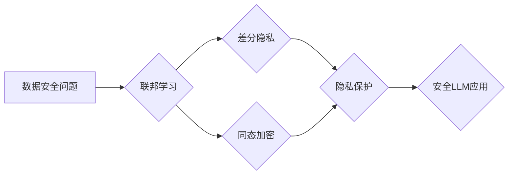

                 

## 数据安全新思路：LLM时代的隐私保护

> 关键词：LLM、隐私保护、联邦学习、差分隐私、同态加密、数据安全、人工智能

## 1. 背景介绍

近年来，大型语言模型（LLM）在自然语言处理领域取得了令人瞩目的成就，其强大的文本生成、理解和翻译能力为各行各业带来了革命性的变革。然而，LLM的训练和应用也带来了新的数据安全挑战。

传统机器学习模型通常需要将海量数据集中到一个中心服务器进行训练，这导致数据泄露和隐私侵犯的风险显著增加。随着LLM模型规模的不断扩大，数据安全问题变得更加突出。

为了应对这一挑战，数据安全新思路应运而生。本文将探讨LLM时代的数据安全保护新思路，重点介绍联邦学习、差分隐私和同态加密等技术，并分析其原理、应用场景以及未来发展趋势。

## 2. 核心概念与联系

### 2.1 核心概念

* **LLM（大型语言模型）：** 指参数数量庞大的深度学习模型，能够理解和生成人类语言。
* **联邦学习：** 一种分布式机器学习方法，允许模型在多个设备上进行训练，而无需将原始数据传输到中心服务器。
* **差分隐私：** 一种隐私保护技术，通过添加噪声来保护训练数据中的敏感信息。
* **同态加密：** 一种加密技术，允许对加密数据进行运算，而无需解密。

### 2.2 核心概念联系

LLM的训练和应用通常需要处理大量敏感数据，这使得数据安全成为一个关键问题。联邦学习、差分隐私和同态加密等技术可以有效地保护LLM训练和应用过程中的数据隐私。

**Mermaid 流程图：**



## 3. 核心算法原理 & 具体操作步骤

### 3.1 算法原理概述

**联邦学习**

联邦学习的核心思想是将模型参数进行迭代更新，而不是原始数据。训练过程如下：

1. 将模型参数分发到各个参与者设备上。
2. 每个参与者在本地数据上训练模型，并计算模型参数的梯度。
3. 将梯度上传到中心服务器。
4. 中心服务器聚合所有梯度，更新全局模型参数。
5. 将更新后的模型参数分发回各个参与者设备，重复步骤2-4。

**差分隐私**

差分隐私通过添加噪声来保护训练数据中的敏感信息。具体来说，在训练过程中，会对每个数据点添加随机噪声，使得模型无法从单个数据点中推断出敏感信息。

**同态加密**

同态加密允许对加密数据进行运算，而无需解密。这意味着数据可以在加密状态下进行处理，从而保护其隐私。

### 3.2 算法步骤详解

**联邦学习**

1. **模型初始化:** 选择一个初始模型，并将其参数分发到各个参与者设备上。
2. **本地训练:** 每个参与者在本地数据上训练模型，并计算模型参数的梯度。
3. **梯度聚合:** 中心服务器收集所有参与者的梯度，并使用聚合算法（例如平均聚合）计算全局梯度。
4. **模型更新:** 中心服务器使用全局梯度更新全局模型参数。
5. **模型分发:** 更新后的模型参数分发回各个参与者设备。
6. **重复步骤2-5:** 重复上述步骤，直到模型收敛。

**差分隐私**

1. **噪声添加:** 在训练数据中添加随机噪声，使得每个数据点的隐私受到保护。
2. **模型训练:** 使用添加了噪声的数据训练模型。
3. **模型输出:** 模型输出结果可能受到噪声的影响，但仍然能够保留模型的整体性能。

**同态加密**

1. **数据加密:** 将数据加密成不可读的形式。
2. **加密数据运算:** 对加密数据进行运算，例如加法、乘法等。
3. **解密结果:** 将运算结果解密，得到原始数据的结果。

### 3.3 算法优缺点

**联邦学习**

* **优点:** 保护数据隐私，无需将原始数据传输到中心服务器。
* **缺点:** 训练速度较慢，模型性能可能不如集中式训练。

**差分隐私**

* **优点:** 能够有效地保护数据隐私，即使模型训练数据中包含敏感信息。
* **缺点:** 可能导致模型性能下降，需要仔细调参才能达到最佳效果。

**同态加密**

* **优点:** 能够对加密数据进行运算，保护数据隐私。
* **缺点:** 计算效率较低，目前主要应用于特定场景。

### 3.4 算法应用领域

* **医疗保健:** 保护患者隐私，进行疾病诊断和治疗研究。
* **金融服务:** 保护客户财务信息，进行风险评估和欺诈检测。
* **物联网:** 保护设备数据隐私，进行智能家居和城市管理。

## 4. 数学模型和公式 & 详细讲解 & 举例说明

### 4.1 数学模型构建

**联邦学习**

假设有 $n$ 个参与者，每个参与者拥有自己的本地数据集 $D_i$。全局模型参数为 $\theta$，每个参与者在本地训练模型后获得的模型参数更新为 $\Delta \theta_i$。

联邦学习的模型更新过程可以表示为：

$$\theta_{t+1} = \theta_t + \frac{1}{n} \sum_{i=1}^{n} \Delta \theta_i$$

其中，$\theta_t$ 是第 $t$ 轮迭代的全局模型参数，$\theta_{t+1}$ 是第 $t+1$ 轮迭代的全局模型参数。

**差分隐私**

差分隐私的数学模型基于随机机制。假设一个随机机制 $M$，它将输入数据 $x$ 映射到输出 $y$。差分隐私要求对于任意两个相邻的数据集 $x$ 和 $x'$，随机机制 $M$ 的输出 $y$ 满足以下条件：

$$Pr(M(x) = y) \leq e^{\epsilon} Pr(M(x') = y)$$

其中，$\epsilon$ 是一个隐私预算参数，控制着隐私保护的程度。

**同态加密**

同态加密的数学模型基于环论和群论。假设一个环 $R$，其中存在两个元素 $a$ 和 $b$。同态加密要求对于任意两个元素 $a$ 和 $b$，其加密后的结果满足以下条件：

$$Enc_k(a + b) = Enc_k(a) + Enc_k(b)$$

$$Enc_k(a \cdot b) = Enc_k(a) \cdot Enc_k(b)$$

其中，$k$ 是加密密钥。

### 4.2 公式推导过程

**联邦学习**

联邦学习的模型更新公式的推导过程基于梯度下降算法。

假设模型的损失函数为 $L(\theta, D)$，其中 $\theta$ 是模型参数，$D$ 是训练数据。梯度下降算法的目标是找到使损失函数最小化的模型参数。

在联邦学习中，每个参与者在本地数据上计算模型参数的梯度，并将其上传到中心服务器。中心服务器收集所有梯度，并使用平均聚合算法计算全局梯度。

全局梯度用于更新全局模型参数，从而降低模型的损失函数值。

**差分隐私**

差分隐私的数学模型基于随机机制。

假设一个随机机制 $M$，它将输入数据 $x$ 映射到输出 $y$。差分隐私要求对于任意两个相邻的数据集 $x$ 和 $x'$，随机机制 $M$ 的输出 $y$ 满足以下条件：

$$Pr(M(x) = y) \leq e^{\epsilon} Pr(M(x') = y)$$

其中，$\epsilon$ 是一个隐私预算参数，控制着隐私保护的程度。

这个条件表明，对于任意两个相邻的数据集，随机机制 $M$ 的输出 $y$ 的概率分布应该相差不大。

**同态加密**

同态加密的数学模型基于环论和群论。

假设一个环 $R$，其中存在两个元素 $a$ 和 $b$。同态加密要求对于任意两个元素 $a$ 和 $b$，其加密后的结果满足以下条件：

$$Enc_k(a + b) = Enc_k(a) + Enc_k(b)$$

$$Enc_k(a \cdot b) = Enc_k(a) \cdot Enc_k(b)$$

其中，$k$ 是加密密钥。

这个条件表明，对于任意两个元素 $a$ 和 $b$，其加密后的结果可以进行加法和乘法运算，而无需解密。

### 4.3 案例分析与讲解

**联邦学习**

在医疗保健领域，联邦学习可以用于训练疾病诊断模型，而无需将患者数据集中到一个中心服务器。例如，多个医院可以共享其患者数据，并使用联邦学习训练一个疾病诊断模型，该模型能够在各个医院部署并用于诊断新患者。

**差分隐私**

在金融服务领域，差分隐私可以用于保护客户财务信息。例如，银行可以利用差分隐私技术训练欺诈检测模型，而无需泄露客户的详细财务信息。

**同态加密**

在物联网领域，同态加密可以用于保护设备数据隐私。例如，智能家居设备可以利用同态加密技术进行数据加密，从而防止黑客窃取其数据。

## 5. 项目实践：代码实例和详细解释说明

### 5.1 开发环境搭建

* **操作系统:** Ubuntu 20.04
* **Python 版本:** 3.8
* **库依赖:** TensorFlow, PyTorch, scikit-learn, numpy, pandas

### 5.2 源代码详细实现

**联邦学习示例代码 (TensorFlow)**

```python
import tensorflow as tf

# 定义模型
model = tf.keras.models.Sequential([
    tf.keras.layers.Dense(128, activation='relu'),
    tf.keras.layers.Dense(10, activation='softmax')
])

# 定义联邦学习训练函数
def federated_train(clients, epochs, learning_rate):
    for epoch in range(epochs):
        # 每个客户端本地训练模型
        for client in clients:
            client.train(model, learning_rate)
        # 汇总所有客户端的模型参数更新
        model.update_weights(clients)
    return model

# ... 其他代码 ...
```

**差分隐私示例代码 (PyTorch)**

```python
import torch
from torch.nn.utils.clip_grad import clip_grad_norm_

# 定义模型
model = torch.nn.Sequential(
    torch.nn.Linear(10, 10),
    torch.nn.ReLU(),
    torch.nn.Linear(10, 1)
)

# 定义差分隐私训练函数
def differential_privacy_train(model, data, learning_rate, epsilon):
    optimizer = torch.optim.SGD(model.parameters(), lr=learning_rate)
    for epoch in range(epochs):
        for batch_idx, (data, target) in enumerate(data_loader):
            # 添加噪声
            data = data + torch.randn_like(data) * epsilon
            # 前向传播
            output = model(data)
            # 计算损失
            loss = criterion(output, target)
            # 反向传播
            optimizer.zero_grad()
            loss.backward()
            # 更新模型参数
            optimizer.step()
    return model

# ... 其他代码 ...
```

**同态加密示例代码 (SEAL)**

```python
import seal

# 初始化 SEAL 库
context = seal.SEALContext(security_level=128, poly_modulus_degree=8192)
evaluator = context.Evaluator()
key_generator = context.KeyGenerator(context)
public_key = key_generator.public_key()
secret_key = key_generator.secret_key()

# 加密数据
encrypted_data = evaluator.encrypt(context, data, public_key)

# 对加密数据进行运算
encrypted_result = evaluator.add(context, encrypted_data1, encrypted_data2)

# 解密结果
decrypted_result = evaluator.decrypt(context, encrypted_result, secret_key)

# ... 其他代码 ...
```

### 5.3 代码解读与分析

以上代码示例展示了联邦学习、差分隐私和同态加密的基本实现思路。

**联邦学习**

代码示例中，联邦学习训练函数 `federated_train` 迭代地训练模型，并汇总所有客户端的模型参数更新。

**差分隐私**

代码示例中，差分隐私训练函数 `differential_privacy_train` 在训练过程中添加噪声，以保护数据隐私。

**同态加密**

代码示例中，同态加密示例展示了如何使用 SEAL 库对数据进行加密和运算。

### 5.4 运行结果展示

运行以上代码示例可以得到相应的训练结果和输出结果。

## 6. 实际应用场景

### 6.1 医疗保健

* **疾病诊断:** 利用联邦学习训练疾病诊断模型，保护患者隐私。
* **药物研发:** 利用差分隐私保护患者数据，进行药物研发和临床试验。

### 6.2 金融服务

* **欺诈检测:** 利用差分隐私保护客户财务信息，训练欺诈检测模型。
* **风险评估:** 利用同态加密保护客户数据，进行风险评估和信用评分。

### 6.3 物联网

* **智能家居:** 利用同态加密保护设备数据隐私，实现安全和可靠的智能家居应用。
* **智能城市:** 利用联邦学习训练城市管理模型，保护居民隐私。

### 6.4 未来应用展望

随着LLM技术的不断发展，数据安全新思路将得到更广泛的应用，例如：

* **个性化推荐:** 利用差分隐私保护用户数据，提供个性化推荐服务。
* **自动驾驶:** 利用同态加密保护车辆数据隐私，实现安全可靠的自动驾驶。
* **元宇宙:** 利用联邦学习和差分隐私保护用户数据隐私，构建安全可靠的元宇宙环境。

## 7. 工具和资源推荐

### 7.1 学习资源推荐

* **书籍:**
    * 《深度学习》 - Ian Goodfellow, Yoshua Bengio, Aaron Courville
    * 《联邦学习》 - Andrew Trask
* **在线课程:**
    * Coursera: 深度学习 Specialization
    * edX: Introduction to Deep Learning
* **博客和网站:**
    * TensorFlow Blog: https://blog.tensorflow.org/
    * PyTorch Blog: https://pytorch.org/blog/
    * OpenMined: https://openmined.org/

### 7.2 开发工具推荐

* **TensorFlow:** https://www.tensorflow.org/
* **PyTorch:** https://pytorch.org/
* **SEAL:** https://github.com/microsoft/SEAL

### 7.3 相关论文推荐

* **Federated Learning: Strategies for Improving Communication Efficiency** - Nicolas Papernot, et al.
* **Differential Privacy** - Cynthia Dwork, et al.
* **Homomorphic Encryption for Secure Cloud Computing** - Craig Gentry, et al.

## 8. 总结：未来发展趋势与挑战

### 8.1 研究成果总结

近年来，数据安全新思路在LLM时代取得了显著进展，联邦学习、差分隐私和同态加密等技术已经应用于多个领域，有效地保护了数据隐私。

### 8.2 未来发展趋势

未来，数据安全新思路将继续发展，主要趋势包括：

* **模型架构优化:** 研究更有效的联邦学习、差分隐私和同态加密模型架构，提高模型性能和效率。
* **隐私保护机制创新:** 开发新的隐私保护机制，例如可信计算和零信任架构，进一步增强数据安全。
* **跨领域应用:** 将数据安全新思路应用于更多领域，例如金融、医疗、教育等，推动数据安全技术的普及。

### 8.3 面临的挑战

数据安全新思路也面临一些挑战，例如：

* **模型性能:** 联邦学习、差分隐私和同态加密等技术可能导致模型性能下降，需要进一步优化模型架构和算法。
* **计算资源:** 同态加密计算效率较低，需要进一步提高计算效率。
* **标准化:** 数据安全新思路缺乏统一的标准，需要制定行业标准，促进技术互操作性。

### 8.4 研究展望

未来，需要继续研究以下问题：

* 如何提高联邦学习、差分隐私和同态加密的模型性能？
* 如何降低同态加密的计算成本？
* 如何制定数据安全新思路的行业标准？


## 9. 附录：常见问题与解答

**常见问题:**

* **联邦学习和差分隐私有什么区别？**

**解答:** 联邦学习和差分隐私都是数据安全技术，但它们的工作原理不同。联邦学习允许模型在多个设备上进行训练，而无需将原始数据传输到中心服务器，而差分隐私则通过添加噪声来保护训练数据中的敏感信息。

* **同态加密可以加密任何数据吗？**

**解答:** 同态加密目前主要适用于数字数据，例如整数和浮点数。

* **数据安全新思路在LLM时代有什么重要意义？**

**解答:** 数据安全新思路在LLM时代至关重要，因为LLM模型通常需要处理大量敏感数据，数据安全新思路可以有效地保护数据隐私。


作者：禅与计算机程序设计艺术 / Zen and the Art of Computer Programming


<end_of_turn>
```
<end_of_turn>

