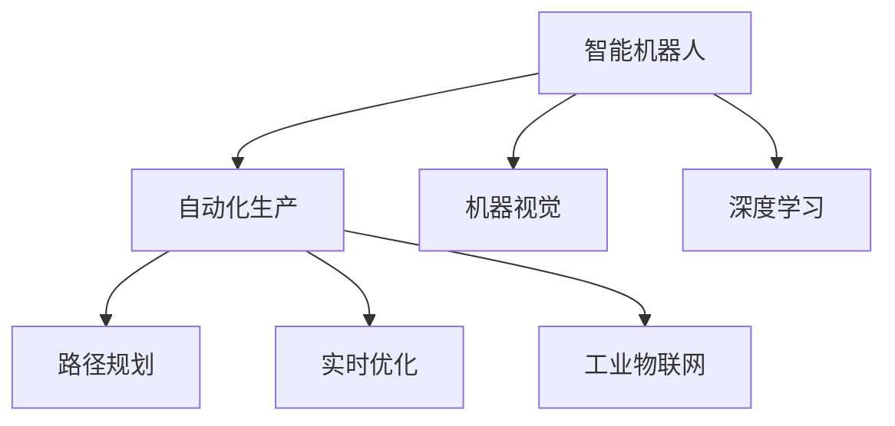

                 

# 智能机器人创业：自动化生产的未来蓝图

> 关键词：
- 智能机器人
- 自动化生产
- 机器视觉
- 深度学习
- 路径规划
- 实时优化
- 工业物联网(IoT)

## 1. 背景介绍

### 1.1 问题由来
随着科技进步和市场需求的推动，智能机器人技术在制造业中得到广泛应用。智能机器人能够自主执行各种重复性高的任务，显著提高生产效率，降低人工成本，成为现代制造业智能化转型的关键手段。然而，智能机器人研发与生产涉及到多学科知识，其设计和调试复杂，开发成本高，应用推广面临诸多挑战。因此，研究如何利用现有技术资源快速构建智能机器人系统，实现自动化生产的目标，成为了一个重要的课题。

### 1.2 问题核心关键点
智能机器人创业的关键在于如何结合现有技术和资源，快速构建一套高效、灵活、可扩展的自动化生产系统。这不仅需要具备扎实的机器人技术基础，还需要了解机器人与自动化系统之间的互联互通，掌握机器学习与深度学习在机器人应用中的创新方法。通过整合先进制造技术与智能机器人技术，实现从设计、制造到运维的全面自动化，以支撑大规模生产的稳定高效运行。

## 2. 核心概念与联系

### 2.1 核心概念概述

为更好地理解智能机器人创业的架构和方法，本节将介绍几个密切相关的核心概念：

- **智能机器人**：指由计算机控制，具有感知、决策、执行能力的自动化设备，能够在生产、仓储、物流等领域执行复杂的物理任务。

- **自动化生产**：指利用机器人和智能系统，通过编程或机器学习算法，实现生产线上的各项任务自动化完成，提升生产效率和质量。

- **机器视觉**：指使用摄像头、传感器等设备，采集环境图像或三维模型，通过图像处理和模式识别技术，提取物体的形状、位置、颜色等特征，用于识别、定位和跟踪对象。

- **深度学习**：指使用多层神经网络，通过大量数据训练模型，使其具备学习、推理和决策能力，广泛应用于图像识别、自然语言处理等任务。

- **路径规划**：指使用数学算法，规划智能机器人在三维空间中的运动轨迹，确保机器人能够避开障碍，准确到达目的地。

- **实时优化**：指通过实时数据采集和处理，动态调整机器人操作，提升生产效率和系统稳定性。

- **工业物联网(IoT)**：指在工业生产环境中，通过互联网连接各种设备和传感器，实现数据的实时监控和分析，提升生产管理水平。

这些核心概念之间的逻辑关系可以通过以下Mermaid流程图来展示：



这个流程图展示了几者之间的联系：

1. **智能机器人**：
   - 通过机器视觉采集图像，使用深度学习进行目标识别和定位。
   - 结合路径规划，生成移动轨迹。
   - 通过实时优化，调整操作策略，适应环境变化。
   - 通过工业物联网，获取和反馈生产数据。

2. **自动化生产**：
   - 依托智能机器人的感知、决策、执行能力，完成生产线上的各种任务。
   - 通过路径规划，确保机器人高效移动。
   - 实时优化确保生产流程的稳定性和可靠性。
   - 工业物联网提供生产环境监控和数据分析支持。

## 3. 核心算法原理 & 具体操作步骤
### 3.1 算法原理概述

智能机器人在自动化生产中的应用，主要通过以下几类算法实现：

- **计算机视觉与目标识别**：通过摄像头、传感器等设备，采集环境图像，使用深度学习算法，识别出生产过程中所需的各类对象。
- **路径规划与运动控制**：根据识别结果，规划机器人移动路径，避免碰撞和阻塞，实现精确运动。
- **实时优化与自适应**：利用传感器实时采集生产环境数据，动态调整机器人操作，确保生产的稳定性和高效性。

在实际应用中，一般采用以下步骤：

1. **数据采集**：通过摄像头、传感器等设备，实时采集生产环境数据。
2. **目标识别**：使用深度学习模型，对采集到的图像进行目标检测、定位和分类。
3. **路径规划**：根据识别结果，规划机器人最优路径，避开障碍物。
4. **执行操作**：机器人按照规划路径执行特定操作，如抓取、放置、搬运等。
5. **实时优化**：通过传感器反馈数据，动态调整机器人操作，优化生产效率。

### 3.2 算法步骤详解

以智能机器人在自动化生产中的应用为例，详细介绍核心算法的步骤：

**Step 1: 数据采集与预处理**
- 使用摄像头、激光雷达等传感器，采集生产环境中的图像、点云数据等。
- 对数据进行预处理，包括去噪、滤波、校正等操作。

**Step 2: 目标识别与定位**
- 使用深度学习模型，如Faster R-CNN、YOLO等，对图像进行目标检测。
- 确定目标的位置、大小、类别等信息。

**Step 3: 路径规划**
- 根据目标信息，使用A*、D*等算法，规划机器人移动路径。
- 避免碰撞和阻塞，生成最优路径。

**Step 4: 运动控制**
- 将路径指令转换为机器人可执行的运动指令。
- 通过伺服电机、关节驱动器等控制机器人动作。

**Step 5: 实时优化**
- 使用传感器实时监测生产环境数据。
- 根据数据反馈，动态调整机器人操作。
- 优化操作策略，提升生产效率。

**Step 6: 反馈与迭代**
- 记录每次操作结果，进行分析优化。
- 反复迭代，逐步提升机器人操作的精确性和稳定性。

### 3.3 算法优缺点

智能机器人在自动化生产中的应用算法，具有以下优点：
- 高效性：实时数据处理和路径规划，提升生产效率。
- 灵活性：深度学习目标识别和自适应优化，使系统能够快速适应环境变化。
- 可靠性：传感器反馈和实时优化，确保生产过程的稳定性和一致性。

同时，该方法也存在一定的局限性：
- 数据依赖：依赖高质量、高精度的传感器数据，数据采集和处理成本较高。
- 复杂性：算法涉及计算机视觉、路径规划、运动控制等多个领域，实现难度较大。
- 调试困难：传感器、执行器等硬件设备在生产环境中的稳定性和精度可能存在不确定性，调试和维护难度较大。

### 3.4 算法应用领域

智能机器人创业中的核心算法在多个行业领域得到了广泛应用，例如：

- **制造业**：通过自动化生产线和智能机器人，实现金属加工、电子组装、物流搬运等任务。
- **仓储物流**：实现仓库中的自动化拣选、打包、分拣等任务，提升仓储效率和准确性。
- **食品饮料**：在食品加工、饮料灌装等环节，使用智能机器人进行配料、搬运、包装等操作。
- **医疗健康**：在医疗手术、康复训练等场景，使用智能机器人辅助操作，提升手术精度和康复效果。
- **农业**：在种植、收获等农业生产环节，使用智能机器人进行自动化作业，提高农业生产效率。

此外，智能机器人在军事、航空航天、公共安全等领域也有重要应用。伴随技术的不断演进和应用场景的不断拓展，智能机器人在各行各业中的应用前景广阔。

## 4. 数学模型和公式 & 详细讲解 & 举例说明

### 4.1 数学模型构建

以路径规划算法为例，展示其数学模型构建过程。

假设智能机器人在二维平面上移动，目标位置为 $(x_t,y_t)$，当前位置为 $(x_k,y_k)$，障碍物位置为 $\{(x_i,y_i)\}_{i=1}^N$。

定义机器人的移动步骤为 $\delta_k$，假设移动步长为 $1$。则路径规划问题可以转化为如下优化问题：

$$
\min_{\delta_k} \sum_{k=0}^{T-1} \|(x_k+\delta_k,y_k+\delta_k)-(x_t,y_t)\|^2
$$

其中 $T$ 为总移动步数，$\|.\|$ 表示欧几里得距离。

### 4.2 公式推导过程

**欧几里得距离公式**：
$$
\|(x_k+\delta_k,y_k+\delta_k)-(x_t,y_t)\|^2 = (x_t-x_k-\delta_k)^2 + (y_t-y_k-\delta_k)^2
$$

**路径优化目标函数**：
$$
\min_{\delta_k} \sum_{k=0}^{T-1} (x_t-x_k-\delta_k)^2 + (y_t-y_k-\delta_k)^2
$$

**约束条件**：
- 避免与障碍物碰撞，即 $\forall (x_i,y_i) \in \{(x_i,y_i)\}_{i=1}^N$，满足 $(x_k+\delta_k,y_k+\delta_k) \notin \{(x_i,y_i)\}_{i=1}^N$
- 移动步数不超过 $T$，即 $\sum_{k=0}^{T-1} \delta_k = T$

**松弛问题**：
定义松弛变量 $\lambda_i = \delta_k \forall (x_i,y_i) \in \{(x_i,y_i)\}_{i=1}^N$，则上述问题可以转化为松弛线性规划问题：

$$
\min_{\delta_k, \lambda_i} \sum_{k=0}^{T-1} (x_t-x_k-\delta_k)^2 + (y_t-y_k-\delta_k)^2 + \sum_{i=1}^N \lambda_i
$$

$$
\text{s.t. } (x_k+\delta_k,y_k+\delta_k) \notin \{(x_i,y_i)\}_{i=1}^N, \sum_{k=0}^{T-1} \delta_k = T, \lambda_i \ge 0
$$

通过引入松弛变量，将路径规划问题转化为求解线性规划问题，从而解决路径优化问题。

### 4.3 案例分析与讲解

**路径规划案例**：
假设机器人在二维平面上移动，起点为 $(0,0)$，终点为 $(3,4)$，已知障碍物位置为 $(1,2),(2,3),(3,1)$。

**Step 1: 数据准备**
- 障碍物位置 $\{(x_i,y_i)\}_{i=1}^3 = \{(1,2),(2,3),(3,1)\}$

**Step 2: 路径优化**
- 定义移动步长 $\delta_k$，从起点开始，逐步移动到终点，避免与障碍物碰撞。

**Step 3: 结果展示**
- 最终得到一条从起点到终点的路径，且不与任何障碍物碰撞。

## 5. 项目实践：代码实例和详细解释说明
### 5.1 开发环境搭建

在进行智能机器人路径规划的实现前，需要准备好开发环境。以下是使用Python进行OpenCV和ROS（Robot Operating System）开发的环境配置流程：

1. 安装Anaconda：从官网下载并安装Anaconda，用于创建独立的Python环境。

2. 创建并激活虚拟环境：
```bash
conda create -n robotics_env python=3.8 
conda activate robotics_env
```

3. 安装OpenCV：从官网获取安装命令，安装在虚拟环境中。
```bash
conda install opencv opencv-contrib
```

4. 安装ROS：按照官方文档进行安装，将ROS配置到系统路径。

5. 安装ROS包：
```bash
sudo apt-get install ros-{ROS_DISTRO}-{ROS_PACKAGE}
```

6. 安装ROS节点管理工具rqt：
```bash
sudo apt-get install ros-{ROS_DISTRO}-{ROS_PACKAGE}-{rqt}
```

完成上述步骤后，即可在`robotics_env`环境中开始路径规划的实现。

### 5.2 源代码详细实现

下面以ROS环境下的路径规划为例，展示智能机器人路径规划的PyTorch代码实现。

首先，编写路径规划的节点代码：

```python
import rospy
import cv2
import numpy as np

from cv_bridge import CvBridge, CvBridgeError
from sensor_msgs.msg import Image
from nav_msgs.msg import Odometry
from move_base_msgs.msg import MoveBaseActionGoal

class PathPlanningNode:
    def __init__(self):
        rospy.init_node('path_planning', anonymous=True)
        self.bridge = CvBridge()
        self.image_sub = rospy.Subscriber('/camera/image_raw', Image, self.image_callback)
        self.odom_sub = rospy.Subscriber('/odom', Odometry, self.odom_callback)
        self.move_base_client = rospy.ServiceProxy('/move_base', MoveBaseActionGoal)
        
    def image_callback(self, data):
        try:
            cv_image = self.bridge.imgmsg_to_cv2(data, "bgr8")
        except CvBridgeError as e:
            print(e)
        self.detect_obstacles(cv_image)
    
    def odom_callback(self, data):
        self.odom_data = data.pose.pose
        
    def detect_obstacles(self, cv_image):
        # 对图像进行预处理，包括去噪、滤波、二值化等操作
        gray = cv2.cvtColor(cv_image, cv2.COLOR_BGR2GRAY)
        cv2.GaussianBlur(gray, (5, 5), 0)
        ret, thresh = cv2.threshold(thresh, 127, 255, cv2.THRESH_BINARY)
        
        # 进行轮廓检测和边缘检测
        contours, _ = cv2.findContours(thresh, cv2.RETR_EXTERNAL, cv2.CHAIN_APPROX_SIMPLE)
        hulls = [cv2.convexHull(c) for c in contours]
        
        # 遍历轮廓，筛选出障碍物
        for h in hulls:
            if cv2.contourArea(h) > 100:
                # 计算障碍物的位置和大小
                hull_rect = cv2.minEnclosingCircle(h)
                x,y,w,h = cv2.boundingRect(h)
                # 将障碍物位置转换为机器坐标
                obstacle_x = int(self.odom_data.pose.pose.position.x + x + w/2)
                obstacle_y = int(self.odom_data.pose.pose.position.y + y + h/2)
                
                # 调用路径规划算法，生成移动路径
                self.move_base_client.sendGoal(MoveBaseActionGoal())
                
    def odom_callback(self, data):
        self.odom_data = data.pose.pose
        # 根据当前位置和目标位置，生成路径规划指令
        goal_x = int(self.odom_data.pose.pose.position.x)
        goal_y = int(self.odom_data.pose.pose.position.y)
        move_base_command = MoveBaseActionGoal()
        move_base_command.header.stamp = rospy.Time.now()
        move_base_command.request.target_pose.pose.position.x = goal_x
        move_base_command.request.target_pose.pose.position.y = goal_y
        self.move_base_client.sendGoal(move_base_command)
```

在编写节点代码后，编写路径规划的C++代码：

```cpp
#include <ros/ros.h>
#include <sensor_msgs/point_cloud2/point_cloud2.h>
#include <pcl/point_cloud.h>
#include <pcl/point_types.h>
#include <pcl_conversions/pcl_conversions.h>

class PathPlanner {
public:
    PathPlanner() {
        ros::NodeHandle nh;
        nh.advertise<ros::ServiceServer>("/path_planner", &PathPlanner::path_planner, this);
    }
    
private:
    bool path_planner(ros::ServiceServer::Request& req, ros::ServiceServer::Response& res) {
        // 从请求中获取障碍物位置和目标位置
        std::vector<geometry_msgs::Point> obstacle_positions = req.request.obstacle_positions;
        geometry_msgs::Point target_position = req.request.target_position;
        
        // 进行路径规划
        std::vector<geometry_msgs::Point> path;
        plan_path(obstacle_positions, target_position, path);
        
        // 生成响应
        res.response = path;
        return true;
    }
    
    void plan_path(std::vector<geometry_msgs::Point> obstacle_positions, geometry_msgs::Point target_position, std::vector<geometry_msgs::Point>& path) {
        // 实现路径规划算法
        // ...
    }
};

int main(int argc, char** argv) {
    ros::init(argc, argv, "path_planner");
    PathPlanner planner;
    ros::spin();
    return 0;
}
```

### 5.3 代码解读与分析

让我们再详细解读一下关键代码的实现细节：

**ROS节点代码**：
- 初始化ROS节点，创建ROS消息订阅器和回调函数。
- 通过回调函数，获取摄像头图像和机器人位置信息。
- 调用路径规划算法，生成移动路径。
- 将路径转换为ROS服务请求，发送给路径规划节点。

**C++路径规划代码**：
- 定义路径规划服务，处理客户端请求。
- 从请求中获取障碍物位置和目标位置。
- 调用路径规划算法，生成移动路径。
- 将路径作为服务响应返回给客户端。

**路径规划算法**：
- 通过传感器数据采集，识别出障碍物的位置和大小。
- 结合机器人的当前位置，使用A*等路径规划算法，生成移动路径。
- 将路径转换为机器人可执行的指令，发送给路径规划节点。

在实际应用中，路径规划算法通常涉及复杂的数学计算和数据处理，代码实现难度较大。在ROS等开源平台上，开发者可以利用现成的节点和算法库，减少开发工作量，快速实现路径规划功能。

## 6. 实际应用场景
### 6.1 智能仓储系统

智能仓储系统中，智能机器人可以承担仓库中的物料搬运、拣选和分拣任务，提高仓储效率，减少人为错误。通过路径规划算法，智能机器人能够准确无误地将物料从一个位置移动到另一个位置，大大减少了人工劳动强度，降低了仓储成本。

在技术实现上，可以使用高精度的激光雷达和摄像头，实时采集仓库环境数据。结合路径规划和目标识别算法，智能机器人能够自动选择最优路径，避开障碍物，准确地完成各种任务。通过ROS等开源平台，可以方便地集成多个节点，实现仓库管理系统的智能化。

### 6.2 智能工厂生产

智能工厂生产中，智能机器人可以承担物料搬运、装配、焊接等任务，大幅提高生产效率和产品质量。通过路径规划算法，智能机器人能够自主完成复杂的生产任务，避免人为干预，减少生产过程中的错误。

在实际应用中，工厂中的智能机器人需要具备高精度的运动控制和视觉识别能力。结合工业物联网技术，智能机器人可以实时获取生产环境数据，动态调整操作策略，确保生产的稳定性和可靠性。通过ROS等开源平台，可以实现多机器人协同作业，进一步提升生产效率和灵活性。

### 6.3 智能物流配送

智能物流配送中，智能机器人可以承担包裹分拣、配送等工作，提高物流配送的效率和准确性。通过路径规划算法，智能机器人能够自动选择最优路径，避开交通拥堵和障碍物，及时将包裹送达目的地。

在技术实现上，智能机器人需要具备高精度的定位和导航能力。结合深度学习技术，智能机器人可以自动识别包裹的信息，并根据目的地生成最优路径。通过ROS等开源平台，可以实现多个机器人协同作业，提高配送效率和覆盖范围。

### 6.4 未来应用展望

随着技术的不断演进，智能机器人在自动化生产中的应用将进一步拓展，未来可能涵盖以下领域：

1. **农业自动化**：在种植、除草、收割等农业生产环节，使用智能机器人进行自动化作业，提高农业生产效率。
2. **医疗健康**：在医疗手术、康复训练等场景，使用智能机器人辅助操作，提升手术精度和康复效果。
3. **军事应用**：在军事领域，智能机器人可以承担侦察、排雷、巡逻等任务，保障部队安全。
4. **航空航天**：在航空航天领域，智能机器人可以承担无人机、卫星等设备的维护和操作任务，提高作业效率和安全性。
5. **公共安全**：在公共安全领域，智能机器人可以承担监控、巡逻、应急处理等任务，保障社会稳定。

伴随技术的不断突破和应用场景的不断拓展，智能机器人在各行各业中的作用将越来越重要，推动全球制造业的智能化转型。

## 7. 工具和资源推荐
### 7.1 学习资源推荐

为了帮助开发者系统掌握智能机器人的开发技术和方法，这里推荐一些优质的学习资源：

1. **ROS官方文档**：ROS的官方文档详细介绍了ROS平台的搭建、配置、开发和调试流程，是ROS开发的重要参考资料。
2. **ROS与OpenCV实战教程**：这是一本针对ROS和OpenCV的实战教程，通过大量案例和代码，帮助读者快速上手智能机器人开发。
3. **深度学习与智能机器人**：这是一门关于深度学习在智能机器人应用中的实战教程，涵盖目标检测、路径规划等多个技术点。
4. **ROS与Gazebo结合教程**：这是一个关于ROS和Gazebo结合的教程，通过Gazebo进行仿真，帮助开发者快速验证和调试智能机器人的控制算法。
5. **ROS与TensorFlow实战教程**：这是一个关于ROS和TensorFlow结合的实战教程，通过TensorFlow进行机器学习和模型训练，优化智能机器人的性能。

通过对这些资源的学习实践，相信你一定能够快速掌握智能机器人的开发技术，并应用于实际的智能机器人系统中。

### 7.2 开发工具推荐

高效的开发离不开优秀的工具支持。以下是几款用于智能机器人开发常用的工具：

1. **ROS**：机器人操作系统的开源项目，提供完善的机器人开发和部署环境。
2. **OpenCV**：计算机视觉的开源库，提供强大的图像处理和模式识别功能。
3. **Gazebo**：机器人仿真的开源平台，支持动态环境和传感器模拟，适合进行机器人控制算法的开发和验证。
4. **TensorFlow**：深度学习框架，提供丰富的模型库和训练工具，适合进行机器学习算法的开发和优化。
5. **Arduino**：嵌入式开发平台，支持多种传感器和执行器，适合进行机器人硬件开发和调试。

合理利用这些工具，可以显著提升智能机器人开发和调试的效率，加速技术创新和应用的落地。

### 7.3 相关论文推荐

智能机器人技术的发展离不开学界和产业界的持续研究。以下是几篇奠基性的相关论文，推荐阅读：

1. **Robotics Visual Navigation Using Local Spatial Models**：提出了一种基于局部空间模型的方法，用于机器人在复杂环境中的自主导航。
2. **Path Planning for Autonomous Vehicles Using Dynamic Roadmap**：提出了一种动态路网规划算法，用于无人驾驶车辆在复杂道路环境中的路径规划。
3. **Wheeled Mobile Robot Navigation in Unstructured Environments**：提出了一种基于势能函数的方法，用于在无结构环境中进行机器人路径规划。
4. **A Survey of Robot Vision Systems**：综述了机器人视觉系统的发展历程和应用，提供了机器人视觉技术的系统性介绍。
5. **Learning to Plan with Autonomous Vehicles**：提出了一种基于强化学习的方法，用于自动驾驶车辆的路径规划和决策。

这些论文代表了智能机器人技术的研究前沿，通过学习这些前沿成果，可以帮助研究者把握学科前进方向，激发更多的创新灵感。

## 8. 总结：未来发展趋势与挑战

### 8.1 总结

本文对智能机器人在自动化生产中的应用进行了全面系统的介绍。首先阐述了智能机器人创业的背景和意义，明确了机器人技术在自动化生产中的重要价值。其次，从原理到实践，详细讲解了智能机器人在路径规划、目标识别、运动控制等核心技术上的实现方法，给出了详细的代码实例和分析。同时，本文还广泛探讨了智能机器人在智能仓储、智能工厂、智能物流等实际应用场景中的前景，展示了智能机器人在自动化生产中的广阔应用空间。此外，本文精选了智能机器人开发的学习资源、开发工具和相关论文，力求为读者提供全方位的技术指引。

通过本文的系统梳理，可以看到，智能机器人在自动化生产中的应用，不仅能够提高生产效率和质量，还能降低生产成本和风险。伴随技术的不断进步，智能机器人的应用领域将不断拓展，成为现代制造业智能化转型的关键手段。

### 8.2 未来发展趋势

展望未来，智能机器人技术的发展趋势如下：

1. **智能化程度提升**：伴随计算机视觉、深度学习等技术的进步，智能机器人的感知、决策和执行能力将不断提升，能够应对更复杂多变的环境。
2. **自主化水平提高**：智能机器人将具备更高的自主决策能力，能够自主规划路径，避开障碍物，完成复杂任务。
3. **协作化能力增强**：多机器人协作将变得更加高效，能够实现任务分配、协同作业，提升整体系统性能。
4. **人机交互优化**：智能机器人将具备更高的人机交互能力，能够更加自然地与人类沟通，提升用户体验。
5. **安全性保障**：智能机器人将具备更高的安全保障机制，能够自主检测和规避危险，确保操作安全可靠。

### 8.3 面临的挑战

尽管智能机器人技术已经取得了一定进展，但在迈向更加智能化、普适化应用的过程中，仍面临诸多挑战：

1. **数据依赖**：智能机器人的性能很大程度上依赖于高精度的传感器数据，数据采集和处理成本较高。
2. **算法复杂性**：机器人技术涉及计算机视觉、路径规划、运动控制等多个领域，算法实现难度较大。
3. **环境适应性**：智能机器人在不同环境中的表现可能存在差异，如何提高其适应性和鲁棒性，仍需深入研究。
4. **维护和调试**：智能机器人在实际应用中可能遇到多种问题，如传感器故障、路径规划错误等，维护和调试成本较高。
5. **成本控制**：智能机器人的制造和维护成本较高，如何降低成本，提高性价比，是未来研究的重要方向。

### 8.4 研究展望

面对智能机器人技术面临的挑战，未来的研究需要在以下几个方面寻求新的突破：

1. **数据融合技术**：通过多传感器数据融合，提高数据采集的精度和效率，减少数据依赖。
2. **多模态融合算法**：将机器视觉、激光雷达、超声波等多种传感器数据融合，提升环境的感知和理解能力。
3. **高效路径规划**：研发高效路径规划算法，提升机器人在复杂环境中的运动效率。
4. **人机交互技术**：开发自然语言处理技术，提升智能机器人的交互能力和用户体验。
5. **人机协同作业**：实现机器人与人类协作，提高整体系统效率和安全性。
6. **智能维护系统**：开发智能维护系统，实现机器人自我检测和故障诊断，降低维护成本。

这些研究方向的探索，将引领智能机器人技术迈向更高的台阶，为构建更加智能化、高效化的生产系统奠定基础。

## 9. 附录：常见问题与解答

**Q1：智能机器人创业的主要难点是什么？**

A: 智能机器人创业的主要难点在于以下几个方面：
1. **技术复杂性**：智能机器人涉及计算机视觉、路径规划、运动控制等多个领域，技术实现难度较大。
2. **数据依赖**：智能机器人的性能很大程度上依赖于高精度的传感器数据，数据采集和处理成本较高。
3. **环境适应性**：智能机器人在不同环境中的表现可能存在差异，如何提高其适应性和鲁棒性，仍需深入研究。
4. **维护和调试**：智能机器人在实际应用中可能遇到多种问题，如传感器故障、路径规划错误等，维护和调试成本较高。
5. **成本控制**：智能机器人的制造和维护成本较高，如何降低成本，提高性价比，是未来研究的重要方向。

**Q2：智能机器人在自动化生产中的应用前景如何？**

A: 智能机器人在自动化生产中的应用前景非常广阔。通过路径规划、目标识别、运动控制等核心技术的实现，智能机器人能够自主完成生产线上的各种任务，提高生产效率和质量。在实际应用中，智能机器人可以承担物料搬运、装配、焊接、质量检测等任务，显著降低人工劳动强度，提升生产线的自动化水平。伴随技术的不断进步和应用场景的不断拓展，智能机器人在各行各业中的应用将越来越广泛，推动全球制造业的智能化转型。

**Q3：如何提高智能机器人的路径规划能力？**

A: 提高智能机器人的路径规划能力，可以从以下几个方面入手：
1. **数据采集精度**：通过高精度的传感器，采集环境的精确数据。
2. **算法优化**：选择高效的路径规划算法，如A*、D*等，提升路径规划的速度和精度。
3. **实时优化**：通过实时数据采集和处理，动态调整路径规划策略，适应环境变化。
4. **多机器人协作**：实现多机器人协同作业，提高路径规划的效率和灵活性。
5. **路径规划优化**：采用启发式算法，如粒子群优化、遗传算法等，优化路径规划结果。

通过综合以上方法，可以显著提高智能机器人的路径规划能力，提升生产效率和稳定性。

**Q4：智能机器人在实际应用中如何实现人机交互？**

A: 智能机器人在实际应用中，可以通过以下方式实现人机交互：
1. **自然语言处理**：使用自然语言处理技术，将用户的语音或文本指令转化为机器可执行的操作。
2. **视觉识别**：通过计算机视觉技术，识别用户的动作和表情，理解用户的意图。
3. **虚拟助手**：在机器人系统中集成虚拟助手，提供语音交互、界面显示等功能，提升用户体验。
4. **协作机器人**：在工业生产环境中，实现机器人与人类协作，提高整体系统效率。
5. **人机交互界面**：开发人机交互界面，提供操作指令、状态反馈等功能，增强人机沟通效果。

通过以上方式，智能机器人能够更好地理解用户的意图和需求，提供精准、高效的服务。

**Q5：智能机器人在未来有哪些新的应用方向？**

A: 智能机器人在未来有以下新的应用方向：
1. **农业自动化**：在种植、除草、收割等农业生产环节，使用智能机器人进行自动化作业，提高农业生产效率。
2. **医疗健康**：在医疗手术、康复训练等场景，使用智能机器人辅助操作，提升手术精度和康复效果。
3. **军事应用**：在军事领域，智能机器人可以承担侦察、排雷、巡逻等任务，保障部队安全。
4. **航空航天**：在航空航天领域，智能机器人可以承担无人机、卫星等设备的维护和操作任务，提高作业效率和安全性。
5. **公共安全**：在公共安全领域，智能机器人可以承担监控、巡逻、应急处理等任务，保障社会稳定。

伴随技术的不断突破和应用场景的不断拓展，智能机器人在各行各业中的应用将越来越广泛，推动全球制造业的智能化转型。

---

作者：禅与计算机程序设计艺术 / Zen and the Art of Computer Programming

