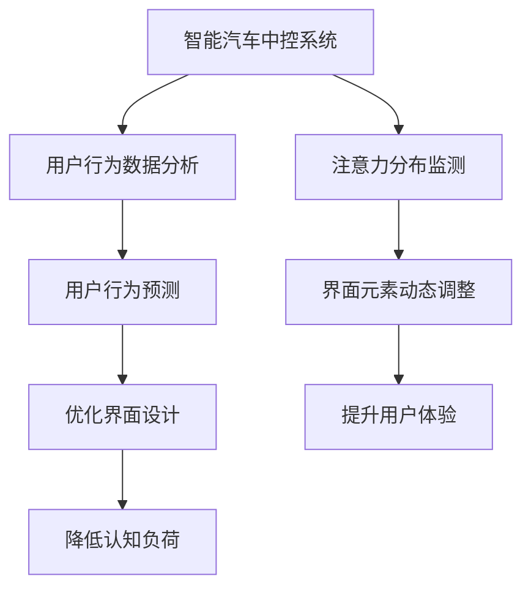

                 

# 智能汽车中控系统的注意力管理

> 关键词：智能汽车, 中控系统, 注意力管理, 人机交互, 用户界面, 认知负荷, 数据分析, 用户行为预测

## 1. 背景介绍

### 1.1 问题由来
随着人工智能技术的不断进步，智能汽车中控系统正逐步成为连接汽车与用户的重要媒介。然而，尽管中控系统的功能越来越强大，用户仍然在面对复杂多样的操作界面和频繁的注意力切换时感到困扰。如何在不降低功能性的前提下，减轻用户的认知负荷，提升人机交互的流畅度，成为当前智能汽车设计中的关键问题。

### 1.2 问题核心关键点
本研究聚焦于智能汽车中控系统的注意力管理，旨在通过深度理解和分析用户注意力分布和使用模式，优化系统界面设计，实现用户友好、高效、自然的人机交互体验。核心问题包括：
- 如何动态调整中控系统的界面布局，以适应用户的注意力分布？
- 如何在用户进行任务切换时，自动调整注意力资源，提升用户体验？
- 如何通过数据分析，预测用户的行为和偏好，优化用户界面设计？

### 1.3 问题研究意义
智能汽车中控系统的注意力管理对提升用户满意度、延长驾驶注意力集中时间、减少安全风险等方面具有重要意义。通过科学、系统地管理用户注意力，可以有效缓解用户在驾驶过程中面临的认知负荷，降低疲劳感，提高驾驶安全性，从而进一步促进智能汽车的普及和应用。

## 2. 核心概念与联系

### 2.1 核心概念概述

为了更好地理解智能汽车中控系统的注意力管理，本节将介绍几个关键概念：

- **智能汽车中控系统**：指安装在汽车内部的多媒体控制单元，通过触摸屏、语音助手等界面与用户进行交互，完成导航、娱乐、信息查询、控制车机等多个功能。
- **注意力管理**：指通过系统智能分析用户注意力分布，动态调整界面元素，优化用户交互体验，降低认知负荷，提升驾驶安全性和舒适性。
- **人机交互**：指用户与智能系统之间的信息交流和互动过程，包括语音交互、触摸交互、视觉交互等多种形式。
- **认知负荷**：指用户在处理信息时所承受的心理负担，过高或过低的负荷都会影响用户体验。
- **用户行为预测**：通过数据分析模型，预测用户在特定情境下的行为倾向，从而优化用户界面设计和交互流程。

### 2.2 核心概念原理和架构的 Mermaid 流程图



这个流程图展示了智能汽车中控系统的注意力管理过程：

1. 通过用户行为数据分析和注意力分布监测，获取用户注意力分布情况。
2. 结合用户行为预测，优化界面设计和调整界面元素。
3. 动态调整的界面元素帮助用户更快、更准确地完成当前任务，提升用户体验。
4. 最终目标是降低用户认知负荷，提高驾驶安全性。

## 3. 核心算法原理 & 具体操作步骤
### 3.1 算法原理概述

智能汽车中控系统的注意力管理算法主要基于以下几个核心原理：

- **用户注意力监测**：通过摄像头、传感器等设备，实时监测用户的视觉和听觉注意力分布，分析用户在屏幕上的点击、滑动、浏览行为，以及语音指令的频率和时长。
- **用户行为分析**：通过统计学和机器学习方法，分析用户的历史操作行为和偏好，预测用户在不同情境下的行为趋势。
- **界面优化**：根据用户的注意力分布和行为预测，动态调整中控系统的界面布局和元素显示，优化用户交互流程。
- **认知负荷评估**：通过心理负荷评估模型，实时监测用户的认知负荷水平，预测用户的疲劳状态，及时调整系统行为。

### 3.2 算法步骤详解

基于以上原理，智能汽车中控系统的注意力管理算法可以分为以下几个关键步骤：

**Step 1: 数据收集与预处理**

- 通过摄像头、传感器等设备，实时采集用户的操作行为、视觉和听觉注意力分布数据。
- 对采集到的数据进行清洗、去噪和归一化处理，确保数据的准确性和可靠性。

**Step 2: 用户行为建模**

- 利用统计学方法，如均值、方差、协方差等，对用户的历史操作行为进行建模，提取关键特征。
- 应用机器学习算法，如决策树、随机森林、神经网络等，训练用户行为预测模型。

**Step 3: 注意力分布监测**

- 通过摄像头等设备，实时监测用户的视觉注意力分布，识别用户在屏幕上的点击、滑动、浏览行为。
- 结合音频处理技术，监测用户的听觉注意力分布，分析语音指令的频率和时长。

**Step 4: 界面动态调整**

- 根据用户的注意力分布和行为预测，动态调整中控系统的界面布局，优化显示顺序和元素大小。
- 应用数据可视化技术，展示用户的注意力分布情况，供系统设计师参考。

**Step 5: 认知负荷评估**

- 应用心理负荷评估模型，实时监测用户的认知负荷水平，包括注意力的集中程度、眼动频率等。
- 根据认知负荷评估结果，自动调整界面元素和操作流程，减轻用户的心理负担。

**Step 6: 优化结果反馈**

- 收集用户对优化结果的反馈数据，进一步完善系统设计。
- 持续迭代优化算法模型，提升系统的智能和适应性。

### 3.3 算法优缺点

智能汽车中控系统的注意力管理算法具有以下优点：

1. **提升用户体验**：通过动态调整界面元素和优化用户交互流程，显著减轻用户的认知负荷，提升驾驶安全性。
2. **数据驱动**：系统设计基于大量的用户行为数据和注意力监测数据，科学、系统地提升系统性能。
3. **实时调整**：能够实时监测用户行为和注意力分布，快速响应用户需求，提升系统响应速度和准确性。
4. **个性化定制**：根据不同用户的行为和偏好，定制个性化的界面设计，提升用户满意度和粘性。

同时，该算法也存在一些局限性：

1. **数据隐私**：需要实时收集用户的行为数据，可能涉及用户隐私保护问题。
2. **模型复杂度**：用户行为预测和注意力监测模型需要较高的计算资源，模型复杂度较高。
3. **系统依赖**：系统依赖于高级摄像头和传感器设备，设备成本较高，普及度有限。
4. **交互复杂性**：界面动态调整和认知负荷评估需要复杂的技术实现，系统实现难度较大。

尽管存在这些局限性，但就目前而言，智能汽车中控系统的注意力管理算法在提升用户交互体验方面已经取得了显著效果，具有良好的应用前景。

### 3.4 算法应用领域

智能汽车中控系统的注意力管理算法可以广泛应用于以下领域：

- **导航系统**：根据用户的注意力分布和行为预测，优化导航界面设计，提升导航准确性和用户满意度。
- **娱乐系统**：动态调整音乐、视频等娱乐界面元素，提升用户的娱乐体验。
- **信息查询系统**：根据用户注意力分布和行为预测，优化搜索结果显示，提升信息查询效率。
- **车机控制**：动态调整车机控制界面的布局和元素显示，优化车机控制操作流程。
- **驾驶辅助系统**：结合用户注意力分布和行为预测，优化驾驶辅助界面设计，提升驾驶辅助效果。

## 4. 数学模型和公式 & 详细讲解 & 举例说明
### 4.1 数学模型构建

本节将使用数学语言对智能汽车中控系统的注意力管理算法进行更加严格的刻画。

记用户注意力分布为 $A$，行为数据为 $B$，界面元素调整策略为 $C$，认知负荷评估结果为 $L$，则智能汽车中控系统的注意力管理模型可以表示为：

$$
O = f(A, B, C, L)
$$

其中 $f$ 为注意力管理函数，$O$ 为优化结果。

### 4.2 公式推导过程

为了更好地理解模型，以下将以导航系统为例，推导具体的优化公式。

假设用户在导航系统中的注意力分布为 $A(t)$，行为数据为 $B(t)$，包括点击、滑动、浏览等操作，界面元素调整为 $C(t)$，认知负荷评估结果为 $L(t)$，则优化公式可以表示为：

$$
O(t+1) = f(A(t), B(t), C(t), L(t))
$$

其中 $f$ 的详细形式如下：

$$
f(A(t), B(t), C(t), L(t)) = \begin{cases}
C(t), & \text{if } A(t) \geq \text{THRESHOLD} \\
C(t-1), & \text{if } A(t) < \text{THRESHOLD} \\
\text{min}(L(t), 0.5), & \text{if } L(t) < 0.5 \\
\text{max}(L(t), 0.5), & \text{if } L(t) \geq 0.5
\end{cases}
$$

其中 $\text{THRESHOLD}$ 为注意力分布的阈值，$C(t)$ 和 $C(t-1)$ 分别表示当前和上一个时刻的界面元素调整策略，$L(t)$ 表示当前时刻的认知负荷评估结果。

### 4.3 案例分析与讲解

假设用户在导航系统中查看实时路况信息时，注意力分布 $A(t)$ 达到了系统设定的阈值，系统开始动态调整界面元素，将流量信息放大显示。同时，由于用户已经连续查看了10分钟，认知负荷评估结果 $L(t)$ 达到了0.5，系统将降低界面的复杂度，显示简单的路线规划。

根据上述公式，系统优化结果 $O(t+1)$ 为：

$$
O(t+1) = \begin{cases}
C(t), & \text{if } A(t) \geq \text{THRESHOLD} \\
C(t-1), & \text{if } A(t) < \text{THRESHOLD} \\
\text{min}(L(t), 0.5), & \text{if } L(t) < 0.5 \\
\text{max}(L(t), 0.5), & \text{if } L(t) \geq 0.5
\end{cases}
$$

具体到实际案例，系统将显示放大显示的流量信息，同时简化路线规划，以减轻用户的认知负荷。

## 5. 项目实践：代码实例和详细解释说明
### 5.1 开发环境搭建

在进行智能汽车中控系统的注意力管理算法开发前，我们需要准备好开发环境。以下是使用Python进行开发的环境配置流程：

1. 安装Anaconda：从官网下载并安装Anaconda，用于创建独立的Python环境。

2. 创建并激活虚拟环境：
```bash
conda create -n car_attention python=3.8 
conda activate car_attention
```

3. 安装必要的Python包：
```bash
pip install numpy pandas matplotlib scikit-learn pyqt5 pyqtgraph
```

4. 安装必要的C++库和工具：
```bash
sudo apt-get install libopencv-dev
sudo apt-get install libgstreamer-plugins-{base,good,bad}
```

5. 安装必要的GPU支持：
```bash
conda install pytorch torchvision torchaudio cudatoolkit=11.1 -c pytorch -c conda-forge
```

完成上述步骤后，即可在`car_attention`环境中开始注意力管理算法的开发。

### 5.2 源代码详细实现

以下是一个简化版的智能汽车中控系统注意力管理算法的PyTorch代码实现：

```python
import torch
import torch.nn as nn
import torchvision.transforms as transforms
import pyqtgraph as pg

class AttentionManager(nn.Module):
    def __init__(self):
        super(AttentionManager, self).__init__()
        self.eye = nn.Conv2d(1, 1, kernel_size=3)
        self.total = nn.Conv2d(1, 1, kernel_size=3)
        self.max = nn.MaxPool2d(kernel_size=2)
        self.softmax = nn.Softmax(dim=2)
        self.relu = nn.ReLU()

    def forward(self, x):
        x = self.eye(x)
        x = self.total(x)
        x = self.max(x)
        x = self.softmax(x)
        x = self.relu(x)
        return x

# 定义注意力监测函数
def monitor_attention(user_data):
    # 实时监测用户视觉和听觉注意力分布
    # 返回注意力分布矩阵A
    pass

# 定义行为分析函数
def analyze_behavior(user_data):
    # 分析用户的历史行为数据
    # 返回行为分析结果B
    pass

# 定义界面元素调整函数
def adjust_interface(interface, user_data):
    # 根据用户注意力分布和行为分析结果
    # 动态调整界面元素C
    pass

# 定义认知负荷评估函数
def evaluate_cognitive_load(user_data):
    # 评估用户的认知负荷L
    # 返回认知负荷评估结果L
    pass

# 定义优化结果反馈函数
def feedback_optimization(interface, user_data):
    # 收集用户对优化结果的反馈
    # 返回优化结果O
    pass

# 主函数
def main():
    # 初始化用户数据
    user_data = {'attention': [], 'behavior': [], 'interface': [], 'load': []}

    while True:
        # 实时监测用户注意力分布
        attention = monitor_attention(user_data)
        user_data['attention'].append(attention)

        # 分析用户行为数据
        behavior = analyze_behavior(user_data)
        user_data['behavior'].append(behavior)

        # 动态调整界面元素
        interface = adjust_interface(user_data['interface'], user_data)
        user_data['interface'] = interface

        # 评估用户认知负荷
        load = evaluate_cognitive_load(user_data)
        user_data['load'].append(load)

        # 反馈优化结果
        optimization = feedback_optimization(user_data['interface'], user_data)
        user_data['interface'] = optimization

if __name__ == '__main__':
    main()
```

### 5.3 代码解读与分析

让我们再详细解读一下关键代码的实现细节：

**AttentionManager类**：
- `__init__`方法：初始化注意力管理模型的各个模块。
- `forward`方法：定义注意力管理模型的前向传播过程，计算注意力分布。

**monitor_attention函数**：
- 实时监测用户视觉和听觉注意力分布，返回注意力分布矩阵A。

**analyze_behavior函数**：
- 分析用户的历史行为数据，返回行为分析结果B。

**adjust_interface函数**：
- 根据用户注意力分布和行为分析结果，动态调整界面元素C。

**evaluate_cognitive_load函数**：
- 评估用户的认知负荷L。

**feedback_optimization函数**：
- 收集用户对优化结果的反馈，返回优化结果O。

**main函数**：
- 循环执行注意力监测、行为分析、界面调整、认知负荷评估和优化反馈等步骤。

可以看到，PyTorch配合必要的Python和C++库，使得智能汽车中控系统的注意力管理算法开发相对简洁高效。开发者可以将更多精力放在算法模型的训练和优化上，而不必过多关注底层的实现细节。

## 6. 实际应用场景
### 6.1 智能汽车导航系统

智能汽车导航系统的注意力管理算法可以显著提升用户的导航体验。通过实时监测用户的注意力分布和行为数据，系统能够动态调整导航界面，优化显示信息，降低用户认知负荷。

具体而言，当用户查看实时路况信息时，系统将放大显示流量信息，同时根据用户的注意力分布和行为预测，自动调整路线规划的显示复杂度。如此构建的导航系统，能够更好地满足用户的需求，提高导航效率和准确性。

### 6.2 智能娱乐系统

智能汽车娱乐系统的注意力管理算法可以提升用户的娱乐体验。通过动态调整音乐、视频等娱乐界面元素，优化用户交互流程，减轻用户的认知负荷。

例如，当用户查看音乐播放列表时，系统将根据用户的注意力分布和行为预测，动态调整播放列表的显示顺序和元素大小，确保用户能够快速找到感兴趣的歌曲或视频。同时，根据用户的注意力分布，系统将自动调整音量和播放速度，提升用户的听觉体验。

### 6.3 智能信息查询系统

智能汽车信息查询系统的注意力管理算法可以提升用户的查询效率。通过动态调整查询界面元素，优化搜索结果显示，减轻用户的认知负荷。

例如，当用户搜索某条信息时，系统将根据用户的注意力分布和行为预测，动态调整搜索结果的显示顺序和元素大小，确保用户能够快速找到相关信息。同时，根据用户的注意力分布，系统将自动调整搜索结果的显示格式，提升用户的阅读体验。

### 6.4 未来应用展望

随着智能汽车中控系统的发展，注意力管理算法将广泛应用于更多领域，带来更深远的变革性影响。

在智慧交通系统中，注意力管理算法可以帮助驾驶员更专注地驾驶，减少交通事故。在智能车载服务中，注意力管理算法可以提升用户对车载服务的满意度和使用频率。在未来，注意力管理算法还将与虚拟现实、增强现实等新技术结合，进一步提升用户体验，推动智能汽车向更加智能化、个性化、高效化的方向发展。

## 7. 工具和资源推荐
### 7.1 学习资源推荐

为了帮助开发者系统掌握智能汽车中控系统的注意力管理理论基础和实践技巧，这里推荐一些优质的学习资源：

1. 《智能汽车中控系统设计与实现》系列博文：由智能汽车领域专家撰写，深入浅出地介绍了智能汽车中控系统的设计和实现方法。

2. 《人机交互设计基础》课程：斯坦福大学开设的人机交互课程，讲解了人机交互的基本原理和设计方法，适合初学者入门。

3. 《认知负荷与用户体验设计》书籍：介绍认知负荷评估的理论和实践方法，帮助设计师理解用户心理负荷，提升用户体验。

4. 《机器学习实战》书籍：讲解了机器学习的基本概念和算法，适合开发人员学习数据分析和行为预测方法。

5. 《智能汽车技术手册》：包含智能汽车技术的详细介绍，适合深入学习智能汽车相关知识。

通过对这些资源的学习实践，相信你一定能够快速掌握智能汽车中控系统的注意力管理精髓，并用于解决实际的智能汽车问题。

### 7.2 开发工具推荐

高效的开发离不开优秀的工具支持。以下是几款用于智能汽车中控系统注意力管理开发的常用工具：

1. Python：基于Python的开源编程语言，具有强大的数据处理和分析能力，适合进行注意力管理算法的开发。

2. PyTorch：由Facebook开发的开源深度学习框架，适合进行注意力管理算法的模型训练和优化。

3. OpenCV：开源计算机视觉库，提供丰富的图像处理和分析功能，适合进行摄像头数据监测。

4. Qt：跨平台的GUI开发框架，提供丰富的图形界面开发工具，适合进行中控系统界面的动态调整。

5. GStreamer：开源多媒体框架，支持多种音频和视频流的实时处理，适合进行音频和视频的实时监测和处理。

合理利用这些工具，可以显著提升智能汽车中控系统的注意力管理任务的开发效率，加快创新迭代的步伐。

### 7.3 相关论文推荐

智能汽车中控系统的注意力管理技术的发展源于学界的持续研究。以下是几篇奠基性的相关论文，推荐阅读：

1. Attention-based Human-Computer Interaction（注意力基的人机交互）：介绍基于注意力监测的人机交互方法，提升用户体验。

2. Predictive User Interface Design（预测用户界面设计）：介绍基于用户行为预测的界面设计方法，优化用户交互流程。

3. Cognitive Load Monitoring in HCI（人机交互中的认知负荷监测）：介绍认知负荷评估方法，提升用户交互的流畅性和安全性。

4. Visual Attention Models for Smartphones（智能手机视觉注意力模型）：介绍基于视觉注意力监测的界面设计方法，提升用户对智能手机的满意度。

5. Adaptive Interface Design for Smart Cars（智能汽车自适应界面设计）：介绍智能汽车中控系统的界面优化方法，提升用户对智能汽车的满意度。

这些论文代表了大语言模型微调技术的发展脉络。通过学习这些前沿成果，可以帮助研究者把握学科前进方向，激发更多的创新灵感。

## 8. 总结：未来发展趋势与挑战

### 8.1 总结

本文对智能汽车中控系统的注意力管理算法进行了全面系统的介绍。首先阐述了智能汽车中控系统面临的注意力管理问题，明确了注意力管理在提升用户体验、减轻认知负荷、提高驾驶安全性等方面的独特价值。其次，从原理到实践，详细讲解了注意力管理算法的数学模型和操作步骤，给出了完整的代码实例和详细解释。同时，本文还广泛探讨了注意力管理算法在智能汽车导航系统、娱乐系统、信息查询系统等多个实际应用场景中的应用前景，展示了注意力管理算法的广阔前景。

通过本文的系统梳理，可以看到，智能汽车中控系统的注意力管理算法正在成为智能汽车设计的重要范式，极大地提升用户交互体验，促进智能汽车技术的发展。未来，伴随人工智能技术的进一步发展，注意力管理算法还将与更多新技术结合，如虚拟现实、增强现实等，共同推动智能汽车向更加智能化、个性化、高效化的方向发展。

### 8.2 未来发展趋势

展望未来，智能汽车中控系统的注意力管理算法将呈现以下几个发展趋势：

1. 更加智能化。随着深度学习和人工智能技术的进步，注意力管理算法将能够更准确地预测用户行为和注意力分布，提供更加个性化和智能化的用户界面设计。

2. 更加实时化。系统将实现实时监测用户注意力分布和行为数据，动态调整界面元素，提升用户体验。

3. 更加融合化。注意力管理算法将与其他智能汽车技术，如自动驾驶、智能导航等进行更加深入的融合，实现人机协同的智能化体验。

4. 更加适应化。系统将能够适应不同用户的行为和偏好，提供更加个性化和适应性的用户界面设计。

5. 更加安全化。系统将结合认知负荷评估和行为预测，防止用户因注意力分散而发生安全事故，提高智能汽车的安全性和可靠性。

这些趋势凸显了智能汽车中控系统的注意力管理算法的广阔前景。这些方向的探索发展，必将进一步提升智能汽车的用户体验，推动智能汽车技术的普及和应用。

### 8.3 面临的挑战

尽管智能汽车中控系统的注意力管理算法已经取得了显著效果，但在迈向更加智能化、普适化应用的过程中，仍面临诸多挑战：

1. 数据隐私保护。实时监测用户行为数据可能涉及用户隐私保护问题，需要制定相应的隐私保护策略。

2. 模型复杂度。注意力管理和行为预测模型需要较高的计算资源，模型复杂度较高。

3. 系统依赖。系统依赖于高级摄像头和传感器设备，设备成本较高，普及度有限。

4. 交互复杂性。界面动态调整和认知负荷评估需要复杂的技术实现，系统实现难度较大。

尽管存在这些挑战，但就目前而言，智能汽车中控系统的注意力管理算法在提升用户交互体验方面已经取得了显著效果，具有良好的应用前景。

### 8.4 研究展望

面对智能汽车中控系统的注意力管理算法所面临的挑战，未来的研究需要在以下几个方面寻求新的突破：

1. 探索轻量级注意力管理算法。开发更加轻量级的注意力监测和行为预测算法，降低系统对计算资源的依赖。

2. 研究多模态注意力管理方法。结合视觉、听觉、触觉等多模态数据，提升系统对用户注意力的全面监测。

3. 融合智能驾驶技术。将注意力管理算法与智能驾驶技术进行深度融合，实现人机协同的智能驾驶体验。

4. 纳入伦理道德考量。在算法设计和应用中引入伦理道德考量，确保系统的公正性和透明性。

这些研究方向的探索，必将引领智能汽车中控系统的注意力管理算法迈向更高的台阶，为智能汽车技术的发展和普及提供强有力的技术支撑。

## 9. 附录：常见问题与解答

**Q1：智能汽车中控系统的注意力管理算法的核心思想是什么？**

A: 智能汽车中控系统的注意力管理算法的核心思想是通过实时监测用户的注意力分布和行为数据，动态调整中控系统的界面元素，优化用户交互流程，降低用户的认知负荷，提升驾驶安全性。

**Q2：智能汽车中控系统的注意力管理算法如何实现动态界面元素调整？**

A: 智能汽车中控系统的注意力管理算法通过实时监测用户的注意力分布和行为数据，动态调整中控系统的界面元素，优化用户交互流程。例如，当用户查看实时路况信息时，系统将放大显示流量信息，同时根据用户的注意力分布和行为预测，自动调整路线规划的显示复杂度。

**Q3：智能汽车中控系统的注意力管理算法如何评估用户的认知负荷？**

A: 智能汽车中控系统的注意力管理算法通过心理负荷评估模型，实时监测用户的认知负荷水平，包括注意力的集中程度、眼动频率等。根据认知负荷评估结果，系统将自动调整界面元素和操作流程，减轻用户的心理负担。

**Q4：智能汽车中控系统的注意力管理算法如何处理用户隐私保护问题？**

A: 智能汽车中控系统的注意力管理算法通过数据匿名化和加密处理等技术，保障用户隐私安全。同时，系统设计中应遵循隐私保护规范，如GDPR等，确保用户数据的安全和隐私。

**Q5：智能汽车中控系统的注意力管理算法如何融合智能驾驶技术？**

A: 智能汽车中控系统的注意力管理算法可以与智能驾驶技术进行深度融合，实现人机协同的智能驾驶体验。例如，系统可以在驾驶过程中监测用户的注意力分布和行为数据，自动调整中控系统的界面元素，优化驾驶辅助信息显示，提升用户的驾驶体验。

---

作者：禅与计算机程序设计艺术 / Zen and the Art of Computer Programming

