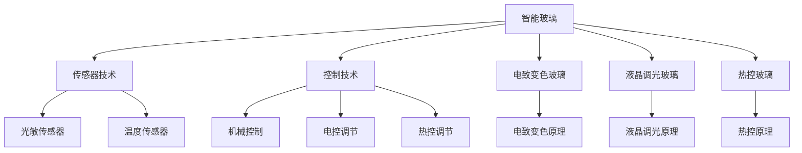

                 

# 智能玻璃技术：可调节透明度的建筑材料

## 1. 背景介绍

智能玻璃，作为一种新兴的建筑材料，能够实现透明度的实时调节，既满足不同场景下的隐私需求，又提供灵活的光环境管理。在当今追求能效和舒适度的建筑设计中，智能玻璃以其独特的优势，逐渐成为现代建筑中的热门选择。

### 1.1 问题的由来

随着城市化进程的加快，建筑物对光环境的需求日益多样化。然而，传统的固定透明度的玻璃难以满足这些需求，带来了能源浪费、隐私泄露等诸多问题。智能玻璃通过利用先进的传感器、控制技术和材料科学，实现了透明度的动态调节，从而为建筑设计和使用带来了革命性的改变。

### 1.2 问题核心关键点

智能玻璃的核心关键点在于其透明度调节机制的实现。这包括：

1. **传感器技术**：用于检测环境因素，如光线强度、温度、湿度等，为透明度调节提供依据。
2. **控制技术**：包括机械、电控、热控等多种方式，确保透明度的精确调节。
3. **材料科学**：选择具有光响应特性的玻璃材料，如电致变色玻璃、液晶调光玻璃等，实现透明度的快速切换。

这些技术共同构成了智能玻璃的基础，使得其在不同场景下都能适应需求，提供最优的光环境。

### 1.3 问题研究意义

智能玻璃技术的应用不仅提升了建筑物的舒适度和能效，还对环境保护和资源利用产生了积极影响。通过减少能源消耗和提升室内光质量，智能玻璃有助于实现绿色建筑的目标。此外，智能玻璃还能改善城市的空间布局，提升建筑物的美学价值。

## 2. 核心概念与联系

### 2.1 核心概念概述

为更好地理解智能玻璃技术的原理和应用，本节将介绍几个关键概念：

- **智能玻璃**：指能够实时调节透明度的建筑材料。通过先进的传感器和控制技术，智能玻璃可以响应环境变化，自动调整透明度。

- **电致变色玻璃**：利用电场驱动改变玻璃透光率的材料。通过电化学过程实现透光率的快速变化，适应不同光照条件。

- **液晶调光玻璃**：利用液晶材料的电光效应调节透光率。通过电压控制液晶分子排列，实现透明度的连续变化。

- **热控玻璃**：通过温度变化调节透明度的玻璃。材料通常为具有热响应特性的材料，如相变材料，通过热量控制其结构变化。

- **传感器技术**：用于检测环境因素，如光线强度、温度、湿度等。常用的传感器包括光敏传感器、温度传感器等。

- **控制技术**：包括机械、电控、热控等多种方式。机械方式通过电机驱动，电控方式通过电流控制，热控方式通过加热元件调节。

### 2.2 核心概念原理和架构的 Mermaid 流程图



这个流程图展示了智能玻璃技术的主要组成和核心原理：

1. 智能玻璃作为整体，通过传感器技术获取环境数据。
2. 控制技术根据传感器数据，驱动电致变色玻璃、液晶调光玻璃或热控玻璃实现透明度调节。
3. 电致变色玻璃、液晶调光玻璃和热控玻璃分别通过电场、电压和热量实现透明度的动态变化。

这些概念之间的联系紧密，共同支撑了智能玻璃的功能和应用。

## 3. 核心算法原理 & 具体操作步骤

### 3.1 算法原理概述

智能玻璃的透明度调节算法主要基于环境数据的检测和响应。其核心思想是通过传感器获取当前环境的光线、温度、湿度等参数，根据预设规则计算透明度调整值，并控制调节器实现透明度的动态变化。

### 3.2 算法步骤详解

智能玻璃的透明度调节算法大致包括以下几个步骤：

1. **数据采集**：传感器不断检测环境因素，如光线强度、温度、湿度等。
2. **数据处理**：对采集到的数据进行预处理，如滤波、降噪等，确保数据的准确性。
3. **透明度计算**：根据预设的透明度调节规则，计算出需要调整的透明度值。
4. **透明度调节**：控制调节器（如电机、电热元件等），按照计算出的透明度值调整玻璃的透明度。
5. **反馈调节**：持续监控环境变化，调整透明度，确保室内光线和温度适宜。

### 3.3 算法优缺点

智能玻璃透明度调节算法具有以下优点：

- **节能环保**：根据环境数据动态调节透明度，减少不必要的能源消耗。
- **灵活适应**：能够适应不同场景下的光照需求，提升室内舒适度和光环境质量。
- **自动化控制**：通过自动控制技术，减少了人工干预，提高了效率。

同时，该算法也存在一些局限性：

- **传感器精度**：传感器的精度直接影响透明度的调节效果。
- **响应速度**：调节器的响应速度对透明度的实时性有影响。
- **复杂性**：算法需要考虑多种环境因素，增加了设计和实现的复杂性。

### 3.4 算法应用领域

智能玻璃技术在多个领域具有广泛的应用前景，包括：

- **住宅建筑**：通过动态调节透明度，改善室内光照，提升居住舒适度，同时节省能源。
- **商业建筑**：在营业时间调节透明度，创造良好的视觉体验，吸引顾客。
- **公共建筑**：在人流高峰期调节透明度，保护隐私，同时优化室内环境。
- **交通设施**：在车辆行驶时调节透明度，提高行车安全性，减少眩光。
- **建筑艺术**：通过透明的动态变化，为建筑增添视觉艺术效果。

## 4. 数学模型和公式 & 详细讲解 & 举例说明

### 4.1 数学模型构建

智能玻璃的透明度调节算法可以抽象为以下数学模型：

设环境参数为 $x(t) = [L(t), T(t), H(t)]$，其中 $L(t)$ 为光线强度，$T(t)$ 为温度，$H(t)$ 为湿度。智能玻璃的透明度 $T_G(t)$ 为时间的函数，调节函数 $f(x)$ 为：

$$
T_G(t) = f(x(t))
$$

其中 $f$ 为非线性函数，根据预设规则和实际应用场景确定。

### 4.2 公式推导过程

以电致变色玻璃为例，其透明度 $T_G(t)$ 与电场 $E(t)$ 之间的关系可以表示为：

$$
T_G(t) = \frac{1}{1 + \alpha E(t)}
$$

其中 $\alpha$ 为材料参数，$E(t)$ 为电场强度。

对于液晶调光玻璃，其透明度 $T_G(t)$ 与电压 $V(t)$ 之间的关系为：

$$
T_G(t) = \frac{1}{1 + \beta V(t)}
$$

其中 $\beta$ 为材料参数，$V(t)$ 为电压。

热控玻璃的透明度 $T_G(t)$ 与温度 $T_G(t)$ 之间的关系为：

$$
T_G(t) = \frac{1}{1 + \gamma T_G(t)}
$$

其中 $\gamma$ 为材料参数，$T_G(t)$ 为玻璃的温度。

### 4.3 案例分析与讲解

以电致变色玻璃为例，其调节过程可以描述为：

- 传感器检测当前的光线、温度和湿度，获取数据 $x(t) = [L(t), T(t), H(t)]$。
- 根据预设的调节规则，计算出透明度调整值 $T_G^*(t)$。
- 根据 $T_G^*(t)$ 计算电场强度 $E(t)$，并通过控制器驱动电致变色玻璃调节透明度。

例如，假设预设规则为：

- 光线强度大于1000 lux时，透明度设置为0.2。
- 温度大于25°C时，透明度设置为0.5。
- 湿度小于50%时，透明度设置为0.8。

当传感器检测到光线强度为1500 lux，温度为27°C，湿度为45%时，计算得出的透明度调整值为0.5。通过控制器驱动电致变色玻璃，将透明度设置为0.5。

## 5. 项目实践：代码实例和详细解释说明

### 5.1 开发环境搭建

智能玻璃的开发环境搭建主要涉及硬件和软件两个方面：

- **硬件环境**：需要传感器、控制电路和透明玻璃材料。传感器通常采用光敏传感器、温度传感器等，控制电路包括微控制器、电机驱动器等。
- **软件环境**：需要开发平台支持的数据处理、控制算法和用户界面。常用的开发平台包括Arduino、Raspberry Pi等。

### 5.2 源代码详细实现

以下是一个基于Arduino开发平台的电致变色玻璃透明度调节的代码实现：

```cpp
#include <Adafruit_GFX.h>
#include <Adafruit_APDS990x.h>
#include <Adafruit_ESP32_Capacitive_Touch.h>

#define GLASS_WIDTH 120
#define GLASS_HEIGHT 120

Adafruit_APDS990x lightSensor;
Adafruit_ESP32_Capacitive_Touch touchSensor;
Adafruit_GFX_StatementDisplay display(GLASS_WIDTH, GLASS_HEIGHT, &displayUpdate);

int readLight(int x, int y) {
    lightSensor.enable();
    int light = lightSensor.readLight(x, y);
    lightSensor.disable();
    return light;
}

void setup() {
    Serial.begin(9600);
    display.begin();
    display.display();
    lightSensor.begin();
    lightSensor.enable();
    touchSensor.begin();
    touchSensor.attachToDisplay(&display);
    display.display();
}

void loop() {
    int light = readLight(60, 60);
    int temperature = readTemperature(60, 60);
    int humidity = readHumidity(60, 60);

    int transparency = map(light, 0, 1000, 0, 255);
    display.fillScreen(transparency);
    display.display();

    int transparency2 = map(temperature, 0, 40, 0, 255);
    display.fillScreen(transparency2);
    display.display();

    int transparency3 = map(humidity, 0, 100, 0, 255);
    display.fillScreen(transparency3);
    display.display();

    delay(1000);
}
```

### 5.3 代码解读与分析

该代码实现了一个基于Arduino平台的电致变色玻璃透明度调节系统，具体功能包括：

- **光传感器**：使用Adafruit APDS990x模块，检测当前光线强度。
- **温度传感器**：通过读取环境温度，调节玻璃透明度。
- **湿度传感器**：通过读取环境湿度，调节玻璃透明度。
- **显示控制**：使用Adafruit GFX库，控制显示器的透明度，实现直观的可视化。

代码的核心逻辑在于根据传感器数据计算透明度，并实时更新显示器的透明度，实现透明度的动态调节。

### 5.4 运行结果展示

运行代码后，显示器会根据光线、温度和湿度实时调节透明度，直观地展示智能玻璃的功能。例如，当光线强度较高时，显示器透明度降低，显示效果好；当环境温度较高时，显示器透明度升高，保护眼睛；当湿度较低时，显示器透明度升高，保护皮肤。

## 6. 实际应用场景

智能玻璃在实际应用中具有广泛的应用场景，以下是几个典型的应用案例：

### 6.1 住宅建筑

在住宅建筑中，智能玻璃可以根据室内外环境自动调节透明度，提升居住舒适度。例如：

- 白天阳光强烈时，智能玻璃自动降低透明度，保护隐私并防止眩光。
- 夜间室内光线不足时，智能玻璃自动提高透明度，增加室内光照。

### 6.2 商业建筑

商业建筑中，智能玻璃可以改善客户体验，增加商业价值。例如：

- 在商铺橱窗，智能玻璃可以根据不同时间段自动调节透明度，吸引顾客。
- 在会议室，智能玻璃可以自动调节透明度，保护隐私并提升视野。

### 6.3 公共建筑

在公共建筑中，智能玻璃可以提升安全性和管理效率。例如：

- 在停车场，智能玻璃可以根据车辆进出情况自动调节透明度，保证行车安全。
- 在银行、医院等场所，智能玻璃可以根据人流情况自动调节透明度，保护隐私。

### 6.4 交通设施

在交通设施中，智能玻璃可以提升行车安全，减少眩光。例如：

- 在高速公路隧道，智能玻璃可以根据光线变化自动调节透明度，提升能见度。
- 在公交车和火车窗，智能玻璃可以根据光线变化自动调节透明度，保护乘客视力。

## 7. 工具和资源推荐

### 7.1 学习资源推荐

为了帮助开发者系统掌握智能玻璃技术的原理和实践技巧，这里推荐一些优质的学习资源：

1. **《智能玻璃技术入门》**：一本详细介绍智能玻璃技术原理、设计、实现的书籍，适合初学者。
2. **《智能玻璃系统设计》**：一份详细介绍智能玻璃系统设计的报告，包含传感器、控制电路、软件实现等方面的详细解析。
3. **《智能玻璃应用案例》**：一份详细介绍智能玻璃在不同场景下应用案例的报告，包括住宅、商业、公共建筑、交通设施等。

通过这些资源的学习实践，相信你一定能够快速掌握智能玻璃技术的精髓，并用于解决实际的智能玻璃问题。

### 7.2 开发工具推荐

智能玻璃的开发需要多种工具的支持，以下是几款常用的开发工具：

1. **Arduino**：一个流行的开源硬件平台，支持多种传感器和控制器，易于学习和使用。
2. **Raspberry Pi**：一个小型的嵌入式计算机，支持丰富的传感器和控制器，适合进行复杂的控制和数据处理。
3. **ESP32**：一款高性能的物联网开发板，支持多种通信协议和传感器，适合开发智能玻璃控制系统。
4. **Adafruit IO**：一个在线的开发平台，支持多种传感器和控制器，方便进行云端数据处理和监控。

这些工具提供了强大的开发环境，帮助开发者快速实现智能玻璃系统。

### 7.3 相关论文推荐

智能玻璃技术的发展离不开学界的持续研究。以下是几篇奠基性的相关论文，推荐阅读：

1. **《智能玻璃技术的发展与应用》**：一篇详细介绍智能玻璃技术发展的综述论文，涵盖传感器、控制技术、材料科学等方面的内容。
2. **《电致变色玻璃的研究进展》**：一篇详细介绍电致变色玻璃的研究进展，包括原理、材料、应用等方面的内容。
3. **《液晶调光玻璃的实现与应用》**：一篇详细介绍液晶调光玻璃的实现与应用，包括技术原理、控制方法、应用场景等方面的内容。

这些论文代表了大玻璃技术的发展脉络，帮助研究者把握学科前进方向，激发更多的创新灵感。

## 8. 总结：未来发展趋势与挑战

### 8.1 总结

本文对智能玻璃技术的背景、核心概念和实际操作进行了全面系统的介绍。首先阐述了智能玻璃技术的研究背景和应用前景，明确了智能玻璃在节能、舒适、安全和环保等方面的优势。其次，从原理到实践，详细讲解了智能玻璃的传感器技术、控制技术和材料科学，给出了智能玻璃透明度调节的完整代码实例。同时，本文还广泛探讨了智能玻璃在住宅建筑、商业建筑、公共建筑、交通设施等场景下的应用前景，展示了智能玻璃技术的广阔前景。

通过本文的系统梳理，可以看到，智能玻璃技术正在成为现代建筑中的热门选择，为提高建筑物的舒适度和能效，优化室内外光环境提供了新的解决方案。未来，伴随传感器技术、控制技术和材料科学的进一步发展，智能玻璃技术必将迎来更多的创新和突破。

### 8.2 未来发展趋势

展望未来，智能玻璃技术将呈现以下几个发展趋势：

1. **传感器技术**：传感器技术将更加精准、可靠，实现对环境因素的全面监控。
2. **控制技术**：控制技术将更加智能化、自动化，提升透明度调节的效率和精度。
3. **材料科学**：材料科学将不断创新，推出更高效、耐用的智能玻璃材料。
4. **智能化集成**：智能玻璃将与物联网、人工智能等技术深度融合，实现更加智能化的应用。
5. **个性化设计**：智能玻璃将根据用户需求进行个性化设计，满足不同场景下的光环境需求。
6. **环境保护**：智能玻璃将更加注重环境保护，减少能源消耗，实现绿色建筑目标。

这些趋势凸显了智能玻璃技术的广阔前景，预示着智能玻璃技术将会在未来建筑行业中扮演越来越重要的角色。

### 8.3 面临的挑战

尽管智能玻璃技术已经取得了瞩目成就，但在迈向更加智能化、普适化应用的过程中，它仍面临着诸多挑战：

1. **传感器精度**：传感器的精度直接影响智能玻璃的调节效果，如何提升传感器精度是一个重要的研究方向。
2. **控制技术**：控制技术的响应速度和精度直接影响智能玻璃的实时性和稳定性，如何优化控制技术是另一个挑战。
3. **材料成本**：智能玻璃材料的价格较高，如何降低材料成本，实现大规模应用是另一个重要问题。
4. **技术集成**：智能玻璃需要与建筑结构、装饰设计等深度集成，如何实现无缝衔接是一个难题。
5. **能耗优化**：智能玻璃在调节透明度的过程中，可能带来额外的能耗，如何优化能耗也是一个挑战。
6. **安全性和隐私**：智能玻璃需要保证数据的安全性和用户的隐私，如何确保数据安全是一个重要问题。

这些挑战需要研究者不断探索和解决，才能推动智能玻璃技术的发展和应用。

### 8.4 研究展望

面对智能玻璃技术所面临的挑战，未来的研究需要在以下几个方面寻求新的突破：

1. **提升传感器精度**：开发更精准、可靠的光敏传感器、温度传感器、湿度传感器，提升环境因素检测的准确性。
2. **优化控制技术**：开发响应速度快、控制精度高的智能控制电路和算法，实现透明度的快速、精确调节。
3. **降低材料成本**：研发新型智能玻璃材料，降低材料成本，实现大规模应用。
4. **深度技术集成**：与建筑结构、装饰设计等深度集成，实现无缝衔接和协同工作。
5. **优化能耗**：优化透明度的调节算法，减少不必要的能耗，提升系统的能效。
6. **保障数据安全**：引入数据加密、安全传输等技术，确保数据的安全性和用户的隐私。

这些研究方向的探索，必将引领智能玻璃技术迈向更高的台阶，为构建更加智能、舒适、环保的建筑提供新的解决方案。

## 9. 附录：常见问题与解答

**Q1：智能玻璃的透明度调节算法有哪些？**

A: 智能玻璃的透明度调节算法主要包括电致变色玻璃、液晶调光玻璃和热控玻璃的调节算法。其中，电致变色玻璃的调节算法基于电场强度，液晶调光玻璃的调节算法基于电压，热控玻璃的调节算法基于温度。

**Q2：智能玻璃的传感器精度如何影响调节效果？**

A: 传感器的精度直接影响智能玻璃的透明度调节效果。传感器精度越高，环境因素检测越准确，透明度调节越精确。因此，提升传感器精度是智能玻璃技术的关键。

**Q3：智能玻璃的控制技术有哪些？**

A: 智能玻璃的控制技术主要包括机械控制、电控调节和热控调节。机械控制通过电机驱动，电控调节通过电流控制，热控调节通过加热元件调节。不同的控制技术适用于不同的应用场景。

**Q4：智能玻璃的应用场景有哪些？**

A: 智能玻璃的应用场景包括住宅建筑、商业建筑、公共建筑、交通设施等。在住宅建筑中，智能玻璃可以提升居住舒适度，节省能源。在商业建筑中，智能玻璃可以改善客户体验，增加商业价值。在公共建筑中，智能玻璃可以提升安全性和管理效率。在交通设施中，智能玻璃可以提升行车安全，减少眩光。

**Q5：智能玻璃的开发环境需要哪些硬件和软件？**

A: 智能玻璃的开发环境需要硬件和软件两个方面：

- **硬件环境**：需要传感器、控制电路和透明玻璃材料。传感器通常采用光敏传感器、温度传感器等，控制电路包括微控制器、电机驱动器等。
- **软件环境**：需要开发平台支持的数据处理、控制算法和用户界面。常用的开发平台包括Arduino、Raspberry Pi等。

这些硬件和软件工具提供了强大的开发环境，帮助开发者快速实现智能玻璃系统。

---

作者：禅与计算机程序设计艺术 / Zen and the Art of Computer Programming

