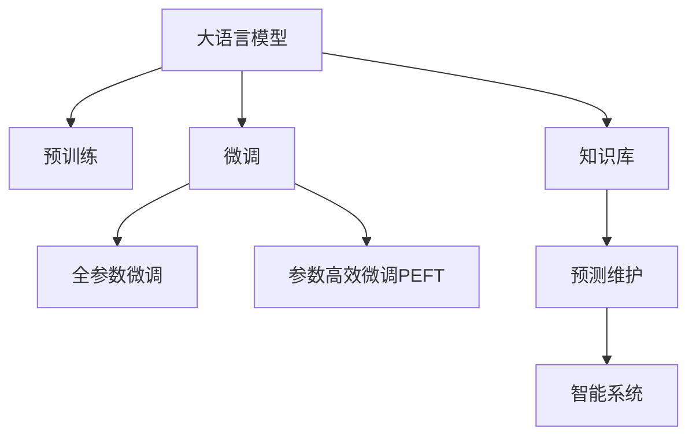

                 

# 智能质量控制：LLM在制造业中的应用

> 关键词：大语言模型(LLM),制造业,质量控制,智能制造,质量检测,缺陷检测,预测维护,智能系统

## 1. 背景介绍

### 1.1 问题由来

制造业作为国民经济的重要支柱，面临着日益激烈的市场竞争和不断变化的市场需求。传统制造业的质量控制流程依赖于人工巡检、统计分析和质量报告，效率低、成本高、误差大，难以满足现代智能制造对高效、精准、实时控制的需求。随着人工智能技术的快速发展，尤其是大语言模型(Large Language Model, LLM)在自然语言处理(Natural Language Processing, NLP)领域的突破性进展，为制造业的质量控制提供了新的思路和技术途径。

### 1.2 问题核心关键点

大语言模型在制造业质量控制中的应用，核心在于如何利用语言模型的语言理解和生成能力，自动化地处理与质量相关的各种信息，如生产日志、设备状态、产品缺陷、维护记录等，实现智能质量检测、缺陷预测和预测维护等功能。主要包括以下几个关键点：

1. **数据获取与预处理**：收集和整理高质量的数据，并进行有效的数据清洗和标注。
2. **模型训练与微调**：使用预训练的语言模型作为初始化参数，在特定的质量控制任务上进行微调。
3. **知识库构建**：整合领域知识和专家经验，构建适合特定行业的知识库。
4. **系统集成与部署**：将训练好的模型集成到智能制造系统中，实现自动化质量控制。

### 1.3 问题研究意义

大语言模型在制造业质量控制中的应用，具有以下重要意义：

1. **提升质量控制效率**：自动化的质量检测和缺陷预测，可以大幅度减少人工巡检和统计分析的工作量，提高质量控制效率。
2. **降低成本**：减少人工误判和人为误差，降低质量控制的成本。
3. **提高精准度**：利用语言模型的上下文理解能力，提高质量检测和缺陷预测的精准度。
4. **实现预测维护**：通过分析设备状态和生产日志，提前预测设备故障和产品缺陷，实现预测维护，避免意外停机和质量损失。
5. **推动智能化转型**：将质量控制与智能制造系统集成，推动制造业向智能制造转型，提升企业竞争力。

## 2. 核心概念与联系

### 2.1 核心概念概述

为更好地理解LLM在制造业质量控制中的应用，本节将介绍几个密切相关的核心概念：

- **大语言模型(Large Language Model, LLM)**：以自回归(如GPT)或自编码(如BERT)模型为代表的大规模预训练语言模型。通过在海量无标签文本数据上进行预训练，学习到丰富的语言知识和常识，具备强大的语言理解和生成能力。
- **预训练(Pre-training)**：指在大规模无标签文本语料上，通过自监督学习任务训练通用语言模型的过程。常见的预训练任务包括言语建模、掩码语言模型等。
- **微调(Fine-tuning)**：指在预训练模型的基础上，使用下游任务的少量标注数据，通过有监督学习优化模型在该任务上的性能。通常只需要调整顶层分类器或解码器，并以较小的学习率更新全部或部分的模型参数。
- **知识库(Knowledge Base)**：针对特定行业的专业知识、规则和规范，经过整理和整合，形成易于机器理解和应用的文档形式。
- **预测维护(Predictive Maintenance)**：通过分析设备状态和生产日志，提前预测设备故障和产品缺陷，避免意外停机和质量损失。
- **智能系统(Smart System)**：融合传感器数据、AI算法和大数据分析的智能化系统，实现自动化、实时化的质量控制和维护。

这些核心概念之间的逻辑关系可以通过以下Mermaid流程图来展示：



这个流程图展示了大语言模型的核心概念及其之间的关系：

1. 大语言模型通过预训练获得基础能力。
2. 微调是对预训练模型进行任务特定的优化，可以分为全参数微调和参数高效微调（PEFT）。
3. 知识库为模型提供行业背景知识，增强模型理解能力。
4. 预测维护利用模型进行设备故障预测和产品缺陷预测。
5. 智能系统将模型与传感器数据结合，实现自动化质量控制。

这些概念共同构成了LLM在制造业质量控制中的应用框架，使其能够在各种场景下发挥强大的语言理解和生成能力。通过理解这些核心概念，我们可以更好地把握LLM的应用前景和优化方向。

## 3. 核心算法原理 & 具体操作步骤

### 3.1 算法原理概述

基于LLM的制造业质量控制，本质上是一个有监督的细粒度迁移学习过程。其核心思想是：将预训练的LLM作为初始化参数，通过在特定的质量控制任务上进行微调，利用其语言理解和生成能力，自动化地处理和分析质量相关的各种信息，从而实现智能质量检测、缺陷预测和预测维护。

形式化地，假设预训练模型为 $M_{\theta}$，其中 $\theta$ 为预训练得到的模型参数。给定制造业质量控制任务 $T$ 的标注数据集 $D=\{(x_i, y_i)\}_{i=1}^N$，微调的目标是找到新的模型参数 $\hat{\theta}$，使得：

$$
\hat{\theta}=\mathop{\arg\min}_{\theta} \mathcal{L}(M_{\theta},D)
$$

其中 $\mathcal{L}$ 为针对任务 $T$ 设计的损失函数，用于衡量模型预测输出与真实标签之间的差异。常见的损失函数包括交叉熵损失、均方误差损失等。

通过梯度下降等优化算法，微调过程不断更新模型参数 $\theta$，最小化损失函数 $\mathcal{L}$，使得模型输出逼近真实标签。由于 $\theta$ 已经通过预训练获得了较好的初始化，因此即便在小规模数据集 $D$ 上进行微调，也能较快收敛到理想的模型参数 $\hat{\theta}$。

### 3.2 算法步骤详解

基于LLM的制造业质量控制一般包括以下几个关键步骤：

**Step 1: 准备预训练模型和数据集**
- 选择合适的预训练语言模型 $M_{\theta}$ 作为初始化参数，如 BERT、GPT 等。
- 准备制造业质量控制任务的标注数据集 $D$，划分为训练集、验证集和测试集。一般要求标注数据与预训练数据的分布不要差异过大。

**Step 2: 添加任务适配层**
- 根据任务类型，在预训练模型顶层设计合适的输出层和损失函数。
- 对于分类任务，通常在顶层添加线性分类器和交叉熵损失函数。
- 对于生成任务，通常使用语言模型的解码器输出概率分布，并以负对数似然为损失函数。

**Step 3: 设置微调超参数**
- 选择合适的优化算法及其参数，如 AdamW、SGD 等，设置学习率、批大小、迭代轮数等。
- 设置正则化技术及强度，包括权重衰减、Dropout、Early Stopping 等。
- 确定冻结预训练参数的策略，如仅微调顶层，或全部参数都参与微调。

**Step 4: 执行梯度训练**
- 将训练集数据分批次输入模型，前向传播计算损失函数。
- 反向传播计算参数梯度，根据设定的优化算法和学习率更新模型参数。
- 周期性在验证集上评估模型性能，根据性能指标决定是否触发 Early Stopping。
- 重复上述步骤直到满足预设的迭代轮数或 Early Stopping 条件。

**Step 5: 测试和部署**
- 在测试集上评估微调后模型 $M_{\hat{\theta}}$ 的性能，对比微调前后的精度提升。
- 使用微调后的模型对新样本进行推理预测，集成到智能制造系统中。
- 持续收集新的数据，定期重新微调模型，以适应数据分布的变化。

以上是基于LLM的制造业质量控制的一般流程。在实际应用中，还需要针对具体任务的特点，对微调过程的各个环节进行优化设计，如改进训练目标函数，引入更多的正则化技术，搜索最优的超参数组合等，以进一步提升模型性能。

### 3.3 算法优缺点

基于LLM的制造业质量控制方法具有以下优点：
1. **自动化程度高**：利用LLM的语言处理能力，可以自动化地处理和分析质量相关的各种信息，大幅减少人工工作量。
2. **泛化能力强**：LLM在处理自然语言时具有较强的泛化能力，能够处理多种复杂的场景和任务。
3. **动态适应**：通过持续微调，LLM可以动态适应不同的生产环境和数据分布，保持高效稳定的运行。
4. **低成本高效率**：相对于传统人工巡检和质量报告，LLM的质量控制成本低，效率高。

同时，该方法也存在一定的局限性：
1. **依赖高质量数据**：微调效果很大程度上取决于标注数据的质量和数量，获取高质量标注数据的成本较高。
2. **需要持续维护**：由于生产环境的变化，LLM需要定期进行微调，以保持模型的有效性。
3. **模型鲁棒性有限**：面对异常情况或噪声数据，LLM可能出现误判，影响质量控制的准确性。
4. **可解释性不足**：LLM的决策过程通常缺乏可解释性，难以对其推理逻辑进行分析和调试。

尽管存在这些局限性，但就目前而言，基于LLM的质量控制方法仍是大规模制造业自动化和智能化的重要手段。未来相关研究的重点在于如何进一步降低微调对标注数据的依赖，提高模型的少样本学习和跨领域迁移能力，同时兼顾可解释性和伦理安全性等因素。

### 3.4 算法应用领域

基于LLM的制造业质量控制方法在制造业的各个环节都有广泛的应用，例如：

- **生产监控**：通过分析设备状态和生产日志，实现实时监控和预警，及时发现设备异常和生产问题。
- **质量检测**：利用视觉传感器和LLM，自动识别产品表面缺陷，实现自动化质量检测。
- **工艺优化**：通过分析生产数据和专家知识，优化工艺流程，提高生产效率和产品质量。
- **预测维护**：利用设备状态和生产日志，预测设备故障和产品缺陷，实现预测维护，避免意外停机和质量损失。
- **质量报告**：自动分析质量检测结果，生成详细的质量报告，辅助管理者进行决策。

除了上述这些经典应用外，基于LLM的质量控制方法也被创新性地应用到更多场景中，如供应链管理、物流调度、供应链金融等，为制造业的数字化和智能化转型提供了新的技术路径。

## 4. 数学模型和公式 & 详细讲解

### 4.1 数学模型构建

本节将使用数学语言对基于LLM的制造业质量控制过程进行更加严格的刻画。

记预训练语言模型为 $M_{\theta}$，其中 $\theta$ 为预训练得到的模型参数。假设质量控制任务为 $T$ 的标注数据集为 $D=\{(x_i,y_i)\}_{i=1}^N, x_i \in \mathcal{X}, y_i \in \mathcal{Y}$。其中，$\mathcal{X}$ 为输入空间，$\mathcal{Y}$ 为输出空间。

定义模型 $M_{\theta}$ 在输入 $x$ 上的输出为 $\hat{y}=M_{\theta}(x) \in [0,1]$，表示样本属于某一质量状态的置信度。假设 $y_i \in \{0,1\}$，表示样本的真实质量状态。则二分类交叉熵损失函数定义为：

$$
\ell(M_{\theta}(x),y) = -[y\log \hat{y} + (1-y)\log (1-\hat{y})]
$$

将其代入经验风险公式，得：

$$
\mathcal{L}(\theta) = -\frac{1}{N}\sum_{i=1}^N [y_i\log M_{\theta}(x_i)+(1-y_i)\log(1-M_{\theta}(x_i))]
$$

在得到损失函数的梯度后，即可带入参数更新公式，完成模型的迭代优化。重复上述过程直至收敛，最终得到适应质量控制任务的最优模型参数 $\theta^*$。

### 4.2 公式推导过程

以下我们以质量检测任务为例，推导交叉熵损失函数及其梯度的计算公式。

假设模型 $M_{\theta}$ 在输入 $x$ 上的输出为 $\hat{y}=M_{\theta}(x) \in [0,1]$，表示样本属于某一质量状态的置信度。真实标签 $y \in \{0,1\}$。则二分类交叉熵损失函数定义为：

$$
\ell(M_{\theta}(x),y) = -[y\log \hat{y} + (1-y)\log (1-\hat{y})]
$$

将其代入经验风险公式，得：

$$
\mathcal{L}(\theta) = -\frac{1}{N}\sum_{i=1}^N [y_i\log M_{\theta}(x_i)+(1-y_i)\log(1-M_{\theta}(x_i))]
$$

根据链式法则，损失函数对参数 $\theta_k$ 的梯度为：

$$
\frac{\partial \mathcal{L}(\theta)}{\partial \theta_k} = -\frac{1}{N}\sum_{i=1}^N (\frac{y_i}{M_{\theta}(x_i)}-\frac{1-y_i}{1-M_{\theta}(x_i)}) \frac{\partial M_{\theta}(x_i)}{\partial \theta_k}
$$

其中 $\frac{\partial M_{\theta}(x_i)}{\partial \theta_k}$ 可进一步递归展开，利用自动微分技术完成计算。

在得到损失函数的梯度后，即可带入参数更新公式，完成模型的迭代优化。重复上述过程直至收敛，最终得到适应质量控制任务的最优模型参数 $\theta^*$。

## 5. 项目实践：代码实例和详细解释说明

### 5.1 开发环境搭建

在进行质量控制实践前，我们需要准备好开发环境。以下是使用Python进行PyTorch开发的环境配置流程：

1. 安装Anaconda：从官网下载并安装Anaconda，用于创建独立的Python环境。

2. 创建并激活虚拟环境：
```bash
conda create -n pytorch-env python=3.8 
conda activate pytorch-env
```

3. 安装PyTorch：根据CUDA版本，从官网获取对应的安装命令。例如：
```bash
conda install pytorch torchvision torchaudio cudatoolkit=11.1 -c pytorch -c conda-forge
```

4. 安装Transformers库：
```bash
pip install transformers
```

5. 安装各类工具包：
```bash
pip install numpy pandas scikit-learn matplotlib tqdm jupyter notebook ipython
```

完成上述步骤后，即可在`pytorch-env`环境中开始质量控制实践。

### 5.2 源代码详细实现

下面我们以质量检测任务为例，给出使用Transformers库对BERT模型进行质量检测的PyTorch代码实现。

首先，定义质量检测任务的数据处理函数：

```python
from transformers import BertTokenizer
from torch.utils.data import Dataset
import torch

class QualityDetectionDataset(Dataset):
    def __init__(self, images, labels, tokenizer, max_len=128):
        self.images = images
        self.labels = labels
        self.tokenizer = tokenizer
        self.max_len = max_len
        
    def __len__(self):
        return len(self.images)
    
    def __getitem__(self, item):
        image = self.images[item]
        label = self.labels[item]
        
        encoding = self.tokenizer(image, return_tensors='pt', max_length=self.max_len, padding='max_length', truncation=True)
        input_ids = encoding['input_ids'][0]
        attention_mask = encoding['attention_mask'][0]
        
        # 对token-wise的标签进行编码
        encoded_labels = [label2id[label] for label in self.labels] 
        encoded_labels.extend([label2id['negative']] * (self.max_len - len(encoded_labels)))
        labels = torch.tensor(encoded_labels, dtype=torch.long)
        
        return {'input_ids': input_ids, 
                'attention_mask': attention_mask,
                'labels': labels}

# 标签与id的映射
label2id = {'positive': 1, 'negative': 0}
id2label = {v: k for k, v in label2id.items()}

# 创建dataset
tokenizer = BertTokenizer.from_pretrained('bert-base-cased')

train_dataset = QualityDetectionDataset(train_images, train_labels, tokenizer)
dev_dataset = QualityDetectionDataset(dev_images, dev_labels, tokenizer)
test_dataset = QualityDetectionDataset(test_images, test_labels, tokenizer)
```

然后，定义模型和优化器：

```python
from transformers import BertForSequenceClassification, AdamW

model = BertForSequenceClassification.from_pretrained('bert-base-cased', num_labels=len(label2id))

optimizer = AdamW(model.parameters(), lr=2e-5)
```

接着，定义训练和评估函数：

```python
from torch.utils.data import DataLoader
from tqdm import tqdm
from sklearn.metrics import classification_report

device = torch.device('cuda') if torch.cuda.is_available() else torch.device('cpu')
model.to(device)

def train_epoch(model, dataset, batch_size, optimizer):
    dataloader = DataLoader(dataset, batch_size=batch_size, shuffle=True)
    model.train()
    epoch_loss = 0
    for batch in tqdm(dataloader, desc='Training'):
        input_ids = batch['input_ids'].to(device)
        attention_mask = batch['attention_mask'].to(device)
        labels = batch['labels'].to(device)
        model.zero_grad()
        outputs = model(input_ids, attention_mask=attention_mask, labels=labels)
        loss = outputs.loss
        epoch_loss += loss.item()
        loss.backward()
        optimizer.step()
    return epoch_loss / len(dataloader)

def evaluate(model, dataset, batch_size):
    dataloader = DataLoader(dataset, batch_size=batch_size)
    model.eval()
    preds, labels = [], []
    with torch.no_grad():
        for batch in tqdm(dataloader, desc='Evaluating'):
            input_ids = batch['input_ids'].to(device)
            attention_mask = batch['attention_mask'].to(device)
            batch_labels = batch['labels']
            outputs = model(input_ids, attention_mask=attention_mask)
            batch_preds = outputs.logits.argmax(dim=2).to('cpu').tolist()
            batch_labels = batch_labels.to('cpu').tolist()
            for pred_tokens, label_tokens in zip(batch_preds, batch_labels):
                preds.append(pred_tokens[:len(label_tokens)])
                labels.append(label_tokens)
                
    print(classification_report(labels, preds))
```

最后，启动训练流程并在测试集上评估：

```python
epochs = 5
batch_size = 16

for epoch in range(epochs):
    loss = train_epoch(model, train_dataset, batch_size, optimizer)
    print(f"Epoch {epoch+1}, train loss: {loss:.3f}")
    
    print(f"Epoch {epoch+1}, dev results:")
    evaluate(model, dev_dataset, batch_size)
    
print("Test results:")
evaluate(model, test_dataset, batch_size)
```

以上就是使用PyTorch对BERT进行质量检测任务微调的完整代码实现。可以看到，得益于Transformers库的强大封装，我们可以用相对简洁的代码完成BERT模型的加载和微调。

### 5.3 代码解读与分析

让我们再详细解读一下关键代码的实现细节：

**QualityDetectionDataset类**：
- `__init__`方法：初始化图像、标签、分词器等关键组件。
- `__len__`方法：返回数据集的样本数量。
- `__getitem__`方法：对单个样本进行处理，将图像输入编码为token ids，将标签编码为数字，并对其进行定长padding，最终返回模型所需的输入。

**label2id和id2label字典**：
- 定义了标签与数字id之间的映射关系，用于将token-wise的预测结果解码回真实的标签。

**训练和评估函数**：
- 使用PyTorch的DataLoader对数据集进行批次化加载，供模型训练和推理使用。
- 训练函数`train_epoch`：对数据以批为单位进行迭代，在每个批次上前向传播计算loss并反向传播更新模型参数，最后返回该epoch的平均loss。
- 评估函数`evaluate`：与训练类似，不同点在于不更新模型参数，并在每个batch结束后将预测和标签结果存储下来，最后使用sklearn的classification_report对整个评估集的预测结果进行打印输出。

**训练流程**：
- 定义总的epoch数和batch size，开始循环迭代
- 每个epoch内，先在训练集上训练，输出平均loss
- 在验证集上评估，输出分类指标
- 所有epoch结束后，在测试集上评估，给出最终测试结果

可以看到，PyTorch配合Transformers库使得BERT微调的质量检测任务代码实现变得简洁高效。开发者可以将更多精力放在数据处理、模型改进等高层逻辑上，而不必过多关注底层的实现细节。

当然，工业级的系统实现还需考虑更多因素，如模型的保存和部署、超参数的自动搜索、更灵活的任务适配层等。但核心的微调范式基本与此类似。

## 6. 实际应用场景

### 6.1 智能制造系统

基于LLM的智能制造系统，可以实现对生产线的全流程监控和质量控制。传统的制造系统依赖人工巡检和质量报告，效率低、误差大。而智能制造系统通过将LLM集成到系统中，可以实现自动化质量检测和缺陷预测，及时发现问题并进行预警，显著提升生产效率和产品质量。

在技术实现上，可以部署高精度的视觉传感器，对生产线上关键设备的运行状态进行实时监控，同时收集生产日志、设备状态等数据。通过这些数据，LLM可以学习到不同设备运行状态与产品缺陷之间的关系，自动检测和预测潜在的质量问题。系统还可以根据检测结果，自动生成质量报告，辅助管理者进行决策和优化。

### 6.2 预测维护

预测维护是智能制造中重要的环节，通过提前预测设备故障和产品缺陷，可以有效避免意外停机和质量损失。传统的预测维护依赖专家经验和手工分析，而LLM可以通过分析设备状态和生产日志，自动预测设备故障和产品缺陷，实现预测维护。

具体而言，可以收集设备状态数据、生产日志、维护记录等，构建领域知识库，作为LLM的输入。通过训练，LLM可以学习到不同生产条件下的设备状态与故障之间的关系，以及不同工艺条件下的产品缺陷与参数之间的关系。在实际生产中，系统实时监测设备状态和生产参数，LLM根据当前条件预测设备故障和产品缺陷的概率，及时发出预警信号，进行相应的维护和调整，确保生产稳定。

### 6.3 质量报告生成

质量报告是制造企业质量管理的必备环节，传统的质量报告生成依赖人工统计和分析，费时费力且容易出错。基于LLM的质量报告生成系统可以自动分析质量检测结果，生成详细的质量报告，提升质量管理的效率和精度。

在实际应用中，可以部署视觉传感器对产品表面进行全面检测，获取高精度的图像数据。通过图像处理技术，将图像转换为文本数据，输入LLM进行分析。LLM可以根据检测结果，自动分类和统计不同质量状态的产品数量，生成详细的质量报告，包括缺陷类型、数量、严重程度等信息。质量报告可以实时更新，确保管理者能够快速获取最新的质量状况。

### 6.4 未来应用展望

随着LLM和微调方法的不断发展，基于微调的智能质量控制技术将呈现以下几个发展趋势：

1. **多模态融合**：将视觉、听觉、触觉等多模态数据结合，提升质量检测的准确性和鲁棒性。
2. **因果推理**：通过引入因果推理技术，提升LLM的因果关系建模能力，增强预测维护的准确性。
3. **跨领域迁移**：将LLM应用于不同行业和领域，实现跨领域知识迁移，提升系统的通用性。
4. **自动化知识更新**：利用机器学习算法，动态更新知识库，增强系统的自我学习能力和适应能力。
5. **实时系统**：将LLM与实时控制系统结合，实现自动化质量检测和动态调整，提升生产效率和产品质量。

以上趋势凸显了LLM在制造业质量控制中的广阔应用前景。这些方向的探索发展，必将进一步提升智能制造系统的性能和应用范围，为制造业的数字化和智能化转型提供新的技术路径。

## 7. 工具和资源推荐

### 7.1 学习资源推荐

为了帮助开发者系统掌握LLM在制造业质量控制中的应用，这里推荐一些优质的学习资源：

1. 《Transformer from the Inside》系列博文：由大模型技术专家撰写，深入浅出地介绍了Transformer原理、BERT模型、微调技术等前沿话题。

2. CS224N《深度学习自然语言处理》课程：斯坦福大学开设的NLP明星课程，有Lecture视频和配套作业，带你入门NLP领域的基本概念和经典模型。

3. 《Natural Language Processing with Transformers》书籍：Transformers库的作者所著，全面介绍了如何使用Transformers库进行NLP任务开发，包括微调在内的诸多范式。

4. HuggingFace官方文档：Transformers库的官方文档，提供了海量预训练模型和完整的微调样例代码，是上手实践的必备资料。

5. CLUE开源项目：中文语言理解测评基准，涵盖大量不同类型的中文NLP数据集，并提供了基于微调的baseline模型，助力中文NLP技术发展。

通过对这些资源的学习实践，相信你一定能够快速掌握LLM在制造业质量控制中的应用，并用于解决实际的NLP问题。

### 7.2 开发工具推荐

高效的开发离不开优秀的工具支持。以下是几款用于LLM质量控制开发的常用工具：

1. PyTorch：基于Python的开源深度学习框架，灵活动态的计算图，适合快速迭代研究。大部分预训练语言模型都有PyTorch版本的实现。

2. TensorFlow：由Google主导开发的开源深度学习框架，生产部署方便，适合大规模工程应用。同样有丰富的预训练语言模型资源。

3. Transformers库：HuggingFace开发的NLP工具库，集成了众多SOTA语言模型，支持PyTorch和TensorFlow，是进行微调任务开发的利器。

4. Weights & Biases：模型训练的实验跟踪工具，可以记录和可视化模型训练过程中的各项指标，方便对比和调优。与主流深度学习框架无缝集成。

5. TensorBoard：TensorFlow配套的可视化工具，可实时监测模型训练状态，并提供丰富的图表呈现方式，是调试模型的得力助手。

6. Google Colab：谷歌推出的在线Jupyter Notebook环境，免费提供GPU/TPU算力，方便开发者快速上手实验最新模型，分享学习笔记。

合理利用这些工具，可以显著提升LLM质量控制任务的开发效率，加快创新迭代的步伐。

### 7.3 相关论文推荐

LLM在制造业质量控制中的应用源于学界的持续研究。以下是几篇奠基性的相关论文，推荐阅读：

1. Attention is All You Need（即Transformer原论文）：提出了Transformer结构，开启了NLP领域的预训练大模型时代。

2. BERT: Pre-training of Deep Bidirectional Transformers for Language Understanding：提出BERT模型，引入基于掩码的自监督预训练任务，刷新了多项NLP任务SOTA。

3. Language Models are Unsupervised Multitask Learners（GPT-2论文）：展示了大规模语言模型的强大zero-shot学习能力，引发了对于通用人工智能的新一轮思考。

4. Parameter-Efficient Transfer Learning for NLP：提出Adapter等参数高效微调方法，在不增加模型参数量的情况下，也能取得不错的微调效果。

5. Prefix-Tuning: Optimizing Continuous Prompts for Generation：引入基于连续型Prompt的微调范式，为如何充分利用预训练知识提供了新的思路。

6. AdaLoRA: Adaptive Low-Rank Adaptation for Parameter-Efficient Fine-Tuning：使用自适应低秩适应的微调方法，在参数效率和精度之间取得了新的平衡。

这些论文代表了大语言模型微调技术的发展脉络。通过学习这些前沿成果，可以帮助研究者把握学科前进方向，激发更多的创新灵感。

## 8. 总结：未来发展趋势与挑战

### 8.1 总结

本文对基于LLM的制造业质量控制方法进行了全面系统的介绍。首先阐述了LLM在制造业质量控制中的研究背景和意义，明确了LLM在处理自然语言时的独特优势和应用潜力。其次，从原理到实践，详细讲解了LLM在质量控制任务上的微调过程，给出了质量检测任务的完整代码实例。同时，本文还广泛探讨了LLM在智能制造、预测维护、质量报告生成等多个场景中的应用前景，展示了LLM的广泛适用性和巨大潜力。此外，本文精选了LLM在制造业质量控制中的各类学习资源，力求为读者提供全方位的技术指引。

通过本文的系统梳理，可以看到，基于LLM的质量控制方法正在成为智能制造中的重要手段，极大地提升了质量检测和预测维护的效率和精度。未来，伴随LLM和微调方法的持续演进，相信智能质量控制技术将进一步提升制造企业的竞争力，为制造业的数字化和智能化转型提供新的技术路径。

### 8.2 未来发展趋势

展望未来，LLM在制造业质量控制中的应用将呈现以下几个发展趋势：

1. **多模态融合**：将视觉、听觉、触觉等多模态数据结合，提升质量检测的准确性和鲁棒性。
2. **因果推理**：通过引入因果推理技术，提升LLM的因果关系建模能力，增强预测维护的准确性。
3. **跨领域迁移**：将LLM应用于不同行业和领域，实现跨领域知识迁移，提升系统的通用性。
4. **自动化知识更新**：利用机器学习算法，动态更新知识库，增强系统的自我学习能力和适应能力。
5. **实时系统**：将LLM与实时控制系统结合，实现自动化质量检测和动态调整，提升生产效率和产品质量。

以上趋势凸显了LLM在制造业质量控制中的广阔应用前景。这些方向的探索发展，必将进一步提升智能制造系统的性能和应用范围，为制造业的数字化和智能化转型提供新的技术路径。

### 8.3 面临的挑战

尽管LLM在制造业质量控制中已经取得了瞩目成就，但在迈向更加智能化、普适化应用的过程中，它仍面临着诸多挑战：

1. **标注成本瓶颈**：尽管微调效果很大程度上取决于标注数据的质量和数量，但获取高质量标注数据的成本较高。如何进一步降低微调对标注样本的依赖，将是一大难题。
2. **模型鲁棒性不足**：面对异常情况或噪声数据，LLM可能出现误判，影响质量控制的准确性。如何提高LLM的鲁棒性，避免灾难性遗忘，还需要更多理论和实践的积累。
3. **推理效率有待提高**：大规模语言模型虽然精度高，但在实际部署时往往面临推理速度慢、内存占用大等效率问题。如何在保证性能的同时，简化模型结构，提升推理速度，优化资源占用，将是重要的优化方向。
4. **可解释性亟需加强**：LLM的决策过程通常缺乏可解释性，难以对其推理逻辑进行分析和调试。对于医疗、金融等高风险应用，算法的可解释性和可审计性尤为重要。如何赋予LLM更强的可解释性，将是亟待攻克的难题。
5. **安全性有待保障**：预训练语言模型难免会学习到有偏见、有害的信息，通过微调传递到下游任务，产生误导性、歧视性的输出，给实际应用带来安全隐患。如何从数据和算法层面消除模型偏见，避免恶意用途，确保输出的安全性，也将是重要的研究课题。

尽管存在这些挑战，但就目前而言，基于LLM的质量控制方法仍是大规模制造业自动化和智能化的重要手段。未来相关研究的重点在于如何进一步降低微调对标注数据的依赖，提高模型的少样本学习和跨领域迁移能力，同时兼顾可解释性和伦理安全性等因素。

### 8.4 研究展望

面对LLM在制造业质量控制所面临的种种挑战，未来的研究需要在以下几个方面寻求新的突破：

1. **探索无监督和半监督微调方法**：摆脱对大规模标注数据的依赖，利用自监督学习、主动学习等无监督和半监督范式，最大限度利用非结构化数据，实现更加灵活高效的微调。
2. **研究参数高效和计算高效的微调范式**：开发更加参数高效的微调方法，在固定大部分预训练参数的同时，只更新极少量的任务相关参数。同时优化微调模型的计算图，减少前向传播和反向传播的资源消耗，实现更加轻量级、实时性的部署。
3. **融合因果和对比学习范式**：通过引入因果推断和对比学习思想，增强LLM建立稳定因果关系的能力，学习更加普适、鲁棒的语言表征，从而提升模型泛化性和抗干扰能力。
4. **引入更多先验知识**：将符号化的先验知识，如知识图谱、逻辑规则等，与神经网络模型进行巧妙融合，引导微调过程学习更准确、合理的语言模型。同时加强不同模态数据的整合，实现视觉、语音等多模态信息与文本信息的协同建模。
5. **结合因果分析和博弈论工具**：将因果分析方法引入LLM，识别出模型决策的关键特征，增强输出解释的因果性和逻辑性。借助博弈论工具刻画人机交互过程，主动探索并规避模型的脆弱点，提高系统稳定性。
6. **纳入伦理道德约束**：在模型训练目标中引入伦理导向的评估指标，过滤和惩罚有偏见、有害的输出倾向。同时加强人工干预和审核，建立模型行为的监管机制，确保输出符合人类价值观和伦理道德。

这些研究方向的探索，必将引领LLM在制造业质量控制技术迈向更高的台阶，为构建安全、可靠、可解释、可控的智能系统铺平道路。面向未来，LLM在制造业质量控制技术还需要与其他人工智能技术进行更深入的融合，如知识表示、因果推理、强化学习等，多路径协同发力，共同推动智能质量控制系统的进步。只有勇于创新、敢于突破，才能不断拓展LLM的边界，让智能技术更好地造福制造业。

## 9. 附录：常见问题与解答

**Q1：如何选择合适的预训练语言模型？**

A: 选择合适的预训练语言模型需要考虑以下因素：
1. **数据规模**：数据规模越大，模型的泛化能力越强，但计算资源需求也越大。
2. **任务类型**：不同任务对模型的语言处理能力有不同的要求。例如，分类任务适合使用BERT等，而生成任务适合使用GPT等。
3. **计算资源**：计算资源丰富的环境可以使用更大规模的模型，计算资源有限的环境则应选择规模较小的模型。

**Q2：微调过程中如何避免过拟合？**

A: 避免过拟合的方法包括：
1. **数据增强**：通过回译、近义替换等方式扩充训练集。
2. **正则化**：使用L2正则、Dropout等正则化技术。
3. **早停机制**：在验证集上监测模型性能，达到预设阈值时停止训练。
4. **参数高效微调**：只更新少数参数，减少过拟合风险。
5. **迁移学习**：在新的任务上微调部分预训练参数，避免过拟合。

**Q3：微调过程中如何优化超参数？**

A: 优化超参数的方法包括：
1. **网格搜索**：在给定的超参数范围内，穷举所有可能的组合，选择性能最好的一组。
2. **随机搜索**：在给定的超参数范围内，随机选择若干组合进行训练，选择性能最好的一组。
3. **贝叶斯优化**：通过评估先前的模型性能，动态调整超参数搜索策略，快速找到最优参数。
4. **超参数调优工具**：使用如Hyperopt、Optuna等工具，自动化地优化超参数。

**Q4：如何提高LLM的质量检测精度？**

A: 提高LLM质量检测精度的方法包括：
1. **数据质量提升**：获取更多高质量的数据，并进行数据清洗和标注。
2. **模型优化**：选择适合的模型架构和优化算法，并进行参数调优。
3. **多模态融合**：结合视觉、听觉等多模态数据，提高检测精度。
4. **知识库融合**：将行业知识、规则等整合到模型中，提升检测能力。
5. **对抗训练**：引入对抗样本，提高模型的鲁棒性。

**Q5：LLM在预测维护中的应用有哪些？**

A: LLM在预测维护中的应用包括：
1. **设备状态监测**：通过分析设备状态数据，预测设备故障。
2. **生产参数分析**：通过分析生产参数，预测产品缺陷。
3. **异常检测**：通过异常检测技术，及时发现潜在问题。
4. **实时预警**：根据检测结果，及时发出预警信号，进行相应的维护和调整。
5. **故障诊断**：通过专家知识库，诊断故障原因，提供解决方案。

---

作者：禅与计算机程序设计艺术 / Zen and the Art of Computer Programming

