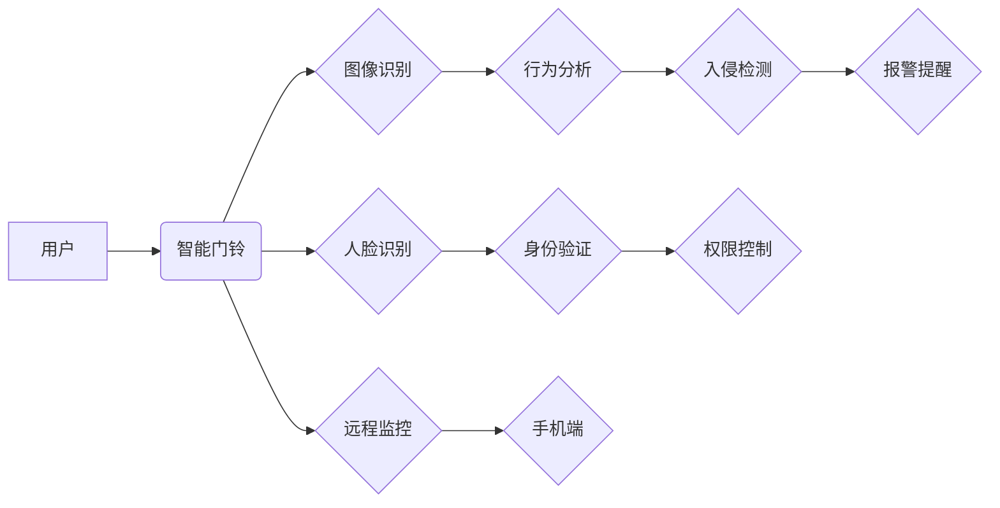

                 

## 智能门铃的安防管理与注意力经济

> 关键词：智能门铃、安防管理、注意力经济、计算机视觉、深度学习、人脸识别、入侵检测、隐私保护

## 1. 背景介绍

随着物联网技术的快速发展，智能家居已成为现代生活的重要组成部分。其中，智能门铃作为连接家庭安全与便捷生活的桥梁，凭借其强大的功能和应用场景，逐渐成为智能家居必备的设备之一。智能门铃不仅能够远程查看访客情况，还能实现语音对讲、报警提醒等功能，有效提升了家庭安全防护水平。

然而，随着智能门铃功能的不断增强，其所带来的数据安全和隐私保护问题也日益凸显。一方面，智能门铃收集了大量用户图像、语音和行为数据，这些数据一旦泄露，将可能导致严重的安全风险和隐私侵犯。另一方面，智能门铃的安防管理功能也面临着挑战，例如，如何有效识别入侵者，如何避免误报，如何平衡安全性和用户体验等。

## 2. 核心概念与联系

**2.1  注意力经济**

注意力经济是指在信息爆炸的时代，人们对信息的获取和处理能力有限，而注意力成为了稀缺资源。因此，如何有效地获取和利用用户注意力成为了企业和产品的重要竞争力。智能门铃作为一种连接用户和外部世界的设备，需要在有限的注意力时间内，有效地传递信息，并引导用户进行相应的操作。

**2.2  安防管理**

安防管理是指通过技术手段，保障人员、财产和信息安全。智能门铃的安防管理功能主要包括：

* **入侵检测:** 通过图像识别、行为分析等技术，识别潜在的入侵行为，并及时发出报警提醒。
* **人脸识别:** 通过人脸识别技术，识别访客身份，并进行相应的权限控制。
* **远程监控:** 用户可以通过手机或其他设备，远程查看门铃摄像头画面，实时了解门前情况。

**2.3  核心概念联系**

智能门铃的安防管理功能需要与注意力经济相结合，才能有效地提升用户体验和安全保障水平。

* **精准推送:** 智能门铃需要根据用户的行为习惯和需求，精准推送重要的信息，避免信息过载，分散用户注意力。
* **个性化定制:** 智能门铃可以根据用户的安全需求，提供个性化的安防方案，例如，设置不同的访客权限、报警方式等。
* **交互式体验:** 智能门铃可以提供更丰富的交互方式，例如，语音对讲、视频通话等，增强用户参与感，提升安全意识。

**2.4  架构图**



## 3. 核心算法原理 & 具体操作步骤

### 3.1  算法原理概述

智能门铃的安防管理功能主要依赖于计算机视觉和深度学习算法。

* **图像识别:** 利用卷积神经网络（CNN）等算法，识别图像中的目标，例如人脸、车辆、物体等。
* **行为分析:** 通过分析图像序列，识别目标的行为模式，例如行走、停留、开门等。
* **入侵检测:** 基于图像识别和行为分析的结果，判断是否发生入侵行为，并发出报警提醒。

### 3.2  算法步骤详解

**3.2.1  图像采集:** 智能门铃摄像头采集门前图像数据。

**3.2.2  图像预处理:** 对采集到的图像进行预处理，例如调整亮度、对比度、去除噪声等，以提高算法的识别精度。

**3.2.3  目标检测:** 利用CNN算法，从预处理后的图像中检测出目标，例如人脸、车辆等。

**3.2.4  行为分析:** 对目标的运动轨迹和行为模式进行分析，识别潜在的入侵行为。

**3.2.5  入侵检测:** 根据目标检测和行为分析的结果，判断是否发生入侵行为，并触发相应的报警机制。

### 3.3  算法优缺点

**优点:**

* **高识别精度:** 深度学习算法能够实现高精度的目标识别和行为分析。
* **实时性强:** 智能门铃的安防管理功能能够实时监测门前情况，及时发现入侵行为。
* **可定制性强:** 可以根据用户的安全需求，定制不同的安防方案。

**缺点:**

* **计算资源需求高:** 深度学习算法需要大量的计算资源，对硬件性能要求较高。
* **数据依赖性强:** 深度学习算法需要大量的训练数据，才能达到较高的识别精度。
* **隐私安全问题:** 智能门铃收集了大量用户图像和行为数据，需要采取有效的措施保障数据安全和隐私保护。

### 3.4  算法应用领域

智能门铃的安防管理算法广泛应用于以下领域:

* **家庭安全:** 智能门铃可以有效提升家庭安全防护水平，防止盗窃、入侵等犯罪行为。
* **商业安全:** 商业场所可以利用智能门铃进行人员管理、访客控制、安全巡逻等。
* **社区安全:** 社区可以部署智能门铃，加强社区安全管理，提高居民安全感。

## 4. 数学模型和公式 & 详细讲解 & 举例说明

### 4.1  数学模型构建

**4.1.1  入侵检测模型:**

假设智能门铃的入侵检测模型是一个二分类模型，用于判断门前是否发生入侵行为。

* **输入:** 智能门铃摄像头采集到的图像数据。
* **输出:** 0表示没有入侵行为，1表示发生入侵行为。

**4.1.2  人脸识别模型:**

人脸识别模型是一个多分类模型，用于识别图像中的人脸身份。

* **输入:** 智能门铃摄像头采集到的图像数据。
* **输出:** 对应图像中人脸的身份标签。

### 4.2  公式推导过程

**4.2.1  入侵检测模型的损失函数:**

常用的损失函数包括交叉熵损失函数、均方误差损失函数等。

**交叉熵损失函数:**

$$
L = - \sum_{i=1}^{N} y_i \log(p_i) + (1-y_i) \log(1-p_i)
$$

其中:

* $y_i$ 是真实标签，0表示没有入侵行为，1表示发生入侵行为。
* $p_i$ 是模型预测的概率，表示图像中是否发生入侵行为的概率。

**4.2.2  人脸识别模型的损失函数:**

常用的损失函数包括交叉熵损失函数、三元交叉熵损失函数等。

**交叉熵损失函数:**

$$
L = - \sum_{i=1}^{N} y_i \log(p_i)
$$

其中:

* $y_i$ 是真实标签，表示图像中人脸的身份标签。
* $p_i$ 是模型预测的概率，表示图像中人脸身份标签的概率。

### 4.3  案例分析与讲解

**4.3.1  入侵检测案例:**

假设智能门铃摄像头捕捉到一个陌生人试图撬开门的情况。

* **图像识别:** 算法识别出目标为“人”，“撬动工具”。
* **行为分析:** 算法分析出目标的行为模式为“靠近门”、“试图撬开门”。
* **入侵检测:** 模型根据图像识别和行为分析的结果，判断为入侵行为，并触发报警机制。

**4.3.2  人脸识别案例:**

假设智能门铃摄像头捕捉到用户朋友前来拜访的情况。

* **图像识别:** 算法识别出目标为“人”。
* **人脸识别:** 算法识别出目标为用户朋友的身份。
* **权限控制:** 根据人脸识别结果，智能门铃自动解锁，允许用户朋友进入。

## 5. 项目实践：代码实例和详细解释说明

### 5.1  开发环境搭建

* **操作系统:** Ubuntu 20.04 LTS
* **编程语言:** Python 3.8
* **深度学习框架:** TensorFlow 2.0
* **计算机视觉库:** OpenCV

### 5.2  源代码详细实现

```python
# 人脸识别模型
import tensorflow as tf
from tensorflow.keras.models import load_model

# 加载预训练的人脸识别模型
model = load_model('face_recognition_model.h5')

# 图像预处理函数
def preprocess_image(image):
  # ...

# 人脸识别函数
def recognize_face(image):
  # ...

# 入侵检测模型
import numpy as np
from sklearn.linear_model import LogisticRegression

# 加载训练好的入侵检测模型
model = LogisticRegression()

# 入侵检测函数
def detect_intrusion(image):
  # ...

# 主函数
def main():
  # ...

if __name__ == '__main__':
  main()
```

### 5.3  代码解读与分析

* **人脸识别模型:** 代码使用预训练的人脸识别模型进行人脸识别。
* **图像预处理函数:** 对图像进行预处理，例如调整大小、归一化等，以提高模型的识别精度。
* **人脸识别函数:** 使用预处理后的图像作为输入，调用人脸识别模型进行人脸识别。
* **入侵检测模型:** 代码使用逻辑回归模型进行入侵检测。
* **入侵检测函数:** 使用图像特征作为输入，调用入侵检测模型进行入侵检测。
* **主函数:** 负责加载模型、预处理图像、进行人脸识别和入侵检测，并输出结果。

### 5.4  运行结果展示

运行代码后，智能门铃将能够识别门前的人脸，并判断是否发生入侵行为。

## 6. 实际应用场景

### 6.1  家庭安全

智能门铃可以有效提升家庭安全防护水平，防止盗窃、入侵等犯罪行为。

* **远程监控:** 用户可以通过手机或其他设备，远程查看门铃摄像头画面，实时了解门前情况。
* **访客提醒:** 当有人按门铃时，智能门铃会向用户发送提醒，用户可以远程查看访客情况，并决定是否开门。
* **入侵报警:** 当智能门铃检测到入侵行为时，会发出报警声音和短信提醒，并可与报警系统联动，提高安全保障水平。

### 6.2  商业安全

商业场所可以利用智能门铃进行人员管理、访客控制、安全巡逻等。

* **访客登记:** 智能门铃可以识别访客身份，并自动记录访客信息，方便管理人员进行访客登记和追踪。
* **人员出入控制:** 智能门铃可以根据用户的权限，控制人员的出入，提高安全管理效率。
* **安全巡逻:** 智能门铃可以配合安防监控系统，进行安全巡逻，及时发现异常情况。

### 6.3  社区安全

社区可以部署智能门铃，加强社区安全管理，提高居民安全感。

* **门禁控制:** 智能门铃可以控制社区大门开关，防止陌生人进入社区。
* **访客管理:** 智能门铃可以记录访客信息，方便社区管理人员进行访客管理。
* **安全预警:** 智能门铃可以监测社区环境，及时发现异常情况，并向社区管理人员发出预警。

### 6.4  未来应用展望

随着人工智能技术的不断发展，智能门铃的应用场景将更加广泛，例如：

* **智能家居协同:** 智能门铃可以与其他智能家居设备协同工作，例如智能灯光、智能锁等，实现更智能的安防管理。
* **个性化安防方案:** 智能门铃可以根据用户的安全需求，提供个性化的安防方案，例如设置不同的访客权限、报警方式等。
* **主动安全预警:** 智能门铃可以利用人工智能算法，主动识别潜在的安全风险，并向用户发出预警，提高安全防护水平。

## 7. 工具和资源推荐

### 7.1  学习资源推荐

* **书籍:**
    * 深度学习
    * 人工智能
    * 计算机视觉
* **在线课程:**
    * Coursera
    * edX
    * Udacity
* **开源项目:**
    * TensorFlow
    * PyTorch
    * OpenCV

### 7.2  开发工具推荐

* **IDE:** PyCharm, VS Code
* **深度学习框架:** TensorFlow, PyTorch
* **计算机视觉库:** OpenCV, Dlib

### 7.3  相关论文推荐

* **人脸识别:**
    * FaceNet: A Unified Embedding for Face Recognition and Clustering
    * DeepFace: Closing the Gap to Human-Level Performance in Face Verification
* **入侵检测:**
    * A Survey on Intrusion Detection Systems
    * Deep Learning for Intrusion Detection: A Comprehensive Review

## 8. 总结：未来发展趋势与挑战

### 8.1  研究成果总结

智能门铃的安防管理功能已经取得了显著的成果，例如：

* **高识别精度:** 深度学习算法能够实现高精度的目标识别和行为分析。
* **实时性强:** 智能门铃的安防管理功能能够实时监测门前情况，及时发现入侵行为。
* **可定制性强:** 可以根据用户的安全需求，定制不同的安防方案。

### 8.2  未来发展趋势

* **更智能的安防管理:** 利用人工智能算法，实现更智能的安防管理，例如主动安全预警、个性化安防方案等。
* **更广泛的应用场景:** 智能门铃的应用场景将更加广泛，例如智能家居协同、社区安全管理等。
* **更强的隐私保护:** 采用更先进的隐私保护技术，保障用户数据安全和隐私。

### 8.3  面临的挑战

* **计算资源需求高:** 深度学习算法需要大量的计算资源，对硬件性能要求较高。
* **数据依赖性强:** 深度学习算法需要大量的训练数据，才能达到较高的识别精度。
* **隐私安全问题:** 智能门铃收集了大量用户图像和行为数据，需要采取有效的措施保障数据安全和隐私保护。

### 8.4  研究展望

未来，智能门铃的安防管理功能将朝着更智能、更安全、更隐私的方向发展。

## 9. 附录：常见问题与解答

**9.1  智能门铃如何识别入侵行为？**

智能门铃利用计算机视觉和深度学习算法，识别门前的人员行为模式，例如：

* **靠近门、试图撬开门、破坏门锁等行为**

**9.2  智能门铃如何保护用户隐私？**

智能门铃采用以下措施保护用户隐私：

* **数据加密:** 用户数据传输和存储过程采用加密技术，防止数据泄露。
* **数据匿名化:** 智能门铃收集的用户数据进行匿名化处理，保护用户身份信息。
* **数据访问控制:** 智能门铃的数据访问权限严格控制，只有授权人员才能访问用户数据。

**9.3  智能门铃的安装和使用需要哪些步骤？**

智能门铃的安装和使用步骤如下：

* **选择合适的安装位置:** 确保门铃摄像头能够清晰地覆盖门前区域。
* **连接电源和网络:** 智能门铃需要连接电源和网络才能正常工作。
* **下载并安装手机APP:** 用户需要下载并安装智能门铃的手机APP，才能远程控制和查看门铃摄像头画面。
* **设置用户账号和权限:** 用户需要设置用户账号和权限，以便管理门铃功能和数据访问。


作者：禅与计算机程序设计艺术 / Zen and the Art of Computer Programming<end_of_turn>

