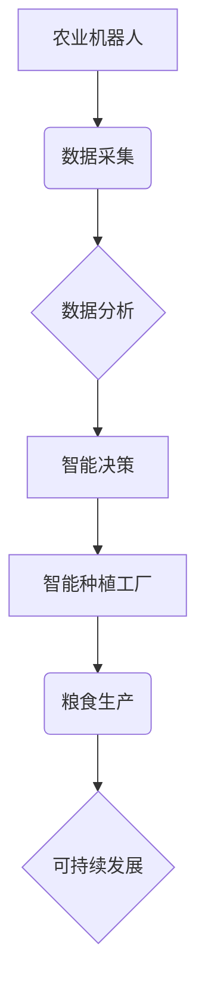

                 

## 未来的智慧农业：2050年的农业机器人与智能种植工厂

> 关键词：农业机器人、智能种植工厂、人工智能、机器学习、物联网、数据分析、精准农业、可持续发展

## 1. 背景介绍

全球人口持续增长，对粮食需求不断攀升，而传统农业面临着土地资源短缺、气候变化、劳动力不足等挑战。如何提高农业生产效率，保障粮食安全，成为全球共同关注的议题。智慧农业应运而生，它利用人工智能、物联网、大数据等先进技术，实现农业生产的智能化、自动化和精准化，为解决上述挑战提供新的解决方案。

2050年，智慧农业将更加成熟和普及，农业机器人将成为田间的主要劳动力，智能种植工厂将取代传统温室，实现高效、可持续的粮食生产。

## 2. 核心概念与联系

智慧农业的核心概念包括：

* **农业机器人:** 能够执行农业生产任务的自动化机器，例如播种、施肥、除草、采摘等。
* **智能种植工厂:** 利用先进技术控制环境条件，实现高效、可持续的室内种植，不受自然环境限制。
* **人工智能 (AI):**  模拟人类智能的计算机系统，能够学习、推理、决策等。
* **机器学习 (ML):**  一种人工智能技术，通过数据训练，使机器能够自动学习和改进。
* **物联网 (IoT):**  通过传感器、网络等技术，将各种设备和系统连接起来，实现数据互联互通。
* **大数据分析:**  对海量农业数据进行分析，挖掘其中的规律和价值，为决策提供支持。

这些核心概念相互关联，共同构成了智慧农业的框架。

**核心概念架构图:**



## 3. 核心算法原理 & 具体操作步骤

### 3.1  算法原理概述

智慧农业的核心算法主要包括：

* **图像识别算法:** 用于识别作物种类、病虫害、生长状况等。
* **机器学习算法:** 用于预测作物产量、优化种植方案、控制环境参数等。
* **路径规划算法:** 用于规划农业机器人的作业路径，提高效率和安全性。

这些算法基于大量的农业数据进行训练和优化，能够实现对农业生产的智能化控制。

### 3.2  算法步骤详解

以图像识别算法为例，其具体操作步骤如下：

1. **数据采集:** 利用摄像头采集作物图像数据。
2. **数据预处理:** 对图像数据进行清洗、增强、格式转换等处理，提高算法的准确性。
3. **特征提取:** 利用卷积神经网络等算法，从图像数据中提取特征，例如颜色、纹理、形状等。
4. **分类模型训练:** 利用训练数据，训练分类模型，例如支持向量机、随机森林等，将特征映射到不同的作物类别。
5. **模型评估:** 利用测试数据评估模型的准确率、召回率等指标，并进行模型调优。
6. **部署应用:** 将训练好的模型部署到农业机器人或智能种植工厂中，实现对作物种类的识别。

### 3.3  算法优缺点

**优点:**

* **自动化程度高:** 可以自动识别作物种类，减少人工成本。
* **准确率高:** 利用深度学习算法，能够实现较高的识别准确率。
* **实时性强:** 可以实时识别作物状态，及时采取措施。

**缺点:**

* **数据依赖性强:** 需要大量的训练数据才能实现高准确率。
* **计算资源需求高:** 训练深度学习模型需要大量的计算资源。
* **环境适应性差:** 算法在不同环境下可能表现不佳。

### 3.4  算法应用领域

图像识别算法在智慧农业中广泛应用于：

* **作物识别:** 识别不同作物种类，帮助农民进行精准种植。
* **病虫害检测:** 识别作物病虫害，及时采取防治措施。
* **生长状况监测:** 监测作物生长状况，及时调整种植方案。
* **果蔬采摘:** 利用机器人进行果蔬采摘，提高效率和质量。

## 4. 数学模型和公式 & 详细讲解 & 举例说明

### 4.1  数学模型构建

智慧农业中，可以使用数学模型来描述作物生长过程、环境参数影响等。例如，可以使用Logistic模型来描述作物生长曲线：

$$
\frac{dN}{dt} = rN\left(1-\frac{N}{K}\right)
$$

其中：

* $N$：作物数量
* $t$：时间
* $r$：生长速率
* $K$：环境承载力

### 4.2  公式推导过程

Logistic模型的推导过程基于以下假设：

* 作物生长速率与当前数量成正比。
* 作物生长速率与环境承载力成反比。

根据这些假设，可以推导出上述公式。

### 4.3  案例分析与讲解

假设一个作物种子的初始数量为 $N_0$，生长速率为 $r=0.5$，环境承载力为 $K=1000$。

利用Logistic模型，可以计算出作物数量随时间的变化趋势。

例如，在 $t=10$ 时，作物数量为：

$$
N(10) = \frac{K}{1+e^{-r(10-t_0)}}
$$

其中 $t_0$ 为初始时间点。

通过计算，可以得到作物数量随时间的变化曲线，并分析其生长趋势。

## 5. 项目实践：代码实例和详细解释说明

### 5.1  开发环境搭建

智慧农业项目开发环境通常包括：

* **操作系统:** Linux、Windows等
* **编程语言:** Python、C++等
* **深度学习框架:** TensorFlow、PyTorch等
* **物联网平台:** AWS IoT、Azure IoT Hub等

### 5.2  源代码详细实现

以下是一个使用Python和TensorFlow实现作物识别模型的代码示例：

```python
import tensorflow as tf

# 定义模型结构
model = tf.keras.models.Sequential([
  tf.keras.layers.Conv2D(32, (3, 3), activation='relu', input_shape=(224, 224, 3)),
  tf.keras.layers.MaxPooling2D((2, 2)),
  tf.keras.layers.Conv2D(64, (3, 3), activation='relu'),
  tf.keras.layers.MaxPooling2D((2, 2)),
  tf.keras.layers.Flatten(),
  tf.keras.layers.Dense(10, activation='softmax')
])

# 编译模型
model.compile(optimizer='adam',
              loss='sparse_categorical_crossentropy',
              metrics=['accuracy'])

# 训练模型
model.fit(train_images, train_labels, epochs=10)

# 评估模型
loss, accuracy = model.evaluate(test_images, test_labels)
print('Test loss:', loss)
print('Test accuracy:', accuracy)
```

### 5.3  代码解读与分析

这段代码定义了一个简单的卷积神经网络模型，用于识别10种作物类别。

* `tf.keras.models.Sequential` 创建了一个顺序模型，将层级依次连接。
* `tf.keras.layers.Conv2D` 定义了一个卷积层，用于提取图像特征。
* `tf.keras.layers.MaxPooling2D` 定义了一个最大池化层，用于降低特征维度。
* `tf.keras.layers.Flatten` 将多维特征转换为一维向量。
* `tf.keras.layers.Dense` 定义了一个全连接层，用于分类。
* `model.compile` 编译模型，指定优化器、损失函数和评价指标。
* `model.fit` 训练模型，使用训练数据进行迭代训练。
* `model.evaluate` 评估模型，使用测试数据计算损失和准确率。

### 5.4  运行结果展示

训练完成后，可以将模型应用于实际场景，例如识别田间作物种类。

## 6. 实际应用场景

智慧农业已经开始在一些地区得到应用，例如：

* **精准施肥:** 利用传感器监测土壤肥力，精准施肥，提高肥料利用率，减少环境污染。
* **自动灌溉:** 根据土壤湿度和作物需求，自动控制灌溉系统，节约用水资源。
* **病虫害防治:** 利用图像识别技术，及时识别病虫害，采取精准防治措施，减少农药使用。
* **智能温室:** 利用智能控制系统，调节温湿度、光照等环境参数，提高温室产量和品质。

### 6.4  未来应用展望

未来，智慧农业将更加广泛地应用于各个环节，例如：

* **无人驾驶农业机械:** 利用自动驾驶技术，实现农业机械的无人化作业，提高效率和安全性。
* **垂直农场:** 利用室内种植技术，实现高密度、高效的粮食生产，不受自然环境限制。
* **基因编辑技术:** 利用基因编辑技术，培育高产、抗病、耐旱的作物品种。
* **区块链技术:** 利用区块链技术，实现农业产品的溯源和交易，提高食品安全和透明度。

## 7. 工具和资源推荐

### 7.1  学习资源推荐

* **书籍:**
    * 《深度学习》
    * 《机器学习实战》
    * 《物联网编程》
* **在线课程:**
    * Coursera
    * edX
    * Udacity

### 7.2  开发工具推荐

* **编程语言:** Python
* **深度学习框架:** TensorFlow、PyTorch
* **物联网平台:** AWS IoT、Azure IoT Hub

### 7.3  相关论文推荐

* **农业机器人:**
    * "Agricultural Robotics: A Review"
    * "The Role of Robotics in Precision Agriculture"
* **智能种植工厂:**
    * "Vertical Farming: A Review"
    * "Controlled Environment Agriculture: A Sustainable Solution for Food Security"
* **数据分析:**
    * "Data Analytics in Agriculture: A Review"
    * "Big Data Analytics for Precision Agriculture"

## 8. 总结：未来发展趋势与挑战

### 8.1  研究成果总结

智慧农业的研究取得了显著成果，例如：

* **图像识别算法:** 能够识别作物种类、病虫害、生长状况等。
* **机器学习算法:** 能够预测作物产量、优化种植方案、控制环境参数等。
* **路径规划算法:** 能够规划农业机器人的作业路径，提高效率和安全性。

### 8.2  未来发展趋势

未来，智慧农业将朝着以下方向发展：

* **更智能化:** 利用更先进的人工智能技术，实现更智能的决策和控制。
* **更自动化:** 利用更先进的机器人技术，实现更多农业生产环节的自动化。
* **更可持续:** 利用更环保的生产技术，减少农业对环境的影响。

### 8.3  面临的挑战

智慧农业的发展也面临一些挑战：

* **技术成本:** 智慧农业技术成本较高，需要进一步降低成本才能普及。
* **数据安全:** 农业数据涉及隐私和安全问题，需要加强数据保护。
* **人才缺口:** 智慧农业需要大量专业人才，需要加强人才培养。

### 8.4  研究展望

未来，需要继续加强智慧农业的研究，解决技术难题，推动智慧农业的快速发展，实现粮食安全和可持续发展目标。

## 9. 附录：常见问题与解答

**Q1: 智慧农业会取代农民吗？**

A1: 智慧农业不会取代农民，而是会帮助农民提高生产效率，减轻劳动强度，实现更高效、更可持续的农业生产。

**Q2: 智慧农业技术成本高，如何降低成本？**

A2: 可以通过以下方式降低成本：

* **开源软件和硬件:** 利用开源软件和硬件，降低技术成本。
* **云计算:** 利用云计算平台，降低硬件成本。
* **政府补贴:** 政府可以提供补贴，鼓励农民采用智慧农业技术。

**Q3: 智慧农业数据安全如何保障？**

A3: 可以通过以下方式保障数据安全：

* **加密技术:** 对农业数据进行加密，防止数据泄露。
* **访问控制:** 设置严格的访问控制权限，防止未授权人员访问数据。
* **数据备份:** 定期备份数据，防止数据丢失。


作者：禅与计算机程序设计艺术 / Zen and the Art of Computer Programming 
<end_of_turn>

