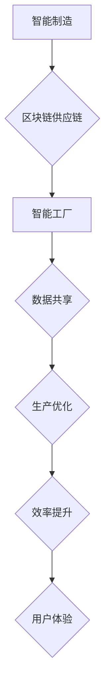

                 

## 未来的智能制造：2050年的区块链供应链与智能工厂

> 关键词：智能制造、区块链、供应链、智能工厂、物联网、数据安全、可追溯性、自动化、机器学习

### 1. 背景介绍

智能制造是第四次工业革命的核心驱动力，它通过将物理世界和数字世界紧密结合，实现生产过程的智能化、自动化和优化。随着物联网、人工智能、云计算等技术的快速发展，智能制造正从概念走向现实，并将在未来深刻地改变制造业的面貌。

传统的制造业供应链往往存在着信息孤岛、数据不可追溯、效率低下等问题。区块链技术作为一种去中心化、透明、安全的数据存储和共享平台，为解决这些问题提供了新的解决方案。同时，智能工厂通过传感器、机器学习等技术，实现生产过程的实时监控、预测和优化，进一步提升了制造业的效率和智能化水平。

### 2. 核心概念与联系

#### 2.1 智能制造

智能制造是指利用人工智能、物联网、云计算等先进技术，实现生产过程的智能化、自动化和优化，从而提高生产效率、降低成本、提升产品质量和用户体验。

#### 2.2 区块链

区块链是一种分布式账本技术，它通过将数据块串联成链条，并使用加密算法进行安全保护，实现数据共享、透明和不可篡改。

#### 2.3 智能工厂

智能工厂是指通过传感器、机器学习、自动化等技术，实现生产过程的实时监控、预测和优化，从而提高生产效率、降低成本、提升产品质量和用户体验。

#### 2.4 联系

区块链技术可以为智能制造供应链提供安全、透明、可追溯的数据共享平台，而智能工厂则可以利用区块链技术实现生产过程的智能化管理和优化。两者结合，可以构建一个高效、透明、安全的智能制造生态系统。

**Mermaid 流程图**



### 3. 核心算法原理 & 具体操作步骤

#### 3.1 算法原理概述

区块链技术的核心算法包括：

* **哈希算法**: 用于生成数据块的唯一标识，确保数据不可篡改。
* **加密算法**: 用于保护数据隐私和安全。
* **共识算法**: 用于验证交易和达成共识，确保区块链的安全性。

#### 3.2 算法步骤详解

1. **数据打包**: 将交易数据打包成数据块。
2. **哈希计算**: 对数据块进行哈希计算，生成数据块的唯一标识。
3. **链式连接**: 将新数据块与之前的区块链接，形成区块链。
4. **验证交易**: 使用共识算法验证交易的合法性。
5. **添加区块**: 将验证通过的交易数据块添加到区块链中。

#### 3.3 算法优缺点

**优点**:

* **安全性**: 哈希算法和加密算法确保数据安全和不可篡改。
* **透明性**: 所有交易记录都公开透明，可供任何人查询。
* **去中心化**: 数据存储在多个节点上，不存在单点故障。

**缺点**:

* **处理速度**: 区块链的交易处理速度相对较慢。
* **可扩展性**: 区块链的规模有限，难以处理大量交易。
* **技术复杂性**: 区块链技术相对复杂，需要专业的技术人员进行开发和维护。

#### 3.4 算法应用领域

* **供应链管理**: 实现供应链的透明化、可追溯性和安全性。
* **金融服务**: 提供安全、高效的支付和结算服务。
* **医疗保健**: 保护患者隐私，实现医疗数据的安全共享。
* **数字身份**: 创建安全的数字身份系统。

### 4. 数学模型和公式 & 详细讲解 & 举例说明

#### 4.1 数学模型构建

区块链的安全性基于哈希函数和密码学原理。哈希函数将任意长度的数据映射到固定长度的哈希值，具有以下特性：

* **单向性**: 很难从哈希值反推原始数据。
* **抗碰撞性**: 很难找到两个不同的输入数据产生相同的哈希值。

密码学原理用于加密和解密数据，确保数据的隐私和安全。常用的加密算法包括：

* **RSA**: 基于大数分解的公钥加密算法。
* **ECC**: 椭圆曲线密码学，具有更高的安全性。

#### 4.2 公式推导过程

哈希函数的数学模型可以用以下公式表示：

$$H(x) = y$$

其中，$H$ 是哈希函数，$x$ 是输入数据，$y$ 是哈希值。

密码学算法的数学模型则更为复杂，涉及到数论、代数等多个数学分支。

#### 4.3 案例分析与讲解

**案例**: 假设Alice想发送一条消息给Bob，可以使用RSA算法进行加密。

1. Alice和Bob协商一个公钥和私钥对。
2. Alice使用Bob的公钥加密消息。
3. Bob使用自己的私钥解密消息。

**公式**:

* 公钥加密: $c = m^e \pmod{n}$
* 私钥解密: $m = c^d \pmod{n}$

其中，$m$ 是消息，$c$ 是密文，$e$ 是公钥指数，$d$ 是私钥指数，$n$ 是模数。

### 5. 项目实践：代码实例和详细解释说明

#### 5.1 开发环境搭建

* **操作系统**: Ubuntu 20.04 LTS
* **编程语言**: Python 3.8
* **开发工具**: PyCharm

#### 5.2 源代码详细实现

```python
# 导入必要的库
import hashlib

# 定义一个简单的哈希函数
def hash_data(data):
    return hashlib.sha256(data.encode()).hexdigest()

# 示例数据
data = "Hello, world!"

# 计算哈希值
hash_value = hash_data(data)

# 打印哈希值
print(f"哈希值: {hash_value}")
```

#### 5.3 代码解读与分析

* 该代码使用Python的`hashlib`库实现了一个简单的哈希函数。
* `hash_data()`函数接受一个字符串作为输入，并使用SHA256算法计算其哈希值。
* `encode()`方法将字符串转换为字节序列，因为哈希函数需要字节序列作为输入。
* `hexdigest()`方法将哈希值转换为十六进制字符串。

#### 5.4 运行结果展示

```
哈希值: 2cf24dba5fb0a30e26e83b2ac5b9e29e1b161e5c1fa7425e73043362938b9824
```

### 6. 实际应用场景

#### 6.1 供应链管理

区块链技术可以帮助企业构建透明、可追溯的供应链系统，实现以下功能：

* **产品溯源**: 通过记录产品的生产、运输、销售等信息，实现产品的可追溯性。
* **库存管理**: 实时监控库存情况，优化库存管理。
* **物流追踪**: 追踪产品的运输过程，提高物流效率。
* **防伪溯源**: 通过区块链技术，防止假冒伪劣产品进入市场。

#### 6.2 智能工厂

智能工厂通过传感器、机器学习等技术，实现生产过程的智能化管理和优化，可以利用区块链技术实现以下功能：

* **数据安全**: 保护生产过程中的敏感数据，防止数据泄露。
* **设备管理**: 记录设备的运行状态和维护记录，提高设备利用率。
* **质量控制**: 通过数据分析，识别产品质量问题，提高产品质量。
* **生产调度**: 根据实时数据，优化生产调度，提高生产效率。

#### 6.3 未来应用展望

随着区块链技术和人工智能技术的不断发展，未来智能制造将更加智能化、自动化和高效化。

* **更智能的供应链**: 区块链技术将与人工智能技术结合，实现供应链的智能化预测和优化。
* **更安全的生产环境**: 区块链技术将帮助企业构建更安全的生产环境，防止数据泄露和网络攻击。
* **更个性化的产品**: 智能制造将能够根据用户的需求，定制化生产产品。

### 7. 工具和资源推荐

#### 7.1 学习资源推荐

* **书籍**:
    * 《区块链技术入门》
    * 《智能合约编程》
* **在线课程**:
    * Coursera: Blockchain Specialization
    * edX: Blockchain Fundamentals

#### 7.2 开发工具推荐

* **Hyperledger Fabric**: 开源区块链平台
* **Ethereum**: 基于智能合约的区块链平台
* **Corda**: 企业级区块链平台

#### 7.3 相关论文推荐

* **"Blockchain Technology for Supply Chain Management"**
* **"Smart Manufacturing: A Review"**

### 8. 总结：未来发展趋势与挑战

#### 8.1 研究成果总结

区块链技术和智能制造技术正在迅速发展，并将在未来深刻地改变制造业的面貌。两者结合，可以构建一个高效、透明、安全的智能制造生态系统。

#### 8.2 未来发展趋势

* **更广泛的应用**: 区块链技术和智能制造技术将应用于更多领域，例如金融、医疗保健、教育等。
* **更强大的功能**: 区块链技术和智能制造技术将不断发展，提供更强大的功能和服务。
* **更深入的融合**: 区块链技术和智能制造技术将更加深入地融合，形成一个更加智能化的生态系统。

#### 8.3 面临的挑战

* **技术复杂性**: 区块链技术和智能制造技术都比较复杂，需要专业的技术人员进行开发和维护。
* **标准化问题**: 区块链技术和智能制造技术缺乏统一的标准，这将导致互操作性问题。
* **监管环境**: 区块链技术和智能制造技术的监管环境还不完善，这将制约其发展。

#### 8.4 研究展望

未来，我们需要继续研究区块链技术和智能制造技术的融合，解决技术复杂性、标准化问题和监管环境等挑战，推动智能制造的快速发展。

### 9. 附录：常见问题与解答

#### 9.1 区块链技术和智能制造技术有什么区别？

区块链技术是一种分布式账本技术，用于记录和共享数据。智能制造技术是指利用人工智能、物联网等技术，实现生产过程的智能化、自动化和优化。两者可以相互补充，共同构建一个高效、透明、安全的智能制造生态系统。

#### 9.2 区块链技术如何应用于供应链管理？

区块链技术可以帮助企业构建透明、可追溯的供应链系统，实现以下功能：

* **产品溯源**: 通过记录产品的生产、运输、销售等信息，实现产品的可追溯性。
* **库存管理**: 实时监控库存情况，优化库存管理。
* **物流追踪**: 追踪产品的运输过程，提高物流效率。
* **防伪溯源**: 通过区块链技术，防止假冒伪劣产品进入市场。

#### 9.3 智能制造技术如何应用于智能工厂？

智能制造技术可以帮助企业构建智能工厂，实现以下功能：

* **数据安全**: 保护生产过程中的敏感数据，防止数据泄露。
* **设备管理**: 记录设备的运行状态和维护记录，提高设备利用率。
* **质量控制**: 通过数据分析，识别产品质量问题，提高产品质量。
* **生产调度**: 根据实时数据，优化生产调度，提高生产效率。


作者：禅与计算机程序设计艺术 / Zen and the Art of Computer Programming 
<end_of_turn>

