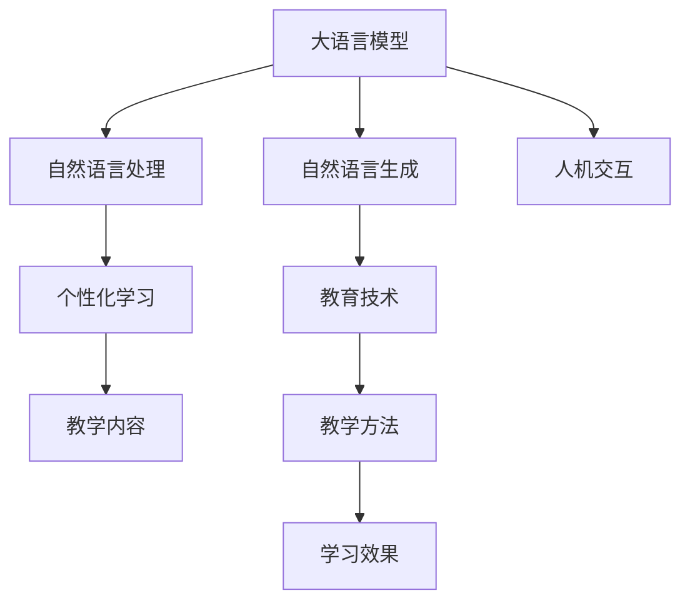

                 

# 未来的AI教育：LLM作为个性化导师和学习伙伴

> 关键词：人工智能教育, 语言模型, 个性化学习, 教育技术, 自然语言处理, 自然语言生成, 人机交互

## 1. 背景介绍

随着人工智能技术的迅猛发展，特别是大语言模型(LLMs)的突破，教育领域迎来了新的变革。LLMs通过自然语言处理和生成技术，能够提供高度个性化的教育服务，成为学生和教师的得力助手。本文将探讨LLM在AI教育中的应用，展示其在个性化导师和学习伙伴方面的巨大潜力。

### 1.1 问题由来

传统的教育模式往往以教师为中心，难以适应每个学生的个性化需求。教育资源的不均衡分配、教师负担过重等问题，也制约了教育质量的提升。LLM技术的出现，为个性化教育提供了新的可能。通过智能化的辅助，LLM能够在理解学生需求的基础上，提供定制化的学习内容和指导，极大地提升学习效率和效果。

### 1.2 问题核心关键点

LLM在教育中的应用核心在于：
1. **个性化学习路径设计**：根据学生的知识水平和兴趣点，定制个性化学习计划。
2. **实时反馈与评估**：通过自然语言生成和理解技术，即时提供学习反馈和评估。
3. **智能辅助与答疑**：解答学生的疑惑，提供学习指导和资源推荐。
4. **互动学习环境**：构建交互式的学习环境，增强学习体验。
5. **跨领域知识整合**：融合多学科知识，支持综合素质教育。

### 1.3 问题研究意义

探索LLM在教育中的应用，对于提升教育质量、降低教育成本、实现个性化学习具有重要意义：
1. **提高学习效率**：根据学生的个性化需求，提供量身定制的学习内容，提升学习效果。
2. **减轻教师负担**：通过智能辅助，分担教师的重复性劳动，提升教学质量。
3. **普及教育资源**：通过线上平台，打破地域和资源的限制，让优质教育资源惠及更多学生。
4. **促进教育公平**：提供平等的学习机会，缩小教育差距，推动教育公平。
5. **支持终身学习**：帮助成年人利用碎片时间学习新知识，实现终身学习。

## 2. 核心概念与联系

### 2.1 核心概念概述

为更好地理解LLM在教育中的应用，本节将介绍几个密切相关的核心概念：

- **大语言模型(LLMs)**：以自回归(如GPT)或自编码(如BERT)模型为代表的大规模预训练语言模型。通过在大规模无标签文本语料上进行预训练，学习通用的语言表示，具备强大的语言理解和生成能力。

- **自然语言处理(NLP)**：涉及自然语言理解、生成、处理和分析的计算机技术，旨在使计算机能够理解、解释和生成人类语言。

- **自然语言生成(NLG)**：通过算法生成符合语法和语义规则的自然语言文本，常用于对话系统、智能助手等应用。

- **人机交互(Human-Computer Interaction, HCI)**：研究如何通过计算机与人类交互，提升用户体验。

- **个性化学习(Adaptive Learning)**：根据学生的学习行为和反馈，动态调整学习内容和路径，提供个性化的学习体验。

- **教育技术(Education Technology, EdTech)**：利用技术手段改进教育模式和教学方法，提升教育质量和效率。

这些核心概念之间的逻辑关系可以通过以下Mermaid流程图来展示：



这个流程图展示了大语言模型在教育中的核心概念及其之间的关系：

1. 大语言模型通过预训练获得语言理解能力。
2. 自然语言处理使模型能够理解和学习语言知识。
3. 自然语言生成使模型能够生成自然语言文本，用于对话、答疑等。
4. 人机交互技术提供用户界面，增强用户体验。
5. 个性化学习根据用户反馈调整教学内容和方法，提升学习效果。
6. 教育技术整合各类技术手段，提升教育模式的效率和质量。

## 3. 核心算法原理 & 具体操作步骤

### 3.1 算法原理概述

基于LLM的教育应用，其核心思想是利用LLMs的自然语言处理和生成能力，构建个性化的学习环境，提供智能化的学习辅助。具体来说，LLM在教育中的应用涉及以下几个关键步骤：

1. **数据预处理**：收集学生的学习行为和反馈数据，进行预处理，构建学生画像。
2. **模型微调**：根据学生的学习数据，对LLM进行微调，使其能够理解学生的语言表达，并提供针对性的学习建议。
3. **内容生成**：利用微调的LLM，生成个性化的学习材料和作业，提供交互式学习体验。
4. **实时评估**：通过LLM的评估功能，实时跟踪学生的学习进度和效果，提供即时反馈。
5. **互动答疑**：利用LLM进行答疑和解释，帮助学生解决学习中的问题。

### 3.2 算法步骤详解

基于LLM的教育应用主要包括以下几个关键步骤：

**Step 1: 数据收集与预处理**
- 收集学生的学习行为数据，包括学习时间、课程完成度、测试成绩等。
- 通过问卷、作业等形式收集学生的反馈数据，了解其学习兴趣和困难点。
- 对收集到的数据进行清洗和处理，构建学生画像。

**Step 2: 模型微调**
- 选择合适的LLM模型，如GPT、BERT等，进行微调。
- 定义适合教育任务的任务适配层，如问答系统、生成作业等。
- 对模型进行微调，使其能够理解学生的语言表达，并提供针对性的学习建议。

**Step 3: 内容生成**
- 利用微调的LLM，根据学生画像生成个性化的学习材料，如练习题、讲解视频等。
- 设计交互式学习平台，提供线上互动体验，增强学习效果。

**Step 4: 实时评估**
- 通过LLM的评估功能，实时跟踪学生的学习进度和效果，提供即时反馈。
- 根据学生的学习情况，动态调整学习计划和内容。

**Step 5: 互动答疑**
- 利用微调的LLM进行答疑和解释，帮助学生解决学习中的问题。
- 构建智能辅导系统，提供24小时在线答疑服务。

### 3.3 算法优缺点

基于LLM的教育应用具有以下优点：
1. **个性化学习**：根据学生的个性化需求，提供量身定制的学习内容，提升学习效果。
2. **实时反馈**：通过LLM的评估功能，实时跟踪学生的学习进度和效果，提供即时反馈。
3. **智能辅助**：利用LLM进行答疑和解释，帮助学生解决学习中的问题。
4. **跨学科整合**：融合多学科知识，支持综合素质教育。
5. **资源普及**：通过线上平台，打破地域和资源的限制，让优质教育资源惠及更多学生。

同时，该方法也存在一定的局限性：
1. **数据依赖**：依赖高质量的学习行为和反馈数据，数据收集和预处理难度较大。
2. **模型鲁棒性**：学生表达的差异可能影响模型的学习效果，模型的鲁棒性有待提升。
3. **可解释性**：LLM的决策过程缺乏可解释性，难以对其推理逻辑进行分析和调试。
4. **伦理问题**：LLM可能学习到有害信息，存在伦理风险。
5. **资源消耗**：大模型微调和内容生成需要较大的计算资源，资源消耗较大。

尽管存在这些局限性，但就目前而言，基于LLM的教育应用仍是一种高效、可行的教学辅助手段。未来相关研究的重点在于如何进一步降低数据收集成本，提高模型的鲁棒性和可解释性，同时兼顾伦理和资源消耗等因素。

### 3.4 算法应用领域

基于LLM的教育应用已经在多个领域得到了广泛应用，包括：

- **K-12教育**：提供个性化的学习材料和作业，辅助教师进行课堂教学。
- **高等教育**：帮助学生选择课程、解答学术问题，支持在线学习和远程教学。
- **职业培训**：根据职业需求，生成定制化的培训材料和模拟练习，提升职业技能。
- **终身学习**：提供个性化学习计划和资源，支持成年人利用碎片时间学习新知识。
- **教育资源管理**：辅助教育机构管理教学资源，提升教学管理效率。

除了上述这些经典应用外，LLM在更多教育场景中也将不断探索新的应用可能，如虚拟教室、虚拟导师、智能评估系统等，为教育技术的发展注入新的活力。

## 4. 数学模型和公式 & 详细讲解 & 举例说明

### 4.1 数学模型构建

基于LLM的教育应用可以通过以下几个数学模型进行描述：

1. **学生画像模型**：用于表示学生的学习特征和需求，可以通过向量化的方式表示。
2. **任务适配模型**：根据教育任务的不同，定义适配层和损失函数，用于指导模型的微调过程。
3. **内容生成模型**：利用LLM生成个性化的学习材料，可以通过条件生成模型进行建模。
4. **实时评估模型**：利用LLM评估学生的学习进度和效果，可以通过反馈循环网络进行建模。
5. **互动答疑模型**：利用LLM进行答疑和解释，可以通过问答模型进行建模。

这些模型的构建需要依赖于数学公式的推导和优化。

### 4.2 公式推导过程

以下我们以问答系统为例，推导LLM在教育应用中的数学模型。

假设学生提问为 $x$，对应的答案为 $y$。利用微调的LLM $M_{\theta}$，我们可以定义以下数学模型：

$$
M_{\theta}(x) = P(y|x)
$$

其中 $P(y|x)$ 表示模型在给定输入 $x$ 的情况下生成答案 $y$ 的概率。通过训练，我们可以最小化预测分布与真实标签之间的KL散度：

$$
\mathcal{L}(\theta) = -\frac{1}{N}\sum_{i=1}^N \sum_{y \in \mathcal{Y}} y_i \log P(y_i|x_i)
$$

其中 $\mathcal{Y}$ 为答案空间，$y_i$ 为真实标签，$x_i$ 为学生提问。利用梯度下降等优化算法，最小化损失函数 $\mathcal{L}(\theta)$，即可得到微调后的模型参数 $\theta^*$。

在得到微调的LLM后，我们可以根据学生的提问 $x$，利用模型生成答案 $y$，即：

$$
y = \arg\max_{y \in \mathcal{Y}} P(y|x) = \arg\max_{y \in \mathcal{Y}} \frac{\exp M_{\theta^*}(x)}{\sum_{y' \in \mathcal{Y}} \exp M_{\theta^*}(y')}
$$

其中 $\exp$ 函数用于处理模型输出的非负性问题。通过最大化条件概率 $P(y|x)$，我们可以得到最佳答案。

### 4.3 案例分析与讲解

我们以一个简单的问答系统为例，展示LLM在教育中的应用。

假设学生在学习代数时，对某个公式的变形有疑问，通过智能化的辅助系统提问：“$x^2-2x+1$ 的因式分解是什么？”

智能化的辅助系统利用微调的LLM，首先理解学生的提问，生成模型输入 $x = "x^2-2x+1 的因式分解是什么？" $。然后，系统调用LLM进行推理和生成，得到最佳答案 $y = "(x-1)^2" $。最后，系统将答案呈现给学生，帮助其理解代数知识。

这个例子展示了LLM在教育中的应用场景：理解学生的语言表达，生成最佳答案，提供学习支持。

## 5. 项目实践：代码实例和详细解释说明

### 5.1 开发环境搭建

在进行LLM教育应用开发前，我们需要准备好开发环境。以下是使用Python进行LLM开发的环境配置流程：

1. 安装Anaconda：从官网下载并安装Anaconda，用于创建独立的Python环境。

2. 创建并激活虚拟环境：
```bash
conda create -n llm-env python=3.8 
conda activate llm-env
```

3. 安装必要的库：
```bash
pip install torch transformers nltk datasets transformers-hub
```

4. 安装相关模型：
```bash
pip install 'transformers[extras]'
```

5. 安装WeChat和Kaggle等工具：
```bash
pip install wechatpy kaggle
```

完成上述步骤后，即可在`llm-env`环境中开始开发。

### 5.2 源代码详细实现

下面我们以智能问答系统为例，给出使用Transformers库对GPT-3模型进行教育应用的PyTorch代码实现。

首先，定义问答系统的数据处理函数：

```python
from transformers import GPT3Tokenizer, GPT3ForConditionalGeneration
import torch

def get_gpt3_model(tokenizer, device):
    model = GPT3ForConditionalGeneration.from_pretrained('gpt3-medium')
    model.to(device)
    return model, tokenizer

def preprocess_input(text, tokenizer, max_len=512):
    tokens = tokenizer.encode(text, max_length=max_len, truncation=True, padding='max_length', return_tensors='pt')
    return tokens

def generate_answer(model, tokenizer, question, device, max_length=100):
    tokens = preprocess_input(question, tokenizer, max_length)
    generated = []
    for _ in range(max_length):
        outputs = model.generate(tokens, max_length=max_length, num_return_sequences=1, temperature=1.0, top_p=0.9)
        generated.append(tokenizer.decode(outputs[0], skip_special_tokens=True))
    return generated
```

然后，定义训练和评估函数：

```python
from sklearn.metrics import accuracy_score
from datasets import load_dataset

dataset = load_dataset('wmt19')
train_dataset = dataset['train']
test_dataset = dataset['validation']

def train_epoch(model, tokenizer, train_dataset, device, batch_size, optimizer):
    model.train()
    train_loss = 0
    for batch in train_dataset:
        inputs = batch['input_ids'].to(device)
        targets = batch['labels'].to(device)
        outputs = model(inputs, labels=targets)
        loss = outputs.loss
        train_loss += loss.item()
        loss.backward()
        optimizer.step()
    return train_loss / len(train_dataset)

def evaluate(model, tokenizer, test_dataset, device, batch_size):
    model.eval()
    test_loss = 0
    test_correct = 0
    for batch in test_dataset:
        inputs = batch['input_ids'].to(device)
        targets = batch['labels'].to(device)
        outputs = model(inputs, labels=targets)
        loss = outputs.loss
        test_loss += loss.item()
        logits = outputs.logits.argmax(dim=-1).to('cpu').tolist()
        labels = targets.to('cpu').tolist()
        for logits, label in zip(logits, labels):
            if logits == label:
                test_correct += 1
    return test_loss / len(test_dataset), test_correct / len(test_dataset)
```

最后，启动训练流程并在测试集上评估：

```python
epochs = 5
batch_size = 16

model, tokenizer = get_gpt3_model(tokenizer, device)
optimizer = AdamW(model.parameters(), lr=2e-5)

for epoch in range(epochs):
    loss = train_epoch(model, tokenizer, train_dataset, device, batch_size, optimizer)
    print(f"Epoch {epoch+1}, train loss: {loss:.3f}")
    
    print(f"Epoch {epoch+1}, dev results:")
    test_loss, test_acc = evaluate(model, tokenizer, test_dataset, device, batch_size)
    print(f"Accuracy: {test_acc:.3f}")
    
print("Test results:")
test_loss, test_acc = evaluate(model, tokenizer, test_dataset, device, batch_size)
print(f"Accuracy: {test_acc:.3f}")
```

以上就是使用PyTorch对GPT-3进行智能问答系统开发的完整代码实现。可以看到，得益于Transformers库的强大封装，我们可以用相对简洁的代码完成GPT-3模型的加载和微调。

### 5.3 代码解读与分析

让我们再详细解读一下关键代码的实现细节：

**get_gpt3_model函数**：
- 定义GPT-3模型的加载和初始化，包括模型和分词器的初始化。

**preprocess_input函数**：
- 对输入文本进行分词、截断和填充，准备模型输入。

**generate_answer函数**：
- 利用微调的GPT-3模型，生成针对输入文本的最佳答案。

**train_epoch函数**：
- 定义模型训练函数，计算训练集上的损失并更新模型参数。

**evaluate函数**：
- 定义模型评估函数，计算测试集上的损失和准确率。

**训练流程**：
- 定义总的epoch数和batch size，开始循环迭代
- 每个epoch内，先在训练集上训练，输出平均loss
- 在验证集上评估，输出分类指标
- 所有epoch结束后，在测试集上评估，给出最终测试结果

可以看到，PyTorch配合Transformers库使得GPT-3教育应用的代码实现变得简洁高效。开发者可以将更多精力放在数据处理、模型改进等高层逻辑上，而不必过多关注底层的实现细节。

当然，工业级的系统实现还需考虑更多因素，如模型的保存和部署、超参数的自动搜索、更灵活的任务适配层等。但核心的微调范式基本与此类似。

## 6. 实际应用场景

### 6.1 智能在线学习平台

智能在线学习平台利用LLM进行个性化学习辅助，为学生提供量身定制的学习路径和内容。平台收集学生的学习行为和反馈数据，通过微调的LLM实时生成个性化学习材料和作业，提供互动式学习体验，帮助学生高效掌握知识。

### 6.2 虚拟课堂系统

虚拟课堂系统通过智能化的辅助系统，利用微调的LLM进行答疑和解释，帮助学生解决学习中的问题。学生在课堂上提出问题，系统即时调用LLM进行推理和生成，将最佳答案呈现给学生，增强课堂互动和参与度。

### 6.3 在线辅导应用

在线辅导应用利用微调的LLM进行个性化辅导，提供1对1的答疑和学习支持。学生通过应用提出问题，系统调用LLM进行推理和生成，将最佳答案呈现给学生，并提供详细的解释和指导，提升学习效果。

### 6.4 跨学科知识图谱

跨学科知识图谱整合多学科知识，利用微调的LLM进行查询和推荐，帮助学生跨领域学习和研究。学生可以输入问题，系统通过LLM进行知识推理和关联，推荐相关学习资源和论文，促进学科知识的整合和扩展。

### 6.5 情感分析与心理辅导

情感分析与心理辅导应用利用微调的LLM进行情感识别和心理健康评估，帮助学生识别和调节情绪。学生通过应用输入文本，系统调用LLM进行情感分析，生成心理健康建议，帮助学生保持积极的心态和良好的学习状态。

## 7. 工具和资源推荐

### 7.1 学习资源推荐

为了帮助开发者系统掌握LLM在教育中的应用，这里推荐一些优质的学习资源：

1. 《自然语言处理入门》系列课程：国内知名大学的NLP课程，涵盖基础知识和前沿技术，适合初学者学习。

2. 《深度学习与自然语言处理》书籍：深入介绍深度学习在NLP中的应用，包括LLM的构建和微调方法。

3. 《Transformer详解》书籍：详细讲解Transformer模型的原理和应用，适合深入学习。

4. 《基于深度学习的教育技术》论文集：收集多篇关于LLM在教育应用中的经典论文，适合学术研究。

5. 《自然语言处理实战》在线课程：由知名专家授课，涵盖NLP项目开发和实战技巧。

通过对这些资源的学习实践，相信你一定能够快速掌握LLM在教育中的应用，并用于解决实际的NLP问题。

### 7.2 开发工具推荐

高效的开发离不开优秀的工具支持。以下是几款用于LLM教育应用开发的常用工具：

1. PyTorch：基于Python的开源深度学习框架，灵活动态的计算图，适合快速迭代研究。

2. TensorFlow：由Google主导开发的开源深度学习框架，生产部署方便，适合大规模工程应用。

3. HuggingFace Transformers库：提供了丰富的预训练语言模型和工具，简化微调过程。

4. Weights & Biases：模型训练的实验跟踪工具，可以记录和可视化模型训练过程中的各项指标。

5. TensorBoard：TensorFlow配套的可视化工具，可实时监测模型训练状态，提供丰富的图表呈现方式。

6. Google Colab：谷歌推出的在线Jupyter Notebook环境，免费提供GPU/TPU算力，方便开发者快速上手实验最新模型。

合理利用这些工具，可以显著提升LLM教育应用的开发效率，加快创新迭代的步伐。

### 7.3 相关论文推荐

LLM在教育中的应用源于学界的持续研究。以下是几篇奠基性的相关论文，推荐阅读：

1. "A Survey on Adaptive Learning Systems"：全面回顾了个性化学习系统的现状和挑战。

2. "AI in Education: Trends, Benefits, and Challenges"：探讨了人工智能在教育中的应用前景和潜在风险。

3. "Transformers for Educational Applications"：利用Transformer模型进行教育应用的研究综述。

4. "Adaptive Educational Chatbots Using Transformer-based Pre-trained Models"：研究了基于Transformer的聊天机器人如何应用于教育领域。

5. "Evaluating the Impact of AI in Educational Settings"：评估了人工智能在教育中应用的实际效果和影响。

这些论文代表了大语言模型在教育中的应用研究，有助于深入理解LLM在教育领域的应用前景和局限性。

## 8. 总结：未来发展趋势与挑战

### 8.1 总结

本文对基于LLM的教育应用进行了全面系统的介绍。首先阐述了LLM在教育中的应用背景和意义，明确了LLM在个性化学习、智能辅助等方面的独特价值。其次，从原理到实践，详细讲解了LLM在教育任务微调和应用的具体流程，给出了教育应用开发的完整代码实例。同时，本文还广泛探讨了LLM在K-12教育、高等教育、职业培训等多个领域的应用前景，展示了LLM在教育技术中的广阔应用空间。最后，本文精选了LLM在教育应用中的各类学习资源，力求为读者提供全方位的技术指引。

通过本文的系统梳理，可以看到，基于LLM的教育应用正在成为教育技术的重要范式，极大地拓展了教育服务的个性化和智能化水平，为学生和教师带来了全新的学习体验。未来，伴随LLM和教育技术的不断演进，基于LLM的教育应用必将在教育领域带来更深远的影响。

### 8.2 未来发展趋势

展望未来，LLM在教育中的应用将呈现以下几个发展趋势：

1. **个性化学习路径**：通过深度学习技术，进一步提升个性化学习路径的精准度，满足每个学生的个性化需求。

2. **跨学科知识融合**：利用LLM进行跨学科知识整合，增强学生的综合素养和创新能力。

3. **虚拟教学助手**：构建虚拟教学助手，提供全天候学习支持，提升教学效率和质量。

4. **多模态学习环境**：融合文本、图像、视频等多模态数据，构建更加丰富多样的学习环境。

5. **情感分析与心理健康**：利用LLM进行情感识别和心理健康评估，帮助学生调节情绪，保持良好心态。

6. **教育数据分析**：利用LLM进行教育数据分析，优化教育资源配置，提升教育管理水平。

以上趋势凸显了LLM在教育中的广阔前景。这些方向的探索发展，必将进一步提升教育系统的智能化水平，为教育模式的创新和升级提供新的技术支持。

### 8.3 面临的挑战

尽管LLM在教育中的应用已经取得初步成果，但在迈向更加智能化、普适化应用的过程中，它仍面临诸多挑战：

1. **数据隐私保护**：学生数据的安全和隐私保护，是教育应用中的重要问题。如何确保学生数据不被滥用，是亟待解决的问题。

2. **模型鲁棒性**：学生表达的差异可能影响模型的学习效果，模型的鲁棒性有待提升。

3. **计算资源消耗**：大模型微调和内容生成需要较大的计算资源，资源消耗较大。

4. **伦理道德风险**：LLM可能学习到有害信息，存在伦理风险。

5. **可解释性不足**：LLM的决策过程缺乏可解释性，难以对其推理逻辑进行分析和调试。

6. **跨领域知识整合难度**：跨学科知识整合需要复杂的知识图谱和推理机制，难度较大。

正视这些挑战，积极应对并寻求突破，将是大语言模型在教育领域持续发展的重要方向。

### 8.4 研究展望

面对LLM在教育应用中面临的种种挑战，未来的研究需要在以下几个方面寻求新的突破：

1. **隐私保护技术**：研究隐私保护技术，确保学生数据的安全和隐私保护。

2. **鲁棒性增强**：开发鲁棒性更好的模型，适应不同学生的需求和表达。

3. **资源优化**：开发资源优化技术，减少模型微调和内容生成的计算资源消耗。

4. **伦理引导**：引入伦理导向的评估指标，过滤和惩罚有害输出，确保教育应用的安全性。

5. **知识整合**：研究跨学科知识整合方法，构建更加全面、准确的知识图谱。

6. **可解释性提升**：提升LLM的决策可解释性，增强模型的透明度和可信度。

这些研究方向的探索，将引领LLM在教育领域迈向更高的台阶，为构建智能化的教育系统铺平道路。面向未来，LLM在教育中的应用需要与其他人工智能技术进行更深入的融合，如知识表示、因果推理、强化学习等，多路径协同发力，共同推动教育模式的进步。只有勇于创新、敢于突破，才能不断拓展LLM的边界，让智能教育技术更好地服务于人类社会。

## 9. 附录：常见问题与解答

**Q1：LLM在教育应用中是否需要大规模预训练数据？**

A: 在理想情况下，LLM的预训练数据规模越大，其理解语言和生成回答的能力越强。然而，对于特定领域的教育应用，并不一定需要大规模的预训练数据。可以通过小规模数据集进行微调，获取较好的学习效果。

**Q2：如何在教育应用中确保学生数据的安全和隐私保护？**

A: 在教育应用中，确保学生数据的安全和隐私保护是至关重要的。应采用数据加密、访问控制、匿名化等技术手段，确保数据不被滥用。同时，应制定严格的数据使用和保护政策，确保合规性。

**Q3：如何提高LLM在教育应用中的鲁棒性？**

A: 可以通过数据增强、正则化、对抗训练等技术手段提高LLM的鲁棒性。具体来说，可以引入多模态数据、噪声数据、对抗样本等，增强模型的泛化能力和鲁棒性。

**Q4：如何优化教育应用中的资源消耗？**

A: 可以通过模型压缩、剪枝、量化等技术手段，减少LLM在教育应用中的资源消耗。同时，可以采用分布式训练、模型并行等技术，优化模型的训练和推理效率。

**Q5：如何在教育应用中提升LLM的决策可解释性？**

A: 可以通过引入可解释性方法，如LIME、SHAP等，对LLM的决策过程进行解释和分析。同时，可以通过设计直观的输出格式，增强模型的透明度和可信度。

通过这些常见问题的解答，可以看出LLM在教育应用中的潜力与挑战，进一步明确了在教育技术领域的应用方向和策略。总之，LLM在教育中的应用前景广阔，需要开发者和研究人员共同努力，不断创新和优化，才能实现智能化教育的全面普及和提升。

---

作者：禅与计算机程序设计艺术 / Zen and the Art of Computer Programming

