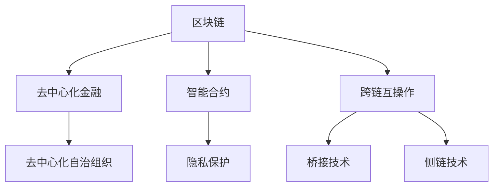

                 

# 未来的区块链：2050年的去中心化金融与智能合约

> 关键词：区块链, 去中心化金融, 智能合约, 去中心化自治组织, 加密货币, 隐私保护, 跨链互操作

## 1. 背景介绍

### 1.1 问题由来
区块链技术的诞生标志着互联网信息传递的革命，去中心化金融(DeFi)和智能合约是这一革命的显著成果，它们推动了金融和法律领域的根本变革。随着技术的不断进步，2050年区块链和智能合约的发展将进入一个全新的阶段，带来更为广泛、深远的影响。

### 1.2 问题核心关键点
2050年的区块链生态系统将在去中心化金融、智能合约和隐私保护等方面迎来重大突破，实现更高效、安全、可扩展的智能合约应用。本文将详细介绍去中心化金融与智能合约的发展历程和趋势，分析其面临的挑战与未来展望。

## 2. 核心概念与联系

### 2.1 核心概念概述

为更好地理解2050年的去中心化金融与智能合约，本节将介绍几个密切相关的核心概念：

- 区块链(Blockchain)：一种分布式、去中心化的数据库技术，通过共识机制确保数据的安全和透明。区块链本质上是一个由区块组成的链，每个区块包含一定量的交易记录。

- 去中心化金融(DeFi)：基于区块链技术构建的金融应用，如借贷、保险、交易等。去中心化金融旨在消除传统金融中介，实现点对点的金融服务。

- 智能合约(Smart Contract)：一种基于区块链的自动执行合约，通过代码实现合约规则。当合约条件满足时，智能合约可以自动执行预定的操作，无需中介。

- 去中心化自治组织(DAOs)：一种完全由成员共同管理、运营的去中心化组织形式，由智能合约控制其决策和运作。

- 隐私保护：区块链在确保数据透明的同时，必须解决隐私问题，通过零知识证明、同态加密等技术，保护用户隐私。

- 跨链互操作：不同区块链之间的信息交换和操作，通过桥接技术、侧链技术等方式实现，是未来区块链发展的关键方向。

这些核心概念之间的逻辑关系可以通过以下Mermaid流程图来展示：



这个流程图展示了大语言模型的核心概念及其之间的关系：

1. 区块链通过其分布式和去中心化的特点，为去中心化金融和智能合约提供了基础技术支持。
2. 去中心化金融通过智能合约在区块链上实现自动化金融服务，使得金融交易更加透明、高效。
3. 智能合约基于区块链构建，通过代码实现合约规则，自动化执行，减少了中介的介入。
4. 去中心化自治组织通过智能合约进行治理和运营，实现高度自治。
5. 隐私保护是区块链应用中的一个重要挑战，需要结合技术手段保护用户隐私。
6. 跨链互操作技术使得不同区块链之间可以互相通信和操作，拓展了区块链的应用场景。

这些概念共同构成了未来区块链的发展框架，使其能够支持更为复杂、多样化的应用场景。

## 3. 核心算法原理 & 具体操作步骤
### 3.1 算法原理概述

未来区块链的去中心化金融和智能合约系统，其核心算法原理主要基于共识机制、智能合约语言和隐私保护技术。以下是详细的介绍：

- **共识机制**：区块链的共识机制确保网络中所有节点的交易记录和状态达成一致。未来，去中心化金融和智能合约将面临更为复杂的交易和状态更新需求，共识机制的效率和安全性将是关键。常见的共识机制包括PoW、PoS、DPoS等，未来可能出现更为高效的共识算法。

- **智能合约语言**：智能合约的执行依赖于其代码的编写和执行。未来，智能合约语言将逐步标准化，并支持更为复杂的逻辑和操作。虚拟机技术的进步将使得智能合约执行更加高效和可靠。

- **隐私保护技术**：隐私保护是未来区块链技术的一个重要研究方向。零知识证明、同态加密、差分隐私等技术将为智能合约提供更强的隐私保护能力。同时，隐私计算和多方安全计算技术将进一步提升区块链应用的隐私保护水平。

### 3.2 算法步骤详解

未来区块链的去中心化金融与智能合约的构建，主要包括以下几个关键步骤：

**Step 1: 选择和设计区块链架构**
- 确定区块链的目标和需求，选择合适的共识机制和智能合约语言。
- 设计智能合约的功能和规则，确保其符合业务逻辑和安全要求。

**Step 2: 编写智能合约代码**
- 使用标准化智能合约语言编写智能合约代码，包括合约的初始化、触发条件、执行逻辑等。
- 进行充分的代码审查和测试，确保合约的正确性和安全性。

**Step 3: 部署和运行智能合约**
- 将智能合约部署到区块链网络，通过网络节点进行共识和验证。
- 验证通过后，智能合约开始执行，自动完成预定的操作。

**Step 4: 监控和维护智能合约**
- 对智能合约进行实时监控，跟踪其运行状态和执行结果。
- 定期进行合约的审计和升级，确保其持续安全和稳定。

### 3.3 算法优缺点

未来区块链的去中心化金融与智能合约系统具有以下优点：
1. 透明度高：所有交易和操作都在区块链上公开，便于监督和审计。
2. 效率高：智能合约自动化执行，无需中介，提高了交易速度和效率。
3. 安全性好：通过共识机制和隐私保护技术，提升了系统的安全性和抗攻击能力。
4. 灵活性高：智能合约可以根据业务需求灵活设计，扩展性强。

同时，该系统也存在一定的局限性：
1. 网络延迟：区块链共识机制可能带来较高的网络延迟，影响交易速度。
2. 扩展性差：区块链网络当前的扩展性仍有限，无法应对大规模的交易需求。
3. 法律风险：智能合约的法律地位和执行效力尚未完全明确，存在一定的法律风险。
4. 复杂度高：智能合约的编写和执行复杂，需要专业知识，难以被广泛应用。

尽管存在这些局限性，但就目前而言，去中心化金融与智能合约是区块链技术应用的重要范式，具有广阔的发展前景。未来相关研究的重点在于如何进一步提高系统的扩展性和安全性，同时降低使用的门槛和复杂度。

### 3.4 算法应用领域

未来区块链的去中心化金融与智能合约系统，在多个领域具有广泛的应用前景：

- 金融领域：实现去中心化借贷、保险、衍生品交易等金融服务，提升金融服务的透明度和效率。
- 供应链管理：通过智能合约管理供应链合同和货物追踪，实现供应链的自动化和可追溯性。
- 身份认证：利用智能合约和区块链技术进行身份认证和数据管理，提升数据的安全性和隐私性。
- 社会治理：通过智能合约和DAOs实现公共事务的自动化治理，提升公共服务的透明度和效率。
- 数字资产管理：利用智能合约管理数字资产，实现资产的自动交易和分配。

除了上述这些经典应用外，去中心化金融与智能合约还被创新性地应用于更多场景中，如去中心化投票、去中心化市场、去中心化能源等，为各行业带来新的发展机遇。

## 4. 数学模型和公式 & 详细讲解  
### 4.1 数学模型构建

本节将使用数学语言对未来区块链的去中心化金融与智能合约进行更加严格的刻画。

记区块链网络中的节点数为 $N$，共识机制为 $P$。假设智能合约 $C$ 的执行状态为 $S$，智能合约语言的执行结果为 $R$。则智能合约的执行流程可以表示为：

$$
S = f(C, P, R)
$$

其中 $f$ 为智能合约的执行函数，描述了智能合约在给定共识机制和执行结果下，如何更新其状态。

### 4.2 公式推导过程

以下是智能合约执行过程的详细数学模型：

1. 智能合约的初始状态 $S_0$ 为空集，表示智能合约的初始化。
2. 智能合约的执行状态 $S_t$ 满足递推关系：
   $$
   S_{t+1} = f(S_t, P_t, R_t)
   $$
3. 执行结果 $R_t$ 是智能合约在当前状态下所能执行的所有操作。
4. 共识机制 $P_t$ 是网络中所有节点的共识结果。

具体而言，智能合约的执行函数 $f$ 可以表示为：

$$
f(S, P, R) = 
\begin{cases}
S \cup R, & \text{如果所有节点都同意执行} \\
S, & \text{如果存在节点不同意执行}
\end{cases}
$$

这个模型展示了智能合约的执行状态如何根据共识机制和执行结果进行更新。

### 4.3 案例分析与讲解

以一个简单的贷款智能合约为例，展示其执行过程。假设智能合约的执行状态 $S$ 包含已归还的贷款数量，执行结果 $R$ 包括新的贷款请求和还款操作。共识机制 $P$ 表示网络节点对操作的共识结果。

1. 初始状态 $S_0$ 为空集，表示当前无贷款。
2. 当网络节点同意执行一个贷款请求时，智能合约将新贷款请求添加到状态中。
3. 当网络节点同意执行一个还款操作时，智能合约将还款金额从状态中减去。
4. 如果存在节点不同意执行操作，则状态保持不变。

这个案例展示了智能合约如何在共识机制和执行结果的共同作用下，自动更新状态并执行操作。

## 5. 项目实践：代码实例和详细解释说明
### 5.1 开发环境搭建

在进行智能合约开发前，我们需要准备好开发环境。以下是使用Solidity进行以太坊智能合约开发的环境配置流程：

1. 安装Node.js：从官网下载并安装Node.js，用于运行Solidity编译器和智能合约测试工具。

2. 安装Ganache：安装Ganache以太坊测试网络，用于本地开发和测试智能合约。

3. 安装Truffle：安装Truffle智能合约开发框架，提供Solidity编写和部署智能合约的支持。

4. 安装Web3.js：安装Web3.js JavaScript库，用于在Web应用中调用智能合约。

完成上述步骤后，即可在Ganache环境中开始智能合约开发。

### 5.2 源代码详细实现

下面以一个简单的贷款智能合约为例，给出使用Solidity编写和部署智能合约的代码实现。

首先，定义智能合约的函数：

```solidity
pragma solidity ^0.8.0;

contract Loan {
    address owner;
    uint256 balance;
    
    function Loan() public {
        owner = msg.sender;
    }
    
    function borrow(uint256 amount) public {
        require(msg.sender == owner, "Not the owner");
        require(balance + amount <= 1000000, "Not enough balance");
        balance += amount;
    }
    
    function repay(uint256 amount) public {
        require(msg.sender == owner, "Not the owner");
        require(amount <= balance, "Not enough balance");
        balance -= amount;
    }
}
```

然后，使用Truffle进行智能合约的部署和测试：

```bash
truffle develop
```

在Ganache环境中，启动智能合约的开发控制台：

```bash
solidity --network ganache
```

编写并部署智能合约：

```solidity
pragma solidity ^0.8.0;

contract Loan {
    address owner;
    uint256 balance;
    
    function Loan() public {
        owner = msg.sender;
    }
    
    function borrow(uint256 amount) public {
        require(msg.sender == owner, "Not the owner");
        require(balance + amount <= 1000000, "Not enough balance");
        balance += amount;
    }
    
    function repay(uint256 amount) public {
        require(msg.sender == owner, "Not the owner");
        require(amount <= balance, "Not enough balance");
        balance -= amount;
    }
}
```

在开发控制台中编译并部署智能合约：

```bash
solidity --network ganache
```

最后，启动测试脚本，验证智能合约的正确性和安全性：

```bash
test/Loan.test.js
```

### 5.3 代码解读与分析

让我们再详细解读一下关键代码的实现细节：

**Loan智能合约**：
- `Loan` 定义了智能合约的基本结构和功能，包括贷款和还款操作。
- `Loan` 的初始化函数 `Loan()` 定义了智能合约的创建者和初始状态。
- `borrow()` 函数用于申请贷款，需要验证发起者是否为合约创建者，且贷款总额是否超过可用余额。
- `repay()` 函数用于还款，同样需要验证发起者是否为合约创建者，且还款金额是否小于或等于可用余额。

**Truffle框架**：
- `truffle develop` 命令启动Truffle的开发环境，包括Ganache和Solidity编译器。
- `solidity --network ganache` 命令启动Solidity编译器，并在Ganache上编译智能合约。
- `test/Loan.test.js` 文件中定义了智能合约的测试用例，使用Mocha和Chai框架进行测试。

这些代码展示了如何通过Solidity和Truffle进行智能合约的编写、编译、部署和测试。开发者可以进一步扩展这些代码，实现更复杂的金融逻辑和业务功能。

## 6. 实际应用场景
### 6.1 去中心化金融系统

未来，去中心化金融系统将利用智能合约和区块链技术，实现各类去中心化金融服务，如借贷、保险、衍生品交易等。这些系统可以消除传统金融中介的介入，提升金融服务的透明度和效率。

在技术实现上，去中心化金融系统通过智能合约定义金融合约的条款和规则，在区块链上自动执行。用户可以自由地参与金融活动，无需中介机构的审批和监管，极大地降低了交易成本和时间。

### 6.2 供应链管理系统

未来的供应链管理系统将通过智能合约实现供应链合同和货物追踪的自动化管理，提高供应链的透明度和可追溯性。

具体而言，智能合约可以记录供应链中的所有交易和状态变化，并通过区块链上的不可篡改特性确保数据的真实性和完整性。供应链参与方可以在智能合约上协同工作，共享信息，实时跟踪货物的位置和状态，提升供应链的整体效率和可靠性。

### 6.3 数字身份认证

数字身份认证系统通过智能合约和区块链技术，实现身份信息的加密和管理，提升身份认证的安全性和隐私性。

具体而言，智能合约可以记录用户身份信息，通过零知识证明和同态加密技术保护用户的隐私。用户在需要验证身份时，只需提供必要的身份信息，智能合约可以自动验证身份的真实性，并提供可信的认证结果。

### 6.4 社会治理系统

未来，去中心化金融与智能合约将广泛应用于社会治理系统，通过智能合约和DAOs实现公共事务的自动化治理，提升公共服务的透明度和效率。

例如，智能合约可以定义公共资金的使用规则和流程，通过DAOs进行监督和执行，确保公共资金的透明和高效使用。智能合约还可以用于选举和投票系统，通过DAOs实现去中心化的投票和决策过程。

### 6.5 未来应用展望

随着区块链和智能合约技术的不断进步，未来在去中心化金融、智能合约和隐私保护等方面将迎来重大突破，实现更高效、安全、可扩展的智能合约应用。

1. **更高效的共识机制**：未来的共识机制将支持更多的参与节点和更高效的共识算法，解决当前区块链网络延迟和扩展性不足的问题。

2. **标准化的智能合约语言**：未来智能合约语言将逐步标准化，并支持更为复杂的逻辑和操作。虚拟机技术的进步将使得智能合约执行更加高效和可靠。

3. **强大的隐私保护技术**：零知识证明、同态加密、差分隐私等技术将为智能合约提供更强的隐私保护能力。同时，隐私计算和多方安全计算技术将进一步提升区块链应用的隐私保护水平。

4. **跨链互操作技术**：不同区块链之间的信息交换和操作，通过桥接技术、侧链技术等方式实现，拓展了区块链的应用场景。

5. **去中心化自治组织**：DAOs将实现更为智能和自动化的治理和运营，通过智能合约和区块链技术，提高公共事务的透明度和效率。

6. **智能合约生态系统**：未来将出现更多的智能合约应用和服务，如去中心化市场、去中心化能源、去中心化社交平台等，构建更为多样化的区块链应用场景。

## 7. 工具和资源推荐
### 7.1 学习资源推荐

为了帮助开发者系统掌握区块链和智能合约的技术基础和实践技巧，这里推荐一些优质的学习资源：

1. 《区块链技术与智能合约》系列博文：由区块链技术专家撰写，深入浅出地介绍了区块链原理、智能合约语言和开发实践。

2. 《Mastering Ethereum》书籍：Ethereum智能合约开发指南，详细讲解了以太坊的智能合约开发、测试和部署。

3. CS224N《密码学和数据结构》课程：斯坦福大学开设的密码学课程，涵盖区块链和智能合约的密码学基础和应用。

4. 《Blockchain Programming》书籍：区块链编程实战指南，介绍了多种区块链平台和智能合约语言的开发和应用。

5. Ethereum官方文档：Ethereum官方文档，提供了丰富的智能合约开发和部署的样例和教程，是学习区块链开发的最佳资源。

通过对这些资源的学习实践，相信你一定能够快速掌握区块链和智能合约的精髓，并用于解决实际的金融和商业问题。

### 7.2 开发工具推荐

高效的开发离不开优秀的工具支持。以下是几款用于区块链和智能合约开发的常用工具：

1. Solidity：以太坊智能合约的编程语言，用于编写智能合约代码。

2. Truffle：Ethereum智能合约开发框架，提供Solidity编写和部署智能合约的支持。

3. Ganache：Ethereum测试网络，用于本地开发和测试智能合约。

4. Web3.js：JavaScript库，用于在Web应用中调用智能合约。

5. MetaMask：以太坊钱包，支持智能合约的调用和交易。

6. Remix：在线智能合约开发平台，支持Solidity编程和智能合约调试。

合理利用这些工具，可以显著提升区块链和智能合约开发的效率，加快创新迭代的步伐。

### 7.3 相关论文推荐

区块链和智能合约技术的发展源于学界的持续研究。以下是几篇奠基性的相关论文，推荐阅读：

1. Bitcoin: A Peer-to-Peer Electronic Cash System（比特币白皮书）：提出区块链技术的核心思想，奠定了区块链技术的基础。

2. On the Semantics of Smart Contracts（智能合约语义研究）：探讨了智能合约的语义和逻辑表达，提出了智能合约的验证和执行机制。

3. Gas Fees and Transaction Burden of Ethereum Smart Contracts（以太坊智能合约的交易费用研究）：分析了以太坊智能合约的交易费用和负担，提出了优化策略。

4. Ethereu Smart Contract Security（以太坊智能合约安全）：探讨了智能合约的安全性和防御策略，提出了智能合约的审计和测试方法。

5. Decentralized Autonomy: Designing Decentralized Organizations（去中心化自治组织设计）：介绍了去中心化自治组织的原理和设计，提出了DAOs的治理和运营机制。

这些论文代表了大语言模型微调技术的发展脉络。通过学习这些前沿成果，可以帮助研究者把握学科前进方向，激发更多的创新灵感。

## 8. 总结：未来发展趋势与挑战

### 8.1 总结

本文对未来区块链的去中心化金融与智能合约方法进行了全面系统的介绍。首先阐述了去中心化金融与智能合约的研究背景和意义，明确了智能合约在拓展区块链应用、提升金融服务透明度和效率方面的独特价值。其次，从原理到实践，详细讲解了智能合约的数学模型和核心算法，给出了智能合约任务开发的完整代码实例。同时，本文还广泛探讨了智能合约在去中心化金融、供应链管理、身份认证、社会治理等多个领域的应用前景，展示了智能合约范式的巨大潜力。此外，本文精选了智能合约技术的各类学习资源，力求为读者提供全方位的技术指引。

通过本文的系统梳理，可以看到，未来区块链的去中心化金融与智能合约技术将在多个领域带来深远影响。区块链和智能合约的强大能力，将推动金融、供应链、身份认证等行业的变革，提升公共事务的透明度和效率，构建更为安全、可靠、可控的智能系统。未来，区块链和智能合约技术还需要与其他人工智能技术进行更深入的融合，如知识表示、因果推理、强化学习等，多路径协同发力，共同推动区块链技术的进步。

### 8.2 未来发展趋势

展望未来，去中心化金融与智能合约技术将呈现以下几个发展趋势：

1. **更高效的共识机制**：未来的共识机制将支持更多的参与节点和更高效的共识算法，解决当前区块链网络延迟和扩展性不足的问题。

2. **标准化的智能合约语言**：未来智能合约语言将逐步标准化，并支持更为复杂的逻辑和操作。虚拟机技术的进步将使得智能合约执行更加高效和可靠。

3. **强大的隐私保护技术**：零知识证明、同态加密、差分隐私等技术将为智能合约提供更强的隐私保护能力。同时，隐私计算和多方安全计算技术将进一步提升区块链应用的隐私保护水平。

4. **跨链互操作技术**：不同区块链之间的信息交换和操作，通过桥接技术、侧链技术等方式实现，拓展了区块链的应用场景。

5. **去中心化自治组织**：DAOs将实现更为智能和自动化的治理和运营，通过智能合约和区块链技术，提高公共事务的透明度和效率。

6. **智能合约生态系统**：未来将出现更多的智能合约应用和服务，如去中心化市场、去中心化能源、去中心化社交平台等，构建更为多样化的区块链应用场景。

### 8.3 面临的挑战

尽管去中心化金融与智能合约技术已经取得了瞩目成就，但在迈向更加智能化、普适化应用的过程中，它仍面临着诸多挑战：

1. **共识机制的效率和安全性**：当前的共识机制难以满足大规模交易的需求，如何解决扩展性和安全性问题是关键。

2. **智能合约的编写和维护**：智能合约的编写和维护复杂，需要专业知识，如何降低使用门槛和提高安全性和稳定性是重要课题。

3. **隐私保护技术**：区块链在确保数据透明的同时，必须解决隐私问题，如何提供强有力的隐私保护措施是关键。

4. **跨链互操作**：不同区块链之间的信息交换和操作，存在一定的复杂性和技术挑战。

5. **法律法规的不确定性**：智能合约的法律地位和执行效力尚未完全明确，存在一定的法律风险。

6. **技术成熟度**：去中心化金融与智能合约技术仍处于发展初期，技术成熟度和可靠性有待提高。

尽管存在这些挑战，但去中心化金融与智能合约技术具有广阔的应用前景，值得持续投入研究。未来相关研究的重点在于如何进一步提高系统的扩展性和安全性，同时降低使用的门槛和复杂度。

### 8.4 研究展望

面对去中心化金融与智能合约技术所面临的种种挑战，未来的研究需要在以下几个方面寻求新的突破：

1. **探索新的共识机制**：开发更为高效和安全的共识算法，如PoS、DPoS等，以提高区块链的扩展性和安全性。

2. **标准化智能合约语言**：推动智能合约语言的逐步标准化和规范化，提升智能合约的可读性和可维护性。

3. **结合隐私计算**：引入隐私计算和多方安全计算技术，增强智能合约的隐私保护能力。

4. **跨链互操作技术**：探索桥接技术和侧链技术，实现不同区块链之间的互操作和数据共享。

5. **去中心化自治组织**：研究DAOs的治理和运营机制，实现智能合约的自动化和透明化管理。

6. **应用落地**：将智能合约技术应用于更多实际场景，如去中心化金融、供应链管理、身份认证等，推动智能合约技术的产业化进程。

这些研究方向的探索，必将引领去中心化金融与智能合约技术迈向更高的台阶，为构建安全、可靠、可解释、可控的智能系统铺平道路。面向未来，去中心化金融与智能合约技术还需要与其他人工智能技术进行更深入的融合，如知识表示、因果推理、强化学习等，多路径协同发力，共同推动区块链技术的进步。

## 9. 附录：常见问题与解答

**Q1：智能合约在实际应用中面临哪些挑战？**

A: 智能合约在实际应用中面临以下挑战：
1. 编写复杂度高：智能合约的编写和维护需要专业知识和技能，门槛较高。
2. 安全性和稳定性：智能合约的代码漏洞可能导致安全问题，需要通过测试和审计确保其安全性。
3. 执行效率低：大规模交易可能导致智能合约执行效率低下，需要优化合约设计和执行策略。
4. 法律和监管问题：智能合约的法律地位和监管问题尚未完全明确，可能带来法律风险。

**Q2：未来如何提高智能合约的扩展性和安全性？**

A: 未来可以通过以下措施提高智能合约的扩展性和安全性：
1. 开发高效的共识机制：引入PoS、DPoS等共识算法，提高区块链的扩展性和安全性。
2. 标准化智能合约语言：推动智能合约语言的逐步标准化，提升合约的可读性和可维护性。
3. 引入隐私计算：使用零知识证明、同态加密等技术，增强智能合约的隐私保护能力。
4. 探索跨链互操作技术：通过桥接技术和侧链技术，实现不同区块链之间的互操作和数据共享。

**Q3：智能合约的编写和测试需要注意哪些问题？**

A: 智能合约的编写和测试需要注意以下问题：
1. 代码审查和测试：对智能合约进行充分的代码审查和测试，确保其正确性和安全性。
2. 模拟测试：在测试环境中模拟不同的场景和操作，验证智能合约的正确性和鲁棒性。
3. 自动化测试：使用自动化测试工具，提高测试效率和覆盖面。
4. 社区验证：在公开的区块链网络上进行社区验证，确保智能合约的透明性和公正性。

**Q4：智能合约的跨链互操作技术有哪些？**

A: 智能合约的跨链互操作技术包括：
1. 桥接技术：通过建立跨链桥接协议，实现不同区块链之间的信息交换和操作。
2. 侧链技术：通过建立侧链网络，实现不同区块链之间的协同运作和数据共享。
3. 原子交易协议：通过引入原子交易协议，实现跨链交易的可靠性和安全性。

**Q5：智能合约的隐私保护技术有哪些？**

A: 智能合约的隐私保护技术包括：
1. 零知识证明：通过零知识证明技术，确保数据的安全传输和隐私保护。
2. 同态加密：对数据进行同态加密，在保护隐私的前提下进行计算。
3. 差分隐私：通过对数据进行差分隐私处理，保护用户的隐私信息。

通过这些措施，可以最大限度地保护智能合约的隐私和安全性，推动智能合约技术的广泛应用。

---

作者：禅与计算机程序设计艺术 / Zen and the Art of Computer Programming

