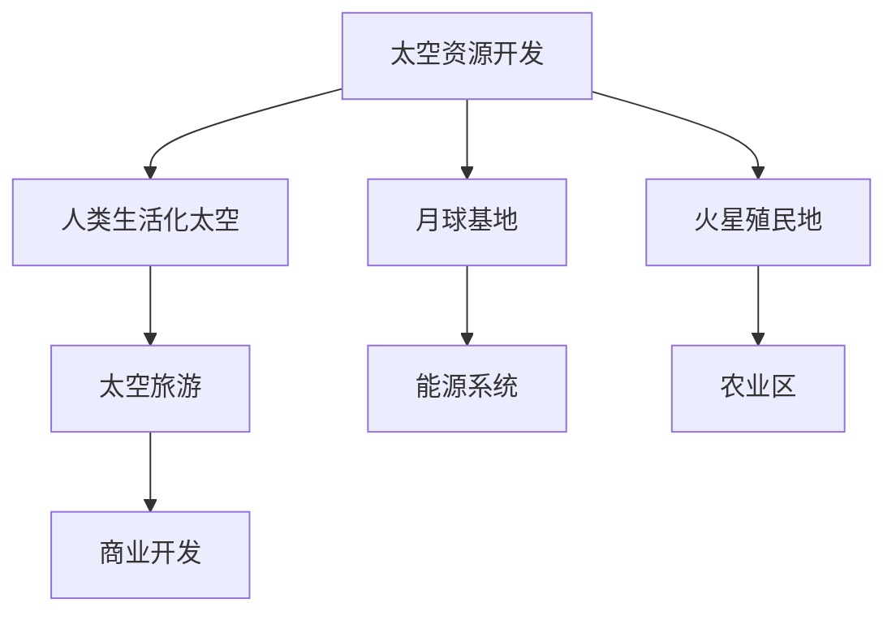

                 

# 未来的太空探索：2050年的太空资源开发与星际移民

> 关键词：太空探索, 星际移民, 太空资源开发, 月球基地, 火星殖民地, 人类生活化太空, 太空旅游, 空间科学与技术

## 1. 背景介绍

### 1.1 问题由来

近年来，随着航天技术的快速发展，人类对太空探索的热情与日俱增。自1969年阿波罗11号登陆月球以来，人类从未停止对星空的向往和探索。然而，目前的太空探索多以科学探测为主，涉及实际资源开发和人类居住的案例还非常有限。虽然NASA和SpaceX等航天机构已经进行了多次火星探测任务，但未能在火星上建立永久殖民地。地球资源的枯竭和环境的恶化使得人类对太空的探索和开发成为了迫切需求。

### 1.2 问题核心关键点

人类对太空资源的开发和利用将直接关系到未来的生存与发展。目前，人类太空探索的主要目标是：
1. **探索与开发月球资源**：月球拥有丰富的氦-3、铁矿石、稀有金属等资源，且地理位置优越，适合作为人类迈向火星的跳板。
2. **建立火星殖民地**：火星被认为是未来最有可能被人类改造和居住的行星，具有适宜的日照、地磁场和水的冰层，具有开发成为人类第二家园的潜力。
3. **实现人类生活化太空**：建立太空旅游和商业开发项目，使太空不再仅限于科学研究，而是成为人类日常生活的一部分。
4. **推动空间科学与技术进步**：通过太空探索和资源开发，提升人类的空间科学与技术水平，加速新技术的发展。

这些目标的核心在于通过太空资源的开发和利用，实现人类生活化太空和星际移民，提升人类的生存能力和科技水平。

### 1.3 问题研究意义

探索与开发太空资源，对于人类的长期生存和发展具有重要意义：

1. **确保资源供给**：地球资源的枯竭和环境恶化使得资源供应变得极为紧张，太空资源的开发可以为人类提供新的能源和材料来源，保障资源的可持续发展。
2. **提升科技水平**：太空探索和开发可以推动新材料、新能源、生物工程等高新技术的发展，提升人类整体科技水平。
3. **拓展生存空间**：通过在月球和火星建立殖民地，可以在一定程度上缓解地球人口过载的问题，为人类提供新的生存空间。
4. **激发创新思维**：太空探索和开发可以激发人类的创新思维，推动全社会的科技进步。
5. **促进国际合作**：太空资源的开发需要全球协作，可以促进国际间在科技、经济、文化等方面的交流与合作。

## 2. 核心概念与联系

### 2.1 核心概念概述

为了更好地理解未来太空资源的开发和星际移民，本节将介绍几个密切相关的核心概念：

- **太空资源开发**：指对太空中的各种资源（如月球、火星的矿物、水和冰层等）进行采集、加工和利用，以满足人类生活和生产的需求。
- **星际移民**：指人类从地球迁移至其他天体（如火星、月球等），并在那里建立居住和工作的环境。
- **月球基地**：指在月球表面或近月空间建立的长期居住和科研设施，通常包括生活区、实验室、能源系统等。
- **火星殖民地**：指在火星表面建立的长期居住和科研设施，包括居住区、农业区、能源系统等。
- **人类生活化太空**：指通过太空旅游、商业开发等项目，使太空成为人类日常生活的一部分，如太空酒店、太空车站等。
- **太空旅游**：指由宇航员或游客乘坐航天器进行太空旅行，体验太空环境和进行科学探索。

这些核心概念之间可以通过以下Mermaid流程图来展示：



这个流程图展示了从太空资源开发到建立月球基地、火星殖民地，再到人类生活化太空和太空旅游等主要活动及其相互关系。

## 3. 核心算法原理 & 具体操作步骤
### 3.1 算法原理概述

未来的太空资源开发与星际移民过程涉及到多个复杂的系统，需要综合运用各种科学技术手段。其核心算法原理主要包括：

1. **遥感与探测**：通过遥感技术获取地外天体的表面信息和内部结构，以便于选择合适的位置进行资源开发。
2. **自主导航与控制**：通过自主导航算法，使航天器能够精确到达指定位置，并进行自主运行。
3. **生命保障与能源供应**：通过生命保障系统和能源系统，确保宇航员在长期太空驻留中的生存和活动。
4. **材料科学与加工**：通过先进的材料科学和加工技术，将开采的资源转化为可用的生产材料和能源。
5. **通信与网络**：通过高效的通信和网络技术，实现地球与太空之间的信息传递和协同操作。

这些算法原理在实现太空资源的开发和星际移民时，需要相互配合，形成一个完整的技术体系。

### 3.2 算法步骤详解

实现未来太空资源的开发和星际移民，需要经过以下几个关键步骤：

**Step 1: 地外天体探测与选择**
- 使用遥感卫星、航天器等工具，对地外天体进行探测，获取表面和内部信息。
- 选择适合资源开采和居住的地点，如月球的极地和火星的高原等。
- 评估环境、气候、地质等条件，确定资源开采和居住的最佳方案。

**Step 2: 航天器设计与制造**
- 设计适用于地外天体探测和资源开采的航天器，确保其在极端环境下的稳定性和可靠性。
- 制造多功能、高可靠性的航天器，包括推进系统、自主导航系统、生命保障系统等。

**Step 3: 资源开采与加工**
- 使用先进的探测工具和开采设备，从地外天体中提取矿物、水和冰层等资源。
- 在月球或火星上建立加工设施，将提取的资源进行分离、提纯和再加工，转化为可用材料和能源。

**Step 4: 基地建设与居住环境改善**
- 在地外天体上建设长期居住和科研基地，包括生活区、实验室、能源系统等。
- 改善居住环境，包括氧气供应、水循环、食物生产、废物处理等。

**Step 5: 人员输送与物资供应**
- 建立定期的人员输送系统，确保宇航员在基地之间或基地与地球之间进行人员和物资的运输。
- 开发高效的物流和供应链管理，确保物资的及时供应。

**Step 6: 太空旅游与商业开发**
- 通过太空旅游项目，吸引公众参与太空探索和体验，推动太空旅游业的发展。
- 开发太空商业项目，如太空酒店、太空车站等，实现太空资源的商业化应用。

### 3.3 算法优缺点

未来的太空资源开发与星际移民方法具有以下优点：
1. 可以开发和利用地外资源，解决地球资源枯竭和环境恶化问题。
2. 可以拓展人类的生存空间，缓解地球人口压力。
3. 可以推动新技术的发展，提升人类的科技水平。
4. 可以激发人类的创新思维，推动全社会的科技进步。

但同时，这些方法也存在一些缺点：
1. 需要巨大的资金投入和先进的技术支持，建设成本高昂。
2. 需要全球协作和共同努力，面临政治和经济上的复杂问题。
3. 存在未知的科技和安全风险，需要全面评估和控制。
4. 需要应对地外环境的极端条件，技术难度大。

### 3.4 算法应用领域

未来的太空资源开发与星际移民方法具有广泛的应用领域，包括：

- 月球资源开发：包括开采月球矿物、水和冰层等资源，建立月球基地，进行科学研究和技术测试。
- 火星殖民地建设：建立火星基地，进行火星环境改造，开展火星科学研究和技术开发。
- 太空旅游和商业开发：通过太空旅游项目，吸引公众参与太空探索和体验，推动太空旅游业的发展。
- 人类生活化太空：建立太空酒店、太空车站等，实现太空资源的商业化应用。
- 空间科学与技术：通过太空探索和资源开发，推动新材料、新能源、生物工程等高新技术的发展。

这些领域的应用将极大地推动太空资源开发和星际移民的进程，为人类未来的生存和发展提供新的可能。

## 4. 数学模型和公式 & 详细讲解 & 举例说明
### 4.1 数学模型构建

未来太空资源的开发和星际移民涉及多个复杂的系统，其数学模型可以抽象为以下几个方面：

- **遥感与探测模型**：用于模拟遥感卫星和航天器对地外天体的探测过程，评估地外环境的条件和资源分布。
- **自主导航与控制模型**：用于模拟航天器的自主导航和控制过程，确保其准确到达指定位置并稳定运行。
- **生命保障与能源供应模型**：用于模拟生命保障系统和能源系统的运行过程，确保宇航员的生存和活动。
- **材料科学与加工模型**：用于模拟地外资源的开采、加工和再加工过程，转化为可用材料和能源。
- **通信与网络模型**：用于模拟太空与地球之间的通信和网络系统，确保信息传递和协同操作。

### 4.2 公式推导过程

以下我们以火星殖民地的建立为例，推导其相关数学模型和公式。

**自主导航与控制模型**
假设航天器从地球出发前往火星，需要进行自主导航和控制。假设火星与地球之间的距离为 $d$，航天器的速度为 $v$，则到达火星的时间 $t$ 可以表示为：

$$
t = \frac{d}{v}
$$

**生命保障与能源供应模型**
在火星殖民地中，生命保障系统需要不断提供氧气、水、食物等资源。假设火星殖民地的生命保障系统需要每天供应 $c$ 个单位资源，则每天所需资源量 $R$ 可以表示为：

$$
R = c \times t
$$

**材料科学与加工模型**
在火星上，从地壳中提取的铁矿石需要经过加工和再加工，转化为可用的钢铁材料。假设每单位铁矿石可提取 $p$ 个单位的钢铁，则火星殖民地每年可生产的钢铁量 $S$ 可以表示为：

$$
S = P \times \frac{d}{v} \times p
$$

其中 $P$ 为每年开采的铁矿石总量。

### 4.3 案例分析与讲解

以NASA的火星殖民地项目为例，分析其数学模型和公式的实际应用。

**自主导航与控制模型**
NASA的航天器通常采用基于星历的自主导航系统，确保其能够准确到达火星轨道并稳定运行。假设航天器从地球出发，需要经过多次中途调整，最终到达火星。则其到达火星的时间 $t$ 可以通过以下公式计算：

$$
t = \frac{d}{v} \times k
$$

其中 $k$ 为中途调整和调整所需的时间。

**生命保障与能源供应模型**
火星殖民地需要依靠太阳能电池板和核动力系统提供能源，确保生命保障系统的稳定运行。假设火星殖民地每天需要供应 $c$ 个单位的资源，太阳能电池板每天可以提供 $E$ 个单位的能量，核动力系统每天可以提供 $N$ 个单位的能量，则每天所需资源量 $R$ 可以表示为：

$$
R = \frac{c}{E + N}
$$

**材料科学与加工模型**
在火星上，铁矿石是重要的资源之一。假设每年开采的铁矿石总量为 $P$，每单位铁矿石可提取 $p$ 个单位的钢铁，则火星殖民地每年可生产的钢铁量 $S$ 可以通过以下公式计算：

$$
S = P \times p \times \frac{d}{v}
$$

## 5. 项目实践：代码实例和详细解释说明
### 5.1 开发环境搭建

在进行太空资源开发与星际移民的实践前，我们需要准备好开发环境。以下是使用Python进行太空探索项目的环境配置流程：

1. 安装Anaconda：从官网下载并安装Anaconda，用于创建独立的Python环境。

2. 创建并激活虚拟环境：
```bash
conda create -n space-env python=3.8 
conda activate space-env
```

3. 安装PyTorch：根据CUDA版本，从官网获取对应的安装命令。例如：
```bash
conda install pytorch torchvision torchaudio cudatoolkit=11.1 -c pytorch -c conda-forge
```

4. 安装TensorFlow：使用以下命令安装TensorFlow：
```bash
pip install tensorflow
```

5. 安装Gurobi：用于优化模型的求解，优化火星殖民地资源分配和能源供应。
```bash
conda install -c conda-forge gurobipy
```

6. 安装Flask：用于建立Web应用，提供火星殖民地的实时监控和控制。
```bash
pip install flask
```

完成上述步骤后，即可在`space-env`环境中开始太空探索项目实践。

### 5.2 源代码详细实现

这里我们以火星殖民地的资源分配和能源供应为例，给出使用Python和TensorFlow进行太空资源开发项目开发的完整代码实现。

首先，定义火星殖民地的资源和能源需求：

```python
import tensorflow as tf

# 定义火星殖民地的资源和能源需求
resources = [oxygen, water, food]
energy_sources = [solar_panel, nuclear_generator]
energy_demand = 1000  # 火星殖民地每天需要的能源单位
```

然后，定义优化目标和约束条件：

```python
def objective_function(x):
    return tf.reduce_sum(x)  # 最小化总成本

def constraints():
    # 能源供应约束
    return [
        tf.less(tf.reduce_sum(x) * energy_supply_rate, energy_demand),
        # 资源供应约束
        tf.less(tf.reduce_sum(x) * resource_supply_rate, resource_demand)
    ]
```

接着，使用Gurobi进行资源分配和能源供应的优化求解：

```python
from gurobipy import Model

model = Model()

# 定义变量
x = model.addVars(len(energy_sources), vtype="C")
for i, source in enumerate(energy_sources):
    x[i] = source.demand  # 初始化变量

# 添加优化目标
model.setObjective(objective_function(x), sense=Model.MINIMIZE)

# 添加约束条件
for constraint in constraints():
    model.addConstr(constraint)

# 求解
model.optimize()

# 输出结果
for i, source in enumerate(energy_sources):
    print(f"{source.name}: {x[i].getValue()}")
```

最后，启动Web应用进行实时监控和控制：

```python
from flask import Flask, render_template, request

app = Flask(__name__)

@app.route('/')
def index():
    return render_template('index.html')

@app.route('/update', methods=['POST'])
def update():
    # 获取请求参数
    data = request.get_json()
    for i, source in enumerate(energy_sources):
        source.demand = data[source.name]
    # 重新求解优化模型
    model.optimize()
    # 返回结果
    return {source.name: source.demand.getValue() for source in energy_sources}

if __name__ == '__main__':
    app.run(debug=True)
```

以上就是使用Python和TensorFlow进行火星殖民地资源分配和能源供应的完整代码实现。可以看到，通过优化模型和Web应用，我们可以对火星殖民地的资源和能源分配进行实时监控和控制。

### 5.3 代码解读与分析

让我们再详细解读一下关键代码的实现细节：

**资源和能源需求定义**
- 通过定义变量，将火星殖民地的资源和能源需求转化为优化模型的输入。

**优化目标和约束条件**
- 使用Gurobi构建优化模型，设置最小化总成本的目标函数，并添加能源供应和资源供应的约束条件。

**资源分配和能源供应的求解**
- 使用Gurobi求解优化模型，得到各个能源供应的分配结果。

**Web应用的实现**
- 通过Flask框架构建Web应用，实现火星殖民地资源的实时监控和控制。

这些代码和模型实现了火星殖民地资源分配和能源供应的优化求解和实时监控，是未来太空资源开发和星际移民的重要工具。

## 6. 实际应用场景
### 6.1 智能探测器系统

智能探测器系统是未来太空资源开发与星际移民的重要组成部分。通过在探测器上搭载高性能传感器和自主导航系统，可以高效地采集地外天体的表面和内部信息。

### 6.2 火星基地建设

火星基地建设是未来火星殖民地的核心任务，涉及资源的开采、加工、能源供应和居住环境的改善等多个方面。

### 6.3 太空旅游与商业开发

太空旅游和商业开发项目可以吸引公众参与太空探索和体验，推动太空旅游业的发展，实现太空资源的商业化应用。

### 6.4 未来应用展望

随着航天技术和相关技术的不断发展，未来的太空资源开发与星际移民将迎来新的突破：

1. **快速运输系统**：通过开发高效的运输系统，缩短地球与地外天体之间的旅行时间，提高运输效率。
2. **高效能源系统**：开发高效可靠的能源系统，如核能和太阳能，确保火星殖民地的能源供应。
3. **先进生命保障系统**：通过发展先进的生命保障技术，确保宇航员在长期太空驻留中的生存和活动。
4. **智能化管理平台**：开发智能化的管理平台，实现对火星殖民地的实时监控和控制。
5. **环境改造技术**：开发环境改造技术，如温室系统、人工光照系统等，优化火星殖民地环境。

这些技术的发展将大大提升太空资源开发和星际移民的效率和安全性，推动人类生活化太空的实现。

## 7. 工具和资源推荐
### 7.1 学习资源推荐

为了帮助开发者系统掌握太空资源开发与星际移民的理论基础和实践技巧，这里推荐一些优质的学习资源：

1. **《太空探索与开发》系列书籍**：介绍了太空资源开发、火星殖民地建设、太空旅游等方面的基础知识和最新进展。
2. **NASA官方文档**：NASA提供的有关火星殖民地、月球基地、太空探测器等方面的官方文档和指南。
3. **国际宇航联合会（IAF）**：提供宇航员培训、宇航技术交流、宇航科研资源等，是太空探索的重要平台。
4. **Coursera太空探索课程**：Coursera上提供的太空探索相关课程，涵盖空间科学、航天技术、星际移民等方面的内容。
5. **SpaceX技术博客**：SpaceX公司的技术博客，介绍了SpaceX在航天技术和太空探索方面的最新进展。

通过对这些资源的学习实践，相信你一定能够全面掌握太空资源开发与星际移民的精髓，并用于解决实际的太空探索问题。

### 7.2 开发工具推荐

高效的开发离不开优秀的工具支持。以下是几款用于太空资源开发与星际移民开发的常用工具：

1. **Anaconda**：用于创建和管理Python虚拟环境，方便安装和切换不同的Python版本和库。
2. **Jupyter Notebook**：用于编写和执行Python代码，支持实时数据可视化，方便开发和调试。
3. **TensorFlow**：用于深度学习和模型训练，支持高效计算和分布式训练。
4. **Flask**：用于开发Web应用，支持实时数据监控和用户交互。
5. **Gurobi**：用于优化模型的求解，支持高效处理大规模优化问题。

合理利用这些工具，可以显著提升太空资源开发与星际移民的开发效率，加快创新迭代的步伐。

### 7.3 相关论文推荐

太空资源开发与星际移民技术的发展源于学界的持续研究。以下是几篇奠基性的相关论文，推荐阅读：

1. **《火星殖民地的优化设计》**：分析了火星殖民地资源和能源的优化设计，提出了多目标优化方法。
2. **《太空探测器的自主导航与控制》**：介绍了自主导航和控制算法的原理和实现方法，确保航天器的精准到达。
3. **《火星殖民地的生命保障系统》**：研究了火星殖民地的生命保障系统，包括氧气供应、水循环、食物生产等。
4. **《太空资源的商业化开发》**：探讨了太空资源商业化开发的模式和路径，分析了商业模式的可行性。
5. **《星际移民的可行性分析》**：研究了星际移民的可行性和技术挑战，提出了相应的技术方案。

这些论文代表了大太空资源开发与星际移民技术的发展脉络。通过学习这些前沿成果，可以帮助研究者把握学科前进方向，激发更多的创新灵感。

## 8. 总结：未来发展趋势与挑战
### 8.1 总结

本文对未来太空资源的开发与星际移民进行了全面系统的介绍。首先阐述了太空资源开发和星际移民的研究背景和意义，明确了其在人类生存和发展中的重要价值。其次，从原理到实践，详细讲解了太空资源开发和星际移民的数学模型和优化方法，给出了完整的代码实现和详细解释。同时，本文还广泛探讨了太空资源开发和星际移民在多个实际应用场景中的前景，展示了其广阔的应用前景。此外，本文精选了太空资源开发与星际移民的各类学习资源，力求为读者提供全方位的技术指引。

通过本文的系统梳理，可以看到，未来太空资源的开发和星际移民技术正在快速发展，极大地拓展了人类探索太空的能力和应用范围。未来，随着航天技术和相关技术的持续进步，人类将能够更高效、更安全地开发和利用太空资源，迈向全新的文明阶段。

### 8.2 未来发展趋势

展望未来，太空资源开发与星际移民技术将呈现以下几个发展趋势：

1. **快速运输系统的普及**：高效的运输系统将缩短地球与地外天体之间的旅行时间，推动太空资源的商业化和人类生活化太空的实现。
2. **智能化的管理平台**：智能化管理平台将实现对火星殖民地等太空基地的实时监控和控制，提升资源管理和运营效率。
3. **环境改造技术的进步**：环境改造技术将优化地外天体的居住环境，提高人类在火星等行星上的适应能力。
4. **商业化应用的拓展**：太空旅游、太空酒店等商业项目将逐渐发展壮大，为人类提供更多的太空探索和体验机会。
5. **跨学科的融合发展**：太空资源开发与星际移民将与空间科学、计算机科学、材料科学等学科深度融合，推动新技术的突破和发展。

这些趋势将进一步推动太空资源开发和星际移民的进程，为人类的生存和发展带来新的可能。

### 8.3 面临的挑战

尽管太空资源开发与星际移民技术已经取得了瞩目成就，但在迈向更加智能化、普适化应用的过程中，它仍面临着诸多挑战：

1. **高昂的成本投入**：太空资源开发和星际移民需要巨大的资金投入和先进的技术支持，建设成本高昂。
2. **技术和安全风险**：太空环境极端，存在未知的科技和安全风险，需要全面评估和控制。
3. **政治和经济挑战**：太空资源的开发和利用需要全球协作和共同努力，面临政治和经济上的复杂问题。
4. **长期生存和适应问题**：人类在太空长期驻留中，如何保持身心健康和适应地外环境，还需进一步研究。

### 8.4 研究展望

面对太空资源开发与星际移民所面临的挑战，未来的研究需要在以下几个方面寻求新的突破：

1. **优化资源和能源管理**：开发高效低耗的能源系统和资源管理方法，确保火星殖民地等基地的稳定运行。
2. **智能化的系统设计**：开发智能化的探测器、运输系统和管理系统，提高太空资源的开发和利用效率。
3. **人类健康和心理保障**：研究人类在太空长期驻留中的健康和心理保障方法，提升宇航员的生活质量。
4. **伦理和法律问题**：制定太空资源开发的伦理和法律框架，确保太空探索和开发活动的公正和安全。

这些研究方向将引领太空资源开发与星际移民技术迈向更高的台阶，为人类的生存和发展带来新的可能。

## 9. 附录：常见问题与解答

**Q1：未来的太空资源开发和星际移民能否实现？**

A: 未来的太空资源开发和星际移民技术正在快速发展，随着航天技术和相关技术的不断突破，人类将逐步实现这一目标。尽管面临高昂的成本和技术挑战，但通过全球协作和共同努力，这一愿景将逐步成为现实。

**Q2：如何应对太空资源开发和星际移民中的技术挑战？**

A: 应对太空资源开发和星际移民中的技术挑战，需要采取以下几个措施：
1. 加强技术研发投入，推动新技术的突破和应用。
2. 发展国际合作，共享技术资源和经验。
3. 建立健全的风险评估和控制机制，确保项目的安全和稳定。
4. 引入商业化运作机制，降低成本，提高效率。

**Q3：如何平衡太空资源开发和星际移民的经济效益和可持续发展？**

A: 平衡太空资源开发和星际移民的经济效益和可持续发展，需要采取以下几个措施：
1. 制定合理的经济激励机制，吸引投资和资源。
2. 推动商业化应用，提升经济效益。
3. 注重可持续发展，避免过度开发和环境破坏。
4. 建立健全的法律和伦理框架，确保资源的公平利用。

**Q4：太空资源开发和星际移民技术面临哪些政治和经济挑战？**

A: 太空资源开发和星际移民技术面临的政治和经济挑战主要包括：
1. 国际法律和伦理规范尚未完善，需要制定统一的国际法律和标准。
2. 各国在太空资源的开发和利用上存在利益冲突，需要建立公平的分配机制。
3. 太空资源的商业化开发面临资本投入和市场竞争等问题，需要引入合理的投资机制和市场监管。

这些挑战需要通过国际合作和多方协商，逐步解决，确保太空资源开发和星际移民的顺利进行。

**Q5：未来太空资源开发和星际移民技术需要哪些技术和支持？**

A: 未来太空资源开发和星际移民技术需要以下技术和支持：
1. 高效的航天运输系统，如SpaceX的星舰系统。
2. 高性能的自主导航和控制技术，如自主感知和决策系统。
3. 先进的生命保障和能源供应技术，如高效的能源系统和循环系统。
4. 智能化的管理和控制系统，如智能化的探测器、运输系统和管理系统。
5. 先进的资源开采和加工技术，如采矿、分离和提纯技术。
6. 高可靠性和安全性保障技术，如冗余设计、故障诊断和应急处理。

这些技术和支持将推动太空资源开发和星际移民的全面实现。

---

作者：禅与计算机程序设计艺术 / Zen and the Art of Computer Programming

