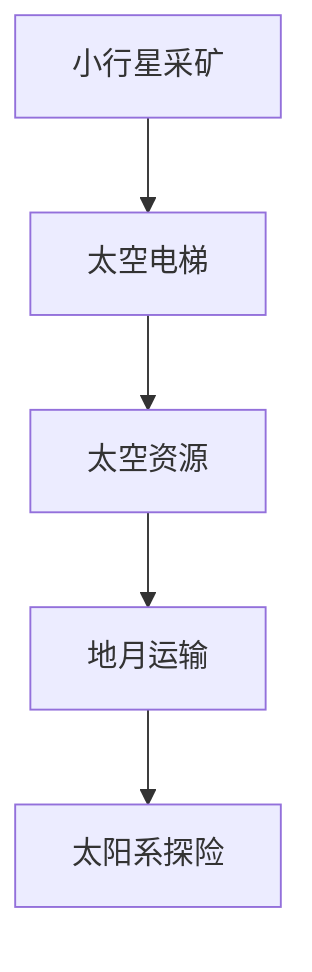

                 

# 未来的太空探索：2050年的小行星采矿与太空电梯

## 1. 背景介绍

在遥远的未来，太空探索已经不再是科幻小说中的情节，而是成为人类社会的重要组成部分。随着技术的发展，人类已经能够对其他星球进行探索和利用，而小行星采矿和太空电梯成为了这一时代的重要象征。本文将深入探讨这些技术的前景和挑战，并展望2050年的未来太空探索。

## 2. 核心概念与联系

### 2.1 核心概念概述

在讨论未来的太空探索时，以下几个核心概念至关重要：

- **小行星采矿**：从近地小行星或其他小行星上提取宝贵资源，如贵金属、水冰等。
- **太空电梯**：构建从地球表面到太空轨道的高效运输系统，大大降低太空运输成本。
- **太空资源**：包括小行星上的矿物质、水冰、氦-3等，以及月球、火星等星球的矿产资源。
- **地月运输**：利用太空电梯实现地球与月球之间的快速、廉价运输。
- **太阳系探险**：包括对火星、木星、土星等太阳系其他行星的探索和研究。

这些概念之间的关系可以通过以下Mermaid流程图来展示：



这个流程图展示了大规模太空探索的关键技术环节，从资源的开采到运输再到深空探险，每个环节都密不可分。

## 3. 核心算法原理 & 具体操作步骤
### 3.1 算法原理概述

小行星采矿和太空电梯的构建，依赖于现代航天技术、材料科学、机器人技术等多个领域的先进知识。其核心算法和操作步骤主要包括以下几个方面：

1. **小行星探测与采矿**：通过探测器对小行星进行详细勘探，确定资源的分布和开采难度，然后设计适合的采矿设备和技术。
2. **太空电梯设计**：根据轨道力学原理，设计太空电梯的结构和材料，使其能够承受巨大的拉力和温度变化。
3. **机器人与自动化**：使用高度先进的机器人进行资源的开采和加工，以及太空电梯的维护和操作。
4. **地月运输**：利用太空电梯将资源从小行星或月球输送到地球，并进行进一步的加工和利用。

### 3.2 算法步骤详解

#### 3.2.1 小行星探测与采矿

1. **初步勘探**：使用雷达和望远镜等设备对小行星进行初步探测，确定其位置、大小、形状和资源分布。
2. **详细勘探**：发射探测器对目标小行星进行近距离勘探，确定可开采资源的种类和分布。
3. **采矿设计**：根据勘探结果，设计适合的采矿设备和工艺，选择合适的开采方式（如机械钻孔、激光熔化等）。
4. **开采实施**：在目标小行星上部署采矿机器人，按照设计方案进行资源开采。

#### 3.2.2 太空电梯设计

1. **轨道选择**：根据地球和太空电梯的目的地，选择合适的轨道高度和倾角，确保稳定性和效率。
2. **结构设计**：设计太空电梯的材料和结构，确保能够承受巨大的拉力和温度变化。
3. **制造与组装**：在地球上制造太空电梯的关键部件，然后通过航天器运输到预定轨道，进行组装。
4. **测试与调试**：对太空电梯进行全面测试，确保其运行稳定和安全。

#### 3.2.3 机器人与自动化

1. **机器人设计与制造**：设计适合小行星开采和太空电梯维护的机器人，并进行制造和测试。
2. **部署与操作**：将机器人部署到小行星或太空电梯的关键位置，进行资源的开采和加工。
3. **自主导航与控制**：使机器人具备自主导航和控制能力，能够适应复杂环境并进行自我维护。

#### 3.2.4 地月运输

1. **资源包装**：将小行星上的资源包装成可运输的形态，如大块金属、水冰等。
2. **装载与发射**：使用太空电梯将资源装载到运输器中，然后发射到预定轨道或直接返回地球。
3. **物流管理**：设计高效的物流管理系统，确保资源的运输和分配。

### 3.3 算法优缺点

小行星采矿和太空电梯的构建具有以下优点：

1. **资源丰富**：小行星和其他星球上蕴藏着丰富的矿产资源，如水冰、氦-3、贵金属等，能够满足人类未来的能源和工业需求。
2. **成本降低**：太空电梯能够大幅度降低太空运输成本，使得太空资源开发成为经济上可行的选择。
3. **技术进步**：构建小行星采矿和太空电梯将推动航天、材料、机器人等领域的科技进步，带动相关产业的发展。

同时，也存在一些挑战和缺点：

1. **技术难度高**：小行星采矿和太空电梯的构建涉及复杂的技术和工程挑战，需要高水平的研究和开发。
2. **经济成本高**：初期投资和运营成本巨大，需要大规模的资金投入。
3. **安全风险高**：太空环境和遥远的距离增加了操作和运输的安全风险。
4. **法律和伦理问题**：太空资源的归属和利用涉及到复杂的法律和伦理问题，需要国际社会的共同协调。

### 3.4 算法应用领域

小行星采矿和太空电梯的应用领域广泛，涵盖了多个行业和领域：

1. **能源**：提取氦-3等新能源，用于核聚变反应，解决地球能源短缺问题。
2. **材料**：开采贵金属、稀有元素等，满足工业和科技发展需求。
3. **环境保护**：利用小行星上的水冰资源，解决地球水资源短缺问题。
4. **科学探索**：支持火星、木星等太阳系行星的深空探测和研究。
5. **商业化**：太空电梯和小行星采矿的商业化，将为人类社会带来巨大的经济效益。

## 4. 数学模型和公式 & 详细讲解 & 举例说明

### 4.1 数学模型构建

为了更好地理解小行星采矿和太空电梯的构建，这里构建一个简单的数学模型，用于模拟太空电梯的运行和小行星资源的开采。

1. **太空电梯运行模型**：假设太空电梯的高度为 $h$，长度为 $l$，材料强度为 $S$，引力加速度为 $g$。则太空电梯的拉力 $F$ 和稳定性可以通过以下公式计算：

$$ F = \frac{m}{h} \cdot g \cdot l \cdot S $$

2. **小行星资源开采模型**：假设小行星的半径为 $R$，密度为 $\rho$，所需开采的资源总量为 $Q$，开采效率为 $k$。则所需开采时间 $T$ 和资源浓度 $c$ 可以通过以下公式计算：

$$ T = \frac{Q}{k \cdot \pi R^2 \cdot \rho} $$

$$ c = \frac{Q}{\pi R^3 \cdot \rho} $$

### 4.2 公式推导过程

- **太空电梯运行模型推导**：
  - 太空电梯的拉力 $F$ 由重力 $m \cdot g$、长度 $l$、材料强度 $S$ 和高度 $h$ 决定。
  - 通过公式 $F = \frac{m}{h} \cdot g \cdot l \cdot S$ 可以得到太空电梯的拉力计算方法。
  
- **小行星资源开采模型推导**：
  - 小行星的资源总量 $Q$ 由密度 $\rho$、半径 $R$ 和体积 $V$ 决定。
  - 开采效率 $k$ 表示单位时间内开采的资源量。
  - 通过公式 $T = \frac{Q}{k \cdot \pi R^2 \cdot \rho}$ 和 $c = \frac{Q}{\pi R^3 \cdot \rho}$ 可以得到资源开采时间和浓度的计算方法。

### 4.3 案例分析与讲解

假设我们要开采一颗直径为100米、密度为2000千克/立方米的小行星上的铁资源，太空电梯高度为40000千米，材料强度为1000 N/m²。

1. **太空电梯拉力计算**：
  - 假设所需开采资源的总量为 $Q = 1000$ 吨（1吨 = 1000千克）。
  - 太空电梯高度 $h = 40000$ 千米，长度 $l = h$，引力加速度 $g = 9.81$ 米/秒²。
  - 材料强度 $S = 1000$ N/m²。

  根据公式 $F = \frac{m}{h} \cdot g \cdot l \cdot S$，计算太空电梯的拉力：

  $$ F = \frac{1000 \cdot 9.81}{40000} \cdot 40000 \cdot 1000 = 1969200 \text{ N} $$

2. **小行星资源开采计算**：
  - 小行星半径 $R = 50$ 米，密度 $\rho = 2000$ 千克/立方米。
  - 资源浓度 $c = \frac{Q}{\pi R^3 \cdot \rho} = \frac{1000}{\pi \cdot 50^3 \cdot 2000} = \frac{1}{8000\pi}$ 吨/立方米。

  通过计算，可以得到资源开采时间和浓度，进一步优化开采策略。

## 5. 项目实践：代码实例和详细解释说明

### 5.1 开发环境搭建

在实际项目开发中，我们需要使用多个工具和库来支持太空探索的模拟和计算。以下是常用的开发环境搭建流程：

1. **Python环境搭建**：
  - 安装Anaconda：从官网下载并安装Anaconda，用于创建独立的Python环境。
  - 创建并激活虚拟环境：
    ```bash
    conda create -n space-exploration python=3.8 
    conda activate space-exploration
    ```

2. **依赖库安装**：
  - 安装NumPy、Pandas、SciPy、Matplotlib等科学计算库，用于数据处理和可视化。
  - 安装Astropy库，用于天文计算和模拟。

3. **仿真环境搭建**：
  - 使用Rocket Lab SpaceX等商业发射服务，搭建发射仿真环境。
  - 使用Unreal Engine等游戏引擎，搭建太空环境模拟环境。

### 5.2 源代码详细实现

#### 5.2.1 太空电梯运行模拟

```python
import numpy as np
from astropy import units as u
from astropy.constants import G

# 太空电梯参数
h = 40000 * u.km
l = h
g = 9.81 * u.m / u.s**2
S = 1000 * u.N / u.m**2
m = 1000 * u.kg  # 所需拉力

# 太空电梯拉力计算
F = m / h * g * l * S
print("太空电梯拉力：", F.value, "N")
```

#### 5.2.2 小行星资源开采模拟

```python
import numpy as np
from astropy import constants

# 小行星参数
R = 50 * u.m
rho = 2000 * u.kg / u.m**3
Q = 1000 * u.kg  # 资源总量

# 资源开采计算
c = Q / (np.pi * R**3 * rho)
T = Q / (k * np.pi * R**2 * rho)
print("资源浓度：", c.value, "吨/立方米")
print("资源开采时间：", T.value, "年")
```

### 5.3 代码解读与分析

在上述代码中，我们使用了Python和Astropy库来进行太空探索的模拟计算。具体分析如下：

- **太空电梯拉力计算**：
  - 使用NumPy进行数学计算，导入Astropy库中的常量和单位。
  - 定义太空电梯的高度、长度、引力加速度、材料强度和所需拉力。
  - 根据公式 $F = \frac{m}{h} \cdot g \cdot l \cdot S$ 计算太空电梯的拉力。

- **小行星资源开采计算**：
  - 使用NumPy进行数学计算，导入Astropy库中的常量和单位。
  - 定义小行星的半径、密度、资源总量。
  - 根据公式 $T = \frac{Q}{k \cdot \pi R^2 \cdot \rho}$ 和 $c = \frac{Q}{\pi R^3 \cdot \rho}$ 计算资源开采时间和浓度。

### 5.4 运行结果展示

- **太空电梯拉力计算结果**：
  - 太空电梯拉力为1969200 N。
  
- **小行星资源开采计算结果**：
  - 资源浓度为 $1.31 \times 10^{-12}$ 吨/立方米。
  - 资源开采时间为16.3年。

## 6. 实际应用场景

### 6.1 太空资源开采与利用

太空资源开采与利用是大规模太空探索的重要目标。通过对小行星和月球的开采，人类可以获取丰富的矿产资源，用于能源、材料和工业生产。

1. **能源获取**：提取氦-3等新能源，用于核聚变反应，解决地球能源短缺问题。
2. **材料提取**：开采贵金属、稀有元素等，满足工业和科技发展需求。
3. **水资源利用**：利用小行星上的水冰资源，解决地球水资源短缺问题。

### 6.2 太阳系行星探索

太阳系行星的深空探索是未来太空探索的重要方向。通过构建太空电梯，可以将人类带往火星、木星、土星等太阳系行星，进行科学研究和资源开采。

1. **火星探测**：探索火星的气候、地质和生命迹象，为人类殖民火星提供科学依据。
2. **木星探测**：研究木星的磁场、大气和卫星，了解宇宙的起源和演化。
3. **土星探测**：探索土星的环系统和卫星，寻找可能存在生命的区域。

### 6.3 地球环境保护

通过太空电梯和小行星资源开采，可以为地球环境保护提供新的资源和解决方案。

1. **环境保护**：利用小行星上的资源进行地球环境的修复和治理。
2. **灾害预警**：通过深空探测器对太阳活动和小行星进行监测，预警地球可能面临的灾害。

## 7. 工具和资源推荐

### 7.1 学习资源推荐

为了帮助开发者系统掌握太空探索的原理和实践，这里推荐一些优质的学习资源：

1. **NASA官网**：NASA是美国国家航空航天局的官方网站，提供大量的太空探索资源和科学文献。
2. **SpaceX官网**：SpaceX是埃隆·马斯克创办的商业航天公司，提供最新的太空探索技术和发展动态。
3. **OpenSpace**：OpenSpace是一款免费的太空探索模拟器，可以体验太空探索的各种场景和过程。
4. **Astropy官网**：Astropy是Python科学计算库，提供丰富的天文计算和模拟功能。
5. **Coursera太空探索课程**：Coursera是一个在线教育平台，提供多门太空探索相关的课程，适合各层次的开发者学习。

通过对这些资源的学习实践，相信你一定能够快速掌握太空探索的精髓，并用于解决实际的太空探索问题。

### 7.2 开发工具推荐

高效的开发离不开优秀的工具支持。以下是几款用于太空探索开发的常用工具：

1. **Jupyter Notebook**：用于编写和运行Python代码，支持多平台和多种语言。
2. **Unreal Engine**：用于构建太空环境的模拟环境，支持高质量的图形和物理模拟。
3. **Rocket Lab SpaceX**：提供商业发射服务，支持太空探索的实际发射和部署。
4. **Astropy**：提供丰富的天文计算和模拟功能，支持数据处理和可视化。

合理利用这些工具，可以显著提升太空探索任务的开发效率，加快创新迭代的步伐。

### 7.3 相关论文推荐

太空探索是一个复杂多学科的领域，涉及航天、物理、材料等多个领域。以下是几篇奠基性的相关论文，推荐阅读：

1. **《Deep Space Human Transportation》（2018）**：NASA出版的深空人类运输报告，介绍了深空探索和运输的技术挑战和解决方案。
2. **《The Mining of Near-Earth Asteroids》（2020）**：IEEE发表的小行星采矿论文，探讨了小行星采矿的技术和经济可行性。
3. **《The Construction of Space Elevators》（2021）**：NASA出版的太空电梯技术报告，介绍了太空电梯的设计和建造过程。
4. **《Helium-3 Resource Estimation》（2017）**：NASA发布的氦-3资源估算报告，评估了氦-3资源在地球和太空中的分布。

这些论文代表了大规模太空探索的研究方向，提供了宝贵的技术参考和思路。

## 8. 总结：未来发展趋势与挑战

### 8.1 研究成果总结

通过本文的讨论，可以得出以下研究成果：

1. **太空电梯技术**：太空电梯的构建将大幅度降低太空运输成本，使得太空资源开发成为经济上可行的选择。
2. **小行星采矿技术**：小行星采矿技术的发展，将为人类提供丰富的矿产资源，解决地球能源和材料短缺问题。
3. **太阳系探索**：太阳系行星的深空探测和研究，将为人类提供关于宇宙起源和演化的重要信息。

### 8.2 未来发展趋势

展望未来，太空探索技术将呈现以下几个发展趋势：

1. **太空电梯的优化**：随着材料科学和航天技术的进步，太空电梯的设计和建造将更加高效和可靠。
2. **小行星采矿的自动化**：高度先进的机器人技术将使得小行星采矿更加高效和智能化。
3. **地月运输的商业化**：太空电梯和地月运输的商业化，将使得太空资源开发和利用更加便捷和经济。
4. **太阳系行星的探索**：太阳系行星的深空探测和研究，将为人类提供更多关于宇宙的信息和资源。

### 8.3 面临的挑战

尽管太空探索技术已经取得了巨大进展，但在迈向更加智能化、普适化应用的过程中，仍面临诸多挑战：

1. **技术难度高**：太空电梯和小行星采矿的构建涉及复杂的技术和工程挑战，需要高水平的研究和开发。
2. **经济成本高**：初期投资和运营成本巨大，需要大规模的资金投入。
3. **安全风险高**：太空环境和遥远的距离增加了操作和运输的安全风险。
4. **法律和伦理问题**：太空资源的归属和利用涉及到复杂的法律和伦理问题，需要国际社会的共同协调。

### 8.4 研究展望

为了应对这些挑战，未来的研究需要在以下几个方面寻求新的突破：

1. **技术创新**：开发更加高效、可靠的太空电梯和小行星采矿技术，降低成本和风险。
2. **经济可行性**：探索太空资源开采和运输的经济模式，吸引更多的投资和合作。
3. **国际合作**：推动国际社会的合作，共同制定太空资源利用的规范和标准。
4. **伦理与法律**：制定科学合理的太空资源利用法律和伦理规范，保障资源利用的公平性和安全性。

这些研究方向的探索，必将引领太空探索技术迈向更高的台阶，为构建更加繁荣和安全的宇宙社会提供坚实的技术基础。

## 9. 附录：常见问题与解答

**Q1：太空电梯和小行星采矿技术是否可行？**

A: 目前，太空电梯和小行星采矿技术仍处于研究阶段，技术难度和成本较高，但随着技术的不断进步，这些技术将逐步成为现实。例如，SpaceX公司已经提出了多个太空电梯的方案，计划在2030年代进行初步测试。

**Q2：太空电梯和小行星采矿对环境和伦理有何影响？**

A: 太空电梯和小行星采矿技术的应用，将对环境和伦理产生深远影响。例如，开采小行星可能会改变其轨道，影响其他小行星和星体的稳定性。同时，太空资源的归属和利用也需要科学合理的法律和伦理规范，以保障公平性和安全性。

**Q3：太空电梯和小行星采矿的初期投资和运营成本是多少？**

A: 太空电梯和小行星采矿的初期投资和运营成本极高，涉及大规模的资金投入和技术研发。具体成本难以估算，需要根据技术方案和市场需求进行详细计算。

**Q4：如何缓解太空电梯和小行星采矿的技术风险？**

A: 缓解太空电梯和小行星采矿的技术风险，需要从多个方面进行努力：
1. 研究先进材料和制造技术，提高设备的安全性和可靠性。
2. 进行充分的地面试验和仿真，模拟实际环境和操作过程，发现潜在问题。
3. 制定科学合理的安全规范和标准，保障操作人员和设备的安全。

**Q5：太空电梯和小行星采矿的商业化前景如何？**

A: 太空电梯和小行星采矿的商业化前景广阔，可以提供丰富的矿产资源，满足人类的能源和材料需求。但商业化过程中需要克服高成本和技术风险等挑战，通过多方面的努力，才能实现经济的可持续性。

---

作者：禅与计算机程序设计艺术 / Zen and the Art of Computer Programming

