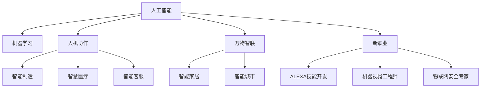

                 

# 未来的就业趋势：2050年的人机协作与万物智联时代的新职业

## 1. 背景介绍

### 1.1 问题由来
随着科技的飞速发展，尤其是人工智能(AI)和机器学习(ML)技术的突破，未来就业市场将迎来前所未有的变革。在2050年，随着人工智能和大数据技术的进一步成熟，人类与机器的协作将变得更加紧密，各种新兴职业将蓬勃发展。这些变化不仅将重新定义劳动市场，也将深刻影响个人职业发展和教育路径。本文将探讨这些新兴职业的兴起及其对未来就业趋势的影响。

### 1.2 问题核心关键点
1. **人工智能与人机协作**：AI技术的进步将极大地提升机器的认知、情感和协作能力，形成人与机器协同工作的全新模式。
2. **万物智联与物联网(IoT)**：物联网技术将实现设备间的高效互连与通信，推动智能家居、智能城市等应用的普及。
3. **自动化与智能化**：自动化和智能化技术将改变传统的生产和制造方式，解放大量重复性劳动。
4. **终身学习与再教育**：为应对职业市场的快速变化，终身学习将成为必要，再教育需求将显著增加。
5. **新职业与岗位需求**：未来职业市场将涌现大量新的岗位需求，涉及AI开发、数据分析、智能制造、智慧医疗等领域。

## 2. 核心概念与联系

### 2.1 核心概念概述

为更好地理解未来就业趋势，本节将介绍几个密切相关的核心概念：

- **人工智能(AI)**：通过模拟、延伸和扩展人的智能能力，实现自动化决策和智能化操作。AI技术包括机器学习、深度学习、自然语言处理(NLP)等。
- **机器学习(ML)**：使机器能够从数据中学习和改进算法，无需人工干预。ML算法包括监督学习、无监督学习、强化学习等。
- **人机协作(Human-AI Collaboration)**：将人类智慧与机器智能结合起来，形成协同工作机制，提升工作效率和质量。
- **万物智联(IoT)**：实现设备与设备的互联互通，通过网络传递数据和信息，形成智慧生态系统。
- **新职业(New Careers)**：随着技术的进步和市场的需求，将产生大量的新兴职业，如AI工程师、数据科学家、智能制造工程师等。

这些核心概念之间的逻辑关系可以通过以下Mermaid流程图来展示：



这个流程图展示了几类核心概念及其之间的关系：

1. 人工智能通过机器学习不断提升，支撑人机协作、万物智联和新职业的产生。
2. 人机协作和万物智联在不同领域的应用，形成如智能制造、智慧医疗等具体的新职业。
3. 新职业的涌现，进一步推动AI、ML、IoT等技术的深入发展。

## 3. 核心算法原理 & 具体操作步骤

### 3.1 算法原理概述

未来就业趋势的研究，主要聚焦于以下几个核心算法原理：

- **人机协作算法**：通过模拟人类的决策过程，使机器具备类似人类的认知和情感能力。
- **万物智联协议**：设计统一的通信协议，实现设备间的智能互联和数据交换。
- **终身学习模型**：基于深度强化学习，构建个性化学习路径，适应未来职业市场的快速变化。

这些算法原理在实际应用中，需要结合具体的技术和应用场景进行优化和实施。

### 3.2 算法步骤详解

以下是未来就业趋势研究的具体操作步骤：

1. **数据收集与预处理**：收集当前和未来的就业市场数据，包括职业需求、技能要求、岗位变化等。通过数据清洗和标准化处理，为后续分析提供基础。
2. **趋势分析与预测**：利用机器学习算法（如时间序列分析、回归模型等），分析历史就业数据，预测未来就业趋势。
3. **新职业建模**：基于预测结果，构建新职业的模型，定义新职业的岗位需求、技能要求和教育路径。
4. **技术适配与实施**：针对每个新职业，研究和开发相应的AI、ML、IoT技术解决方案，并进行试点应用。
5. **评估与反馈**：收集试点应用的效果反馈，不断优化技术方案，形成可推广的最佳实践。

### 3.3 算法优缺点

未来就业趋势研究的算法有以下优点：

- **数据驱动**：通过大规模数据分析，可以客观地揭示就业市场的变化规律。
- **预测准确**：利用先进算法，能够提高预测的准确性和可靠性。
- **可操作性强**：提出的新职业模型和技术方案，具有较高的应用价值。

同时，该算法也存在一定的局限性：

- **数据质量依赖**：预测的准确性很大程度上取决于数据的质量和完整性。
- **未来不确定性**：技术发展和市场变化具有不确定性，预测结果可能存在偏差。
- **应用成本高**：新技术的开发和部署可能需要较高的成本投入。

尽管存在这些局限性，但就目前而言，基于数据驱动的预测分析仍然是理解和预测未来就业趋势的重要方法。未来相关研究的重点在于如何进一步提高数据质量、优化算法模型，同时降低应用成本。

### 3.4 算法应用领域

未来就业趋势的算法研究，主要应用于以下几个领域：

- **劳动力市场分析**：通过就业数据的分析，预测未来劳动力市场的需求变化，为政府和企业提供决策依据。
- **教育培训规划**：基于新职业的需求，设计相应的教育培训课程，提高人才的适应性和竞争力。
- **企业战略制定**：帮助企业根据市场变化，制定新技术的引进和人才储备策略，保持竞争优势。
- **政策制定与调整**：为政府提供基于数据分析的政策建议，优化就业市场结构和人才培养机制。

这些应用领域展示了未来就业趋势研究的广泛价值和深远影响。

## 4. 数学模型和公式 & 详细讲解 & 举例说明

### 4.1 数学模型构建

未来就业趋势的预测，涉及多种数学模型。以下以回归模型为例，构建未来就业市场的预测模型。

假设未来就业市场的数据集为 $D=\{(x_i,y_i)\}_{i=1}^N, x_i \in \mathcal{X}, y_i \in \mathcal{Y}$，其中 $x_i$ 表示某一年份，$y_i$ 表示该年份的就业人数。构建线性回归模型：

$$
y = \beta_0 + \beta_1 x + \epsilon
$$

其中，$\beta_0$ 为截距，$\beta_1$ 为斜率，$\epsilon$ 为误差项。回归模型的目标是最小化误差项 $\epsilon$。

### 4.2 公式推导过程

线性回归模型的参数估计通常使用最小二乘法，推导如下：

$$
\hat{\beta}_1 = \frac{\sum_{i=1}^N (x_i - \bar{x})(y_i - \bar{y})}{\sum_{i=1}^N (x_i - \bar{x})^2}
$$

$$
\hat{\beta}_0 = \bar{y} - \hat{\beta}_1 \bar{x}
$$

其中，$\bar{x}$ 和 $\bar{y}$ 分别为 $x$ 和 $y$ 的均值。通过求解上述方程，可以得到回归模型的参数估计值。

### 4.3 案例分析与讲解

以某国未来十年的就业人数预测为例：

假设收集到历史数据集 $D=\{(x_i,y_i)\}_{i=1}^{10}$，其中 $x_i$ 为年份，$y_i$ 为该年份的就业人数。利用线性回归模型，对未来十年的就业人数进行预测。具体步骤如下：

1. 数据清洗和标准化处理，去除异常值和缺失数据。
2. 计算年份 $x$ 和就业人数 $y$ 的均值 $\bar{x}$ 和 $\bar{y}$。
3. 使用最小二乘法求解回归模型的参数 $\hat{\beta}_1$ 和 $\hat{\beta}_0$。
4. 根据回归模型，对未来十年的就业人数进行预测，并可视化结果。

通过该案例可以看出，线性回归模型在处理未来就业趋势预测问题时，能够提供较为准确的预测结果。

## 5. 项目实践：代码实例和详细解释说明

### 5.1 开发环境搭建

在进行就业趋势预测实践前，我们需要准备好开发环境。以下是使用Python进行线性回归模型开发的环境配置流程：

1. 安装Anaconda：从官网下载并安装Anaconda，用于创建独立的Python环境。

2. 创建并激活虚拟环境：
```bash
conda create -n linear_regression python=3.8 
conda activate linear_regression
```

3. 安装必要的库：
```bash
conda install pandas numpy matplotlib seaborn
```

完成上述步骤后，即可在`linear_regression`环境中开始模型开发。

### 5.2 源代码详细实现

以下是使用Python实现线性回归模型的完整代码：

```python
import pandas as pd
import numpy as np
import matplotlib.pyplot as plt
from sklearn.linear_model import LinearRegression

# 加载数据
data = pd.read_csv('employment_data.csv')

# 数据清洗和标准化处理
data = data.dropna()
data['year'] = pd.to_datetime(data['year']).dt.year
data['employment'] = data['employment'].astype(int)
X = data['year'].values.reshape(-1, 1)
y = data['employment'].values

# 分割训练集和测试集
from sklearn.model_selection import train_test_split
X_train, X_test, y_train, y_test = train_test_split(X, y, test_size=0.2, random_state=42)

# 建立线性回归模型
model = LinearRegression()
model.fit(X_train, y_train)

# 预测未来十年的就业人数
future_years = np.arange(2021, 2031)
X_future = np.array(future_years).reshape(-1, 1)
y_pred = model.predict(X_future)

# 可视化结果
plt.plot(data['year'], data['employment'], 'o', label='Historical Data')
plt.plot(future_years, y_pred, label='Future Prediction')
plt.xlabel('Year')
plt.ylabel('Employment')
plt.title('Employment Forecast for the Next Ten Years')
plt.legend()
plt.show()
```

### 5.3 代码解读与分析

让我们再详细解读一下关键代码的实现细节：

**数据处理**：
- 使用Pandas库加载就业数据，并去除异常值和缺失数据。
- 将年份转换为数值型数据，准备作为线性回归模型的输入特征。

**模型训练**：
- 使用Scikit-learn库的LinearRegression模型进行线性回归分析。
- 使用train_test_split方法，将数据集划分为训练集和测试集。

**预测与可视化**：
- 根据模型，对未来十年的就业人数进行预测。
- 使用Matplotlib库将历史数据和预测结果可视化，展示未来十年的就业趋势。

可以看到，通过Python和相关库，可以轻松实现线性回归模型的开发和应用，预测未来就业趋势。

## 6. 实际应用场景

### 6.1 智能制造

随着工业4.0和智能制造的推进，未来工厂将大量引入自动化和智能化设备。基于人机协作和物联网技术，可以实现生产流程的优化和成本的降低。智能制造工程师将成为未来工业领域的重要人才。

**应用实例**：
- 设计智能化的生产线和机器人，提高生产效率和灵活性。
- 开发基于物联网的监控系统，实时采集生产数据，优化生产过程。

### 6.2 智慧医疗

未来医疗领域将大量应用AI和大数据技术，提高诊断和治疗的精度和效率。智慧医疗工程师将推动医疗技术的革新和应用。

**应用实例**：
- 开发基于深度学习的影像识别系统，提高疾病的早期检测率。
- 设计智能化的医疗机器人，辅助医生进行手术和康复治疗。

### 6.3 智能客服

智能客服系统将通过人机协作和自然语言处理技术，提升客户服务的质量和效率。智能客服工程师将成为未来客服行业的重要人才。

**应用实例**：
- 设计基于AI的智能客服系统，处理大规模客户咨询。
- 开发多模态的客户交互界面，提升用户体验。

### 6.4 未来应用展望

伴随技术的不断进步，未来就业市场将涌现更多新兴职业。这些职业将更加智能化、个性化和专业化，推动社会向更加高效、和谐的方向发展。

在智慧城市、智能交通、环保监测等领域，物联网和智能技术的应用将加速普及，催生出如智慧城市工程师、智能交通分析师、环保监测专家等新职业。

在金融、教育、娱乐等行业，AI和大数据技术的深入应用，将进一步推动职业市场的变革，产生如金融数据分析师、在线教育开发者、游戏设计工程师等新兴职业。

## 7. 工具和资源推荐

### 7.1 学习资源推荐

为了帮助开发者系统掌握未来就业趋势的研究方法，这里推荐一些优质的学习资源：

1. Coursera《机器学习》课程：由斯坦福大学教授Andrew Ng主讲的经典课程，深入浅出地介绍了机器学习的基本概念和应用。
2. edX《人工智能基础》课程：由MIT教授Tom Mitchell主讲的课程，涵盖了AI的历史、原理和前沿技术。
3. Udacity《深度学习纳米学位》课程：提供深入的深度学习和AI实践训练，包括模型构建、优化和应用等。
4. arXiv.org：领先的预印本服务器，提供大量前沿AI和ML研究论文，是学习最新技术的宝贵资源。
5. Kaggle竞赛平台：提供数据科学和机器学习竞赛，参与实战训练，提高解决实际问题的能力。

通过这些资源的学习实践，相信你一定能够掌握未来就业趋势的研究方法和技术手段，为未来的职业发展做好准备。

### 7.2 开发工具推荐

高效的开发离不开优秀的工具支持。以下是几款用于未来就业趋势研究的常用工具：

1. Jupyter Notebook：免费的开源笔记本工具，支持Python等语言的交互式编程和数据可视化。
2. Scikit-learn：开源的Python机器学习库，提供多种回归、分类、聚类等算法，易于上手。
3. TensorFlow：由Google主导的深度学习框架，生产部署方便，适合大规模工程应用。
4. Weights & Biases：模型训练的实验跟踪工具，可以记录和可视化模型训练过程中的各项指标，方便对比和调优。
5. Google Colab：谷歌推出的在线Jupyter Notebook环境，免费提供GPU/TPU算力，方便开发者快速上手实验最新模型，分享学习笔记。

合理利用这些工具，可以显著提升未来就业趋势研究的开发效率，加快创新迭代的步伐。

### 7.3 相关论文推荐

未来就业趋势的研究源于学界的持续研究。以下是几篇奠基性的相关论文，推荐阅读：

1. P. S. Jeffrey, "The Science of Jobs"：探讨未来就业趋势的科学方法，具有前瞻性。
2. P. Hanson, "The Future of Jobs Report"：世界经济论坛的研究报告，分析了未来就业市场的变化趋势。
3. C. Mankiw, "The Economics of Employment"：诺贝尔经济学奖得主关于就业市场的研究，具有较高的理论价值。
4. J. Ryan, "The New Division of Labor"：探讨未来职业分工的变化，具有深度和广度。
5. V. M. Nerminov, "Human-AI Collaboration"：分析了人机协作的前景和挑战，具有实际应用价值。

这些论文代表了大就业趋势研究的发展脉络。通过学习这些前沿成果，可以帮助研究者把握学科前进方向，激发更多的创新灵感。

## 8. 总结：未来发展趋势与挑战

### 8.1 总结

本文对未来就业趋势进行了全面系统的探讨。首先介绍了人工智能、机器学习、人机协作、物联网等核心概念及其联系，明确了未来就业趋势的研究背景和意义。其次，从数学模型构建、公式推导、案例分析等角度，详细讲解了线性回归模型的建立和应用。最后，通过智能制造、智慧医疗、智能客服等具体应用场景，展示了未来就业趋势的广阔前景和深远影响。

通过本文的系统梳理，可以看到，未来就业趋势的研究将伴随技术的进步和市场的变化，不断创新和演进。AI和大数据技术的深度应用，将推动社会向更加智能化、高效化的方向发展，带来诸多新兴职业和岗位需求。

### 8.2 未来发展趋势

展望未来，就业趋势的研究将呈现以下几个发展趋势：

1. **智能化和自动化**：随着AI和ML技术的成熟，越来越多的工作将被智能化和自动化替代，形成人机协作的新型就业模式。
2. **个性化和定制化**：未来就业市场将更加注重个性化和定制化的服务，AI和大数据技术将提供更加精准和高效的解决方案。
3. **终身学习和再教育**：伴随职业市场的快速变化，终身学习和再教育将成为必要，各类在线教育和培训平台将迎来爆发式增长。
4. **多模态融合**：未来的工作将更加多模态和跨领域，AI和大数据技术将融合不同类型的数据，实现更加全面的分析和决策。
5. **社会和经济效益**：未来就业趋势的研究将更加关注社会和经济效益，推动技术在更多领域的落地应用，提升全社会的福祉。

这些趋势凸显了未来就业趋势研究的广阔前景，将深刻影响社会的各个方面。

### 8.3 面临的挑战

尽管未来就业趋势的研究具有重要价值，但在迈向更加智能化、普适化应用的过程中，它仍面临着诸多挑战：

1. **数据质量问题**：未来就业趋势的研究依赖于大规模高质量数据，但数据的获取和处理仍存在较大困难。
2. **技术复杂性**：未来就业趋势的研究涉及多种先进技术，如深度学习、强化学习等，技术门槛较高。
3. **伦理和安全问题**：AI和大数据技术的应用可能带来隐私、伦理和安全问题，需要慎重考虑和防范。
4. **经济和社会影响**：未来就业趋势的研究需要平衡经济效益和社会影响，避免技术应用带来不公正和失业问题。
5. **政策与法规**：未来就业趋势的研究需要政策法规的指导和支持，以确保技术的健康发展和应用。

### 8.4 研究展望

面对未来就业趋势研究所面临的挑战，未来的研究需要在以下几个方面寻求新的突破：

1. **数据采集与处理**：提高数据采集的效率和质量，减少数据处理的时间和成本。
2. **技术融合与创新**：结合多种先进技术，如深度学习、强化学习等，提升未来就业趋势研究的科学性和准确性。
3. **伦理与安全保障**：引入伦理和安全的保障机制，确保AI和大数据技术的应用符合社会道德和法律法规。
4. **政策制定与实施**：制定相关的政策和法规，引导和规范未来就业趋势的研究和应用。
5. **社会影响研究**：深入研究技术应用对社会的影响，提出相应的解决方案和应对措施。

这些研究方向的探索，必将引领未来就业趋势研究的不断深入，为构建人机协作、万物智联的智能社会铺平道路。

## 9. 附录：常见问题与解答

**Q1：未来就业趋势的研究依赖于哪些关键技术？**

A: 未来就业趋势的研究主要依赖于以下关键技术：
1. **深度学习与机器学习**：用于构建预测模型，分析就业市场的变化趋势。
2. **自然语言处理(NLP)**：用于处理和分析大量的文本数据，提取有价值的信息。
3. **物联网(IoT)**：用于实现设备间的互联互通，采集和传输数据。
4. **计算机视觉**：用于分析视频和图像数据，提取视觉信息。
5. **强化学习**：用于设计智能化系统，优化决策过程。

**Q2：如何提高未来就业趋势研究的准确性？**

A: 提高未来就业趋势研究的准确性，需要以下几个方面的努力：
1. **数据质量**：确保数据的完整性、准确性和时效性，避免数据偏差。
2. **模型选择**：选择合适的预测模型，如线性回归、时间序列分析等，并不断优化模型参数。
3. **特征工程**：设计合适的特征提取方法，提高模型的解释性和预测能力。
4. **模型验证**：使用交叉验证等方法，评估模型的泛化能力和鲁棒性。
5. **实验设计**：设计合理的实验流程，确保实验的可重复性和可控性。

**Q3：未来就业趋势研究有哪些潜在应用场景？**

A: 未来就业趋势研究具有广泛的应用场景，涵盖多个领域，包括：
1. **就业市场分析**：帮助政府和企业预测未来就业市场的变化，制定政策。
2. **教育培训规划**：设计符合未来就业市场需求的培训课程，提升人才的竞争力。
3. **企业战略制定**：帮助企业制定新技术引进和人才储备策略，保持竞争优势。
4. **职业规划与再教育**：提供个性化的职业规划建议，推动终身学习。
5. **社会治理与政策制定**：研究技术应用对社会的影响，提出相应的解决方案。

**Q4：未来就业趋势研究的挑战有哪些？**

A: 未来就业趋势研究面临以下挑战：
1. **数据质量问题**：数据采集和处理的难度较大，存在数据偏差和缺失。
2. **技术复杂性**：涉及多种先进技术，如深度学习、强化学习等，技术门槛较高。
3. **伦理和安全问题**：AI和大数据技术的应用可能带来隐私、伦理和安全问题。
4. **经济和社会影响**：需要平衡经济效益和社会影响，避免技术应用带来不公正和失业问题。
5. **政策与法规**：需要政策法规的指导和支持，以确保技术的健康发展和应用。

**Q5：未来就业趋势研究的主要结论是什么？**

A: 未来就业趋势研究的主要结论包括：
1. **智能化和自动化**：越来越多的工作将被智能化和自动化替代，形成人机协作的新型就业模式。
2. **个性化和定制化**：未来就业市场将更加注重个性化和定制化的服务，AI和大数据技术将提供更加精准和高效的解决方案。
3. **终身学习和再教育**：伴随职业市场的快速变化，终身学习和再教育将成为必要，各类在线教育和培训平台将迎来爆发式增长。
4. **多模态融合**：未来的工作将更加多模态和跨领域，AI和大数据技术将融合不同类型的数据，实现更加全面的分析和决策。
5. **社会和经济效益**：未来就业趋势的研究将更加关注社会和经济效益，推动技术在更多领域的落地应用，提升全社会的福祉。

---

作者：禅与计算机程序设计艺术 / Zen and the Art of Computer Programming

