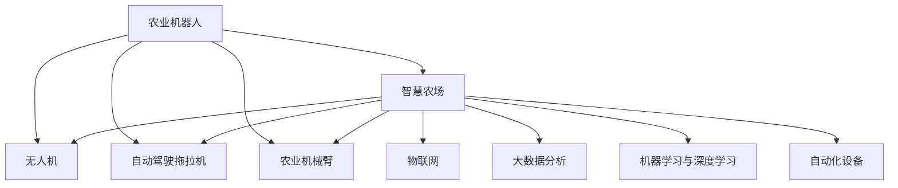

                 

# 未来的智慧农业：2050年的农业机器人与智慧农场

## 1. 背景介绍

### 1.1 问题由来

进入21世纪以来，全球人口持续增长，对食品的需求日益增加。同时，气候变化和资源短缺等问题给农业生产带来严峻挑战。农业生产需要更加智能化、自动化，以提高产量、质量、效率和可持续性。农业机器人与智慧农场的概念应运而生，它们代表了未来智慧农业的发展方向。

### 1.2 问题核心关键点

智慧农业的核心在于利用信息化技术，特别是人工智能、物联网、大数据等手段，实现农业生产的精准化、智能化和自动化。其核心关键点包括：

- 信息化：通过传感器、摄像头、无人机等设备，实时监测农业生产的环境、作物生长状态和病虫害情况，提供及时的数据支撑。
- 智能化：应用机器学习、深度学习等算法，分析海量数据，优化农业生产流程，提高生产效率。
- 自动化：借助农业机器人和自动化设备，代替人工进行耕种、施肥、喷药等劳动，降低人力成本，提升生产效率。

### 1.3 问题研究意义

智慧农业的发展对提升农业生产效率、保障食品安全、保护生态环境具有重要意义：

1. 提高农业生产效率：通过智能化管理，精确控制水肥、病虫害防治，减少浪费，提高作物产量和品质。
2. 保障食品安全：实时监测农产品质量，避免食品安全问题，确保消费者健康。
3. 保护生态环境：减少化肥、农药的使用量，降低对环境的污染和资源消耗。
4. 降低成本：自动化设备可以减少人工投入，降低人力成本。

## 2. 核心概念与联系

### 2.1 核心概念概述

为了更好地理解智慧农业的技术框架，本节将介绍几个关键概念：

- 农业机器人（Agricultural Robot）：用于农业生产过程的各种智能机器人，包括无人机、自动驾驶拖拉机、农业机械臂等。
- 智慧农场（Smart Farm）：利用信息技术和自动化设备，实现农业生产全流程的智能化管理。
- 物联网（IoT）：通过传感器、通信设备将农业生产中的各种数据接入互联网，实现数据实时采集和远程控制。
- 大数据分析：利用先进的数据处理技术，对农业生产数据进行分析和挖掘，指导农业生产决策。
- 机器学习与深度学习：应用AI算法，优化农业生产流程，提高产量和质量。
- 自动化设备：如自动灌溉系统、自动施肥系统、自动喷药系统等，提高生产效率。

这些概念之间的逻辑关系可以通过以下Mermaid流程图来展示：



这个流程图展示了农业机器人、智慧农场与相关技术之间的联系。

## 3. 核心算法原理 & 具体操作步骤
### 3.1 算法原理概述

智慧农业的核心算法原理主要基于物联网技术、大数据分析、机器学习与深度学习等。其基本流程为：

1. 数据采集：利用传感器、无人机、摄像头等设备，实时采集农业生产中的各种数据，如土壤湿度、气温、光照强度、作物生长状态、病虫害情况等。
2. 数据传输：将采集到的数据通过物联网技术，传输到云端服务器或本地服务器。
3. 数据分析：应用大数据分析技术，对大量数据进行清洗、处理和挖掘，提取有价值的信息。
4. 模型训练：利用机器学习与深度学习算法，训练智能模型，进行农作物的生长预测、病虫害识别、产量预测等。
5. 自动化控制：根据模型预测结果，通过自动化设备执行相应的农业生产任务，如喷药、施肥、灌溉等。

### 3.2 算法步骤详解

智慧农业的核心算法步骤包括：

1. 数据采集与预处理：选择合适的传感器、摄像头等设备，采集农业生产数据。对数据进行清洗、去噪、归一化等预处理。

2. 数据存储与管理：将预处理后的数据存储在云端或本地数据库中，确保数据的安全性和可靠性。

3. 数据分析与挖掘：利用大数据分析技术，对数据进行统计、分析、挖掘，提取有价值的农业生产信息。

4. 模型训练与优化：应用机器学习与深度学习算法，训练智能模型，优化模型参数，提高模型预测准确率。

5. 自动化控制与执行：根据模型预测结果，控制自动化设备，执行相应的农业生产任务。

### 3.3 算法优缺点

智慧农业的核心算法具有以下优点：

- 提升生产效率：通过精准控制农业生产流程，减少资源浪费，提高作物产量和质量。
- 降低生产成本：减少人工投入，降低人力成本，提升经济效益。
- 保障食品安全：实时监测农产品质量，确保消费者健康。
- 保护生态环境：减少化肥、农药的使用量，降低对环境的污染和资源消耗。

但同时，智慧农业的核心算法也存在一些缺点：

- 技术门槛高：需要掌握物联网、大数据、机器学习等多项技术，对人员素质要求较高。
- 设备成本高：农业机器人、传感器等设备成本较高，需要大量资金投入。
- 数据安全性：农业生产数据涉及隐私和商业机密，如何确保数据安全是一个重要问题。
- 模型鲁棒性：模型的鲁棒性和泛化能力有限，面对复杂的农业生产环境可能表现不佳。

### 3.4 算法应用领域

智慧农业的核心算法已经广泛应用于以下多个领域：

- 精准农业：通过传感器、无人机等设备，实时监测土壤、气象、作物生长状态等信息，实现精准施肥、灌溉、病虫害防治。
- 智能温室：利用物联网和自动化设备，实现温室环境的智能化管理，如自动调节光照、温度、湿度等。
- 农业机器人：用于田间作业、作物种植、果实采摘等，提高生产效率，降低劳动强度。
- 智慧灌溉系统：根据土壤湿度和作物生长状态，自动调节灌溉时间和水量，提高水资源利用效率。
- 智能农机：自动驾驶拖拉机、联合收割机等，提高农机作业的自动化程度和精准度。
- 农业气象预测：利用大数据和机器学习算法，预测气象变化趋势，指导农业生产决策。

## 4. 数学模型和公式 & 详细讲解  
### 4.1 数学模型构建

智慧农业的数学模型主要基于统计学、机器学习和深度学习。以作物生长预测为例，数学模型可以表示为：

$$
\hat{y} = f(x; \theta)
$$

其中，$x$ 为农业生产数据，$\theta$ 为模型参数，$f(\cdot)$ 为预测函数。模型训练的目标是最小化预测误差：

$$
\min_{\theta} \sum_{i=1}^n (y_i - \hat{y}_i)^2
$$

### 4.2 公式推导过程

以作物生长预测为例，常用的数学模型包括线性回归、决策树、随机森林、支持向量机、神经网络等。这里以线性回归为例，推导模型的公式。

假设农业生产数据 $x$ 包括温度、湿度、光照强度等，作物生长情况 $y$ 为产量或某个生长指标。线性回归模型可以表示为：

$$
\hat{y} = \beta_0 + \beta_1 x_1 + \beta_2 x_2 + \cdots + \beta_p x_p
$$

其中，$\beta_0, \beta_1, \beta_2, \cdots, \beta_p$ 为模型参数。

利用最小二乘法，最小化预测误差：

$$
\min_{\beta_0, \beta_1, \beta_2, \cdots, \beta_p} \sum_{i=1}^n (y_i - \beta_0 - \beta_1 x_{1i} - \beta_2 x_{2i} - \cdots - \beta_p x_{pi})^2
$$

通过求解上述优化问题，可以求得模型的最优参数。

### 4.3 案例分析与讲解

以智能温室为例，分析其核心数学模型。智能温室的数学模型包括环境参数的预测和控制：

- 环境参数预测：利用历史数据，建立时间序列模型，预测未来的温度、湿度、光照强度等。
- 环境控制：根据预测结果，调整温室的通风、供暖、照明等设备，保持最优环境状态。

以温度预测为例，可以使用ARIMA（自回归积分滑动平均模型）进行预测：

$$
\hat{y} = \alpha_0 + \alpha_1 (y_{t-1} - \mu) + \alpha_2 (y_{t-2} - \mu) + \cdots + \alpha_p (y_{t-p} - \mu)
$$

其中，$y_t$ 为温度值，$\mu$ 为均值，$\alpha_0, \alpha_1, \alpha_2, \cdots, \alpha_p$ 为模型参数。

## 5. 项目实践：代码实例和详细解释说明
### 5.1 开发环境搭建

在进行智慧农业项目开发前，需要搭建开发环境。以下是使用Python进行TensorFlow开发的流程：

1. 安装Anaconda：从官网下载并安装Anaconda，用于创建独立的Python环境。

2. 创建并激活虚拟环境：
```bash
conda create -n tf-env python=3.8 
conda activate tf-env
```

3. 安装TensorFlow：根据CUDA版本，从官网获取对应的安装命令。例如：
```bash
conda install tensorflow tensorflow-gpu -c conda-forge
```

4. 安装各类工具包：
```bash
pip install numpy pandas scikit-learn matplotlib tqdm jupyter notebook ipython
```

完成上述步骤后，即可在`tf-env`环境中开始智慧农业项目开发。

### 5.2 源代码详细实现

以下是使用TensorFlow进行智能温室温度预测的代码实现：

```python
import tensorflow as tf
from tensorflow.keras.models import Sequential
from tensorflow.keras.layers import Dense
from tensorflow.keras.optimizers import Adam
from sklearn.preprocessing import MinMaxScaler
import pandas as pd
import numpy as np

# 读取数据
data = pd.read_csv('temperature.csv')

# 数据预处理
scaler = MinMaxScaler(feature_range=(0, 1))
scaled_data = scaler.fit_transform(data['temperature'].values.reshape(-1, 1))

# 划分训练集和测试集
train_size = int(len(scaled_data) * 0.7)
test_size = len(scaled_data) - train_size
train_data, test_data = scaled_data[0:train_size,:], scaled_data[train_size:len(scaled_data),:]

# 定义模型
model = Sequential()
model.add(Dense(32, activation='relu', input_dim=1))
model.add(Dense(32, activation='relu'))
model.add(Dense(1))

# 编译模型
model.compile(optimizer=Adam(lr=0.01), loss='mean_squared_error')

# 训练模型
model.fit(train_data[:-1], train_data[1:], epochs=50, batch_size=1)

# 预测测试集
test_predict = model.predict(test_data[:-1])
test_predict = scaler.inverse_transform(test_predict)

# 输出结果
print(test_predict)
```

### 5.3 代码解读与分析

让我们再详细解读一下关键代码的实现细节：

**数据预处理**：
- 使用MinMaxScaler对温度数据进行归一化处理，保证数据在[0,1]区间内。
- 划分训练集和测试集，用于模型训练和评估。

**模型定义与编译**：
- 使用Keras定义一个简单的神经网络模型，包含2个隐层，每个隐层有32个神经元，输出层为1个神经元。
- 使用Adam优化器和均方误差损失函数，编译模型。

**模型训练与预测**：
- 使用训练集数据对模型进行训练，设定训练轮数为50，每批次只训练一个样本。
- 使用测试集数据对模型进行预测，并进行反归一化处理，得到原始的温度预测结果。

**结果输出**：
- 输出预测结果，可用于进一步的分析和应用。

## 6. 实际应用场景
### 6.1 智能温室

智能温室利用物联网和自动化设备，实现温室环境的智能化管理。通过实时监测和控制，保证作物生长的最优环境状态。

### 6.2 精准农业

精准农业通过传感器、无人机等设备，实时监测土壤、气象、作物生长状态等信息，实现精准施肥、灌溉、病虫害防治。

### 6.3 农业机器人

农业机器人用于田间作业、作物种植、果实采摘等，提高生产效率，降低劳动强度。

### 6.4 未来应用展望

未来的智慧农业将进一步智能化、自动化，涵盖更多的应用场景，如智能育种、智能物流、智能仓储等。通过大数据、AI算法和物联网技术的深度融合，智慧农业将实现更高层次的自动化和智能化。

## 7. 工具和资源推荐
### 7.1 学习资源推荐

为了帮助开发者系统掌握智慧农业的核心技术，这里推荐一些优质的学习资源：

1. 《智慧农业：原理与实践》书籍：全面介绍了智慧农业的基本原理和实践方法，包括物联网、大数据、机器学习等多项技术。

2. CS401《农业自动化与智能化》课程：介绍智慧农业的基础理论和应用技术，涵盖传感器、自动化设备、智能控制系统等多个方面。

3. Kaggle农业数据集：包含大量的农业生产数据，适合用于机器学习和深度学习的实践和竞赛。

4. TensorFlow官网资源：TensorFlow作为智慧农业开发的主流工具，其官网提供了丰富的教程和样例，适合学习和实践。

5. Udacity农业机器人课程：由Udacity开设的智慧农业专业课程，适合系统学习农业机器人和自动化技术。

通过对这些资源的学习实践，相信你一定能够全面掌握智慧农业的核心技术，并用于解决实际的农业问题。

### 7.2 开发工具推荐

高效的开发离不开优秀的工具支持。以下是几款用于智慧农业开发的常用工具：

1. TensorFlow：基于Python的开源深度学习框架，灵活动态的计算图，适合快速迭代研究。大部分智慧农业模型都有TensorFlow版本的实现。

2. PyTorch：基于Python的开源深度学习框架，灵活易用，支持自动微分，适合各种类型的深度学习任务。

3. Weights & Biases：模型训练的实验跟踪工具，可以记录和可视化模型训练过程中的各项指标，方便对比和调优。与主流深度学习框架无缝集成。

4. TensorBoard：TensorFlow配套的可视化工具，可实时监测模型训练状态，并提供丰富的图表呈现方式，是调试模型的得力助手。

5. Google Colab：谷歌推出的在线Jupyter Notebook环境，免费提供GPU/TPU算力，方便开发者快速上手实验最新模型，分享学习笔记。

合理利用这些工具，可以显著提升智慧农业开发效率，加快创新迭代的步伐。

### 7.3 相关论文推荐

智慧农业的发展源于学界的持续研究。以下是几篇奠基性的相关论文，推荐阅读：

1. 《基于深度学习的农业机器人控制系统研究》：介绍深度学习在农业机器人控制中的应用，提出了一种基于LSTM的模型，实现了对田间作业的精确控制。

2. 《智慧农场中的大数据分析与应用》：探讨智慧农场中的大数据分析技术，提出了一种基于时间序列分析的预测模型，实现了对作物生长状态的预测。

3. 《物联网技术在精准农业中的应用》：介绍物联网在精准农业中的应用，提出了一种基于物联网的实时监测系统，提高了农业生产效率。

4. 《基于机器学习的农业生产优化算法研究》：提出了一种基于机器学习的生产优化算法，通过分析大量的农业生产数据，优化了农业生产流程。

5. 《农业机器人与智慧农场的融合研究》：探讨农业机器人与智慧农场的融合，提出了一种基于AI的智能控制算法，实现了对农业机器人的精准控制。

这些论文代表了大智慧农业领域的研究进展，通过学习这些前沿成果，可以帮助研究者把握学科前进方向，激发更多的创新灵感。

## 8. 总结：未来发展趋势与挑战

### 8.1 总结

本文对智慧农业的核心技术进行了全面系统的介绍。首先阐述了智慧农业的背景和意义，明确了技术发展的目标和方向。其次，从原理到实践，详细讲解了智慧农业的核心算法和具体操作步骤，给出了智慧农业项目的完整代码实现。同时，本文还广泛探讨了智慧农业在实际应用中的各种场景，展示了技术的广泛应用前景。

通过本文的系统梳理，可以看到，智慧农业技术正在不断成熟和普及，未来将在农业生产中发挥越来越重要的作用。

### 8.2 未来发展趋势

展望未来，智慧农业的发展趋势包括：

1. 智能化程度提升：未来的智慧农业将进一步智能化，利用大数据、AI算法和物联网技术，实现更加精准和自动化的农业生产管理。

2. 多模态融合：智慧农业将融合多种数据源，如卫星遥感、气象数据、物联网数据等，提供更全面、准确的农业生产信息。

3. 多领域应用：智慧农业将涵盖农业生产全流程，包括育种、种植、收获、运输、销售等多个环节，实现全链条智能化。

4. 机器人普及：农业机器人将在智慧农业中得到广泛应用，从田间作业到物流仓储，实现全自动化操作。

5. 精准农业普及：通过传感器、无人机等设备，实现精准农业，提高作物产量和质量。

6. 数据驱动决策：智慧农业将利用大数据和机器学习算法，指导农业生产决策，提升生产效率。

以上趋势凸显了智慧农业技术的广阔前景。这些方向的探索发展，必将进一步提升农业生产效率，推动农业技术进步。

### 8.3 面临的挑战

尽管智慧农业技术已经取得了显著进展，但在迈向更加智能化、普适化应用的过程中，它仍面临诸多挑战：

1. 技术门槛高：智慧农业需要掌握多种技术，包括物联网、大数据、机器学习等，对人员素质要求较高。
2. 设备成本高：农业机器人、传感器等设备成本较高，需要大量资金投入。
3. 数据安全性：农业生产数据涉及隐私和商业机密，如何确保数据安全是一个重要问题。
4. 模型鲁棒性：智慧农业模型面对复杂的农业生产环境可能表现不佳。
5. 技术标准化：不同农业机器人和智慧农场设备之间的互联互通需要标准化的技术支持。

### 8.4 研究展望

面对智慧农业面临的挑战，未来的研究需要在以下几个方面寻求新的突破：

1. 开发更加高效、灵活的智慧农业算法，降低技术门槛，降低成本。
2. 研发更加智能、灵活的农业机器人，提高农业生产的自动化程度。
3. 研究数据安全保护技术，保障农业生产数据的隐私和安全。
4. 开发更加鲁棒的智慧农业模型，提高模型的泛化能力和适应性。
5. 推动农业技术的标准化和规范化，促进不同设备之间的互联互通。

这些研究方向将引领智慧农业技术迈向更高的台阶，为农业生产带来革命性的变革。

## 9. 附录：常见问题与解答

**Q1：智慧农业的核心算法包括哪些？**

A: 智慧农业的核心算法主要基于物联网技术、大数据分析、机器学习与深度学习等。主要包括：

1. 数据采集与预处理：利用传感器、摄像头等设备，实时采集农业生产数据，并进行清洗、去噪、归一化等预处理。
2. 数据分析与挖掘：利用大数据分析技术，对大量数据进行统计、分析、挖掘，提取有价值的农业生产信息。
3. 模型训练与优化：应用机器学习与深度学习算法，训练智能模型，优化模型参数，提高模型预测准确率。
4. 自动化控制与执行：根据模型预测结果，控制自动化设备，执行相应的农业生产任务。

**Q2：智慧农业需要哪些硬件设备？**

A: 智慧农业需要以下硬件设备：

1. 传感器：如土壤湿度传感器、气温传感器、光照传感器等，用于实时监测农业生产环境。
2. 无人机：用于田间作业、作物种植、果实采摘等，提高生产效率。
3. 自动驾驶拖拉机：用于农机作业，提高自动化程度。
4. 农业机械臂：用于精准喷药、施肥等，提高作业精度。
5. 智能温室：利用物联网和自动化设备，实现温室环境的智能化管理。
6. 智能灌溉系统：根据土壤湿度和作物生长状态，自动调节灌溉时间和水量，提高水资源利用效率。

**Q3：如何确保智慧农业数据的安全性？**

A: 确保智慧农业数据的安全性需要从多个方面入手：

1. 数据加密：采用加密技术，对敏感数据进行加密存储和传输。
2. 访问控制：采用身份认证和权限控制技术，限制数据的访问权限。
3. 数据匿名化：对数据进行去标识化处理，保护用户隐私。
4. 安全传输：使用SSL/TLS等安全协议，确保数据在传输过程中的安全。
5. 安全监控：实时监控数据访问和使用情况，及时发现和处理异常行为。

**Q4：智慧农业的核心算法有哪些优点和缺点？**

A: 智慧农业的核心算法具有以下优点：

1. 提升生产效率：通过精准控制农业生产流程，减少资源浪费，提高作物产量和质量。
2. 降低生产成本：减少人工投入，降低人力成本，提升经济效益。
3. 保障食品安全：实时监测农产品质量，确保消费者健康。
4. 保护生态环境：减少化肥、农药的使用量，降低对环境的污染和资源消耗。

但同时，智慧农业的核心算法也存在一些缺点：

1. 技术门槛高：需要掌握多种技术，对人员素质要求较高。
2. 设备成本高：农业机器人、传感器等设备成本较高，需要大量资金投入。
3. 数据安全性：农业生产数据涉及隐私和商业机密，如何确保数据安全是一个重要问题。
4. 模型鲁棒性：智慧农业模型面对复杂的农业生产环境可能表现不佳。

**Q5：智慧农业的发展方向是什么？**

A: 智慧农业的发展方向包括：

1. 智能化程度提升：利用大数据、AI算法和物联网技术，实现更加精准和自动化的农业生产管理。
2. 多模态融合：智慧农业将融合多种数据源，如卫星遥感、气象数据、物联网数据等，提供更全面、准确的农业生产信息。
3. 多领域应用：智慧农业将涵盖农业生产全流程，包括育种、种植、收获、运输、销售等多个环节，实现全链条智能化。
4. 机器人普及：农业机器人将在智慧农业中得到广泛应用，从田间作业到物流仓储，实现全自动化操作。
5. 精准农业普及：通过传感器、无人机等设备，实现精准农业，提高作物产量和质量。
6. 数据驱动决策：智慧农业将利用大数据和机器学习算法，指导农业生产决策，提升生产效率。

**Q6：如何选择合适的智慧农业硬件设备？**

A: 选择合适的智慧农业硬件设备需要考虑以下几个方面：

1. 设备的功能和性能：根据农业生产的具体需求，选择功能强大、性能稳定的设备。
2. 设备的兼容性和互操作性：选择具有良好兼容性和互操作性的设备，便于系统的集成和扩展。
3. 设备的成本和维护：考虑设备的购置成本和使用成本，选择合适的设备。
4. 设备的可靠性：选择可靠性强、故障率低的设备，保证系统的稳定运行。
5. 设备的易用性和维护性：选择易用性高、维护成本低的设备，降低使用难度。

**Q7：智慧农业的核心算法有哪些改进空间？**

A: 智慧农业的核心算法有以下改进空间：

1. 数据采集的精度和全面性：提高传感器和设备的精度和覆盖面，增强数据采集的全面性和准确性。
2. 数据分析的深度和广度：应用更高级的数据分析技术，如深度学习、因果推断等，提高数据分析的深度和广度。
3. 模型训练的效率和效果：提高模型的训练效率和预测效果，降低计算资源消耗。
4. 自动化控制的精准度和灵活性：提高自动化控制系统的精准度和灵活性，适应不同的农业生产场景。
5. 数据安全保护的技术和手段：研究更先进的数据安全保护技术，保障农业生产数据的隐私和安全。

---

作者：禅与计算机程序设计艺术 / Zen and the Art of Computer Programming

