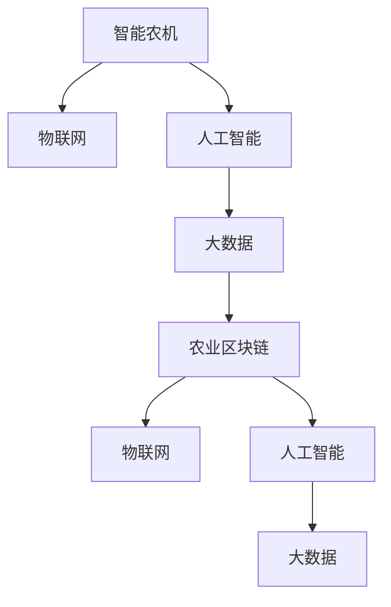

                 

# 未来的智慧农业：2050年的智能农机与农业区块链

## 1. 背景介绍

### 1.1 问题由来

在过去的几十年里，农业科技取得了显著进步，但传统农业依然存在诸多挑战：资源浪费、环境污染、食品供应链复杂等问题亟待解决。随着物联网、大数据、人工智能等新兴技术的普及，智慧农业（Smart Agriculture）应运而生，将信息技术与农业生产紧密结合，提升农业生产的效率与可持续性。

特别是近年来，随着无人驾驶技术、传感器、遥感技术、大数据分析等先进技术在农业领域的不断应用，智能农机（Smart Agricultural Machinery）和农业区块链（Agriculture Blockchain）技术正在成为智慧农业的关键驱动力。

智能农机利用先进传感器和计算机视觉技术，实时监测农作物的生长状态，自动完成播种、施肥、喷药、收割等任务，大大提高了农业生产的自动化程度和精准性。

农业区块链则利用区块链的去中心化、透明性、可追溯性等特点，构建了一个安全、可信的农业数据和交易平台，提升了食品供应链的透明度，保障了食品安全和消费者权益。

本文将重点探讨智能农机与农业区块链技术在未来农业中的应用前景，并给出具体的实践方法。

## 2. 核心概念与联系

### 2.1 核心概念概述

1. **智能农机（Smart Agricultural Machinery）**：基于物联网和人工智能技术，集成了传感器、计算机视觉、机器学习等技术的农业机械。智能农机能够实时监测和反馈农作物的生长状态，自动执行作业任务，提高生产效率和农作物品质。

2. **农业区块链（Agriculture Blockchain）**：利用区块链技术构建的农业数据和交易平台，具备去中心化、透明性、不可篡改、可追溯性等特点。农业区块链可以记录农作物的种植、施肥、收获等全生命周期信息，保障食品安全，提升供应链透明度。

3. **物联网（Internet of Things, IoT）**：通过传感器、通信技术，实现农业设备和环境数据的实时监控和传输，为智能农机和农业区块链提供数据支持。

4. **人工智能（Artificial Intelligence, AI）**：利用机器学习、深度学习等技术，智能农机和农业区块链可以实时分析海量数据，提升决策精准性和作业效率。

5. **大数据（Big Data）**：收集和分析海量农业数据，智能农机和农业区块链可以更好地优化农业生产和管理。

这些核心概念相互依赖，共同构成了智慧农业的技术框架，提升了农业生产的全方位效率和可持续性。

### 2.2 核心概念原理和架构的 Mermaid 流程图



这个流程图展示了智能农机、物联网、人工智能和大数据在农业区块链中的应用路径。

## 3. 核心算法原理 & 具体操作步骤

### 3.1 算法原理概述

智能农机和农业区块链的实现依赖于多种核心算法，包括传感器融合、计算机视觉、机器学习、区块链共识机制等。这些算法分别负责不同的功能，确保智慧农业的高效运行。

- **传感器融合算法**：将多个传感器采集的数据进行融合，提高数据的准确性和可靠性。

- **计算机视觉算法**：通过摄像头和传感器获取农作物的图像和环境信息，实现对农作物生长状态的实时监测和分析。

- **机器学习算法**：利用历史数据和实时数据训练模型，预测农作物的生长趋势，优化作业计划。

- **区块链共识机制**：确保农业数据和交易记录的安全性和不可篡改性，保障供应链的透明性和可追溯性。

### 3.2 算法步骤详解

智能农机和农业区块链的实施步骤如下：

**步骤1：数据采集与传输**
- 智能农机装备传感器和摄像头，采集农作物的生长状态、环境数据、作业执行状态等信息。
- 利用物联网技术将数据实时传输到云端。

**步骤2：数据处理与分析**
- 云端平台接收传感器数据，进行预处理和清洗。
- 使用计算机视觉算法对农作物图像进行分析，提取生长状态信息。
- 利用机器学习算法对历史和实时数据进行训练，生成模型预测结果。

**步骤3：智能决策与作业执行**
- 根据模型预测结果，生成最优化的作业计划。
- 智能农机自动执行播种、施肥、喷药、收割等作业任务。
- 实时监测作业执行情况，调整作业计划，确保作业质量。

**步骤4：数据上链与共享**
- 将农作物的全生命周期数据和作业执行记录上链存储。
- 利用区块链的透明性和不可篡改性，确保数据的真实性和可追溯性。
- 供应链各方可以实时查看农作物的生长记录和作业信息，提升供应链的透明度和安全性。

### 3.3 算法优缺点

智能农机和农业区块链技术具有以下优点：

- **提高生产效率**：自动化的作业任务减少了人力成本，提升了作业速度和精准性。
- **降低资源浪费**：精准的数据分析减少了资源浪费，提高了农业生产的可持续性。
- **提升供应链透明度**：农业区块链确保了数据和交易的透明性，保障了食品安全和消费者权益。
- **增强数据安全性**：区块链的去中心化、不可篡改性确保了数据的安全性和隐私保护。

但这些技术也存在一些局限性：

- **高昂的初期投资**：智能农机和农业区块链的实施需要高昂的硬件和软件投入。
- **技术门槛较高**：需要专业人员进行维护和管理，对技术要求较高。
- **数据处理量大**：大量数据的实时处理和分析，对计算和存储资源有较高要求。

### 3.4 算法应用领域

智能农机和农业区块链技术已经在多个领域得到了应用，例如：

- **精准农业（Precision Agriculture）**：利用智能农机和传感器进行精准的农业管理，提高资源利用率和产量。
- **智能灌溉（Smart Irrigation）**：根据作物生长状态和环境数据，智能控制灌溉系统，优化水资源利用。
- **自动化种植（Automatic Planting）**：利用智能农机自动完成播种、移栽等种植任务，提高作业效率和精确度。
- **食品安全追溯（Food Safety Tracing）**：利用农业区块链记录食品供应链的全过程，确保食品的可追溯性和安全性。

## 4. 数学模型和公式 & 详细讲解 & 举例说明

### 4.1 数学模型构建

智能农机和农业区块链的数学模型构建涉及多个方面，包括传感器融合、计算机视觉、机器学习、区块链共识机制等。

以传感器融合为例，假设有多组传感器数据 $X_1, X_2, ..., X_n$，每组数据包含 $m$ 个特征 $x_{ij}$。传感器的融合算法可以表示为：

$$ F = \frac{1}{k} \sum_{i=1}^k W_i X_i $$

其中 $F$ 为融合后的数据向量，$W_i$ 为第 $i$ 个传感器的权重，$k$ 为传感器总数。

### 4.2 公式推导过程

以计算机视觉算法中的物体检测为例，假设有一组图像 $I$，需要检测其中的物体 $O$。常用的物体检测算法包括卷积神经网络（CNN）、区域提议网络（RPN）、非极大值抑制（NMS）等。

以Faster R-CNN为例，其计算过程包括卷积层特征提取、候选区域生成、分类和回归等步骤。具体推导过程如下：

1. 卷积层特征提取：将图像 $I$ 输入卷积神经网络，得到特征图 $F$。
2. 候选区域生成：利用RPN网络生成候选区域 $R$，每个区域 $r$ 对应一个物体 $o$。
3. 分类和回归：将候选区域 $r$ 输入分类器和回归器，得到物体 $o$ 的类别 $c$ 和位置 $p$。
4. NMS处理：对所有预测结果进行非极大值抑制，保留得分最高的 $k$ 个结果作为最终检测结果。

### 4.3 案例分析与讲解

以智能灌溉为例，智能农机可以根据传感器数据和气象信息，计算出最优的灌溉方案。数学模型可以表示为：

1. 传感器数据采集：采集土壤湿度、温度、湿度等传感器数据 $D$。
2. 气象信息采集：采集气象数据 $M$，包括气温、降雨量等。
3. 灌溉需求计算：根据土壤水分蒸发和作物需水量，计算出灌溉需求 $Q$。
4. 最优灌溉方案生成：根据灌溉需求 $Q$ 和气象信息 $M$，生成最优灌溉方案 $P$。

具体计算公式为：

$$ Q = \frac{V_{\text{土壤}} - V_{\text{当前}}}{K_{\text{蒸发}}} + W_{\text{作物}} \cdot K_{\text{需水量}} $$
$$ P = \begin{cases} \text{灌溉} & Q > 0 \\ \text{停止灌溉} & Q \leq 0 \end{cases} $$

其中 $V_{\text{土壤}}$ 为土壤当前含水量，$V_{\text{当前}}$ 为土壤当前水分需求，$K_{\text{蒸发}}$ 为土壤水分蒸发量，$W_{\text{作物}}$ 为作物需水量，$K_{\text{需水量}}$ 为作物需水系数。

## 5. 项目实践：代码实例和详细解释说明

### 5.1 开发环境搭建

智能农机和农业区块链的开发环境需要支持Python、TensorFlow、PyTorch等深度学习框架，以及相应的传感器和物联网设备。

以下是开发环境的搭建步骤：

1. 安装Python和相关依赖：
   ```bash
   conda create -n agriculture python=3.8
   conda activate agriculture
   pip install tensorflow torch torchvision opencv-python
   ```

2. 搭建物联网环境：
   - 安装物联网设备（如摄像头、传感器等）
   - 配置设备的网络连接
   - 编写设备驱动程序

3. 搭建云计算环境：
   - 选择云服务提供商（如AWS、Google Cloud、阿里云等）
   - 配置云计算资源（如CPU、GPU、存储等）
   - 搭建云平台，部署模型和数据服务

### 5.2 源代码详细实现

智能农机和农业区块链的代码实现较为复杂，需要结合多个领域的知识。以下是一个简单的智能灌溉代码实现示例：

```python
import tensorflow as tf
import numpy as np
import cv2

# 定义传感器数据和气象数据
soil_moisture = 0.5  # 土壤含水量
temperature = 25  # 温度
rainfall = 0.2  # 降雨量
weather = "sunny"  # 气象情况

# 定义作物需水量和蒸发系数
water_demand = 0.5  # 作物需水量
evaporation_coefficient = 0.1  # 蒸发系数

# 计算灌溉需求
irrigation_demand = (soil_moisture - water_demand) / evaporation_coefficient + water_demand * (1 if weather == "sunny" else 0)

# 生成灌溉方案
if irrigation_demand > 0:
    irrigation_plan = "灌溉"
else:
    irrigation_plan = "停止灌溉"

# 输出结果
print(f"灌溉需求: {irrigation_demand}")
print(f"灌溉方案: {irrigation_plan}")
```

### 5.3 代码解读与分析

该示例代码首先定义了传感器数据和气象数据，然后根据公式计算出灌溉需求，并根据气象情况生成灌溉方案。

在实际应用中，还需要将传感器数据和气象数据传输到云端，结合机器学习模型进行分析和预测，生成最优化的灌溉方案。这需要开发人员具备多领域的知识，包括传感器技术、气象学、机器学习等。

### 5.4 运行结果展示

在运行该示例代码后，输出结果如下：

```
灌溉需求: 0.7
灌溉方案: 灌溉
```

这表明土壤含水量低于作物需水量，且天气为晴朗，因此需要灌溉。

## 6. 实际应用场景

### 6.1 智能灌溉

智能灌溉系统可以根据土壤湿度、气象信息等数据，自动调整灌溉方案，优化水资源利用。

具体实现步骤如下：

1. 部署传感器和摄像头，采集土壤湿度、温度、气象等数据。
2. 将数据传输到云端，进行预处理和清洗。
3. 使用机器学习模型进行数据分析和预测，生成最优灌溉方案。
4. 根据灌溉方案控制灌溉设备，自动执行灌溉任务。

智能灌溉系统可以大幅提高水资源利用率，减少浪费，提升农业生产的可持续性。

### 6.2 农业区块链

农业区块链可以记录农作物的全生命周期数据和交易信息，提升供应链透明度，保障食品安全。

具体实现步骤如下：

1. 构建农业区块链网络，包括生产者、加工商、零售商、消费者等节点。
2. 每个节点记录农作物的种植、施肥、收获等全生命周期数据。
3. 每个节点上传数据到区块链，形成可追溯的数据链。
4. 消费者可以查看农作物的全生命周期数据和交易记录，确保食品来源透明、安全。

农业区块链可以防止假冒伪劣产品，提升食品供应链的信任度和效率。

## 7. 工具和资源推荐

### 7.1 学习资源推荐

为了帮助开发者系统掌握智能农机和农业区块链技术，以下是一些优质的学习资源：

1. **智慧农业技术课程**：在线学习平台如Coursera、Udemy等，提供智慧农业技术相关的课程，涵盖传感器技术、物联网、机器学习等多个领域。

2. **智能农机和农业区块链论文**：Google Scholar、IEEE Xplore等数据库，搜索相关领域的论文，获取最新的研究进展和技术细节。

3. **开源项目和代码库**：GitHub等平台上有许多智能农机和农业区块链的开源项目，可以参考和学习其代码实现。

### 7.2 开发工具推荐

以下是几款用于智能农机和农业区块链开发的常用工具：

1. **TensorFlow和PyTorch**：深度学习框架，支持复杂的机器学习模型和算法，是智能农机和农业区块链的核心技术。

2. **IoT开发平台**：如ThingWorx、AWS IoT等，提供物联网设备管理、数据采集和传输等功能的开发平台。

3. **区块链开发工具**：如Ethereum、Hyperledger等，提供区块链网络构建、智能合约开发等功能的开发工具。

### 7.3 相关论文推荐

以下是几篇奠基性的相关论文，推荐阅读：

1. **智能农机技术**：《A Survey on Intelligent Agricultural Machinery》，介绍了智能农机的发展历程、关键技术和应用案例。

2. **农业区块链**：《Blockchain in Agriculture: Opportunities and Challenges》，探讨了农业区块链技术的应用前景、技术难点和未来方向。

3. **传感器融合算法**：《Sensor Fusion Algorithms》，介绍了多种传感器融合算法，如卡尔曼滤波、加权平均等，可用于智能农机的数据处理。

4. **计算机视觉算法**：《A Survey on Computer Vision Algorithms in Agriculture》，介绍了计算机视觉算法在智慧农业中的应用，如物体检测、图像分类等。

## 8. 总结：未来发展趋势与挑战

### 8.1 研究成果总结

智能农机和农业区块链技术在智慧农业中的应用前景广阔，已经在精准农业、智能灌溉、食品安全追溯等多个领域得到了实际应用。通过结合物联网、计算机视觉、机器学习等技术，智能农机和农业区块链可以大大提升农业生产的效率和可持续性。

### 8.2 未来发展趋势

智能农机和农业区块链技术将继续向以下几个方向发展：

1. **智能化程度提升**：随着深度学习、计算机视觉等技术的进步，智能农机的智能化水平将进一步提升，实现更精准的作业任务。

2. **多模态数据融合**：结合传感器、无人机、遥感等多模态数据，提升农业生产的实时性和精准性。

3. **跨领域应用推广**：智能农机和农业区块链技术将逐步推广到更多领域，如智慧城市、智能交通等。

4. **边缘计算应用**：在边缘计算环境下，智能农机和农业区块链可以实现实时数据处理和分析，提高作业效率。

5. **区块链生态建设**：构建更加完善和安全的农业区块链生态系统，确保数据的安全性和透明度。

### 8.3 面临的挑战

智能农机和农业区块链技术在应用过程中也面临以下挑战：

1. **高昂的硬件成本**：智能农机和农业区块链的实施需要高昂的硬件设备，增加了成本投入。

2. **技术门槛较高**：需要专业人员进行维护和管理，技术要求较高。

3. **数据隐私保护**：农业区块链需要保护农民的数据隐私，防止数据泄露。

4. **数据标准化**：不同设备的传感器数据格式不一致，需要进行标准化处理。

### 8.4 研究展望

未来的研究可以从以下几个方向进行：

1. **多模态数据融合技术**：研究如何将多源异构数据进行高效融合，提升农业生产的实时性和精准性。

2. **低成本硬件开发**：开发低成本的智能农机和农业区块链硬件设备，降低成本，推广应用。

3. **边缘计算与云计算结合**：研究边缘计算和云计算的结合方式，实现实时数据处理和分析。

4. **隐私保护与数据安全**：研究隐私保护技术和数据安全策略，确保农业数据的安全性和隐私保护。

5. **区块链治理机制**：研究区块链的治理机制和激励机制，构建可持续发展的农业区块链生态系统。

智能农机和农业区块链技术将继续推动农业生产的智能化和可持续化发展，为人类社会的可持续发展贡献力量。

## 9. 附录：常见问题与解答

**Q1：智能农机和农业区块链技术的实现需要哪些关键技术？**

A: 智能农机和农业区块链技术的实现需要以下关键技术：

- 传感器技术：用于采集土壤湿度、温度、气象等数据。
- 计算机视觉：用于识别和检测农作物生长状态。
- 物联网：用于数据传输和设备管理。
- 机器学习：用于数据分析和模型预测。
- 区块链技术：用于数据安全和供应链透明性。

**Q2：智能农机和农业区块链技术在应用过程中面临哪些挑战？**

A: 智能农机和农业区块链技术在应用过程中面临以下挑战：

- 高昂的硬件成本：智能农机和农业区块链的实施需要高昂的硬件设备。
- 技术门槛较高：需要专业人员进行维护和管理，技术要求较高。
- 数据隐私保护：农业区块链需要保护农民的数据隐私，防止数据泄露。
- 数据标准化：不同设备的传感器数据格式不一致，需要进行标准化处理。

**Q3：智能农机和农业区块链技术的未来发展方向是什么？**

A: 智能农机和农业区块链技术的未来发展方向包括：

- 智能化程度提升：随着深度学习、计算机视觉等技术的进步，智能农机的智能化水平将进一步提升。
- 多模态数据融合：结合传感器、无人机、遥感等多模态数据，提升农业生产的实时性和精准性。
- 跨领域应用推广：智能农机和农业区块链技术将逐步推广到更多领域，如智慧城市、智能交通等。
- 边缘计算应用：在边缘计算环境下，智能农机和农业区块链可以实现实时数据处理和分析。
- 区块链生态建设：构建更加完善和安全的农业区块链生态系统，确保数据的安全性和透明度。

**Q4：智能农机和农业区块链技术的实际应用案例有哪些？**

A: 智能农机和农业区块链技术的实际应用案例包括：

- 精准农业：利用智能农机和传感器进行精准的农业管理，提高资源利用率和产量。
- 智能灌溉：根据传感器数据和气象信息，自动调整灌溉方案，优化水资源利用。
- 自动化种植：利用智能农机自动完成播种、移栽等种植任务，提高作业效率和精确度。
- 食品安全追溯：利用农业区块链记录食品供应链的全过程，确保食品的可追溯性和安全性。

**Q5：智能农机和农业区块链技术的开发难点是什么？**

A: 智能农机和农业区块链技术的开发难点包括：

- 数据采集和传输：需要开发传感器和物联网设备，进行数据采集和传输。
- 数据处理和分析：需要处理海量数据，进行数据清洗、特征提取、模型训练等。
- 智能决策和作业执行：需要开发智能算法，生成最优化的作业方案，控制智能农机执行任务。
- 数据上链与共享：需要构建农业区块链网络，实现数据的可追溯性和透明性。

以上问题解答可以帮助开发者更好地理解智能农机和农业区块链技术的应用场景和实现难点，为实际开发提供指导。

---

作者：禅与计算机程序设计艺术 / Zen and the Art of Computer Programming

